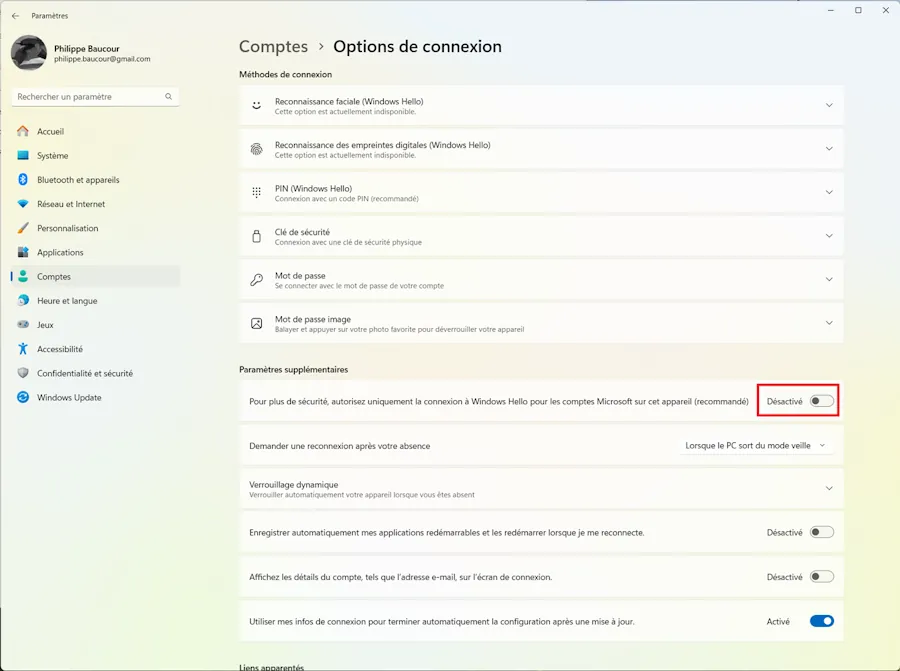

# Linux Mint Installation and Configuration
{: .no_toc }


## Table of Contents
{: .no_toc .text-delta}
- TOC
{:toc}


<!-- ##################################################### -->

## Installation
* Boot with a USB key
* Swith the keyboard to FR
* `gparted` to delete partitions
* Mint installation
* Reboot

<!-- ## Read
* https://github.com/40tude/mint_config_latitude -->


<!-- ##################################################### -->
## Update & upgrade

```
sudo apt update
sudo apt dist-upgrade
sudo apt upgrade
```


<!-- ##################################################### -->
## Enable automatic update
```
sudo apt install unattended-upgrades
dpkg-reconfigure --priority=low unattended-upgrades
```


<!-- ##################################################### -->
## Enable hibernation

* Read : https://forums.linuxmint.com/viewtopic.php?t=284100


```
free -h                                 # note the size of RAM
swapon                                  # we will use swap = RAM
sudo swapoff -a

SIZE=16                                 # 16 MB
sudo dd if=/dev/zero of=/swapfile bs=1M count=$(($SIZE * 1024))
sudo chmod 0600 /swapfile
sudo mkswap /swapfile
sudo sed -i '/swap/{s/^/#/}' /etc/fstab
sudo tee -a /etc/fstab<<<"/swapfile  none  swap  sw 0  0"

RESUME_PARAMS="resume=UUID=$(findmnt / -o UUID -n) resume_offset=$(sudo filefrag -v /swapfile|awk 'NR==4{gsub(/\./,"");print $4;}') "

if grep resume /etc/default/grub>/dev/null; then echo -e "\nERROR: Hibernation already configured. Remove the existing configuration from /etc/default/grub and add these parameters instead:\n$RESUME_PARAMS";else sudo sed -i "s/GRUB_CMDLINE_LINUX_DEFAULT=\"/GRUB_CMDLINE_LINUX_DEFAULT=\"$RESUME_PARAMS/" /etc/default/grub;fi

sudo update-grub

# Copy Paste the lines below as a whole 
sudo tee /etc/polkit-1/localauthority/50-local.d/com.ubuntu.enable-hibernate.pkla <<'EOB'
[Enable hibernate]
Identity=unix-user:*
Action=org.freedesktop.login1.hibernate;org.freedesktop.login1.handle-hibernate-key;org.freedesktop.login1;org.freedesktop.login1.hibernate-multiple-sessions
ResultActive=yes
EOB
```

* Reboot
* The answer to the line below should be `yes` (or click "the red button", `hibernate` should be available)

```
busctl call org.freedesktop.login1 /org/freedesktop/login1 org.freedesktop.login1.Manager CanHibernate
```


<!-- ##################################################### -->
## Configure TimeShift
* Watch : https://youtu.be/HKCowLHiQ8o?si=4mzAjuonjO3upx9p&t=775


<!-- ##################################################### -->
## Share a public directory with Windows 

```
sudo apt install samba -y
sudo apt install wsdd -y
sudo service wsdd status
sudo mkdir -p /home/public
sudo chmod 777 /home/public
sudo nano /etc/samba/smb.conf
```
* Comment the 2 lines below (I use to add a TAG "Philippe" to track my modifications)

```
# Philippe
# interfaces = 127.0.0.0/8 eth0
# bind interfaces only = yes
```

* Before "### Debugging/Accounting ###" add the folowing

```
# Philippe
   server min protocol = SMB3
   ntlm auth = yes
   unix charset = UTF-8
   # Disable printer
   load printers = no
   printing = bsd
   printcap name = /dev/null
   disable spoolss = yes
```

* At the end of the file add the lines below

```
# Philippe
[Docs]
   path = /home/public
   writable = yes
   guest ok = yes
   guest only = yes
   create mode = 0777
   directory mode = 0777
```

* Save & exit

```
sudo systemctl restart smbd
sudo ufw allow samba
```

* Read : https://techviewleo.com/configure-samba-file-sharing-on-linux-mint/


<!-- ##################################################### -->
## Access the Public shared directory on a WIN 11 host

### WIN11 host
1. You have a Public shared directory that you can access from another WIN client. [Read this page](https://www.40tude.fr/shared-folder-in-local-network/) if needed.
1. **WIN + I**, Accounts, Connexion Options
1. Deselect the option "Only Hello...". 

<div align="center">

</div>


### LINUX host

```
sudo apt smbclient
sudo nano /etc/samba/smb.conf 
```

* Modify smb.conf (re-read the "Share a public directory with Window" section if needed)

```
# Philippe
server min protocol = SMB3
client min protocol = SMB3       # = NT1 if your internet box requires it

```

* Save & exit

```
sudo systemctl restart smbd	
```

* You use your Microsoft credentials : `E-mail` and `Microsoft account password`

### CLI
* 192.168.1.49 is the WIN11 host ip address 

```
smbclient -L 192.168.1.49 -U philippe.XXX@YYY
Password for [philippe.XXX@YYY]:

	Sharename       Type      Comment
	---------       ----      -------
	ADMIN$          Disk      Administration à distance
	C$              Disk      Partage par défaut
	IPC$            IPC       IPC distant
	Users           Disk
Reconnecting with SMB1 for workgroup listing.
do_connect: Connection to 192.168.1.49 failed (Error NT_STATUS_RESOURCE_NAME_NOT_FOUND)
Unable to connect with SMB1 -- no workgroup available
```


```
smbclient -U philippe.XXX@YYY //192.168.1.49/Users
Password for [philippe.XXX@YYY]:
Try "help" to get a list of possible commands.
smb: \> ls
  .                                  DR        0  Sat Nov  4 15:38:20 2023
  ..                                DHS        0  Fri Nov 10 11:03:46 2023
  Default                           DHR        0  Sat Nov  4 17:57:30 2023
  desktop.ini                       AHS      174  Sat May  7 07:22:32 2022
  phili                               D        0  Fri Nov 10 11:03:49 2023
  Public                             DR        0  Sat Nov  4 15:29:17 2023

		249823487 blocks of size 4096. 225382835 blocks available
```


### GUI
<!--  -->

<div align="center">

</div>


### Read 
* https://www.40tude.fr/shared-folder-in-local-network/
* https://losst.pro/en/how-to-access-windows-share-in-linux
* https://forum.manjaro.org/t/access-windows-11-shared-folder-from-manjaro-kde-linux/113213/5
* https://www.malekal.com/comment-utiliser-smbclient-exemples/
* https://4sysops.com/archives/the-smb-protocol-all-you-need-to-know/


<!-- ##################################################### -->
## Enable SSH
```
sudo apt install openssh-server -y
sudo systemctl is-enabled ssh
# si besoin
sudo systemctl enable ssh 
sudo systemctl start ssh
sudo systemctl status ssh
# doit être running

# firewall
sudo ufw allow ssh

# si besoin mais normalement il est running
sudo systemctl is-enabled ssh
sudo ufw enable
sudo ufw reload
sudo ufw status verbose # si besoin
```

<!-- ##################################################### -->
## Install Git

```
sudo apt install git -y
git config --global user.name "MON NOM"            # avec les guillemets
git config --global user.email xxx@gmail.com
git config --list
```

<!-- ##################################################### -->
## Install Meslo Fonts

* Aller sur : https://www.nerdfonts.com/font-downloads
* Recupérer Meslo
* Décompresser le zip dans un répertoire Meslo
* Supprimer le readme.md et le fichier LICENSES.txt du répertoire
* Créer un répertoire ~/.local/share/fonts
* Y copier le répertoire Meslo 
* Reconstruire le cache des fonts

```
# Si Meslo.zip est dans ~/Téléchargements
cd ~/Téléchargements
unzip Meslo.zip -d ./Meslo
rm ./Meslo/LICENCE.txt
rm ./Meslo/README.md
mkdir -p ~/.local/share/fonts
mv ./Téléchargements/Meslo ~/.local/share/fonts
fc-cache -fv
```

* Lire : https://www.baeldung.com/linux/install-multiple-fonts


<!-- ##################################################### -->
## Install Oh My Posh

```
curl -s https://ohmyposh.dev/install.sh | sudo bash -s
```

* Update terminal preferences and use `MesloLGM Nerd Font`
* Not specific to the font :
  * Font size = 11
  * Windows size = 144 x 34 

```
oh-my-posh get shell
```

* The instructions here are specific to bash
* Edit ~/.bashrc
* Add, at the very end

```
eval "$(oh-my-posh init bash)"
```

* Save & Close
* Reload the profile

```
exec bash
```

* Read : https://ohmyposh.dev/docs/installation/linux


<!-- ##################################################### -->
## Install VSCode
```
sudo apt install dirmngr ca-certificates software-properties-common apt-transport-https -y

curl -fSsL https://packages.microsoft.com/keys/microsoft.asc | sudo gpg --dearmor | sudo tee /usr/share/keyrings/vscode.gpg > /dev/null

echo deb [arch=amd64 signed-by=/usr/share/keyrings/vscode.gpg] https://packages.microsoft.com/repos/vscode stable main | sudo tee /etc/apt/sources.list.d/vscode.list

sudo apt update
sudo apt install code
```
* If Oh my Posh is installed
  * Open a Terminal
  * Select Configure Terminal Settings in the drop down list (close to the +)
  * Search for "font"
  * In the Terminal > Integrated > Font Family field, type `MesloLGM Nerd Font`


<!-- ##################################################### -->
## Install Brave
```
sudo apt install curl
sudo curl -fsSLo /usr/share/keyrings/brave-browser-archive-keyring.gpg https://brave-browser-apt-release.s3.brave.com/brave-browser-archive-keyring.gpg
echo "deb [signed-by=/usr/share/keyrings/brave-browser-archive-keyring.gpg] https://brave-browser-apt-release.s3.brave.com/ stable main"|sudo tee /etc/apt/sources.list.d/brave-browser-release.list
sudo apt update
sudo apt install brave-browser
```
* Read : https://brave.com/linux/


<!-- ##################################################### -->
## Install Chrome
* S'assurer que le gestionnaire synaptic n'est PAS ouvert

```
# installez la clé de signature de package
wget -q -O - https://dl-ssl.google.com/linux/linux_signing_key.pub | sudo apt-key add -

# ajouter le référentiel Chrome 
sudo add-apt-repository "deb http://dl.google.com/linux/chrome/deb/ stable main"

sudo apt update
sudo apt install google-chrome-stable -y
```


<!-- ##################################################### -->
## Create a shortcut keys to launch an app 

* **CTRL + ALT + T** already exists for terminal
* You want to add, **CTRL + ALT + G** for Google Chrome 

1. WIN key, find the app icon, right click, select "Add to Desktop"
1. **WIN + D**, right click the icon, select "Properties"
1. Basic Tab, copy the content of "Command TextBox"
1. WIN key, launch the Keyboard app, in the top of the GUI, click the "Shortcuts" tab 
1. Bottom of the GUI, press "Add custom shortcuts"
1. Add the name of the app, paste the command, click "Add"
1. In the "key shortcuts" list, select one of the unasigned entry, press the keys (CTRL + ALT + G for example)
1. You can then test the shortcut right away
1. Once satisfied, close the Keyboard app
1. **WIN + D**, deleted the icon of the app from the Desktop


<!-- ##################################################### -->
## Enable SSH 

```
cd ~
mkdir .ssh
cd .ssh
ssh-keygen # Enter à chaque question posée
cat id_rsa.pub
```

### Connect to GitHub with ssh 
* Copier la sortie du `cat` précédent
* Aller sur GitHub pour ajouter la clé publique au compte
* Cliquer sur profil en haut à droite
* Settings dans la liste
* À gauche de la page chercher SSH & GPG
* Click bouton New SSH Key
* Coller la clé publique

* Voir : https://youtu.be/3O4ZmH5aolg?si=OVWCEeq_0nj-UExM&t=359


<!-- ##################################################### -->
## Install PowerShell
```
sudo apt install dirmngr ca-certificates software-properties-common gnupg gnupg2 apt-transport-https curl -y

curl -fsSL https://packages.microsoft.com/keys/microsoft.asc | gpg --dearmor | sudo tee /usr/share/keyrings/powershell.gpg > /dev/null

echo deb [arch=amd64,armhf,arm64 signed-by=/usr/share/keyrings/powershell.gpg] https://packages.microsoft.com/ubuntu/22.04/prod/ jammy main | sudo tee /etc/apt/sources.list.d/powershell.list

sudo apt update
sudo apt install powershell -y

pwsh
Update-Help
exit
```
To use PowerShell rather than bash
```
cat /etc/shells
chsh -s /usr/bin/pwsh
```


<!-- ##################################################### -->
## Install Docker

```
sudo apt install docker docker-compose docker-doc docker-registry docker.io -y
sudo groupadd -f docker 
sudo usermod -aG docker $USER
newgrp docker
sudo systemctl restart docker
docker image ls
docekr --version
docker --help
```


<!-- ##################################################### -->
## Install MS Fonts
```
sudo apt install ttf-mscorefonts-installer
```


  
### List available fonts
```
fc-list
fc-list | grep Meslo
fc-list : family style | grep Meslo
fc-match -s Arial
```


<!-- ##################################################### -->
## Install Anaconda

* https://www.anaconda.com/download

```
bash Anaconda3-2023.09-0-Linux-x86_64.sh 
```

* Read the licence and answer "yes" few times
* Close and reopen the terminal
* Update conda
* Make sure everythings works

```
conda update conda
conda update -n base --all
conda info --envs  
conda list 
anaconda-navigator 
```

* Don't use "base" virtual environment
* Create and use your own

```
conda create --name env1 python=3.11.5
conda activate env1 
...
conda update -n env1 --all 
... 
conda activate base
conda remove --name env1 --all 
```

* If the display of the current conda virtual env does'nt fit the Oh my Posh prompt try this or modify the Oh my Posh theme

```  
conda config --set changeps1 False 
```


<!-- ##################################################### -->
## "Modern" Linux

### In addition to man
* Too Long, Did'nt Read
  
```
sudo apt install tldr -y
tldr --update
tldr wget
```


* https://www.oreilly.com/library/view/learning-modern-linux/9781098108939/


### ls -> eza

```
sudo mkdir -p /etc/apt/keyrings
wget -qO- https://raw.githubusercontent.com/eza-community/eza/main/deb.asc | sudo gpg --dearmor -o /etc/apt/keyrings/gierens.gpg
echo "deb [signed-by=/etc/apt/keyrings/gierens.gpg] http://deb.gierens.de stable main" | sudo tee /etc/apt/sources.list.d/gierens.list
sudo apt update
sudo apt install eza
```
* https://github.com/eza-community/eza
* https://linuxiac.com/eza-command-listing-files-in-linux/


### cat -> bat 

```
sudo apt install bat -y 

mkdir -p ~/.local/bin
ln -s /usr/bin/batcat ~/.local/bin/bat
export MANPAGER="sh -c 'col -bx | bat -l man -p'"  # once satisfied, add the line to ~/.bashrc
```

* https://github.com/sharkdp/bat
* https://www.linode.com/docs/guides/how-to-install-and-use-the-bat-command-on-linux/


### top -> btop

```
sudo apt install btop -y 
```
* Once on screen strike "m" for menu, visit the help and options
* Watch : https://youtu.be/ghWECXWi9kU?si=MNThwKisHp2yfTD7&t=170


### Others

* du -> dust : https://github.com/ibraheemdev/modern-unix
* df -> duf : https://github.com/muesli/duf
* find -> fd : https://github.com/sharkdp/fd
* grep -> ripgrep : https://github.com/BurntSushi/ripgrep
* ps -> procs : https://github.com/dalance/procs

More
* https://github.com/ibraheemdev/modern-unix


<!-- ##################################################### -->
## Create some alias

* Edit `~/.bashrc` and, at the very end, add the following : 

```
    if [ -f ~/.bash_aliases ]; then
    . ~/.bash_aliases
    fi
```

* Create `~/.bash_aliases` and edit it as follow (see previous section for `eza` and `bat`)

```
alias ls='eza -al'
alias cat='bat'
```


<!-- ##################################################### -->
## Because I can't remember

### Change Cursor
* Thèmes/Para avancés.../Souris/Yaru

### Symbolic links
* Avoid relative paths

```
ln -s /home/share/installation.md ln_installation.md           # create link in current dir
ln -s /home/share/mydoc.md /home/philippe/Bureau/ln_mydoc.md   # create link on the desktop
```

### Change the name of the host
* Edit as root /etc/hostname


<!-- ##################################################### -->
