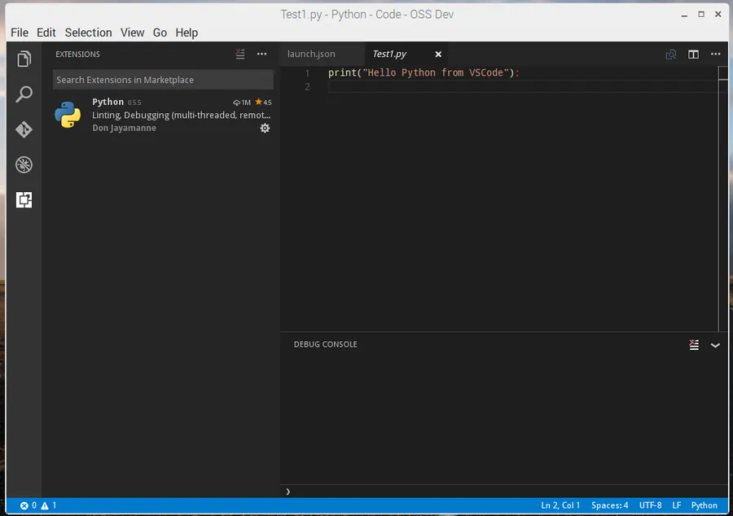

# Compiler VSCode sur Raspberry Pi


## Compilation et Installation

```bash
sudo apt-get update
sudo apt-get upgrade
```

Ensuite, en Mars 2017 voilà ce que je peux dire. Je pars d'une installation toute neuve (Raspbian Jessie + PIXEL). Ensuite il faut commencer par virer Node et Npm car ils sont trop vieux. Par exemple, avant les mises à jour, voilà ce que j'obtiens quand je vérifie la version de Node :

```bash
node -v
v0.10.29
```

Ensuite pour le remplacement voilà ce que je fais (à ce propos, il faut aller voir cette [page](https://github.com/nodesource/distributions)) :

```bash
sudo su -
apt-get remove nodered -y
apt-get remove nodejs nodejs-legacy -y
apt-get remove npm -y
curl -sL https://deb.nodesource.com/setup_7.x | sudo -E bash
apt-get install nodejs -y
exit
```

Ensuite voilà ce que je vois :

```bash
node -v
v7.7.1

npm -v
4.1.2
```

Pour que lors du ``build``, le support de ``native-keymap`` se passe bien il faut installer le paquet suivant :

```bash
sudo apt-get install libx11-dev
sudo apt-get install libxkbfile-dev
```

Ensuite on récupère les sources de la bête

```bash
cd ~
git clone https://github.com/microsoft/vscode
cd vscode
```

Avant de lancer le ``build`` il y a intérêt à libérer un maximum de mémoire. Il faut donc fermer Chromium etc.

On lance le build (13 min. sur mon RP3) avec la commande suivante :

```bash
./scripts/npm.sh install
```

Il y aura peut-être quelques Warnings mais ce n'est pas grave. Quand c'est terminé, le premier lancement de VSCode est très très long (6 min.). Ensuite c'est moins pire ensuite (20 sec.) . Il faut de saisir :

```bash
./scripts/code.sh
```

## Remarques

1. Dans le fichier ``package.json`` qui se trouve dans ``../vscode``, il faut changer la propriété ``name`` et la mettre à ``Code``. Si vous ne le faites pas ce n'est pas grave mais par la suite, si vous installez l'extension ``vscode-icons``, cette dernière ne s'installera pas correctement (elle s'installera, il n'y aura pas d'erreur mais aucune icône ne sera visible).
2. Tel que configuré, aucune extension ne sera visible dans VSCode. Il faut modifier le fichier ``product.json`` en ajoutant la section ``extensionsGallery`` à la fin. Il ne faut **pas oublier** de virgule en fin de ligne (oui ça sent le vécu...). Voir ci-dessous :


<!-- Ajouter le contenu du json ici -->


## Liens utiles :

* <http://www.duttonbiz.com/visual-studio-code-on-raspberry-pi-3/>
* <https://iotguys.wordpress.com/2016/04/17/running-and-configuring-visual-studio-code-on-raspberry-pi-2/>
* <https://github.com/Microsoft/vscode/issues/2992>
* <https://github.com/Microsoft/vscode/wiki/How-to-Contribute#build-and-run-from-source>
* <https://code.headmelted.com> (nightly build)

<div align="center">

</div>
