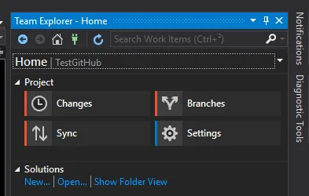
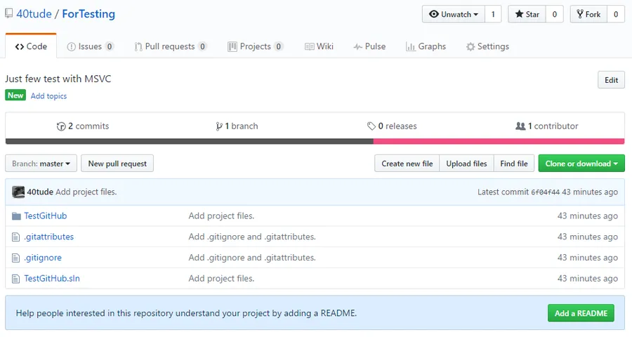

# Mon Git Survival Guide

{: .warning }
Janvier 2025. De mon côté les choses ont pas mal évolué du avec Git. Je transfère cette page vers la nouvelle version du site avec la ferme intention d'y revenir. Par sûr quelle soit vraiment utile en l'état. En attendant sa mise à jour je vous propose d'aller [lire cette page sur mon repo GitHub](https://github.com/40tude/01_github_issues_fixed).


## Introduction
Je mets ici quelques commandes et remarques qui me permettent de survivre avec Git, Github, posh-git, MSVC... Je reviendrai faire des mises à jour au fur et à mesure


## Installation Linux & Windows

Linux :

```bash
apt-get install git
```

Windows :

* Download de l'installeur à partir du [site git](https://git-scm.com/download/win)
* [Installer posh-git](https://www.40tude.fr/poshgit/) (permet d'avoir un prompt sympa sous PowerShell)

## Configuration à minima

Quand Git est installé, dans un terminal, pour s'assurer que tout va bien, saisir :

```
git
```

Ensuite saisir :

```
git config --global user.name "MON NOM"
```

Enfin, saisir :

```
git config --global user.email "ADR EMAIL"
```

On peu aussi saisir

```
git config --global init.defaultBranch main

```
En fait par défaut git crée une branche "master" dont le nom n'est plus dans l'air du temps (des conneries...) ce qui peut poser des soucis lorsqu'on crée un repo depuis VSCode qui lui, va créer une branch "main". 

Je suis d'accords tout ça c'est des conneries, "master en servant" c'est plutôt cool, mais bon autant se simplifier la vie dès le départ.

<div align="center">
<iframe width="560" height="315" src="https://www.youtube.com/embed/IsvfofcIE1Q?si=-kN_5FRF5B4D3y-f" title="YouTube video player" frameborder="0" allow="accelerometer; autoplay; clipboard-write; encrypted-media; gyroscope; picture-in-picture; web-share" referrerpolicy="strict-origin-when-cross-origin" allowfullscreen></iframe>
</div>

Prendre ensuite le temps de lire cette [page](http://rogerdudler.github.io/git-guide/).


## Récupérer un projet depuis GitHub

Dans PowerShell, dans le répertoire où on peut créer un sous-répertoire pour y héberger les sources du projet récupéré, taper "git clone". Exemple :

```powershell
git clone https://github.com/40tude/A-Tour-Of-Cpp.git
```

## Faire des modifications dans les fichiers

...

## Faire un commit

```
git commit -am "Relecture et typos"
```

Bien noter le "a" de "-am" qui "commit" tous le fichiers modifiés


## Faire un push sur le serveur distant GitHub

```powershell
git push master origin
```

## Mettre à jour le projet

```powershell
git fetch origin
```


## Git avec une solution Visual Studio

### Version télégraphique

1. Créer un dépôt sur GitHub et copier son URL
2. Team Explorer, Sync, Publish Git Repo, coller l'URL, Publish


### Version détaillée

* Créer un repository (dépôt) sur GitHub

<div align="center">

</div>


* Lancer Visual Studio.
  + En ce qui me concerne, en Mars 2017, c'est Visual Studio 2017 RC

### Note
On est le 5 Mars 2017. Plus que 2 jours avant la Release. Voir <https://launch.visualstudio.com/>

* **A faire une fois**. Bien s'assurer que le composant Git a été installé. Au pire il faut relancer Visual Studio Installer,  cliquer sur "Composants individuels" (en haut de la fenêtre) puis aller vérifier que dans la section "Outils de Code", la case "Git pour Windows" est bien cochée (peut importe que l'on ait installé Git pour Windows manuellement au préalable).
* Créer un nouveau projet dans Visual Studio. Histoire de voir comment ça se passe dans le détail je ne demande pas à créer un nouveau repository Git (voir tout en bas la case à cocher).

### Note
Oui oui je sais mon Visual Studio est en Anglais mais comme je vais pas mal sur les sites anglo saxon, c'est plus facile pour moi de suivre leurs instructions si mon environnement est identique aux leurs. Pour rappel, afin de changer la langue de Visual Studio c'est très simple. Il faut lancer Visual Studio Installer, cliquer sur "**Modifier**" puis choisir "**Modules Linguistiques**" tout en haut à droite.


Enfin bref.. Nouveau projet :

<div align="center">

</div>


* Le lancer (F5) histoire de vérifier que tout est OK.
* Dans **Solution Explorer**, clic droit sur le nom de la solution et choisir "**Ajouter la solution au contrôle de code source**"

<div align="center">

</div>


* Rien de spectaculaire mais si on va dans le répertoire de la Solution, on remarque qu'un répertoire caché ".git" a été créé ainsi que deux fichiers ".gitattributes" et ".gitignore".

<div align="center">

</div>


Ceci dit, à ce stade on a pas encore fait la liaison entre le dépôt sur GitHub et notre solution Visual Studio. De plus, on a encore rien "pousser" sur le site GitHub

* Dans l'onglet Team Explorer
  + Appuyer sur "**Home**" (l'icône maison)
  + Appuyer sur "**Settings**" (la roue crantée). Ceci n'est à faire qu'une seule fois normalement.
    - Renseigner les "**Global Settings**"
    - Pour le "**Default Repository Location**" on peut pointer vers n'importe quel répertoire. Un truc du style "./User/Documents/Mes Repos" fera très bien l'affaire. Y a aucin risque. Au pire on peut toujours y revenir.
  + Quand c'est fait, revenir aux "**Settings"** en cliquant sur la toute petite flèche bleue, en haut à droite. Ceci dit, comme pour les browsers Web, ALT + flèche de gauche marche aussi pour revenir sur ses pas.

<div align="center">

</div>


* Nouveau clic sur la flêche pour revenir sur "**Home**" (oui, oui on pouvait directement cliquer sur "**Home**")
* Retourner sur GitHub, sur le repository créé précédemment et copier l'adresse du dépôt. Il suffit de cliquer sur l'icone au bout de l'URL (https://blablabla)

<div align="center">

</div>


* Retourner dans Visual Studio et dans "**Team Explorer**" cliquer sur "**Sync**"

<div align="center">

</div>


* Cliquer tout en bas sur "**Publish Git Repo**"

<div align="center">

</div>


* Copier l'URL du dépôt dans le champs qui apparaît

<div align="center">

</div>


* Cliquer sur le bouton "**Publish**"
* C'est terminé. Au bout de une ou deux secondes on voit que la synchronisation se fait et on revient dans le "**Home**" de "**Team Explorer**"
* À ce stade, retourner sur le site GitHub. F5 pour rafraîchir la page du dépôt. On doit voir les fichiers :

<div align="center">

</div>

### Note 
On ne retrouve pas tous les fichiers ni tous les répertoires. Par exemple on envoie pas sur le dépôt le répertoire Debug de 700 Ko qui contient l'application compilée. On envoie pas non plus sur le dépôt le répertoire $Projet$/Debug de 3.5 Mo avec le header pré-compilé etc. Il est bien ce Visual Studio (pour info c'est dans le fichier .gitignore que cela se passe).


## Prise en compte de modifications (Commit) sous Visual Studio

Imaginons que je modifie le code comme suit :

```
#include "stdafx.h"
#include <iostream>

int main() {
	std::cout << "Je joue avec Git et Visual Studio" << std::endl;
}
```

Pour que le code ainsi modifié se retrouve sur GitHub il faut :

* "**Team Explorer**"
* Cliquer sur "**Home**"
* Cliquer sur "**Changes**"
* On voit alors que Visual Studio a bien remarqué que le code source TestGitHub.cpp avait été modifié (voir "**Changes**" en bas de la capture ci-dessous)

<div align="center">

</div>


* Taper un message en rapport avec les modifications apportées
* Cliquer sur le bouton "**Commit All**"
* Dans la fenêtre qui apparaît on nous dit que les changements on été sauvés localement. En effet, si on va sur GitHub, même si on rafraîchit la page du dépôt (F5) on voit qu'il n'y a rien de nouveau. À ce stade tout est encore sur le disque dur du PC. On pourrait très bien revenir sur notre code source et faire d'autres modifications.

<div align="center">

</div>


* Ici on clique sur le lien "**Sync**" et voilà ce que l'on voit :

<div align="center">

</div>


* Dans la catégorie "**Outgoing Commits**" on retrouve bien notre dernier Commit local avec son message
* Cliquer sur "**Push**"
* Quand la synchronisation est terminée, si on va sur GitHub et qu'on rafraîchit la page du code source avec F5, on retrouve bien les dernières modifications.

<div align="center">

</div>

## Divers

* git log


## Webliographie

* Lire <https://git-scm.com/book/fr/v2>
* Learn Git branching <http://learngitbranching.js.org/>
* Voir [Using Git with Visual Studio 2013 Jump Start](https://mva.microsoft.com/en-us/training-courses/using-git-with-visual-studio-2013-jump-start-8306?l=ABt74sYy_404984382)
* Voir : <https://www.youtube.com/watch?list=PL8jcXf-CLpxrw3ipflS7mujA-hM7m2YnH&v=1ieJbCFgXQs>

*La suite au prochain épisode...*

