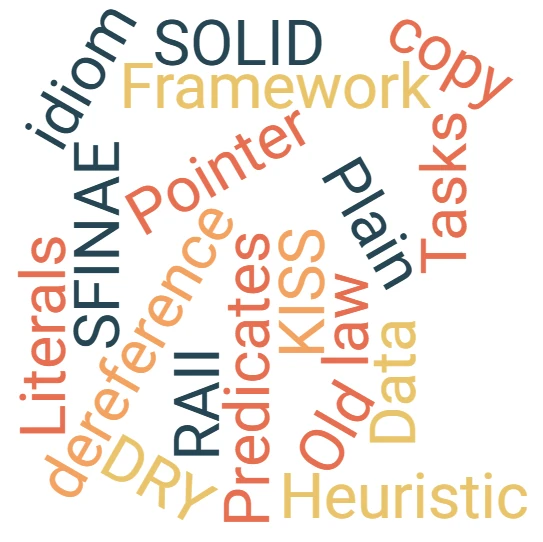

# My Computer Science Vocabulary Page
{: .no_toc }

<div align="center">

<p>Boogie Wonderland...</p>
</div>


<!-- <div align="center">

</div> -->


## Introduction
{: .no_toc }

Too often I have "problems" with computer science vocabulary. In addition, there is always something new I learn along my readings/viewings on the Web. So, I decided to start this page.

Usually Googling helps a lot to get an "answer" at the speed of light. On the other hand, working on this page, adding words, taking the time to read, copy/paste, write, summarize what I understood help me a lot.

### How does it works?
{: .no_toc }

* This is mostly for me
* This is done mostly in a [Rust]() and [C++]() contexts
* There is no goal of completeness (how could it be?)
* Entries are in alphabetical order
* Whenever possible I add the sources, links and references
* Some entries are and remains empty. This act as a reminder. Feel free to help, sharing a source of information in the [comments](https://github.com/40tude/40tude.github.io/discussions)


## Table of Contents
{: .no_toc .text-delta}
- TOC
{:toc}


## Algorithm

[Knuth,1968] A finite set of rules which gives a sequence of operations for solving a specific set of problems [and] has five important features:

1. Finiteness
1. Definiteness
1. Input
1. Output
1. Effectiveness

In the context of the C++ standard library, an algorithm is a function template operating on sequences of elements.


<!-- ###################################################################### -->
<!-- ###################################################################### -->
## Arguments and Parameters

```cpp
void MyFunction(int i, double d){
    // ...
}

void main(){
    int MyInt = 1;
    MyFunction(MyInt, 42.0);
}
```

* `i` and `d` are parameters. They are part of the definition of the function. They are part of the function signature.
* `MyInt` and `42` are arguments. Let's keep in mind that : "The arguments are given"

Moyen mnémotechnique en Français : 
* **A**rguments, **A**ppel de la fonction 
* **P**aramètres, **P**rototype de la fonction

Mnemoni in English
* **A**rguments are **A**ctuals
* **P**arameters are **P**laceholders


<!-- ###################################################################### -->
<!-- ###################################################################### -->
## Amdahl's law

The speedup of a program using multiple processors in parallel computing is limited by the time needed for the sequential fraction of the program.

For example, if a program needs 20 hours using a single processor core, and a particular portion of the program which takes one hour to execute cannot be parallelized, while the remaining 19 hours (95%) of execution time can be parallelized, then regardless of how many processors are devoted to a parallelized execution of this program, the minimum execution time cannot be less than that critical one hour. Hence the speedup is limited to at most 20×.

[http://en.m.wikipedia.org/wiki/Amdahl's_law](http://en.m.wikipedia.org/wiki/Amdahl%27s_law)


<!-- ###################################################################### -->
<!-- ###################################################################### -->
## Assignment vs Initialization

* Initialization : gives a variable an **initial** at creation time. 
* Assignment : update the value of an existing variable


<!-- ###################################################################### -->
<!-- ###################################################################### -->
## Call vs Invoke

* ?


<!-- ###################################################################### -->
<!-- ###################################################################### -->
## Concurrency

When tasks start, run and complete in overlapping time periods.

Task can be seen as a function. I can have concurrency even if I have a sigle thread of execution (this can be achieve with time slicing the thread, cooperative threading model or breaking up tasks and requeuing the tasks)

Concurrency is the basic building block that allow to get to parallelism. Also improve interactivity.

See : Parallelism, Tasks

See : https://www.youtube.com/watch?v=QIHy8pXbneI at 6:30


<!-- ###################################################################### -->
<!-- ###################################################################### -->
## Dependency Injection Framework

See : https://stackoverflow.com/questions/130794/what-is-dependency-injection

### In French 
Design principle qui consiste à fournir à un objet ses dépendances plutôt que de les créer lui-même. Au lieu qu'une classe crée les objets dont elle a besoin, on les lui injecte de l'extérieur. Ça permet :
* de réduire le couplage entre les classes,
* de faciliter les tests (ex : en injectant des mocks),
* de favoriser la réutilisation et la maintenance du code.


```python
# This is the service that fetches data
class DataFetcher:
    def fetch(self) -> str:
        # In a real app, this could fetch data from an API or database
        return "some important data"

# This class depends on DataFetcher
class ReportGenerator:
    def __init__(self, fetcher: DataFetcher):
        # The dependency is injected via the constructor
        self.fetcher = fetcher

    def generate(self) -> str:
        # Uses the injected dependency
        data = self.fetcher.fetch()
        return f"Report based on: {data}"

# We create the dependency manually and inject it
data_fetcher = DataFetcher()
report_generator = ReportGenerator(data_fetcher)

# Use the class with the injected dependency
print(report_generator.generate())
```

Exemple, par exemple en test, de remplacement de la "vraie" dépendance par une version simulée (mock).

```python
# A fake DataFetcher for testing
class FakeDataFetcher:
    def fetch(self) -> str:
        return "test data"

# Inject the fake fetcher
test_fetcher = FakeDataFetcher()
test_generator = ReportGenerator(test_fetcher)

assert test_generator.generate() == "Report based on: test data"
```


<!-- ###################################################################### -->
<!-- ###################################################################### -->
## DRY

Don't repeat yourself


<!-- ###################################################################### -->
<!-- ###################################################################### -->
## Expressions

* If an instruction or a set of instructions evaluate to a single value this is an expression otherwise it is a statement
* Are made up of Operators and Operands.
* Are made of Operators and Values (literals or variable)

### In French
* Une expression est évaluée pour retourner un résultat
* Une expression est une combinaison de valeurs, de variables, d'opérateurs et de fonctions qui produit une valeur
* L'ensemble des expressions est inclus dans l'ensemble des instructions (statements)  

| US               | FR                  | Note                                        |
|------------------|---------------------|---------------------------------------------|
| Statement        | Instruction         | exécute une action sans renvoyer nécessairement une valeur |
| Expression       | Expression          | évaluée pour donner une valeur             |


<!-- ###################################################################### -->
<!-- ###################################################################### -->
## Fat pointer and vtable
* 


<!-- ###################################################################### -->
<!-- ###################################################################### -->
## Fiber


<!-- ###################################################################### -->
<!-- ###################################################################### -->
## Function, Method, Procedure

**Function :** Reusable block of code that returns a value.

**Method :** Function associated with an object (or class). It is called via an instance or the class. Acts on the object's internal data or interacts with its attributes.

**Precedure :** Reusable block of code that returns no value (or implicitly returns void or None). Performs an action (e.g. display a message, modify a file, etc.).

```rust
// Rust sample code

// Function: returns the square of a number
fn square(x: i32) -> i32 {
    x * x
}

// Struct: simple representation of a rectangle
struct Rectangle {
    width: u32,
    height: u32,
}

// Method: defined on Rectangle, calculates its area
impl Rectangle {
    fn area(&self) -> u32 {
        self.width * self.height
    }
}

// Procedure: prints a greeting message (no return value)
fn greet(name: &str) {
    println!("Hello, {}!", name);
}

fn main() {
    // Using the function
    let val = 5;
    let sq = square(val);
    println!("The square of {} is {}", val, sq);

    // Using the method
    let rect = Rectangle { width: 10, height: 5 };
    println!("The area of the rectangle is {}", rect.area());

    // Using the procedure
    greet("Philippe");
}


```

<!-- ###################################################################### -->
<!-- ###################################################################### -->
## Framework

Frameworks are distinct from libs :

* Inversion of control : With lib the application use the lib functions. The flow goes from the app code to the lib. With framework this is the opposite. The overall program's flow of control is dictated by the framework (not the app).
* Users can extend frameworks not libs
* Users can extend frameworks but should not modify their core.


<!-- ###################################################################### -->
<!-- ###################################################################### -->
## Gall's law

1. A complex system that works is invariably found to have evolved from a simple system that worked. 
1. A complex system designed from scratch never works and cannot be patched up to make it work. You have to start over with a working simple system.

[More info here](https://en.wikipedia.org/wiki/John_Gall_(author)#Gall's_law) 


<!-- ###################################################################### -->
<!-- ###################################################################### -->
## Heuristic

*Example* : I used to use `reserve()`  to try to improve performance, but that turned out to be a waste of effort: The **heuristic** used by vector is better than my guesses, so now I only use `reserve()` to avoid reallocation of elements when I want to use pointers to elements.

*Wikipedia* : refers to experience-based techniques for problem solving, learning, and discovery that find a solution which is not guaranteed to be optimal, but good enough for a given set of goals. More precisely, heuristics are strategies using readily accessible, though loosely applicable, information to control [problem solving](http://en.wikipedia.org/wiki/Problem_solving) in human beings and machines.


<!-- ###################################################################### -->
<!-- ###################################################################### -->
## Indirection

* "All problems in computer science can be solved by another level of indirection." 
    * David Wheeler
* Exemple : Passing a reference to a vector rather than passing the vector itself as an argument of a function.


<!-- ###################################################################### -->
<!-- ###################################################################### -->
## Initialization vs copy vs assignments

| Concept                    | Quand est-ce utilisé ?                       | Fonction appelée              | Signature typique                                     |
|----------------------------|---------------------------------------------|--------------------------------|-------------------------------------------------------|
| Initialisation             | Lors de la création d'une nouvelle variable. Create and initialize simultaneously. | Constructeur                   | `MyClass(int val)` ou `MyClass()`                     |
| Copie (initialisation)     | Lors de la création d'un objet à partir d'un autre objet existant. | Constructeur de copie          | `MyClass(const MyClass &other)`                       |
| Affectation                | Lorsqu'un objet existant reçoit une nouvelle valeur d'un autre objet existant. | Opérateur d'affectation        | `MyClass& operator=(const MyClass &other)`            |

```cpp
#include <iostream>
#include <string>
#include <vector>

void demo_initialization(void){

    // Default Initialization
    int x;                       // x is not initialized 
    std::cout << x << std::endl; 

    int y{}; // y is initialized to 0


    // Direct Initialization
    int a(10);              // a is initialized to 10
    std::string s("Hello"); // s is initialized to "Hello"


    // Copy Initialization
    int b = 20;              // b is initialized to 20
    std::string t = "World"; // t is initialized to "World"


    // List Initialization, Uniform Initialization
    // To be preferred avoid implicit conversions
    int c{30};                     // c is initialized to 30
    std::vector<int> vec{1, 2, 3}; // vec is initialized to {1, 2, 3}
}

// Copy Constructor
// Happen when an object is created based on another object of the same class
void demo_copy(void){
    class MyClass {
        public:
            int x;
            MyClass(int val) : x(val) {}                   // default constructor
            MyClass(const MyClass &other) : x(other.x) {}  // copy constructor
        };
        
    MyClass obj1(10);
    MyClass obj2(obj1);  // use the copy constructor
    MyClass obj3 = obj1; // implicit call to the copy constructor
}

// Affectation in french
void demo_assignment(void){
    class MyClass {
        public:
            int x;
            MyClass(int val) : x(val) {}
            MyClass& operator=(const MyClass &other) {
                if (this != &other) { // avoid self-assignment
                    x = other.x;
                }
                return *this;
            }
        };
        
    MyClass obj1(10);
    MyClass obj2(20);
    
    obj2 = obj1; // use the assignment (=) operator
}

int main() {
    demo_initialization();
    demo_copy();
    demo_assignment();
}
```


<!-- ###################################################################### -->
<!-- ###################################################################### -->
## Introspection

Usage?


<!-- ###################################################################### -->
<!-- ###################################################################### -->
## Invariant

Something that remains constant during the execution of an algorithm, a loop, or in the state of an object.

It is a logical property or condition that :
* is true before a block of code is executed,
* is always true during execution,
* remains true afterwards.

Use ``assert`` to check the invariants. See also Boost.Contract (C++) and ``icontract`` in Python (never used).

Invariant helps:
* Checking for correctness : to prove that an algorithm or class works as expected.
* Reasoning tools : to understand the code, especially in complex algorithms.
* Debugging and validation : use assertions to check invariants.
* Safe refactoring : we can modify the code while ensuring that it still complies with the operating rules (invariant remains the same)
* Simpler tests : a test can be limited to checking that invariants are respected. This reduces the number of error cases.

### Loop invariant
This is a property that is true before each iteration of a loop.
It allows to
* reason about the correctness of an algorithm,
* demonstrate that a loop does what it is supposed to do.

Sample code where at each iteration, ``max_val`` contains the maximum already observed. This invariant helps to understand that the algorithm is correct.

```python
# Goal: Find the maximum value in a list
def find_max(lst):
    assert len(lst) > 0
    max_val = lst[0]
    for i in range(1, len(lst)):
        # Invariant: max_val is the maximum of lst[0:i]
        if lst[i] > max_val:
            max_val = lst[i]
    return max_val
```

### Class or structure invariant
This is a condition that is always true for a valid object after its construction and after each public method.

Sample code where the invariant is that ``width`` and ``height`` are always strictly positive. This *contract* guarantees that all methods can function assuming the dimensions are valid.

```cpp
class Rectangle {
private:
    int width;
    int height;

public:
    Rectangle(int w, int h) : width(w), height(h) {
        assert(w > 0 && h > 0); // Class invariant: dimensions must be positive
    }

    int area() const {
        return width * height;
    }
};
```


<!-- ###################################################################### -->
<!-- ###################################################################### -->
## KISS

Keep it simple stupid. Ne complique pas les choses.


<!-- ###################################################################### -->
<!-- ###################################################################### -->
## Literals

* A string literal is a sequence of characters surrounded by double quotes.
* A literal is a constant: string literals, numeric literals etc.
* A literal is a notation for representing a fixed value in source code ([https://en.wikipedia.org/wiki/Literal_(computer_programming)](https://en.wikipedia.org/wiki/Literal_%28computer_programming%29))


<!-- ###################################################################### -->
<!-- ###################################################################### -->
## Parallelism

* When two or more tasks execute simultaneously
* See: Concurrency <https://youtu.be/QIHy8pXbneI?t=385>


<!-- ###################################################################### -->
<!-- ###################################################################### -->
## Parameters and Arguments

* See [Arguments and Parameters](#arguments-and-parameters)


<!-- ###################################################################### -->
<!-- ###################################################################### -->
## POD (Plain Old Data)

POD type is a scalar or a POD class with

* no user defined constructors or destructor,
* no user defined copy assignment operator,
* no base classes or virtual functions,
* no private or protected non-static data
* no static data that is non-POD types)


<!-- ###################################################################### -->
<!-- ###################################################################### -->
## Pointer dereferencing

* A variable (such as number) directly references a value,
* whereas a pointer indirectly references a value through the memory address it stores
* Referencing a value indirectly via a pointer (*ptr) is called indirection or dereferencing.


<!-- ###################################################################### -->
<!-- ###################################################################### -->
## Predicates

A function that returns true or false
Read this [page](https://stackoverflow.com/questions/3230944/what-does-predicate-mean-in-the-context-of-computer-science).


<!-- ###################################################################### -->
<!-- ###################################################################### -->
## Programming idioms

* Simple Factory
* RAII
* PIMPL


<!-- ###################################################################### -->
<!-- ###################################################################### -->
## Reflexion

The ability of some programming languages to inspect type and code information at runtime and modify it. Could be another type of metaprogramming.


<!-- ###################################################################### -->
<!-- ###################################################################### -->
## Semantic

* **Example** : What is common for all iterators is their **semantics** and the naming of their operations.  However, when you really need the **semantics** of pointers, unique_ptr  is a very lightweight mechanism with no space or time overhead compared to correct use of a built-in pointer.
* <http://web.archive.org/> : It's the **meaning** of the language elements in terms of what they formally mean in terms of computation. This means that it expresses what a term of your language effectively does assuming an underlying kind of model that depends on which semantic we are talking about.
* Semantics is concerned with the interpretation or understanding of programs and how to predict the outcome of program execution. The semantics of a programming language describe the relation between the syntax and the model of computation. Semantics can be thought of as a function which maps syntactical constructs to the computational model. (<http://web.archive.org/web/20040410154109/cs.wwc.edu/~aabyan/PLBook/HTML/Semantics.html>)


<!-- ###################################################################### -->
<!-- ###################################################################### -->
## Serialisation (object serialization)

See Python Pickle


<!-- ###################################################################### -->
<!-- ###################################################################### -->
## SFINAE

* Substitution failure is not an error

A C++ compiler rule that applies when resolving templates. It allows to exclude certain function overloads or template specializations if type substitution fails, without generating a compiler error. 

When one write a function or a template class, the compiler tries to substitute the types passed as parameters. If this substitution fails, instead of crashing with an error, the compiler ignores this version and tries the others (if any). It is this mechanism that enables conditional overloading based on types.

```cpp
#include <iostream>
#include <type_traits>

// Version activée si T est un entier
template<typename T>
typename std::enable_if<std::is_integral<T>::value>::type
print_type(T val) {
    std::cout << "Integer: " << val << std::endl;
}

// Version activée si T est un flottant
template<typename T>
typename std::enable_if<std::is_floating_point<T>::value>::type
print_type(T val) {
    std::cout << "Floating-point: " << val << std::endl;
}


print_type(42);     // Integer: 42
print_type(3.14);   // Floating-point: 3.14
```
``std::enable_if`` is used to enable or disable a template function according to type. If the condition is ``false``, the substitution fails, but this is not an error thanks to SFINAE.

See : ``std::enable_if``, ``std::is_same``, ``std::is_integral``, ``std::is_floating_point``, ``decltype(...)`` etc.

Here below the code detects at compile time whether a ``t`` object has a ``foo()`` method (useful for template introspection).

```cpp
template<typename T>
auto has_foo(T t) -> decltype(t.foo(), std::true_type{}) {
    return std::true_type{};
}

std::false_type has_foo(...) {
    return std::false_type{};
}
```

Since C++20 use concepts instead

```cpp
#include <iostream>
#include <vector>
#include <list>
#include <type_traits>  // For std::size_t

// Define a concept that checks if a type T has a size() method returning something convertible to std::size_t
template<typename T>
concept HasSize = requires(T t) {
    { t.size() } -> std::convertible_to<std::size_t>;
};

// Only accepts types satisfying the HasSize concept
template<HasSize T>
void print_size(const T& t) {
    std::cout << "Size: " << t.size() << std::endl;
}

// A class with size() method
class MyContainer {
public:
    std::size_t size() const { return 42; }
};

// A class without size() method
class NoSizeClass {
public:
    void dummy() {}
};

int main() {
    std::vector<int> v{1, 2, 3};
    std::list<std::string> l{"a", "b", "c"};

    MyContainer c;

    print_size(v);  // OK: std::vector has size()
    print_size(l);  // OK: std::list has size()
    print_size(c);  // OK: MyContainer has size()

    // NoSizeClass n;
    // print_size(n); // ❌ Compilation error: NoSizeClass does not satisfy HasSize

    return 0;
}
```

* <https://en.wikipedia.org/wiki/Substitution_failure_is_not_an_error>
* <http://en.cppreference.com/w/cpp/language/sfinae>


<!-- ###################################################################### -->
<!-- ###################################################################### -->
## SOLID

[https://en.wikipedia.org/wiki/SOLID_(object-oriented_design)](https://en.wikipedia.org/wiki/SOLID_%28object-oriented_design%29)

* **S** ingle responsibility : Classes should have only one responsibility.
* **O** pen–closed : Software compoenent should be open for extension, but closed for modification. New features can be added without modifying existing code.
* **L** iskov substitution : Polymorphism. Functions using objects of base classes must be able to use objects of derived classes without knowing it
* **I** nterface segregation : Decoupling, reduces dependencies between classes (modular & maintenable code). Clients should not be forced to depend upon interfaces that they do not use
* **D** ependency inversion : Depend on abstractions, not concretes implementations. Enables changes to implementations without affecting clients


<!-- ###################################################################### -->
<!-- ###################################################################### -->
## Statement

* Statements are made up of expressions
* If an instruction or a set of instructions evaluate to a single value this is an expression otherwise it is a statement
* Example : ``In C++, in the if statement, the braces ['{', '}'] are not mandatory, but parentheses ['(', ')'] around the expression being tested are``. Below `bob > 3` is an expression and the are two ``if`` statements.

```cpp
#include <iostream>
int main(){
    auto bob = 42;
    if (bob > 1) {
        std::cout << "bob larger than 4\n";
    }	
    if (bob > 3) std::cout << "bob larger than 3\n";
}
```

### In French
* Une **instruction** est une ligne de code qui exécute une action, mais qui ne renvoie pas nécessairement une valeur.
* Elles sont formées d'une combinaison de littéraux, d'identifiants et d’opérateurs.
* Caractéristique principale : fait quelque chose, mais ne renvoie pas directement de valeur.
* Contrairement aux expressions, les instructions ne renvoient pas directement de valeur. Elles modifient l'état du programme (par exemple, en affectant une variable, en imprimant du texte, ou en contrôlant le flux d'exécution).
* Contrairement à d'autres langages (comme JavaScript ou C), en Python l'affectation est une instruction et non une expression, donc elle ne retourne pas de valeur.

```python
x = 5  # Instruction d'affectation, ne retourne rien
y = (x = 5)  # ❌ Erreur : l'affectation n'est pas une expression en Python !
```


| US               | FR                  | Note                                        |
|------------------|---------------------|---------------------------------------------|
| Statement        | Instruction         | exécute une action sans renvoyer nécessairement une valeur |
| Expression       | Expression          | évaluée pour donner une valeur             |


<!-- ###################################################################### -->
<!-- ###################################################################### -->
## Strength reduction

* See From Mathematics to Generic Programming p 26
* ISBN-10: [0321942043](https://amzn.eu/d/fKsXji9) 
* Code optimization
* In loop, replace complex multiplications with "lite" additions
    * Need to evaluate the $$\delta$$ between 2 loops

**Example 1 :**

Replace

```python
for i in range(10):
    x = i * 8  # Multiplication at each iteration
    print(x)
```
with

```python
x = 0
for i in range(10):
    print(x)
    x += 8  # Lite addition
```

**Example 2 :**

Replace this code full of multiplications

```python
    i += 1
    factor = i+i+3
    index_square = 2 * i * (i + 3) + 3
```
With this code with additions

```python
    i += 1
    index_square += factor # index_square = factor(i)
    factor += 2            # factor(i+1) = factor(i) + 2
    index_square += factor # index_square = factor(i) + factor(i+1)
```
Because in the case above one can easily demonstrate that :
* ``factor(i+1) = factor (i) + 2``
* ``index_square(i+1) = factor (i) + factor(i+1)``


<!-- ###################################################################### -->
<!-- ###################################################################### -->
## Syntax (difference between syntax and semantic)

Syntax is about the **structure** or the grammar of the language. It answers the question: how do I construct a valid sentence? All languages, even English and other human (aka "natural") languages have grammars, that is, rules that define whether or not the sentence is properly constructed.

Here are some C language syntax rules:

* separate statements with a semi-colon
* enclose the conditional expression of an IF statement inside parentheses
* group multiple statements into a single statement by enclosing in curly braces
* data types and variables must be declared before the first executable statement (this feature has been dropped in C99. C99 and latter allow mixed type declarations.)

Semantics is about the **meaning** of the sentence. It answers the questions: is this sentence valid? If so, what does the sentence mean? For example:

```c
x++;                  // increment
foo(xyz, --b, &qrs);  // call foo
```

Are syntactically valid C statements. But what do they mean? Is it even valid to attempt to transform these statements into an executable sequence of instructions? These questions are at the heart of semantics.

Consider the ++ operator in the first statement. First of all, is it even valid to attempt this?

* If x is a float data type, this statement has no meaning (according to the C language rules) and thus it is an error ***even though the statement is syntactically correct.***
* If x is a pointer to **some data type**, the meaning of the statement is to "add sizeof(**some data type**) to the value at address x and store the result into the location at address x".
* If x is a scalar, the meaning of the statement is "add one to the value at address x and store the result into the location at address x".

Finally, note that some semantics cannot be determined at compile-time and must therefore must be evaluated at run-time. In the ++ operator example, if x is already at the maximum value for its data type, what happens when you try to add 1 to it? Another example: what happens if your program attempts to dereference a pointer whose value is NULL?

In summary, syntax is the concept that concerns itself only whether or not the sentence is valid for the grammar of the language . Semantics is about whether or not the sentence has a valid meaning.

See : <http://stackoverflow.com/questions/17930267/what-is-the-difference-between-syntax-and-semantics-of-programming-languages>


<!-- ###################################################################### -->
<!-- ###################################################################### -->
## Tasks
Cooperative multitasking. Think about Windows 3.1 when true parallelism via multithread was not yet available under Windows. However, even with one CPU, we were able, at the same time, to play music, print a document and draw in MSPaint. 

<div align="center">
<iframe width="560" height="315" src="https://www.youtube.com/embed/QIHy8pXbneI?si=5fCEHDZu2Va85AyY&amp;start=1098" title="YouTube video player" frameborder="0" allow="accelerometer; autoplay; clipboard-write; encrypted-media; gyroscope; picture-in-picture; web-share" referrerpolicy="strict-origin-when-cross-origin" allowfullscreen></iframe>
</div>

A task is a computation that can potentially be executed **concurrently** with other computations. The keyword here is concurrently. One task is executed until it must wait (I/O or timer). Then a second task resumes from where it stopped, and so on, until the first task can continue again. The first task then runs until it must wait again.  

The tasks are not executed one after another (sequentially) but interleaved in small portions of work. A runtime manages the scheduling of these tasks (tasks are invisible to the OS). The runtime switches from one task to another whenever the current task has to "wait" (file I/O, network I/O, or a timer).  

Tasks are lightweight (sometimes called green threads) and switching between them is very fast.  

It makes sense to use tasks when we know they will spend time waiting on I/O. If tasks are instead doing heavy number crunching, it is better to use threads to achieve true parallelism. Indeed, if a task never waits, the runtime will never switch, and only one task will run until completion. The application will look "sequential" instead of concurrent.  


<!-- ###################################################################### -->
<!-- ###################################################################### -->
## Threads
Execution environment consisting of a stack and processor state running in parallel with other threads.

A thread is the system-level representation of a unit of execution in a program. Unlike tasks, threads are managed directly by the operating system. They run truly **in parallel** when multiple CPU cores are available.  

Threads of an application share a single address space. This is different from processes, which normally do not share memory directly. Because of this, threads can communicate quickly through shared objects. However, such communication needs to be carefully controlled with synchronization primitives (locks, semaphores, atomics, etc.) to avoid data races or inconsistent states.  

Creating and switching between threads is more expensive than with tasks, but threads allow heavy computations to scale across multiple cores. This makes them well suited for CPU-bound workloads such as image processing, data analysis, or simulations.  

In practice, many applications combine both threads and taks. Threads provide parallel execution on multiple cores, while tasks inside a thread allow efficient handling of thousands of concurrent I/O operations. This hybrid model leverages the strengths of each approach.  


<!-- ###################################################################### -->
<!-- ###################################################################### -->
## Wadler law

In any language design, the total time spent discussing a feature in this list is proportional to two raised to the power of its position.
1. Semantics ($$2^0$$)
1. Syntax ($$2^1$$)
1. Lexical syntax ($$2^2$$)
1. Lexical syntax of comments ($$2^3$$)

Wadler’s Law says that the further we move from a language’s core ideas (semantics) to its surface details (like comment syntax), the more debate explodes exponentially. Though meant as a joke, it neatly reflects our tendency to fixate on trivialities.