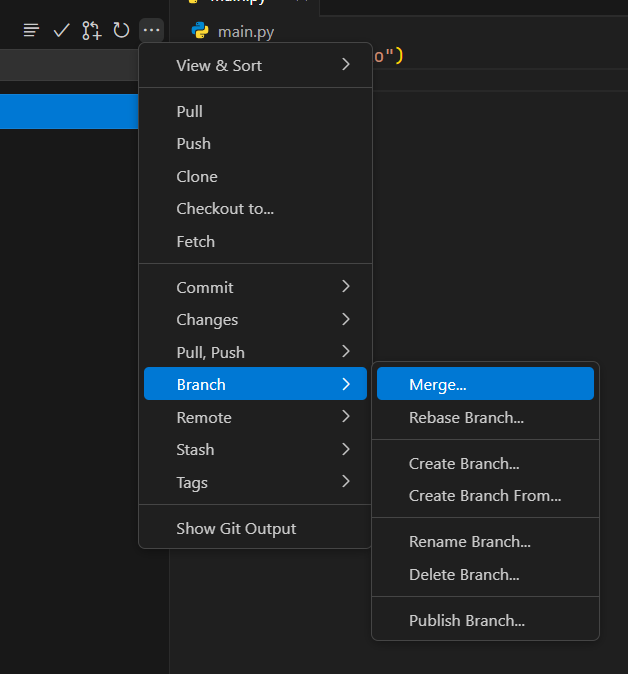
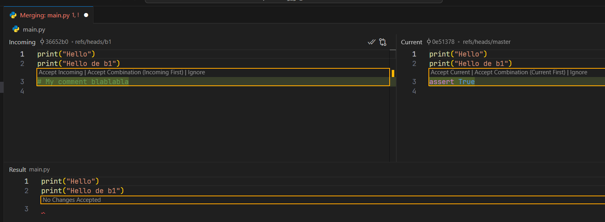
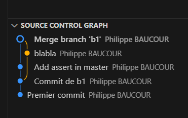
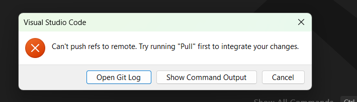
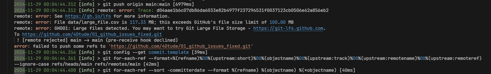
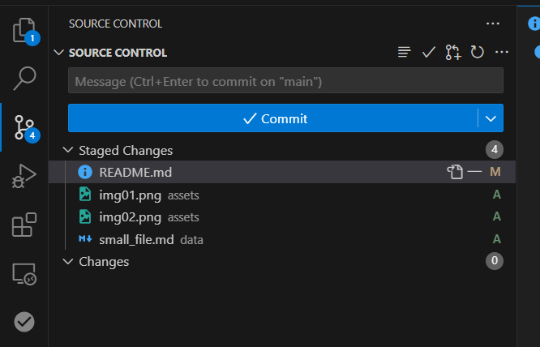
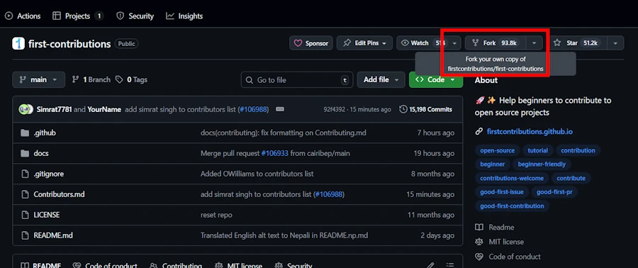

# Mon Git Survival Guide
{: .no_toc }



<!-- {: .note }
C'est la seconde version de ce [billet](). À terme les deux seront fusionnés mais pour l'instant je suis toujours en train de transférer les articles de WordPress vers Markdown et je n'ai pas le temps. Ceci dit j'ajoute ça à la TODO list. -->



<!-- ####################################################################### -->
<!-- ####################################################################### -->
<!-- ####################################################################### -->
## Introduction
{: .no_toc }

Je met noir sur blanc, une fois pour toute, deux ou trois trucs qui me mettent toujours plus ou moins en panique. Je sens que ça va se transformer en ``cheat sheet`` cette histoire...  


<div align="center">

<p>Do you remember...🎵</p>
</div>

<!-- ####################################################################### -->
<!-- ####################################################################### -->
<!-- ####################################################################### -->
## Table of Contents
{: .no_toc .text-delta}
- TOC
{:toc}


<!-- ####################################################################### -->
<!-- ####################################################################### -->
<!-- ####################################################################### -->
## Installation Linux & Windows

### Linux

```bash
apt-get install git
```

### Windows 

* Download de l'installeur à partir du [site git](https://git-scm.com/download/win)
* [Installer posh-git](https://www.40tude.fr/poshgit/) (permet d'avoir un prompt sympa sous PowerShell)

## Configuration à minima

Quand Git est installé, dans un terminal, pour s'assurer que tout va bien, saisir :

```powershell
git
```

Ensuite saisir :

```powershell
git config --global user.name "MON NOM"
```

Enfin, saisir :

```powershell
git config --global user.email "ADR EMAIL"
```

On peut aussi saisir

```powershell
git config --global init.defaultBranch main

```
En fait par défaut git crée une branche "master" dont le nom n'est plus trop dans l'air du temps (wokisme quand tu nous tiens...) ce qui peut poser des soucis lorsqu'on crée un repo depuis VSCode qui lui, va créer une branche "main". 

Je suis d'accord mon lapin, tout ça c'est des conneries, "master en servant" c'était pourtant bien cool, mais bon, autant se simplifier la vie dès le départ.

<div align="center">
<iframe width="560" height="315" src="https://www.youtube.com/embed/IsvfofcIE1Q?si=6kcJNwORKE-OPd3y" title="YouTube video player" frameborder="0" allow="accelerometer; autoplay; clipboard-write; encrypted-media; gyroscope; picture-in-picture; web-share" referrerpolicy="strict-origin-when-cross-origin" allowfullscreen></iframe>
</div>

Prendre ensuite le temps de lire cette [page](http://rogerdudler.github.io/git-guide/).


<!-- ####################################################################### -->
<!-- ####################################################################### -->
<!-- ####################################################################### -->

## Revenir en arrière 

* J'ai un projet Rust de démonstration, un truc simple, qui comporte peut être un ou deux fichiers source et qui est synchronisé sur GitHub  
* Je fais pas de branche (bien sûr...)
* Je fait des bidouilles et je commit plusieurs fois
* Je veux juste revenir au projet dans l'état il était en version V2 (129eca1) 

Je fais quoi ?

```powershell
git status
git log --oneline -n 5
git restore --source=129eca1 --staged --worktree .
git commit -m "revert: back to version V2 (129eca1)"
git push
```


<!-- ####################################################################### -->
<!-- ####################################################################### -->
<!-- ####################################################################### -->
## Tout cassé et plusieurs commits entre temps

Typiquement avec le site [40tude.fr](https://www.40tude.fr/) (Jekyll + thème Just The Docs) je fais des modifs dans le GemFile... et puis à un moment ça déploie plus sur GitHub

**PANIQUE!** 😡

```powershell
git log --oneline -n 5
git reset --hard dfa46c011b33092ea30c14938616f5281f092811
git push --force
```

* Avec le ``--hard`` on supprime les commits suivants et les modifications associées 
* ``--force`` la mise à jour du dépôt distant pour refléter l'état actuel de la branche locale. Les commits effacés seront également supprimés du dépôt distant.

C'est donc assez radical et cela ne marche que parce que je suis tout seul sur le projet. C'est pas du tout une bonne idée de faire ça si on est en équipe car pendant que tu ratatouille de ton côté, Robert lui a fait plusieurs commits vachement intéressants et si avec `--hard` tu supprimes les commits suivants... Ca va chù%@ pour ton matricule.

**PLUS de PANIQUE...** 😁


<!-- ####################################################################### -->
<!-- ####################################################################### -->
<!-- ####################################################################### -->

## Récupérer un de mes projets sur GitHub

Dans PowerShell, dans le répertoire où on peut créer un sous-répertoire pour y héberger les sources du projet récupéré, taper :

```powershell
git clone https://github.com/40tude/A-Tour-Of-Cpp.git
```

* Faire des modifications dans les fichiers
* Faire un commit

```
git commit -am "Relecture et typos"
```

Bien noter le "a" de "-am" qui "commit" tous le fichiers modifiés


* Faire un push sur le serveur distant GitHub

```powershell
git push master origin
```

* Mettre à jour le projet

```powershell
git fetch origin
```


<!-- ####################################################################### -->
<!-- ####################################################################### -->
<!-- ####################################################################### -->
## Branch & Merge

Clairement je n'ai pas encore le réflexe... Je promets, je vais faire un effort...  

* Je me met dans le cas où :  
    * J'ai un projet avec un repo GitHub  
    * J'ai une idée transcendantale...  


### Mode VSCode
* En bas à gauche je clique sur ``main``  
* Je choisis `Create New Branch` (``b1`` par exemple)  
* Je modifie, j'ajoute des fichiers, je teste...  
* Je commit plusieurs fois    
* Quand j'ai terminé sur ``b1``   


#### Si je ne suis pas content
{: .no_toc }

* Je reviens sur ``main`` en cliquant en bas à gauche  
* Je supprime ensuite la branche ``b1``  


#### Si je veux intégrer mes modifications  
{: .no_toc }

* Je reviens sur ``main`` en cliquant en bas à gauche  
* Je choisis Branch/Merge/b1  

<div align="center">

</div>

Quand le merge est fait, je commit `main`  
Je peux alors supprimer la branche ``b1``  


#### Si au moment du merge il y a un conflit
{: .no_toc }

<div align="center">

</div>


Ensuite on fait un commit de ``main``  
Voir le graphe en bas à gauche

<div align="center">

</div>


### Mode CLI

* Si on a un terminal ouvert dans le répertoire du projet (CTRL+SHIFT+ù sous VScode)  
* On peut mélanger les clicks dans VSCode et les commandes dans le terminal


| Action                          | Commande                                   |
|---------------------------------|--------------------------------------------|
| Initialiser un dépôt Git        | `git init`                                 |
| Ajouter des fichiers            | `git add <file>` `git add .`               |
| Faire un commit                 | `git commit -m "message"`                  |
| Créer une branche               | `git checkout -b <branch-name>`            |
| Basculer entre branches         | `git checkout <branch-name>`               |
| Ou créer/basculer sur la branche| `git switch -c <branch-name>`              |
| Fusionner une branche           | `git merge <branch-name>`                  |
| Résoudre un conflit             | Résoudre le conflit, puis `git add <file>` |
| Supprimer une branche           | `git branch -d <branch-name>`              |
| Historique des commits          | `git log --oneline --graph --all`          |


<!-- ####################################################################### -->
<!-- ####################################################################### -->
<!-- ####################################################################### -->
## Gros Fichier - Cas N°1

### Note
{: .no_toc }

* Ci-dessous je peux me permettre de faire un ``git reset`` car je suis tout seul   
* Si jamais je suis en équipe il faudra utiliser ``git revert``  
    * Dans un cas (``reset``) on modifie ce sur quoi pointe ``HEAD`` 
    * Alors que dans l'autre (``revert``) on ajoute à la série des commits locaux un nouveau commit qui annule mes bêtises  
* Si d'autres travaillent avec une copie du repo distant 
    * Dans le premier cas ca va être Rock'n Roll au moment des merges (pull ou merge) car on va avoir des HEAD qui vont plus être synchros
    * Dans le second ca va bien se passer (j'ai juste rajouté un commit)

On se met dans le cas où
* J'ai un projet qui est synchronisé sur GitHub  
* J'ajoute un fichier dont la taille est supérieure à 100 MB  
* J'oublie d'en tenir compte dans ``.gitignore``  
* Je commit  
* Je synchronise  

**PANIQUE!** 😡

<div align="center">

</div>


<div align="center">

</div>

* Il semble qu'il n'a rien poussé    
* J'édite ``.gitignore``  
* Je prends 2 captures d'écran que je met dans un dossier ``./assets``  
* Je commit et je synchronise

Même problème...

``git reset --soft HEAD~2``

Cela nous ramène à 2 commits en arrière dans le ``staging area``. Je fais -2 car entre temps (-1) j'ai pris des captures d'écran etc. 
* Sous VSCode on le voit dans l'interface graphique

`git rm --cached .\data\large_file.csv`

Le gros fichier n'est plus suivi

<div align="center">

</div>

Éditer ``.gitignore``  


```git
# -----------------------------------------------------------------------------
# files to ignore
secrets.ps1
.env
Jenkinsfile
*.log

# too big
large_file.csv

# -----------------------------------------------------------------------------
# directories to ignore
.git/
.vscode/

# "**/.mypy_cache/" ignore all directories named ".mypy_cache/""
**/.mypy_cache/
**/__pycache__/
**/mlruns/ 
**/logs/
```

* Tout sauver  
* Fair un ``commit``  
* Faire un ``git push origin main --force`` (ligne de commande)

**ATTENTION**
* Le **SYNCHRONIZE** (pull + push) de l'interface VSCode n'est **PAS** suffisant ici 
* En effet les historiques (local et distant) ne sont PLUS synchros (=> ``--force``)

#### **Différence entre Synchronize et ``git push --force``**
{: .no_toc }

| **Action**                                   | **Synchronize**                    | **git push --force**                        |
|----------------------------------------------|------------------------------------|---------------------------------------------|
| **Récupération des modifications distantes** | Fait un `pull` avant le `push`     | Ne fait aucun `pull`.                       |
| **Gestion des désalignements**               | Échoue si l’historique diverge     | Écrase l’historique distant.                |
| **Cas d’utilisation**                        | Cas normaux (pas de désalignement) | Réécriture d’historique ou conflits majeurs |

**PLUS de PANIQUE...** 😁

### Résumé

```powershell
git reset --soft HEAD~2
git rm --cached .\data\large_file.csv
Édite le .gitignore
Commit
git push origin main --force
```
Ou alors 

```powershell
git reset --soft HEAD~2
git rm --cached .\data\large_file.csv
git add .gitignore
git commit -m "Remove large file and update .gitignore"
git push origin main --force
```


<!-- ####################################################################### -->
<!-- ####################################################################### -->
<!-- ####################################################################### -->
## Gros Fichier - Cas N°2

* J'ai un projet qui est synchronisé sur GitHub  
* J'ajoute un fichier > 100 MB  
* J'oublie d'en tenir compte dans ``.gitignore``  
* Je commit **mais** je ne fais **PAS** de synchronisation  

Je réalise que j'ai un gros fichier... Comment revenir en arrière ?

**PANIQUE!** 😡

```powershell
git reset --soft HEAD~1
git rm --cached .\data\large_file_2.csv
Éditer `.gitignore`
git add .gitignore
git commit -m "Remove large_file_2 and update .gitignore"
git push origin main --force
```


### Note de ChatGPT
{: .no_toc }

Les modifications non committées dans ton espace de travail ne seront pas perdues avec un ``git reset --soft``.   
Ce mode préserve toutes tes modifications dans la staging area (index) et l’espace de travail.   
Si tu veux plus de sécurité, tu peux faire une copie temporaire de ton travail (``git stash``) avant d’exécuter cette commande.

```powershell
git stash                       # Optionnel, si tu veux sauvegarder tes modifications locales
git reset --soft HEAD~1         # Annule le dernier commit
git rm --cached ./data/large_file_2.csv  # Supprime le fichier du suivi Git. On le voit plus das VSCode Source Control
echo "/data/large_file_2.csv" >> .gitignore  # Ajoute au .gitignore
git add .gitignore              # Ajoute le fichier .gitignore
git add .                       # Ajoute les autres modifications
git commit -m "Remove large file and update .gitignore"
git push origin main --force    # Réécrit l'historique
git stash pop                   # Optionnel, pour restaurer tes modifications
```
On retrouve bien le projet synchro sur GitHub

**PLUS de PANIQUE...** 😁

### Résumé

```powershell
git stash                       
git reset --soft HEAD~1         
git rm --cached ./data/large_file_2.csv  
echo "/data/large_file_2.csv" >> .gitignore  
git add .gitignore              
git add .                       
git commit -m "Remove large file and update .gitignore"
git push origin main --force    
git stash pop                   
```


<!-- ####################################################################### -->
<!-- ####################################################################### -->
<!-- ####################################################################### -->
## Fichier `secrets.ps1` ou `.env`

* J'ai un projet qui est synchronisé sur GitHub  
* J'ajoute un fichier `secrets.ps1` (ou un ``.env``)  
* J'oublie d'en tenir compte dans ``.gitignore``  
* Je commit et je sync

Comment revenir en arrière ?

**PANIQUE!** 😡

```powershell
git reset --soft HEAD~1         
git rm --cached ./secrets.ps1   
Edition de .gitignore   
git add .gitignore              
# git add .                       
git commit -m "Remove secrets.ps1 to avoid a nuclear war :-)" 
git push origin main --force    
```

### Pour aller plus loin...
1. Nettoyer tout l’historique public : ``filter-repo``
1. Supprimer le cache GitHub pour garantir qu’aucune trace ne reste sur leurs serveurs 

#### 1. filter-repo :
{: .no_toc }

```powershell 
# Voir si on veut créer un env virtuel ou pas ????
# conda install filter-repo -c conda-forge 
#       marche pas trop
#       trouve rien 
#       en plus c'est pas à jour

pip install git-filter-repo
git config --global filter.repo.clean "git filter-repo"
```


Ensuite faut faire   

```powershell 
cd chemin/vers/le/depot
git filter-repo --invert-paths --path ./secrets.ps1
```


Afin de vérifier qu'il ne reste plus de traces dans les logs 
```powershell 
git log --all -- secrets.ps1
# Si y a une arborescence pour accéder au fichier
git log --all -- 01_model_and_data/01_model_and_data_ops/05_modelizer/assets/secrets.ps1

```

Quand tout est OK localement faut mettre à jour le repo distant

```powershell 
git push origin main --force
```

#### 2. Supprimer le cache GitHub
{: .no_toc }
* ???

<!-- ### 2. Vider les caches du repo sur GitHub : -->
<!-- * GitHub/Settings/Actions/Cache/supprime les caches liés au projet -->
<!-- 
https://github.com/40tude/01_github_issues_fixed/actions/caches
-->

**PLUS de PANIQUE...** 😁


<!-- ####################################################################### -->
<!-- ####################################################################### -->
<!-- ####################################################################### -->
## Répertoire de logs

* J'ai un projet qui est synchronisé sur GitHub  
* J'ajoute un répertoire ``./logs`` avec des centaines de logs qu'il est ridicule d'avoir sur GitHub.   
* J'oublie d'en tenir compte dans ``.gitignore``  
* J'ai fait un commit et une synchro    
* Les fichiers de logs sont petits, tout est parti sur GitHub

Mais comment faire ? Comment revenir en arrière ?

**PANIQUE!** 😡


Je propose :

```powershell
git reset --soft HEAD~1         
git rm -r --cached ./logs   
Edition de .gitignore (ajout de la ligne ``/logs/``)   
git add .gitignore              
git add .                       
git commit -m "Remove ./logs and all the logs files" 
git push origin main --force    
```

Bien voir le ``-r`` de la commande ``git rm``

### Note parce que j'oublie tout le temps :
{: .no_toc }

* `logs/` - Ignore **TOUS** les dossiers nommés `logs` dans l'ensemble du projet, quelle que soit leur position dans l'arborescence.
* `/logs/` - Ignore uniquement le dossier `logs` situé à la racine du projet. Elle n'affectera pas les dossiers `logs` situés dans des sous-répertoires.


**PLUS de PANIQUE...** 😁


<!-- ####################################################################### -->
<!-- ####################################################################### -->
<!-- ####################################################################### -->
## Pull Request (PR pour les intimes)

### 1. Forker le projet

* Avec un browser web, aller sur : `https://github.com/firstcontributions/first-contributions` ou un autre projet, mais bon, celui là est justement pour qu'on s’entraîne.

* Cliquer sur le bouton **Fork** (rectangle rouge ci-dessous)

<div align="center">
<br/>
<!-- <span>Optional comment</span> -->
</div>

* On va récupérer une copie du projet dans notre repo GitHub  
* Sur notre PC, ouvrir un terminal dans un répertoire où on veut créer le clone  
* Cloner le projet à partir de notre repo Github
    * ``git clone https://github.com/40tude/first-contributions.git``  
    * `git remote -v`  
* Si dans la liste affichée on ne voit pas le repo du projet initial 
    * `git remote add upstream <URL-du-projet-original>` 
    * C'est à faire qu'une seule fois

        

### 2. Créer et basculer sur une branche
* `git switch -c b1`

C'est équivalent à: 
* `git branch b1`      # créer la branche
* `git switch b1`      # basculer vers la branche


### 3. Business as usual

* Pas d'embrouille... On est bien sur la branche `b1`. 
* Lire : `https://github.com/firstcontributions/first-contributions/blob/main/gui-tool-tutorials/github-windows-vs-code-tutorial.md`  
* Faire les modifs proposées (ajouter son nom à ``contributors.md``)
* Sauver  
* Faire un commit de la branche `b1` de notre repo Github 


### 4. Pull Request 
* Avec un browser web aller sur la page du projet sur **notre** repo Github
* GitHub a détecté une différence entre le fork et le projet original  
* Il propose de faire un pull request  
* Quand c'est fait, le PR est alors une proposition de merge de la branche `b1` du fork vers la branche `main` du projet original  

Ensuite...  

* Les mainteneurs examinent la PR, réunion du conseil d'état, tout ça, tout ça...
* Il l’acceptent ou demandent des changements (via des commentaires sur GitHub).  
* Je fais les changements dans la branche `b1` sur mon PC puis je commite sur mon repo GitHub   
* Les modifs seront automatiquement ajoutées à la PR


### 5. Se maintenir à jour

C'est important avec les "vrais" projets mais bon par exemple ici on peut imaginer que les mainteneurs prennent un peu de temps pour répondre. On va donc jouer le jeu et maintenir notre copie du projet synchronisée avec le projet. En effet lui de son côté, il continue a évoluer.

* Du coup tous les matins il faut:
    * `git switch main          `   # laisser la branche sur laquelle on est et aller sur main
    * `git fetch upstream       `   # récupérer les updates 
    * `git merge upstream/main  `   # fusionner les updates
    * `git push origin main     `   # pousser sur notre repo
    * `git switch my_branch     `   # revenir sur notre branche
    * `git rebase main          `   # intégrer les derniers changements sur notre branche
    * `git push origin my_branch`   # travailler puis pousser sur notre repo


Quand nos merges sont acceptés faut penser à supprimer la branche ``b1``  
Ne pas hésiter à créer de nouvelles branches pour des PR différentes 


**Que faire si la branche b1 est affectée par les changements ?**

``git switch b1``

Rebaser ``b1`` sur la branche ``main`` à jour pour appliquer les changements récents de ``main`` sur la branche ``b1``. Cela ajuste l’historique de la branche ``b1`` pour qu’elle repose sur la dernière version de main.

``git rebase main``

Si il y a des conflits, les résoudre. À la fin :

``git rebase --continue``


Après le rebase, il faut forcer le push de la branche ``b1`` vers le fork (car l’historique a changé)  

``git push origin b1 --force``


#### Note pour savoir si il faut faire un rebase de ``b1``
{: .no_toc }

**Etape 1 :**  

| Action                                              | Commande                |
|-----------------------------------------------------|-------------------------|
| Vérifier si ``b1`` est en retard par rapport à main | `git log b1..main`      |
| Identifier les fichiers impactés                    | ``git diff b1..main``   |
| Faire un commit                                     | ``git rebase main``     |


**Etape 2 :**  
On va voir les fichiers qui ont changé dans ``main`` mais pas dans ``b1``.  
Si on voit des fichiers sur lesquels on travaille dans ``b1``, alors faut rebaser  


#### Comment nommer les branches?

* feature/ ou feat/ → new features
* fix/ ou bugfix/ → bug fixes
* docs/ → documentation
* refactor/ → refactoring (sans nouvelle feature)
* test/ → adding tests
* chore/ → taches diverses (config, dépendances...)
* hotfix/ → correction urgente

**Exemples:**
* feature/add-syntax-highlighting
* fix/menu-crash-on-resize
* docs/improve-readme
* refactor/cleanup-event-handling
* test/add-unit-tests-dialog


### La routine du matin...
```powershell
# Ajouter le projet original comme remote (une seule fois, si ce n'a pas déjà été fait)
git remote add upstream <URL-du-projet-original>

# Récupérer les mises à jour du projet original et les mettre dans un "arbre" qui s'appelle ``upstream``
# Arbre n'est pas du tout un terme officiel je crois. C'est juste l'idée que je m'en fait
git fetch upstream

# Mettre à jour la branche main locale en applicant les modifications qui sont dans la branche upstream/main
git switch main
git merge upstream/main

# Pousser les mises à jour de la branche ``main`` sur mon fork sur GitHub
git push origin main


# Revenir sur la branche où on était
git switch my_branch        

# Lntégrer les derniers changement sur notre branche
git rebase main             

# Travailler puis pousser sur notre repo et PR comme vu au dessus
git push origin my_branch   
```


### Combien de fois par jour ?
Combien de fois par jour faut il synchroniser avec le main du projet initial? 

**Une à deux fois par jour**  
1. Synchroniser une fois au **début de la journée** (ou avant de commencer une nouvelle tâche) 
    * Travailler avec une base de code à jour.
1. Synchroniser une deuxième fois en **fin de journée** (ou avant un pull request)
    * S'assurer que les modifications qu'on soumet sont compatibles avec les changements récents sur main


<!-- ####################################################################### -->
<!-- ####################################################################### -->
<!-- ####################################################################### -->
## Bonnes pratiques pour les merges sur `main` ?

C'est peut être pas cool ni dans l'air du temps, mais ça passe par une politique **stricte** des merges ainsi que par de la **discipline**.

### Utiliser des `feature branches`
- Toute idée doit être développée dans une branche (ex. : `feature/ticket-123`) 
- Interdiction de pousser sur `main`.

### Passer par des pull requests
- Les merges dans `main` doivent être effectués via des PR
- Bien sûr, entre temps, il y a eu une revue de code, tous les test passent etc.

### Limiter le nombre de merges par jour
- Limiter les merges dans `main` à 1 ou 2 moments précis par jour
    - Exemple : à midi et en fin de journée
- Facilite la synchronisation et "éduque" l'équipe
    - "Merde, je vais être en retard pour le merge de 18H00"

### Automatiser la validation avec CI
- Avant de merger dans `main`
- Exécuter automatiquement la suite de tests via Jenkins (GitHub Actions, GitLab CI/CD...)


<!-- ####################################################################### -->
<!-- ####################################################################### -->
<!-- ####################################################################### -->
## Le workflow idéal ?

### 1. Membre de l'équipe

#### Avant de commencer une nouvelle tâche 
{: .no_toc }

- Synchroniser avec `main` pour partir d'une base de code propre :
     ```bash
     git switch main
     git fetch upstream
     git merge upstream/main
     git switch -c <ma_tache>
     ```

#### Pendant le développement
{: .no_toc }

- Travailler dans une branche dédiée (ex. : `feature/ticket-123`) 
- Synchroniser cette branche avec `main` régulièrement
    * surtout si le développement dure plusieurs jours.


#### Avant de soumettre une PR
{: .no_toc }

   - Synchroniser avec `main` une dernière fois pour résoudre les éventuels conflits en amont.


### 2. L'équipe

#### Planifier les merges dans `main`
{: .no_toc }

- Les merges ont lieu 2 fois par jour (midi et fin de journée).
- Cela permet à tout le monde le temps de se synchroniser 

#### Communiquer activement
{: .no_toc }

- Informer à propos des merges importants 
- Pour que tout le monde puisse vérifier si se branche est impactée ou pas

#### Respecter le processus de PRs
{: .no_toc }

- On ne peut merger qu'une PR qui a été revue et testée


<!-- ####################################################################### -->
<!-- ####################################################################### -->
<!-- ####################################################################### -->

## Webliographie

* Lire <https://git-scm.com/book/fr/v2>
* Learn Git branching <http://learngitbranching.js.org/>
* Voir [Using Git with Visual Studio 2013 Jump Start](https://mva.microsoft.com/en-us/training-courses/using-git-with-visual-studio-2013-jump-start-8306?l=ABt74sYy_404984382)
* Voir : <https://www.youtube.com/watch?list=PL8jcXf-CLpxrw3ipflS7mujA-hM7m2YnH&v=1ieJbCFgXQs>
