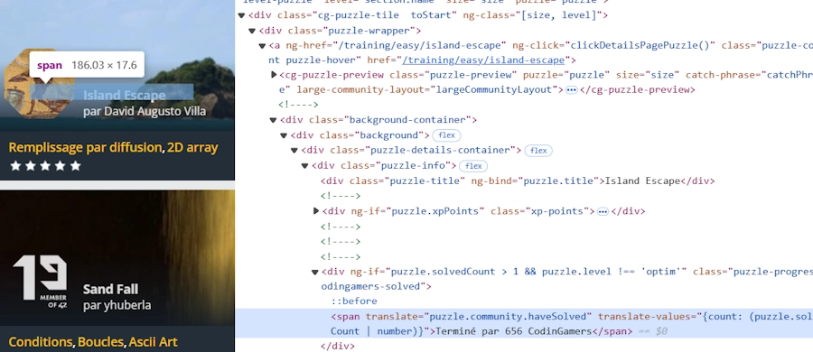
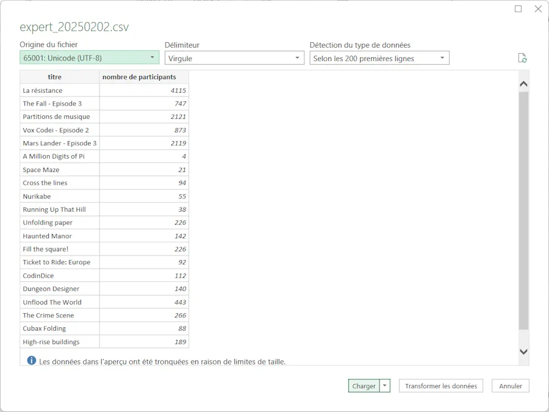

# CodinGame classement par participants

Le repo du projet est ici : <https://github.com/40tude/codingame_py>


## Intro

Quand va sur <https://www.codingame.com/training/easy> tu vois ça : 

<div align="center">

</div>


À part "À Faire" et "Fini", on a aucune option de tri. C'est vraiment très dommage. Par exemple, avant de choisir mon prochain puzzle, je peux vouloir filtrer par date de parution, par auteur, par nombre de participants... J'ai jamais compris pourquoi CodinGame ne permet pas de le faire. Enfin bref... On s'adapte, et on trouve une solution.

Dans la suite je montre comment faire pour faire du scraping de page Web avec Scrapy afin de générer une feuille Excel qui comprend les titres et le nombre de participants. Oui bien sûr, une fois que ça tourne on peut faire beaucoup plus élaboré mais bon c'était pas mon objectif. Allez c'est parti.

Si on inspecte la page après avoir appuyé sur ``F12`` dans son browser préféré on voit un truc qui ressemble à ça :

<div align="center">

</div>

Je passe les détails mais par exemple on peut retrouver dans la page, l'élément qui contient la phrase "Terminé par 656 CodingGamers". De la même façon, on peut retrouver l'élément qui contient le titre du puzzle. En ce qui me concerne je copie-colle dans un coin les xpaths qui me permettent de les retrouver.

```
# xpath

# Titre
# //*[@id="games"]/div/div/div/cg-puzzles-section[1]/div/div[3]/cg-puzzle[1]/div/div/a/div/div/div[1]/div/div[1]
# //*[@id="games"]/div/div/div/cg-puzzles-section[1]/div/div[3]/cg-puzzle[4]/div/div/a/div/div/div[1]/div/div[1]

# Nombre de joueurs
# //*[@id="games"]/div/div/div/cg-puzzles-section[1]/div/div[3]/cg-puzzle[2]/div/div/a/div/div/div[1]/div/div[3]/span
# //*[@id="games"]/div/div/div/cg-puzzles-section[1]/div/div[3]/cg-puzzle[4]/div/div/a/div/div/div[1]/div/div[3]/span
```

Du coup, la méthode est relativement simple:
1. [Créer une environnement conda](#créer-une-environnement-conda)
1. [Installer les softs](#installer-les-softs)
1. [Écrire un code pour scraper la page](#écrire-un-code-pour-scraper-la-page) et générer un fichier ``.json`` avec le titre et le nombre de participants
1. [Écrire un second code qui converti le ``.json`` en ``.csv``](#écrire-un-convertisseur-json-en-csv)
1. [Ouvrir Excel](#ouvrir-le-csv-dans-excel) et faire mes classements comme je le souhaite


## Créer une environnement conda

Dans une console PowerShell

```powershell
conda create --name scrapy python=3.13 -y
conda activate scrapy
```

## Installer les softs

```powershell
conda install conda-forge::scrapy
conda install conda-forge::selenium
conda install conda-forge::webdriver-manager
```
Au début j'a installé uniquement ``scrapy`` mais comme il y a pas mal de javascript j'ai dû aussi installer ``selenium`` et ``webdriver-manager``


## Écrire un code pour scraper la page

Dans le terminal 

```powershell
scrapy startproject codingame_scraper
```

Ça va créer un projet ``codingame_scraper`` avec tout un ensemble de répertoires et de sous-répertoires. Dans le répertoire ``./spiders`` copie colle le source ci-dessous. Moi je l'ai nommé ``codingame_spider.py`` mais ce qui compte vraiment c'est son petit nom de spider. Voir la ligne `name = "codingame_selenium"` ci-dessous.

On est en mode quick'n dirty donc la page à scraper est codée en dur. Ici c'est ``https://www.codingame.com/training/expert``. Pour le reste, on retrouve les xpaths que j'avais copié-collé précédemment et qui me permettent de pointer le titre du puzzle ainsi que le nombre de participants. 


```python
import scrapy
from selenium import webdriver
from selenium.webdriver.chrome.service import Service
from selenium.webdriver.common.by import By
from selenium.webdriver.support.ui import WebDriverWait
from selenium.webdriver.support import expected_conditions as EC
from webdriver_manager.chrome import ChromeDriverManager
from scrapy.selector import Selector


class CodingameSpider(scrapy.Spider):
    name = "codingame_selenium"
    start_urls = ["https://www.codingame.com/training/expert"]

    def __init__(self):
        self.driver = webdriver.Chrome(service=Service(ChromeDriverManager().install()))

    def parse(self, response):
        self.driver.get(response.url)

        try:
            # Attendre que les éléments `cg-puzzle` apparaissent (10 secondes maximum)
            WebDriverWait(self.driver, 10).until(
                EC.presence_of_all_elements_located(
                    (By.XPATH, '//*[@id="games"]/div/div/div/cg-puzzles-section[1]/div/div[3]/cg-puzzle')
                )
            )
        except Exception as e:
            self.logger.error(f"Les puzzles n'ont pas pu être chargés : {e}")
            self.driver.quit()
            return

        # Extraire le contenu de la page après le chargement de JavaScript
        html = self.driver.page_source
        sel = Selector(text=html)

        # Extraction des puzzles
        puzzles = sel.xpath('//*[@id="games"]/div/div/div/cg-puzzles-section[1]/div/div[3]/cg-puzzle')

        extracted_data = []
        for puzzle in puzzles:
            # Extraire le nombre de participants
            participants_text = puzzle.xpath(".//div/div/a/div/div/div[1]/div/div[3]/span/text()").get()
            participants = participants_text.strip() if participants_text else "Unknown"

            # Extraire le titre du puzzle
            title_text = puzzle.xpath(".//div/div/a/div/div/div[1]/div/div[1]/text()").get()
            title = title_text.strip() if title_text else "No Title"

            extracted_data.append({"title": title, "participants": participants})

        self.driver.quit()
        yield {"puzzles_data": extracted_data}
```

Ensuite dans VSCode, j'ouvre un terminal et depuis le répertoire où se trouve le fichier ``scrapy.cfg`` je lance la commande :

```powershell
scrapy crawl codingame_selenium -o expert.json 
```

Ci-dessous c'est juste pour montrer comment ça se passe dans la console et du point de vue de l'organisation des fichiers.

<div align="center">

</div>

Bien voir qu'on passe le nom du spider (``codingame_selenium``) et **PAS** le nom du fichier (``codingame_spider.py``). Normalement une nouvelle instance du browser par défaut s'affiche. On attend un peu. On parse les éléments et on sauve dans une fichier ``.json``.

Voilà ce que je vois quand j'ouvre le fichier ``.json`` dans VSCode. Si c'est pas aussi propre ni aussi bien "rangé", faut pas hésiter à sauver le fichier (CTRL + S) tout de suite après l'avoir ouvert.

<div align="center">

</div>

Faut noter qu'il y a un espace un peu "chelou" en lieu et place du séparateur de milliers dans la phrase "...4 115 CodinGamers". Ci-dessous j'affiche le fichier ``expert.json`` avec l'excellent ``hexedit``. J'ai surligné l'espace insécable UTF-8 qui pose problème et dont il faudra s'occuper plus tard.

<div align="center">

</div>


## Écrire un convertisseur ``.json`` en ``.csv``

Je te propose de sauver le code ci-dessous dans ``converter.py`` dans le répertoire où les fichiers ``.json`` sont générés. 

```python
import os
import re
import csv
import json
from pathlib import Path
from datetime import datetime

k_Level = "expert"
k_JSON_In = f"{k_Level}.json"

os.chdir(Path(__file__).parent)

with open(k_JSON_In, "r", encoding="utf-8") as json_file:
    data = json.load(json_file)

# Si le JSON est une liste, prendre le premier élément
if isinstance(data, list) and len(data) > 0:
    data = data[0]

# Extraire les puzzles
puzzles = data.get("puzzles_data", [])

current_date = datetime.now().strftime("%Y%m%d")
csv_filename = f"{k_Level}_{current_date}.csv"

# Extraire le nb de participants 
def extract_participants(text):
    # Remplacer l'espace insécable (\u00A0) par un espace normal
    text = text.replace("\u00A0", " ")

    match = re.search(r"(\d[\d\s]*)", text)
    if match:
        # Supprimer les espaces dans le nombre trouvé (ex: "1 080" devient "1080")
        return match.group(1).replace(" ", "")
    return "0"

with open(csv_filename, "w", newline="", encoding="utf-8") as csv_file:
    csv_writer = csv.writer(csv_file)
    csv_writer.writerow(["titre", "nombre de participants"])
    for puzzle in puzzles:
        title = puzzle.get("title", "No Title")
        participants_text = puzzle.get("participants", "Unknown")
        participants = extract_participants(participants_text)
        csv_writer.writerow([title, participants])
print(f"Done : {csv_filename}")
```


Du point de vue de l'organisation des fichiers voilà ce que cela donne :

<div align="center">

</div>


Du point de vue de l'utilisation du script, il faut, dans VSCode, l'éditer et mettre à jour le niveau des puzzles. Voir la ligne ``k_Level = "expert"``. En effet, enfonction des pages scrapées, je génère des fichiers ``.json`` qui s'appellent respectivement``easy.json``, ``medium.json``, ``hard.json`` et ``expert.json``. Ensuite, toujours dans VSCode, il suffit d'appuyer sur la touche F5. À la fin tu récupères par exemple un fichier `expert.csv` qu'il suffit d'ouvrir dans l’excellent Excel.


## Ouvrir le .csv dans Excel

Tout le monde le sait mais je vais le redire. Pour ouvrir correctement un fichier ``.csv`` dans Excel, une fois que tu as une feuille vide sous les yeux, faut aller dans le menu ``Données`` puis cliquer sur `À partir d'un fichier texte/CSV` et là bizarrement ça se passe toujours bien. 

<div align="center">

</div>

Dans l’assistant il y a des options pour l'encodage etc. mais généralement il arrive à bien détecter le type de caractères utilisés. 

<div align="center">

</div>

Bon après tu vis ta vie. Par exemple dans la catégorie ``easy``, voilà ce à quoi ressemble ma feuille. J'ai rajouté une colonne avec les puzzles déjà résolus. Du coup je peux choisir parmi ceux qui j'ai pas encore fait, ceux qui ont le plus (ou le moins) de participants.


<div align="center">

</div>


*Allez, la suite au prochain épisode...*

