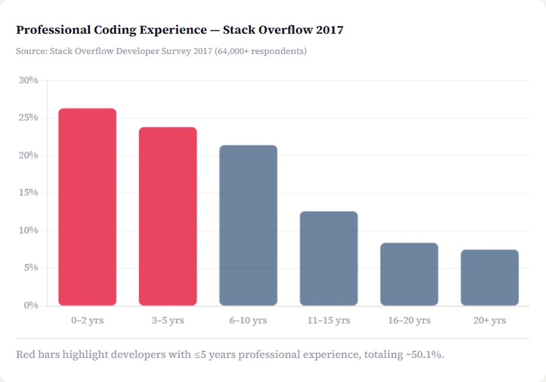
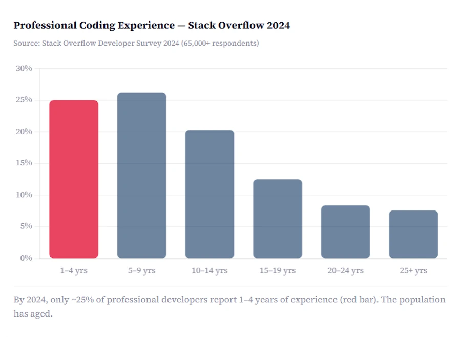
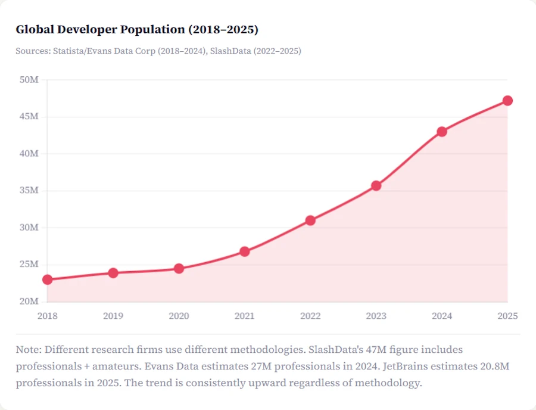
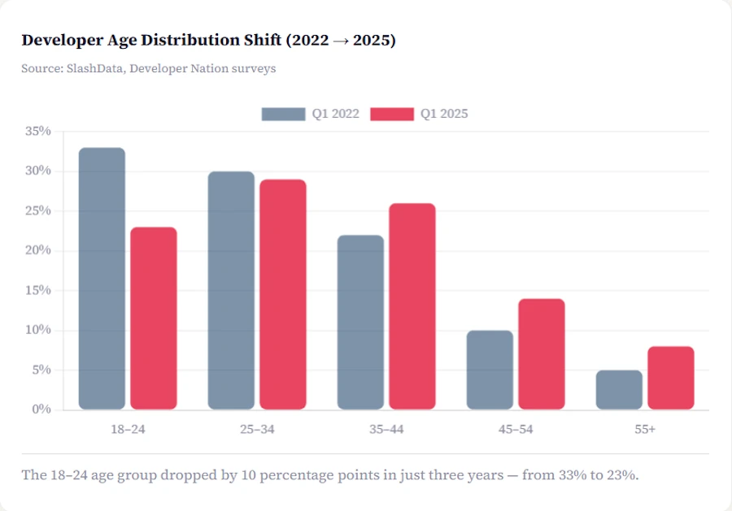
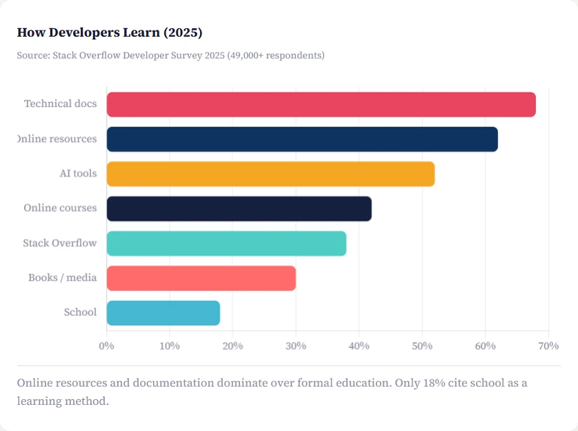

# Half of All Developers Have Less Than 5 Years of Experience: Myth, Reality, and Why It Matters
{: .no_toc }

A data-driven investigation into one of the most repeated claims in software engineering, and what it means for technical education in 2026.

<h2 align="center">
<b> 🚧 This post is under construction 🚧</b>
</h2>

<!-- ###################################################################### -->
<!-- ###################################################################### -->
<!-- ###################################################################### -->
## TL;DR
* ...

 
<!-- A step-by-step guide to leveraging Claude and Microsoft's Rust Guidelines in VSCode. -->

<!-- ###################################################################### -->
<!-- ###################################################################### -->
<!-- ###################################################################### -->
## Table of Contents
{: .no_toc .text-delta}
- TOC
{:toc}

<!-- ###################################################################### -->
<!-- ###################################################################### -->
<!-- ###################################################################### -->
## 01 - Where Does the Claim Come From?

<!-- *Tracing the source to Uncle Bob Martin's keynotes* -->

You've probably heard it before, in a conference talk, a blog post, or a podcast: *"Half of all developers have less than five years of experience."* The statement is striking, almost alarming. It suggests an industry in perpetual adolescence, where the majority of practitioners are still figuring things out. But where does this claim actually originate, and is it true?

The primary source is **Robert C. Martin**, universally known as "Uncle Bob." Co-author of the Agile Manifesto, author of *Clean Code* and *Clean Architecture*. One of the most influential voices in software craftsmanship, Martin has been making this argument in his famous "Future of Programming" talk since at least 2014. His reasoning is elegantly simple: if the number of programmers worldwide doubles every five years, then at any given moment, half of them must have been hired within the last five years.

If the reasoning is not crystal clear, read this page which explain  [what is a percentage]() and where I take the time to explain exponential growth plus many other things like the rule of the 70 etc.

<figure style="text-align: center;">
<iframe width="560" height="315" src="https://www.youtube.com/embed/ecIWPzGEbFc?si=ursHMV8_PrXlskjb&amp;start=3059" title="YouTube video player" frameborder="0" allow="accelerometer; autoplay; clipboard-write; encrypted-media; gyroscope; picture-in-picture; web-share" referrerpolicy="strict-origin-when-cross-origin" allowfullscreen></iframe>
<figcaption></figcaption>
</figure>

> *"The number of programmers in the world doubles every five years, which means that half the programmers in the world have less than five years of experience. And this leaves our industry in a state of perpetual inexperience."*
>
> Robert C. Martin, "The Future of Programming" (2016, repeated in every edition since)

Martin's reasoning begins in 1946 with Alan Turing writing the first lines of code, and traces exponential growth through to the present day. In his 2014 blog post "My Lawn," he estimated roughly 22 million programmers worldwide and calculated a growth rate of about 14.5% per year, a doubling time of approximately five years ([70/15 ≃ 5]()#la-règle-du-70). The mathematical consequence is inescapable: if the population doubles every five years, the newest half of that population necessarily has less than five years of tenure.

This idea has been enormously influential. It's cited in podcasts (The Changelog #367), Hacker News threads, LinkedIn articles, conference talks, and countless blog posts. But does the data actually support it?

<!-- ###################################################################### -->
<!-- ###################################################################### -->
<!-- ###################################################################### -->
## 02 - What the Survey Data Actually Says

*Stack Overflow, Developer Nation, and JetBrains paint a nuanced picture*

Let's start with the most authoritative source of developer demographics: the Stack Overflow Developer Survey. With over 65,000 respondents in 2024 and 49,000+ in 2025, it's the largest annual snapshot of the developer community.

> **~50%** of developers had ≤5 years professional experience (SO 2017)
> *Stack Overflow Developer Survey 2017, 64_000+ respondents*

In 2017, when the claim was most frequently repeated, the data was remarkably close to Uncle Bob's prediction. Stack Overflow found that 50.1% of respondents had been coding professionally for five years or less. The number was even higher for mobile developers at software companies (60%). The claim, at that moment, was essentially true.

### Professional Coding Experience: Stack Overflow 2017
{: .no_toc }

<!--
| Experience range | % of developers |
|:-----------------|:-:|
| 0–2 years | **26.3%** 🔴 |
| 3–5 years | **23.8%** 🔴 |
| 6–10 years | 21.4% |
| 11–15 years | 12.6% |
| 16–20 years | 8.4% |
| 20+ years | 7.5% |

*🔴 = ≤5 years professional experience, totaling ~50.1%. Source: Stack Overflow Developer Survey 2017.*
-->

<figure style="text-align: center;">
 
<figcaption>≤5 years professional experience, totaling ~50.1%. Source: Stack Overflow Developer Survey 2017</figcaption>
</figure>

But fast-forward to 2024, and the picture has shifted. The 2024 survey reports that 25% of professional developers have 1 to 4 years of work experience, while the majority of respondents are described as "early-to-mid career professionals" with nine or fewer years of experience. Crucially, the survey notes that respondents have started to "skew more experienced" compared to previous years.

### Professional Coding Experience: Stack Overflow 2024
{: .no_toc }

<!--
| Experience range | % of developers |
|:-----------------|:-:|
| 1–4 years | **25.0%** 🔴 |
| 5–9 years | 26.2% |
| 10–14 years | 20.3% |
| 15–19 years | 12.5% |
| 20–24 years | 8.4% |
| 25+ years | 7.6% |

🔴 *By 2024, only ~25% of professional developers report 1–4 years of experience. The population has aged. Source: Stack Overflow Developer Survey 2024.*
-->

<figure style="text-align: center;">
 
<figcaption>By 2024, only ~25% of professional developers report 1–4 years of experience. The population has aged. Source: Stack Overflow Developer Survey 2024.</figcaption>
</figure>

The 2025 survey reinforces this trend: 38% of respondents have been coding for 15+ years, and the age bracket 35+ has been growing steadily (from 31% in 2022 to 39% in 2024). The Developer Nation survey (SlashData, 2022) reported that close to 60% of developers had less than five years of experience, higher than Stack Overflow's figure, but using a broader definition that includes hobbyists and self-taught learners.

<!-- ###################################################################### -->
<!-- ###################################################################### -->
<!-- ###################################################################### -->
## 03 - The Doubling Hypothesis in 2025

*Has the exponential growth continued?*

Uncle Bob's claim hinges on one key assumption: that the developer population doubles every five years. For decades, this was roughly accurate. But the latest data tells a more complex story.

### Global Developer Population (2018–2025)
{: .no_toc }

<!--
| Year | Developers (millions) | YoY Growth |
|:-----|:---------------------:|:----------:|
| 2018 | 23.0M | - |
| 2019 | 23.9M | +3.9% |
| 2020 | 24.5M | +2.5% |
| 2021 | 26.8M | +9.4% |
| 2022 | 31.0M | +15.7% |
| 2023 | 35.7M | +15.2% |
| 2024 | 43.0M | +20.4% |
| 2025 | 47.2M | +9.8% |

*Sources: Statista/Evans Data Corp (2018–2024), SlashData (2022–2025). Note: Different research firms use different methodologies. SlashData's 47M figure includes professionals + amateurs. Evans Data estimates 27M professionals in 2024. JetBrains estimates 20.8M professionals in 2025.*
 -->

<figure style="text-align: center;">
 
<figcaption>Sources: Statista/Evans Data Corp (2018–2024), SlashData (2022–2025). Note: Different research firms use different methodologies. SlashData's 47M figure includes professionals + amateurs. Evans Data estimates 27M professionals in 2024. JetBrains estimates 20.8M professionals in 2025.</figcaption>
</figure>

According to SlashData's 2025 report, the global developer population has reached 47.2 million (including both professionals and amateurs). Professional developers alone grew 70% in three years, from 21.8 million in 2022 to 36.5 million in 2025. But here's the key finding: **the growth rate is decelerating**. After a 21% spike in 2023–2024, growth dropped to just 10% in the last 12 months. SlashData warns this may mark the beginning of a plateau.

> **10%** annual growth rate (2024–2025), down from 21% the year before
> *SlashData, Global Developer Population Trends 2025*

This deceleration means the "doubling every five years" assumption is no longer holding. At a 10% annual growth rate, the doubling time stretches to about seven years. And the composition of that growth matters too: the amateur developer segment is actually shrinking (down over 1 million in the past year), while professionals are staying in the field longer.

<!-- ###################################################################### -->
<!-- ###################################################################### -->
<!-- ###################################################################### -->
## 04 - The Developer Population Is Aging

*Fewer juniors entering, more seniors staying*

### Developer Age Distribution Shift (2022 → 2025)
{: .no_toc }

<!--
| Age group | Q1 2022 | Q1 2025 | Change |
|:----------|:-------:|:-------:|:------:|
| 18–24 | 33% | 23% | **−10 pts** 📉 |
| 25–34 | 30% | 29% | −1 pt |
| 35–44 | 22% | 26% | **+4 pts** 📈 |
| 45–54 | 10% | 14% | +4 pts |
| 55+ | 5% | 8% | +3 pts |

*Source: SlashData, Developer Nation surveys. The 18–24 age group dropped by 10 percentage points in just three years.*
 -->

<figure style="text-align: center;">
 
<figcaption>Source: SlashData, Developer Nation surveys. The 18–24 age group dropped by 10 percentage points in just three years.</figcaption>
</figure>

This is perhaps the most striking finding. The developer community is getting *older*, not younger. The share of developers aged 18–24 fell from 33% in early 2022 to just 23% by early 2025, a dramatic 10-point decline in three years. Meanwhile, the 35–44 age bracket climbed from 22% to 26%.

The Stack Overflow 2025 survey corroborates this: 66% of professional developers are now between 25 and 44. The 35+ age group has been growing for three consecutive years.

Several forces explain this shift. First, the tech industry's 2023–2024 layoffs (347,600 workers over two years, according to industry trackers) disproportionately affected junior roles. Second, AI tools are enabling smaller, more senior teams to do more with less, reducing the need for entry-level hires. Third, software development has matured as a career path, people are staying longer instead of transitioning to management or leaving the field.

<!-- ###################################################################### -->
<!-- ###################################################################### -->
<!-- ###################################################################### -->
## 05 - The Verdict: Mostly True, But Evolving

*The claim was accurate and the underlying logic still matters*

**The original claim (Uncle Bob Martin, ~2014–2016):** Mathematically derived from the observation that the developer population doubles every five years. If true, half of all developers necessarily have <5 years of experience.

**Empirical support (2017):** Stack Overflow's 2017 survey confirmed 50.1% of professional developers had ≤5 years of professional experience. Developer Nation (2021–2022) reported ~60%.

**Current situation (2024–2025):** The figure has declined. Stack Overflow 2024 puts the <5 year group at roughly 25%. Growth is decelerating (10%/year), the population is aging, and junior entry has slowed.

**Verdict:** The claim was **substantially true** for two decades (roughly 2000–2020). It is now **becoming less accurate** as growth slows and the profession matures. However, the *core insight*, that software engineering is a young field with massive influx and insufficient knowledge transfer, remains profoundly relevant.

<!-- ###################################################################### -->
<!-- ###################################################################### -->
<!-- ###################################################################### -->
## 06 - Why This Still Matters. The Case for Continuous Education

*Perpetual inexperience requires perpetual teaching*

Even if the exact "50%" figure is softening, the structural problem Uncle Bob identified hasn't gone away,if anything, it's become more complex. Let's consider why technical education, vulgarization, and returning to "already covered" topics is more critical than ever.

| Key Stat | Value | Source |
|:---------|:-----:|:-------|
| Developers who learned a new skill last year | **69%** | Stack Overflow 2025 |
| Developers using or planning to use AI tools | **84%** | Stack Overflow 2025 |
| Developers who trust AI output | **33%** | Stack Overflow 2025 |
| Developers who actively distrust AI output | **46%** | Stack Overflow 2025 |

### How Developers Learn (2025)
{: .no_toc }

<!--
| Learning method | % of respondents |
|:----------------|:----------------:|
| Technical documentation | **68%** |
| Online resources (tutorials, blogs, forums) | **62%** |
| AI-powered tools | **52%** |
| Online courses / certifications | **42%** |
| Stack Overflow | **38%** |
| Books / physical media | **30%** |
| Traditional school | **18%** |

*Source: Stack Overflow Developer Survey 2025 (49,000+ respondents). Online resources and documentation dominate over formal education.*
 -->

<figure style="text-align: center;">
 
<figcaption>Source: Stack Overflow Developer Survey 2025 (49,000+ respondents). Online resources and documentation dominate over formal education.</figcaption>
</figure>

**First, the renewal is constant.** Even though growth has slowed, 69% of developers reported learning new coding techniques or a new programming language in just the last year. The tooling landscape shifts so rapidly, from Docker to Kubernetes, from REST to gRPC, from manual testing to CI/CD, from jQuery to React to Server Components, that even experienced developers are perpetually "junior" in some domain. A 15-year veteran who mastered Java in 2010 may be a complete beginner in Rust, LLM integration, or WebAssembly today.

**Second, the tools have changed but the fundamentals haven't.** Uncle Bob made this exact point in his talk: programming paradigms, structured, object-oriented, and functional, were all invented before 1970. The "new" patterns and architectures (hexagonal architecture, event sourcing, modular monolith, CQRS) are often well-established ideas rediscovered by each generation. A tutorial on hexagonal architecture in Rust serves a genuinely different audience than one written for Java in 2012, even if the underlying concept is the same.

**Third, the AI era amplifies the need, not diminishes it.** The 2025 Stack Overflow survey reveals a striking paradox: 84% of developers are using or planning to use AI tools, yet only 33% trust their output, and 46% actively distrust it. The biggest frustration? Solutions that are "almost right but not quite" (66%). This means developers need *more* foundational understanding to evaluate and debug AI-generated code, not less. Blindly accepting AI output without understanding the underlying principles is a recipe for disaster, precisely the kind of "catastrophe from bad software" Uncle Bob warned about.

> *"Three quarters of developers said they would still want to ask a human rather than AI because they don't trust AI answers. 61% cited ethical or security concerns. 61% said they want to fully understand their code."*
>
> Stack Overflow 2025 survey: free-form responses

<!--
**Fourth, AI in early 2026.** Toutes les semaines y a un truc nouveau

**Fifth** En plus faut éduquer ceux qui ne sont pas programmeurs et qui vont se retrouver à écrire les specifications d'un programme qui sera écrit par une IA. Par sûr qu'à terme il aient même conscience que l'IA a dû créer un programme (ou une app pour leur téléphone) qui leur permet quand il la lance d'aller cerhcher de nouvelles données, las traiter et les présenter.
 -->

**Sixth, the geographic expansion creates new audiences.** South Asia has nearly doubled its developer population (4M to 7.5M) since 2022. Greater China tripled (2.4M to 5.8M). South America doubled (1.7M to 3.4M). These developers are encountering design patterns, architectural concepts, and engineering best practices for the first time. Content that was "already covered" for a Western audience a decade ago is brand new for millions of developers entering the field from these rapidly growing regions.

**Seventh, the aging of the profession creates a mentorship gap.** As fewer young developers enter and more experienced ones stay, the ratio of learners to teachers improves, but the knowledge transfer mechanisms haven't scaled to match. Blog articles, tutorials, and educational content are the primary vehicles through which this transfer happens. The 2025 survey confirms that technical documentation (68%) and online resources (62%) are the top learning methods, far ahead of traditional schooling (18%).

<!-- ###################################################################### -->
<!-- ###################################################################### -->
<!-- ###################################################################### -->
## 07 - Conclusion: Keep Teaching, Keep Writing, Keep Vulgarizing

Uncle Bob Martin's claim that half of all programmers have less than five years of experience was a mathematical observation rooted in exponential growth, and for about two decades, the data supported it convincingly. In 2025, as growth slows and the developer population matures, the exact ratio is shifting. But the underlying truth, that our industry constantly absorbs new practitioners, that tools and paradigms shift faster than institutional knowledge can keep up, and that fundamentals need to be taught and retaught in every new technological context, is more relevant than ever.

> **The takeaway for technical educators and content creators:**
>
> Don't hesitate to revisit "basic" topics. Don't assume your audience already knows the fundamentals. That article about SOLID principles in Rust? It serves a different audience than the one written for C# in 2009, even if the principles are identical. The tutorial on gradient descent with a modern Python stack reaches people the 2015 version never will. The guide to hexagonal architecture using NATS and microservices addresses problems that didn't exist a decade ago. Every new generation of developers, every new technology stack, every new geographic expansion of the profession creates a fresh audience that deserves clear, well-crafted educational content.

In an industry where 69% of practitioners learned something new last year, where AI is creating as many questions as it answers, and where millions of new developers are entering from previously underserved regions, the mission of technical education is not just about covering new ground. It's about making the old ground accessible, relevant, and alive for everyone who needs it, *again and again*.

How to teach the young developpers to be architect and team lead of AI agent team?  A young architect is not in charge of the Jeddah Tower. A young architech is not in charge of nuclear submarine, A380....

<!-- ###################################################################### -->
<!-- ###################################################################### -->
<!-- ###################################################################### -->
## Webliography

1. Robert C. Martin, "My Lawn", Clean Coder Blog, June 2014. https://blog.cleancoder.com/uncle-bob/2014/06/20/MyLawn.html
2. Robert C. Martin, "The Future of Programming" talk (2016). YouTube: https://www.youtube.com/watch?v=ecIWPzGEbFc
3. Robert C. Martin, interview on The Changelog Podcast #367 (2019). https://changelog.com/podcast/367
4. Robert C. Martin, interview on Tech Lead Journal #90 (2022). https://techleadjournal.dev/episodes/90/
5. Stack Overflow Developer Survey 2017. https://insights.stackoverflow.com/survey/2017
6. Stack Overflow Developer Survey 2023. https://survey.stackoverflow.co/2023/
7. Stack Overflow Developer Survey 2024. https://survey.stackoverflow.co/2024/
8. Stack Overflow Developer Survey 2025. https://survey.stackoverflow.co/2025/
9. SlashData, "Global Developer Population Trends 2025", May 2025. https://www.slashdata.co/post/global-developer-population-trends-2025-how-many-developers-are-there
10. Developer Nation (SlashData), Pulse Report DN22. https://www.developernation.net/developer-reports/dn22/
11. JetBrains, "Global Developer Population Reaches 19.6 Million in 2024". https://blog.jetbrains.com/research/2025/01/global-developer-population-2024/
12. Evans Data Corporation, Worldwide Developer Population Report 2024. https://evansdata.com/press/viewRelease.php?pressID=365
13. Dice.com, "Most Devs Have Less Than 6 Years Experience", March 2017. https://www.dice.com/career-advice/devs-less-experience-survey
14. Global Nerdy, "Robert C. Uncle Bob Martin: The Future of Programming, 2019 edition". https://www.globalnerdy.com/2019/08/22/robert-c-uncle-bob-martin-the-future-of-programming-2019-edition/
15. [What is a percentage?]()

*Article researched and written with data collected February 2026. All survey data cited is from publicly available reports.*