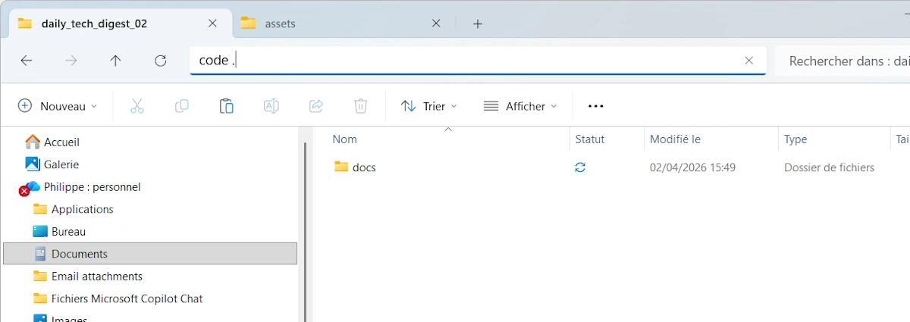
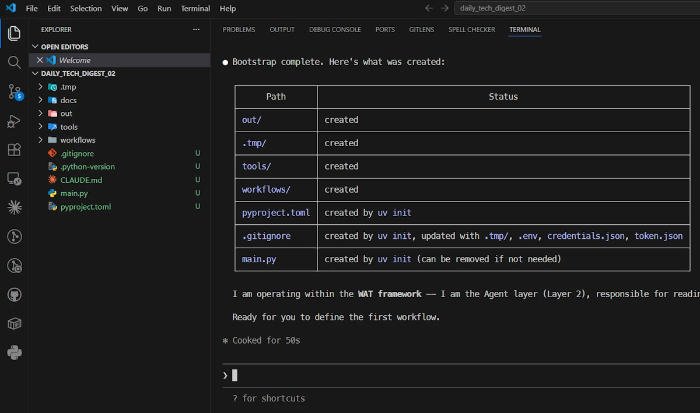
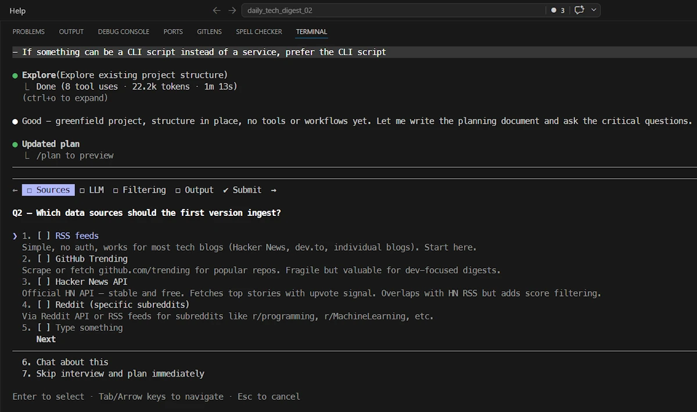
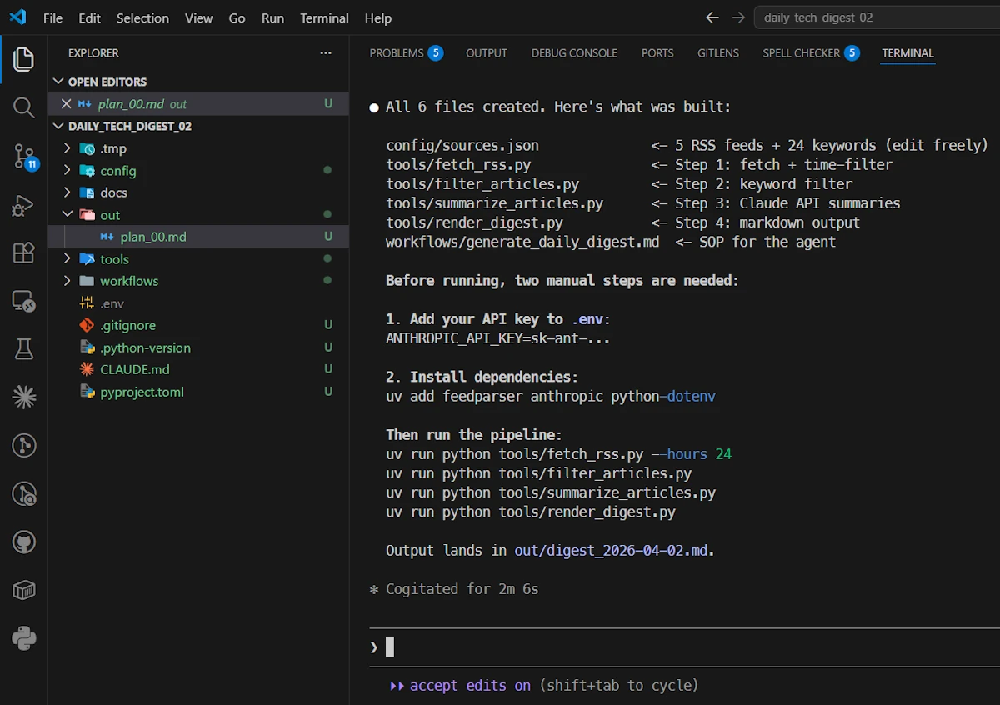
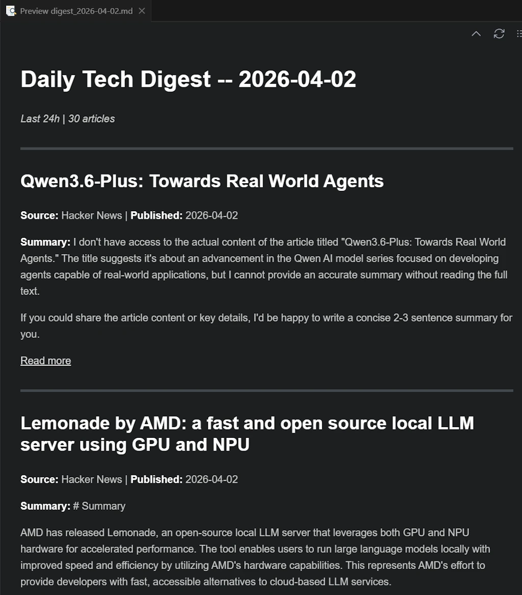

# Claude and the WAT Task Pipeline
{: .no_toc }

...
{: .lead }


<!-- <h2 align="center">
<span style="color:orange"><b> 🚧 This post is under construction 🚧</b></span>
</h2> -->


<!-- ###################################################################### -->
<!-- ###################################################################### -->
<!-- ###################################################################### -->
## TL;DR
{: .no_toc }

* Use **[SDD]()** when you're *building* something that lasts.
* Use a **WAT Task Pipeline** when you're *processing* something one-off.
* Here, we apply WAT Task Pipeline principles to create a *Daily Tech Digest Generator*
* Keep `CLAUDE.md` independent of the task pipeline
* `docs/project_goal.md` is specific to the task pipeline
* Enable **Plan Mode** (`SHIFT+TAB`) before any implementation and **read** the plan before accepting it
* Tools are independent: improve them one at a time by prompting Claude with a bounded, testable request


<figure style="max-width: 900px; margin: auto; text-align: center;">

<figcaption>Claude YOLO mode, safely contained. Really?</figcaption>
</figure>


<!-- ###################################################################### -->
<!-- ###################################################################### -->
<!-- ###################################################################### -->
## Table of Contents
{: .no_toc .text-delta}
- TOC
{:toc}


<!-- ###################################################################### -->
<!-- ###################################################################### -->
<!-- ###################################################################### -->
## SDD vs WAT Task Pipeline

What's the difference between SDD (Spec-Driven Development) and WAT Task Pipeline (WAT stands for Workflows, Agents, Tools) and when to use which?

### The Core Distinction
{: .no_toc }

Both [SDD]() and WAT Task Pipelines use the **WAT framework** (Workflows, Agents, Tools) a three-layer architecture that separates AI reasoning from deterministic code execution. The difference is in *what we are building* and *what we deliver*.

**SDD (Spec-Driven Development)** is a methodology for **building software guided by specifications**. The final artifact is **code that runs in production**: a Rust binary, an API, a web application. The specs describe an architecture, contracts, and business behaviors. The agent (Claude Code) *builds* something durable.

**WAT Task Pipelines** are **workflows for executing one-shot tasks**. The final artifact is **processed data or an action**: a summary, a report, a spreadsheet, a sent email, a Jira ticket. The Python scripts are *disposable tools* or *reusable-as-is utilities*, not an evolving codebase.

In short:

- **SDD**: we deliver a **system** (that produces results on demand).
- **WAT Task Pipeline**: we deliver a **result** (a file, processed data, or a triggered action).


### Why Multiple Scripts Instead of One?
{: .no_toc }

We *could* put everything in a single file. But splitting into separate steps gives us:

- **Fault recovery**: if scraping fails, we rerun just that step.
- **Observability**: we can inspect intermediate data between steps.
- **Composability**: we reuse "summarize articles" in another pipeline.
- **Parallelism**: independent steps can run concurrently.

Same logic as Powershell pipes: `fetch | parse | summarize | synthesize` where objects (think of `.md` or `.json` files) go down the flow, from one step to the other. A single script *works*, but a pipeline *composes and maintains itself*.


### The "Who Complains About What" Test
{: .no_toc }

This is perhaps the sharpest way to tell them apart:

- WAT Task Pipeline: the client complains that the data isn't formatted the way they want. The issue is **presentation or one-shot processing**.
- SDD: the client complains that the application can't handle their data the way they want. The issue is **behavior or the data model**.

In a task pipeline, once the deliverable is consumed, it's done. In SDD, the deliverable *persists and interacts*. The user comes back to it, feeds it, and depends on it over time.


### Decision Grid
{: .no_toc }

| Criterion               | SDD (Spec-Driven Development)     | WAT Task Pipeline                    |
| ------------------------ | --------------------------------- | ------------------------------------ |
| **The output is...**     | Production code                   | Processed data or a triggered action |
| **Does it evolve?**      | Yes — features, refactors         | No (or rarely)                       |
| **The agent's role**     | Builds                            | Executes                             |
| **Spec lifespan**        | Long (PRs, version history)       | Short (task description)             |
| **Typical deliverables** | Binary, API, web app              | Slides, PDF, spreadsheet, email      |
| **Bug profile**          | Behavior / data model issues      | Formatting / processing issues       |
| **Pilot profile**        | Dev guiding an architecture       | Analyst orchestrating tools          |


<!-- ###################################################################### -->
<!-- ###################################################################### -->
<!-- ###################################################################### -->
## Prerequisites

* Windows 11 (but it should work similarly on other platforms)
* VSCode
    * `winget install --id Microsoft.VisualStudioCode -e`
* Claude Code
    * `irm https://claude.ai/install.ps1 | iex`
* [uv]() (because I want to use Python)
    * `winget install astral-sh.uv`


<!-- ###################################################################### -->
<!-- ###################################################################### -->
<!-- ###################################################################### -->
## Step 00: Create project folder


Here, we apply WAT Task Pipeline principles to create what I call a *Daily Tech Digest Generator*. The idea is to scan the web for new articles, news, and RSS feeds, then rank and filter the results. Finally, the system summarizes the selected content and generates a Markdown report: essentially a pipeline you might want to run every morning at 7:30.

Open a terminal (`WIN + X` then press `I`)

```powershell
# move in your temp folder
cd $env:tmp

# Create a folder for the new project
new-item -ItemType Directory daily_tech_digest_02
cd daily_tech_digest_02

# Create a folder for the docs
new-item -ItemType Directory docs

# Open VSCode
code .
```


<figure style="max-width: 900px; margin: auto; text-align: center;">

<figcaption>Alternatively you can launch VSCode from File Explorer</figcaption>
</figure>


<!-- ###################################################################### -->
<!-- ###################################################################### -->
<!-- ###################################################################### -->
## Step 01: Create `CLAUDE.md`

* In the `docs/` folder, make some tests, keep different versions of `CLAUDE.md` etc.
* `CLAUDE.md` should be independent of the task pipeline
* Start simple and short (not more than 200 lines in any case, the shorter the better)
* Talk to ChatGPT, Claude and friends...
* Iterate, iterate, iterate
    * Improve your `CLAUDE.md` for this task pipeline but also for the next
    * This is why I try to keep 1 copy of `CLAUDE.md` and reuse it from one task pipeline to another.

You can start with the version below. Compared to other `CLAUDE.md` you can see:

* This `CLAUDE.md` file is much longer than my `%USERPROFILE%/.claude/CLAUDE.md` (20 lines)
* WAT Framework (the context) is explained upfront.
* The access rules to the folders in the "project" are set and strict
* There is a "Bootstrapping a New Project" section which is mentioned in the first prompt (see lower)
* The "How To Operate" section clearly explains how the agent is supposed to work
* The "The Self-Improvement Loop" section explains how to improve the workflow over time
* At the end the File Structure, the Execution Environment and the Dependency Management are covered.

Read `CLAUDE.md` file 10_000 times. I can't do it for you. This is your baby. Don't trust me. What works for me may not work for you. Spend lot of time on it at the beginning. Again, this is **your** `CLAUDE.md`. Keep it task pipeline agnostic, use it from one projet to another and improve it over time.


### Notes
{: .no_toc }

1. In the **File Structure** section, adjust where the final outputs should go: `out/` folder or a cloud service.
1. If you expect deliverables in cloud services, look for the word `out/` in `CLAUDE.md` and remove the unnecessary mentions;.
1. Read the **Dependency Management** section and adjust the line "Core principle:" to your need
1. Make sure the **Execution Environment** description matches your host

When you are satisfied, paste `CLAUDE.md` at the root of the project folder


### An exemple of `CLAUDE.md`
{: .no_toc }

<!--  -->
``````text
# Agent Instructions

You're working inside the **WAT framework** (Workflows, Agents, Tools). This architecture separates concerns so that probabilistic AI handles reasoning while deterministic code handles execution. That separation is what makes this system reliable.

## Context Boundaries (STRICT)

ALLOWED directories (you may read, write, and list):
* tools/
* workflows/
* config/ (if present)
* .tmp/ (for generated data only)
* out/ (for final outputs)
* Root-level files only: .env, pyproject.toml, .gitignore, CLAUDE.md

FORBIDDEN directories (you MUST NOT read, list, open, or access in any way):
* docs/
* Any other directory not listed above

This applies to you AND to any sub-agent you spawn.
If you launch an Explore agent, constrain its scope to the allowed directories only.
If you believe you need access to a forbidden directory, ask the user FIRST.

## The WAT Architecture

**Layer 1: Workflows (The Instructions)**
- Markdown SOPs (Standard Operating Procedure) stored in `workflows/`
- Each workflow defines the objective, required inputs, which tools to use, expected outputs, and how to handle edge cases
- Written in plain language, the same way you'd brief someone on your team

**Layer 2: Agents (The Decision-Maker)**
- This is your role. You're responsible for intelligent coordination.
- Read the relevant workflow, run tools in the correct sequence, handle failures gracefully, and ask clarifying questions when needed
- You connect intent to execution without trying to do everything yourself
- Example: If you need to pull data from a website, don't attempt it directly. Read `workflows/scrape_website.md`, figure out the required inputs, then execute `tools/scrape_single_site.py`

**Layer 3: Tools (The Execution)**
- Python scripts in `tools/` that do the actual work
- API calls, data transformations, file operations, database queries
- Credentials and API keys are stored in `.env`

## Bootstrapping a New Project

When `tools/` and `workflows/` are empty (fresh project), follow this sequence:

1. Read this file in full
2. Create the directory structure defined in the File Structure section
3. Initialize the Python environment with `uv init` (creates `pyproject.toml` if missing)
4. Create a `.gitignore` with sensible defaults (`.tmp/`, `.env`, `credentials.json`, `token.json`, `__pycache__/`, `.venv/`)
5. Pause and confirm what has already been created, and make sure you clearly recognize that you are operating within the WAT framework.
6. Do not create any workflows or tools at this stage. Wait for the user to define the first workflow

Do NOT assume what the project will do. The user will tell you.

## How to Operate

**1. Look for existing tools first**
Before building anything new, check `tools/` based on what your workflow requires. Only create new scripts when nothing exists for that task.

**2. Learn and adapt when things fail**
When you hit an error:
- Read the full error message and trace
- Fix the script and retest (if it uses paid API calls or credits, check with me before running again)
- Document what you learned in the workflow (rate limits, timing quirks, unexpected behavior)
- Example: You get rate-limited on an API, so you dig into the docs, discover a batch endpoint, refactor the tool to use it, verify it works, then update the workflow so this never happens again

**3. Keep workflows current**
Workflows should evolve as you learn. When you find better methods, discover constraints, or encounter recurring issues, update the workflow.

That said, don't create or overwrite workflows without asking unless I explicitly tell you to. These are your instructions and need to be preserved and refined, not tossed after one use.

## The Self-Improvement Loop

Every failure is a chance to make the system stronger:
1. Identify what broke
2. Fix the tool
3. Verify the fix works
4. Update the workflow with the new approach
5. Move on with a more robust system

This loop is how the framework improves over time.

## File Structure

**What goes where:**
- **Deliverables**: Final outputs go to `out/`
<!-- - **Deliverables**: Final outputs go to cloud services (Google Sheets, Slides, etc.) where I can access them directly -->
- **Intermediates**: Temporary processing files that can be regenerated go to `.tmp/`

**Directory layout:**

out/                            # Generated files (markdown, PDFs...) are stored as final output.
.tmp/                           # Temporary files.
tools/                          # Python scripts for deterministic execution
workflows/                      # Markdown SOPs defining what to do and how
.env                            # API keys and environment variables (NEVER store secrets anywhere else)
.gitignore                      # Excludes .tmp/, .env, __pycache__/, .venv/

## Execution Environment (STRICT)

You are running on:
- Windows 11
- PowerShell 7.x

Python execution MUST follow these rules:
- Python is managed via uv
- NEVER install Python
- NEVER use pip
- NEVER call python directly

ALWAYS run Python scripts using:

`uv run python <script.py>`

Example:

`uv run python tools/fetch_rss.py`

PowerShell scripts must be executed using:

`pwsh ./tools/script.ps1`

### Dependency Management

- NEVER install dependencies yourself — `no uv add`, `no pip install`, no manual edits to `pyproject.toml`
- If a script needs a package that is not installed, report the missing dependency and wait
- The user will run `uv add <package>` manually, then tell you to continue

<!-- **Core principle:** Local files are just for processing. Anything I need to see or use lives in cloud services. Everything in `.tmp/` is disposable. -->
**Core principle:** Local files are just for processing. Anything I need to see or use lives in the `out/` folder. Everything in `.tmp/` is disposable.

## Bottom Line

You sit between what I want (workflows) and what actually gets done (tools). Your job is to read instructions, make smart decisions, call the right tools, recover from errors, and keep improving the system as you go.

Stay pragmatic. Stay reliable. Keep learning.
``````
<!--  -->


<!-- ###################################################################### -->
<!-- ###################################################################### -->
<!-- ###################################################################### -->
## Step 02: First prompt

* In VSCode, open a terminal (`CTRL+ù`)
* Open `claude`
* ⚠️ `Alt+P`, Sonnet, High Effort
* Use this **prompt**:

```text
Read CLAUDE.md in full, then follow the instructions in the "Bootstrapping a New Project" section
```

At the end Claude created the directories and confirmed its role.

<figure style="max-width: 900px; margin: auto; text-align: center;">

<figcaption>Claude created the directories and confirmed its responsibilities.</figcaption>
</figure>


* ⚠️ Delete the `main.py` file at the root of the project
* Create a `.env` file at the root of the project (we never know)


### Note
{: .no_toc }

I'm wondering if I should "improve" `CLAUDE.md` so that it manages these 2 files at the end of the bootstrapping phase.


<!-- ###################################################################### -->
<!-- ###################################################################### -->
<!-- ###################################################################### -->
## Step 03: Create `docs/project_goal.md`

* In the `docs/` folder, make some tests, keep different versions of `project_goal.md` etc.
* Talk to ChatGPT, Claude and friends...
* Iterate, iterate, iterate

For example, here is a first version:

```
# Project: Daily Tech Digest Generator

## Goal
Build a system that generates a Daily Tech Digest. The system should:
- Collect information from online sources (e.g., RSS feeds, tech blogs, GitHub, newsletters...)
- Extract relevant articles based on user-defined topics of interest
- Summarize key insights from each article
- Produce a clear, structured daily report (format TBD: markdown, email, Google Doc...)

## Constraint
All planning must align with the WAT framework defined in CLAUDE.md.
Workflows go in workflows/, tools go in tools/, the agent coordinates.

## Context
- Target platform: Windows 11 / PowerShell 7.x
- This is a greenfield project — no code exists yet
- The exact tech stack, workflows, architecture, and tools are not yet decided
- The workflows and tools must be created as needed.

## What I expect from you right now
We are in **planning mode**. Before writing any code or proposing a specific architecture:

1. **Ask me clarifying questions**: Don't assume anything. Challenge my assumptions if needed. I'd rather answer 10 good questions now than rewrite things later.
2. **Explore the problem space**: What are the key decisions we need to make? What are the trade-offs?
3. **Propose options, not solutions**: When there are multiple valid approaches (tech stack, storage, scheduling, output format…), lay them out with pros/cons so we can decide together.
4. **Think in vertical slices**: Help me identify a minimal first slice we can build end-to-end before adding complexity.

Take your time. There is no rush to produce code.
```


And the one I will use:


```
# Project: Daily Tech Digest Generator

## Goal

Build a system that generates a Daily Tech Digest. The system should:
- Collect information from online sources (e.g., RSS feeds, tech blogs, GitHub trending, newsletters...)
- Extract relevant articles based on user-defined topics of interest
- Summarize key insights from each article
- Produce a clear, structured daily report (format TBD: markdown, email, Google Doc...)

## Constraints

All planning must align with the WAT framework defined in CLAUDE.md.
- **Workflows** go in `workflows/` — a workflow is a multi-step orchestration
- **Tools** go in `tools/` — a tool is a single, deterministic operation
- **The Agent** coordinates execution across workflows and tools

When referencing system components, always use WAT terminology (workflow, tool, agent).
Do NOT invent other abstractions or naming conventions.

## Context

- Target platform: Windows 11 / PowerShell 7.x
- Greenfield project (no existing code)
- Tech stack, architecture, workflows, and tools are not yet decided
- Everything should be designed incrementally


## Current Mode: PLANNING ONLY

### Do

- Ask questions before making any decision
- Challenge my assumptions
- Present trade-offs explicitly

### Do NOT

- Write code
- Jump to a final architecture
- Propose specific tools or workflows yet — we define those AFTER key decisions are locked
- Name files, modules, or classes prematurely


## What I Expect From You

### 1. Ask structured clarifying questions

Organize your questions into numbered categories so I can reply concisely (e.g., "Q2: RSS only for now").

- **Q1 — User needs & expectations**: Who reads the digest? What does "useful" look like? How personalized should it be?
- **Q2 — Data sources & ingestion**: Which sources? How many? Rate limits? Authentication?
- **Q3 — Filtering & relevance logic**: Keyword match? Semantic similarity? LLM-based classification? How strict?
- **Q4 — Summarization approach**: LLM provider? Local vs. API? Length and style of summaries?
- **Q5 — Output format & delivery**: Markdown file? Email? HTML? Where does the digest land?
- **Q6 — Operational constraints**: How often does it run? Acceptable latency? Cost budget? Error handling expectations?

### 2. Map the problem space

Identify:
- The key architectural decisions we need to make
- The main unknowns or risks
- Dependencies between decisions (which decisions gate others)

### 3. Propose options (not a single solution)

For each major decision (storage, scheduling, summarization, output format...):
- Present 2–3 viable options
- Explain pros / cons
- Indicate when each option is most appropriate

### 4. Help prioritize decisions

Clearly distinguish:
- **Early decisions**: things that gate the first vertical slice
- **Deferrable decisions**: things we can lock later without rework

### 5. Define a minimal vertical slice

Propose a small, end-to-end version of the system that:
- Runs locally on Windows 11 (PowerShell-friendly, no Docker required)
- Avoids unnecessary infrastructure (no database, no message queue, no cloud service)
- Covers the full pipeline: ingest → filter → summarize → output
- Is simple enough to build in one session but meaningful enough to validate the concept
- Maps cleanly onto the WAT structure (at least one workflow, a few tools, agent coordination)

### 6. Keep things pragmatic

- Avoid over-engineering
- Avoid premature optimization
- Prefer simple, testable approaches first
- If something can be a flat file instead of a database, prefer the flat file
- If something can be a CLI script instead of a service, prefer the CLI script
```


<!-- ###################################################################### -->
<!-- ###################################################################### -->
<!-- ###################################################################### -->
## Step 04: Second prompt

1. `/clear` the conversation
1. ⚠️ **TURN ON PLAN MODE**: `SHIFT+TAB`
1. Paste the content of `docs/project_goal.md` in Claude code and use it as a **prompt**.
1. Answer Claude questions


<figure style="max-width: 900px; margin: auto; text-align: center;">

<figcaption>Answering Claude's questions during planning phase</figcaption>
</figure>


When the plan is ready:

1. **Read the plan**. Do not accept blindly.
1. Ask questions or require improvement. For example : "Update the plan so that we can specify a time window (ex 24H, 48H)"
1. Don't be afraid to leave (hit `ESC` twice) the process. Then you can discuss with Claude, clarify points... Let it modify the plan... Once you are happy, you can always ask to "continue" the plan.
1. At the very end, when you are satisfied, ask Claude to make a copy of the plan in `out/plan_00.md` folder
    - Remember, Claude cannot copy the plan in `docs/` (but you can).


<!-- ###################################################################### -->
<!-- ###################################################################### -->
<!-- ###################################################################### -->
## Step 05: Implementing

1. **TURN ON ACCEPT EDIT**: `SHIFT+TAB`
* ⚠️ `Alt+P`, Sonnet, Medium (or even Low)
1. Tell Claude to code

<figure style="max-width: 900px; margin: auto; text-align: center;">

<figcaption>Show time!</figcaption>
</figure>


**Read** the summary and execute the 2 manual steps

1. ⚠️ `ANTHROPIC_API_KEY`. Go to the [Claude Console](https://platform.claude.com/dashboard), generate a key and paste it in the `.env` file
    - Make sure some credits are available. Since Haiku is used to summarize the articles it will cost few cents, not more.
1. in a second terminal (`CTRL+SHIFT+ù`) run the command `uv add feedparser anthropic python-dotenv`

Test the tools in order
1. `uv run python tools/fetch_rss.py --hours 24`
1. `uv run python tools/filter_articles.py`
1. `uv run python tools/summarize_articles.py`
1. `uv run python tools/render_digest.py`

At the end the report of the day is in the `out/` folder.

TADAA!

<figure style="max-width: 900px; margin: auto; text-align: center;">

<figcaption>The first edition of our Daily Tech Digest.</figcaption>
</figure>


<!-- ###################################################################### -->
<!-- ###################################################################### -->
<!-- ###################################################################### -->
## Next?

From the usability stand point, first thing first let's ask Claude to write a `run_me.ps1` script to run the pipe but...

### Be honest: this pipeline is weak
{: .no_toc }

The first version works, but it's naive. Keyword-based filtering misses context. RSS is not the whole web. A single Markdown file is not a delivery mechanism. Here's a short list of what's broken or missing:

| Problem | Impact |
|---|---|
| Keyword filtering catches false positives | Low signal-to-noise in the digest |
| No deduplication across feeds | Same article appears twice |
| Summarization uses no context window management | Long articles get truncated silently |
| No scheduling | You have to run it manually every morning |
| Output is a local `.md` file | Not actionable unless you open it |

None of this is a failure. It's a backlog.

### How to improve: ask Claude, tool by tool
{: .no_toc }

Here's the key insight: **each tool is independent**.

We don't need to rewrite the pipeline. We refine one tool at a time, verify it, and move on. For example:

```text
# Improve filter_articles.py
The current tool uses keyword matching. Rewrite it to use semantic
similarity via the Claude API. The tool should embed each article
title+description and compare it against a user-defined interest
profile stored in config/interests.md. Threshold: 0.75 cosine
similarity. Keep the same input/output contract (.tmp/fetched.json
-> .tmp/filtered.json).
```

That prompt is specific, bounded, and testable. Claude improves one tool, we test it, done. This is what "independent tools" provide: surgical iteration without regression risk.

Apply the same pattern to scheduling (add a `tools/schedule_digest.ps1`), deduplication (a hash cache in `.tmp/seen.json`), or email delivery (a `tools/send_email.py` wrapping SMTP or a Gmail API tool). And do not think you have to code. No, no, no my friend. You have to write a prompt (see above) and ask Claude to do it for you.

### What to build next
{: .no_toc }

Again the Daily Tech Digest Generator is an example used as an illustration but... If we want to got further, here are few natural extensions, in roughly increasing complexity:

1. **Scheduling**: `tools/schedule_digest.ps1` using Windows Task Scheduler. One tool, no new dependencies.
2. **Semantic filtering**: Replace keyword matching with embedding-based relevance. Higher signal, same interface.
3. **Source expansion**: Add Hacker News API, GitHub Trending, or Lobste.rs. Each source = one new tool.
4. **Email delivery**: `tools/send_email.py` using SMTP or a transactional API. The digest lands in your inbox at 7:30.
5. **Multi-topic profiles**: `config/interests.md` with named personas. Run once, get three tailored digests.

None of these require touching the agent logic or `CLAUDE.md`. That's the point.


<!-- ###################################################################### -->
<!-- ###################################################################### -->
<!-- ###################################################################### -->
## Conclusion

We built a working Daily Tech Digest Generator in one session: four independent tools chained in a pipeline, coordinated by an agent, governed by a `CLAUDE.md`. That's the proof of concept. Now the real work begins.

### 1. What we actually did
{: .no_toc }

Let's step back and look at the structure:

- `CLAUDE.md` defines the agent's operating rules, tool conventions, and environment. It is **task-agnostic** and reusable across any WAT pipeline.
- `docs/project_goal.md` holds the task-specific intent: what we want, constraints, and the planning protocol.
- Four tools (`fetch_rss.py`, `filter_articles.py`, `summarize_articles.py`, `render_digest.py`) implement one deterministic operation each.
- The agent reads workflows and sequences tool calls. No magic, no monolith.

That separation is the whole point. The pipeline didn't exist before we started, but the *frame* did. That frame is what you carry forward.


### 2. `CLAUDE.md` is the real deliverable
{: .no_toc }

The digest is disposable. The `CLAUDE.md` is not.

Every iteration teaches us something: which instructions Claude ignores, which constraints it violates, which sections are ambiguous. When we fix `CLAUDE.md`, we fix every future pipeline that inherits it. The `CLAUDE.md` file we refine over ten projects is worth more than any single digest generator.

Concretely: after this project, update `CLAUDE.md` with what *you* learned. Did Claude create files outside the allowed directories? Tighten the boundaries. Did it install packages itself? Add an explicit prohibition. Did it produce workflows without being asked? Add a "wait for explicit instruction" rule.

The `CLAUDE.md` in this article is a starting point. Yours should diverge from it.

### 3. `project_goal.md` is what changes
{: .no_toc }

When you start the next pipeline (a weekly competitive analysis, a GitHub trending tracker, a changelog summarizer), keep `CLAUDE.md` as-is, and rewrite only `docs/project_goal.md`. The bootstrapping prompt stays the same. The planning protocol stays the same. Only the goal changes.

That's the leverage: a stable operating framework applied to an infinite surface of one-shot tasks.


<!-- ###################################################################### -->
<!-- ###################################################################### -->
<!-- ###################################################################### -->
## Webliography

* [Spec-Driven Development with Rust and GitHub Spec Kit]()
* [What is WAT Framework](https://www.mindstudio.ai/blog/what-is-wat-framework-workflows-agents-tools)


<figure style="max-width: 560px; margin: auto;">
<div style="position: relative; padding-bottom: 56.25%; height: 0;">
    <iframe
    src="https://www.youtube.com/embed/saggDHHnmtQ"
    title="Master 95% of Claude Code in 36 Mins (as a beginner)"
    style="position: absolute; inset: 0; width: 100%; height: 100%;"
    allowfullscreen>
    </iframe>
</div>
<figcaption style="text-align: center;">
    Master 95% of Claude Code in 36 Mins (as a beginner)
</figcaption>
</figure>


