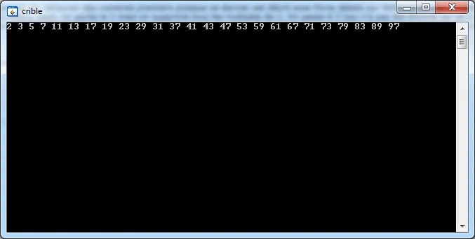

# Crible d’Eratosthène

## Introduction

Dans cet article, sous prétexte de m'intéresser au crible d’Eratosthène, je vais prendre un peu de temps pour expliquer deux ou trois techniques d'amélioration et d'optimisation de code. On aura l'occasion de faire des mesures précises de temps, de revoir des trucs à base de manipulation de bits etc...

Quoiqu'il en soit, pour illustrer tout cela, je vais m'appuyer sur un exemple hyper classique : le Crible d’Ératosthène avec lequel on tentera de sortir le nombre d'entiers premiers inférieurs à 5 000 000 le plus rapidement possible.

Je ne reviens pas sur le principe de cet algorithme qui permet de retrouver des nombres premiers puisque ce dernier est décrit avec force détails sur [Wikipedia](http://fr.wikipedia.org/wiki/Crible_d%27%C3%89ratosth%C3%A8ne "Wikipedia"). Cela dit, il faut quand même comprendre qu'afin de trouver les nombres premiers inférieurs à une certaine limite N, dans un tableau qui comprend des nombres de 0 à N-1, à partir de l'indice deux, on garde le 2 mais on supprime tous les multiples de 2. On passe à 3 (qui n'a pas été éliminé car ce n'est pas un multiple de 2) et on supprime tous ses multiples. Y a plus de 4 (car c'est un multiple de 2), on passe à 5 et on supprime ses multiples. Y a plus de 6 (multiple de 2). On traite 7, on saute, 8, 9, 10 et on traite 11 etc. A la fin, dans le tableau il ne reste plus que les nombres premiers inférieurs à la limite supérieure.

## Code initial

Le code ci-dessous est l'implémentation directe de ce qui vient d'être dit. Faites un copier-coller dans CVI par exemple, **SHIFT + F5**, sauvez sur disque ce qui doit l'être, et roule ça doit fonctionner.

```c
#include <stdlio.h>
#include <stdlib.h>

#define MAXN 100

//-----------------------------------------------------------------------------
int main (int argc, char *argv[]) {

  unsigned int        i,j;
  static unsigned int Primes[MAXN];

  for (i=0; i<MAXN; i++)
    Primes[i]=i;

  for (i=2; i<MAXN; i++) {

    for(j=i+i; j<MAXN; j+=i) {
      Primes[j] = 0;
    }
  }

  // Display
  for (i=2; i<MAXN; i++) {
    if(Primes[i])
      printf("%d ", i);
  }
  printf("\n");

  getchar();
  return 0;
}
```

<div align="center">

</div>


Voilà ce que j'obtiens à l'écran :

### Expliquons le code initial

MAXN c'est la limite maximum. On fixe la limite en dur dans le code. Ce n'est pas ce qu'il y a de plus flexible mais bon, ça ira pour ce que l'on veut faire ici.

i et j sont deux indices classiques. J'attire votre attention sur le fait que ce sont des entiers non signés. Le truc c'est que parfois c'est plus facile pour le compilateur de traiter des entiers de ce type plutôt que des entiers signés. De plus, du point de vue sémantique c'est vraiment ce que l'on veut. En effet, ce sont des indices de tableau qui ne vont pas prendre de valeurs négatives.

Primes c'est le tableau qui contiendra les nombres premiers inférieurs à N. Notez bien que c'est un tableau d'entiers non signés car les nombres premiers sont bien des entiers positifs. De plus, notez que le tableau est de type static. Pour rappel, cela signifie, entre autres, que le tableau est alloué sur le tas (heap) et que toutes ses valeurs sont nulles.

Avec la boucle à la ligne 12, on remplit le tableau Primes avec des chiffres croissants de 0 àN-1.

Le cœur de l'algorithme se trouve aux lignes 15-21. En gros, on y dit que pour tous les entiers de 2 à N-1 faire quoi ? Faire ce qu'il y a dans la boucle imbriquée. Cette dernière dit que pour tous les nombres allant de i*2 à N-1 il faut mettre à 0 le contenu de la cellule en question puis augmenter j de la valeur i. On parcoure ainsi les valeurs 2i, 3i, 4i... Bref, on met tous les multiples de i à 0. Et hop, c'est tout.

En effet, le reste (ligne 24) ne concerne que l'affichage du résultat. Notez cependant que dans la boucle, on parcoure tout le tableau mais qu'on affiche une cellule si et seulement si cette dernière est non nulle.

L'invocation de la fonction getchar() de la ligne 30 permet simplement que la console reste à l'écran. Pour que l'application se termine il suffit de cliquer sur la touche ENTER par exemple.

## Mesure précise du temps

Heu... C'est bien gentil tout ça. On sent qu'on est des purs, des durs et que notre algo est très certainement super rapide mais bon, comment on mesure tout ça ?

Si on a un compilateur qui respecte le standard [C++ 11](`NOT YET TRANSFERED`) (et au delà) la bonne nouvelle c'est que c'est dans la STL contient dorénavant la lib chrono. Cela dit, je vais supposer ici que l'on est sous Windows et avec un compilateur ANSI C classique ([LabWindows/CVI](`NOT YET TRANSFERED`) par exemple). Dans ce cas on va utiliser 2 fonctions du SDK Windows.

Voilà le code modifié qui comprend une mesure du temps précise.

```c
#include <windows.h>
#include <stdio.h>
#include <stdlib.h>

#define MAXN 100

//-----------------------------------------------------------------------------
int main (int argc, char *argv[]) {

  unsigned int        i,j;
  static unsigned int Primes[MAXN];
  LARGE_INTEGER       start, stop, frequency;
  double              delay;

  QueryPerformanceCounter(&start);

  for (i=0; i<MAXN; i++)
    Primes[i]=i;

  for (i=2; i<MAXN; i++) {
    for(j=i+i; j<MAXN; j+=i) {
      Primes[j] = 0;
    }
  }

  for (i=2; i<MAXN; i++) {
    if(Primes[i])
      printf("%d ", i);
  }
  printf("\n");

  QueryPerformanceCounter(&stop);
  QueryPerformanceFrequency(&frequency);
  delay = (double)(stop.QuadPart - start.QuadPart)/(double)frequency.QuadPart;
  printf("Benchmark : %f (sec)\n", delay);

  getchar();
  return 0;
}
```

### Explications

À la ligne 1 on prend en compte les déclarations du fichier windows.h. Aux lignes 12 et 13 on déclare 4 variables. Le type LARGE_INTEGER est défini dans WinNT.h. En gros, c'est une union qui comporte, entre autres, un champ QuadPart qui est un __int64.

À la ligne 15 on invoque QueryPerformanceCounter avec comme paramètre la variable start. Ensuite à la ligne 32 on fait de même mais avec le paramètre stop. Enfin, yaka faukon, aux lignes 32-35 on récupère la fréquence du processeur, on calcule le temps qu'à pris le code pour s'exécuter (delay) et on affiche le résultat. Notez à la ligne 34 le cast en double sur le diviseur et le numérateur de la division.

Si je lance sous CVI en mode debug le programme avec MAXN=100 j'obtiens un delay de 0.005 sec. Si je relance le programme avec MAXN=10000 alors le delay passe à 0.05 sec.

## Mesurer ce qui doit être mesuré

Avec le code tel qu'il est, il y a un léger problème. En effet, avec MAXN=10 000 on affiche tous les entiers premiers inférieurs à 10 000. On imagine assez aisément que l'application passe finalement plus de temps à afficher qu'à calculer. Il est donc urgent de commenter les lignes 26-30.

Dans ce cas, en mode debug, sous CVI j'obtiens un delay de 0.008 s.

En mode release, toujours avec le compilateur standard de CVI, j'obtiens un temps de 0.0003 sec. Lorsque j'utilise le compilateur clang (qui vient en standard avec CVI) pour générer l'exécutable en mode release j'obtiens, toujours pour MAXN=10 000, un temps de l'ordre de 0.000045 sec. Bizarrement, si j'utilise MSVC 2010 Express pour compiler le code en mode release, alors le temps d'exécution passe à 0.000080. C'est deux fois plus lent qu'avec clang ce qui m'étonne beaucoup.

Quoiqu'il en soit, on peut alors essayer de pousser MAXN un peu plus loin. Avec MAXN=100 000 alors, tant avec clang qu'avec 2010 Express on a un temps de 0.045 sec. Ouai mais... qu'est ce qui prouve qu'on trouve bien tous les bons nombres premiers ?

Je vous propose de modifier le code comme suit afin d'afficher le nombre de nombre premiers ainsi que leur somme. Ces tâches se font bien évidement après la fin du benchmark. L'idée étant qu'il existe de très nombreux sites sur lesquels on trouve des listes de premiers avec lesquelles on pourra valider nos résultats futurs. Le code devient donc :

```c
#include <windows.h>
#include <stdio.h>
#include <stdlib.h>

#define MAXN 1000000

//-----------------------------------------------------------------------------
int main (int argc, char *argv[]) {

  unsigned int        i,j, count=0, sum=0;
  static unsigned int Primes[MAXN];
  LARGE_INTEGER       start, stop, frequency;
  double              delay;

  QueryPerformanceCounter(&start);

  for (i=0; i<MAXN; i++)
    Primes[i]=i;

  for (i=2; i<MAXN; i++) {
    for(j=i+i; j<MAXN; j+=i) {
      Primes[j] = 0;
    }
  }

  QueryPerformanceCounter(&stop);
  QueryPerformanceFrequency(&frequency);
  delay = (double)(stop.QuadPart - start.QuadPart)/(double)frequency.QuadPart;
  printf("Benchmark : %f (sec)\n", delay);

  for (i=2; i<MAXN; i++) {
    if(Primes[i]){
      sum += Primes[i];
      count++;
    }
  }
  printf("Sum : %d\n", sum);
  printf("Count : %d\n", count);

  getchar();
  return 0;
}
```

Notez la déclaration et l'initialisation des variables count et sum à la ligne 10. Enfin la partie qui calcule le nombre et la somme des nombres premiers se fait dans les lignes 31-38 et n'appelle pas de commentaires particuliers.

Avec MAXN=100 000, en mode debug, voilà l'affichage obtenu :

```
Benchmark : 0.115852 (sec)
Sum : 454396537
Count : 9592
```

Allons un peu plus loin et essayons MAXN=1 000 000. Là on obtient :

```
Benchmark : 1.290822 (sec)
Sum : -1104303641
Count : 78498
```

Oups ! En fait on a un problème relativement simple à résoudre. La somme est si importante qu'elle ne tient même plus dans un entier non signé (32bit, 0-2^31-1). Il faut donc modifier le code comme suit :

```c
#include <windows.h>
#include <stdio.h>
#include <stdlib.h>

#define MAXN 1000000

//-----------------------------------------------------------------------------
int main (int argc, char *argv[]) {

  unsigned int        i,j, count=0;
  unsigned long long  sum=0;
  static unsigned int Primes[MAXN];
  LARGE_INTEGER       start, stop, frequency;
  double              delay;

  QueryPerformanceCounter(&start);

  for (i=0; i<MAXN; i++)
    Primes[i]=i;

  for (i=2; i<MAXN; i++) {
    for(j=i+i; j<MAXN; j+=i) {
      Primes[j] = 0;
    }
  }

  QueryPerformanceCounter(&stop);
  QueryPerformanceFrequency(&frequency);
  delay = (double)(stop.QuadPart - start.QuadPart)/(double)frequency.QuadPart;
  printf("Benchmark : %f (sec)\n", delay);

  for (i=2; i<MAXN; i++) {
    if(Primes[i]){
      sum += Primes[i];
      count++;
    }
  }
  printf("Sum : %llu\n", sum);
  printf("Count : %d\n", count);

  getchar();
  return 0;
}
```

Dans le code source, il faut juste remarquer le type de la variable sum à la ligne 11 (unsigned long long) ainsi que le format utilisé lors du printf de la ligne 39 (%llu).

Finalement voilà ce que l'on obtient à l'affichage :

```
Benchmark : 1.303847 (sec)
Sum : 37550402023
Count : 78498
```

Si on prend comme objectif de retrouver le plus rapidement les nombres premiers inférieurs à 5 000 000, en mode debug on obtient :

```
Benchmark : 7.569897 (sec)
Sum : 838596693108
Count : 348513
```

En mode release (MSVC 2010) on obtient :

```
Benchmark : 0.496898 (sec)
Sum : 838596693108
Count : 348513
```

## Point rapide à ce stade

1. On a un "challenge" : retrouver le plus rapidement possible les entiers premiers inférieurs à 5 000 000.
2. On a un premier algorithme de base qui est fonctionnel et juste
3. On a les moyens de vérifier nos résultats (la somme et le nombres de nombres premiers).
4. On sait chronométrer correctement notre code et on évite de mesurer ce qui ne doit pas l'être (les sorties écran).
5. Cerise sur le gâteau, tout en restant dans l'environnement CVI on sait faire des tests avec 3 compilateurs différents (CVI, clang et MSVC Express 2010) en mode release.

Bref, on a un cadre de développement et ce n'est déjà pas si mal. Y a plus qu'à se concentrer sur l'optimisation du code à proprement parler et là, on va procéder étape par étape.

## Optimiser l'algorithme en limitant le nombre de traitements 1/3

Quand on regarde le résultat pour 5 000 000 on voit qu'il n'y a que 348 513 premiers. Ce qui serait vraiment cool, ce serait de ne jouer qu'avec ces nombres. Par exemple, si au lieu de parcourir les 5 000 000 de cellules du tableau, on pouvait n'en parcourir que 350 000 on irait 14 (5000/350) fois plus vite instantanément. Malheureusement ce n'est pas possible dans ce type de problème. Ici on est vraiment obligé de parcourir les cellules, de faire un test et de déterminer si le nombre est premier ou non. En revanche, dans d'autres problèmes d'optimisation, essayer de ne travailler que sur les éléments attendus en sortie est souvent une bonne réflexion à avoir car on peut être facilement bien récompensé.

OK... Si on est obligé de parcourir les cellules, on peut, peut être limiter la quantité de calculs à effectuer. Ici, il y a deux réflexions à faire. La première c'est que tous les nombres pairs (à l'exception de 2) ne sont pas premier. Comme sur les 5 000 000 il représentent la moitié des nombres à inspecter, essayer de modifier notre programme afin de ne plus perdre de temps sur les nombres pairs est sans doute une très très bonne idée.

Voilà donc le code que je vous propose :

```c
#include <windows.h>
#include <stdio.h>
#include <stdlib.h>

#define MAXN 5000000

//-----------------------------------------------------------------------------
int main (int argc, char *argv[]) {

  unsigned int        count=0;
  unsigned long long  i, j,sum=0;
  static unsigned int Primes[MAXN];
  LARGE_INTEGER       start, stop, frequency;
  double              delay;

  QueryPerformanceCounter(&start);

  for (i=0; i<MAXN; i++)
    Primes[i]=i;

  for (i=3; i<MAXN; i+=2) {
    for(j=i+i; j<MAXN; j+=i) {
      Primes[j] = 0;
    }
  }

  QueryPerformanceCounter(&stop);
  QueryPerformanceFrequency(&frequency);
  delay = (double)(stop.QuadPart - start.QuadPart)/(double)frequency.QuadPart;
  printf("Benchmark : %f (sec)\n", delay);

  sum=2;
  count=1;
  for (i=3; i<MAXN; i+=2) {
    if(Primes[i]){
      sum += Primes[i];
      count++;
    }
  }
  printf("Sum : %llu\n", sum);
  printf("Count : %d\n", count);

  getchar();
  return 0;
}
```

A la ligne 21, notez que la boucle for commence dorénavant à 3 et que l'incrémentation se fait par pas de 2 (i+=2). Cette boucle "évite" donc tous les nombres pairs.

Pour le reste, à la ligne 32, avant de commencer à faire la somme des entiers premiers, on met la somme à 2 (sum=2) et on indique qu'on a déjà compté un nombre premier (ligne 33, count=1). Pour le reste, dans la boucle qui fait la somme et le compte des nombres premiers, là aussi on commence à 3 et on incrémente par 2 afin d'éviter tous les multiples de 2.

Finalement dans CVI en mode debug voilà ce que l'on obtient :

```
Benchmark : 3.977920 (sec)
Sum : 838596693108
Count : 348513
```

Cette valeur est à comparer avec la valeur précédente : 7.56 sec. Pas mal pour une ou deux modifications

## Optimiser l'algorithme en limitant le nombre de traitements 2/3

Il existe une seconde possibilité pour diminuer le nombre d'opérations. En effet, il est possible d'arrêter les tests lorsque le carré de l'entier étudié est supérieur à MAXN. On peut facilement prendre en compte cette remarque avec le code suivant :

```c
#include <windows.h>
#include <stdio.h>
#include <stdlib.h>

#define MAXN 5000000

//-----------------------------------------------------------------------------
int main (int argc, char *argv[]) {

  unsigned int        count=0;
  unsigned long long  i, j,sum=0;
  static unsigned int Primes[MAXN];
  LARGE_INTEGER       start, stop, frequency;
  double              delay;

  QueryPerformanceCounter(&start);

  for (i=0; i<MAXN; i++)
    Primes[i]=i;

  for (i=3; i<MAXN; i+=2) {
    for(j=i*i; j<MAXN; j+=i) {
      Primes[j] = 0;
    }
  }

  QueryPerformanceCounter(&stop);
  QueryPerformanceFrequency(&frequency);
  delay = (double)(stop.QuadPart - start.QuadPart)/(double)frequency.QuadPart;
  printf("Benchmark : %f (sec)\n", delay);

  sum=2;
  count=1;
  for (i=3; i<MAXN; i+=2) {
    if(Primes[i]){
      sum += Primes[i];
      count++;
    }
  }
  printf("Sum : %llu\n", sum);
  printf("Count : %d\n", count);

  getchar();
  return 0;
}
```

Du point de vue des explications il suffit de remarquer qu'à la ligne 22, on test dorénavant j=i*i par rapport à MAXN. Avec cette simple modification, sous CVI en mode debug voilà ce que l'on obtient :

```
Benchmark : 2.128411 (sec)
Sum : 838596693108
Count : 348513
```

On peut sans doute aller un peu plus loin. En effet, si on test i*i par rapport à MAXN, il est idiot dans la boucle du dessus de laisser aller i de 3 à MAXN. Il est peut-être malin de le limiter à sqrt(MAXN).  Si on essaie le code suivant :

```c
#include <windows.h>
#include <stdio.h>
#include <stdlib.h>

#define MAXN      5000000
#define SQRT_MAXN 2236

//-----------------------------------------------------------------------------
int main (int argc, char *argv[]) {

  unsigned int        count=0;
  unsigned long long  i, j,sum=0;
  static unsigned int Primes[MAXN];
  LARGE_INTEGER       start, stop, frequency;
  double              delay;

  QueryPerformanceCounter(&start);

  for (i=0; i<MAXN; i++)
    Primes[i]=i;

  for (i=3; i<SQRT_MAXN; i+=2) {
    for(j=i*i; j<MAXN; j+=i) {
      Primes[j] = 0;
    }
  }

  QueryPerformanceCounter(&stop);
  QueryPerformanceFrequency(&frequency);
  delay = (double)(stop.QuadPart - start.QuadPart)/(double)frequency.QuadPart;
  printf("Benchmark : %f (sec)\n", delay);

  sum=2;
  count=1;
  for (i=3; i<MAXN; i+=2) {
    if(Primes[i]){
      sum += Primes[i];
      count++;
    }
  }
  printf("Sum : %llu\n", sum);
  printf("Count : %d\n", count);

  getchar();
  return 0;
}
```

On remarque qu'à la ligne 6 on définit la valeur de SQRT_MAXN et que ceci fait, on a juste modifié la ligne 22 dans laquelle i varie de 3 à SQRT_MAXN. Avec cette modification voilà les résultats du bench sous CVI en mode debug :

```
Benchmark : 1.951486 (sec)
Sum : 838596693108
Count : 348513
```

## Optimiser l'algorithme en jouant sur l'organisation des données 1/2

Il y a une boucle consommatrice de temps à laquelle on ne s'est pas encore vraiment attaqué. Je veux parler de la toute première boucle, celle qui remplit le tableau Primes avec des nombres croissants. En y regardant de plus près, on n'a pas vraiment besoin que le tableau contienne les "vraies" valeurs. En effet, finalement si le nombre est premier la cellule peut juste contenir une valeur non nulle. On se fiche en effet du contenu des cellules d'indice pair et les cellules dont l'indice est non premier sont mises à zéro.

On peut modifier le code de la façon suivante :

```c
#include <windows.h>
#include <stdio.h>
#include <stdlib.h>

#define MAXN      5000000
#define SQRT_MAXN 2236

//-----------------------------------------------------------------------------
int main (int argc, char *argv[]) {

  unsigned int        i, j, count=0;
  unsigned long long  sum=0;
  static unsigned int Primes[MAXN];
  LARGE_INTEGER       start, stop, frequency;
  double              delay;

  QueryPerformanceCounter(&start);

  memset(Primes, 1, MAXN*sizeof(unsigned int));

  for (i=3; i<SQRT_MAXN; i+=2) {
    for(j=i*i; j<MAXN; j+=i) {
      Primes[j] = 0;
    }
  }

  QueryPerformanceCounter(&stop);
  QueryPerformanceFrequency(&frequency);
  delay = (double)(stop.QuadPart - start.QuadPart)/(double)frequency.QuadPart;
  printf("Benchmark : %f (sec)\n", delay);

  sum=2;
  count=1;
  for (i=3; i<MAXN; i+=2) {
    if(Primes[i]){
      sum +=i;
      count++;
    }
  }
  printf("Sum : %llu\n", sum);
  printf("Count : %d\n", count);

  getchar();
  return 0;
}
```

Là il y a plusieurs choses importantes qui se sont passé. Ligne 19, la boucle for de remplissage initial est remplacée par un memset qui remplit le tableau avec des valeurs non nulles (peu importe la valeur). Ensuite, à la ligne 36, ce n'est plus le contenu de la cellule mais l'indice de cette dernière que l'on ajoute à la somme (sum+=i). Notez pour finir que compte tenu des gammes de valeurs parcourues dorénavant, les indices i et j ne sont plus des unsigned long long mais des unsigned int (ligne 11).

Avec les modifications voilà les résultats du bench sous CVI en mode debug :

```
Benchmark : 1.513620 (sec)
Sum : 838596693108
Count : 348513
```

On peut aller plus loin et supprimer carrément le memset() du départ. En effet, comme le tableau Primes est static, au départ, toutes les cellules sont à 0. Autrement dit, à la suite de ce changement dans l'organisation des données, à partir de l'indice 3 et pour toutes les cellules impaires, on considérera qu'une cellule dont le contenu est égal à zéro contient un nombre premier et que si son contenu est non nul c'est que le nombre n'est pas premier.

Voilà le code qui tient compte de cette nouvelle organisation :

```c
#include <windows.h>
#include <stdio.h>
#include <stdlib.h>

#define MAXN      5000000
#define SQRT_MAXN 2236

//-----------------------------------------------------------------------------
int main (int argc, char *argv[]) {

  unsigned int        i, j, count=0;
  unsigned long long  sum=0;
  static unsigned int Primes[MAXN];
  LARGE_INTEGER       start, stop, frequency;
  double              delay;

  QueryPerformanceCounter(&start);

  for (i=3; i<SQRT_MAXN; i+=2) {
    for(j=i*i; j<MAXN; j+=i) {
      Primes[j] = 1;
    }
  }

  QueryPerformanceCounter(&stop);
  QueryPerformanceFrequency(&frequency);
  delay = (double)(stop.QuadPart - start.QuadPart)/(double)frequency.QuadPart;
  printf("Benchmark : %f (sec)\n", delay);

  sum=2;
  count=1;
  for (i=3; i<MAXN; i+=2) {
    if(!Primes[i]){
      sum +=i;
      count++;
    }
  }
  printf("Sum : %llu\n", sum);
  printf("Count : %d\n", count);

  getchar();
  return 0;
}
```

À la ligne 21, la cellule contient un nombre qui n'est pas premier et on y insère la valeur 1. N'oubliez pas qu'on commence à partir de l'indice 3 et qu'on ne visite que les cellules d'indice impair. Par la suite, à la ligne 33, on test si le contenu de la cellule est vide avant de modifier, le cas échéant, la somme et le compte des nombres premiers.

Avec les modifications voilà les résultats du bench sous CVI en mode debug :

```
Benchmark : 1.517002 (sec)
Sum : 838596693108
Count : 348513
```

Misère... On n'a pratiquement pas bougé et pourtant on a enlevé une ligne de code... Faut dire que là, on arrive au bout du raisonnement et qu'il va falloir trouver une ruse de sioux si on veut aller plus loin.

## Optimiser l'algorithme en jouant sur l'organisation des données 2/2

En fait à ce stade on a déjà fait beaucoup de choses mais on peut aller encore un peu plus loin. En effet, si on remarque que la tableau Primes ne contient que des 1 et des 0 on peut légitimement se demander s'il ne serait pas plus efficace de le transformer en tableau de bits dans lequel les 0 représentent des nombres premiers. Ce faisant on éviterait les opérations d'assignation d'entiers 32 bits et on peut espérer que les opérations de manipulation de bit soient très rapides. Dernier point peut être un peu obscure : la taille physique du tableau devenant 32 plus petite, on peut espérer qu'un maximum de manipulations ses fassent dans le cache L1 du processeur ce qui augmentera très significativement la vitesse de traitement.

Il nous faut donc deux opérations. Une qui met un bit à 1 afin de remplacer la ligne "Primes[j] = 1;" et une autre qui récupère l'état d'un bit afin de remplacer la ligne "if(!Primes[i]){ ".

### Comment faire un tableau de bits ?

En fait on va prendre un tableau de char. Il faudra cependant bien prendre garde à ne pas traiter les chars en tant que tels mais vraiment manipuler les bits qui les constituent.

### La fonction SetTo1 :

Comme son nom l'indique elle a pour rôle de positionner à 1 un bit particulier. Prenons un exemple ça ira plus vite. Je souhaite mettre à 1 l'ancienne cellule N° 20 du tableau Primes. Autrement dit je souhaite mettre à 1 le 20eme entier car ce dernier n'est pas premier. Je souhaite donc mettre à 1 le 20eme bit du tableau de bits. En français dans le texte je souhaite écrire un truc du style :

```
Primes[20/8] = Primes[20/8] | (1<<offset);
```

Dans la ligne ci-dessus 20/8 est une division entière dont le résultat vaut 2. On va donc modifier le contenu du char N°2 qui est bien le troisième char du tableau (0, 1, 2).

Maintenant, il faut savoir ce que représente l'offset dans la ligne ci-dessus. En fait offset c'est, dans un char, l'indice du bit qu'on souhaite mettre à 1. Pour le déterminer il suffit de calculer le reste de la division de 20 par 8.  Autrement dit on a un truc du style :

```
offset = n%8;
```

Dans notre exemple, offset vaut 20%8=4. On va donc modifier le 4eme bit du 2eme char. Youpi on va bien modifier le 20 eme bit. Ok, ok, c'est bien gentil tout ça mais comment on le met à 1 ce bit en question?  On va construire un char qui n'a qu'un seul bit à 1 (celui qui est à la position offset désirée) avec une instruction qui ressemble à :

```
1<<offset
```

Puis on va faire un "ou" bit à bit (bitwise or) avec le char qui nous intéresse dans le tableau Primes (le 2eme dans l'exemple) . Je vous renvoie dans les bras de Google si vous ne vous rappelez plus la table de vérité du "ou". L'utilisation du "ou" fait que on a un truc du style :

```
Primes[20/8] | (1<<offset)
```

Finalement toutes ces explications devraient vous permettre de comprendre la ligne suivante :

```
Primes[20/8] = Primes[20/8] | (1<<offset);
```

### La fonction GetBit :

Elle est plus simple. Elle ressemble à :

```
return Primes[n/8] & (1<<offset);
```

Maintenant on reconnait nos enfants. Le seul truc à remarquer c'est que dorénavant on fait un "&" (et, and) entre les bits du char du tableau et ceux du char qui ne comporte qu'un seul 1. Là aussi, revoyez la table de vérité du "et" si besoin. En gros si y a un 1 au bit qui nous intéresse on retourne 1 et 0 si y a un 0.

Bon allez, trêve de plaisanteries, voilà le code source que je vous propose. Ce dernier est très didactique et on verra comment aller plus loin ensuite.

```c
#include <windows.h>
#include <stdio.h>
#include <stdlib.h>

#define MAXN      5000000
#define SQRT_MAXN 2236

static void SetTo1(unsigned char * const c, const unsigned int n);
static int GetBit(const unsigned char * const c, const unsigned int n);

//-----------------------------------------------------------------------------
int main (int argc, char *argv[]) {

  unsigned int        i, j, count=0;
  unsigned long long  sum=0;
  static unsigned char Primes[MAXN];
  LARGE_INTEGER       start, stop, frequency;
  double              delay;

  QueryPerformanceCounter(&start);

  for (i=3; i<SQRT_MAXN; i+=2) {
    for(j=i*i; j<MAXN; j+=i) {
      SetTo1(Primes, j);
    }
  }

  QueryPerformanceCounter(&stop);
  QueryPerformanceFrequency(&frequency);
  delay = (double)(stop.QuadPart - start.QuadPart)/(double)frequency.QuadPart;
  printf("Benchmark : %f (sec)\n", delay);

  sum=2;
  count=1;
  for (i=3; i<MAXN; i+=2) {
    if(!GetBit(Primes, i)){
      sum +=i;
      count++;
    }
  }
  printf("Sum : %llu\n", sum);
  printf("Count : %d\n", count);

  getchar();
  return 0;
}

//-----------------------------------------------------------------------------
static void SetTo1(unsigned char * const c, const unsigned int n){

  unsigned int segment = n/8;
  unsigned int offset = n%8;

  //Primes[n/8] = Primes[n/8] | (1<<offset)
  *(c+segment) = *(c+segment) | (1<<offset);
  return;
}

//-----------------------------------------------------------------------------
static int GetBit(const unsigned char * const c, const unsigned int n){

  unsigned int segment = n/8;
  unsigned int offset = n%8;

  //Primes[n/8] & (1<<offset)
  return *(c+segment) & (1<<offset);
}
```

Aux lignes 8 et 9 on déclare les deux fonctions statiques SetTo1 et GetBit. Elles sont statiques car elles sont "privées" au fichier et n'ont pas besoin d'être appelées depuis un autre module. Notez l'usage de "const". Pour "n" (l'indice du bit qui nous intéresse) cela garanti qu'on ne modifiera pas le paramètre "n" par inadvertance dans l'une ou l'autre fonction.

Dans SetTo1, "unsigned char *const c" fait que c est un pointeur sur un char dont le contenu peut être modifier mais qui ne peut pas pointer sur un autre char. Par exemple on ne peut pas faire "c++;" dans la fonction SetTo1 (c'est détecté à la compilation, allez-y prenez 2 minutes et faites le test).

Dans GetBit, "const unsigned char * const c" garanti qu'on ne peut ni faire pointer "c" sur un autre char ni modifier le char sur lequel il pointe. Bref on ne peut pas faire "c++;" ni "*c = 0x01" par exemple.

À la ligne 16 notez la déclaration du tableau Primes

À la ligne 24 on retrouve bien évidement l'appel à SetTo1 et à la ligne 36 on retrouve l'appel à GetBit. Enfin, aux lignes 49 et 60 on a les définitions des fonctions qu'on a expliqué en long et en large précédemment.

Allez zou, on fait un test avec CVI en mode debug.

```
Benchmark : 4.832930 (sec)
Sum : 838596693108
Count : 348513
```

Bravo ! On était à 1.5 sec et après toutes ces modifications on passe à 4.8 sec. Super l'optimisation... Attention, il ne faut pas oublier qu'on est dans CVI en mode debug. Je vous propose de faire un test en compilant le code, à partir de CVI, en mode release avec MSVC 2010 Express. Avec l'avant dernier code source voilà ce qu'on obtient :

```
Benchmark : 0.133726 (sec)
Sum : 838596693108
Count : 348513
```

Avec le tout dernier source ci-dessus voilà ce que l'on obtient :

```
Benchmark : 0.025036 (sec)
Sum : 838596693108
Count : 348513
```

**Note :** Avec le compilateur standard de CVI en mode release dans les 2 cas on obtient des résultats identiques et similaires aux résultat de l'avant dernier bench (0.13 sec).

À partir de maintenant on va mesurer nos progrès à l'aide de benchs réalisés en compilant, depuis l'IDE CVI, le code en mode release avec le compilateur de MSVC 2010.

## Accélérer le code en supprimant les appels de fonctions

Ce n'est pas toujours possible. Cela dit ici on a de la chance car on ne fait que des divisions par 8, des divisions modulo 8 et des décalages de bit à gauche. Reprenons le code de SetTo1 et modifions-le petit à petit.

```
Pas de modif :
unsigned int segment = n/8;
unsigned int offset = n%8;
Primes[segment] = Primes[segment] | (1<<offset);

Modif 1 :
unsigned int segment = n>>3;     // une division par 8 c'est 3 décalages à droite
unsigned int offset = n & (8-1); // parce que 8 est une puissance de deux
Primes[segment] = Primes[segment] | (1<<offset);

Modif 2 :
unsigned int offset = n & 7;
Primes[n>>3] = Primes[n>>3] | (1<<offset);

Modif 3 :
Primes[n>>3] = Primes[n>>3] | (1<<(n&7));

Modif 4 :
Primes[n>>3] |= (1<<(n&7));

Modif 5 :
*(Primes+(n>>3)) |= (1<<(n&7));
```

Finalement on peut donc transformer la fonction SetTo1 en une macro qui ressemble à :

```
#define SetTo1(n)   (*(Primes+(n>>3)) |=(1<<(n&7)))
```

De même GetBit est remplac par :

```
#define GetBit(n)   (*(Primes+(n>>3)) & (1<<(n&7)))
```

La nouvelle version du code source devient donc :

```c
#include <windows.h>
#include <stdio.h>
#include <stdlib.h>

#define MAXN      5000000
#define SQRT_MAXN 2236

#define SetTo1(n) (*(Primes+(n>>3)) |=(1<<(n&7)))
#define GetBit(n) (*(Primes+(n>>3)) & (1<<(n&7)))

//-----------------------------------------------------------------------------
int main (int argc, char *argv[]) {

  unsigned int         i, j, count=0;
  unsigned long long   sum=0;
  static unsigned char Primes[MAXN];
  LARGE_INTEGER        start, stop, frequency;
  double               delay;

  QueryPerformanceCounter(&start);

  for (i=3; i<SQRT_MAXN; i+=2) {
    for(j=i*i; j<MAXN; j+=i) {
      SetTo1(j);
    }
  }

  QueryPerformanceCounter(&stop);
  QueryPerformanceFrequency(&frequency);
  delay = (double)(stop.QuadPart - start.QuadPart)/(double)frequency.QuadPart;
  printf("Benchmark : %f (sec)\n", delay);

  sum=2;
  count=1;
  for (i=3; i<MAXN; i+=2) {
    if(!GetBit(i)){
      sum +=i;
      count++;
    }
  }
  printf("Sum : %llu\n", sum);
  printf("Count : %d\n", count);

  getchar();
  return 0;
}
```

Voilà le résultat du bench :

```
Benchmark : 0.033959 (sec)
Sum : 838596693108
Count : 348513
```

Bizarre, on n'a pas l'air de gagner beaucoup. C'est sans doute dû aux optimisations faites par le compilateur Microsoft.

## Optimiser l'algorithme en limitant le nombre de traitements 3/3

Si on prend un peu de recul, on peut dire que l'algorithme tient essentiellement dans la boucle des lignes 22-26 et il semble qu'il n'y ait plus beaucoup de choses à faire. Cela dit... Cela dit, on peut se demander si on appelle un minimum de fois SetTo1. Faisons un test avec le code suivant :

```c
#include <windows.h>
#include <stdio.h>
#include <stdlib.h>

#define MAXN      100 //5000000
#define SQRT_MAXN 10  //2236

#define SetTo1(n) (*(Primes+(n>>3)) |=(1<<(n&7)))
#define GetBit(n) (*(Primes+(n>>3)) & (1<<(n&7)))

//-----------------------------------------------------------------------------
int main (int argc, char *argv[]) {

  unsigned int          i, j, count=0;
  unsigned long long    sum=0;
  static unsigned char  Primes[MAXN];
  LARGE_INTEGER         start, stop, frequency;
  double                delay;
  int                   BenchCount=0;

  QueryPerformanceCounter(&start);

  for (i=3; i<SQRT_MAXN; i+=2) {
    for(j=i*i; j<MAXN; j+=i) {
      BenchCount++;
      printf("%d :\n", j);
      SetTo1(j);
    }
  }

  QueryPerformanceCounter(&stop);
  QueryPerformanceFrequency(&frequency);
  delay = (double)(stop.QuadPart - start.QuadPart)/(double)frequency.QuadPart;
  printf("Benchmark : %f (sec)\n", delay);
  printf("BenchcCount : %d\n", BenchCount);

  sum=2;
  count=1;
  for (i=3; i<MAXN; i+=2) {
    if(!GetBit(i)){
      sum +=i;
      count++;
    }
  }
  printf("Sum : %llu\n", sum);
  printf("Count : %d\n", count);

  getchar();
  return 0;
}
```

Faites bien attention. On met MAXN à 100. Pour le reste on incrémente un traceur (BenchCount) dans la boucle (ligne 25) et histoire d'en rajouter une couche, on affiche aussi l'indice du bit qu'on met à 1. Lorsque je lance le code ci-dessus j'obtiens la sortie suivante :

```
9 :
12 :
15 :
18 :
21 :
24 :
27 :
30 :
33 :
36 :
39 :
42 :
45 :
48 :
51 :
54 :
57 :
60 :
63 :
66 :
69 :
72 :
75 :
78 :
81 :
84 :
87 :
90 :
93 :
96 :
99 :
25 :
30 :
35 :
40 :
45 :
50 :
55 :
60 :
65 :
70 :
75 :
80 :
85 :
90 :
95 :
49 :
56 :
63 :
70 :
77 :
84 :
91 :
98 :
81 :
90 :
99 :
Benchmark : 0.015652 (sec)
BenchcCount : 57
Sum : 1060
Count : 25
```

Y a un truc qui ne va pas... En effet, on remarque qu'on met à 1 les bits d'indice pair. Cela n'a pas lieu d'être car on sait qu'on ne tient pas compte des chiffres pairs (qui ne sont pas premiers). Bref, on perd du temps. Je vous propose donc le code suivant :

```c
#include <windows.h>
#include <stdio.h>
#include <stdlib.h>

#define MAXN      100 //5000000
#define SQRT_MAXN 10  //2236

#define SetTo1(n) (*(Primes+(n>>3)) |=(1<<(n&7)))
#define GetBit(n) (*(Primes+(n>>3)) & (1<<(n&7)))

//-----------------------------------------------------------------------------
int main (int argc, char *argv[]) {

  unsigned int          i, j, count=0;
  unsigned long long    sum=0;
  static unsigned char  Primes[MAXN];
  LARGE_INTEGER         start, stop, frequency;
  double                delay;
  int                   BenchCount=0;

  QueryPerformanceCounter(&start);

  for (i=3; i<SQRT_MAXN; i+=2) {
    for(j=i*i; j<MAXN; j+=i*2) {
      BenchCount++;
      printf("%d :\n", j);
      SetTo1(j);
    }
  }

  QueryPerformanceCounter(&stop);
  QueryPerformanceFrequency(&frequency);
  delay = (double)(stop.QuadPart - start.QuadPart)/(double)frequency.QuadPart;
  printf("Benchmark : %f (sec)\n", delay);
  printf("BenchcCount : %d\n", BenchCount);

  sum=2;
  count=1;
  for (i=3; i<MAXN; i+=2) {
    if(!GetBit(i)){
      sum +=i;
      count++;
    }
  }
  printf("Sum : %llu\n", sum);
  printf("Count : %d\n", count);

  getchar();
  return 0;
}
```

La seule modification apparaît à la ligne 24 où dorénavant on incrémente j de i*2 alors qu'avant on l'incrémentait de i. Cela nous évite de parcourir les multiples qui sont des nombres pairs. Par exemple quand i vaut 3, on commence par 9 puis par 9+6=15 là ou avant on passait par 9, 12 et 15. Voilà la sortie obtenue :

```
9 :
15 :
21 :
27 :
33 :
39 :
45 :
51 :
57 :
63 :
69 :
75 :
81 :
87 :
93 :
99 :
25 :
35 :
45 :
55 :
65 :
75 :
85 :
95 :
49 :
63 :
77 :
91 :
81 :
99 :
Benchmark : 0.012045 (sec)
BenchcCount : 30
Sum : 1060
Count : 25
```

Benchcount passe 57 à 30 ! Pas mal... Peut-on aller plus loin ? Je vous propose de modifier le code comme suit :

```c
#include <windows.h>
#include <stdio.h>
#include <stdlib.h>

#define MAXN      100 //5000000
#define SQRT_MAXN 10  //2236

#define SetTo1(n) (*(Primes+(n>>3)) |=(1<<(n&7)))
#define GetBit(n) (*(Primes+(n>>3)) & (1<<(n&7)))

//-----------------------------------------------------------------------------
int main (int argc, char *argv[]) {

  unsigned int          i, j, count=0;
  unsigned long long    sum=0;
  static unsigned char  Primes[MAXN];
  LARGE_INTEGER         start, stop, frequency;
  double                delay;
  int                   BenchCount=0;

  QueryPerformanceCounter(&start);

  for (i=3; i<SQRT_MAXN; i+=2) {
    for(j=i*i; j<MAXN; j+=i*2) {
      BenchCount++;
      printf("%d : %d :\n", i, j);
      SetTo1(j);
    }
  }

  QueryPerformanceCounter(&stop);
  QueryPerformanceFrequency(&frequency);
  delay = (double)(stop.QuadPart - start.QuadPart)/(double)frequency.QuadPart;
  printf("Benchmark : %f (sec)\n", delay);
  printf("BenchcCount : %d\n", BenchCount);

  sum=2;
  count=1;
  for (i=3; i<MAXN; i+=2) {
    if(!GetBit(i)){
      sum +=i;
      count++;
    }
  }
  printf("Sum : %llu\n", sum);
  printf("Count : %d\n", count);

  getchar();
  return 0;
}
```

A la ligne 26 on affiche dorénavant l'indice i (le nombre premier en cours de traitement) et l'indice j (le multiple de i qu'on me à 1)

Voilà la sortie obtenue :

```
3 : 9 :
3 : 15 :
3 : 21 :
3 : 27 :
3 : 33 :
3 : 39 :
3 : 45 :
3 : 51 :
3 : 57 :
3 : 63 :
3 : 69 :
3 : 75 :
3 : 81 :
3 : 87 :
3 : 93 :
3 : 99 :
5 : 25 :
5 : 35 :
5 : 45 :
5 : 55 :
5 : 65 :
5 : 75 :
5 : 85 :
5 : 95 :
7 : 49 :
7 : 63 :
7 : 77 :
7 : 91 :
9 : 81 :
9 : 99 :
Benchmark : 0.010840 (sec)
BenchcCount : 30
Sum : 1060
Count : 25
```

Dans les cas où i=3 et 9 on remarque qu'on traite les indices j=81 et 99 deux fois. C'est redondant. Afin d'éviter de mettre j=81 à 1 quand i=9 alors qu'on l'a déjà fait quand i valait 3 je vous propose de modifier le code de la façon suivante :

```c
#include <windows.h>
#include <stdio.h>
#include <stdlib.h>

#define MAXN      100 //5000000
#define SQRT_MAXN 10  //2236

#define SetTo1(n) (*(Primes+(n>>3)) |=(1<<(n&7)))
#define GetBit(n) (*(Primes+(n>>3)) & (1<<(n&7)))

//-----------------------------------------------------------------------------
int main (int argc, char *argv[]) {

  unsigned int          i, j, count=0;
  unsigned long long    sum=0;
  static unsigned char  Primes[MAXN];
  LARGE_INTEGER         start, stop, frequency;
  double                delay;
  int                   BenchCount=0;

  QueryPerformanceCounter(&start);

  for (i=3; i<SQRT_MAXN; i+=2) {
    if(!GetBit(i)){
      for(j=i*i; j<MAXN; j+=i*2) {
        BenchCount++;
        printf("%d : %d :\n", i, j);
        SetTo1(j);
      }
    }
  }

  QueryPerformanceCounter(&stop);
  QueryPerformanceFrequency(&frequency);
  delay = (double)(stop.QuadPart - start.QuadPart)/(double)frequency.QuadPart;
  printf("Benchmark : %f (sec)\n", delay);
  printf("BenchcCount : %d\n", BenchCount);

  sum=2;
  count=1;
  for (i=3; i<MAXN; i+=2) {
    if(!GetBit(i)){
      sum +=i;
      count++;
    }
  }
  printf("Sum : %llu\n", sum);
  printf("Count : %d\n", count);

  getchar();
  return 0;
}
```

Dorénavant à la ligne 24, avant de mettre une série de bit à 1 (boucle 25-29) on vérifie si l'indice du bit n'est pas le multiple d'un indice de bit déjà traité.

```
3 : 9 :
3 : 15 :
3 : 21 :
3 : 27 :
3 : 33 :
3 : 39 :
3 : 45 :
3 : 51 :
3 : 57 :
3 : 63 :
3 : 69 :
3 : 75 :
3 : 81 :
3 : 87 :
3 : 93 :
3 : 99 :
5 : 25 :
5 : 35 :
5 : 45 :
5 : 55 :
5 : 65 :
5 : 75 :
5 : 85 :
5 : 95 :
7 : 49 :
7 : 63 :
7 : 77 :
7 : 91 :
Benchmark : 0.010839 (sec)
BenchcCount : 28
Sum : 1060
Count : 25
```

Il n'y a plus de redondance. 81 et 99 sont mis à 1 quand i vaut 3 et on ne perd plus de temps à traiter le cas où i vaut 9. Regardons ce que cela donne en mode réel c'est à dire quand on enlève les affichages et que MAXN vaut 5 000 000. Le code à utiliser est le suivant :

```c
#include <windows.h>
#include <stdio.h>
#include <stdlib.h>

#define MAXN      5000000
#define SQRT_MAXN 2236

#define SetTo1(n) (*(Primes+(n>>3)) |=(1<<(n&7)))
#define GetBit(n) (*(Primes+(n>>3)) & (1<<(n&7)))

//-----------------------------------------------------------------------------
int main (int argc, char *argv[]) {

  unsigned int          i, j, count=0;
  unsigned long long    sum=0;
  static unsigned char  Primes[MAXN];
  LARGE_INTEGER         start, stop, frequency;
  double                delay;

  QueryPerformanceCounter(&start);

  for (i=3; i<SQRT_MAXN; i+=2) {
    if(!GetBit(i)){
      for(j=i*i; j<MAXN; j+=i<<1) {
        SetTo1(j);
      }
    }
  }

  QueryPerformanceCounter(&stop);
  QueryPerformanceFrequency(&frequency);
  delay = (double)(stop.QuadPart - start.QuadPart)/(double)frequency.QuadPart;
  printf("Benchmark : %f (sec)\n", delay);

  sum=2;
  count=1;
  for (i=3; i<MAXN; i+=2) {
    if(!GetBit(i)){
      sum +=i;
      count++;
    }
  }
  printf("Sum      : %llu\n", sum);
  printf("Count    : %d\n", count);

  getchar();
  return 0;
}
```

Notez qu'à la ligne 24, au lieu de faire la multiplication par 2 de i on fait un décalage à gauche d'un bit ( i<<1) ce qui revient au même. L'affichage obtenu pour 5 000 000 entiers devient :

```
Benchmark : 0.015693 (sec)
Sum       : 838596693108
Count     : 348513
```

On passe donc de 0.033 sec à 0.015. On vient de gagner un facteur 2.

## Accélérer le code en utilisant les bonnes boucles

Il ne nous reste vraiment plus grand chose sur quoi jouer... Cela dit, on peut se demander si au lieu d'une boucle for on ne ferait pas mieux d'utiliser une boucle tant que. Afin de vérifier par nous-même je vous propose de laisser tomber CVI pour un instant, de passer sous MSVC 2010 Express et de travailler avec le code suivant en mode release :

```c
#include <windows.h>
#include <stdio.h>

#define MAXN 4294967295

//-----------------------------------------------------------------------------
int main (int argc, char *argv[]) {

  unsigned int          i, j;
  LARGE_INTEGER         start, stop;

  //----------------------------------
  QueryPerformanceCounter(&start);
    j = 0;
    for(i=0; i<MAXN; i++){
      j=i/2;
    }
  QueryPerformanceCounter(&stop);
  printf("j final    : %d\n", j);
  printf("Bench for  : %llu (ticks)\n", stop.QuadPart - start.QuadPart);

  //----------------------------------
  QueryPerformanceCounter(&start);
    j = 0;
    i = MAXN;
    while(i--){
      j=i/2;
    }
  QueryPerformanceCounter(&stop);
  printf("j final     : %d\n", j);
  printf("Bench while : %llu (ticks)\n", stop.QuadPart - start.QuadPart);

  getchar();
  return 0;
}
```

Le code n'est vraiment pas compliqué. Il utilise QueryPerformanceCounter pour mesurer la vitesse d’exécution d'une boucle for et la comparer à celle d'une boucle tant que. Notez que le j=i/2 au sein des boucles et l'affichage de j est surtout là pour obliger le compilateur à générer du code. Notez aussi enfin que l'affichage se fait maintenant en ticks car même avec un nombre de boucles important (MAXN vaut 4294967295 dans le code) on ne voit rien quand on affiche en seconde ou milliseconde.

Quand je lance le code ci-dessous voilà la sortie obtenue à l'écran :

```
j final : 2147483647
Bench for : 6131741 (ticks)
j final : 0
Bench while : 4680598 (ticks)
```

Une boucle tant que semble donc être plus rapide qu'une boucle for (25% dans notre cas). On peut toutefois se demander pourquoi. Pour cela on peut demander à MSVC 2010 à générer le code assembleur afin de l'inspecter en détail. Voilà ce que l'on obtient avec le code source précédent.

Code de la tant que :

```bash
; 24   :     j = 0;
; 25   :     i = MAXN;

    or  eax, -1
$LL2@main:

; 26   :     while(i--){

    dec eax

; 27   :       j=i/2;

    mov esi, eax
    shr esi, 1
    test    eax, eax
    jne SHORT $LL2@main
```

Code de la boucle for :

```bash
; 14   :     j = 0;
; 15   :     for(i=0; i<MAXN; i++){

    xor eax, eax
    npad    5
$LL5@main:

; 16   :       j=i/2;

    mov esi, eax
    inc eax
    shr esi, 1
    cmp eax, -1
    jb  SHORT $LL5@main
```

À priori pas grande différence. Le seul point notable c'est l'utilisation de l'instruction "test eax, eax" dans la boucle tant que et de "cmp eax, -1" dans la boucle for. En fait c'est là que vient le gain en vitesse. L'instruction test est plus efficace que le cmp car elle ne stocke pas de résultat dans le registre de destination. Elle met simplement à jour les registres de flag du processeur.

Conclusion, il vaut mieux utiliser une boucle tant que décroissante plutôt qu'une boucle for. Allez zou, au travail c'est parti. Je vous propose de fermer MSVC 2010 et de retourner sous CVI pour y saisir le code suivant :

```c
#include <stdio.h>

//-----------------------------------------------------------------------------
int main (int argc, char *argv[]) {

  unsigned int          i, j;

  j=0;
  for(i=5; i<100; i=i+3){
    j++;
  }
  printf("i final    : %d\n", i);
  printf("j final    : %d\n", j);

  j = 0;
  i = 100-5;
  i = (i+2)/3;
  while(i--){
    j++;
  }
  printf("i final    : %d\n", i);
  printf("j final    : %d\n", j);

  getchar();
  return 0;
}
```

Ce code permet de voir comment transformer une boucle for en boucle while décroissante. Afin d'être généralisable on a pris une boucle for qui va de 5 à 100 par pas de 3.

A la ligne 16 on initialise en partie le i de la boucle while en utilisant les bornes Min et Max de la boucle for (5 et 100). Cela dit dans la boucle for le i est incrémenté par pas de 3. On va donc faire, "en gros", (100-95)/3 tours de boucle. Pour la boucle while il faut calculer exactement la valeur de départ qui sera décrémentée.

Malheureusement, on ne peut pas faire une simple division entière de 95 par 3 car alors il nous manquerait 1 tour de boucle. Bref, il faut faire (95+3-1)/3. Là on obtient le bon nombre de boucles à faire.

Si jamais le pas avait été de 2 on aurait calculé (95+2-1)/2 comme valeur initiale de la boucle et si le pas avait été de 1 on aurait fait (95+1-1)/1=95.

Nous voilà prêt à revenir vers notre crible d’Eratosthène dont voici le code modifié :

```c
#include <windows.h>
#include <stdio.h>
#include <stdlib.h>

#define MAXN      5000000
#define SQRT_MAXN 2236
#define SQRT2     (SQRT_MAXN-2)>>1

#define SetTo1(n) (*(Primes+(n>>3)) |=(1<<(n&7)))
#define GetBit(n) (*(Primes+(n>>3)) & (1<<(n&7)))

//-----------------------------------------------------------------------------
int main (int argc, char *argv[]) {

  unsigned int          i, j, k, count;
  unsigned long long    sum=0;
  static unsigned char  Primes[MAXN];
  LARGE_INTEGER         start, stop, frequency;
  double                delay;

  QueryPerformanceCounter(&start);

  k = SQRT2;  //k = ((SQRT_MAXN-3+1)>>1;
  i=3;
  while(k--){
    if(!GetBit(i)){
      for(j=i*i; j<MAXN; j+=i<<1) {
        SetTo1(j);
      }
    }
    i+=2;
  }

  QueryPerformanceCounter(&stop);
  QueryPerformanceFrequency(&frequency);
  delay = (double)(stop.QuadPart - start.QuadPart)/(double)frequency.QuadPart;
  printf("Benchmark : %f (sec)\n", delay);

  sum=2;
  count=1;
  for (i=3; i<MAXN; i+=2) {
    if(!GetBit(i)){
      sum +=i;
      count++;
    }
  }
  printf("Sum       : %llu\n", sum);
  printf("Count     : %d\n", count);

  getchar();
  return 0;
}
```

Pas de panique... Il y a pas mal de modifications d'un coup mais tout devrait devenir plus clair avec les explications qui vont suivre. En fait, sur les 2 boucles imbriquées je n'en ai modifié qu'une seule (la boucle externe) car pour la boucle interne... Ben... Je n'ai pas trouvé de solution efficace.

Pour rappel voilà la boucle for externe que l'on avait initialement :

```c
for (i=3; i<SQRT_MAXN; i+=2) {
  ...
}
```

Compte tenu de ce que l'on vient de voir, cette boucle doit être traduite de la façon suivante :

```c
k = (SQRT_MAXN-3+1)/2;
while(k--){
  ...
}
```

Si maintenant on remarque que k est initialisé par une constante, autant définir cette dernière à l'aide d'un #define. C'est ce qui est fait dans le code à la ligne 7 avec SQRT2.

Pour le reste, il faut remarquer l'initialisation de i à la ligne 23 ainsi que son incrémentation à la ligne 31.

Voilà l'affichage à l'écran. On passe finalement les 10 ms!

```
Benchmark : 0.009626 (sec)
Sum : 838596693108
Count : 348513
```

## La dernière version du code ?

Voilà pour finir ce que je pense être la dernière version du code

```c
#include <windows.h>
#include <stdio.h>
#include <stdlib.h>

#define MAXN              5000000
#define SIZEOF_SEGMENT      32
#define NBINT32                     156250  //1+MAXN/SIZEOF_SEGMENT
#define SQRT_MAXN                   2236    //1+(int)sqrt(MAXN)
#define SQRT2                           1117    //(SQRT_MAXN-2)>>1

#define SetTo1(n) (*(Primes+(n>>5)) |=(1<<(n&31)))
#define GetBit(n) (*(Primes+(n>>5)) & (1<<(n&31)))

//-----------------------------------------------------------------------------
int main (int argc, char *argv[]) {

  unsigned int          i=3, j, k=SQRT2, count=1, h;
  unsigned long long    sum=2;
  static unsigned int   Primes[NBINT32];
  LARGE_INTEGER         start, stop, frequency;
  double                delay;

  QueryPerformanceCounter(&start);

  while(k--){
    if(!GetBit(i)){
      h=i<<1;
      for(j=i*i; j<MAXN; j+=h) {
        SetTo1(j);
      }
    }
    i+=2;
  }

  QueryPerformanceCounter(&stop);
  QueryPerformanceFrequency(&frequency);
  delay = (double)(stop.QuadPart - start.QuadPart)/(double)frequency.QuadPart;
  printf("Benchmark : %f (sec)\n", delay);

  for (i=3; i<MAXN; i+=2) {
    if(!GetBit(i)){
      sum +=i;
      count++;
    }
  }
  printf("Sum       : %llu\n", sum);
  printf("Count     : %d\n", count);

  getchar();
  return 0;
}
```

Il faut commencer par remarquer l'initialisation des variables i et k qui se fait maintenant à la ligne 17. Cela permet de "tricher" un peu en évitant de le faire dans le benchmark (entre les 2 appels à QueryPerformanceCounter)

Ensuite, le tableau Primes a maintenant une taille égale à NBINT32. Attention, Primes est dorénavant un tableau de unsigned int. L'idée est d'aider le compilateur en le faisant travailler avec des types qui correspondent bien à ceux de ses registres (entiers 32 bits plutôt que des chars). NBINT32 est définie à la ligne 7 en utilisant la "constante" SIZEOF_SEGMENT qui vaut 32 (le nombre de bits d'un unsigned int).

Le nombre de bits par cellule du tableau Primes étant dorénavant 32 (au lieu de 8) il faut modifier les macros SetTo1 et GetBit

J'ai mis la valeur de NBINT32 en dur. Ce n'est sans doute pas une très bonne idée. Au pire il suffit de la supprimer et d'utiliser ce qui est en commentaire.

J'ai fait la même chose pour la macro SQRT2.

Ligne 27, afin d'éviter tout calcul dans la boucle for, on évalue 2*i (i<<1), on le colle dans une variable h et on utilise h comme incrément à la ligne 28. Je pense que MSVC peut le faire lui-même mais bon, autant assurer le coup.

Mine de crayon, avec tout ça, on gagne encore un peu. On était aux alentours de 10ms on passe dorénavant aux alentours de 7 ms.  Afin d'assurer le coup j'ai un code qui permet de faire tourner 100 fois le calcul et la moyenne des chronométrages est aux alentours de 6.78 ms. Quoiqu'il en soit, voilà l'une des dernières sortie écran :

```
Benchmark : 0.007441 (sec)
Sum : 838596693108
Count : 348513
```

## Conclusion

Pas le temps pour l'instant, on verra plus tard...

