# CVI dans l'enseignement pour l'apprentissage du C ANSI

## Introduction

Le but de cet article est de permettre de faire rapidement le point sur les multiples avantages qu'il y a à utiliser CVI dans l'enseignement pour l'apprentissage du C ANSI. En effet, CVI bénéficie de caractéristiques uniques qui nous semblent particulièrement adaptées à la formation et à l’enseignement.

## La programmation en C

LabWindows/CVI est un environnement de développement en C (il respect la norme ANSI C 99). A ce titre, il regroupe tous les outils nécessaires à la création d’applications Windows développées en C. On compte ainsi un éditeur de code source C, un très bon débogueur, des panneaux de fonctions qui aide à saisir correctement les paramètres des fonctions invoquées, un éditeur d’interface graphique, deux compilateurs 32 bits et 64 bits et un créateur de logiciel d’installation et de déploiement des applications. Bref, le but est clair : fournir aux développeurs un environnement complet dans lequel tout est intégré.

Prenons le cas classique où sur 2 ans, l’étudiant doit dans sa première année apprendre un certains nombre d'algorithmes et le langage C, puis dans la seconde, appliquer ses connaissances à la réalisation de programmes d’acquisitions de données ou de mesures physiques.

En utilisant CVI, le tandem éditeur/compilateur C sera dans un premier temps utilisé pour expliquer et mettre en oeuvre toutes les subtilités du langage alors que par la suite, ce sont les bibliothèques d'analyse mathématique, d'acquisition et TCP qui seront sans doute utilisées pour faire des applications "un peu plus sérieuses et conséquentes".

Par exemple, au bout de la première heure de cours, l’étudiant doit être capable de faire tourner le programme suivant :

```c
#include <stdio.h>

void main(void){
 printf("Hello World");
 getchar();
}
```

C’est vrai, ce programme n’a vraiment rien d’extraordinaire. Ceci dit, il sous-entend que :

1. Toutes les connaissances que vous, enseignant, possédez déjà sur la programmation C sont directement applicables. En effet, CVI est un compilateur répondant aux spécifications ANSI C. Il n’y a donc pas d’extension propre à National Instruments et tout source ANSI C peut être utilisé tel quel dans CVI. Cela regroupe, en autres, la majorité des sources des différentes publications didactiques ainsi que d’innombrables exemples de codes disponibles sur le Web.

Par exemple le fameux [Duff's device](http://en.wikipedia.org/wiki/Duff%27s_device "Duff's Device") passe très bien en CVI :

```c
// ----------------------------------------------------------------------------
static void send(short* to, short* from, const int count){

  int n = (count+7)/8;

  switch(count%8) {
    case 0: do { *to++ = *from++;
    case 7:      *to++ = *from++;
    case 6:      *to++ = *from++;
    case 5:      *to++ = *from++;
    case 4:      *to++ = *from++;
    case 3:      *to++ = *from++;
    case 2:      *to++ = *from++;
    case 1:      *to++ = *from++;
               } while(--n &amp;amp;gt; 0);
  }
  return;
}
```

2. Un cours C déjà utilisé sous DOS ou UNIX est facilement "portable" sous Windows.

3. En tant qu’enseignant, vous n’avez pas à vous plonger dans les méandres de la programmation Windows avant de faire réaliser par les étudiants leurs premiers programmes.

Si nous lançons l’exemple ci-dessus, CVI ouvrira automatiquement une fenêtre texte dans laquelle le message sera envoyé (il suffit de taper sur ENTER pour terminer l'application).

<div align="center">
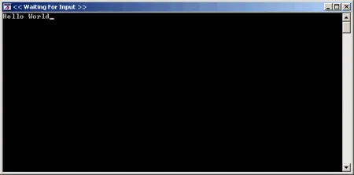
</div>


Par la suite, dans la seconde année, armé de ses nouvelles connaissances et des bibliothèques de gestion de l’interface graphique, d’analyse du signal et d’acquisition de données (via des cartes enfichables ou des instruments de mesures), l’étudiant pourra tirer pleinement parti de l’environnement Windows.

Vous trouverez ci-dessous à titre d’information le source complet d’une application Windows qui envoie un message sur une fenêtre.

```c
#include <cvirte.h>
#include <userint.h>

#include "HelloUIR.h"

static int panelHandle;

// ----------------------------------------------------------------------------
int main (int argc, char *argv[]) {

  if (InitCVIRTE (0, argv, 0) == 0)
    return -1; /* out of memory */

  if ((panelHandle = LoadPanel (0, "HelloUIR.uir", PANEL)) &amp;amp;lt; 0)
    return -1;

  SetCtrlVal (panelHandle, PANEL_TEXTMSG, "Hello World");

  DisplayPanel (panelHandle);
  RunUserInterface ();
  DiscardPanel (panelHandle);
  return 0;
}

// ----------------------------------------------------------------------------
int CVICALLBACK QuitCallback (int panel, int control, int event, void *callbackData, int eventData1, int eventData2) {

  switch (event) {
    case EVENT_COMMIT:
      QuitUserInterface (0);
    break;
  }
  return 0;
}
```

Quand on lance l'application voilà ce que l'on retrouve à l'écran :

<div align="center">
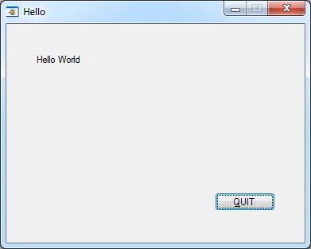
</div>

## L’utilisation des panneaux de fonctions

C’est une particularité unique de CVI que nous allons présenter ici. En effet CVI permet de tester les fonctions avant de les inclure dans le source que l’on développe. Compte tenu de l’importance de cette particularité dans le cadre de l’enseignement du langage C, nous allons procéder étape par étape sur un exemple pratique.

Imaginons que vous vouliez utiliser la fonction **strcpy** mais que vous ne sachiez plus très bien comment la mettre en oeuvre. Au sein de l’environnement CVI, dans le menu "**Library**"  (ou dans la liste déroulante en bas à gauche de l'environnement de développement) et dans la catégorie "**ANSI C**", vous allez chercher la fonction **strcpy**. Notez que pour vous aider à retrouver la fonction une arborescence est disponible et que chaque fonction ou groupe de fonctions est accompagné d’un descriptif.

Un autre alternative existe. Dans la fenêtre d'édition du code source, vous pouvez toujours taper "**strc**" puis **CTRL+SHIFT+P**. Notez que vous pouvez aussi faire l'inverse : taper **CTRL+SHIFT+P** puis saisir le mot **"strc"**. Ceci fait, la boîte de dialogue ci-dessous vous aide alors à mettre la main sur la fonction en question.

<div align="center">
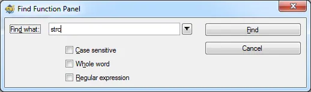
</div>


Quand on clique sur OK on a accès à une liste de choix :

<div align="center">
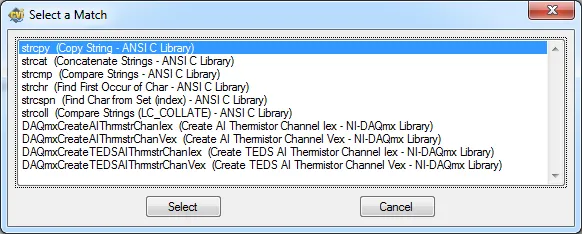
</div>


Une fois la fonction retrouvée, vous obtiendrez à l’écran un panneau de fonction ressemblant à ce qui suit.

<div align="center">
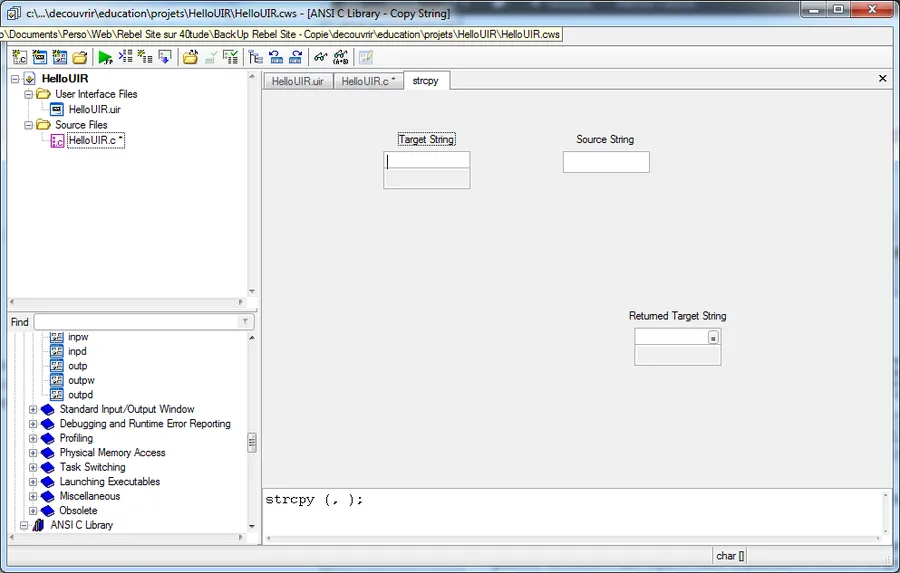
</div>


En fait, un panneau de fonction n’est rien d’autre qu’une représentation graphique de la fonction en question. On retrouve dans la partie haute du panneau de fonction (en gris) les différents paramètres sous forme visuelle alors que dans la partie basse (en blanc), la ligne de code correspondante est reprise. Notez que CVI n’oublie pas le point virgule en fin de ligne !

Toutes les fonctions utilisables dans CVI sont ainsi décrites dans des panneaux de fonctions. Qu'il s'aggisse du C, de TCP/IP, d'ActiveX, du multithreading, toutes, absolument toutes les fonctions disposent d'une représentation graphique sous forme de panneaux de fonction.

Pour obtenir de l’aide sur la fonction ou sur l’un des paramètres de la fonction, cliquez sur le paramètre puis cliquez avec le bouton droit de la souris. Voici par exemple l’aide du paramètre **Target String**.

<div align="center">
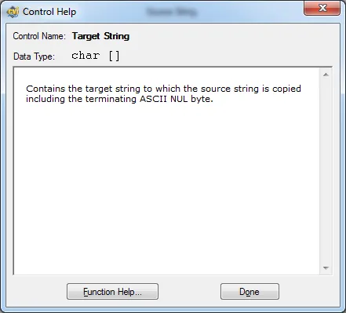
</div>


Il ne reste plus alors qu’à remplir le panneau de fonction. Par exemple, dans le paramètre **Target String** vous pouvez saisir le nom d’une variable. Dans notre cas, nous utiliserons une variable nommée "**Destination**". Ceci fait, comme le langage C demande à ce que toutes les variables utilisées soient déclarées, vous devez effectuer la déclaration de la variable en question.

La déclaration s’effectue via l'option "**Declare Variable**" du menu "**Code**". Voici la boîte de dialogue qui apparaît pour vous aider à déclarer la variable Destination.

<div align="center">
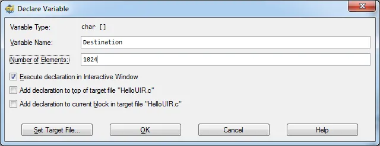
</div>


Dans l'aide en ligne, nous avons appris que le paramètre **Target String** est un tableau de caractères. Nous saisissons la taille de ce tableau dans le champs "**Number of Elements**". Dans notre exemple, il comporte 1024 caractères.

**Attention :** Notez que sur la fenêtre de déclaration de variable précédente, il existe des cases à cocher. Dans notre cas, puisque l'on est en train de "jouer" avec la fonction **strcpy**on a coché que l'option "**Execute declaration in Interactive Window**". En français cela veut dire que la déclaration de la variable se fait "ailleur", dans un autre espace mémoire et qu'en aucun cas, quoiqu'il puisse arriver par la suite, notre code source ne sera pas affecté.

Notez aussi qu'il existe deux autres cases qui, elles, permettent de demander à CVI de compléter le code source sur lequel on travaille en ajoutant la déclaration de variable soit en haut du code (variable globale) soit dans le bloc courant (typiquement une fonction dans laquelle la variable sera un variable locale). C'est généralement la dernière case que je sélectionne quand j'écris un source.

Quoiqu'il en soit, poursuivons le remplissage du panneau de fonction. Dans le cas de la fonction **strcpy**, nous saisissons directement une chaîne de caractères dans le paramètre "**Source String**".

Remarquez que les fonctions C ne nécessitant pas toujours l’utilisation d'un code retour, nous ne remplissons pas le paramètre "**Returned Target String**".

Comme vous avez pu le noter, dans la partie blanche du panneau de fonction, la ligne de code correspondant à l’emploi de la fonction se remplie au fur et à mesure que nous renseignons les différents paramètres.

Avant d’insérer automatiquement la ligne de code dans le source en cours de développement, nous pouvons tester l’appel de la fonction. Pour cela nous utilisons l'option "**Run Function Panel**" du menu "**Code**". Nous avons représenté ci-dessous le panneau de fonction après l’appel de la fonction.

Comme vous pouvez le voir, le contenu de la chaîne source est passé dans la chaîne de destination et la fonction retourne un pointeur sur la chaîne de destination. C’est pour nous la preuve que la fonction, utilisée avec ces paramètres fonctionne correctement. Cela signifie donc que si nous sommes capables d’insérer la partie basse du panneau de fonction dans un code source, tout devrait se passer correctement.

Nous n'allons pas le faire ici, mais l’insertion de la ligne de code ainsi testée se fait à l’aide de l'option **Insert Function Call** du menu **Code**.

Le plus important ici, est de noter que :

1. Le développeur a pu tester le comportement d’une fonction avant son insertion dans un code source. Il y a donc eu validation de la ligne de code.

2. Tant que nous ne sommes pas satisfaits du comportement de la fonction, nous pouvons modifier les paramètres de l’appel et utiliser le menu **Run Function Panel**autant de fois que nécessaire.

Pensez aux cas où l'étudiant doit communiquer via un port série. Il peut commencer par faire des tests en mode interactif puis une fois que les bons paramètres semblent être dans les bonnes fonctions, inclure les appels dans son code source. Typiquement, tant qu'il n'aurra pas mis de "\n\r" à la fin de sa chaîne de commande, il continuera à tester la comm avec l'appareil. Si jamais il n'utilise pas les panneaux de fonctions, il perdra du temps à modifer sont code, passera par un cycle compilation/édition de liens, test etc...

3. Du point de vu didactique, l’étudiant se trouve avec une aide directe ‘au bout des doigts ’ et peut essayer, en toute sécurité, toutes les solutions qu’il envisage.

## Utilisation de la complétion

A l'instar d'autres environnement de développement de code, l'éditeur de code surveille et assiste le développeur à tout instant. Imaginons que l'étudiant soit en train de taper **"strc"** si il tape alors sur CTRL+ESPACE une liste déroulante avec les noms des fonctions possibles apparaît.

<div align="center">
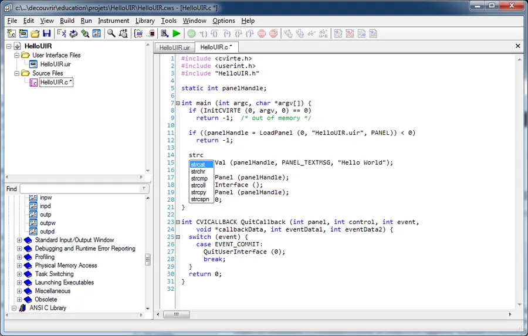
</div>


En utilisant les flèches haut et bas il circule dans la liste et sélectionne la foncion désirée en appuyant sur TAB. A cet instant, dès qu'il saisi la première parenthèse, une aide apparaît à l'écran sous forme de bulle.

<div align="center">
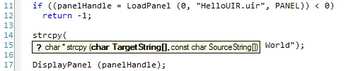
</div>


Si il tape sur F1 il retrouve l'aide de la fonction en question (il peut aussi cliquer sur le point d’interrogation).

<div align="center">
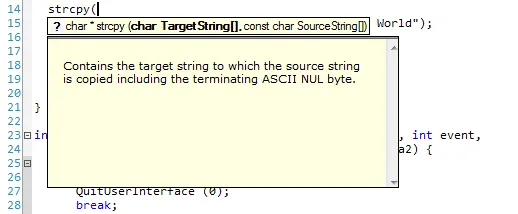
</div>


En gras, l'étudiant voit le paramètre qu'il est en train de saisir. Si il tape Destination comme nom de variable, il peut déclarer cette dernière en appuyant sur CTRL+D. Une boite de dialogue similaire à celle utilisée précédement apparaît. Il faut saisir la dimension du tableau puis cliquer sur OK pour revenir dans l'éditeur de code source.

Le curseur est sur la ligne en cours d'édition mais la déclaration de la variable a été ajoutée au code source. Pour le second paramètre (la chaîne source dans le cas qui nous interresse) il en va de même. Attention, il ne faudra pas oublier de saisir la parenthèse fermante ni le point virgule.

## Un environnement protégé

C’est de mon point de vue le point le plus important et le plus sécurisant dans CVI. En effet, ce dernier met à la disposition de l’étudiant un environnement dans lequel, quelles que soit les opérations effectuées, le système ne se bloque pas.

Prenons un exemple classique : vous créez une chaîne de 10 caractères. Au cours du programme, vous remplissez cette chaîne avec 23 caractères. Il y a donc 13 caractères supplémentaires qui sont ajoutés à la fin de la chaîne. Il y a corruption mémoire ! Toutefois, comme ce type d’opération est tout à fait licite en C, la plupart des environnements de développement ne vous préviennent pas... Dans le cas de CVI, si une telle opération s’effectue, le programme s’arrête et l’environnement vous prévient qu’une corruption mémoire a lieu.

Voici par exemple ce qui se passe :

<div align="center">
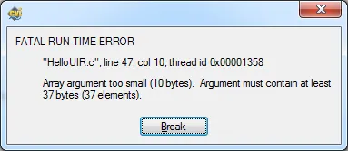
</div>


Comme vous pouvez le voir, une fenêtre apparaît et nous indique qu’une erreur fatale vient de se produire dans le programme HelloUIR.c. La boîte de dialogue précise qu’un tableau de 10 caractères va recevoir 37 octets. Dès lors, vous pouvez d’un simple click arrêter l’exécution du programme et passer sous le débogueur de CVI. Ceci fait, vous retrouverez la chaîne incriminée, afin d’inspecter sa taille et son contenu pour analyser et corriger le problème.

<div align="center">
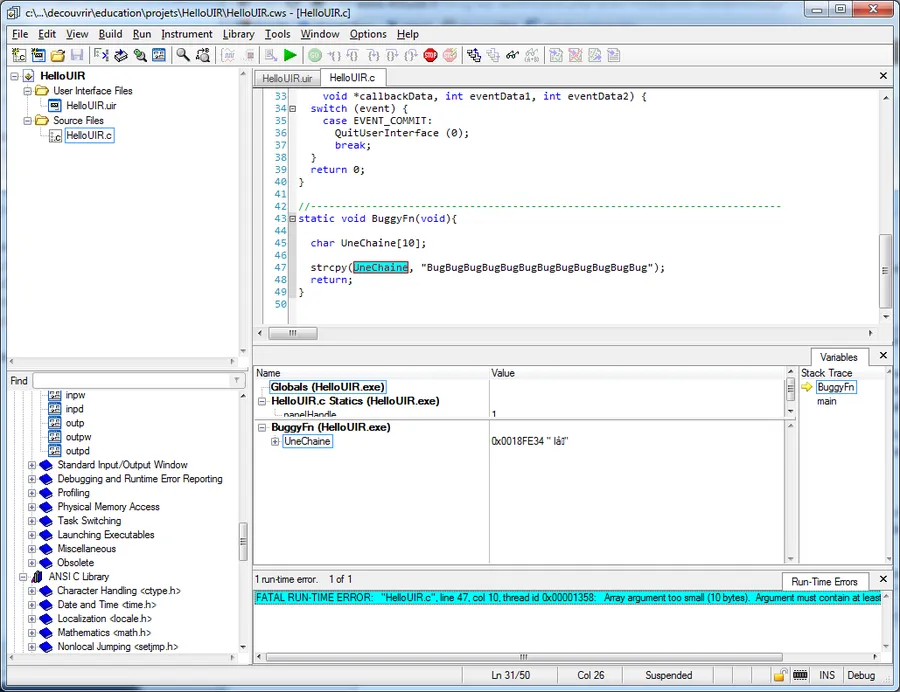
</div>


Notons que cette facilité d'utilisation du débogueur reste vraie même lorsque le programme est multithread. La seule chose c'est qu'alors, dans le code source, chaque thread est identifié par une couleur différente ce qui permet très facilement de savoir où en sont tous les threads de l'application.

## Acquisition de données et contrôle d’instruments

Il faut être clair : il n’y a pas d’autre environnement C sur le marché dans lequel l’acquisition de données soit aussi bien intégrée. Attention, le terme acquisition de données doit être pris ici dans son sens le plus large. Il peut s’agir d’acquisition de données via des cartes DAQ USB, PCIe ou PXIe, soit de données rapatriées à partir d’un instrument GPIB, VXI ou RS-232.

Ce qu'il y a de bien, c'est que la méthode utilisée par l'étudiant ne changera pas. Qu'il s'agisse de fonctions ANSI C ou d'acquisition de données, la recherche de fonctions, l'accès à l'aide, la déclaration des paramètres, l'insertion dans le code source sont les mêmes. C'est un sacré avantage qui garanti aux enseignants que l'étudiant ne perdra pas du temps avec des détails mais qu'au contraire, il restera concentré sur la mesure, l'analyse etc.

A titre d’exemple, voici le code d'une fonction qui allume un port numérique sur une carte d'acquisition de données NI. Notez que le code est équipé de toute la gestion d'erreur qui va bien ce qui garanti qu'une fois déployé sous forme d'exécutable sur une autre machine, même si une erreur se produit, cette dernière sera gérée dans la joie et la bonne humeur.

```c
// ----------------------------------------------------------------------------
static int Test(void){

  int         error=0;
  TaskHandle  taskHandle=0;
  uInt32      data=0xFFFFFFFF;
  static char errBuff[2048];
  int32       written;

  DAQmxErrChk(DAQmxCreateTask("",&amp;amp;amp;taskHandle));
  DAQmxErrChk(DAQmxCreateDOChan(taskHandle,"Dev1/port0","",DAQmx_Val_ChanForAllLines));
  DAQmxErrChk(DAQmxWriteDigitalU32(taskHandle,1,1,10.0,DAQmx_Val_GroupByChannel,&amp;amp;amp;data,&amp;amp;amp;written,NULL));

Error:
  if(DAQmxFailed(error))
    DAQmxGetExtendedErrorInfo(errBuff,2048);
  if( taskHandle!=0 ) {
    DAQmxStopTask(taskHandle);
    DAQmxClearTask(taskHandle);
    taskHandle=0;
  }
  if(DAQmxFailed(error))
    printf("DAQmx Error: %s\n",errBuff);
  return error;
}
```

## L'esprit d'ouverture

Vous voulez programmer votre propre matériel (carte PCI spécifique par exemple). Vous savez alors que dans le cadre d'une utilisation sous Windows vous devez commencer par écrire un driver Windows de bas niveau... C'est sûr, cela peut en refroidir plus d'un. Ceci dit, en standard, CVI dispose de fonctions qui permettent d'accéder aux registres des cartes. Vous disposez par exemple de fonctions inp et outp.

Vous voulez utiliser une carte non NI via une DLL qui met à votre disposition une API. No problémo. De nombreux articles sur ce site montrent comment interfacer des DLLs dans vos projets CVI.

Non, en fait, ce dont vous avez besoin, c'est de faire communiquer votre application avec une autre application. Ceci dit, sous Windows, la programmation COM vous rebute un peu et vous avez vraiment peur que les étudiants perdent vraiment trop de temps là-dessus. Pas de problème... CVI dispose de tout ce qu'il faut pour leur faciliter la vie et de nombreux exemples devraient les aider à démarrer rapidement.

C'est toujours pas ça... Ce qu'il vous faut c'est la possibilité d'intégrer des objets COM (avec ou sans interface graphique) dans vos applications... Easy, vous en prenez un, dans l'éditeur d'interface graphique, vous le mettez sur des fenêtres que vous êtes en train de concevoir, CVI construit alors, pour vous, la bibliothèque graphique des fonctions (un panneau de fonction sera construit par fonction disponible dans l'objet COM) et zou, vous avez ainsi l'assurance de ne pas changer votre méthode de travail.

Nan... C'est pas ça... En fait ce que vous voulez, c'est le beurre et l'argent du beurre... Vous voulez pouvoir concevoir des interfaces graphiques en quelques minutes, faire du C mais aussi pouvoir faire quelques appels bas niveau via le SDK de Windows. Dans ce cas, CVI déclare toujours présent. C'est simple, le SDK Windows est installé en même temps que CVI et l'aide du SDK est disponible classiquement sur [www.msdn.com](https://msdn.microsoft.com).

Non, non.. Ce que vous voulez, c'est faire faire des applications de contrôle commande temps réel. Même pas peur. CVI est capable de compiler,de linker, de déployer et de déboguer des application temps réelles (sur des cibles matérielles NI). C'est d'ailleurs un très très bon exercice à faire faire car la mise en oeuvre est somme toute assez simple et que cela permet de bien voir l'importance de la gestion des thread, les niveau de priorité etc. Notez que dans ce cadre il sera très utile (qui a dit obligatoire) d'utiliser l'outil Real Time Trace Toolkit qui permet de tout voir et de tout savoir... Cette [page](http://www.ni.com/white-paper/6447/fr/) parle de Real Time Trace Toolkit avec LabVIEW mais bon vous allez comprendre l'intérêt. L'utilisation en CVI est identique car c'est un outil indépendant de CVI (et/ou de LabVIEW).

Bon, trêve de plaisanteries, les exemples ci-dessus devraient vous avoir convaincu du haut degré d'ouverture de CVI.

## Un outil industriel

Quel est le but du jeu ? A mon avis, il est double :

1. Lors des divers enseignements (C, acquisition, mesure, contrôle, automatisme...) ne pas perdre de temps avec des problèmes connexes (compilateur, éditeur de liens, débogueur...) et faire en sorte que les étudiants se concentrent sur l’essentiel. Il n’y a rien de plus désagréable lors des séances de TP que de se battre avec "l’accastillage" d’une manipulation plutôt que de comprendre ce qu’est une analyse spectrale. CVI, associé à ses bibliothèques d’analyse et d'acquisition de données permet de réduire au minimum les opérations de mise en oeuvre des cartes. Il permet donc d’utiliser ces dernières au sein d’applications très rapidement.

2. L’autre but, c’est de mettre sur le marché du travail des ingénieurs et techniciens au fait des techniques et des outils utilisés dans l’industrie. Oui, c'est vrai, on peut se faire plaisir en faisant apprendre l'ADA aux étudiants... mais bon, il faut être réaliste et faire le constat honnête que CVI (et LabVIEW) sont parmi les outils les plus utilisés dans le cadre des applications de mesure et de contrôle-commande.

## Conclusion

Avec CVI, enseignants et étudiants bénéficient d'un environnement de développement sûr, sécurisé, dont la prise en main est très rapide et qui est largement utilisé dans l'industrie. Il serait vraiment dommage que ni les uns ni les autres ne puissent bénéficier de tous ses avantages.

Que faire maintenant ? Très simple... Parcourez ce blog, n'oubliez pas que Google est votre ami, allez sur le [User Group du site NI](https://decibel.ni.com/content/groups/labwindowscvi-user-group) ou sur le [forum de discussion CVI de NI](http://forums.ni.com/t5/LabWindows-CVI/bd-p/180) etc. Pour le reste, récupérez une [version de démonstration](http://search.ni.com/nisearch/app/main/p/ap/tech/lang/fr/pg/1/sn/n8%3A1627%2Cssnav%3Apdl/) de CVI (si besoin allez sur cette [page](http://www.ni.com/downloads/products/f/), cliquez sur CVI en bas puis choisissez CVI RT ou un autre toolkit que vous voulez évaluer). Ensuite, rentrez en contact avec [l'équipe Academic de NI France](http://france.ni.com/enseignement). Ils sont un peu obnubilés par LabVIEW mais pas obtus :-) . C'est donc avec plaisir qu'ils vous aideront à mettre en place un enseignement du C ANSI avec CVI dans votre établissement.

