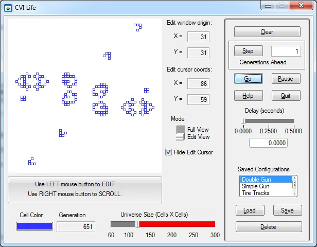
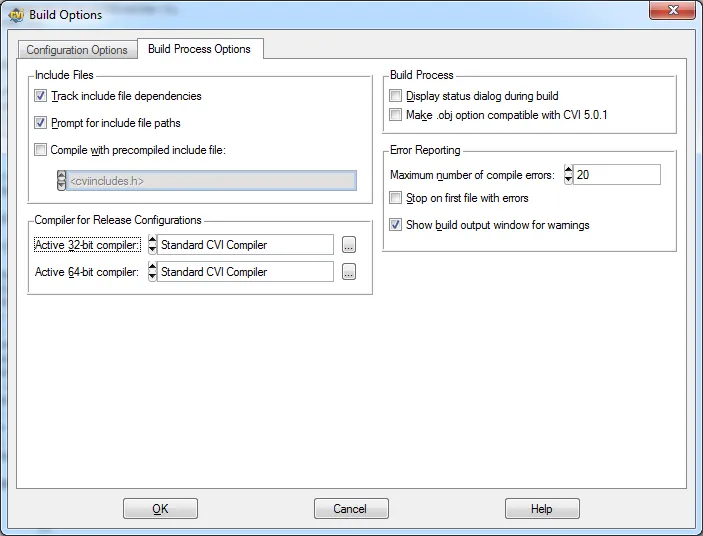
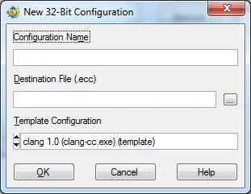
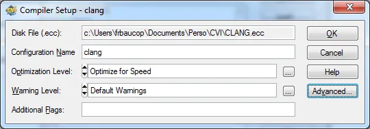
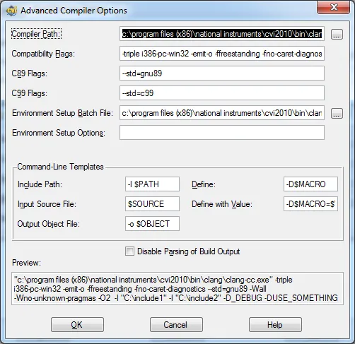
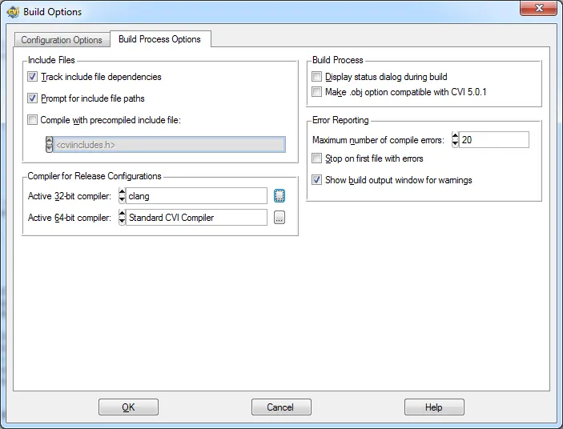

# CVI et les compilateurs optimisés

## Introduction

En 2012, le compilateur de CVI n'est toujours pas optimisé. Il a plein d'autres avantages mais bon, le code généré en mode release est très lent comparé à ce que l'on peut obtenir dans d'autres environnements. Je vais ici prendre 5 minutes pour expliquer ce qu'il faut faire pour qu'à partir de l'environnement CVI, lorsque vous êtes en mode release, le code soit compilé à l'aide d'un compilateur externe (et donc beaucoup plus rapide).

Ouvrez l'exemple life.cws qui se trouve dans ../samples/apps/life

**SHIFT + F5**. Le code se compile en mode debug et la fenêtre suivante apparaît :

Dans la liste Saved Configuration, choisissez Acom qui est tout en bas. Ensuite mettez le curseur Universe Size à fond et cliquez enfin sur Go. Quand vous en avez assez quittez l'application et revenez sous CVI.

Dans le menu Build/Configuration choisissez Release.

Dans le menu Options/Build Options... cliquez sur l'onglet Build Process Options. La fenêtre suivante apparaît :

Vérifiez simplement que le "Active 32-bit compiler" est bien Standard CVI Compiler. Cliquez sur OK. Vous êtes de retour dans l'éditeur de code. Faites **CTRL + M** puis **CTRL + F5** pour compiler et lancer l'application en mode release. Sur la fenêtre à l'écran faites les mêmes manipulations que précédemment (Acom, Universe à pleine échelle). Quand vous cliquez sur Go les choses vont beaucoup plus vite. Entre autres observez la vitesse à laquelle arrive les 2 derniers petits "missiles" et leur vitesse de déplacement. C'est bien, ça avance, mais comme vous allez le voir, on peut encore améliorer les choses.

## Mise en œuvre de clang

Dans le menu Options/Build Options... cliquez sur l'onglet Build Process Options. Cliquez sur le bouton "..." à droite de la liste "Active 32-bit compiler". Cliquez sur New et la boîte de dialogue suivant apparaît :

Dans le champ Configuration Name, pour l'instant tapez "clang". Dans le champ Destination Files (.ecc) choisissez par exemple le répertoire CVI de votre dossier personnel et tapez un nom du style clang.ecc. Ecc veut dire External Compiler Configuration. Ça y est vous avez terminé !

En fait depuis la version 2010, CVI distribue le compilateur clang qui est le frontal de compilation de la suite llvm. C'est un super compilateur qui évolue vite et il va falloir, à mon avis, que l'équipe CVI trouve un moyen de supporter facilement les dernières versions de clang. En effet, à ce jours CVI distribue la version 1.0 de clang alors que la version 3.0 de clang est disponible.

Une fois le chemin spécifié, cliquez sur OK. Vous revenez dans la boîte de dialogue précédente. Dorénavant le bouton "Edit..." n'est plus grisé. Cliquez dessus pour vérifier les paramètres de bases.

Les paramètres avancés sont bien sûr accessibles via le bouton "Advanced..."

Cliquez sur OK et revenez à la boîte de dialogue Build Options. Normalement l'Active 32-bit Compiler devrait être "clang" comme ci-dessous :

Cliquez sur OK. Assurez-vous que l'option Build/Configuration est toujours bien sur Release. **CTRL + M** et **CTRL + F5** pour compiler et lancer l'application en mode release compilée avec le compilateur clang.

Une fois la fenêtre à l'écran refaites la manipulation : Acom, taille de l'univers à fond et cliquez sur Go. On le sent bien, les 2 petits missiles arrivent beaucoup plus vite qu'avant et la figure finale se stabilisent beaucoup plus vite.

**Conclusion :** en standard, à partir de CVI 2010 il suffit de quelques clics de souris pour bénéficier d'un code vraiment optimisé et vraiment rapide en mode release et ce serait une erreur que de ne pas en bénéficier.

**Question :** Dans quels cas est-ce que je vais vraiment voir un avantage à utiliser un compilateur optimiser pour mon code en mode release ? Si votre application ne fait que de la gestion d'interface utilisateur, de l'analyse avancée et en gros ne fait qu'appeler des bibliothèques de CVI il y aura peu ou pas de différences. Cependant plus vous aurez de code source "à vous" à compiler plus il y aura un vrai avantage en termes de vitesse entre les modes release compilés avec clang et compilé avec CVI Standard.

## Mise en œuvre de MSVC Express 2010

Si vous souhaitez pouvoir aussi travailler avec l'excellent compilateur de Microsoft, après avoir installé MSVC Express 2010 (il est gratuit) les manipulations sont exactement les mêmes que celles effectuées pour utiliser clang en mode release. A la fin, vous aurez donc 3 choix possibles pour compiler votre code en mode release : CVI Standard, clang et MSVC 2010.

Notez qu'une fois la configuration faite pour MSVC, après la compilation du code, les messages de MSVC apparaissent dans la fenêtre Build Output en dessous du code source. Que du bonheur !

**Remarque :** si jamais vous développez pour des cibles RT (châssis PXI par exemple) je vous conseille vraiment de compiler votre code en mode release avec MSVC. Vous pouvez le déployer sur la cible. Etant beaucoup plus rapide (on a facilement un rapport 10) c'est l'assurance qu'une fois sur la cible, le déterminisme sera d'autant mieux assuré. Encore une bonne raison de compiler en mode release avec un compilateur externe.

**Dernière remarque :** N'attendez pas le veille de la release date de votre code pour compiler votre code avec clang ou MSVC. Au contraire, dès le premier jour (puis par la suite de manière régulière) faites passer votre code dans les mains d'un compilateur externe (et mettez tous les warnings au max !!!).

