# Compiler et linker ses projets CVI entièrement avec MSVC


## Introduction

Avec CVI il est très facile de compiler son code avec un compilateur optimisé. J'ai déjà écrit un [billet à ce sujet](). Ici on va plus loin puisque le but est de compiler **ET** de linker l'ensemble du projet dans Visual C++ par exemple. Quel intérêt ? À mon avis il est double : vitesse et compacité.

Mais bon, on se calme, on va avancer pas à pas et on reviendra sur le sujet en temps utile.

## Un code d'exemple très simple

On commence avec un exemple de code très court qui fonctionne dans l'IDE de CVI. Le seul truc vraiment important c'est que le code gère une interface graphique. Dans la fonction callback OnSwitch() qui est appelée lorsqu'on appuie sur le bouton OK, on allume et on éteint simplement une led. Bref, rien de bien sexy ni de bien compliqué.

<div align="center">
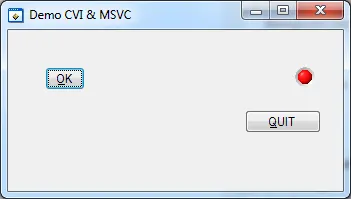
</div>


Voici le code de l'exemple :

```c
#include <cvirte.h>
#include <userint.h>
#include "TestCVIMSVC.h"

//-----------------------------------------------------------------------------
int __stdcall WinMain (HINSTANCE hInstance, HINSTANCE hPrevInstance,
                       LPSTR lpszCmdLine, int nCmdShow) {
  static int ghPanel;

  if (InitCVIRTE (hInstance, 0, 0) == 0)
    return -1;  /* out of memory */

  if ((ghPanel = LoadPanel (0, "TestCVIMSVC.uir", PANEL)) < 0)
    return -1;

  DisplayPanel (ghPanel);
  RunUserInterface ();
  DiscardPanel (ghPanel);
  return 0;
}

//-----------------------------------------------------------------------------
int CVICALLBACK QuitCallback (int panel, int control, int event,
        void *callbackData, int eventData1, int eventData2) {

  switch (event) {
        case EVENT_COMMIT:
            QuitUserInterface (0);
        break;
  }
  return 0;
}

//-----------------------------------------------------------------------------
int CVICALLBACK OnSwitch (int panel, int control, int event,
        void *callbackData, int eventData1, int eventData2) {

  unsigned int Val;

  switch (event) {
    case EVENT_COMMIT:
        GetCtrlVal(panel, PANEL_LED, &Val);
        SetCtrlVal(panel,PANEL_LED,Val==0?1:0);
    break;
  }
  return 0;
}
```

Notez la fonction WinMain. Elle n'est pas franchement utile ici. Pour demander à CVI de la générer il faut, dans l'éditeur d'interface graphique, cliquer sur le menu ``Code/Generate/All Code...`` et cocher la case ``Generate WinMain() instead of main()``.

## Génération du code pour l'interface graphique

Quand vous avez fini de jouer avec le code d'exemple, vous revenez dans l'IDE CVI. Cliquez sur le menu ``Build/External Compiler Support...`` et la boîte de dialogue suivante apparaît.

<div align="center">
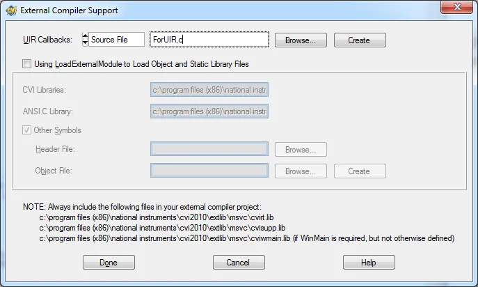
</div>


Sélectionnez Source File dans la liste et saisissez un nom de code source (ForUIR.c ici). Cliquez ensuite sur Browse... pour bien vérifier que le code sera généré à côté des autres codes sources de votre projet. Enfin cliquez sur le bouton Create puis sur le bouton Done pour revenir dans l'IDE.

Attention, en bas de la boite de dialogue, notez bien les noms des bibliothèques qu'il faudra inclure dans votre projet MSVC.

A ce stade vous pouvez quitter CVI et lancer MSVC. Ici on va utiliser Microsoft Visual C++ 2010 Express.

## Compilation du projet CVI dans Microsoft Visual C++ 2010 Express

Faites New Project...

Dans General Choisissez Empty Project

Choisissez un nom et un répertoire. Généralement je créé un sous répertoire dans le répertoire du projet CVI pour y ranger le projet MSVC.

<div align="center">
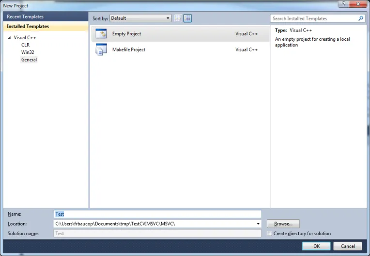
</div>


Quand la fenêtre projet arrive à l'écran, lancez le gestionnaire de fichiers de Windows et retrouvez les sources de votre projet CVI. Ici je sélectionne TestCVIMSVC.c et ForUIR.c et je fais un glisser déposer dans le répertoire Source Files du projet MSVC.

<div align="center">
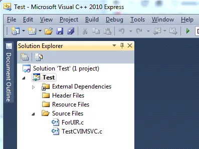
</div>


Maintenant pointez le gestionnaire de fichiers sur le répertoire suivant :

```powershell
C:\Program Files (x86)\National Instruments\CVI2010\extlib\msvc
```

Sélectionnez les trois fichiers suivants : cvirt.lib, cvisupp.lib et cviwmain.lib et glissez-les dans le projet MSVC. On doit inclure cviwmain.lib car notre code source utilise une fonction WinMain au lieu d'une fonction mai classique.

<div align="center">
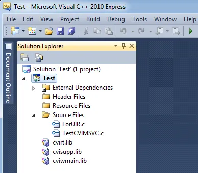
</div>


Ça va ratatouiller un peu mais essayons de construire l'application en mode Debug dans MSVC 2010. Cliquez sur F7. Bingo, comme prévu, ça part en vrille.

```bash
1>------ Build started: Project: Test, Configuration: Debug Win32 ------
1>  TestCVIMSVC.c
1>c:\users\frbaucop\documents\tmp\testcvimsvc\testcvimsvc.c(1): fatal error C1083: Cannot open include file: 'cvirte.h': No such file or directory
1>  ForUIR.c
1>  Generating Code...
========== Build: 0 succeeded, 1 failed, 0 up-to-date, 0 skipped ==========
```

Même pas peur ! Passez sous le gestionnaire de fichiers et allez faire un tour sur

```bash
C:\Program Files (x86)\National Instruments\CVI2010\include
```

Dans le gestionnaire de fichiers de Windows, cliquez sur le chemin (tout en haut de la fenêtre), faites CTRL+C et revenez dans MSVC. Après avoir cliqué sur Project/Properties assurez-vous que Configuration est bien sur "All Configurations".  Ensuite dans C/C++ puis dans General sélectionnez Additional Include Directories et collez (CTRL+V) le chemin complet au répertoire Include que vous venez de mettre dans le presse papier. Cliquez sur OK pour finir.

<div align="center">
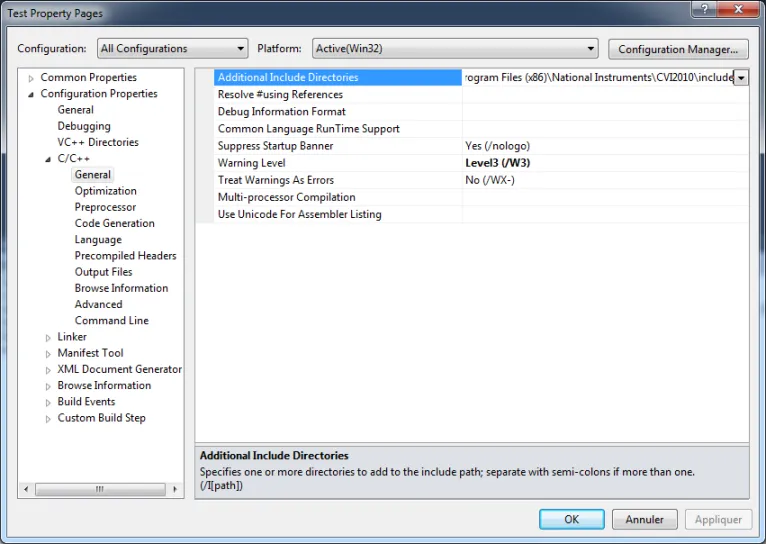
</div>


Allez on repart pour un tour. Cliquez sur F7. Là ça se passe beaucoup mieux !

```c
1>------ Build started: Project: Test, Configuration: Debug Win32 ------
1>  TestCVIMSVC.c
1>  ForUIR.c
1>  Generating Code...
1>LINK : warning LNK4098: defaultlib 'LIBCMT' conflicts with use of other libs; use /NODEFAULTLIB:library
1>  Test.vcxproj -> C:\Users\frbaucop\Documents\tmp\TestCVIMSVC\MSVC\Test\Debug\Test.exe
========== Build: 1 succeeded, 0 failed, 0 up-to-date, 0 skipped ==========
```

Bon, y a bien un warning mais globalement c'est bon. Allez on clique sur F5 pour déboguer le projet. Misère de misère ça marche pas.

<div align="center">
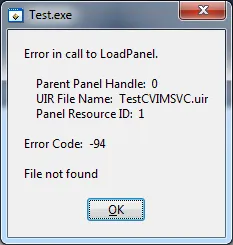
</div>


En fait, ce qui se passe c'est que l'exécutable ne trouve pas le fichier .uir et n'arrive donc pas à le charger. Pour remédier à ça il faut juste copier-coller à la main le fichier .uir dans le répertoire ../Debug du projet MSVC.

<div align="center">
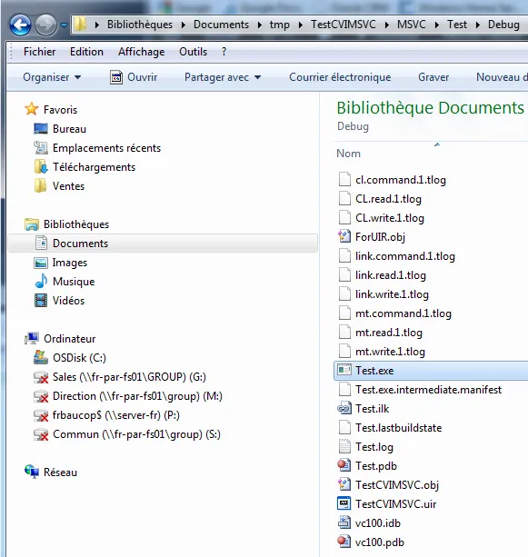
</div>


Pendant qu'on y est, double cliquons sur Test.exe dans le répertoire. Alléluia, ça marche! Allez on quitte l'application et on retourne dans MSVC 2010 Express. On lance le projet en mode Debug (F5). Un vrai bonheur tout fonctionne.

Bien sûr, si on passe en mode Release et si on re-compile le tout ça ne marche pas tant qu'on ne copie pas le fichier .uir dans le répertoire ../Release de notre projet MSVC. Une fois la copie effectuée on peut soit lancer l'exécutable à partir du répertoire soit à partir de l'IDE MSVC. Un vrai bonheur.

## Then what?

1 - Dans l'environnement CVI, en mode release l'exécutable fait 320 ko. Quand l'exécutable est compilé et lié à partir de MSVC il ne fait plus que 9 à 10 ko. Ça marche bien mieux que le régime Dukan cette histoire et cela peut être important dans certains cas (cible temps réel par exemple).

2 - A part les fonctions des API de CVI (interface graphique, DAQ etc.), tout le reste (printf, fonctions de gestion fichier etc.) est "pris" dans les bibliothèques Microsoft. Ce code est généralement très, très rapide. N'oubliez pas que l'on fait la compilation ainsi que l'édition de liens dans Visual Studio.

Attention, il y a quand même des contraintes. Il faut générer un fichier de type ForUIR.c à chaque fois que vous rajoutez des contrôles ou des indicateurs qui sont associés à des fonctions callback. Dans tous les cas il ne faut pas oublier de copier le fichier .uir dans les répertoires Debug et Release de MSVC à chaque fois que vous modifiez ce dernier. Notez que cela peut être automatisé depuis CVI à l'aide du menu Build/Build Steps (on peut par exemple invoquer une commande DOS ou un fichier batch, lisez l'aide en ligne). On peut aussi avoir un répertoire "assets" dans lequel on partage le fichier .uir entre les projets version CVI et MSVC

Bref, on a un exécutable plus léger et plus rapide. Ceci dit cela demande un peu de travail. Je pense cependant que le jeu en vaut vraiment la chandelle. Vous avez tout intérêt à développer et à déboguer votre code avec CVI (je suis persuadé qu'il a l'un des meilleurs des débogueurs du marché) puis, régulièrement, alors que le développement de votre application avance, à générer un exécutable en mode Release via cette méthode (n'attendez pas la veille de la release date de votre application pour le faire!)

Heu... Si pour finir on peut recompiler tout le projet dans MSVC, est-ce qu'il n'y aurait pas un moyen d'aller un peu plus loin et de faire dans MSVC un mixte de code ANSI C et de code C++? En voilà une idée qu'elle est bonne...

Allez, la suite au prochain épisode.

## Updates du mois d’août 2015

### Update 1

Je viens de faire un test avec Visual Studio Community 2013 for Desktop. Tout marche bien comme expliqué. Ceci dit, quand je demande à générer une version Release de l'application l'éditeur de liens part en erreur. Oui, oui je sais, on voit pas grand chose dans l'image ci-dessous. 

<div align="center">
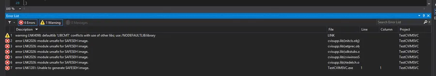
</div>


Pour corriger le tir il faut aller dans les options du projets puis dans la catégorie Linker et enfin dans l'option Advanced. Enfin il faut positionner la paramètre Image Has Safe Exception Handlers sur No. Voir ci-dessous :

<div align="center">
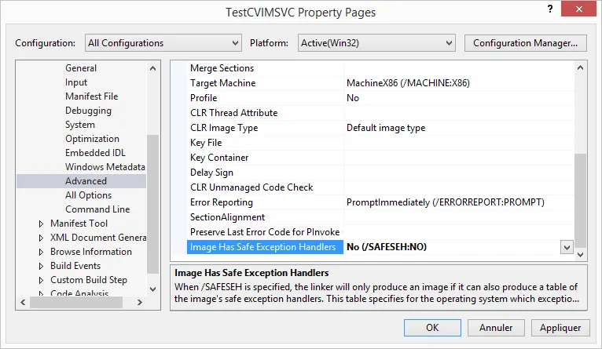
</div>

### Update 2

J'en avais parlé brièvement dans la conclusion précédente (Then What?) mais je n'avais pas été très explicite. Bref, concernant l'organisation des fichiers et des répertoires, voilà comment cela se passe sur mon disque dur. Au niveau le plus haut j'ai un répertoire CVI & MSVC dans lequel j'ai deux sous répertoires CVI et MSVC. Ces derniers ne contiennent que les fichier relatifs à la gestion de projet, de workspace et autres solutions. Il y a ensuite un répertoire src qui contient les codes source du projets et un dernier répertoire assets qui contient le ou les fichiers uir. C'est dans ce répertoire qu'on mettrait des fichiers images, des fichiers son etc.

<div align="center">
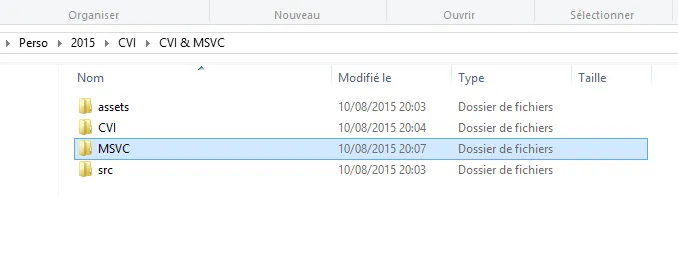
</div>


Ensuite, dans le répertoire CVI voilà ce qu'on y trouve

<div align="center">
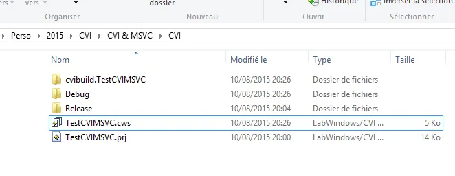
</div>


On note qu'il y a deux répertories Release et Debug dans lesquels CVI va déposer l'exécutable adéquat. Bien sûr tout cela se configure via les Properties du projet CVI. Ah oui j'allais oublier... Dans le code source j'ai été amené à modifier la ligne suivante :

```cpp
if ((hPanel = LoadPanel (0, "../../assets/TestCVIMSVC.uir", PANEL)) < 0) return -1;
```

On voit bien qu'on va chercher le fichier UIR dans le répertore assets.

<div align="center">
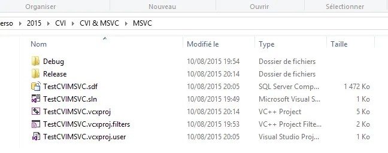
</div>


Enfin voilà le contenu de mon répertoire MSVC

Cette organisation permet d'être tranquille et de pouvoir tester les choses de fond en comble avec plusieurs compilateurs. Par exemple je peux éditer le fichier UIR dans CVI, faire CTRL+S, passer sous Visual Studio qui est resté ouvert, faire un Run et voir le résultat. De même si depuis Visual Studio je fais des modifications dans un des sources, lorsque je vais passer sous CVI ce dernier me demandera si je veux utilier la dernière version du fichier source en question... Que du bonheur. Faudra juste pas oublier de distribuer le répertoire assets à côté de l'exécutable le jour du déploiement ou bien de gérer la recherche du fichier UIR (et autres ressources) de façon dynamique dans le code. A vous de voir...

