# Transformer une application CVI en Serveur ActiveX

## Introduction

On m'a posé la question cette semaine et pour être honnête je n'avais pas la réponse "on the top of my head".    Bon allez on commence : "Salut Philippe, ça va ? Oui bon, j'ai une application CVI qui tourne mais faudrait que j'en fasse un serveur ActiveX afin qu'on puisse invoquer certaines de ses fonctions à partir d'une autre application. T'as une idée ?". "Heu... Tu me laisse 2 min... Je te rappelle en fin de journée..."

En fait je n'ai pas pu  rappeler mon pote dans la journée  (trop de boulot) et ce n'est que ce week end que j'ai pu mettre mes idées au clair. Attention, dans cet article on ne va pas tout couvrir mais bon vous devriez avoir de quoi survivre le cas échéant...

## Un projet CVI de base

<div align="center">
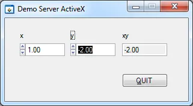
</div>


L'application est très simple mais ça suffira pour ce que le veut en faire. A chaque fois qu'on change la valeur de x ou de y on calcule le produit et on met à jour le résultat dans l'indicateur nommé "xy".

Voilà le code de l'application en question :

```c
#include <cvirte.h>
#include <userint.h>
#include "server.h"

// ----------------------------------------------------------------------------
int __stdcall WinMain (HINSTANCE hInstance, HINSTANCE hPrevInstance,
                        LPSTR lpszCmdLine, int nCmdShow){

    int panelHandle;

    if (InitCVIRTE (hInstance, 0, 0) == 0)
        return -1;   // Out of memory

    if ((panelHandle = LoadPanel (0, "server.uir", PANEL)) < 0)
        return -1;

    DisplayPanel (panelHandle);
    RunUserInterface ();
    DiscardPanel (panelHandle);
    return 0;
}

// ----------------------------------------------------------------------------
int CVICALLBACK QuitCallback (int panel, int control, int event,
                void *callbackData, int eventData1, int eventData2) {

    switch (event) {
        case EVENT_COMMIT:
            QuitUserInterface (0);
        break;
    }
    return 0;
}

// ----------------------------------------------------------------------------
int CVICALLBACK OnInput (int panel, int control, int event,
                void *callbackData, int eventData1, int eventData2) {

    double x,y;

    switch (event) {
        case EVENT_COMMIT:
            GetCtrlVal(panel, PANEL_X, &x);
            GetCtrlVal(panel, PANEL_Y, &y);
            SetCtrlVal(panel, PANEL_XY, x*y);
        break;
    }
    return 0;
}
```

Afin de motiver les troupes voilà le code source que mettra en œuvre l'application cliente une fois que l'application initiale aura été transformée en serveur ActiveX.

```c
#include <cvirte.h>
#include <stdio.h>
#include "MyCalcServer.h"

// ----------------------------------------------------------------------------
int main (int argc, char *argv[]) {

    CAObjHandle hApp=0;
    CAObjHandle hIScalar=0;
    double                   z;

    if (InitCVIRTE (0, argv, 0) == 0)
        return -1;       /* out of memory */

    MyCalcServer_NewIApp (NULL, 1, LOCALE_NEUTRAL, 0, &hApp);
    MyCalcServer_IAppSetVisible (hApp, NULL, VFALSE);

    MyCalcServer_NewIScalar (NULL, 1, LOCALE_NEUTRAL, 0, &hIScalar);
    MyCalcServer_IScalarSetx (hIScalar, NULL, 3);
    MyCalcServer_IScalarSety (hIScalar, NULL, -4);
    MyCalcServer_IScalarGetz (hIScalar, NULL, &z);

    printf("The current result is : %f\n", z);

    CA_DiscardObjHandle (hIScalar);
    hIScalar=0;

    CA_DiscardObjHandle (hApp);
    hApp = 0;

    puts("Strike ENTER to exit :");
    getchar();

    return 0;
}
```

L'application commence par se connecter au serveur ActiveX puis le "cache" en le rendant invisible (ligne 16). Pour le reste, on met 3 dans x (ligne 19) puis -4 dans y (ligne 20). Enfin, on récupère le résultat des courses à la ligne 20 et on affiche le tout dans une console. A la toute fin du code on relâche les handles qu'on a utilisé pour se connecter aux interfaces IApp et IScalar (ligne 25 et 28).

Bon ça va ?  Ça  n'a pas été trop long ? Allez, voilà la sortie console afin de prouver que je ne raconte pas trop d'histoires.

<div align="center">
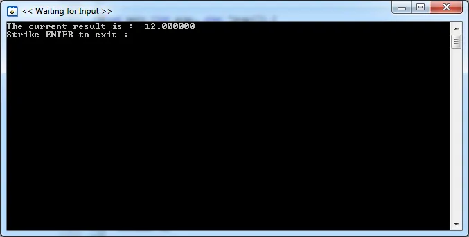
</div>


Ok, ok... Alors on fait comment... Le projet initial ouvert dans CVI, on va dans le menu Tools, option Create ActiveX Server. Là, vous vous laissez guider gentiment. Pensez juste à vous souvenir du nom que vous allez donner au serveur et à mettre un truc significatif dans le champ "Help String" (c'est important et on verra ça quand on écrira le code de l'application cliente).

{: .warning }
Soyez convaincu que vous ne risquez rien. Bref, si tout part en vrille, pas de panique. Vous pourrez toujours éditer tous les paramètres, renommer ce qui doit l'être, faire et refaire. Pour cela le truc magique c'est : double clic sur le fichier ".axs" puis clic sur le bouton "Save and Generate". Mais bon n'anticipons pas...

<div align="center">
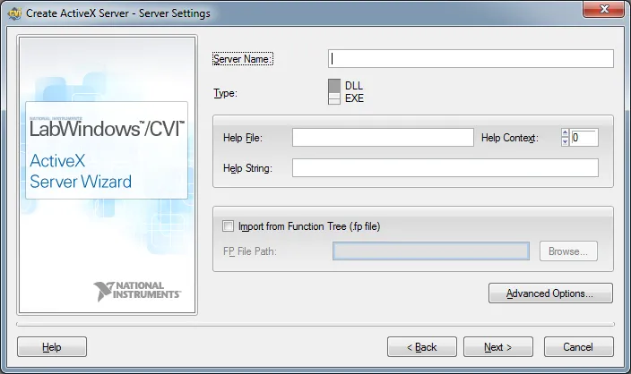
</div>


Ensuite, laissez CVI faire un backup de votre projet (pas utile si vous faites un test en 2 minutes). Notez que votre projet se voit dorénavant adjoindre un sous-répertoire "ActiveX Server Files" et que pour finir vous arrivez sur une boîte de dialogue très importante lorsqu'on joue avec un serveur ActiveX dans CVI.

<div align="center">
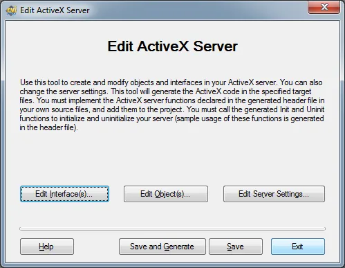
</div>


Au fait, un truc à noter. Pour invoquer cette boite de dialogue vous pouvez au choix, allez dans le menu "Tools" et choisir "Edit ActiveX Server" ou plus simplement double cliquer sur le fichier ".axs" qui se trouve dorénavant dans le projet.

Enfin bref, nous voilà avec l'éditeur... On fait quoi ? Ben rien pour l'instant car il va falloir qu'on fixe un ou deux mots de vocabulaire (le reste vous le lirez dans l'aide de CVI ou sur le Web).

Vu avec les yeux d'un client notre serveur peut et va présenter un ou plusieurs Objets. Par exemple pensez à un serveur qui proposerait un objet Acquisition, un autre Analyse et un dernier Présentation.

Chaque Objet regroupe une ou plusieurs Interfaces. Pensez par exemple à l'Objet Acquisition qui présenterait une interface GPIB, un autre USB et une dernière DAQmx selon que l'acquisition se fait... via GPIB, USB ou carte d'acquisition.

Enfin, chaque Interface regroupe des méthodes et des attributs qui lui sont propres

Dans notre cas, afin de mettre tout ça en œuvre, notre serveur ne va publier qu'un seul Objet (MultObj) qui regroupera deux interfaces (IScalar et IApp) qui vont nous permettre de faire des multiplications et/ou de  contrôler  la visibilité de l'application.

Cliquez sur "Edit Interfaces", cliquez sur "Add..." et nommez la première interface IApp.

<div align="center">
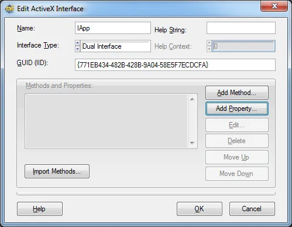
</div>


Cliquez sur "Add Property". En effet, le fait d'être visible est une propriété de l'application, pas une fonction. Nommez-la "Visible" et assurez-vous que "Dimension" est calé sur "Scalar", que le "Type" est "boolean" et qu'enfin Get et Put sont cochées.

<div align="center">
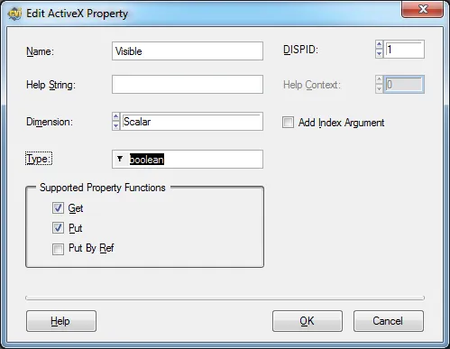
</div>


Cliquez sur "OK". Ajoutez une seconde interface et nommez-la "IScalar". Ajoutez 3 propriétés "x", "y" et "z". Assurez-vous que le type est calé sur "double" et que pour x et y, Put et Get sont cochées alors que pour "z" seul Get doit l'être.

En cliquant sur OK le nombre de fois qui va bien vous revenez à la boîte de dialogue de départ. Cliquez alors sur "Edit Objects". Cliquez sur "Add" et nommez l'objet "MultObj" par exemple. Comme vous voulez que l'objet en question rendent public les deux interfaces précédentes vous cochez les lignes "IScalar" et "IApp" dans la liste à droite. Afin d'assurer le coup vous vérifiez bien que "Default Interface" contient "IApp".

<div align="center">
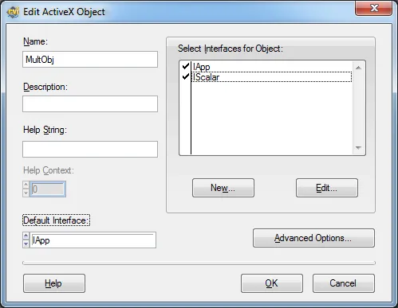
</div>


Cliquez encore une fois sur "OK" le nombre de fois nécessaire et revenez à la boîte de dialogue initiale. Là vous cliquez (enfin !!!) sur "Save and Generate". Si CVI vous prévient qu'il va réécrire sur des fichiers... Même pas peur, validez en cliquant sur "OK" puis sur "Exit".

Mouai et on fait quoi maintenant ?

Dans le projet, dans le répertoire ActiveX Server Files double cliquez sur le fichier ".h". Circulez dans le fichier. A un moment donné vous allez tomber sur un bloc de code commenté. Lisez ce qu'il propose (en gros faut modifier le main() de votre code initial). Bon ben on y va.

Initialement le début de notre code ressemblait à :

```c
#include <cvirte.h>
#include <userint.h>
#include "server.h"

// ----------------------------------------------------------------------------
int __stdcall WinMain (HINSTANCE hInstance, HINSTANCE hPrevInstance,
                                              LPSTR lpszCmdLine, int nCmdShow){

    int panelHandle;

    if (InitCVIRTE (hInstance, 0, 0) == 0)
        return -1;   // Out of memory

    if ((panelHandle = LoadPanel (0, "server.uir", PANEL)) < 0)
        return -1;

    DisplayPanel (panelHandle);
    RunUserInterface ();
    DiscardPanel (panelHandle);
    return 0;
}
```

A la suite de quelques copier-coller et de quelques CTRL+M pour compiler le code et vérifier que l'on n'oublie pas des trucs, le début du code source ressemble maintenant à :

```c
#include "Application_axs.h"
#include <cvirte.h>
#include <userint.h>
#include "server.h"

int __stdcall WinMain (HINSTANCE hInstance, HINSTANCE hPrevInstance, LPSTR lpszCmdLine, int nCmdShow){

    int         runServer = 0;
    char   errBuf [500] = {0};
    int         panelHandle;

    if (InitCVIRTE (hInstance, 0, 0) == 0)
        return -1;   // Out of memory

    // ActiveX server initialization
    if (FAILED (CaSrvrZoubidaInit (hInstance, lpszCmdLine, &runServer, errBuf, sizeof(errBuf))))
        return -1;   // Server initialization error.

    if (runServer){
        // ...
        // Your initialization code
        // ...
        if ((panelHandle = LoadPanel (0, "server.uir", PANEL)) < 0)
                return -1;
        DisplayPanel (panelHandle);
        RunUserInterface ();       // Process messages

        // ...
        // Your cleanup code
        // ...
        DiscardPanel (panelHandle);
    }

    // ActiveX server cleanup
    CaSrvrZoubidaUninit (hInstance);
    return 0;
}
```

Vous noterez que le code se compile mais qu'on n'arrive pas à générer un exécutable car il y a des erreurs lors de l'édition de liens. En fait, il y a autant d'erreurs de link que de propriétés et de méthodes créées  précédemment. C'est normal... Quand on y réfléchit, ces fonctions sont déclarées, invoquées mais pas encore définies. Et ça, honnêtement, à part nous, n'y a personne qui peut le faire.

Bon, allez, retournons dans le seul fichier ".h" du répertoire ActiveX Server Files du projet. Sous les commentaires relatifs à la fonction main() qu'on devait modifier il y a une autre section de commentaires. Tiens, bizarrement on retrouve nos méthodes et nos propriétés.

Les commentaires nous disent qu'il faut définir les fonctions en question dans notre source.

```c
/******************************************************************************/
/* User's ActiveX server functions                                                                                       */
/*                                                                                                                                                       */
/* Note: These functions will be called by ActiveX clients.                                     */
/*                                                                                                                                                       */
/* MUST BE IMPLEMENTED BY USER IN USER'S SOURCE CODE                                                   */
/******************************************************************************/

HRESULT CVIFUNC MultObjIAppget_Visible (CAServerObjHandle objHandle, VARIANT_BOOL* Visible);

HRESULT CVIFUNC MultObjIAppput_Visible (CAServerObjHandle objHandle, VARIANT_BOOL Visible);

HRESULT CVIFUNC MultObjIScalarget_x (CAServerObjHandle objHandle, double* x);

HRESULT CVIFUNC MultObjIScalarput_x (CAServerObjHandle objHandle, double x);

HRESULT CVIFUNC MultObjIScalarget_y (CAServerObjHandle objHandle, double* y);

HRESULT CVIFUNC MultObjIScalarput_y (CAServerObjHandle objHandle, double y);

HRESULT CVIFUNC MultObjIScalarget_z (CAServerObjHandle objHandle, double* z);
```

Faites une copie des fonctions. Créez un nouveau code source et collez-les dedans. Sauvez le fichier sous le nom "serverAPI.c" par exemple. De retour dans CVI, ajoutez le fichier au projet dans le répertoire "Source Files".

Même si cela ne sert pas à grand-chose voilà un squelette de code qui ne fait rien mais qui permet de compiler le serveur ActiveX sans erreur de link.

```c
#include "Application_axs.h"

HRESULT CVIFUNC MultObjIAppget_Visible (CAServerObjHandle objHandle, VARIANT_BOOL* Visible){

    HRESULT hr = S_OK;
    return hr;
}

HRESULT CVIFUNC MultObjIAppput_Visible (CAServerObjHandle objHandle, VARIANT_BOOL Visible){

    HRESULT hr = S_OK;
    return hr;
}

HRESULT CVIFUNC MultObjIScalarget_x (CAServerObjHandle objHandle, double* x){

    HRESULT hr = S_OK;
    return hr;
}

HRESULT CVIFUNC MultObjIScalarput_x (CAServerObjHandle objHandle, double x){

    HRESULT hr = S_OK;
    return hr;
}

HRESULT CVIFUNC MultObjIScalarget_y (CAServerObjHandle objHandle, double* y){

    HRESULT hr = S_OK;
    return hr;
}

HRESULT CVIFUNC MultObjIScalarput_y (CAServerObjHandle objHandle, double y){

    HRESULT hr = S_OK;
    return hr;
}

HRESULT CVIFUNC MultObjIScalarget_z (CAServerObjHandle objHandle, double* z){

    HRESULT hr = S_OK;
    return hr;
}
```

En partant du bas, on retrouve bien l'objet MultObj, l'interface IScalar, la méthode (mutator) Get sur le résultat "z" ce qui donne "MultObjIScalarget_z".   Voilà comment on pourrait écrire une telle fonction :

```c
HRESULT CVIFUNC MultObjIScalarget_z (CAServerObjHandle objHandle, double* z){

    HRESULT hr = S_OK;

    GetCtrlVal(panelHandle, PANEL_XY, z);
    return hr;
}
```

Si on fait ça, le problème que l'on a c'est que la variable "panelHandle" n'est pas connue dans le code source en question. Comme on a aussi besoin de cette variable dans le code source principal, une solution possible consiste à créer un fichier ".h" (globals.h par exemple) dans lequel on déclarera la variable en question. Bien évidement il faudra inclure le fichier "globals.h" dans le code source principal ainsi que dans le fichier "serverAPI.h".

De plus, il ne faudra pas non plus oublier de rajouter "userint.h" car on invoque la fonction "GetCtrlVal". Comme enfin on utilise la constante "PANEL_XY" il faudra aussi inclure le fichier ".h" qui a été généré avec le fichier ".uir" de notre superbe application.

Enfin bref, en première approximation voilà un fichier "serverAPI.c" presque complet :

```c
#include "Application_axs.h"
#include <userint.h>
#include "server.h"
#include "globals.h"

HRESULT CVIFUNC MultObjIAppget_Visible (CAServerObjHandle objHandle, VARIANT_BOOL* Visible){

    HRESULT hr = S_OK;
    return hr;
}

HRESULT CVIFUNC MultObjIAppput_Visible (CAServerObjHandle objHandle, VARIANT_BOOL Visible){

    HRESULT hr = S_OK;
    return hr;
}

HRESULT CVIFUNC MultObjIScalarget_x (CAServerObjHandle objHandle, double* x){

    HRESULT hr = S_OK;

    GetCtrlVal(panelHandle, PANEL_X, x);
    return hr;
}

HRESULT CVIFUNC MultObjIScalarput_x (CAServerObjHandle objHandle, double x){

    HRESULT hr = S_OK;

    SetCtrlVal(panelHandle, PANEL_X, x);
    OnInput(panelHandle, 0, EVENT_COMMIT, 0, 0, 0);
    return hr;
}

HRESULT CVIFUNC MultObjIScalarget_y (CAServerObjHandle objHandle, double* y){

    HRESULT hr = S_OK;

    GetCtrlVal(panelHandle, PANEL_Y, y);
    return hr;
}

HRESULT CVIFUNC MultObjIScalarput_y (CAServerObjHandle objHandle, double y){

    HRESULT hr = S_OK;

    SetCtrlVal(panelHandle, PANEL_Y, y);
    OnInput(panelHandle, 0, EVENT_COMMIT, 0, 0, 0);
    return hr;
}

HRESULT CVIFUNC MultObjIScalarget_z (CAServerObjHandle objHandle, double* z){

    HRESULT hr = S_OK;

    GetCtrlVal(panelHandle, PANEL_XY, z);
    return hr;
}
```

On peut quand même remarquer l'invocation de la fonction "OnInput". Si vous êtes perdus relisez le code source initial et soyez convaincu que l'on peut appeler une fonction callback à la main.

Pour le reste on aurait dû renommer "panelHandle" en "ghPanel" afin de bien mettre en évidence le status global de la variable.

Il manque encore les définitions des fonctions "MultObjIAppget_Visible" et "MultObjIAppput_Visible" dont on va s'occuper pas plus tard que maintenant.

La fonction "MultObjIAppget_Visible" est la plus simple. Sous réserve que l'on connaisse l'état de la fenêtre (visible, pas visible) il suffit de retourner cet état. Afin de stocker l'état de la fenêtre, le plus simple c'est sans doute d'utiliser une autre variable globale "gbVisible" déclarée dans globals.h. Faudra penser à mettre à jour "gbVisible" (en le mettant à true) juste après l'appel à   "DisplayPanel" dans le code source principal.

Bref, voilà le code de la fonction "MultObjIAppget_Visible". Notez qu'on prend le soin de vérifier si le pointeur "Visible" n'est pas un pointeur null et qu'on peut en toute sécurité lui affecter une valeur.

```c
HRESULT CVIFUNC MultObjIAppget_Visible (CAServerObjHandle objHandle, VARIANT_BOOL* Visible){

    HRESULT hr = S_OK;

    if (Visible == NULL)
        return E_INVALIDARG;

    *Visible = gbVisible;
    return hr;
}
```

Le code de "MultObjIAppput_Visible" est, quant à lui, un peu plus tordu.

```c
HRESULT CVIFUNC MultObjIAppput_Visible (CAServerObjHandle objHandle, VARIANT_BOOL Visible){

    HRESULT        hr = S_OK;
    static VBOOL   bLockedObj = VFALSE;   // indicates if object is locked

    gbVisible = Visible;
    if (Visible) {
        DisplayPanel (ghPanel);
        // Check if the object was inactive
        if (!bObjActive) {
                // Lock the object as the UI is now visible
                hr = CA_ServerLockActiveObject (objHandle);
                if(hr<0)
                        return hr;
                bLockedObj= VTRUE;
        }
    } else {
        HidePanel (ghPanel);
        // Check if the object was active
        if (bLockedObj) {
                // Unlock the object as the UI is now invisible
                hr = CA_ServerUnlockActiveObject (objHandle);
                if(hr<0)
                        return hr;

                bLockedObj = VFALSE;
        }
    }
    return hr;
}
```

En gros, on voit qu'après avoir stocké dans la variable globale "gbVisible" la valeur du paramètre "Visible" (ligne 5), en fonction de la valeur de ce dernier on montre (ligne 7) ou on cache (ligne 17) la fenêtre de l'application.

Là où cela se complique un peu (en tout cas ce n'est pas immédiat d'y penser) c'est qu'il faut invoquer "CA_ServerLockActiveObject" quand la fenêtre est rendue visible et "CA_ServerUnlockActiveObject" quand on cache cette dernière. Allez jeter un oeil dans l'aide en ligne de CVI à ce propos.

En gros, avec  "CA_ServerLockActiveObject" on ajoute une référence à l'objet en question. Cela nous assure que même si tous les autres clients n'utilisent plus le server, ce dernier ne  disparaîtra  pas.

Un dernier point. Comme "CA_ServerUnlockActiveObject" ne peut être utilisée que sur des objets COM qui ont été préalablement vérouillés avec      "CA_ServerLockActiveObject" il faut qu'on garde une trace. C'est ce à quoi sert la variable "bLockedObj" qui est de type static et qui est initialisée à VFALSE.

Bon ben on en a terminé avec le serveur. Faut qu'on attaque maintenant l'écriture de l'application cliente. Ceci dit, j'en entend qui râlent dans le fond de la classe parce que ce n'est pas simple, qu'il a fallu "clicouiller" partout etc... On se calme, et on prend un peu de recul.

En effet, si à ce stade il a fallu beaucoup cliquer c'est parce qu'il a fallu définir les Objets, les Interfaces et les méthodes du serveur et qu'en plus il a fallu réorganiser les codes source du serveur de façon qu'on ne perde pas trop temps si demain on souhaite enrichir ce dernier. En effet, si maintenant on souhaite ajouter une méthode il suffit de double cliquer sur le fichier ".axs", définir la fonction en question, générer le code et le sauvegarder, faire un copier-coller dans le fichier "serveurAPI.c" et compléter le code en question. Ce n'est pas la mort...

Bon, allez, passons à l'écriture de l'application cliente. Vous allez voir ça va être beaucoup plus simple.

Commencez par créer un nouveau projet dans le WorkSpace en cours et assurez -vous qu'il est bien le projet actif (son nom doit être en gras). Ensuite cliquez sur le menu "Tools", option "Create ActiveX Controller" et cliquez sur "Next". Dans la fenêtre suivante, retrouvez votre serveur.

<div align="center">
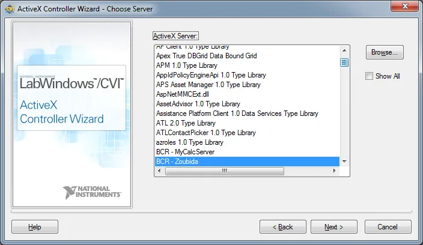
</div>


Quand c'est fait, cliquez sur "Next". En fait CVI va créer à la volée un driver d'instrument qui sera ajouté au projet. Sur la fenêtre suivante, faites simple et assurez-vous que "Per Property" est sélectionné. Cliquez encore sur "Next" dans la fenêtre suivante. Si tout se passe bien vous devriez avoir un projet qui ressemble à ce qui suit :

<div align="center">
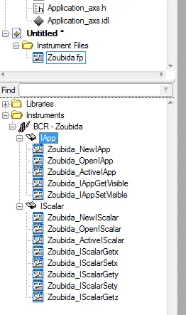
</div>


On retrouve bien les deux interfaces et dans chacune les fonctions que nous avions déclarées  précédemment. Remarquez que dans chaque interface on a, pour le même prix, récupéré 3 nouvelles fonctions : New, Open et Active.

Créez un nouveau code source. Insérez une fonction main() ou winmain() via le menu "Edit" et l'option "Insert Construct". Placez le curseur sur la ligne 8 en dessous du return -1. Double cliquez sur "NewIScalar" dans l'arborescence à gauche. Le panneau de fonction apparaît. Dans le paramètre "ObjectHandle" tapez "hScalar" et cliquez sur CTRL+D . Dans la boîte de dialogue assurez-vous que l'option "Add déclaration to current block..." est sélectionnée (c'est la troisième, tout en bas).

<div align="center">
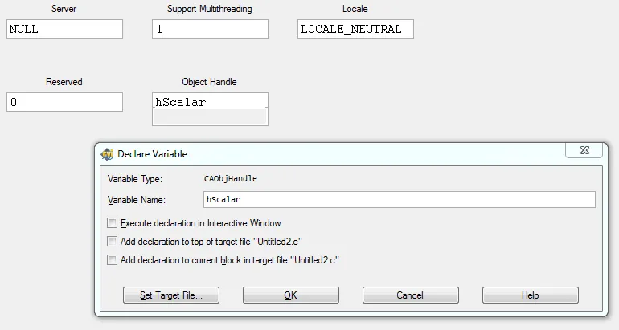
</div>


Quand vous revenez sur le panneau de fonction, faite CTRL+I pour insérer la ligne de code. Maintenant, avant de faire quoi que cela soit d'autre, il est très important de rajouter les deux lignes suivantes un peu au-dessus du return 0 final.

```c
CA_DiscardObjHandle (hIScalar);
hIScalar=0;
```

En effet, si on ne le fait pas on risque des problèmes de gestion mémoire et de ressources.

Cela étant fait je vous propose de faire ce que l'on a fait pour la fonction "Zoubida_NewIScalar" mais pour les fonctions "Zoubida_IScalarSetx", "Zoubida_IScalarSety" et "Zoubida_IScalarGetz". Ceci fait mettez un point d'arrêt sur a ligne CADiscardObjHandle et essayez de lancer l'application cliente avec SHIFT+F5. CVI va demander à sauvegarder les codes source et le projet. Il va sans doute vouloir rajouter les "#include" qui manque. Ne soyez pas farouches et dites "oui" à tout ce qu'il vous demande.

A la fin le code source doit ressembler à ce qui suit. N'oubliez pas de mettre un point d'arrêt sur la ligne "CA_DiscardObjHandle" et lancez l'application.

```c
#include <cviauto.h>
#include "Zoubida.h"
#include <cvirte.h>

int main (int argc, char *argv[]) {

    CAObjHandle hIScalar;
    double                   z;

    if (InitCVIRTE (0, argv, 0) == 0)
            return -1;       /* out of memory */

    Zoubida_NewIScalar (NULL, 1, LOCALE_NEUTRAL, 0, &hIScalar);

    Zoubida_IScalarSetx (hIScalar, NULL, 3);
    Zoubida_IScalarSety (hIScalar, NULL, -4);
    Zoubida_IScalarGetz (hIScalar, NULL, &z);

    CA_DiscardObjHandle (hIScalar);
    hIScalar=0;
    return 0;
}
```

Quand le code s'arrête sur la ligne 19, miracle en mettant le curseur sur la variable "z" vous voyez qu'elle est bien à 12. J'espère que vous avez remarquez que la fenêtre du serveur était à l'écran mais bon on ne va pas se plaindre... on a gagné !

Pour aller plus loin inspirez-vous du code de l'application du début et amusez-vous bien !

Pour aller plus loin, allez dans le menu Options, choisissez Build Options. Mettez ceinture et bretelles comme le montre l'image ci-dessous.

<div align="center">
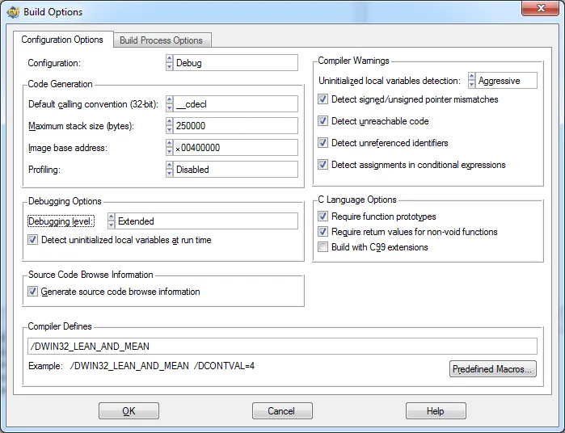
</div>


Allez dans le menu Windows et  sélectionnez l'option "Resource Tracking". Relancez le code avec SHIFT+F5 et observez bien ce qui se passe quand vous passez sur la ligne "CA_DiscardObjHandle".

Bon allez... La question a 1M$... Dans ce contexte, comment on debug le client et le serveur ? Notez que pour l'instant notre client n'utilise que l'interface IScalar. Ok ? Ok ! Double cliquez sur le fichier ".axs" du projet. Cliquez sur "Edit Object", demandez à éditer le seul objet du serveur. Assurez-vous que le champ "Default Interface" est positionné sur "IScalar" comme ci-dessous.

<div align="center">
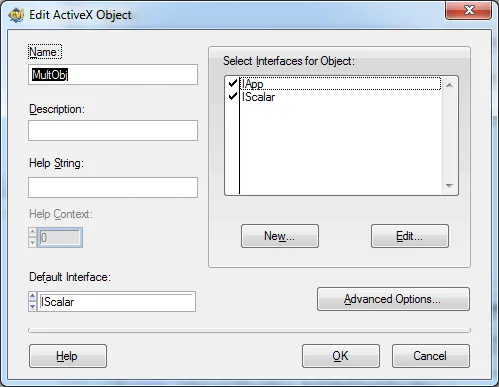
</div>


Faites "OK", "OK"... "Save and Generate" puis "Exit". De retour dans l'éditeur de CVI faites CTRL+M pour reconstruire le serveur. Dans le code source serverAPI.c mettez un point d'arrêt dans la fonction MultObjIScalarget_z. Pour finir  lancez le serveur avec SHIFT+F5. La fenêtre de l'application doit apparaître à l'écran.

Maintenant ouvrez une seconde instance de CVI. Assurez-vous que le projet Client est bien le projet actif. Ouvrez le source "client.c". Changez la ligne :

```c
Zoubida_NewIScalar (NULL, 1, LOCALE_NEUTRAL, 0, &hIScalar);
```

Par la ligne :

```c
Zoubida_ActiveIScalar (NULL, 1, LOCALE_NEUTRAL, 0, &hIScalar);
```

Dans ce cas, au lieu de créer une nouvelle interface IScalar, le client va essayer de se connecter à l'interface IScalar disponible.  Ça  tombe bien on vient juste de configurer le serveur de telle sorte que son interface par défaut soit IScalar.

Après avoir vérifié qu'il y avait bien un point d'arrêt sur la ligne "Zoubida_ActiveIScalar" on lance le client avec SHIFT + F5. Quand le client s'arrête sur la ligne  "Zoubida_ActiveIScalar" et qu'on avance avec F8 rien ne se passe. Ceci dit, quand on fait F8 sur la ligne "Zoubida_IScalarGetz", l'autre instance de CVI passe au premier plan et on arrive dans "MultObjIScalarget_z" sur la ligne "GetCtrlVal" où on avait mis un point d'arrêt.

<div align="center">
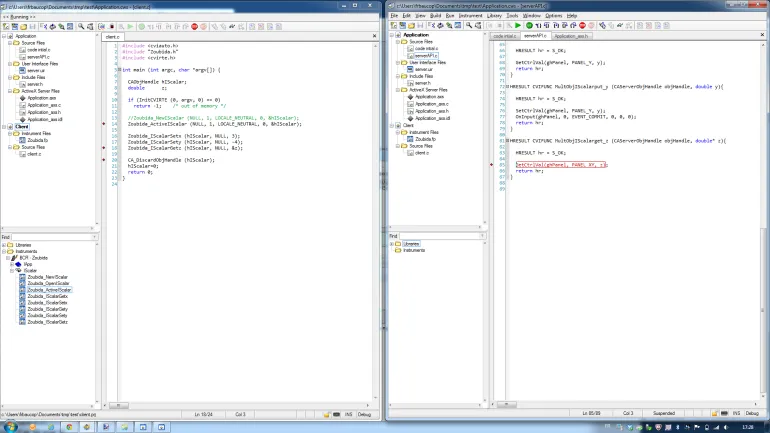
</div>


Quand vous aurez fini de jouer avec le débogueur penser à remettre l'application au premier plan et à quitter proprement en appuyant sur son bouton "QUIT". En effet, elle tourne toujours...

C'est clair, on n'a pas pu tout couvrir. Cela dit je pense qu'à partir de maintenant vous devriez être capable de vous lancer et de lire avec plus d'intérêt la documentation CVI et les différents sites sur lesquels vous allez tomber.

[Zip avec les codes de l'article](./assets/DemoActiveX1.zip)

