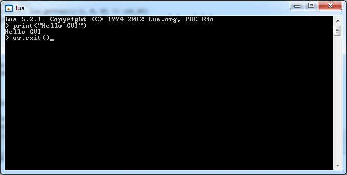

# Compiler LUA avec CVI

LUA est un compilateur que l'on peut facilement embarquer dans des applications. Il est entièrement écrit en C. Très léger et bénéficie d'une bonne réputation. J'en avais déjà entendu parlé par un utilisateur de CVI qui l'intégrait régulièrement dans ses applications. Récemment, j'ai regardé dans le détail les spécifications des calculatrices Texas Instrument et encore une fois je suis tombé sur LUA qui est dorénavant le langage de script par défaut des calculatrices de dernière génération. Bref, il fallait à tout prix que je fasse fonctionner LUA avec CVI.

De fil en aiguille j'ai récupéré les sources de LUA et bien sûr, la question à 2 M$ c'est : "Est-ce qu'on peut compiler LUA avec CVI ?"

Pour faire court la réponse est oui bien sûr et cet article montre comment y arriver. Cela nous permettra d'en apprendre plus sur les options de compilation dans CVI mais aussi de découvrir tout l'intérêt du mode Debug de LabWindows.

On va découper l'article en deux sections :

1. Compilation avec Visual Studio Express 2012 for Desktop : cela nous permettra de nous appuyer sur la documentation de LUA, de voir de quoi il retourne etc. Si vous n'avez pas MSVC 2012 vous pouvez passer à la section 2.
2. Compilation avec CVI 2012 : maintenant qu'on sait compiler "selon les règles", on va utiliser nos connaissances et les appliquer à la compilation CVI.

Attention. Je n'y connais strictement rien en LUA (et je ne crois pas que je deviendrai un jour un expert). Ce n'est pas un tutorial à propos du langage de scripting mais bien un article sur la compilation de LUA avec CVI. Pour ceux qui voudraient en apprendre plus sur LUA allez sur le [site officiel](http://www.lua.org/). Allez, c'est parti !

## Compilation avec Visual Studio Express 2012 for Desktop

Faut récupérer les sources sur le site officiel : <http://www.lua.org/ftp/> .Dans mon cas j'ai téléchargé le fichier lua-5.2.1.tar.gz dans le répertoire Téléchargements de Windows 7. Ensuite j'ai utilisé un service en ligne pour transformer le tar.gz en .zip (allez faire un tour sur <http://www.wobzip.org/> pour plus d'information). Ayant un fichier lua-5.2.1.tar.zip dans mon répertoire Téléchargment j'ai extrait son contenu dans le répertoire ./Documents/tmp/lua-5.2.1. Afin qu'il n'y ait pas d'ambiguïté dans ce répertoire j'ai finalement deux fichiers (Makefile et README) ainsi que deux répertoires (src et doc).

Dans le répertoire ./doc j'ouvre le readme.html. Il est relativement bien fichu et sera largement suffisant pour faire ce que l'on a à faire

Je lance MSVC 2012. Je crée une nouvelle solution que je nomme "Lua 5.2.1".

ATTENTION : je m'assure que la solution Lua 5.2.1.sln se trouve dans un répertoire MSVC2012 qui dans l'arborescence se trouve au même niveau que les répertoires src et doc.

Pour commencer j'ajoute un projet vide que je nomme lualib. Depuis le gestionnaire de fichiers je drag'n drop TOUS les sources et TOUS les headers dans le projet. Ensuite dans le répertoire Source Files du projet je supprime les fichier lua.c et luac.c. Pour finir dans le répertoire Header Files je supprime le fichier lua.hpp

Ayé, on est prêt on peut y aller. Click droit sur le projet et sélection de l'option Properties. Dans la boite de dialogue je m'assure que Configuration Type est fixé sur Dynamic Library (.dll). Ensuite, on retourne dans l'environnement et on compile.

Ça marche pas ! En effet on n'a pas une dll, manque des trucs et le binôme compilateur/linker n'arrête pas de râler. On se calme... Comme indiqué dans le readme.html on ouvre le fichier luaconf.h. En y regardant un peu de plus prêt on retrouve toutes les options pour compiler le code selon ses désirs. Entre autres, aux alentours de la ligne 140 on a un placard à propos de LUA_BUILD_AS_DLL. Afin de retrouver mes petits je mets une ligne de commentaire que je pourrais facilement retrouver (// BCR) dans mon cas et je défini LUA_BUILD_AS_DLL. Voir ci-dessous la section modifiée que j'utilise.

```c
/*
@@ LUA_API is a mark for all core API functions.
@@ LUALIB_API is a mark for all auxiliary library functions.
@@ LUAMOD_API is a mark for all standard library opening functions.
** CHANGE them if you need to define those functions in some special way.
** For instance, if you want to create one Windows DLL with the core and
** the libraries, you may want to use the following definition (define
** LUA_BUILD_AS_DLL to get it).
*/
// BCR
#define LUA_BUILD_AS_DLL
#if defined(LUA_BUILD_AS_DLL)   /* { */

#if defined(LUA_CORE) || defined(LUA_LIB)   /* { */
#define LUA_API __declspec(dllexport)
#else                       /* }{ */
#define LUA_API __declspec(dllimport)
#endif                      /* } */

#else               /* }{ */

#define LUA_API     extern

#endif              /* } */
```

Ensuite je sauvegarde et je re-build le projet. Ce coup-ci ça passe. Dans le répertoire MSVC2012/Debug je retrouve entre autres un fichier lualib.dll et lualib.lib. Au niveau des messages qu'émet le compilateur il ne faut pas trop s'affoler. En effet ces derniers concernent essentiellement l'utilisation de fonctions "unsafe". Pas grave... On continue.

J'ajoute maintenant dans la solution un second projet vide que j'appelle lua. Dans le répertoire Source Files du projet j'ajoute uniquement le fichier lua.c. Ensuite (et là franchement je ne suis pas sûr que ce soit la meilleure des méthodes) je drag'n drop le fichier lualib.lib. Allez zou, on build le projet. Tout roule comme sur des roulettes. Dans le répertoire Debug on retrouve un fichier lue.exe

Afin de tester tout ça, dans le gestionnaire de fichier je double clic sur lua.exe et je rentre 2 ou 3 commandes. Super tout roule !

<div align="center">

</div>


Afin de quitter l'interpréteur, au lieu de taper os.exit() on peut simplement taper **CTRL + Z**.

Remarque : La raison pour laquelle j'ai des doutes sur la façon de tenir compte de la library d'importation (lualib.lib) dans le projet lua c'est tout simplement que pour l'instant, alors qu'on compile en mode Debug. Cela dit quand on aura une bibliothèque compilée en mode release on aura une autre bibliothèque d'importation dans une autre répertoire (Release au lieu de Debug). Enfin bref, idéalement (et je n'ai pas trop regardé comment le faire dans l'IDE MSVC2012) faudrait pouvoir indiquer qu'il faut utiliser telle ou telle lib d'importation selon que le projet lua est compilé en mode Debug ou Release. On ne va pas passer la nuit là-dessus... On passe à la compilation dans CVI.

## Compilation avec CVI 2012

J'ai tout compris ! Je suis le plus fort ! Tu vas voir ce que tu vas voir. Si ça passe dans MSVC en 2 minutes je vais compiler LUA dans CVI... Heu... Marcel, tu te calme, tu t'assois tu respires... En effet y a un ou deux trucs qu'il faut comprendre... Allez, c'est parti

ATTENTION : je m'assure que le workspace Lua 5.2.1.cws se trouve dans un répertoire CVI2012 qui, dans l'arborescence, se trouve au même niveau que les répertoires src et doc.

Je lance CVI 2012 et rebelote je crée un workspace lua 5.2.1.cws dans lequel je commence par créer un projet nommé lualib. J'ajoute l'ensemble des odes csource du répertoire ./src et je supprime lua.c et luac.c. De même j'ajoute tous les fichiers header et je retire le fichier lua.hpp.

Dans le menu Build/Target Type je m'assure que la cible est une DLL. Ensuite dans Build/Target Settings je clique sur le bouton Change dans le cadre Exports

<div align="center">

</div>


Là je choisi "Symbols marked for export"

<div align="center">

</div>


Je clique sur OK, OK et je reviens dans l'IDE CVI. Afin de compiler lualib sous forme de DLL je clique sur **CTRL + M** et là... Ça ne marche pas ! Si on lit les messages de warning et d'erreur on voit que dans le fichier liolib.c on a des problèmes avec les fonctions "lua_pclose" et "lua_popen".

Afin de trouver la source du souci je copie "lua_popen" et je fais **CTRL + F**. Dans la boite de dialogue qui apparait je fais bien attention de choisir l'option "Multiple Files" et je clique sur le bouton "Mark Files in Project" et je clique sur Find Next pour lancer la recherche.

<div align="center">

</div>


CVI retrouve une série de références

```bash
c:\Users\frbaucop\Documents\tmp\lua-5.2.1\src\liolib.c(35):      ** lua_popen spawns a new process connected to the current
c:\Users\frbaucop\Documents\tmp\lua-5.2.1\src\liolib.c(40):      #if !defined(lua_popen) /* { */
c:\Users\frbaucop\Documents\tmp\lua-5.2.1\src\liolib.c(44):      #define lua_popen(L,c,m)  ((void)L, fflush(NULL), popen(c,m))
c:\Users\frbaucop\Documents\tmp\lua-5.2.1\src\liolib.c(49):      #define lua_popen(L,c,m)    ((void)L, _popen(c,m))
c:\Users\frbaucop\Documents\tmp\lua-5.2.1\src\liolib.c(55):      #define lua_popen(L,c,m)    ((void)((void)c, m),  \
c:\Users\frbaucop\Documents\tmp\lua-5.2.1\src\liolib.c(241):      p->f = lua_popen(L, filename, mode);
```

Si on clique sur les différentes références on arrive dans le fichier liolib.c et on comprend que selon que LUA_USE_POPEN ou LUA_WIN sont définies (ou pas) on a une fonction lua_popen qui s'appuie sur "popen" ou sur "_popen" (ou sur rien). Compte tenu du contexte on imagine assez que LUA_WIN doit être définie et donc que CVI a des problèmes avec la fonction "_popen". Une recherche sur le Web nous montre que cette dernière n'est pas une fonction ANSI C mais une fonctions Microsoft qui appartient à la librairie CRT. Enfin bref...

Vérifions tout cela... Je copie (**CTRL + C**) le nom de la fonction "_popen" et je vais dans le menu Options/Preprocess Source file. Une nouvelle fenêtre apparaît. Je fais ensuite une recherche (**CTRL + F**) sur "_popen". Je retrouve en effet l'invocation de cette fonction dans la fonction "io_open". Autrement dit à ce stade on a la preuve que "LUA_WIN" est définie et donc dans le code on utilise la fonction "_popen".

Si on revient dans le code csource liolib.c et si après avoir sélectionné le mot "LUA_WIN" on clique sur **CTRL + I** et ensuite on arrive dans le fichier luaconf.h dans la section de code suivante

```c
/*
@@ LUA_ANSI controls the use of non-ansi features.
** CHANGE it (define it) if you want Lua to avoid the use of any
** non-ansi feature or library.
*/

#if !defined(LUA_ANSI) && defined(__STRICT_ANSI__)
#define LUA_ANSI
#endif

#if !defined(LUA_ANSI) && defined(_WIN32) && !defined(_WIN32_WCE)
#define LUA_WIN     /* enable goodies for regular Windows platforms */
#endif
```

Je modifie le fichier de la façon suivante

```c
/*
@@ LUA_ANSI controls the use of non-ansi features.
** CHANGE it (define it) if you want Lua to avoid the use of any
** non-ansi feature or library.
*/

// BCR
#if defined(_CVI_)
#define LUA_ANSI
#endif

#if !defined(LUA_ANSI) && defined(__STRICT_ANSI__)
#define LUA_ANSI
#endif

#if !defined(LUA_ANSI) && defined(_WIN32) && !defined(_WIN32_WCE)
#define LUA_WIN     /* enable goodies for regular Windows platforms */
#endif
```

Ce faisant on peut gentiment construire le projet avec **CTRL + M**. A la fin dans le répertoire CVI2012 on retrouve entre autres un fichier lualib.dll et lualib.lib.

Pour le reste j'ajoute un projet lua au workspace. J'ajoute simplement le fichier lua.c dans le répertoire Source Files et j'ajoute lualib.lib au projet. Avant de compiler quoi que ce soit je m'assure que l'application sera une application de type console. Pour cela je vais dans Build/Target Settings et je coche la case à cocher qui va bien.

<div align="center">

</div>


Je construis le projet lua avec **CTRL + M** et je retrouve un fichier lua.exe dans le répertoire CVI2012. Pour tester lua.exe compilé avec CVI un bon SHIFT F5 suffit :

<div align="center">

</div>


Afin de bien vérifier que je ne triche pas, vérifiez la tête de l'icône en haut à gauche de la fenêtre ci-dessus.

Peut-on aller plus loin ? Bien sûr, c'est la fête on est sous CVI donc tout est permis ! Plus sérieusement je vais dans Options/Build Options, je clique sur tout et je mets les Warning et les Debugging Options à fond.

<div align="center">

</div>


Si je recompile (**CTRL + M**) lualib.dll et lua.exe avec ces options et si refais le même test alors quand je suis de retour dans l'IDE CVI je remarque que la fenêtre Resource Tracking est à l'écran et que cette dernière est remplie de fragment de mémoire qui n'ont pas été relâchés.

<div align="center">

</div>


Si on clique sur le premier fragment on voit que le souci vient de la ligne 481 de lua.c et qu'au final l'allocation a été effectuée dans lauxlib.c à la ligne 925. Entre temps on est passé par deux fonctions dans 2 autres code sources (voir ci-dessus)

Si on clique sur le 2eme fragment (640 bytes ci-dessus) la donne est différente. Les points de départ (lua.c, 481) et d'arrivée (lauxlib.c, 925) sont les mêmes mais au lieu de passer par 2 autres fonctions on passe ce coup-ci par 6 fonctions qui sont toutes dans le fichier lauxlib.c

Si maintenant on double clique sur les fichiers du "Stack Trace" (fenêtre de droite) on peut facilement refaire le parcourt dans les différents codes sources et on arrive finalement à la ligne 925 de lauxlib.c où l'on retrouve un splendide "realloc(ptr, nsize);"

Pour être honnête je ne suis pas sûr de tout comprendre mais bon j'ai quand même l'impression que lua ré-alloue de la mémoire au fur et à mesure de ses besoins mais qu'à la fin, pour une raison ou pour une autre il ne prend pas le soin de faire le ménage. Pourquoi, comment... Je n'en sais rien mais on peut essayer de chercher.

J'ouvre le fichier lua.c. Je retrouve la fonction main() et tout à la fin j'ajoute le code suivant :

```c
int main (int argc, char **argv) {
  int status, result;
  lua_State *L = luaL_newstate();  /* create state */
  if (L == NULL) {
    l_message(argv[0], "cannot create state: not enough memory");
    return EXIT_FAILURE;
  }
  /* call 'pmain' in protected mode */
  lua_pushcfunction(L, &pmain);
  lua_pushinteger(L, argc);  /* 1st argument */
  lua_pushlightuserdata(L, argv); /* 2nd argument */
  status = lua_pcall(L, 2, 1, 0);
  result = lua_toboolean(L, -1);  /* get result */
  finalreport(L, status);
  lua_close(L);

// BCR
#if defined (_CVI_) && defined(_CVI_DEBUG_)
    {
        size_t NbBytes;
        size_t NbBlocks;

        CVIDynamicMemoryInfo ("", &NbBlocks, &NbBytes, DYNAMIC_MEMORY_SHOW_ALLOCATED_MEMORY);
        printf("NbBlcks : %d \t NbBytes : %d\n", NbBlocks, NbBytes);
        getchar();
    }
#endif
  return (result && status == LUA_OK) ? EXIT_SUCCESS : EXIT_FAILURE;
}
```

Un peu plus haut dans lua.c j'ajoute les lignes suivantes :

```c
/*
** $Id: lua.c,v 1.205 2012/05/23 15:37:09 roberto Exp $
** Lua stand-alone interpreter
** See Copyright Notice in lua.h
*/

#include <signal.h>
#include <stdio.h>
#include <stdlib.h>
#include <string.h>

#define lua_c

#include "lua.h"

#include "lauxlib.h"
#include "lualib.h"

// BCR
#if defined (_CVI_) && defined(_CVI_DEBUG_)
#include <utility.h>
#endif
```

Ensuite je pose un point d'arrêt sur la première ligne du main() et je m'assure que la fenêtre Resource Tracking est bien visible (Windows/Resource Tracking). Je relance avec SHIFT+F5 et je trace en appuyant sur F10.

Toutes les allocations sont faites à priori lors de l'appel à luaL_newstate().

Je continue à tracer avec F10. Lorsque j'arrive sur l'appel à lua_pcall(...) j'ai la main dans la console et je dois saisir du code. Si je tape os.exit() et que je tape ENTER bizarrement la console se ferme, je reviens dans CVI, j'ai plus le moyen de tracer quoique ce soit mais cependant je vois les allocations mémoires qui traînent.

Je relance avec F5. Je trace avec F10. Ce coup-ci dans la console au lieu de taper os.exit() je tape **CTRL + Z**. Dans ce cas, je reviens bien dans CVI sur la ligne lua_toboolean() et je peux continuer à tracer. Pour finir je me rend compte que c'est l'appel lua_close() qui nettoie correctement les fragments de mémoires qui traînent (ils deviennent grisés dans la fenêtre Resource Tracking) . L'invocation de la fonction CVIDynamicMemoryInfo indique qu'il n'y a aucun fragment oublié. Quand je passe sur getc() la console revient au premier plan, je tape sur ENTER, je reviens dans CVI et je termine l'application gentiement.

Ouf ! L'honneur est sauf lua est propre sur lui. Morale de l'histoire : ne faut pas utiliser os.exit() mais **CTRL + Z**

Une dernière remarque pour la route. Si vous voulez une version Release de lua vous faites comme d'habitude. Pensez à vérifier qu'en mode Release vous faites, là aussi, une application en mode console sinon au moment de l'exécution (**CTRL + F5** et non plus **SHIFT + F5**) vous allez avoir à l'écran une console toute moche qui ne ressemble à rien.

Plus important, quitte à être en mode release autant compiler aussi la dll en mode Release et donc il faut penser à indiquer à CVI qu'en mode Release vous voulez, là encore, exporter les symboles qui sont explicitement "marked for export" (voir plus haut la méthode). Le fin du fin en mode release c'est sans doute d'utiliser l'un des deux compilateurs supplémentaires qui viennent avec CVI (je veux parler de clang et clang 2.9). Je vous laisse chercher sur ce site et/ou dans la doc de CVI et/ou je vous propose d'aller faire un tour dans Options/Build Options/Onglet Build Process Options/Section Compiler for Release Configurations).

