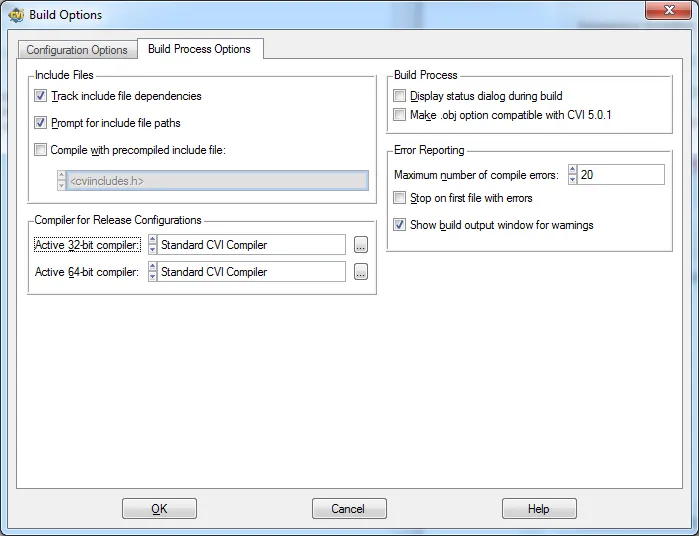

# Fichier .ecc pour CVI et Visual Studio Express 2012

Je travaille avec CVI 2012. Dès sa sortie j'ai installé Visual Studio Express 2012 for Desktop afin de compiler mes codes CVI en mode release avec. Petit problème CVI 2012 ne possède pas encore de fichier .ecc pour MSVC 2012.

Pour rappel, afin de compiler ses codes avec un compilateur optimisé il faut aller dans Options, Build Options, onglet Build Process Options puis selon que vous travaillez en 32 ou en 64 bits, dans le cadre "Compiler for Release Configurations" il faut cliquer sur le bon bouton "..."

<div align="center">

</div>


Là, la méthode consiste à choisir "New" dans la liste déroulante. Ensuite, dans la boite de dialogue j'ai choisi MSVC 2009. Pour le reste je vous laisse faire. Cela dit, j'aime bien stocker mes fichier .ecc dans le répertoire CVI de mon répertoire Documents. Bref, une fois le fichier en place, quittez CVI, retrouvez le fichier .ecc en question et ouvrez-le avec n'importe quel éditeur de texte type Notepad.

Vous trouverez les modifications que j'ai apporté au fichier initial. Ce dernier fonctionne sur ma machine.

```bash
CMPLRNAME = MSVC2012
VALID_CFG = 1
DOPARSING = 1
OPT_LEVEL = 2
WARNLEVEL = 3
USERFLAGS =
OBJFORMAT = Msvc
COMPFLAGS = /c /X /u /GS-
C89_FLAGS =
C99_FLAGS =
COMPLPATH = c:\Program Files (x86)\Microsoft Visual Studio 11.0\VC\bin\cl.exe
ENV_BATCH = c:\Program Files (x86)\Microsoft Visual Studio 11.0\VC\bin\vcvars32.bat
ENV_OPTNS =
OBJ_TEMPL = /Fo$OBJECT
SRC_TEMPL = $SOURCE
DEF_TEMPL = /D$MACRO
DEFVTEMPL = /D$MACRO=$VALUE
INC_TEMPL = /I$PATH
OPT_FLAGS
No Optimizations = /Od
Optimize for Space = /O1 /Oi-
Optimize for Speed = /O2 /Oi-
END_FLAGS
WARNFLAGS
Disable Warnings = /w
Minimal Warnings = /W1
More Warnings = /W2
Many Warnings = /W3
Aggressive Warnings = /W4
END_FLAGS
__CEND___
```

Comme je suis gentil, vous trouverez ci-après un zip avec le fichier en question : [Fichier MSVC2012.ecc pour CVI 2012](./assets/MSVC2012.zip)

