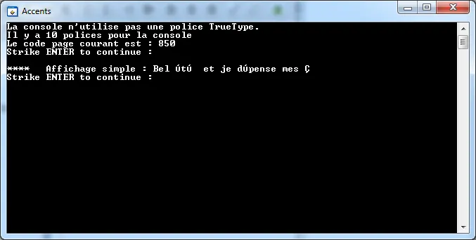

# Accents et encodage des caractères dans les consoles

L'autre jour, je sais plus trop pourquoi, j'ai été amené à m'intéresser aux histoires d'accents lors des affichages dans les consoles. Comme je suis toujours en train de lire et d'apprendre le C++11 j'ai essayé de voir comment cela se passait. Comme d'habitude, j'ai trouvé tout et n'importe quoi sur le web et les forums.

Bon bref, histoire de se remettre les idées en place, voici deux articles à lire absolument :

1. [http://www.joelonsoftware.com/articles/Unicode.html](http://www.joelonsoftware.com/articles/Unicode.html "http://www.joelonsoftware.com/articles/Unicode.html")
2. [http://www.utf8everywhere.org/](http://www.utf8everywhere.org/ "http://www.utf8everywhere.org/")

Ensuite sous Windows 7, en C++, on peut faire un test rapide avec le code suivant. Notez que je ne m’intéresse qu'aux accents et pas aux locales ni aux facets. Regardez bien à la ligne 17 ci-dessous (le reste du code c'est pour s'amuser...) :

```cpp
#include <algorithm>
#include <iostreamh>  // cout endl etc.
#include <vector>

using namespace std;

// ----------------------------------------------------------------------------
int main(){

    vector v;

    v.push_back(2);
    v.push_back(4);
    v.push_back(6);

    // Permet d'afficher les accents correctement
    locale::global(std::locale(""));
    cout << "Le nombre d'éléments du vecteur est : " << v.size() << endl << endl;

    vector::iterator i=v.begin();
    cout << "La valeur du premier élément est : " << *i << endl  << endl;

    // Avec auto C++11. Sort le contenu du vecteur
    for(auto i=v.begin(); i!=v.end(); i++){
        cout << "L'élément N° : " << distance(v.begin(), i)  << " vaut " << *i << endl;
    }
    cout << endl;

    // Ajoute des valeurs aléatoires
    v.push_back(100);
    v.push_back(98);
    v.push_back(96);
    v.push_back(94);
    v.push_back(92);
    v.push_back(93);

    cout << "Avant le tri des données :" << endl;
    for(auto i=v.begin(); i!=v.end(); i++){
        cout << "L'élément N° : " << distance(v.begin(), i)  << " vaut " << *i << endl;
    }
    cout << endl;

    sort(v.begin(), v.end());

    cout << "Après le tri des données :" << endl;
    for(auto i=v.begin(); i!=v.end(); i++){
        cout << "L'élément N° : " << distance(v.begin(), i)  << " vaut " << *i << endl;
    }
    cout << endl;

    cout << "Appuyez sur ENTREE pour quitter : ";
    cin.ignore(numeric_limits  ::max(), '\n' );
    return 0;
}
```

Voilà ce que j'obtiens en sortie :

<div align="center">

</div>


Il est à noter que la console est vraiment une console par défaut lancée par MSVC 2012 lorsque l'on est en mode debug. Par exemple dans l'option Proprités on peut vérifier dans l'onglet Police que celle utilisée est de type "Polices Raster". Tout se passe bien aussi quand on ouvre une console avec les touches Windows + R, que l'on tape  "cmd" et qu'on prend le temps d'aller au fin fond des répertoires pour relancer l'application de test (l'exécutable généré à partir du code source précédent).

Quand je fais le même type de test sous MAC OS avec XCode (et en compilant avec clang pour le support de C++11) je n'ai pas besoin de faire quoique se soit de particulier : les caractères accentués sortent correctement dès le départ. Un vrai bonheur.

Attention, avec CVI 2012, lorsque je fais une application de type console il faut un peu potasser avant d'avoir une sortie qui ressemble à quelque chose. A mon avis cela n'a rien à voir avec CVI mais plutôt avec la façon dont la bibliothèque ANSI C gère la console sous Windows.

Afin de lever le doute, j'ai été amené à étudier d'un peu plus près le problème sous CVI. Pour finir je vous propose de parcourir le code ci-dessous. Ensuite, je vais gentiment vous expliquer ce que je crois avoir compris. Cela nous permettra d'utiliser quelques fonctions spécifiques du SDK Windows et de voir comment invoquer une fonction non documentée de ce dernier. Pas de panique si vous ne comprenez pas tout en première lecture. Vous allez voir tout va s'éclaircir par la suite.

```c
#include <windows.h>
#include <stdio.h>

// ----------------------------------------------------------------------------
typedef DWORD (WINAPI *LPGetNumberOfConsoleFonts)(void);

// ----------------------------------------------------------------------------
int main (int argc, char *argv[]) {

    LPGetNumberOfConsoleFonts   GetNumberOfConsoleFonts;
    HMODULE                     hmod;
    HANDLE                      OutConsole;
    static CONSOLE_FONT_INFOEX  font;
    static CONSOLE_FONT_INFOEX  newfont;
    unsigned int                OldCode=0;
    // Permet, en mode debug de vérifier qu'en hexa les 'é' sont codés 'xE9' ce qui en codepage 850 correspond à 'Ú'
    char                        str[] = "Bel été";

    // evite le warning à la compile
    str[0]=str[0];

    // ----------------------------------------------------------------------------
    // http://blogs.msdn.com/b/michkap/archive/2011/09/22/10215125.aspx
    OutConsole = GetStdHandle(STD_OUTPUT_HANDLE);

    // ATTENTION : penser à bien initialiser lea taille de la structure
    font.cbSize = sizeof(CONSOLE_FONT_INFOEX);
    GetCurrentConsoleFontEx(OutConsole, 0, &font);

    if ((font.FontFamily & TMPF_TRUETYPE) == TMPF_TRUETYPE) {
      puts("La console utilise une police TrueType.");
    }else{
      puts("La console n'utilise pas une police TrueType.");
    }
  
    // GetNumberOfConsoleFonts() is a Win SDK undocumented function
    hmod = GetModuleHandleA("KERNEL32.DLL");
    GetNumberOfConsoleFonts = (LPGetNumberOfConsoleFonts)GetProcAddress(hmod,   "GetNumberOfConsoleFonts");
    if (!hmod || !GetNumberOfConsoleFonts){
        FreeLibrary(hmod);
        puts("Y a un problème!");
        puts("Strike ENTER to exit :");
        getchar();
    }else{
        printf("Il y a %d polices pour la console\n", GetNumberOfConsoleFonts());
    }

    // http://fr.wikipedia.org/wiki/Page_de_code_850
    OldCode = GetConsoleOutputCP();
    printf("Le code page courant est : %d\n", OldCode);

    puts("Strike ENTER to continue :");
    getchar();

    // ----------------------------------------------------------------------------
    // http://support.microsoft.com/kb/99795/en-us
    // Si on met une font TT type Consolas ou Lucida Console ça passe
    puts("****   Affichage simple : Bel été  et je dépense mes €");

    puts("Strike ENTER to continue :");
    getchar();

    // ----------------------------------------------------------------------------
    // é = 130 en dec et 0x82 en hexa
    // il n'y a pas de code pour le caractère '€'
    // http://fr.wikipedia.org/wiki/Page_de_code_850
    puts("****   Affichage avec des code hexa : Bel \x82t\x82.");
    puts("ATTENTION : pas de code hexa pour le caract\x8Are \"euro\"");

    puts("Strike ENTER to continue :");
    getchar();

    // ----------------------------------------------------------------------------
    // http://fr.wikipedia.org/wiki/Windows-1252
    puts("On tente de passer en code page 1252");
    // http://support.microsoft.com/kb/99795/en-us
    // SetConsoleOutputCP does not effect the displaying of extended characters of the console font named "Raster Font."
    SetConsoleOutputCP(1252);
    printf("Le code page courant est : %d\n", GetConsoleOutputCP());

    puts("");
    puts("****   Affichage en 1252 : Bel été et je dépense mes €");
    puts("ATTENTION : les caractères accentués n'apparaissent correctement qu'avec une police TrueType");

    puts("Strike ENTER to continue :");
    getchar();

    // ----------------------------------------------------------------------------
    // http://msdn.microsoft.com/en-us/library/system.console.aspx
    puts("On force la police en mode TrueType");

    newfont.cbSize = sizeof(CONSOLE_FONT_INFOEX);
    newfont.FontFamily = TMPF_TRUETYPE;
    mbstowcs(newfont.FaceName, "Lucida Console", 100);
    // Faut bien initialiser X et Y
    newfont.dwFontSize.Y = font.dwFontSize.Y;
    newfont.dwFontSize.X = font.dwFontSize.X;
    newfont.FontWeight = font.FontWeight;
    SetCurrentConsoleFontEx(OutConsole, 0, &newfont);

    GetNumberOfConsoleFonts = (LPGetNumberOfConsoleFonts)GetProcAddress(hmod, "GetNumberOfConsoleFonts");
    printf("Il y a dorénavant %d polices pour la console\n", GetNumberOfConsoleFonts());

    puts("Strike ENTER to continue :");
    getchar();

    // ----------------------------------------------------------------------------
    puts("");
    puts("****   Affichage 1252 avec la police modifiée : Bel été et je dépense mes €");
    puts("ATTENTION : si au départ la police n'était pas TrueType, l'affichage en 1252 qui n'était pas correct l'est dorénavant");
    puts("Pensez à jeter un oeil sur les différents type d'affichage précédents et à observer comment ils ont évolués.");
    puts("");

    // ----------------------------------------------------------------------------
    SetConsoleOutputCP(850);
    puts("****   Affichage en 850 avec la police modifiée : Bel été et je dépense mes €");

    // ----------------------------------------------------------------------------
    puts("");
    // Rouge
    SetConsoleTextAttribute(OutConsole, FOREGROUND_RED|FOREGROUND_INTENSITY);
    puts("Strike ENTER to exit :");
    getchar();

    // ----------------------------------------------------------------------------
    // Hide the console and set the default parameters back
    ShowWindow( GetConsoleWindow(), SW_HIDE);
    SetConsoleTextAttribute(OutConsole, FOREGROUND_RED|FOREGROUND_GREEN|FOREGROUND_BLUE);
    SetConsoleOutputCP(OldCode);
    SetCurrentConsoleFontEx(OutConsole, 0, &font);
    FreeLibrary(hmod);
    return 0;
}
```

On va commencer simple. Je met un point d'arrêt sur la ligne 20 et je lance le code. Dans l'onglet "Variables" je double clique le contenu de la variable str.  La fenêtre "String Display" apparaît :

<div align="center">

</div>


Dans le menu Format je sélectionne l'option Hexadecimal.

<div align="center">

</div>


On remarque donc que le 'é' de "été" est codé avec le code OxE9 et que le signe '€' est codé avec le signe Ox80.

<div align="center">

</div>


Si on continue l'exécution du programme et qu'on oublie pour l'instant les premiers messages, voilà ce que j'observe quand j'appuie sur ENTER une première fois. Si on veut vraiment comprendre ce qui se passe il faut consulter une page qui donne les codes de page 850 (<http://fr.wikipedia.org/wiki/Page_de_code_850>). On voit que le code  OxE9 correspond au caractère 'Ú' et qu'il n'y a aucun code pour représenter la caractère '€'.

Autrement dit, par défaut la console effectue ses sorties en utilisant le code de page 850. C'est ce que permet de vérifier la fonction GetConsoleOutputCP du SDK Windows à la ligne 49 du code ci-dessus avant que l'affichage de la chaîne de caractères ne s'effectue à la ligne 58.

Aux lignes 67-68 on utilise directement les codes hexadécimaux de la page de code 850 afin d'afficher correctement les caractères accentués. C'est franchement pas pratique mais au moins ça marche pour la plupart des caractères. Faut quand même pas oublier qu'on a pas le moyen d'afficher le caractère euro.

<div align="center">

</div>


Une solution serait de faire comprendre à la console qu'on souhaite travailler avec la page de code 1252 qui est historiquement la page de code utilisée par Windows (<http://fr.wikipedia.org/wiki/Windows-1252>). C'est ce que fait l'appel à SetConsoleOutputCP à la ligne 78. Ceci dit, à l'affichage une grande déception nous attend :

<div align="center">

</div>


En effet, après vérification (ligne 79) l'application indique que la console utilise bien la page de code 1252 mais pourtant, lors de la sortie écran il n'y a rien de nouveau. Les 'é' et le '€' ne sortent pas correctement. Qu'est-ce qui se passe ?

En fait l'explication se trouve dans la documentation de la fonction SetConsoleOutputCP() où il est indiqué que cette dernière n'a aucun effet lorsque la police de la console est de type Raster mais que par contre elle fonctionne lorsque la police de la console est de type TrueType. Hein, quoi, késako?

Normalement vous êtes en mode Debug et une console est à l'écran. Dans la console, cliquez en haut à gauche sur l'icône et choisissez Proprités. Dans l'onglet Polices on réalise que le police actuelle de la console est de type Raster.

<div align="center">

</div>


Faisons un tour de magie... Choisissez la police "Lucida Console". Abracadabra, la dernières sortie console s'affiche dorénavant correctement (notez que la toute première sortie écran est elle aussi corrigée et qu'on voit bien le signe €).

<div align="center">

</div>


Autrement dit, pour pouvoir faire apparaître les caractères accentués il  faudrait être en mode 1252 et s'assurer que la police de caractères soit de type TrueType. Pour le reste si on est en page de code 850 pour avoir des caractères accentués il faut les coder en dur dans le code et on aura pas accès au sigle Euro de toute façon .

Dans le déroulement du code on est déjà en mode 1252. Il faut donc utiliser des polices TrueType. C'est ce dont se chargent les lignes 92-99. Elles n'appellent pas de commentaires particuliers si ce n'est de bien lire la documentation de la fonction SetCurrentConsoleFontEx et surtout de ne pas oublier de bien initialiser le paramètre cbSize (ligne 92).

Dans le code ci-dessus, notez qu'après avoir sélectionné une police TrueType, on repasse en page de code 850 et que, bien sûr, l'affichage des caractères accentués ne passe plus.

<div align="center">

</div>


Pour le fun, à la toute fin du source on utilise la fonction SetConsoleTextAttribute du SDK Windows pour faire un affichage en rouge. A vous de lire la documentation.

Avant de fermer l'application, le code tente de remettre les paramètres de la console aux valeurs qu'il y avait au départ. Notez l'utilisation de ShowWindow qui n'est sans doute pas une bonne idée si l'application est appelée depuis une ligne de commande dans une console qui est déjà ouverte (n'hésitez pas à la commenter).

## Utiliser une fonction non documentée du SDK

Lors de mes tests, j'ai été amené à me demander combien de polices étaient disponibles dans la console. Bizarrement je n'ai pas trouvé de fonction prête à l'emploi dans le SDK. Par contre je suis tombé sur une fonction non documentée. Je vais donc prendre 5 min. pour vous expliquer commenter utiliser de telles fonctions dans CVI. Bien sûr la méthode est applicable à d'autres environnement de développement.

Heu... Bien sûr c'est pas une bonne idée que d'utiliser une fonction non documentée car il n'y a aucune assurance qu'elle soit disponible sur toutes les versions de Windows ni d'une version de Windows à la suivante. Bref, à éviter à tout prix dans un code en production mais pour un test temporaire cela peut être acceptable. Vous êtes prévenus.

On me dit que dans la DLL ``kernel32.dll``, il existe une fonction GetNumberOfConsoleFonts qui n'accepte aucun paramètre et qui retourne un DWORD.

1 - Dans le source, je commence par définir (ligne 5)  le type de données suivant :

```c
typedef DWORD (WINAPI *LPGetNumberOfConsoleFonts)(void);
```

J'ai donc créé un type LPGetNumberOfConsoleFonts qui est un pointeur de fonction qui peut pointer sur des fonctions qui n'acceptent pas de paramètre et qui retournent un DWORD.

2- Ensuite je déclare (ligne 10) une variable nommée GetNumberOfConsoleFonts et qui est du type LPGetNumberOfConsoleFonts :

```c
LPGetNumberOfConsoleFonts       GetNumberOfConsoleFonts;
```

3 - Ces travaux préparatifs étant terminés les choses deviennent intéressantes dans les lignes 36 à 46

```c
    // GetNumberOfConsoleFonts() is a Win SDK undocumented function
    hmod = GetModuleHandleA("KERNEL32.DLL");
    GetNumberOfConsoleFonts = (LPGetNumberOfConsoleFonts)GetProcAddress(hmod, "GetNumberOfConsoleFonts");
    if (!hmod || !GetNumberOfConsoleFonts){
        FreeLibrary(hmod);
    puts("Y a un problème!");
        puts("Strike ENTER to exit :");
        getchar();
    }else{
        printf("Il y a %d polices pour la console\n", GetNumberOfConsoleFonts());
    }
```

Ligne 37, on charge "à la main" la DLL kernel32.dll avec la fonction GetModuleHandleA. La DLL en question est très certainement déjà en mémoire mais ce n'est pas grave. Windows ne va rien faire sauf garder en tête, quelque part, qu'en plus de toutes les autres applications qui utilisent déjà kernel32.dll il y en a une de plus. En retour on reçoit un handle (comprenez un identifiant) qu'on va mettre à contribution plus tard.

La suite consiste justement à retrouver dans kernel32.dll la fonction GetNumberOfConsoleFonts. Pour cela on invoque la fonction GetProcAddress qui attend comme paramètre le handle de la DLL dans laquelle il faut chercher ainsi que le nom de la fonction à chercher (ligne 38). Notez que la valeur retournée et qui est normalement un pointeur est "castée" en un pointeur de fonction de type LPGetNumberOfConsoleFonts puis affectée à la variable GetNumberOfConsoleFonts.

A la ligne 39 on gère le cas où kernel32.dll  n'est pas en mémoire et/ou les cas où on ne retrouve pas la fonction cherchée.

A la ligne 45, on invoque de manière normale la fonction GetNumberOfConsoleFonts.

Voili, voilà. A vous de jouer mais soyez prudents. Ah, au fait, n'oubliez pas de relâcher la dll à la fin du code (ligne 131)

[Le code du projet CVI](./assets/Accents.zip)

