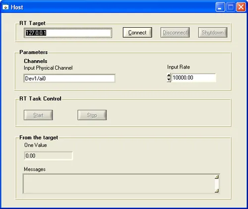
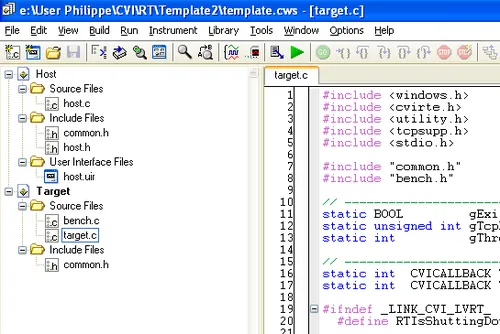
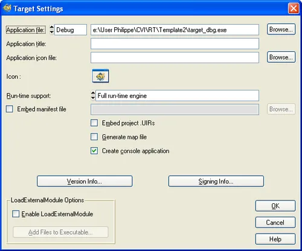
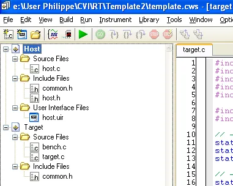
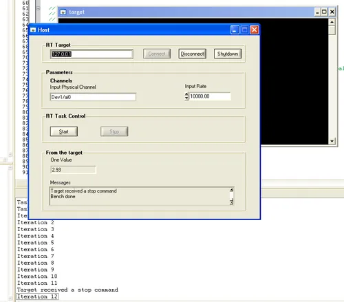
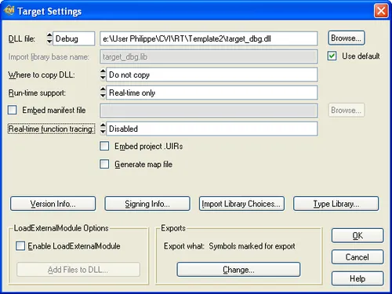
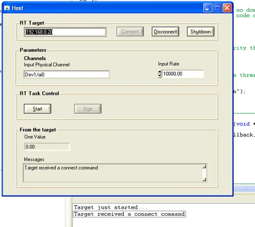

# Architecture d'application temps réel avec CVI

## Introduction

Dans cet article, on va s'intéresser plus à l'architecture sur laquelle pourraient s'appuyer nos futures applications temps réel. Attention, afin de pouvoir se concentrer sur l'architecture et non sur les questions de base, je suppose que vous êtes capables d'installer une cible temps réelle et que vous avez déjà écrit une application temps réel simple avec [CVI](https://www.40tude.fr/category/cvi/). On peut donc maintenant passer à la suite des opérations.

Quel est le cahier des charges ?

* Premièrement, je veux une application qui s'articule en deux gros morceaux. Un bout tournera sous Windows (le client) et l'autre morceau tournera lui sur la cible RT (le serveur).
* Ensuite, je veux qu'afin de tester rapidement le comportement de ce couple d'applications, on puisse facilement faire tourner le code de la cible, au choix, sur une "vraie" cible temps réel ou bien sous forme d'une application de type console sous Windows. Cela se révélera très pratique pour tester rapidement un maximum de choses.
* En trois, il faut qu'un système de messagerie relativement générique soit mis en place afin que l'hôte et la cible puissent communiquer dans un sens (l'hôte Windows envoie des commandes ou des paramètres à la cible temps réel) ou dans l'autre (la cible RT renvoie des résultats ou des messages de statut à l'hôte Windows).

Bon ben voilà, y plus qu'à... On va commencer par le code de l'hôte, ensuite on verra le code qui tourne sur la cible temps réel. Attention, gardez bien en tête que l'on étudie plus une architecture qu'une application prête à l'emploi. L'idée c'est de définir un canevas, un template à partir duquel vous pourrez concevoir votre propre application CVI temps réel. Bref, ne soyez pas surpris si ce dont on va parler ne correspond pas pile poil à ce que vous vouliez faire.

## Interface graphique de l'hôte Windows

C'est typiquement ce que l'on voit ci-dessous :

<div align="center">

</div>


Dans la partie haute on retrouve les contrôles permettant de se connecter-déconnecter à la cible temps réel et/ou lui demander de s'arrêter. Notez que le champ qui contient l'adresse IP de la cible on a actuellement "127.0.0.1". Tout laisse donc à penser que l'hôte Windows est en contact avec une cible qui tourne sur la même machine. On est donc ici dans le cas où le code qui sera plus tard déployé sur la cible temps réel tourne, pour l'instant, sous Windows dans une application de type Console.

Dernier point de détail : il n'y a pas de bouton "Quit". Pour arrêter l'hôte, il faut fermer la fenêtre de manière classique via la croix en haut à droite de la fenêtre (je n'aime pas les boutons Quit).

Tiens, pendant qu'on y est... Notez qu'il aurait été quand même plus malin, du point de vue de l'interface graphique, de ne montrer que les contrôles sur lesquels le end-user peut cliquer... Si mes souvenirs sont bons, on appelle ça des interfaces "bio", qui évoluent, qui s'adaptent en fonction du contexte.

La section Parameters de l'interface graphique est là à titre d'exemple. Dans notre cas, l'hôte Windows passera deux paramètres à la cible RT. Une chaîne de caractères (Input Physical Channel, "Dev1/ai0") et un double (Input Rate, 10000.00). Bien sûr ces types de données et leur nombre changeront en fonction de vos applications. Ceci dit, ici, ils vont nous permettent de démontrer comment l'hôte peut passer tout type de données à la cible.

La section RT Task Control de l'interface graphique permet de mettre en œuvre dans notre template les mécanismes de contrôle de la tâche qui s'exécute sur la cible temps réel. Ici on peut au choix lancer la tâche ou l'arrêter. Dans vos applications d'autres options seront peut-être nécessaires, mais bon pourrez toujours vous appuyer sur ce qui existe ici afin d'ajuster les options à ce dont vous avez besoin dans votre code.

La dernière section de l'interface graphique concerne les informations et les données qui sont retournées par la cible temps réel. On voit d'une part un paramètre de type double et d'autre part une liste box qui contient des messages d'information (une espèce de log). Encore une fois, le plus important c'est qu'à partir de ce que l'on va faire dans le template, vous puissiez compléter le code afin qu'il corresponde exactement à votre cas.

Deux remarques d'ordre général :

* Premièrement un point de détail cosmétique. On voit qu'il y a pas mal de boutons grisés. En fait c'est une sécurité vis à vis de "l'enthousiasme" de l'utilisateur final. Par exemple, tant que le l'hôte n'est pas effectivement connecté à la cible, il n'y a pas moyen de cliquer sur le bouton "Disconnect". Idéalement, afin d’alléger l'interface, il faudrait faire en sorte que tant qu'on n'a pas de connexion, hé bien le bouton "Disconnect" n'est pas visible. On peut aussi, une fois que l'hôte est connecté, changer le label de ce dernier, y écrire "Disconnect" et gérer la déconnexion de la cible la prochaine fois que le end user cliquera sur le bouton. A vous de voir... Cela dit, si dans vos prochaines applications il y a plus de contrôles, il faudra gérer tout cela de manière fine et élégante. Pensez à ces histoires d'interface graphique Bio. Dans le template de code on a utilisé une méthode un peu "bourrin" qui n'est pas très flexible. Si vous avez vraiment beaucoup de contrôles et d'options disponibles il sera peut-être nécessaire de faire une machine d'état pour gérer l'interface. Là aussi, à vous de voir...
* Le deuxième point est beaucoup plus ***important*** alors je vous demande d'être attentif... En effet, la communication entre la cible et l'hôte va se faire via TCP. Cela dit, dans la vraie vie, la cible est potentiellement en train de tourner 24 heures sur 24, 7 jours sur 7. L'hôte Windows est donc un client qui se connecte à un serveur qui tourne sur la cible temps réel. Par voie de conséquence... Tada... Le serveur TCP/IP ***doit*** tourner sur la cible temps réel.

## Le code de l'hôte Windows

Actuellement le code fait environ 180 lignes. Ce n'est pas énorme et comme on le verra, le source est relativement simple. Voici la fonction main() qui n'appelle pas de commentaires particuliers.

```cpp
int main(int argc, char *argv[]){

  if(InitCVIRTE(0,argv,0)==0)
    return EXIT_FAILURE;

  if( (ghPanel=LoadPanel(0,"host.uir",PANEL))<0)
    return EXIT_FAILURE;

  DisplayPanel(ghPanel);
  RunUserInterface();
  DiscardPanel(ghPanel);
  return EXIT_SUCCESS;
}
```

Les fonctions callback ConnectCallback() et DisconnectCallback() qui sont attachées aux boutons qui portent respectivement les mêmes noms sont très semblables. Voici le code de la fonction ConnectCallabck() :

```cpp
int CVICALLBACK ConnectCallback(int panel, int control, int event, void *callbackData, int eventData1, int eventData2){

  char RTTarget[256]={'\0'};

  if( event == EVENT_COMMIT) {
    GetCtrlVal(panel, PANEL_RTTARGET, RTTarget);
    if( ConnectToTCPServer(&ghTCPConv, TCP_PORT, RTTarget, Client, NULL, 0) < 0)
      MessagePopup("Error", "There was an error connecting to the remote target.");
    else {
      SetCtrlAttribute (panel, PANEL_CONNECT, ATTR_DIMMED, 1);
      SetCtrlAttribute (panel, PANEL_DISCONNECT, ATTR_DIMMED, 0);
      SetCtrlAttribute (panel, PANEL_SHUTDOWN, ATTR_DIMMED,0);
      SetCtrlAttribute (panel, PANEL_START, ATTR_DIMMED,0);
      SetCtrlAttribute (panel, PANEL_STOP, ATTR_DIMMED,1);
    }
  }
  return 0;
}
```

En gros, si on clique sur le bouton Connect, on récupère l'adresse IP sur l'interface graphique (GetCtrlVal) et on tente de se connecter (ConnectToTCPServer) au serveur qui tourne sur la cible RT. Si ce n'est pas possible on prévient (MessagePopup) et on sort. Si la connexion est établie, on gère "comme une brute" les boutons qu'il faut griser ou non avec la fonction SetCtrlAttribute(). Je dis comme "une brute" car vous voyez bien que si demain vous avez plus de contrôles et de boutons sur l'interface graphique la situation va vite devenir ingérable. Au lieu de 5 appels à SetCtrlAttribute vous en aurez, 10, 20... Enfin bref, il y a là une grosse source d'ennuis potentiels. Bon ici dans le template on va s'en contenter mais vous êtes prévenus. Faudra faire mieux dans vos propres applications.

Encore une fois, la fonction DisconnectCallback() est très similaire à la fonction ConnectCallback(). Ce n'est pas la peine de perdre du temps là-dessus.

En revanche, les fonctions ShutDown(), Start() et Stop() sont, elles beaucoup plus intéressantes car on envoie, à partir de l'hôte Windows, des ordres à la cible temps réel ainsi que des informations qui dépendent justement de la commande envoyée. Voici le code de la fonction callback ShutDown() qui est associée au bouton qui porte le même nom :

```cpp
int CVICALLBACK ShutdownCallback(int panel, int control, int event, void *callbackData, int eventData1, int eventData2){

  CommandMessage Cmd;

  if( event == EVENT_COMMIT) {
    Cmd.Action = SHUTDOWN_COMMAND;
    ClientTCPWrite (ghTCPConv, &Cmd, sizeof(Cmd), 0);
    DisconnectFromTCPServer (ghTCPConv);
    ghTCPConv = TCP_INVALID_CONNECTION;

    SetCtrlAttribute (panel, PANEL_CONNECT, ATTR_DIMMED, 1);
    SetCtrlAttribute (panel, PANEL_DISCONNECT, ATTR_DIMMED, 1);
    SetCtrlAttribute (panel, PANEL_SHUTDOWN, ATTR_DIMMED, 1);
    SetCtrlAttribute (panel, PANEL_START, ATTR_DIMMED, 1);
    SetCtrlAttribute (panel, PANEL_STOP, ATTR_DIMMED, 1);
  }
  return 0;
}
```

L'objectif de cette fonction est de permettre à l'hôte Windows de signifier à la tâche temps réel qu'elle doit s'arrêter. La cible temps-réel physique (châssis PXI par exemple) continuera à tourner mais la tâche temps-réel elle ne tournera plus. Il sera donc impossible de se connecter dessus et/ou de lui envoyer des ordres. Dans le cas où la tâche temps-réel tourne sous Windows dans une console, lorsqu'elle reçoit la commande SHUTDOWN, on termine simplement l'application.

Bref, la fonction envoie une commande (un ordre) avec la fonction ClientTCPWrite() puis se déconnecte de la cible avec la fonction DisconnectFromTCPServer(). Ensuite, elle grise les boutons de l'interface graphique en fonction de l'état de l'application.

C'est bien gentil tout ça mais comment on fait pour envoyer une commande ? En fait, on va être amené à définir notre propre protocole de communication. Ici, il faut remarquer qu'une commande, c'est une variable de type CommandMessage (voir la déclaration de la variable Cmd dans la fonction ShutdownCallback()). Le type CommandMessage est quant à lui défini dans le fichier header common.h. Compte tenu de l'organisation du template, le fichier common.h est à inclure dans le projet de l'hôte ainsi que dans celui de la cible temps réel (d'où son nom, common, commun).

Voilà la définition du type CommandMessage qu'on trouve dans le fichier common.h :

```cpp
// Command sent from client to the TCP server running on the target
typedef struct tag_CommandMessage{
  Command Action;
  char    Chan_In[256];
  double  Rate;
} CommandMessage;
```

A priori rien de bien sorcier. Un message de commande, c'est donc une structure qui contient une Action qui est une variable de type Command ainsi que deux autres champs qui sont ici, une chaîne de caractères et un double. Ne perdons pas de temps sur ces deux derniers champs pour l'instant. On verra ça bientôt.

Pour l'instant, faudrait savoir ce que recouvre vraiment le type Command qu'on retrouve dans la structure CommandMessage. Ce type est lui aussi défini dans le fichier common.h. Le voici dans toute sa splendeur :

```cpp
typedef enum tag_Command{
  SHUTDOWN_COMMAND = 0,
  START_COMMAND    = 1,
  STOP_COMMAND     = 2
}Command;
```

Une variable de type Command n'est donc rien d'autre qu'une variable qui ne peut pendre que 3 valeurs possibles (Shutdown, Start ou Stop). Ce typage fort via un typedef et un enum évite les embrouilles au niveau du codage. De plus, si demain vous souhaitez définir vos propres commandes (de l'hôte Windows vers la cible RT), il suffira de venir ajouter un ou plusieurs codes complémentaires au type Command. Par exemple vous pourriez vouloir insérer des ordres du type Pause (PAUSE_COMMAND) et Resume (RESUME_COMMAND).

Ouai, ouai... C'est bien gentil tout ça mais je suis un peu perdu et cela me paraît un peu compliqué. On ne peut pas faire un récapitulatif rapide ?

Pas de problème... Telles que les variables sont définies et typées, l'hôte Windows ne peut envoyer que 3 types de commandes à la cible temps réel (shutdown, start, stop). Ces commandes sont énumérées dans le type Command.

Maintenant qu'on a 3 types de commandes possibles, il est vraisemblable qu'on aura différents types d'informations à faire passer à la cible. Certaines commandes seront peut-être associées à des paramètres alors que d'autres seront à utiliser seules. A cette fin, on définit donc un type CommandMessage qui contient non seulement une des commandes possibles mais aussi les paramètres. Ces derniers sont bien sûr à mettre à jour sur l'hôte avant de les envoyer à la cible temps réel.

La commande Shutdown est une commande simple, impérative car elle ne possède pas paramètre. C'est pour cette raison que dans le code on met juste à jour le champs Action de la variable Cmd (SHUTDOWN_COMMAND) et zou, on envoie le CommandMessage sur le réseau via ClientTCPWrite. Ensuite, c'est de la littérature, on se déconnecte, on gère l'interface graphique etc. Voici encore une fois, le cœur de la fonction Shutdown() :

```cpp
if( event == EVENT_COMMIT) {
  Cmd.Action = SHUTDOWN_COMMAND;
  ClientTCPWrite (ghTCPConv, &Cmd, sizeof(Cmd), 0);
  DisconnectFromTCPServer (ghTCPConv);
  ghTCPConv = TCP_INVALID_CONNECTION;
  ...
```

Regardons maintenant le code de la fonction Start() qui doit passer des paramètres à la tâche temps réel

```cpp
int CVICALLBACK StartCallback(int panel, int control, int event, void *callbackData, int eventData1, int eventData2){

  CommandMessage Cmd;

  if(event == EVENT_COMMIT){
    Cmd.Action = START_COMMAND;
    GetCtrlVal (panel, PANEL_AICHANNEL, Cmd.Chan_In);
    GetCtrlVal (panel, PANEL_RATE, &Cmd.Rate);
    ClientTCPWrite (ghTCPConv, &Cmd, sizeof(Cmd), 0);

    SetCtrlAttribute (panel, PANEL_START, ATTR_DIMMED, 1);
    SetCtrlAttribute (panel, PANEL_STOP, ATTR_DIMMED, 0);
  }
  return 0;
}
```

La fonction met le champs Action de la variable Cmd à START_COMMAND. Ensuite, avec les fonctions GetCtrlVal() on alimente les champs Chan_In et Rate de la variable Cmd. Ensuite, c'est classique, on utilise ClientTCPWrite pour envoyer la variable Cmd à l'hôte. On ne sait toujours pas trop comment il fait mais l'hôte temps réel, selon qu'il reçoit une commande de type START_COMMAND ou SHUTDOWN_COMMAND, se dépatouille avec le contenu du message et passe les bonnes informations à la tâche temps réel. Bon, allez, un dernier pour la route, voilà le code de la fonction Stop() :

```cpp
int CVICALLBACK StopCallback(int panel, int control, int event, void *callbackData, int eventData1, int eventData2){

  CommandMessage Cmd;

  if(event == EVENT_COMMIT) {
    Cmd.Action = STOP_COMMAND;
    ClientTCPWrite (ghTCPConv, &Cmd, sizeof(Cmd), 0);

    SetCtrlAttribute (panel, PANEL_START, ATTR_DIMMED, 0);
    SetCtrlAttribute (panel, PANEL_STOP, ATTR_DIMMED, 1);
  }
  return 0;
}
```

Bon, maintenant c'est de la routine... Il n'y a pas de piège. Au pire, si vous avez encore des problèmes pour comprendre ce qui se passe, relisez ce que l'on a dit à propos de la fonction Shutdown().

La dernière fonction qui reste à expliquer au niveau du client Windows est une fonction qui prend en charge les informations reçues depuis la cible temps réel.

Quoi ? Kessekidit? Je croyais que la cible temps réel était le serveur et que l'application Windows était un client. Oui, oui, tout cela est vrai. Cela dit, on peut quand même accepter l'idée que la cible temps réel ait des choses à dire au client ("c'est bon, je tourne", "ayé, j'ai fini", "youhou... j'ai des données pour toi").

Si vous revenez dans la fonction ConnectCallback(), vous verrez que l'un des paramètres de la fonction ConnectToTCPServer() est un pointeur de fonction (le nom d'une fonction) qui aura la charge de traiter les messages que l'application Windows recevra en tant que client TCP (Client dans le code source). Pour info, voici le cœur de la fonction ConnectCallback(). Relisez bien la ligne ConnectToTCPServer et au pire passez un peu de temps dans l'aide de CVI.

```cpp
int CVICALLBACK ConnectCallback(int panel, int control, int event, void *callbackData, int eventData1, int eventData2){

  char RTTarget[256]={'\0'};

  if( event == EVENT_COMMIT) {
    GetCtrlVal(panel, PANEL_RTTARGET, RTTarget);
    if( ConnectToTCPServer(&ghTCPConv, TCP_PORT, RTTarget, <b>Client</b>, NULL, 0) < 0)
      MessagePopup("Error", "There was an error connecting to the remote target.");
    else {
    ...
```

Maintenant, voici la définition définition de la fonction Client() :

```cpp
static int CVICALLBACK Client(unsigned handle, int xType, int errCode, void *ignored){

  DataMessage Message;

  switch( xType ) {
    case TCP_DISCONNECT:
      if(ghTCPConv == handle)
        DisconnectCallback(PANEL, 0, EVENT_COMMIT, NULL, 0, 0);
    break;

    case TCP_DATAREADY:
      if(ghTCPConv==handle) {
        ClientTCPRead(handle, &Message, sizeof(Message), 0);

        // Incoming message or info from the target
        switch(Message.KindOf) {

          case UPDATE_DATA_MESSAGE:
            DebugPrintf("Host received an update data message...\n");
            SetCtrlVal(ghPanel, PANEL_ACTUAL_RATE, Message.OneValue);
          break;

          case STATUS_MESSAGE:
            DebugPrintf("Host received an update data message...\n");
            SetCtrlVal(ghPanel, PANEL_STATUS, Message.Status);
          break;

          case DONE_MESSAGE:
            SetCtrlAttribute (ghPanel, PANEL_START, ATTR_DIMMED, 0);
            SetCtrlAttribute (ghPanel, PANEL_STOP, ATTR_DIMMED, 1);
          break;

          default:
          break;
        }
    }
    break;
  }
  return 0;
}
```

Attention les explications qui suivent sont **très importantes** car on aura une fonction similaire au niveau du serveur sur la cible RT et que c'est ici qu'on montre comment on gère différents types de messages avec différents paramètres. Enfin bref, ouvrez vos yeux et vos oreilles.

En gros, la fonction Client() est une fonction callback presque classique. Son prototype est un peu différent mais son comportement est similaire. Elle a deux types d'événements à gérer : TCP_DISCONNECT et TCP_DATAREADY. On gère ces derniers via un switch classique.

Dans le cas d'un événement de type TCP_DISCONNECT, l'application cliente appelle directement la fonction DisconnectCallback(). Cela peut paraître un peu bizarre. En fait, le truc c'est qu'en faisant de la sorte, on essaiera sans doute de se déconnecter du serveur (ce qui est idiot dans ce cas puisqu'on vient d'être prévenu qu'on avait perdu la communication avec le serveur) mais surtout, on grisera correctement les boutons de l'interface graphique. Enfin bref, pas très intéressant tout ça. La suite l'est beaucoup plus.

Dans le cas d'un événement de type TCP_DATAREADY on commence par vérifier si c'est bien le serveur auquel on s'est connecté qui nous appelle (voir le if(ghTCPConv==handle)). Je rappelle que ghTCPConv est une variable globale dans laquelle le client Windows stocke le N° de conversation que lui a retourné la fonction ConnectToTCPServer(). Si vous êtes perdu relisez le code de la fonction ConnectCallback().

Si c'est bien notre serveur qui nous "téléphone", alors on lit le message envoyé. Dans le code source, de manière très originale, le message est en fait une variable nommée Message et qui est de type DataMessage. Ce type de donnée est défini, lui aussi, dans le fichier common.h.

Voyons à quoi ressemble un DataMessage :

```cpp
typedef struct tag_DataMessage{
  Data    KindOf;
  double  OneValue;
  char    Status[256];
} DataMessage;
```

Autrement dit un DataMessage en provenance de la cible c'est une structure qui contient un champ KindOf ainsi qu'un double et un tableau de caractères. Dans l'esprit, c'est très similaire à ce que l'on avait vu avec les CommandMessage précédemment. En fait, ici aussi le seul truc important c'est le champ KindOf (qui est de type Data). En effet dans vos futures applications vous aurez tout le loisir d'ajouter, à la suite du champs KindOf d'autres paramètres spécifiques à vos besoins (un tableau de doubles qui contient une FFT, une valeur numérique etc.)

Ok... Bon alors, le champs KindOf est de type Data. Très bien mais bon, Data c'est quoi exactement ? En fait vous devriez déjà avoir une petite idée.

Voici le type Data tel qu'il est défini dans le fichier common.h :

```cpp
typedef enum tag_Data{
  UPDATE_DATA_MESSAGE = 0,
  STATUS_MESSAGE      = 1,
  DONE_MESSAGE        = 2
}Data;
```

On a déjà vu ça pour le type Command. Je ne reviens pas sur ce que j'ai déjà dit. En revanche, là où cela devient intéressant, c'est de voir dans le code de la fonction Client() comment tout ça s'organise dans la joie et la bonne humeur. Je reprends donc ici le cœur de la fonction Client() :

```cpp
case TCP_DATAREADY:
  if(ghTCPConv==handle) {
    ClientTCPRead(handle, &Message, sizeof(Message), 0);

    // Incoming message or info from the target
    switch(Message.KindOf) {

      case UPDATE_DATA_MESSAGE:
        DebugPrintf("Host received an update data message...\n");
        SetCtrlVal(ghPanel, PANEL_ACTUAL_RATE, Message.OneValue);
      break;

      case STATUS_MESSAGE:
        DebugPrintf("Host received an update data message...\n");
        SetCtrlVal(ghPanel, PANEL_STATUS, Message.Status);
      break;

      case DONE_MESSAGE:
        SetCtrlAttribute (ghPanel, PANEL_START, ATTR_DIMMED, 0);
        SetCtrlAttribute (ghPanel, PANEL_STOP, ATTR_DIMMED, 1);
      break;

      default:
      break;
    }
}
break;
```

Je suppose ici que dans le code, on sort de la fonction ClientTCPRead() et que les différents champs de la variable Message sont donc alimentés. La première chose que l'on fait ensuite, c'est inspecter le champs KindOf et par la suite, via un second switch on gère les différents types de messages que l'on a pu recevoir de la part de la cible temps réel.

Par exemple, si on a reçu un message de type STATUS_MESSAGE, on sait que ce qui nous intéresse se trouve dans le champ Message.Status. On met alors à jour la liste déroulante de l'interface graphique qui contient le log de l'activité (voir l'appel à SetCtrlVal).

Cependant, si on reçoit un message de type DONE_MESSAGE, on sait à priori que la tâche temps réel est terminée et donc, il n'y a rien à afficher mais on grise en conséquence les boutons Start et Stop de l'interface graphique.

Allez, je vous laisse faire le dernier tout seul... Si on reçoit un message de type UPDATE_DATA_MESSAGE on sait à priori que l'application temps réel nous transmet une valeur qu'il faudrait mettre à jour sur l'interface graphique. On inspecte donc le champ ... de la structure ... et on met à jour l'indicateur graphique qui se nomme ...

Bon on s'amuse, on s'amuse mais vraiment, ce que l'on vient de voir est important.

Vous avez dorénavant une méthode qui permet à l'hôte et à la cible de communiquer en s'envoyant différents types de messages avec plus ou moins de variables à transmettre ou à mettre à jour. Il n'y a pas de restriction ni quant au nombre de messages possibles ni quant aux informations échangées. Le seul truc, c'est d'être très clair lors de la définition des messages, des commandes et d'utiliser un prototypage le plus strict possible. Sinon... Ben sinon, vous risquez d'interpréter un message de type Update comme un message de type Status. Vous irez lire les mauvais champs et se sera la panique dans votre application.

Respirez un bon coup. Allez prendre un café. Oubliez ce que vous venez de lire et revenez ensuite. Il faut maintenant qu'on étudie le code du serveur sur la cible temps réel.

## Le code de la cible temps réel

Il est temps maintenant de s'intéresser au code qui tourne sur la cible temps réel. On va commencer classiquement par la fonction main().

Heu... Si j'ai bien compris ce que j'ai lu dans les autres articles sur CVI RT, j'avais retenu que dans le cas du code qui tourne sur la cible, on créait une DLL et que la fonction d'entrée s'appelait RTmain(). Pourquoi on parle de main() ici ?

Oui, oui, c'est vrai, cela dit dans notre cahier des charges, il faut qu'en cas de besoin, on puisse faire tourner notre code sur une machine Windows classique. Dans ce cas-là, y aura bien un main() classique... Allez on passe au code tout va s'expliquer :

```cpp
#ifdef _LINK_CVI_LVRT_
void CVIFUNC_C RTmain (void){
#else
void main (int argc, char *argv[]){
#endif

  int     tcpThreadFunctionID=0;
  HANDLE  mainThreadHandle;

  if(InitCVIRTE(0,0,0) == 0)
    return;    /* out of memory */

  DebugPrintf("Target just started...\n");

  gTaskInitialized = FALSE;
  gTaskRunning     = FALSE;

  // Increase the priority of the main thread
  mainThreadHandle = GetCurrentThread();
  #ifdef _LINK_CVI_LVRT_
    SetThreadPriority(mainThreadHandle,THREAD_PRIORITY_TIME_CRITICAL);
  #else
    SetThreadPriority(mainThreadHandle,THREAD_PRIORITY_HIGHEST);
  #endif

  CmtNewThreadPool (1, &gThreadPool);
  CmtScheduleThreadPoolFunction (gThreadPool, TCPThreadFunction, NULL, &tcpThreadFunctionID);

  while( !RTIsShuttingDown() && !gExit){
    if(gTaskInitialized && gTaskRunning){
      RunTask();
    }else
      Sleep(50);
  }

  if (gThreadPool)
    // CmtDiscardThreadPool waits for the thread function to exit.
    CmtDiscardThreadPool (gThreadPool);

  DebugPrintf("Target is about to exit.\n");
  CloseCVIRTE ();
}
```

J'ai fait l'impasse sur le haut du code source, là où il y a les headers, les variables globales etc. Cela dit, on commence fort... En fait on utilise la macro _LINK_CVI_LVRT_ qui n'est définie que si et seulement si la cible de l'application est une DLL à déployer sur une cible temps-réel. De manière plus précise cette macro est définie si le projet a une Target Type de type DLL (voir le menu Build/Target Type) et si dans le menu "Build/Target Settings..." on a pris soin de préciser sur la boîte de dialogue qu'on voulait un Run-time Support de type Real-time Only.

Pour le reste, si "Build/Target Settings..." la cible du projet est une application de type console le code alors le code :

```cpp
#ifdef _LINK_CVI_LVRT_
void CVIFUNC_C RTmain (void){
#else
void main (int argc, char *argv[]){
#endif
```

Va se traduire par :

```cpp
void main (int argc, char *argv[]){
```

Alors que si la cible du projet est effectivement un code temps réel, les lignes :

```cpp
#ifdef _LINK_CVI_LVRT_
void CVIFUNC_C RTmain (void){
#else
void main (int argc, char *argv[]){
#endif
```

Vont se traduire par :

```cpp
void CVIFUNC_C RTmain (void){
```

Si vous avez des doutes sur ce que je viens de dire, utilisez l'option Options/Preprocess Source File de l'environnement de développement CVI.

Ensuite, je passe sur les détails, mais selon la cible sur laquelle l'application est déployée, via la fonction SetThreadPriority() on change la priorité du thread principal. Sur cible RT on le met à THREAD_PRIORITY_TIME_CRITICAL alors que si le code va tourner sous Windows dans une application de type console, le thread aura la priorité THREAD_PRIORITY_HIGHEST.

Ensuite, avec les fonctions CmtNewThreadPool() et CmtScheduleThreadPoolFunction(), on crée un pool de threads qui contient un seul thread et on lance ce dernier. C'est à priori un peu idiot d'avoir un thread de pool avec un seul tread. Cela dit on est dans un template et si dans votre application vous devez avoir un thread qui prend en charge le log des données, il suffira de créer un pool de 2 threads et de les lancer. Quoiqu'il en soit, ici le thread complémentaire s'appelle TCPThreadFunction.

Faisons un break... En effet, il est important de bien comprendre ce qui se passe. On a un code sur une cible temps réel qui comporte deux threads. L'un d'entre eux est en priorité maximum alors que le second a une priorité normale. Ce qui va être fait dans la suite, c'est que le thread de priorité normale va gérer la communication avec le host Windows alors que le thread principal, qui est en priorité maximum, aura la charge de la tâche RT. C'est d’ailleurs ce qu'il fait puisque dès que le thread "normal" est lancé, voici le code que l'on peut voir dans le main de la tâche RT.

```cpp
while( !RTIsShuttingDown() && !gExit){
  if(gTaskInitialized && gTaskRunning){
    RunTask();
  }else
    Sleep(50);
}
```

En gros cela veut dire : tant que la cible n'est pas en train de rebooter (voir l'aide de la fonction RTIsShuttingDown()) et qu'on n'a pas reçu l'ordre de s'arrêter (gExit est à TRUE) alors...

Ben alors, si la tâche RT à faire tourner est initialisée (gTaskInitialized est à TRUE) et prête à tourner (c'est vrai, je réalise que le nom de la variable gTaskRunning est mal choisi. J'aurai mieux fait de l'appeler gTaskCanRun ou un truc comme ça) alors...

Eh bien dans ce cas on fait tourner la tâche, sinon, le thread s'endort pour 50 ms ce qui permet à l'autre thread de priorité moindre d'avoir une chance de s'exécuter afin, par exemple, de traiter les messages en provenance de l'hôte Windows.

On le voit, on quitte la boucle Tant Que si et seulement si l'hôte Windows nous le demande ou si la cible temps-réel redémarre. Si tel est le cas, le thread principal invoque la fonction CmtDiscardThreadPool() afin d'attendre que le thread de moindre priorité s'arrête et relâcher les ressources utilisées pour la gestion du pool. Si dans votre code vous avez plus d'un thread secondaire vous n'avez rien à modifier ici.

Le code du thread principal se termine classiquement après le CloseCVIRTE().

Maintenant on a le choix. Soit on continue à étudier le code du thread principal soit on regarde le code du second thread que l'on vient de mettre en route. Pile, Face... Allez c'est Pile, on continue avec le thread de plus basse priorité. Je rappelle que ce dernier a été lancé via la ligne :

CmtScheduleThreadPoolFunction (gThreadPool, TCPThreadFunction, NULL, &tcpThreadFunctionID);

Dans cet appel, TCPThreadFunction est un pointeur de fonction sur la routine qui sera exécutée en tant que thread. Bien, bien... Que fait donc cette fonction ? Voici son code :

```cpp
static int CVICALLBACK TCPThreadFunction(void *functionData){

  RegisterTCPServer(TCP_PORT, TCPServerCallback, NULL);
  while( !RTIsShuttingDown() && !gExit )
    ProcessTCPEvents();
  UnregisterTCPServer(TCP_PORT);
  return 0;
}
```

Le thread de priorité normale commence donc par s'enregistrer en tant que serveur TCP/IP et ensuite, il part dans une boucle Tant Que. Attention, il faut bien remarquer la nature de la condition d'arrêt de la boucle. Ici aussi on a mis "!RTIsShuttingDown() && !gExit". En effet, rappelez-vous que dans le thread principal, si ce dernier quitte sa propre boucle, il invoque alors CmtDiscardThreadPool qui de son côté garde la main tant que les threads du pool en question ne s'arrêtent pas. Bref, il est donc important de soigner les conditions d'arrêt du thread secondaire.

Pour le reste, dans sa boucle le thread secondaire ne fait que dispatcher les événements TCP grâce à la fonction ProcessTCPEvents(). Si jamais un événement TCP apparaît, c'est la fonction mentionnée dans l'appel à RegisterTCPServer() qui sera invoquée. On parle donc ici de la fonction TCPServerCallback() dont voici le code :

```cpp
static int CVICALLBACK TCPServerCallback(unsigned handle, int xType, int errCode, void *ignored){

  int             error=0;
  CommandMessage  Cmd;
  DataMessage     Message;

  switch( xType ) {

    case TCP_CONNECT:
      DebugPrintf("Target received a connect command\n");
      // if not yet connected, accept the connection
      if( gTcpHandle == TCP_INVALID_CONNECTION) {
        gTcpHandle = handle;
        Message.KindOf = STATUS_MESSAGE;
        sprintf(Message.Status, "Target received a connect command\n");
        SendParameters(&Message);
        errChk (SetTCPDisconnectMode(gTcpHandle,TCP_DISCONNECT_AUTO));
      } else
        // otherwise reject it - allow only one client at one time
        errChk (DisconnectTCPClient(handle));
    break;

    case TCP_DISCONNECT:
      DebugPrintf("Target received a disconnect command\n");
      if( gTcpHandle==handle )
        gTcpHandle = TCP_INVALID_CONNECTION;
    break;

    case TCP_DATAREADY:
      if( gTcpHandle==handle ) {
        errChk(ServerTCPRead(handle, &Cmd, sizeof(Cmd), 0));
        // Process incoming command
        switch(Cmd.Action) {

          case SHUTDOWN_COMMAND:    // Stop the whole program
            DebugPrintf("Target received a shutdown command\n");
            gTaskRunning = FALSE;
            gExit = TRUE;
          break;

          case START_COMMAND:       // Start the loop
            DebugPrintf("Target received a start command\n");
            Message.KindOf = STATUS_MESSAGE;
            sprintf(Message.Status, "Target received a start command\n");
            SendParameters(&Message);
            ReadParameters(&Cmd);
            InitializeTask();
            gTaskRunning = TRUE;
          break;

          case STOP_COMMAND:            // Stop the loop
            DebugPrintf("Target received a stop command\n");
            Message.KindOf = STATUS_MESSAGE;
            sprintf(Message.Status, "Target received a stop command\n");
            SendParameters(&Message);
            gTaskRunning = FALSE;
          break;

          default:
          break;
        }
      }
    break;
  }
Error:
  return error;
}
```

Arrêtez de râler et ne vous laissez pas impressionner. En fait dans la fonction TCPServerCallback(), il y a un gros switch qui gère 3 cas possibles : TCP_CONNECT, TCP_DISCONNECT et TCP_DATAREADY. Ah ben tient, cela ressemble bigrement à la fonction Client() qui gérait ce qui se passait sur le réseau pour l'hôte Windows.

Comme on va le voir, le plus intéressant bien sûr c'est le cas TCP_DATAREADY où en fait on va faire exactement la même chose que ce que l'on avait fait dans le host Windows. Un second switch pour gérer les différents types de commandes reçues.

Vous voyez bien que ce n'est pas si compliqué. Bon allez, on y va mais on y va vite car tout ou presque a déjà été expliqué quand on parlait de l'application hôte sous Windows.

Je passe sur le cas TCP_DISCONNECT.

En ce qui concerne le cas TCP_CONNECT on commence par vérifier si on n'a pas déjà une connexion avec un autre client. Voir le "if( gTcpHandle == TCP_INVALID_CONNECTION)". En effet, sous réserve que partout ailleurs dans le code on s'assure que la variable globale gTcpHandle soit correctement maintenue, si elle vaut TCP_INVALID_CONNECTION cela signifie qu'il n'y a pas de connexion en cours et donc qu'on peut accepter la requête.

Si jamais il y a déjà une connexion avec un client, on déconnecte le dernier arrivé avec la fonction DisconnectTCPClient(). Charge au client de gérer le refus de connexion de la part du serveur.

Cependant, si on n'a pas encore de client connecté, alors on lui envoie un message et on utilise SetTCPDisconnectMode pour préciser la façon dont on veut que le handle de communication soit géré au cas où le client se déconnecterait sans nous prévenir.

En fait, le seul truc vraiment intéressant dans le cas TCP_CONNECT, c'est la façon dont la cible envoie un message au client. Re-voilà les 3 lignes de code qui se chargent du boulot :

```cpp
Message.KindOf = STATUS_MESSAGE;
sprintf(Message.Status, "Target received a connect command\n");
SendParameters(&Message);
```

Là franchement, je pense qu'on peut aller vite car on a déjà tout dit. L'application utilise le champs KindOf pour indiquer quel type de message elle va envoyer (ici un message de statut, voir le STATUS_MESSAGE dans le code source). Ensuite elle initialise le champs Status de la variable Message et zou, elle envoie le tout sur le réseau via la fonction SendParameters().

Je ne reviens pas sur les types de données utilisés. On en a largement parlé dans l'étude du code de l'hôte Windows. Cela dit, regardons la fonction SendParameters() (qui est très mal nommée, elle devrait s'appeler SendMessageToHost ou un truc de ce style). Voici son code :

```cpp
int SendParameters(const DataMessage *Msg){

  int   error=0;

  ServerTCPWrite(gTcpHandle, Msg, sizeof(*Msg), 0);
  return error;
}
```

Heu... T'as pas un peu l'impression de te fiche de nous là quelquefois ? Sérieux, y a un simple ServerTCPWrite et tu nous ponds une fonction rien que pour ça ? Ok... J'avoue.

Cela dit, j'attire votre attention qu'en cas de problème il sera peut-être nécessaire de revoir la façon dont vous envoyez des données à l'hôte Windows. En effet, TCP envoie les données par paquet. On ne peut pas savoir à priori comment il va s'organiser même si on est sûr qu'il va tout envoyer. Par exemple si on a 2222 octets à envoyer il va peut-être faire 1, 2 ou 8 paquets. On ne sait pas. Enfin bref, si vos structures DataMessage commencent à être de taille importante (typiquement supérieures à 512 octets ou 8 Ko je sais plus très bien), il sera peut-être utile de vous inspirer du code ci-dessous pour les faire circuler sur le réseau :

```cpp
void SendMessageToHost2(const char *Something, const int length){

  int   numBytesWritten=0;

  // Write in a loop until all data has been written.
  while (numBytesWritten < length)
    numBytesWritten += ServerTCPWrite(gTcpHandle, Something+numBytesWritten, length-numBytesWritten, 0);
  return;
}
```

Oui bien sûr, si vous utilisez ce type de fonction pour envoyer des données sur le réseau, de l'autre côté, côté lecture donc, il faudra faire un truc similaire. Par exemple, la fonction callback Client() qui tourne sur l'hôte Windows pourrait ressembler à ça :

```cpp
static int CVICALLBACK Client(unsigned handle, int xType, int errCode, void *ignored){

  DataMessage Message;
  int         numBytesRead=0;

  switch( xType ) {
    case TCP_DISCONNECT:
      if(ghTCPConv == handle)
        DisconnectCallback(PANEL, 0, EVENT_COMMIT, NULL, 0, 0);
    break;

    case TCP_DATAREADY:
      if(ghTCPConv==handle) {
        <b>while (numBytesRead < sizeof(Message))
          numBytesRead += ClientTCPRead(handle, (char*)(&Message)+numBytesRead, sizeof(Message)-numBytesRead, 0);</b>

        // Incoming message or info from the target
        switch(Message.KindOf) {
        .....
```

On a vu les cas TCP_DISCONNECT et TCP_CONNECT. Il ne nous reste plus qu'à étudier le cas TCP_DATAREADY. Quitte à être un peu lourd je rappelle qu'on gère ce cas lorsque des données sont disponibles et à l'intention du serveur qui tourne sur la cible RT. Donc ce sont les cas où l'hôte Windows envoie des commandes (Start, Stop etc.). Re-voilà le code pour le TCP_DATAREADY côté serveur, sur la cible temps réel :

```cpp
case TCP_DATAREADY:
  if( gTcpHandle==handle ) {
    errChk(ServerTCPRead(handle, &Cmd, sizeof(Cmd), 0));

    // Process incoming command
    switch(Cmd.Action) {

      case SHUTDOWN_COMMAND:    // Stop the whole program
        DebugPrintf("Target received a shutdown command\n");
        gTaskRunning = FALSE;
        gExit = TRUE;
      break;

      case START_COMMAND:       // Start the loop
        DebugPrintf("Target received a start command\n");
        Message.KindOf = STATUS_MESSAGE;
        sprintf(Message.Status, "Target received a start command\n");
        SendParameters(&Message);
        ReadParameters(&Cmd);
        InitializeTask();
        gTaskRunning = TRUE;
      break;

      case STOP_COMMAND:            // Stop the loop
        DebugPrintf("Target received a stop command\n");
        Message.KindOf = STATUS_MESSAGE;
        sprintf(Message.Status, "Target received a stop command\n");
        SendParameters(&Message);
        gTaskRunning = FALSE;
      break;

      default:
      break;
    }
  }
break;
```

Là je vais faire très vite puisqu'on a déjà tout vu ou presque lorsque l'on s'intéressait au code l'hôte sous Windows. Je vous revoie donc vers le code en question. Cela dit, notez la façon dont sont mis à jour les variables globales gTaskRunning et gExit et rappelez-vous qu'elles ont une influence directe sur l'exécution du thread principal et du thread secondaire.

Pour le reste notez l'utilisation du DebugPrintf qui permet, lorsque le code de la cible s'exécute dans une application de type console sous Windows, en mode Debug dans l'environnement CVI, d'avoir un log dans la fenêtre Debug Output de ce dernier.

Je rappelle aussi que sous réserve d'avoir un écran connecté sur la cible temps réel, il est tout a fait licite d'utiliser la fonction printf(). En mode Release ce n'est sans doute pas une bonne idée mais bon, en mode Debug elle peut rendre de très bons services.

Dans le cas START_COMMAND il est peut-être bon de s'intéresser aux lignes suivantes :

```cpp
ReadParameters(&Cmd);
InitializeTask();
gTaskRunning = TRUE;
```

On n'est pas gêné par la gestion des erreurs. C'est une très mauvaise idée ! Que se passe-t-il si la fonction InitializeTask() ne se passe pas bien. gTaskRunning passe quand même à TRUE et le thread principal va lancer RunTask() alors que tout n'est pas prêt. Pas sérieux tout ça ! Pour rappel voilà le code du thread principal qui est en priorité haute et qui représente vraiment la tâche temps réel :

```cpp
while( !RTIsShuttingDown() && !gExit){
  if(gTaskInitialized && gTaskRunning){
    RunTask();
  }else
    Sleep(50);
}
```

Quoiqu'il en soit, voici le code de la fonction ReadParameters() qui se trouve dans le fichier bench.c. En faisant ainsi, on se force à séparer le code général de l'application RT du code qui est spécifique à la tâche temps réel à exécuter. En effet, tout le code du source target.c est très générique et peut potentiellement être utilisé quelque soit la tâche à faire tourner. Cela dit, la lecture et le dispatching des paramètres reçus de la part de l'hôte Windows est vraiment spécifique à votre application. C'est donc une bonne idée que de les séparer.

```cpp
int ReadParameters(const CommandMessage *Cmd){

  int   error=0;

  memcpy(gChan_In, Cmd->Chan_In, sizeof(Cmd->Chan_In));
  gRate = Cmd->Rate;
  return error;
}
```

Il n'y a vraiment pas grand-chose. Cela dit cette fonction permettra dans un code de plus grande envergure d'isoler l'endroit où, ayant reçu un CommandMessage, on dispatchera les paramètres. Ici c'est simple, en paramètre, on reçoit une chaîne de caractères et une valeur double. Un simple memcpy et une affectation résolve notre "problème". Dans vos applications il faudra peut-être faire plus. Encore une fois on étudie un template, une coquille vide et certaines fonctions peuvent paraître inutiles pour l'instant. Tiens, par exemple, on peut se demander à quoi sert le

```cpp
int error=0;
```

N'oubliez pas que dans vos applications vous souhaiterez peut-être utiliser des macros de type errChk ou DAQmxErrChk. Auquel cas il suffira de simplement de modifier votre code comme suit :

```cpp
int ReadParameters(const CommandMessage *Cmd){

  int   error=0;

  errChk(memcpy(gChan_In, Cmd->Chan_In, sizeof(Cmd->Chan_In)));
  gRate = Cmd->Rate;

Error :
  return error;
}
```

Je parlais de coquille vide. Étudions maintenant le code de la fonction InitializeTask() qui lui aussi se trouve dans le source nommé bench.c car l'initialisation est spécifique à votre tâche temps réel :

```cpp
int InitializeTask(void){

  int           error=0;
  DataMessage Message;

  DebugPrintf("Task Initializing...\n");
  Message.KindOf = STATUS_MESSAGE;
  sprintf(Message.Status, "Task initialized\n");
  SendMessageToHost(&Message);

  gTaskInitialized=TRUE;
  DebugPrintf("Task Initialized\n");
  return error;
}
```

L'objectif de cette fonction est de permettre principalement d'initialiser ce qu'il y a à initialiser. Je pense surtout aux tâches temps réel qui utilisent DAQmx. Dans ce cas, c'est ici qu'il faudra configurer les tâches DAQmx etc.

Dans le cadre du template, la seule chose importante à noter c'est que la variable globale gTaskInitialized passe à TRUE à la fin de la fonction (sous réserve bien sûr que tout se soit bien passé).

Si je récapitule, après avoir reçu un START_COMMAND, et sous réserve que tout se passe bien, on lit et on distribue les paramètres reçus, on initialise la tâche RT si besoin (au passage la variable gTaskInitialized est passée à TRUE) et pour finir, la variable gTaskRunning passe elle aussi à TRUE. Regardez encore une fois le code ci-dessous :

```cpp
ReadParameters(&Cmd);
InitializeTask();
gTaskRunning = TRUE;
```

Autrement dit, c'est tout bon, on peut lancer notre tâche RT en toute sécurité. Rappelez vous le code du thread principal :

```cpp
while( !RTIsShuttingDown() && !gExit){
  if(gTaskInitialized && gTaskRunning){
    RunTask();
  }else
    Sleep(50);
}
```

Il ne nous reste donc plus qu'à étudier le code de la fonction RunTask() que voici, que voilà :

```cpp
int RunTask(void){

  int         error=0;
  DataMessage Message;
  int         CurrentIteration=0;

    while ((CurrentIteration < 50) && gTaskRunning){
        CurrentIteration++;
        DebugPrintf("Iteration %d\n", CurrentIteration);
        Sleep(50);
    }
    gTaskRunning = FALSE;

    Message.KindOf = UPDATE_DATA_MESSAGE;
    Message.OneValue=gOneValue+Timer();
    SendMessageToHost(&Message);

    Message.KindOf = STATUS_MESSAGE;
    sprintf(Message.Status, "Bench done\n");
    SendMessageToHost(&Message);

    Message.KindOf = DONE_MESSAGE;
    SendMessageToHost(&Message);
    return error;
}
```

Encore une fois on est dans un template de code donc il n'y a pas grand-chose de bien sexy. Le truc le plus **important** c'est de s'assurer que :

* Soit le thread s'arrête tout seul au bout d'une certains temps ou un certain nombre d'itérations (c'est l'option qu'on a choisi ici). Faut être sûr dans ce cas que cela va arriver. Hein, vous confirmez, pas d'embrouilles avec ces histoires ? Ok.
* Soit que le thread s'endort suffisamment longtemps pour que les autres threads de l'application, et entre autres le thread qui reçoit les commandes de la part de l'application Windows, aient une chance de s'exécuter. Par exemple, dans ce cas il faudrait que le second thread ait l'opportunité de recevoir un message stop afin de mettre à FALSE la variable globale gTaskRunning ce qui reviendra à arrêter notre thread de haute priorité.

Ici on a fait simple. On fait en sorte que le thread sorte de la boucle au bout de 50 itérations. Notez la présence dans la condition de la boucle de la variable gTaskRunning. De même, notez que tout de suite après la boucle "tant que" on met gTaskRunning à FALSE.

Le reste ? Rien de nouveau. On en profite pour émettre des messages à l'intention de l'hôte Windows. C'est normalement "crystal clear" pour vous à ce stade. On renvoie une valeur, un message et on informe l'hôte que le code RT est terminé.

Bon ben voilà, on a terminé. Y a plus qu'à voir si tout fonctionne

## Mise en œuvre sur une machine Windows

Dans le Workspace il y deux projets. Un pour l'hôte Windows et un autre pour la cible temps réel. Faites-en sorte que le projet Target soit le projet actif.

<div align="center">

</div>


Vérifiez ensuite ses paramètres. Mettez-le en mode Debug (Build/Configuration/Debug), assurez-vous que l'on va construire un exécutable (Build/Target Type/Executable) et enfin que l'application sera de type console.

<div align="center">

</div>


Maintenant, cliquez sur CTRL+M pour construire le projet Target.

Ensuite rendez le projet Host actif

<div align="center">

</div>


Là normalement il n'y a rien à vérifier. Appuyez sur CTRL+M pour construire l'application Windows. Quand c'est fait, cliquez droit sur le nom du projet et choisissez Execute. L'interface graphique devrait apparaître à l'écran. Ne touchez à rien, il faut qu'on lance la cible.

Avec ALT+TAB revenez sous CVI. Allez dans le menu Windows et assurez-vous que la fenêtre Debug Output est visible. Ensuite, cliquez droit sur le projet Target et choisissez l'option Set Active Project. Faites SHIFT+F5 pour lancer le code de la cible. Une fenêtre de type console apparaît alors à l'écran. Jouez avec ALT+TAB pour avoir CVI en fond et les fenêtres console et Host bien en évidence. Cliquez enfin sur Connect. Vous devriez voir des messages dans la fenêtre Debug Output de CVI. Cliquez sur Start... Amusez-vous et testez le comportement des deux codes.

**Attention**, tout à la fin, cliquez sur le bouton Shutdown (pour arrêter le code de la cible). La console doit disparaître de l'écran. Ensuite, et uniquement ensuite, cliquez sur la croix pour fermer l'application cliente. Cela dit, si jamais vous cliquez dans le mauvais ordre ou si vous cliquez sur Disconnect avant d'arrêter le client, normalement ce n'est pas un problème. Vous êtes juste bon pour relancer le client (clic droit sur le projet Host et sélection de l'option Execute), vous reconnecter, arrêter la cible, arrêter le client.

Enfin bref, amusez-vous... Lisez le contenu de la liste déroulante qui contient le log sur la fenêtre cliente. Pensez à arrêter la tâche RT avec le bouton Stop alors qu'elle est en cours d'exécution (les messages défilent dans la fenêtre Debug Output). Faites aussi un test en fermant la fenêtre cliente avec la croix en haut à droite alors que la console est toujours à l'écran. Allez-y, prenez le temps de bien comprendre le comportement des deux applications.

Voilà un exemple de ce que vous devriez avoir à l'écran.

<div align="center">

</div>

## Mise en œuvre avec une cible RT

Je considère ici que la cible est correctement connectée au PC via un câble réseau et que tout fonctionne correctement de ce point de vue (pas de problème de pare-feu etc.).

Côté Workspace, il va falloir s'assurer que tout est paré afin de déployer le code RT sur la cible. Rendez le projet Target actif. Dans le menu Build/Target Type choisissez l'option Dynamic Link Library. Ensuite, toujours dans le menu Build configurez les Target Settings comme suit :

<div align="center">

</div>


Vous aurez noté que le paramètre Real-time function tracing est sur Disable. Normal, on n'a rien mis dans le code pour en tirer parti pour l'instant.

Bon allez, clic droit sur le projet Host et sélectionnez l'option Execute pour voir apparaître la fenêtre du client Windows à l'écran. Ceci fait, si la flèche verte de CVI est grisée (Debug Project) pensez à aller dans le menu Run/Switch Execution Target et à choisir votre cible RT. Allez, ceci fait, lancez un bon vieux SHIFT+F5 pour que CVI compile, link et déploie la version Debug du code RT sur la cible.

La suite vous la connaissez. Par exemple, voilà ce que je vois dans la fenêtre de l'application hôte ainsi que dans la fenêtre Debug Output de CVI quand je me connecte avec l'application cliente.

<div align="center">

</div>


On remarque que l'adresse IP sur la fenêtre a été changée (ici c'est 192.168.0.20). Ensuite, il y a comme d'habitude un message "Target just started..." dans la fenêtre Debug Output de CVI. Après avoir lu ce message qui m'indique que le serveur est opérationnel sur la cible, j'ai cliqué sur le bouton Connect du client Windows. C'est alors ensuite que j'ai obtenu le message "Target received a connect command" dans la list box de l'interface.

Le reste, franchement vous connaissez par cœur. Allez, à vous de jouer...

## Conclusion

Ce fut long, détaillé et je l'espère instructif. Oubliez les tests, les trucs et les machins pratiques. Les seules choses qui comptent vraiment sont :

* L'architecture de l'application : pour pouvoir l'utiliser efficacement à votre avantage, vous devez vraiment la comprendre. Allez, prenez une page blanche, faites un croquis et écrivez ce que vous avez retenu.
* La façon dont on a construit les messages. Vous devez vous approprier les types DataMessage et CmdMessage
* Le double switch case dans les fonctions callback TCP/IP.
* La façon dont est organisé le Workspace, les deux Projects et les codes sources

Bon allez, vous êtes fatigués... Pas de problème, fermez tout, éteignez tout. Oubliez cet article et CVI. Demain sera un autre jour et dites-vous bien que la seule chose qu'il faut vraiment comprendre c'est l'architecture présentée.

