# OpenGL, Freeglut, Glew et CVI

## Introduction
J'ai toujours eu u faible pour la 3D et faire fonctionner CVI avec OpenGL est un truc qui m'a toujours intéressé. Cela dit, OpenGL a pas mal évolué et son modèle de programmation a complètement changé depuis les bonnes vielles années 90 (Opengl 1.1 par exemple, programmation en mode immédiat avec glBegin() et glEnd() etc.).

On va voir ici comment en quelques minutes ceux qui voudraient tirer parti des toutes dernières possibilités d'OpenGL 4.x (ou inférieure bien sûr), de Freeglut et de Glew dans CVI peuvent le faire dans la joie et la bonne humeur.

Si vous ne savez pas ce que sont Freeglut et Glew, allez faire un tour sur le web et revenez quand vous aurez vu la lumière. Histoire de vous inciter à aller vérifier tout ça avant de revenir ici, notez que le dernier SDK Windows (celui qui vient avec CVI ou MSVC 2013) ne vous donne accès qu'aux fonctions OpenGL 1.1 qui datent du Jurassique et qu'un test de trois lignes en CVI 2013 prouve que par défaut le GL_VENDOR c'est "Microsoft Corporation", le GL_RENDERER c'est "GDI Generic" et que le GL_VERSION c'est "1.1.0" (voir la fonction glGetString()). Bref, ça sent un peu le sapin (ou le mort vivant, au choix) et il est grand temps de voir comment on peut améliorer les choses.

## Installation

Comme il s'agit d'un test on va faire "quick'n dirty". Je pars du principe qu'une fois compris ce qui est expliqué ici vous pourrez toujours l'adapter à votre contexte de programmation. Allez, c'est parti...

Dans la bibliothèque **Mes Documents** je crée un répertoire **./tmp** dans lequel je crée un répertoire **./Opengl 4.0.** Dans ce dernier je crée pour commencer un sous répertoire **./tools** dans lequel je vais mettre Freeglut et Glew.

Il faut récupérer :

1. Freeglut sur  <http://freeglut.sf.net/>
2. Glew sur  <http://glew.sf.net/>

Attention, si vous n'avez pas l'intention de recompiler Freeglut, dans la page Download du site précédent il faut prendre les binaires pour MSVC. Quand c'est fait, on dézippe les 2 fichiers en question. Je me retrouve donc avec la configuration suivante :

<div align="center">
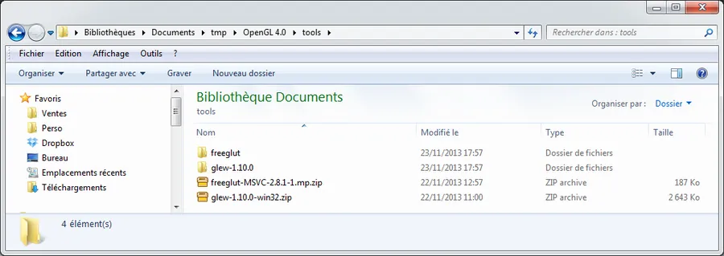
</div>

## Le projet

Ensuite vous lancez CVI et vous demandez à créer un nouveau projet. Vous créez ensuite un nouveaux code source et vous collez le code ci-dessous :

```c
#include <stdlib.h>
#include <stdio.h>
#include <string.h>
#include "./../tools/glew-1.10.0/include/GL/glew.h"
#include "./../tools/freeglut/include/GL/freeglut.h"

#define WINDOW_TITLE_PREFIX "Chapter 1"

// ----------------------------------------------------------------------------
int CurrentWidth        = 800;
int CurrentHeight       = 600;
int WindowHandle        = 0;
unsigned int FrameCount = 0;

// ----------------------------------------------------------------------------
void Initialize(int, char*[]);
void InitWindow(int, char*[]);
void ResizeFunction(int, int);
void RenderFunction(void);
void TimerFunction(int);
void IdleFunction(void);

// ----------------------------------------------------------------------------
int main(int argc, char *argv[]) {

  Initialize(argc, argv);
  glutMainLoop();
  exit(EXIT_SUCCESS);
}

// ----------------------------------------------------------------------------
void Initialize(int argc, char *argv[]) {

  GLenum GlewInitResult;

  InitWindow(argc, argv);
  GlewInitResult = glewInit();
  if (GLEW_OK != GlewInitResult) {
    fprintf(stderr, "ERROR: %s\n", glewGetErrorString(GlewInitResult));
    exit(EXIT_FAILURE);
  }
  fprintf(stdout, "INFO: OpenGL Version: %s\n", glGetString(GL_VERSION));
  glClearColor(0.0f, 0.0f, 0.0f, 0.0f);
}

// ----------------------------------------------------------------------------
void InitWindow(int argc, char *argv[]) {

  glutInit(&argc, argv);

  glutInitContextVersion(4, 0);
  glutInitContextFlags(GLUT_FORWARD_COMPATIBLE);
  glutInitContextProfile(GLUT_CORE_PROFILE);

  glutSetOption(GLUT_ACTION_ON_WINDOW_CLOSE, GLUT_ACTION_GLUTMAINLOOP_RETURNS);

  glutInitWindowSize(CurrentWidth, CurrentHeight);

  glutInitDisplayMode(GLUT_DEPTH | GLUT_DOUBLE | GLUT_RGBA);

  WindowHandle = glutCreateWindow(WINDOW_TITLE_PREFIX);

  if(WindowHandle < 1) {
    fprintf(stderr, "ERROR: Could not create a new rendering window.\n");
    exit(EXIT_FAILURE);
  }

  glutReshapeFunc(ResizeFunction);
  glutDisplayFunc(RenderFunction);
  glutIdleFunc(IdleFunction);
  glutTimerFunc(0, TimerFunction, 0);
}

// ----------------------------------------------------------------------------
void ResizeFunction(int Width, int Height) {

  CurrentWidth  = Width;
  CurrentHeight = Height;
  glViewport(0, 0, CurrentWidth, CurrentHeight);
}

// ----------------------------------------------------------------------------
void RenderFunction(void) {

  ++FrameCount;
  glClear(GL_COLOR_BUFFER_BIT | GL_DEPTH_BUFFER_BIT);

  glutSwapBuffers();
  glutPostRedisplay();
}

// ----------------------------------------------------------------------------
void IdleFunction(void) {

  glutPostRedisplay();
}

// ----------------------------------------------------------------------------
void TimerFunction(int Value) {

  if (0 != Value) {
    char *TempString = (char *) malloc(512 + strlen(WINDOW_TITLE_PREFIX));
    // *4 because the call to TimerFunction happens every 250ms
    sprintf(TempString, "%s: %d Frames Per Second @ %d x %d", WINDOW_TITLE_PREFIX, FrameCount * 4, CurrentWidth, CurrentHeight);
    glutSetWindowTitle(TempString);
    free(TempString);
  }

  FrameCount = 0;
  glutTimerFunc(250, TimerFunction, 1);
}
```

Pour l'instant, ne cherchez pas à comprendre... On veut juste être capable de compiler et de linker. Si vous souhaitez des explications détaillées à propos du code, allez lire la page suivante : <http://openglbook.com/the-book/chapter-1-getting-started/>

Quand le code est collé, faites une sauvegarde du source. Je vous propose de sauver (**CTRL + S**) dans **./OpenGL 4.0/Test1/Test1.c**. Bien sûr il faut créer le répertoire **./Test1**. Ceci fait ajoutez le source au projet (via le menu File/Add Test1.c to Project).

## Compilation

Maintenant il est temps d'essayer de compiler le projet (**CTRL + K**). CVI vous demande de sauvegarder le projet. Faites simple, nommez ce dernier **Test1** et sauvez-le à côté du code source précédent. Clang, le compilateur de CVI 2013 devrait se plaindre. Voilà ce que j'obtiens :

<div align="center">
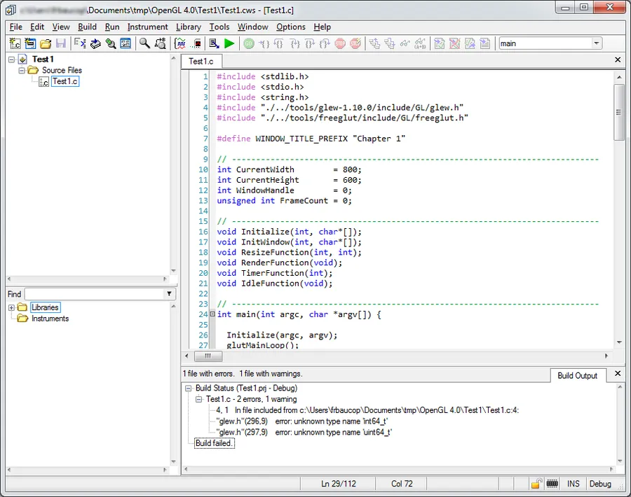
</div>

## Qu'est-ce qui peut ratatouiller ?

Tant que vous n'obtenez pas autre chose que ce qu'il y a dans l'image si dessus n'allez pas plus loin car cela signifie que vous avez d'autres soucis à régler avant. Typiquement pour une raison ou pour une autre, dans le code source, vous ne pointez pas vers les fichiers **glew.h** et **freeglut.h**. Au besoin, relisez attentivement les lignes 4 et 5 du code ci-dessus et adaptez, le cas échéant, les chemins utilisés. Une fois que vous aurez réglé vos problèmes et que vous obtiendrez les erreurs ci-dessus, passez à la suite c'est à dire la résolution des 2 erreurs en question.

Les lignes 286 à 298 de **glew.h** ressemblent à :

```c
#if defined(_MSC_VER) && _MSC_VER < 1400
typedef __int64 GLint64EXT;
typedef unsigned __int64 GLuint64EXT;
#elif defined(_MSC_VER) || defined(__BORLANDC__)
typedef signed long long GLint64EXT;
typedef unsigned long long GLuint64EXT;
#else
#  if defined(__MINGW32__) || defined(__CYGWIN__)
#include <inttypes.h>
#  endif
typedef int64_t GLint64EXT;
typedef uint64_t GLuint64EXT;
#endif
```

Je vous propose de modifier la ligne 286 comme suit

```c
#if defined(_MSC_VER) && _MSC_VER < 1400  || defined(_CVI_)
typedef __int64 GLint64EXT;
typedef unsigned __int64 GLuint64EXT;
#elif defined(_MSC_VER) || defined(__BORLANDC__)
typedef signed long long GLint64EXT;
typedef unsigned long long GLuint64EXT;
#else
#  if defined(__MINGW32__) || defined(__CYGWIN__)
#include <inttypes.h>
#  endif
typedef int64_t GLint64EXT;
typedef uint64_t GLuint64EXT;
#endif
```

Sauvez le fichier **glew.h** (**CTRL + S**) et relancez la compilation (**CTRL + K**). Là, ça doit passer à la compilation. Tant que la compilation ne s'effectue pas sans erreur, il est inutile de passer à la suite.

## Edition de liens

Bon, ben allez, on passe à la création de l'exécutable et on fait **CTRL + M** (menu Build, option Build). Là c'est une autre histoire. Dans mon cas j'ai 22 erreurs de link. Y pas mal de "**Undefined symbol**". En gros le linker est perdu, il ne retrouve pas ses petits. C'est normal, on n'a pas encore ajouté les bibliothèques d'importation nécessaires dans le projet.

Dans le projet, sur le nom du projet, tout en haut de l'arborescence, cliquez droit et choisissez "Explore Directory...". Utilisez la fenêtre de l'explorateur Windows pour aller dans le répertoire **./tmp/OpenGL 4.0/tools/freeglut/lib**. Là vous cliquez sur **freeglut.lib** et vous faites un glissé-déposé dans la fenêtre projet de CVI (la partie gauche de l'environnement de développement, ne lâchez pas la lib sur le code source).

Faites de même avec **glew32.lib** qui se trouve dans le répertoire **./tmp/OpenGL 4.0/tools/glew-1.10.0/lib/Release/Win32**

A ce stade le projet doit ressembler à ce qui suit :

<div align="center">
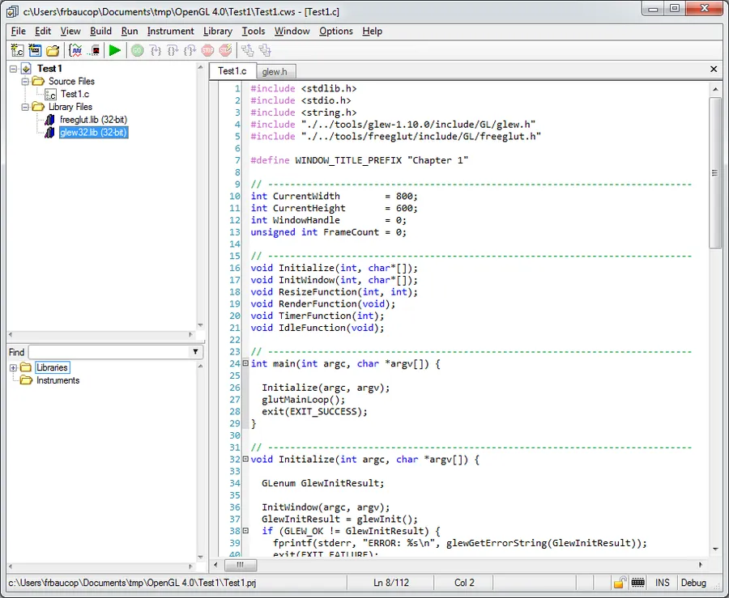
</div>


On continue. **CTRL + M** pour construire le projet. Là, l'éditeur de lien pleure car il lui manque des fonctions du style **glClear()**. Dans CVI je vous propose d'aller dans le menu "**Edit/Add Files To Project/Library (.lib)..."**. Avec la fenêtre de dialogue allez dans le répertoire **C:/Program Files (x86)/National Instruments/CVI2013/sdk/lib/msvc** et là vous choisissez le fichier **OpenGL32.lib**.

### Note

Dans la boite de dialogue qui apparaît, tout en haut, là où vous voyez le chemin actuel, si vous cliquez sur la flèche qui est au bout à droite du chemin, vous allez faire apparaître un historique ainsi qu'une liste de répertoires que CVI "garde sous la main". Il y a généralement toujours moyen de pointer rapidement sur le répertorie de CVI 2013.

OpenGL32.lib est maintenant ajoutée au projet. Allez, on build avec **CTRL + M**. Alors là... C'est plutôt bizarre cette histoire... On a pourtant bien toutes les bibliothèques d'importation et pourtant l'éditeur de lien continue à ce plaindre.

En fait, si on va faire un tour dans le fichier **glew.h** on remarque qu'il mappe les fonctions des différentes version d'Opengl. Bon, je passe les détails mais je vous propose d'aller inspecter les lignes 120 à 129 du fichier **glew.h**. Elles devraient ressembler à ceci :

```c
#ifndef APIENTRY
#define GLEW_APIENTRY_DEFINED
#  if defined(__MINGW32__) || defined(__CYGWIN__)
#    define APIENTRY __stdcall
#  elif (_MSC_VER >= 800) || defined(_STDCALL_SUPPORTED) || defined(__BORLANDC__)
#    define APIENTRY __stdcall
#  else
#    define APIENTRY
#  endif
#endif
```

Je vous propose de modifier la ligne 124 ainsi :

```c
#ifndef APIENTRY
#define GLEW_APIENTRY_DEFINED
#  if defined(__MINGW32__) || defined(__CYGWIN__)
#    define APIENTRY __stdcall
#  elif (_MSC_VER >= 800) || defined(_STDCALL_SUPPORTED) || defined(__BORLANDC__) || defined(_CVI_)
#    define APIENTRY __stdcall
#  else
#    define APIENTRY
#  endif
#endif
```

**CTRL + S** pour sauver le fichier **glew.h**. Ensuite **CTRL + M** pour construire le projet. Là, ça doit passer mais attention, ce n'est pas tout à fait terminé. Cela dit voilà ce que j'obtiens :

<div align="center">
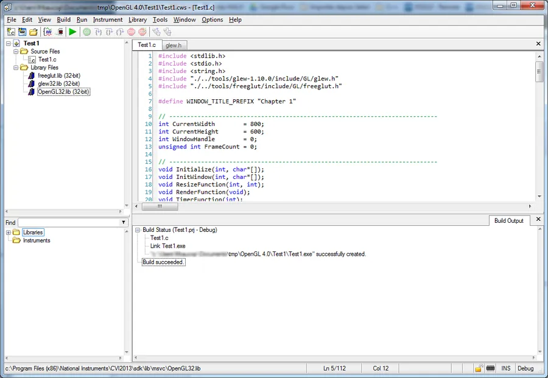
</div>

## Exécution

En l'état, si on lance l'application (**SHIFT + F5**), voilà ce que l'on obtient :

<div align="center">
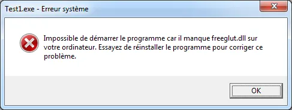
</div>


Pour remédier à ça je vous propose de copier dans le répertoire **./tmp/OpenGL 4.0/Test1** (à côté de votre exécutable Test1.exe donc) les deux fichiers **freeglut.dll** et **glew32.dll**qui se trouvent respectivement dans les répertoires **./tmp/OpenGL 4.0/tools/freeglut/bin** et **./tmp/OpenGL 4.0/tools/glew-1.10.0/bin/Release/Win32.**

Voilà l'organisation de mes fichiers :

<div align="center">
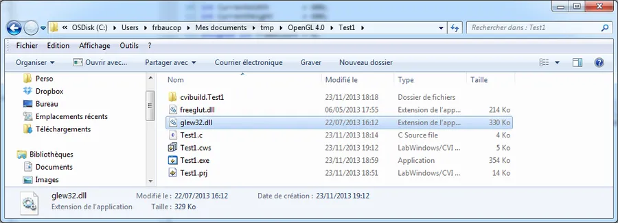
</div>


Si maintenant, dans CVI on fait **SHIFT + F5**, ce coup-ci ça tourne et c'est que du bonheur...

Voilà ce que j'obtiens à l'écran:

<div align="center">
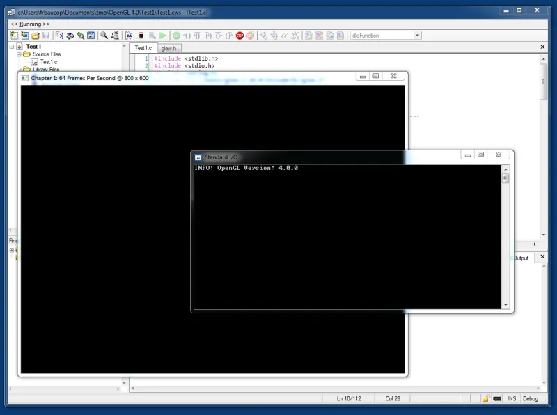
</div>


Bon, c'est un peu tout noir, il n'y a rien de sexy mais bon, ce n'est pas grave. Notez que dans la console l'application indique bien qu'on est en OpenGL 4.0. De son côté, la grande fenêtre toute noire (fenêtre d'affichage OpenGL) indique dans sa barre de titre, que dans mon cas, elle tourne, à 64 frames par seconde (oui, je sais, c'est nul mais j'obtiens des résultats similaires avec l'excellente application OpenGL Extension Viewer, GLView pour les intimes).

### Note

Afin d'améliorer le nombre de frames par seconde, via le panneau de contrôle NVIDIA, si je désactive la synchronisation verticale alors je passe à 400 frames par sec. Au besoin faites une recherche sur VSync et OpenGL sur le web. En fait les 64 frames qu'on avait tout à l'heure c'est bêtement le taux de rafraîchissement de mon écran. Pour le vérifier faites : Click droit sur  l'écran, Résolution d'écran, Paramètres avancés, onglet Ecran.

<div align="center">
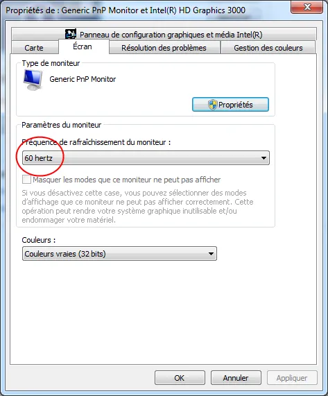
</div>

## Qu'est ce qui peut ratatouiller encore ?

Tel que le code est écrit, il faut que votre affichage soit en mode OpenGL 4.0. Dans le code source, jetez un œil à la fonction **InitWindow()** (ligne 47 et suivantes) et cherchez la documentation en ligne des fonctions **glutInitContextVersion()**, **glutInitContextFlags()** et **glutInitContextProfile()**.

Par exemple, sur mon portable j'ai deux cartes graphiques (Intel et NVIDIA). Si dans les paramètres NVIDIA je ne force pas l'utilisation de mon processeur graphique NVIDIA avec toute les applications et/ou si je laisse les applications choisir et/ou si je force l'utilisation de la carte graphique intégrée Intel avec toutes les applications alors le programme Test1.exe sort en erreur. En effet ma carte Intel ne supporte OpenGL que jusqu'à la version 3.1.

Voilà ma configuration via l'application NVIDIA :

<div align="center">
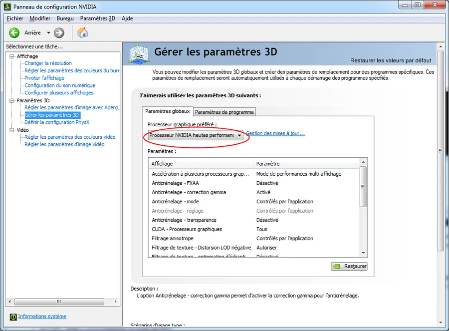
</div>


Faites le test. Attention, la sortie du programme est un peu violente (en effet le code est plein de **exit(EXIT_FAILURE)**) de plus en traçant le code pas à pas en mode Debug (F8) j'ai réalisé que si mon contexte OpenGL n'est pas au moins égal à 4.0 c'est la fonction **glutCreateWindow()** (ligne 61) qui sort comme une brute et que la gestion d'erreur aux lignes 63 et suivante n'est même pas utilisée. Bizarre, faudra que je regarde ça plus tard...

Un autre test possible. Laissez votre votre carte graphique par défaut, allez dans le code source ci-dessus, sélectionnez les lignes [51, 53] et faites **CTRL + E** pour les exclure (elles deviennent grisées dans l'éditeur de code). Avec **SHIFT + F5**, relancez un Build et une exécution de l'application.

Dans mon cas voilà ce que j'obtiens :

<div align="center">
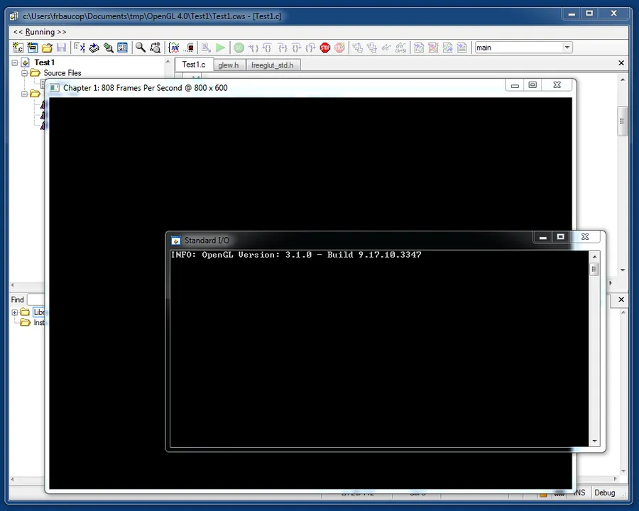
</div>


On note que la version OpenGL utilisée est alors 3.1 et qu'on tourne à 800 frames par seconde (ce résultat est homogène encore une fois avec ce que je peux vérifier avec GLView). Si je ferme l'application et si je force maintenant mon PC à utiliser le carte NVIDIA avec toutes les applications, alors, toujours avec les lignes [51, 53] exclues, la console affiche dorénavant OpenGL 4.4 (bizarre car GLView lui retourne 4.3).

## La touche finale ?

Je vous propose d'aller dans le menu Build/Target Settings... et d'appliquer les paramètres suivants :

<div align="center">
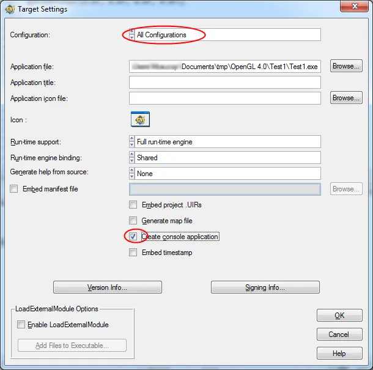
</div>


J'ai bien cliqué sur "**All Configurations**" et je sélectionne bien "**Create console application**". Pour le reste, c'est toujours pareil, vous pouvez ou non décider d'embarquer un timestamp dans l'exécutable et/ou surtout de changer l'icône par défaut afin d'obtenir une taille d'exécutable beaucoup plus petite. En effet l'icône CVI par défaut respecte toutes les résolutions d'écran et toutes les options d'affichage de répertoires possibles et imaginable mais elle est énorme (280 Ko je crois).

## À lire à aller consulter :

* GLView : <http://www.realtech-vr.com/glview/>
* L'article suivant qui refait un historique assez complet et qui explique bien les évolutions d'OpenGL : <http://openglbook.com/the-book/preface-what-is-opengl/>

