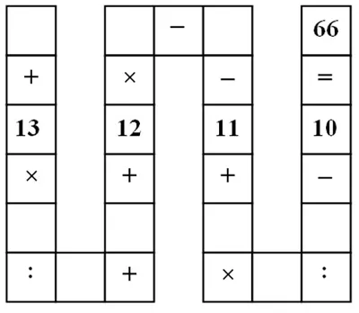

# Le casse-tête Vietnamien, une solution brutale en C++

Je suis tombé dessus par hasard le weekend dernier. Dans le serpentin ci-dessous, le jeu consiste à remplir les cases vides à l'aide d’un chiffre entre 1 et 9 sans qu’il ne soit répété et de retrouver le résultat (66).

## Note
Je suppose dans la suite que les divisions sont des divisions entières.

<div align="center">

</div>


Après avoir grattouillé un peu de papier je me suis demandé comment coder ça en C++... Ce que vous allez voir ci-dessous n'est pas ce que l'on peut faire de plus "fin" dans la mesure où le code utilise la force brute mais bon... De plus je ne suis pas sûr non plus que ce soit l'implémentation la plus "smart"...

En effet, le truc, c'est qu'afin d'être exhaustif (force brute oblige), il faut que la première variable parcoure tous les chiffres de 1 à 9.  Ensuite, la seconde variable doit être choisie entre 1 et 9 mais elle n'a pas le droit d'être égale à la première. Autrement dit elle doit être choisie parmi les 8 chiffres qui restent. La troisième doit parcourir les 7 chiffres qui restent etc.

Pour coder ça, je commence par définir une liste de chiffres de 1 à 9 (la liste nommée aliste) et je fais parcourir à la variable "a" le contenu de cette liste avec une range-based for loop. Ensuite, dans le corps de la boucle for en question, je commence par initialiser une seconde liste nommée bliste à partir de la liste aliste. La variable "a" est ensuite supprimée de la liste bliste (il ne reste donc plus que 8 valeurs possibles dans la liste bliste) et on lance le parcourt de la liste bliste par une variable "b". Le motif est dupliqué jusqu'à la variable "i" et la liste iliste (qui ne contient qu'un seul chiffre).

Petite remarque. Comme on doit effectuer des divisions entières, il est possible d'arrêter le carnage si par exemple ``b`` n'est pas un multiple de ``c`` ou si ``f*g`` n'est pas un multiple de ``i``. 

Attention c'est bien un ``continue`` et pas un ``break`` qu'on utilise car on ne veut pas sortir de la boucle mais plutôt passer au chiffre suivant.

```cpp
#include <iostream>
#include <list>
#include <fstream>
#include <iomanip>

using namespace std;

int main() {
  const int kResult = 66;

  ofstream ofs("out.txt", ios::out | ios::trunc);                               // output file stream

  list<int> aliste { 1, 2, 3, 4, 5, 6, 7, 8, 9 };

  auto count = 0;
  for (auto a : aliste) {
    list<int> bliste = aliste;
    bliste.remove(a);
    for (auto b : bliste) {
      list<int> cliste = bliste;
      cliste.remove(b);
      for (auto c : cliste) {
        if (b%c != 0) continue;                                                 // si b n'est pas un multiple de c alors on passe au c suivant
        list<int> dliste = cliste;
        dliste.remove(c);
        for (auto d : dliste) {
          list<int> eliste = dliste;
          eliste.remove(d);
          for (auto e : eliste) {
            list<int> fliste = eliste;
            fliste.remove(e);
            for (auto f : fliste) {
              list<int> gliste = fliste;
              gliste.remove(f);
              for (auto g : gliste) {
                list<int> hliste = gliste;
                hliste.remove(g);
                for (auto h : hliste) {
                  list<int> iliste = hliste;
                  iliste.remove(h);
                  for (auto i : iliste) {
                    if ((g*h) % i != 0) continue;                               // si fg n'est pas un multiple de i alors on passe au i suivant
                    if (kResult == a + 13 * b / c + d + (12 * e) - f -11 + (g * h) / i - 10) {
                      ofs << "Solution " << setw(2) << ++count << " : " << a << " " << b << " " << c << " " << d << " " << e << " " << f << " " << g << " " << h << " " << i << endl;
                    }
                  }
                }
              }
            }
          }
        }
      }
    }
  }
  ofs.close();
}
```

À la fin, voilà les solutions obtenues

```powershell
Solution  1 : 3 2 1 5 4 7 8 9 6
Solution  2 : 3 2 1 5 4 7 9 8 6
Solution  3 : 5 2 1 3 4 7 8 9 6
Solution  4 : 5 2 1 3 4 7 9 8 6
Solution  5 : 5 3 1 7 2 6 8 9 4
Solution  6 : 5 3 1 7 2 6 9 8 4
Solution  7 : 5 4 1 9 2 7 3 8 6
Solution  8 : 5 4 1 9 2 7 8 3 6
Solution  9 : 5 9 3 6 2 1 7 8 4
Solution 10 : 5 9 3 6 2 1 8 7 4
Solution 11 : 6 3 1 9 2 5 7 8 4
Solution 12 : 6 3 1 9 2 5 8 7 4
Solution 13 : 6 9 3 5 2 1 7 8 4
Solution 14 : 6 9 3 5 2 1 8 7 4
Solution 15 : 7 3 1 5 2 6 8 9 4
Solution 16 : 7 3 1 5 2 6 9 8 4
Solution 17 : 9 3 1 6 2 5 7 8 4
Solution 18 : 9 3 1 6 2 5 8 7 4
Solution 19 : 9 4 1 5 2 7 3 8 6
Solution 20 : 9 4 1 5 2 7 8 3 6
```
