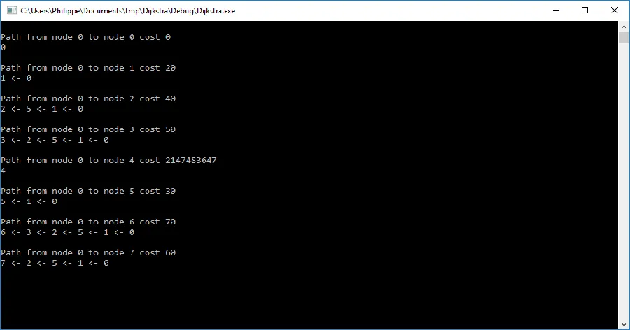

# Algorithme de Dijkstra en C++

## Introduction

Je suis toujours sur [Codingame](https://www.codingame.com) et pour l'un des challenges je cherchais un exemple simple d'implémentation de l'algorithme de [Dijkstra](http://fr.wikipedia.org/wiki/Algorithme_de_Dijkstra) en C++ sur lequel je pourrais expérimenter etc. Je n'ai pas trouvé ce que je cherchais car soit le code C++ n'utilisait pas la STL, soit le code était très long, soit il n'utilisait pas de priority_queue soit encore le code n'était pas prêt à l'emploi.

## Show me the code

Bref, voilà le source avec lequel j'ai fait mes propres tests. Le code est complet, relativement court (moins de 80 lignes avec pas mal de commentaires) et autonome (on peut faire un copier-coller et ça tourne). Pour les fichiers de test (voir un peu plus en bas dans cette page) il faudra juste penser à utiliser le bon nom de fichier à la ligne 13.

```cpp
#include <iostream>
#include <queue>
#include <vector>
#include <fstream>
#include <limits>

using namespace std;

auto comp = [](const pair<int, int> &a, const pair<int, int> &b) {return a.second > b.second; };

int main() {

  ifstream TestFile("Test Dijkstra 3.txt", ios::in);                            // open the test file
  if (!TestFile) return 1;
  cin.rdbuf(TestFile.rdbuf());

  int NbNodes, NbEdges;
  cin >> NbNodes >> NbEdges;

  vector<vector<pair<int, int>>> G(NbNodes);                                    // The graph is a vector with NbNodes nodes.
                                                                                // Each node is connected to others nodes via weighted edges. This information is stored in a vector of pair
  for (auto i = 0; i != NbEdges; ++i) {
    int u, v, w;
    cin >> u >> v >> w;
    G[u].push_back(make_pair(v, w));                                            // Each pair contains : first=index of the node connected to u, second=weight/distance/codst of the path from v to u
    //G[v].push_back(make_pair(u, w));                                          // Comment this line if the graph use directed edges.
                                                                                // With undirected edges, create link from v to u and u to v. Both with weight w
  }

  int StartNode;
  cin >> StartNode;

  vector<int> Distances(NbNodes, numeric_limits<int>::max());                   // Distances is a vector of NbNodes cells. All cells are initialized with max()
                                                                                // Distances[i] is the distance from StartNode to node whose index is i

  Distances[StartNode] = 0;                                                     // Distance to StartNode is initialized to 0

  vector<int> Parents(NbNodes, -1);                                             // Parents is a vector of NbNodes cells. All cells are initialized with -1

                                                                                // Priority queue storing pairs and using a specific comparator function
                                                                                // Because of the comparator we need to specify the 3 parameters
                                                                                // The comparator make sure that the closest node is always on top of the queue
                                                                                // Each pair is made of : index of the node and the distance to StartNode
  priority_queue<pair<int, int>, vector<pair<int, int>>, decltype(comp)> Q(comp);
  Q.push(make_pair(StartNode, 0));                                              // Initialize the priority queue with StartNode

  while (!Q.empty()) {                                                          // Dijkstra
    int v = Q.top().first;                                                      // get the index of the nearest node
    int w = Q.top().second;                                                     // get the weight/cost/distance
    Q.pop();

    if (w <= Distances[v]) {                                                    // Pay attention to this test.
                                                                                // It can be removed, however, it avoid duplicated work

      for (const auto& i : G[v]) {                                              // v is the index of the nearest node
        auto v2 = i.first;                                                      // For each node connected to node v
        auto w2 = i.second;

        if (Distances[v] + w2 < Distances[v2]) {                                // If distance from StartNode to v2 thru v is shorter then the current distance from StartNode to v2
          Distances[v2] = Distances[v] + w2;                                    // then update the distance from StartNode to v2 and parent[v2]
          Parents[v2] = v;                                                      // https://www.youtube.com/watch?v=8Ls1RqHCOPw
          Q.push(make_pair(v2, Distances[v2]));
        }
      }
    }
  }

  for (auto i = 0; i != NbNodes; ++i) {                                          // display the results
    cout << "\nPath from node " << StartNode << " to node " << i << " cost " << Distances[i] << endl;

    cout << i;
    for (auto p = Parents[i]; p != -1; p = Parents[p])
      cout << " <- " << p;                                                      // when links are not bi directional the output is accurate when using <- instead of ->
    cout << endl;                                                               // otherwise it make no difference
  }
  getchar();
}
```

## Fichiers d'exemple à utiliser

Le format est très simple :

* Sur la première ligne on a le nombre de noeuds (de 0 à n-1) et le nombre de liens.
* Ensuite sur chaque ligne on a noeud 1, noeud 2 puis le poids de la liaison en question.
* Sur la dernière ligne on précise le noeud pour lequel on cherche le noeud le plus proche.

Il ne faut pas oublier que chaque liaison est bidirectionnelle. Voir plus bas les commentaires dans le code.

A noter dans l'exemple ci-dessous qu'il y a deux liaisons entre les noeuds 3 et 4 dont les poids respectifs sont 1 et 8.

```
6 10
0 1 9
0 3 2
1 2 11
1 4 3
2 4 5
2 5 12
3 1 4
3 4 8
4 3 1
4 5 6
0
```

Autre exemple de fichier :

```
6 6
0 1 3
0 3 7
1 2 10
1 3 3
3 4 1
3 5 2
1
```

Dernier fichier correspondant à la vidéo [YouTube](https://www.youtube.com/watch?v=8Ls1RqHCOPw) qui est dans les commentaires. 

**Attention**, pour l'utiliser il faut commenter la ligne 26 du code source car comme on le voit dans la vidéo, les liaisons entre noeuds sont directionnelles :

`8 14`
`0 1 20`
`0 3 80`
`0 6 90`
`1 5 10`
`2 3 10`
`2 5 50`
`2 7 20`
`3 2 10`
`3 6 20`
`4 1 50`
`4 6 30`
`5 2 10`
`5 3 40`
`6 0 20`
`0`

## Explications

Exemple de sortie console quand on utilise le troisième fichier.

<div align="center">

</div>


Pour chaque noeud, on retrouve le poids total du chemin qui va de la source au noeud en question. Par exemple, pour le noeud 4 il n'y a pas de chemin. Le poids est donc infini (2147483647) et on observe qu'il n'y a pas de chemin affiché. Pour le noeud 5, le coût total est de 30. Cela se décompose en un brin qui va de 0 à 1 et qui coûte 20 puis un autre qui va de 1 à 5 et qui coûte 10.

{: .warning } 
Comme indiqué dans le code source, pour obtenir une sortie exacte avec le fichier test3 il faut commenter la ligne 26. En effet, le troisième graphe est directionnel. Autrement dit on peut avoir une liaison de 2 vers 3 mais pas de liaison de 3 vers 2 par exemple. Quand le graphe est bidirectionnel il ne faut pas commenter la ligne 26.  Bien sûr, dans ce cas, au niveau de la sortie écran, les "flèches" indiquent toujours le chemin de la source vers le noeud considéré mais le parcours peut tout aussi bien se faire du noeud vers la source et/ou de la source vers le noeud.

