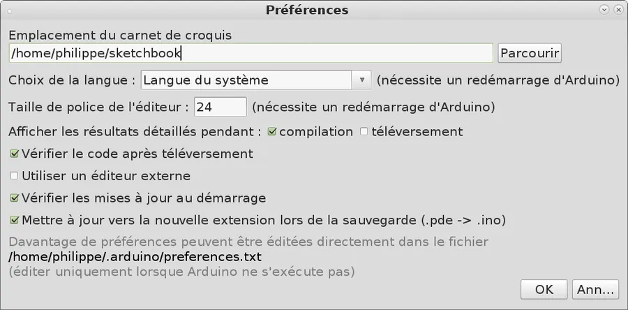
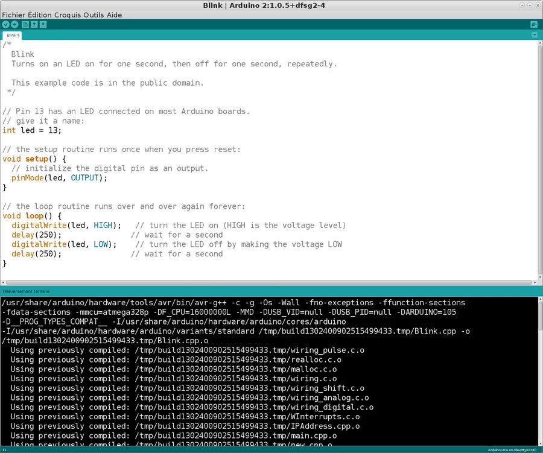
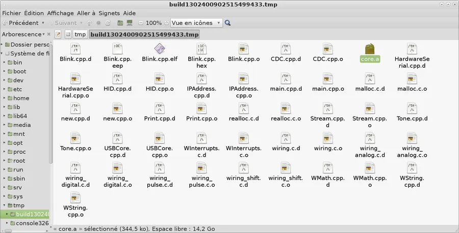

# C++ sur Arduino

## Introduction
Je suis dans une machine virtuelle Debian Jessie sous Mate (sous VMWare 12) et le but est de programmer un Arduino Uno en C++.

## Méthode 1 - Sans la library core

* Installation des logiciels nécessaires

```bash
sudo apt-get install gcc-avr binutils-avr gdb-avr avr-libc avrdude
```

* Test le port série (à travers le port USB). On voit qu'il faut appartenir au groupe `dialout` pour pouvoir l'utiliser.

```bash
ls -l /dev/ttyACM*
crw-rw---- 1 root dialout 166, 0 mars 27 23:20 /dev/ttyACM0
```

* Si besoin, ajouter le user courant au groupe `dialout`

```bash
sudo usermod -a -G dialout <username>
```

* Il faut fermer puis relancer la session pour que l'appartenance au groupe `dialout` soit effective.
* Ecrire un code C++.
* Ce dernier fait clignoter une led branchée sur la ligne 8 du port numérique.
* Pour éviter les branchements et faire clignoter la led du Arduino il faut écrire 0x05 dans ``DDRB`` et utiliser ``toggle(PORTB, 5)``.

```cpp
#include <avr/io.h>
#include <util/delay.h>

constexpr double BLINK_DELAY_MS = 500.0;

int main (void){
  // set pin 0 of PORTB (8-13) for output (1).
  DDRB = 0x01;

  const auto toggle= [](volatile unsigned char &p, const int bit){
    p ^= (0x01 << bit);
  };

  while(true) {
    toggle(PORTB, 0),
    _delay_ms(BLINK_DELAY_MS);
  }
}
```

* J'utilise `constexpr` et une fonction lambda afin d'utiliser du C++ "moderne" (au-delà de C++11) :
* Compilation et déploiement.

```bash
avr-gcc -O3 -DF_CPU=16000000UL -mmcu=atmega328p -c -std=c++1y -o led.o led.cpp
avr-gcc -mmcu=atmega328p led.o -o led
avr-objcopy -O ihex -R .eeprom led led.hex
avrdude -F -V -c arduino -p ATMEGA328P -P /dev/ttyACM0 -b 115200 -U flash:w:led.hex
```


## Méthode 2 - Avec la library core.a

* Installation du soft

```bash
sudo apt-get install arduino
```

* En fait, on en a besoin qu'une seule fois pour générer la libcore
* Lancer l'environnement.
* Aller dans préférences et checker la case "Afficher les résultats détaillés pendant la compilation"

<div align="center">

</div>


* Ouvrir l'exemple de base Blink. Brancher le Arduino. Compiler et déployer

<div align="center">

</div>


* Aller dans le répertoire temporaire où l'environnement a déposé les fichiers compilés et repérer `core.a`

<div align="center">

</div>


* Copier `core.a` dans le répertoire du projet
* Ecrire un code similaire à :

```cpp
#include "Arduino.h"

constexpr double BLINK_DELAY_MS = 500;
constexpr int PIN = 8; // put 13 to use the onboard Led

int main (){

 // Needed for uart, clock, timers etc.
 init();

 pinMode(PIN, OUTPUT);

 while(true) {
   digitalWrite(PIN, HIGH);
   delay(BLINK_DELAY_MS);
   digitalWrite(PIN, LOW);
   delay(BLINK_DELAY_MS);
 }
}
```

* Ne pas oublier d'invoquer `init()` en début de programme. Bien voir qu'il n'y plus qu'un seul header au début du code
* L'intérêt c'est que pour le coup, on peut "copier" toute ou partie de code de l'IDE Arduino.
* Déployer le code avec les instructions suivantes

```bash
avr-gcc -O3 -DF_CPU=16000000UL -mmcu=atmega328p -c -std=c++1y -I/usr/share/arduino/hardware/arduino/cores/arduino -I/usr/share/arduino/hardware/arduino/variants/standard -o led.o led.cpp
avr-gcc -mmcu=atmega328p led.o core.a -o led
avr-objcopy -O ihex -R .eeprom led led.hex
avrdude -F -V -c arduino -p ATMEGA328P -P /dev/ttyACM0 -b 115200 -U flash:w:led.hex
```

* On peut aussi essayer ces instructions

```bash
avr-gcc -c -g -O3 -Wall -std=c++1y -fno-exceptions -ffunction-sections -fdata-sections -mmcu=atmega328p -DF_CPU=16000000L -DUSB_VID=null -DUSB_PID=null -DARDUINO=105 -D__PROG_TYPES_COMPAT__ -I/usr/share/arduino/hardware/arduino/cores/arduino -I/usr/share/arduino/hardware/arduino/variants/standard -o led.o led.cpp
avr-gcc -mmcu=atmega328p led.o core. A -o led
avr-objcopy -O ihex -R .eeprom led led.hex
avrdude -F -V -c arduino -p ATMEGA328P -P /dev/ttyACM0 -b 115200 -U flash:w:led.hex
```

### Explications des paramètres
* -c compilation uniquement. Pas d'édition de liens
* -g : code en version debug (plus gros donc)
* -O3 : optimisation (je ne prends pas Os size)
* -Wall : warning à fond les ballons
* -std=c++1y : pour utiliser c++11, 14 etc. Avec un compilateur plus récent doit y avoir c++1z
* -fno-exceptions : Pas de support pour les exceptions
* -ffuntions-sections : Ne pas inclure les fonctions non utilisées
* -fdata-sections : Ne pas includre les données non utilisées
* -DUSB_VID=null : Je ne sais pas encore
* -DUSB_PID=null : Je ne sais pas encore
* -DARDUINO=105 : Ça doit vouloir dire UNO à mon avis
* -D__PROG_TYPES_COMPAT__ : Je ne sais pas encore

