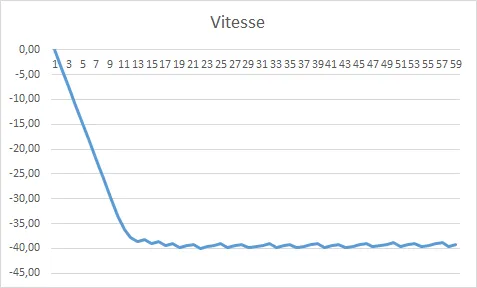

# Codingame C++ Niveau Easy
{: .no_toc }


{:.warning}
Cet article commence à dater (2015). La plupart des informations à propos des algorithmes doivent être toujours correctes mais il y a sans doute eu des évolutions dans le mauvais sens du côté de Codingame. Par mauvais sens je veux dire : vous empêcher de développer chez vous à votre rythme puis coller votre solution quand VOUS le souhaitez. Vous obliger à ne coder que sur leur plateforme, ne plus vous permettre de récupérer les jeux d'entrainement et les solutions pour travailler en autonome... J'espère me tromper mais il sera intéressant d'y retrouner de temps à autre et de vérifier si ce que je dis se réalise (ou pas) 🤞 


<!-- ###################################################################### -->
<!-- ###################################################################### -->
## Table of Contents
{: .no_toc .text-delta}
- TOC
{:toc}


<!-- ###################################################################### -->
<!-- ###################################################################### -->
## Introduction

Comme je l'ai dit dans un [billet précédent](), j'ai découvert la plateforme [Codingame](https://www.codingame.com/) en Janvier 2015. Bon, j'ai un job qui me prend pas mal de bande passante, une famille etc. Je ne peux donc pas m'y consacrer 24H/24H alors, les choses avancent doucement... Quoiqu'il en soit, je m'amuse comme un petit fou et je souhaite partager ici mes impressions de codage à propos de Codingame - Niveau Easy.

Il n'est pas question de publier les solutions (ce ne serait pas drôle sinon) mais juste de documenter ce qui m'a aidé, ce que j'ai appris etc. Je ne vais pas pouvoir tout mettre en une seule fois. J'ai donc l'intention de revenir régulièrement sur chaque code, de les peaufiner si besoin (et y a toujours matière à amélioration) et de mettre à jour mes notes au fur et à mesure ici. 

Donc bref, c'est normal si certains "challenges" ci-dessous ne sont pas encore commentés ou si il en manque. J'imagine que Codingame va continuer à ajouter des challenges et que moi à un moment, je vais lever le pied. 

J'espère qu'à terme il y aura d'autres pages pour les niveaux [Medium](), Hard etc.


<!-- ###################################################################### -->
<!-- ###################################################################### -->
## Onboarding

### Note
{: .no_toc }

Le 20/09/2015 je viens de réaliser que le challenge Onboarding est devenu beaucoup, beaucoup plus simple que celui qui était proposé il y a encore quelques mois. En effet il ne faut plus s'occuper d'une liste plus ou moins longue d’ennemis mais uniquement des 2 plus proches. Bref, tout ce que je dis plus bas n'est plus vraiment nécessaire. En plus, dans la doc du challenge y a carrément la solution... Bref c'est vraiment une mise en bouche. À titre indicatif voilà un code Javascript qui passe le test (oui oui j'avais dit que je ne donnais pas mes solutions mais là franchement on va pas très loin même avec le code source en main) :

```javascript
while (true) {
    var enemy1 = readline();             // name of enemy 1
    var dist1 = parseInt(readline());    // distance to enemy 1

    var enemy2 = readline();             // name of enemy 2
    var dist2 = parseInt(readline());    // distance to enemy 2

    if(dist1<dist2)
        print(enemy1);                   // To debug: printErr('Debug messages...');
    else
        print(enemy2);
}
```

### Billet original
{: .no_toc }

C'est le tout, tout premier "challenge". Y a vraiment rien de tordu. Je prends le parti de travailler avec mon [Visual Studio Community 2013](https://www.visualstudio.com/en-us/products/visual-studio-community-vs.aspx) préféré (depuis l'été dernier [2015] j'utilise l'excellentissime [Visual Sutdio Community 2015](https://www.visualstudio.com/products/visual-studio-community-vs)). Pour passer de Visual Studio à [Codingame](https://www.codingame.com/start) je fais simplement des copier/coller du code. Du point de vue du code je décide de tirer parti du C++11 et d'utiliser la STL au maximum afin d'éviter de ré-écrire ce qui existe déjà. "No raw loop". Si vous ne voyez pas de quoi je parle allez faire un tour sur : <https://channel9.msdn.com/Events/GoingNative/2013/Cpp-Seasoning>

Dans le code j'utilise une structure plutôt qu'une classe. En fait, la seule différence c'est que tout est public. Notez qu'il y a bien un constructeur dans la structure.

```cpp
struct enemy {
  int     dist;
  string  name;
  enemy(const int d=0, const std::string& n="") : dist(d), name(n) {}
};
```

Les valeurs par défaut (0 et "" ) que l'on retrouve dans le constructeur permettent d'avoir un default constructor. Ce dernier est nécessaire quand j'écris :

```cpp
vector<enemy> MyEnemies(2);                                                   // Vector with 2 elements
```

En effet ici on sait qu'on aura que les deux vaisseaux les plus proches à traiter donc autant en profiter pour "tailler" le vecteur à la bonne taille dès le départ.

Quand je dois remplir le vecteur j'utilise la forme suivante :

```cpp
MyEnemies.push_back({ dist, name });
```

Cela permet de créer à la volée un objet non nommé puis de le "pousser" dans le vecteur.

Même si j'ai un peu de mal avec la façon "pratique" de la saisir dans le code source (indentation etc.), pour le tri  décroissant du vecteur j'utilise une fonction lambda :

```cpp
sort(MyEnemies.begin(), MyEnemies.end(), [](const enemy &a, const enemy &b) {
      return a.dist > b.dist;                                                   // The value returned indicates whether the element passed as first argument is considered to go before the second
    });                                                                         // Elements are ordered in decreasing order.
```

Au final mon code fait 33 lignes. Cela permet d'estimer la complexité et/ou mes difficultés à trouver un algorithme. Il y a sans doute moyen de faire plus court si on utilise pas de vecteur ni de lambda. Par exemple j'ai un autre code très similaire à celui en Javascript ci-dessus qui ne fait que 19 lignes.


<!-- ###################################################################### -->
<!-- ###################################################################### -->
## Power of Thor

J'ai un angle qui est une valeur double. Je veux le convertir en une des 8 directions possibles que l'on va stocker dans la variable ThorCap qui doit varier de 0 à 7. Voilà ce que je fais :

```cpp
ThorCap = static_cast<int> (angle / (PI / 4.0));                          // convert from angle to 0...7
ThorCap = (ThorCap + 8) % 8;                                              // handle cases with negative angles
```

Le code fait 46 lignes.


<!-- ###################################################################### -->
<!-- ###################################################################### -->
## The Descent

J'ai un tableau (au sens C++11) de 8 éléments qui contient les hauteurs des montagnes.

```cpp
array<int, 8> Mounts;
```

Pour retrouver l'indice de la montagne la plus haute voilà ce que je fais :

```cpp
auto IndexOfMax = distance(Mounts.begin(), max_element(Mounts.begin(), Mounts.end()));
```

Mon code fait 25 lignes


<!-- ###################################################################### -->
<!-- ###################################################################### -->
## Skynet: the Chasm

Vraiment rien de particulier. J'ai envisagé d'utiliser une machine d'état mais bon, finalement un simple "if then else" a été suffisant.

Mon code fait 27 lignes


<!-- ###################################################################### -->
<!-- ###################################################################### -->
## Temperatures

Ce challenge est intéressant car c'est le premier qui propose des fichiers de test. Afin d'écrire un code qui soit le même que ce soit sur mon PC ou sur la plateforme Codingame voilà ce que je fais :

```cpp
#include <iostream>
#include <vector>
#include <algorithm>
#include <sstream>

#ifdef _MSC_VER
#include <fstream>
#endif

using namespace std;

int main() {

#ifdef _MSC_VER
  ifstream TestFile("Test2.txt", ios::in);
  if (!TestFile) return 1;
  cin.rdbuf(TestFile.rdbuf());                                                  // assign TestFile stream buffer to cin stream buffer
  //cin.tie(0);                                                                 // tied to cout by default. Not sure I understand what is done here.
#endif

  int N;                                                                        // the number of temperatures to analyse
  cin >> N; cin.ignore();
  ....................
```

Au début du code il faut juste remarquer l'inclusion de fstream. Le #ifdef permet au compilateur de déterminer si je suis dans Visual Studio ou non et de compiler ce qui va bien le cas échéant. Ensuite, tout en haut de la fonction main(), si je suis dans Visual Studio alors je "branche" le stream buffer du fichier de test sur celui de cin et le tour est joué. Le reste du code est identique!

Plus tard dans le code il faut séparer le contenu d'une ligne de caractères en entiers. Voilà ce que je fais :

```cpp
string Data;                                                                 // the N temperatures expressed as integers ranging from -273 to 5526
getline(cin, Data);

stringstream ss(Data);
vector<int> Temps;                                                            // load the temperatures in a vector
int item;
while (ss >> item)
  Temps.push_back(item);
```

On commence par lire la ligne entière. Ensuite on utilise cette dernière pour créer un stream (voir ss, un flux que l'on peut utiliser comme cin par exemple). Enfin, une simple boucle "tant que" permet de ventiler les groupes de caractères qui sont dans ss dans des entiers et de stocker ces derniers dans un vecteur.

Au lieu de la boucle while on peut aussi utiliser

```cpp
vector<int> Temps;                                                            // load the temperatures in a vector
stringstream ss(Data);
for (int item; ss >> item;) Temps.push_back(item);
```

Cette construction à l'avantage de ne déclarer la variable item que dans le bloc de code où elle est utilisée. Bon ben allez, soyons fous, simplifions encore l'usine à gaz de départ. Je propose :

```cpp
for (int item; cin >> item;) Temps.push_back(item);
```

C'est bien la preuve qu'il faut toujours revenir sur les constructions compliquées. Franchement, le méli mélo du départ... Pour lire des valeurs et les mettre dans un vecteur... Y avait anguile sous roche... La dernière proposition elle par contre semble honnête.

### Note
{: .no_toc }

Pour lire des entiers séparés par des espaces et les mettre dans un vecteur faut faire simple et utiliser le code suivant :

```cpp
for (int val; cin >> val;) MyVec.push_back(val);
```

Ensuite pour trier les valeurs des températures j'utilise, entre autres, une fonction lambda et j'écris :

```cpp
sort(Temps.begin(), Temps.end(), [](const int &a, const int &b) {             // The value returned indicates whether the element passed as first argument is considered to go before the second
  return abs(a) > abs(b);                                                     // temperature closest to 0. Two numbers equally close to zero => positive integer has to be considered closest to zero
});
```

Il faut remarquer qu'à l'instar de l'exemple précédent (Onboarding), la fonction lambda permet d'ajuster la fonction sort() à nos besoins. Ici on utilise les valeurs absolues des températures.

Mon code fait 27 lignes sans les #define _MSC_VER. Sinon il fait 35 lignes


<!-- ###################################################################### -->
<!-- ###################################################################### -->
## Mars Lander - Level 1

Autant avec le Mars Lander du niveau Medium j'ai eu du mal (et encore, je suis toujours pas satisfait de mon code) autant là... C'était un peu "fingers in the noze". En fait, après avoir remarqué le Lander tombait tout droit, je suis allé au plus simple en me disant qu'on verrait bien par la suite...

Pour le reste, je me suis aussi "amusé" à faire une version à base de [régulateur PID](http://www.ferdinandpiette.com/blog/2011/08/implementer-un-pid-sans-faire-de-calculs/). Pour ce faire il a fallu que je retrouve le modèle utilisé dans la simulation et pour cela j'ai utilisé une feuille Excel. Dans le graphe ci-dessous, la vitesse régulée oscille car on ne peut utiliser que des valeurs discrètes pour la puissance moteur. De plus, on ne peut pas passer de 1 à 4 en une fois. La feuille Excel doit faire en sorte que si on veut passer de 1 à 4, alors le moteur passe successivement par les puissances, 1, 2, 3 et 4. Enfin bref, voilà ce à quoi j'arrive :

<div align="center">

</div>


Au final j'arrive à réguler la vitesse de chute assez finement avec les paramètres Kp=3.5 Ki = -0.03 et Kd = 4.5. Le temps de descente est alors de 66 secondes et il reste plus de 300L de carburant à l'arrivée. Voilà le code utilisé pour implémenter le PID :

```cpp
while (true) {
  int X, Y, HS, VS, F, R, P;
  cin >> X >> Y >> HS >> VS >> F >> R >> P; cin.ignore();

  const auto Kp = 3.5;                                                        // PID based solution (66 sec)
  const auto Ki = -0.03;                                                      // Only works to regulate vertical speed without any horizontal speed
  const auto Kd = 4.5;                                                        // PID coef calcultated using Excel

  const auto TargetSpeed = -40.0;
  auto err = TargetSpeed - VS;
  auto err_diff = err - previous_err;
  previous_err = err;
  somme_err += err;
  auto cmd = err*Kp + somme_err*Ki + err_diff*Kd;

  cout << "0 " << clamp(static_cast<int>(cmd), 0, 4) << endl;
}
```

En version "naïve" le code fait 33 lignes alors que la version PID demande 50 lignes


<!-- ###################################################################### -->
<!-- ###################################################################### -->
## ASCII Art

Quand j'ai lu le cahier des charges, voilà ce que j'ai écrit dans la fonction main()

```cpp
int main() {

#ifdef _MSC_VER
  ifstream TestFile("Test2.txt", ios::in);
  if (!TestFile) return 1;
  cin.rdbuf(TestFile.rdbuf());                                                  // assign TestFile stream buffer to cin stream buffer
#endif

  ArtMaker ascii_art(cin);
  cout << ascii_art << endl;
}
```

J'aime bien commencer par écrire les fonctions de plus haut niveau, comme je veux, de façon "naturelle" puis me débrouiller ensuite dans les fonctions de plus bas niveaux (ou les objets) avec la syntaxe du langage pour faire en sorte que cela ressemble à ce que je veux. En gros ici j'ai un objet nommé ascii_art de type ArtMaker que je construis et zou, on en fait une sortie écran. Je passe le imput stream (cin) au constructeur ce qui me permet de "cacher la misère". Ensuite, bien sûr, il faut que je redéfinisse un opérateur "<<" pour la classe ArtMaker. Dans le constructeur j'utilise des transformations (transform()) afin d'éviter les raw loops. Exemple :

```cpp
string TxtLine;
getline(is, TxtLine);                                                         // get the text and transform it in upper case
transform(TxtLine.begin(), TxtLine.end(), TxtLine.begin(), ::toupper);

Word.resize(TxtLine.size());
transform(TxtLine.begin(), TxtLine.end(), Word.begin(), [](char i) {
  int c = i - 'A';                                                            // transform each letter of TxtLine into an index in the alphabet
  return (c >= 0 && c <= 25) ? c : kQM;                                       // if the letter belong to the alphabet then store the index otherwise store the index of '?' symbol
});
```

Je rappelle la définition de l'opérateur <<

```cpp
ostream& operator<<(ostream& os, const ArtMaker& obj) {

  // Sortie de l'objet obj sur le output stream os
  return os;
}
```

Le code fait 72 lignes


<!-- ###################################################################### -->
<!-- ###################################################################### -->
## Chuck Norris

Pour convertir les caractères en bit j'utilise un bitset. Au départ j'avais une usine à gaz. Un truc du style :

```cpp
for (const auto& c : Message) {                                               // convert the string of char in a string of bits
    ss << ((c & 64) >> 6);
    ss << ((c & 32) >> 5);
    ss << ((c & 16) >> 4);
    ss << ((c & 8) >> 3);
    ss << ((c & 4) >> 2);
    ss << ((c & 2) >> 1);
    ss << (c & 1);
  }
```

Comme je fais une fixette en ce moment sur "no raw loop" j'ai fini par utiliser le bitset. Voilà finalement comment à partir d'une chaine Message qui contient "CC" par exemple, j'obtiens une chaine BitMessage qui contient "10000111000011".

```cpp
string Message;
getline(cin, Message);
stringstream ss;
for (const auto& c : Message) ss << (bitset<7>) c;                            // convert the string of char in a string of bits. Char are coded on 7 bits
string BitMessage(ss.str()));
```

### Note
{: .no_toc }

Dans les boucles for autant utiliser "auto&" et "const auto&" selon que l'on modifie, ou pas, la valeur de la variable de la boucle ('c' ci-dessous) :

```actionscript3
for (const auto& c : Message){
  // c is not modified
}

for (auto& c : Message){
  // c might be modified
}
```

Plus loin dans le code, je dois sortir "00 " dans un cas et "0 " dans un autre. Au départ, j'avais une ligne de code du style :

```cpp
cout << ((CurrentBit == '0') ? "00 " : "0 ");                             // Short but not clear
```

C'est court, compact etc. mais je suis pas sûr de pouvoir me relire dans 6 mois. D'un autre côté les parenthèses autour de l'expression à sortir ne m’excite pas des masses non plus. Bref, je suis passé par une expression plus classique en 2 lignes.

```cpp
if (CurrentBit == '0') cout << "00 ";                                       // read a 0
else cout << "0 ";                                                          // read a 1
```

Dans une autre partie du code j'ai cherché un truc du style count_while. En fait j'ai pas trouvé. J'ai encodé la chose de la façon suivante :

```cpp
int n = 0;
while (it != BitMessage.end() && CurrentBit == *it) {                       // rely on the order of evaluation. DANGER !
  ++it;
  ++n;
}
```

En gros ça dit : tant que le prédicat  "CurrentBit==*it) est vrai et que l'on est pas arrivé au bout du conteneur BitMessage, alors incrémenter n. En fait je ne peux pas utiliser un count_if ou un count car ces derniers comptent tous les cas entre 2 iterators alors que moi ici je ne peux donner que l'itérateur de départ. Au pire allez faire un tour sur : <http://www.cplusplus.com/reference/algorithm/count_if/>

Histoire de faire un test j'ai écrit mon algorithme count_while() de la façon suivante

```cpp
template <class InputIterator, class T>
typename iterator_traits<InputIterator>::difference_type
count_while(InputIterator first, InputIterator last, const T& val) {
  typename iterator_traits<InputIterator>::difference_type ret = 0;
  while (first != last && *first == val) {
    ++ret;
    ++first;
  }
  return ret;
}
```

Dans le code je remplaçais la boucle tant que précédentes par le code ci-dessous :

```cpp
auto n = count_while(it, BitMessage.end(), CurrentBit);
it += n;
```

Dernière petite remarque. Je devais à un moment écrire n fois la caractère '0'. Une façon de le faire en une ligne et sans boucle consiste à écrire la chose suivante :

```cpp
cout << string(n, '0');                                                     // No loop. Print out n '0' where n is the # of digits in the block
```

Le code fait 42 lignes avec les #define _MSC_VER et 32 sinon. C'est sympa ça permet de tout avoir sur un seul écran :-)


<!-- ###################################################################### -->
<!-- ###################################################################### -->
## MIME Type

Pas grand chose à dire sur ce challenge. En ce qui me concerne j'ai utilisé une look up table (une map) pour y stocker les couples extension et type mime. Pour insérer les couples, j'utilise make_pair et voilà ce que cela donne :

```cpp
Lut.insert(make_pair(FileExt, MimeType));                                    // Lut = Look up table
```

Plus loin dans le code, la lecture des noms de fichiers, je n'utilise pas la variable NbFiles mais je met en place une simple boucle for du style :

```cpp
for (string FileName; getline(cin, FileName);) {                             // One file name per line.
    .....
}
```

Le code fait 44 lignes


<!-- ###################################################################### -->
<!-- ###################################################################### -->
## Defibrillators

Ici le truc le plus difficile a été de traiter les nombres réels à virgule. Voilà le tout début de mon code :

```cpp
#include <iostream>
#include <string>
#include <vector>
#include <algorithm>
#include <sstream>

#ifdef _MSC_VER
#include <fstream>
#endif

using namespace std;

template <class charT, charT sep>
class punct_facet : public numpunct < charT > {
  charT do_decimal_point() const { return sep; }
};

struct Description {
  int     Nb;
  string  Name;
  string  Adr1;
  string  Adr2;
  double  longitude;
  double  latitude;
  double  d;
};

int main() {

#ifdef _MSC_VER
  ifstream TestFile("Test4.txt", ios::in);
  if (!TestFile) return 1;
  cin.rdbuf(TestFile.rdbuf());                                                  // assign TestFile stream buffer to cin stream buffer
#endif

  cin.imbue(locale(cin.getloc(), new punct_facet<char, ','>));                  // transforms ',' into '.' when reading double

  double MyLongitude;
  cin >> MyLongitude; cin.ignore();

  double MyLatitude;
  cin >> MyLatitude; cin.ignore();
  ..........
```

Pour les ligne 39 et 42, que l'on soit avec des nombres réels à virgule ou à point rien ne change et c'est ça le plus important. Sur la console, on fait la lecture de réels à virgule (",") et on rempli deux variables de type double. Ceci dit, tout ceci n'est possible que par la ligne 36 qui elle même tire parti de la classe de la ligne 14.

Ensuite, quand il faut lire et décomposer (grâce aux points virgule) les chaines de caractères en différents champs du type Description (Nb, Name...) j'utilise grosso- modo la structure suivante :

```cpp
int k=0;
while (getline(ss1, Field, ';')) {                                          // the line is tokenized. Pay attention at the third parameter

      stringstream ss2(Field);                                                  // allows to use >> to transform string to double even if we have ',' instead of '.'
      ss2.imbue(locale(ss2.getloc(), new punct_facet<char, ','>));              // transforms ',' into '.' when reading double

      switch (k) {
        case 0:
          CurrentSpot.Nb = stoi(Field);
        break;

        case 1:
          CurrentSpot.Name = Field;
        break;

        //........

        case 5:
          ss2 >> CurrentSpot.latitude;
        break;
      }
      ++k;
    }
    //........
}
```

En français dans le texte ça dit : "à partir du string stream ss1, rempli le champ Field. Arrête toi quand tu vois un ';'. Ensuite débrouille toi avec les ponctuations mais met dans ss2 un truc avec des points si jamais il a des virgules. Enfin, en fonction de la valeur de k (k représente l'indice du champ qu'on est en train de dispatcher dans la structure. Au départ il vaut zéro et il est incrémenté à chaque fois qu'on alimente l'un des champs) on alimente tel ou tel champs de la structure CurrentSpot qui est de type Description. Bien voir le ++k à la ligne 21.

Dans la suite du code, on peut remarquer que l'on est pas obligé de faire le calcul complet de la distance. En effet, on va juste comparer ces dernières entre elles. Dans mon cas, j'ai écrit quelque chose qui ressemble à :

```cpp
CurrentSpot.d = x*x + y*y;
```

J'évite la racine carré et la multiplication par 6371

Dernier point. Afin de trouver le spot le plus proche, au lieu d'utiliser une boucle for sur le vecteur qui contient tous les spots qui ont été trouvés à partir de la console, j'utilise l’algorithme "min_element" avec une fonction lambda. Cela permet vraiment d'avoir un code plus court et de s’appuyer complètement sur la STL. Voilà ce que j'ai écris :

```cpp
auto Spot = min_element(Spots.begin(), Spots.end(), [](Description spot1, Description spot2) {
  return spot1.d < spot2.d;
});
cout << Spot->Name << endl;
```

Le code fait 97 lignes au final


<!-- ###################################################################### -->
<!-- ###################################################################### -->
## Horse-racing Duals

Je veux pas être prétentieux mais au début j'ai pas trop compris ce que faisait là ce problème. Ça paraissait trop simple... Ceci dit, cela m'a donné l'occasion de jouer encore une fois avec la fonction transform() mais avec des reverse iterators ce coup-ci. Bref, je me suis encore bien amusé. Allez, je craque... Voilà le code initial qui passait tous les tests et la validation finale :

```cpp
#include <iostream>
#include <vector>
#include <algorithm>

using namespace std;

int main() {
  int N;
  cin >> N; cin.ignore();

  vector<int> Strengths;
  for (int s; cin >> s;) Strengths.push_back(s);

  sort(Strengths.begin(), Strengths.end());                                     // ascending order

  auto LowestDiff = numeric_limits<int>::max();
  auto tmp = Strengths.begin();
  for (auto it = Strengths.begin() + 1; it != Strengths.end(); ++it) {
    auto diff = *it - *tmp;
    if (diff < LowestDiff) LowestDiff = diff;
    tmp++;
  }
  cout << LowestDiff << endl;
}
```

Jusqu'à la ligne 12 ça doit aller. Notez quand même la boucle for de la ligne 12 et la localité de la variable "s". C'est une construction que j'utilise de plus en plus. Ensuite on nous demande de  retrouver la plus petite différence entre 2 chevaux... Je me dis que ce qui serait bien cool ce serait de faire la différence entre les valeurs du vecteur puis de retrouver la plus petite. Je commence donc par ordonner par ordre croissant le contenu du vecteur Strengths (ligne 14).

Par la suite j'utilise une bonne vieille boucle for pour parcourir le vecteur Strengths et calculer la plus petite des différence entre 2 chevaux.

Ensuite, pour "améliorer les choses" et supprimer la "grosse boucle for" (remember, "no raw loops") je suis arrivé au code ci-dessous qui passe les 3 tests préliminaires :

```cpp
#include <iostream>
#include <vector>
#include <algorithm>

using namespace std;

int main() {
  int N;
  cin >> N; cin.ignore();

  vector<int> Strengths;
  for (int s; cin >> s;) Strengths.push_back(s);

  sort(Strengths.begin(), Strengths.end());                                     // ascending order

  transform(Strengths.rbegin(), Strengths.rend() - 1, Strengths.rbegin() + 1, Strengths.rbegin(), [](int i, int j) {
    return i - j;                                                               // attention. Read the doc of transform when using 4 iterators
  });

  auto LowestDiff = min_element(Strengths.begin() + 1, Strengths.end());
  cout << *LowestDiff << endl;
}
```

A partir de la version précédente du code je me dis que les données étant triées y a qu'à faire la différence entre la dernière valeur et l'avant dernière et stocker le résultat à l'endroit où l'on avait la dernière valeur puis de réitérer... Bien sûr faudra s'arrêter à l'indice 1 et surtout pas aller au delà. Là il a fallu que je lise et relise la doc de [transform](http://www.cplusplus.com/reference/algorithm/transform/)(). Je sais pas pourquoi je faisais pas attention et je me plantais toujours avec le 4eme iterator. Afin de partir de la fin du vecteur j'utilise rbegin() et rend(). Là aussi faut être précis avec les +1 et les -1.

Petite remarque : En fait on est pas vraiment obligé de commencer par la fin. On peut tout à fait parcourir le vecteur "dans le bon sens" comme le montre le code ci-dessous.

```cpp
transform(Strengths.begin(), Strengths.end()-1, Strengths.begin() + 1, Strengths.begin(), [](int i, int j) {
    return j-i;                                                               // attention. Read the doc of transform when using 4 iterators
  });
```

Cette version offre l'avantage d'être plus rapide que la précédente. En mode Debug, le second code tourne en 660 ms contre 990 ms pour le premier. En mode Release on est respectivement à 117 ms et 125 ms. Là, à mon avis faudrait vraiment plus de données à "mâchouiller" pour voir une différence.

Enfin, on termine avec l’invocation de la fonction min_element() afin de retrouver la plus petite différence dans le vecteur Strengths. Bien sûr, on ne part pas de l'indice 0 mais de l'indice 1 car nous n'avons pas stocké de différence à l'indice 0.

Super! Tu parles... Le code passe bien les 3 premiers tests mais il ne passe plus les tests de validation. Avec la version qui utilise begin() et end() le code ne fonctionne plus quand la plus petite différence est entre les 2 premiers chevaux et il ne marche plus non plus quand il n'y a que 2 chevaux. A ben bravo... On fait moins le fanfaron...

Plus sérieusement, on l'a dit précédemment (sans y prêter trop d'attention) y a deux petits trucs qui sont limite, limite et qui bien sûr ne passent pas à la validation finale

1. Le fait que transform() ne touche pas toutes les cellules du vecteur Strengths
2. Le min_element() qu'on fait partir à l'indice 1 et pas à l'indic 0

Pour corriger le tir sur la toute dernière version qui va dans le bon sens du vecteur je propose les 2 modifications suivantes :

```cpp
#include <iostream>
#include <vector>
#include <algorithm>

using namespace std;

int main() {
  int N;
  cin >> N;; cin.ignore();

  vector<int> Strengths;
  for (int s; cin >> s;) Strengths.push_back(s);

  sort(Strengths.begin(), Strengths.end());                                     // ascending order

  transform(Strengths.begin()+1, Strengths.end(), Strengths.begin(), Strengths.begin(), [](int i, int j) {
    return i-j;                                                               // attention. Read the doc of transform when using 4 iterators
  });
  *(Strengths.end() - 1) = *(Strengths.end() - 2);

  auto LowestDiff = min_element(Strengths.begin(), Strengths.end());
  cout << *LowestDiff << endl;
}
```

A la ligne 19, je rempli "à la main" la dernière cellule du vecteur avec la valeur de l'avant dernière cellule. Ensuite, puisque du coup toutes les cellules ont été touchées à la ligne 21 on fait en sorte que min_element() couvre bien toutes les cellules de begin() à end(). Après ces 2 modifications, le code n'a pas de raw loop et passe bien tous les tests.

Ceci dit... cette histoire de transform et de lambda pour faire "i-j" ne m'enchente pas des masses et je suis persuadé que l'on peu faire encore plus simple. Bingo, "numeric" nous propose une fonction prête à l'emploi. Le code devient finalement :

```cpp
#include <iostream>
#include <vector>
#include <algorithm>
#include <numeric>

int main() {

  int N;
  std::cin >> N;
  std::vector<int> Strengths;
  for (int s; std::cin >> s;) Strengths.push_back(s);
  std::sort(Strengths.begin(), Strengths.end());                                     // ascending order
  std::adjacent_difference(Strengths.begin(), Strengths.end(), Strengths.begin());
  std::cout << *min_element(Strengths.begin(), Strengths.end()) << std::endl;
}
```

Morale de l'histoire :

* il vaut mieux rester humble devant les challenges
* y a toujours moyen de revenir sur un source pour améliorer un truc.

Faut pas être très malin pour constater qu'au final le code fait 15 lignes

