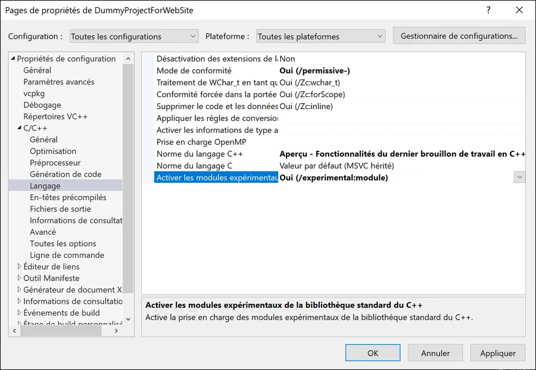

# C++20 with Visual Studio

We are in May 2021 and my version of Visual Studio Communitiy is 16.9.5

<div align="center">

</div>


Launch Visual Studio Installer

<div align="center">

</div>


Make sure **C++ Modules for v142 build tools** are also installed

<div align="center">

</div>


Launch Visual Studio and create an empty project

<div align="center">

</div>


Add a main.cpp file to the project and paste the following lines into the the source code

```
import std.core;

int main() {
	std::cout << "Grettings Professor Falken" << '\n';
}
```

Note that there are no include file. For information, here are the main modules to include:

* std.core module provides most of the content of the C++ Standard Library
* std.regex: the content of header <regex>
* std.filesystem: the content of header <filesystem>
* std.memory: the content of header <memory>
* std.threading: the contents of headers <atomic>,  <condition_variable>,<future>, <mutex>, <shared_mutex>, <thread>

Highlight the project name in Solution Explorer and hit ALT+ENTER to access its properties. Make sure /MD and /EHsc are selected. To do so, select the C/C++ category then the Code generation option. Make sure properties are set for all platforms. If the Runtime library says something like "multiple option" select Debug or Release in the Configuration list box. In Debug mode you should select /MDd and /MD otherwise.

<div align="center">

</div>


In the Language subcategory make sure that "Preview..." is selected in the "C++ Norm" option and that the "Experimental Modules" are activated (see below). In the next picture, note that the Configuration and Platform options are set to "all configurations" and "all platforms".

<div align="center">

</div>


At this point we should be good to go. One last thing... Just to make sure our directory doesn't become a mess... Again, make sure Configuration and Platform options are set respectively to "all configurations" and "all platforms". Then in the General group of properties, update the Output directory and Intermediate directory as below:

```
Output Directory        : $(SolutionDir)build\$(Platform)$(Configuration)\
Intermediate directory  : $(SolutionDir)build\intermediate\$(Platform)$(Configuration)\

```

<div align="center">

</div>


Click Apply then OK. When you're back in the IDE, select Debug and x64.

<div align="center">

</div>


Hit F5. Welcome in a brand-new world!

<div align="center">

</div>


Hopefully, the solution directory should not be too messy. Below the build directory contains all the files and directories generated during the builds.

<div align="center">

</div>


At this point I would recommend saving this project as a template. This will speed up the start of your next C++20 project. To do so, select the Project menu then the "Export Template..." option. Then, follow the instructions and fill the dialog boxes. You can even add your own icon.

<div align="center">

</div>


Later, a ready to use project will be available. See below the Cpp20 template for example.

<div align="center">

</div>
