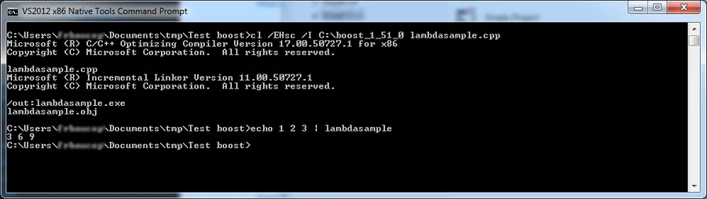
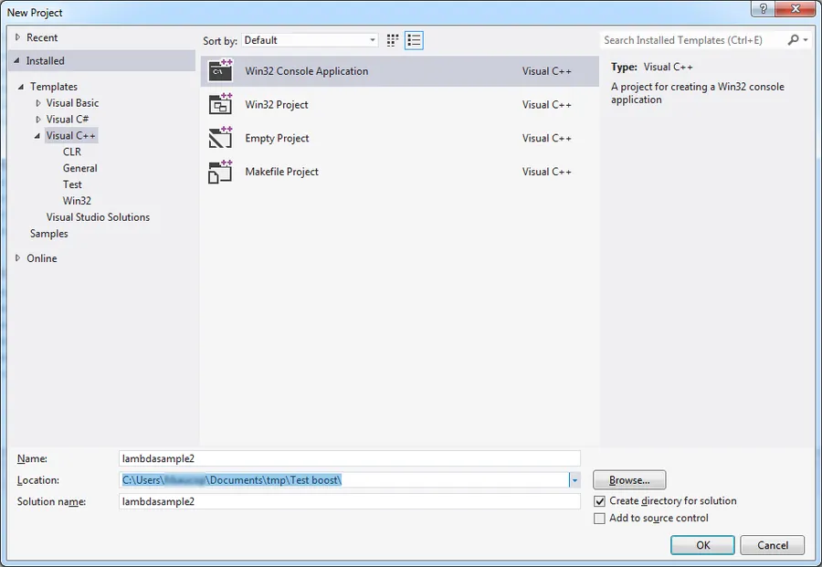
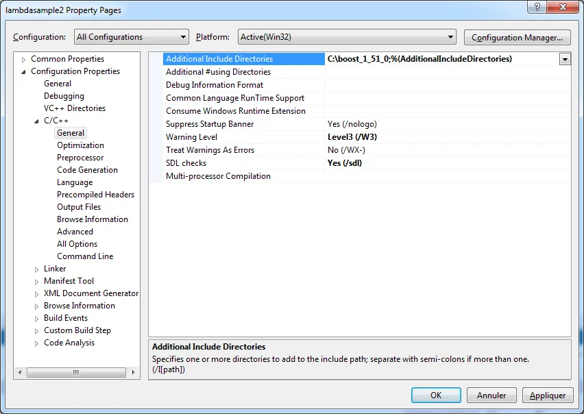
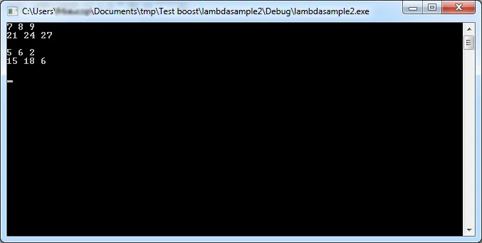
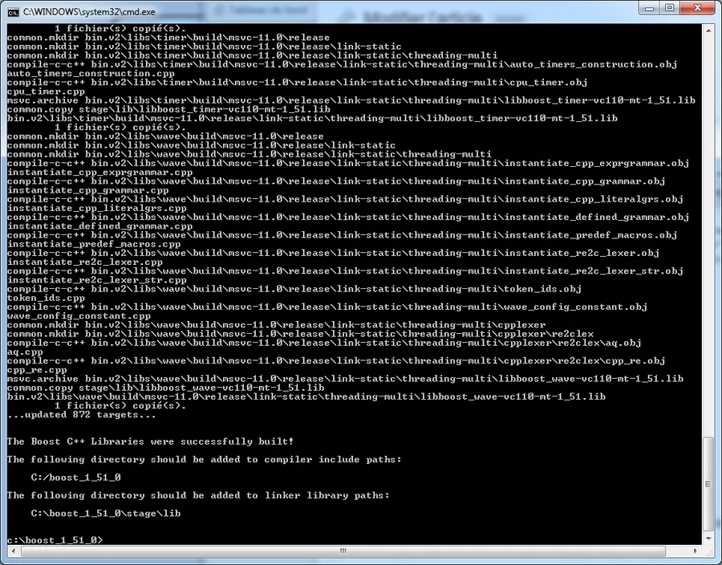
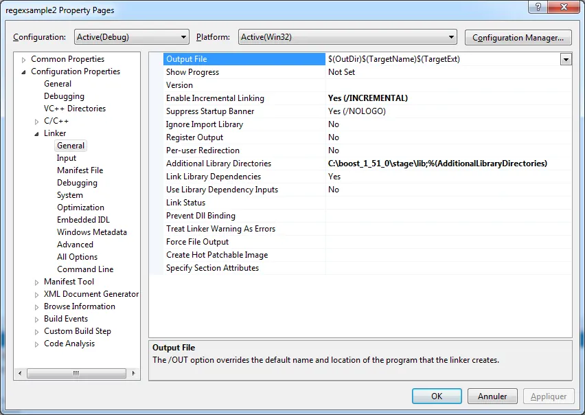
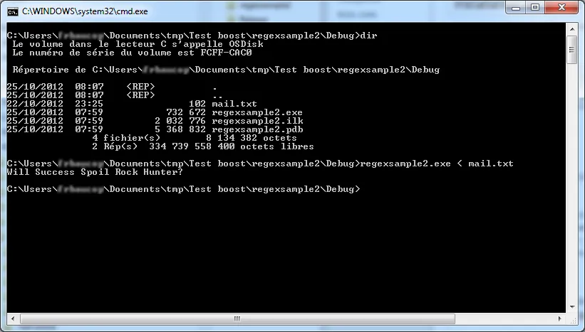
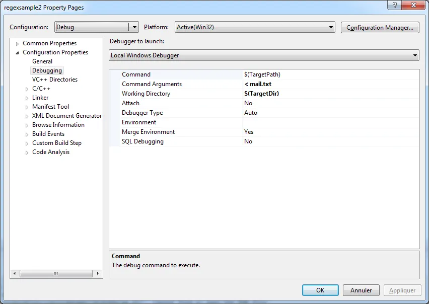
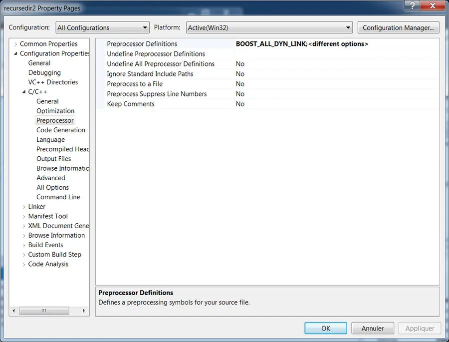
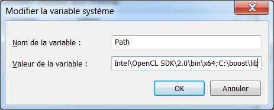

# Installation de Boost

# Introduction
Si vous êtes pressé, lisez [l'update](#update-remarques-et-notes-finales) de l'installation de Boost qui se trouve tout à la fin de ce billet.

Je suis sous Windows 7 64 bits, j'utilise Microsoft Visual Studio Express 2012 for Windows Desktop et la version courante de boost est 1.51.0. Je m'appuie sur le Getting Started officiel de Boost mais je m'adapte à ma configuration et je mets le tout en français.

Il faut récupérer la dernière version de boost (ici boost_1_51_0) sur le site <http://www.boost.org/>

Dans le répertoire Téléchargements de Windows il faut dézipper la bête (79 Mo) dans un répertoire "boost_1_51_0" par exemple. Ça prend 3 plombes et au final le répertoire fait 420 Mo sur le disque.

A l'intérieur il y a encore un répertoire "boost_1_51_0". Il faut déplacer ce dernier directement sous la racine du disque dur. Il est peut être malin à ce stade de renommer le répertoire "c:\boost_1_51_0" en "c:\boost". Comme ça la prochaine fois, quand vous mettrez Boost à jour, du point de vue de vos projets rien n'aura changé.


## Premier test en ligne de commande

Je suppose que j'ai créé un répertoire C:\Users\moi\Documents\tmp\Test boost. Copiez le code ci-dessous et collez-le dans un fichier nommé lambdasample.cpp (à sauver dans le répertoire "Test boost" précédent) :

```cpp
#include <boost/lambda/lambda.hpp>
#include <iostream>
#include <iterator>
#include <algorithm>

int main(){
  using namespace boost::lambda;
  typedef std::istream_iterator<int> in;

  std::for_each(in(std::cin), in(), std::cout << (_1 * 3) << " " );
}
```

Lancez une console Visual Studio (pas une console Windows classique). La console Visual Studio se trouve dans :

```
Démarrer/Tous les programmes/Microsoft Visual Studio 2012/Visual Studio Tools/VS2012 x86 Native Tools Command Prompt
```

Allez dans le répertoire TestBoot et tapez :

```powershell
cd  C:\Users\moi\Documents\tmp\Test boost
```

Compilez le code avec la commande suivante :

```bash
cl /EHsc /I C:\boost_1_51_0 lambdasample.cpp
```

Normalement ça compile et ça link. À la fin on a un fichier lambdasample.exe dans le répertoire dans lequel on est. A l'invite, dans la console, tapez :

```powershell
echo 1 2 3 | lambdasample
```

En sortie, on obtient  :

```bash
3 6 9
```

La console devrait ressembler à ce qui suit :

<div align="center">

</div>


## Second test avec l'environnement Visual Studio

Lancez Visual Studio Express 2012. Cliquez sur "New Project" puis choisir "C++" et "Win 32 Console Application". Voilà les paramètres que j'utilise :

* Name : lambdasample2
* Location : C:\Users\moi\Documents\tmp\Test boost\
* Solution Name : lambdasample2

Cliquez sur OK

<div align="center">

</div>


Laisser les autres options par défaut

Quand le projet est à l'écran :

1. Faire ALT+F7 pour faire apparaître les propriétés du projet
2. Cliquer sur All Configurations dans Configuration (en haut à gauche de la fenêtre)
3. Modifier C++/General comme suit (regardez bien le champs "Additional Includes Directories")

<div align="center">

</div>


Copier le code source précédent. Au final dans l'éditeur on doit contenir le source suivant :

```cpp
#include "stdafx.h"

#include <boost/lambda/lambda.hpp>
#include <iostream>
#include <iterator>
#include <algorithm>

int main(){
  using namespace boost::lambda;
  typedef std::istream_iterator<int> in;

  std::for_each(in(std::cin), in(), std::cout << (_1 * 3) << " " );
}
```

On pourrait aller plus loin et avoir un code qui ressemble à :

```cpp
#include "stdafx.h"

int main(){
  using namespace boost::lambda;
  typedef std::istream_iterator<int> in;

  std::for_each(in(std::cin), in(), std::cout << (_1 * 3) << " " );
}
```

Ceci dit, dans ce cas il faut que le fichier stdafx.h ressemble à :

```cpp
#pragma once

#include "targetver.h"

//#include <stdio.h>
//#include <tchar.h>
#include <boost/lambda/lambda.hpp>
#include <iostream>
#include <iterator>
#include <algorithm>
```

Quand les code sources sont corrects il faut lancer la compilation et l'édition de liens en appuyant F7.

Pour tester le programme il faut appuyer sur F5. Quand la console est à l'écran on rentre plusieurs chiffres séparés par un espace et on tape sur ENTER. Pour arrêter le programme il faut faire CTRL+Z.

<div align="center">

</div>


Pour passer en mode Release il suffit de choisir Release dans Solution Configurations et relancer le build avec F7.

Histoire de varier les plaisir on peut cliquer droit sur "Solution 'lambdasample2' (1 project)" tout en haut de la fenêtre "Solution Explorer" (à droite de l'IDE) et choisir l'option "Open Folder in File Explorer". Ensuite, cliquer sur le répertoire Release puis enfin double cliquer sur lambdasample.exe (qui ne fait plus que 12 ko).

## Construction des bibliothèques Boost

Ouvrir une console MSVC

Se déplacer dans le répertoire :

```bash
c:/boost_1_51_0
```

Taper :

```bash
bootstrap.bat
```

Taper enfin :

```bash
.\b2
```

Ca prend un bon moment (15 min) mais à la fin on retrouve toutes les bibliothèques dans le répertoire :

```bash
C:\boost_1_51_0\stage\lib
```

Attention il faut bien comprendre qu'on a généré toutes les bibliothèques possibles : statiques, dynamique, en mode release, debug, en multithread, sans multithread...

Voilà à quoi doit ressembler la console à la fin de la compilation :

<div align="center">

</div>


## Test avec les bibliothèques statiques de boost dans Visual Studio

Dans Visual Studio

1. Cliquer sur New Project.
2. Choisir C++
3. Choisir Win 32 Console Application

Voilà les paramètres que j'utilise :

* Name : regexsample2
* Location : C:\Users\moi\Documents\tmp\Test boost\
* Solution Name : regexsample2

Cliquer sur OK et laisser les autres options par défaut.

Comme précédemment il faut prendre en compte le répertoire des fichier header de boost

1. ALT+F7
2. Cliquer sur All Configurations dans Configuration (en haut à gauche)
3. Modifier C++/General
4. Ajouter au champs Additional Includes Directories le répertoire c:\boost_1_51_0\stage\lib

Il faut de plus prendre en compte le répertoire des bibliothèques Boost. On peut s'inspirer de ce qui suit. Faire attention au champs "Additional Library Directories" :

<div align="center">

</div>


Au niveau du source copier-coller le code suivant :

```cpp
#include "stdafx.h"

#include <boost/regex.hpp>
#include <iostream>
#include <string>

int main(){

  std::string line;
  boost::regex pat( "^Subject: (Re: |Aw: )*(.*)" );

  while (std::cin){
        std::getline(std::cin, line);
        boost::smatch matches;
        if (boost::regex_match(line, matches, pat))
            std::cout << matches[2] << std::endl;
  }
}
```

On peut construire l'application en mode debug en appuyant sur F7. Afin de tester l'application en mode debug on peut rapidement éditer et sauver dans le répertoire "C:\Users\moi\Documents\tmp\Test boost\regexsample2\Debug" le fichier texte suivant :

```
To: George Shmidlap
From: Rita Marlowe
Subject: Will Success Spoil Rock Hunter?
---
See subject.
```

Ensuite il faut :

1. Cliquer droit sur "Solution 'regsample2' (1 project)"
2. Choisir l'option "Open Folder in File Explorer"
3. Cliquer sur le répertoire Debug
4. CTRL+SHIFT+Click Droit sur le répertoire Debug et choisir l'option "Ouvrir un fenêtre de commandes ici"

Taper alors :

```bash
regexsample2.exe < mail.txt
```

<div align="center">

</div>


Ceci dit, on peut faire mieux et éviter de quitter MSVC. Pour cela il faut éditer les options du projet (ALT+F7) et modifier "Command Arguments" et "Working Directory" comme suit. Pour le Working Directory le mieux est d'utiliser les macros qui sont à notre disposition :

<div align="center">

</div>


Avant de lancer l'application en mode Debug il faut penser à poser un point d'arrêt sur la toute dernière ligne car sinon la console de l'application disparaît et on ne voit rien.

Pour faire la même chose en mode Release il faut surtout pas oublier de copier le fichier mail.txt dans le répertoire Release (sinon on perd du temps à se demander pourquoi ça ne marche pas... Ça sent le vécu :-) )

**Attention**. Faut bien comprendre qu'ici on a utilisé les bibliothèques Boost en version statiques. En fait tout le monde à l'air de préférer la méthode dynamique car les bibliothèques de Boost sont de toutes façon liées dynamiquement aux DLLs qu'elles utilisent. Voir l'update ci-dessous.


<!-- <a id="update"></a> -->
## Update, remarques et notes finales 

Je le fais en mode télégraphique. Sous entendu, vous avez lu les paragraphes ci-dessus et/ou vous savez de quoi on parle. Récupérer une version .7z de Boost (2 fois plus petite que la version .zip) dans le répertoire "Mes Téléchargements" par exemple.

Ensuite la dézipper à la racine du disque dur. Par exemple, chez moi, à la fin j'ai un répertoire c:/boost_1_54_0. Enfin renommer le répertoire en "boost" (on a donc c:/boost)

Lancer une console MSVC et aller dans c:/boost et lancer la commande :

```powershell
bootstrap.bat
```

Ensuite lancer la commande :

```powershell
bjam -j8 threading=multi variant=release,debug link=shared --prefix="c:/boost" --without-python --without-mpi install
```

L'opération prend du temps. Même avec 8 coeurs qui toutnent à 100%. Y a pas mal de copies et de fichiers créés dans c:/boost/lib. Ici on ne fait que créer les DLLs et les lib d'importation en mode debug et release. Après les compilations et avant nettoyage chez moi, c:/boost fait 2.01 Go et contient 54 598 fichiers

Pour nettoyer, après le build précédent on peut utiliser la commande suivante :

```
bjam -j8 threading=multi variant=release,debug link=shared --prefix="c:/boost" --without-python --without-mpi clean
```

Après nettoyage c:/boost fait : 662 Mo 4 889 fichiers

On se retrouve avec les lib d'importation et les DLLs dans **c:/boost/lib** et les headers dans **c:/boost/include/...** et il faudra en tenir compte dans MSVC. De plus, il ne faut pas oublier que dorénavant on a que des DLLs (avant on avait demandé à tout compiler : lib statiques, dynamiques etc.). Dans MSVC va falloir en tenir compte aussi.

Je passe les détails. MSVC, new project. Ajouter un code source qui utilise RegEx ou FileSystem par exemple. Dorénavant il faut faire :

* ALT + F7 - C/C++ - General - All Configurations - Additional Include directories - c:/boost/include/boost-1_54
* ALT + F7 - Linker - General - All Configurations - Additional Library Directories - c:/boost/lib
* ALT + F7 - C/C++ - Preprocessor - All Configurations -  Ajouter "**BOOST_ALL_DYN_LINK** " dans Preprocessor Definitions

<div align="center">

</div>


Pensez à vérifier que les flags /MD et /MDd sont bien utilisés en mode release et debug respectivement (ALT + F7 - C/C++ - Code Generation - Runtime Library). Ensuite on compile et on link. Ca doit passer.

Ceci dit à l'exécution l'environnement peut indiquer que le programme ne peut pas s'exécuter car il ne trouve pas telle ou telle DLL de Boost. Il faut que ces dernières soient à côté de l'exécutable et/ou mieux dans un chemin connu de l'OS. Un moyen simple est de changer le PATH système (Démarrer, Ordinateur, click droit, Propriétés, Modifier les paramètres, Paramètres systèmes avancés, Variables d'environnement, éditer "Path" dans la liste déroulante "Variables Système" en ajoutant ";C:\boost\lib").

<div align="center">

</div>


Quand ce sera fait vous pourrez alors lancer vos exécutables dans la joie et la bonne humeur. Au moment du déploiement faudra bien penser à distribuer les DLLs de Boost).


## Notes à propos du passage sous Windows 8

On est le 20 décembre 2014. Mon portable a maintenant un disque SSD, je suis sous Win 8.1 et j'utilise [Visual Studio Community 2013](http://www.visualstudio.com/products/visual-studio-community-vs) qui est une vraie réussite. Entre temps Boost est passé à la version 1.57. Après le download le zip fait dorénavant 107 904 kB et le 7z fait 55 984 kB.

Lors du unzip j'ai changé le répertoire cible et je déploie le tout dans un répertorie du style : C:\Users\MonNom\Documents\Perso\C++

En fait c'est dans ce répertoire que je met les trucs sur lequel je "m'amuse" en C++. L'idée c'est d'éviter d'avoir boost sous la racine du disque dur.

Pour lancer une console MSVC 32 bit, je retourne sur la page d’accueil de Windows et dans le groupe Microsoft Visual Studio 2012, je lance VS2012 x86 Native Tools Command... et bien sûr je me déplace dans le répertoire C:\Users\MonNom\Documents\Perso\C++\boost

Pour information, au départ le répertoire occupe 468 MB sur le disque et contient 44 241 fichiers.
Je tape la commande :

```powershell
bootstrap.bat
```

Ensuite je tape la commande :

```powershell
b2 -j4 threading=multi variant=release,debug link=shared --prefix="C:\Users\MonNom\Documents\Perso\C++\boost" --
without-python --without-mpi install
```

Au passage mon PC à perdu 4 cœurs (il en reste 4, voir le paramètre "j" dans la ligne de commande) et bien sûr je met à jour le paramètre "prefix" avec le répertoire de destination.

A la fin, le répertoire boost occupe 1.54 GB sur le disque et contient 56 709 fichiers.

Pour nettoyer je lance

```powershell
b2 -j4 threading=multi variant=release,debug link=shared --prefix="C:\Users\MonNom\Documents\Perso\C++\boost" --without-python --without-mpi clean
```

À ce moment le répertoire occupe 659 MB sur le disque et contient 55 840 fichiers.

Dans Visual Studio, faut pas oublier de paramétrer le projet de test :

* ALT + F7 - C/C++ - General - All Configurations - Additional Include directories - C:\Users\MonNom\Documents\Perso\C++\boost\include\boost-1_57
* ALT + F7 - Linker - General - All Configurations - Additional Library Directories - C:\Users\MonNom\Documents\Perso\C++\boost\lib
* ALT + F7 - C/C++ - Preprocessor - All Configurations -  Ajouter "**BOOST_ALL_DYN_LINK** " dans Preprocessor Definitions

Si besoin il faut modifier le path : Ecran d’accueil de Win 8.1, click droit sur l'icône "Ce PC", Propriétés, Paramètres systèmes avancés, Variables d'environnement, éditer le paramètre "Path" de la liste déroulante "Variables Système" en ajoutant ";C:\Users\MonNom\Documents\Perso\C++\boost\lib". Ne pas oublier le ";" comme séparateur. Quand c'est fait, il faut redémarrer Visual Studio.

## PS :

* Je confirme, b2 ou bjam c'est pareil (je le met là car j'ai pas mal cherché avant d'en être sûr à 100%).
* Ne pas oublier qu'il y a une version "binary ready" disponible. C'est peut être plus simple à utiliser. Faut juste dézipper dans c:\boost et zou ça roule. (<http://sourceforge.net/projects/boost/files/boost-binaries/>)
* Si besoin, pour plus d'infos (zlib, ICU, Expat...) allez lire : <http://shoddykid.blogspot.fr/2008/07/getting-started-with-boost.html>

