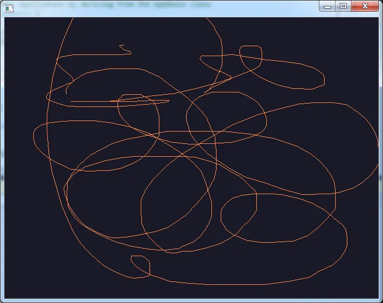

<!-- # Compiler Cinder 0.85 - Visual Studio 2013 & Boost 1.55 -->
# Compiler Cinder avec MSVC Boost

## Introduction

Je crois que tout est dans le titre... En fait, ce qui s'est passé, c'est que tout fonctionnait bien sous Visual Studio Express 2012 mais quand la version de Visual Studio Express 2013 est sortie, je me suis jeté dessus et comme je n'avais pas gardé la version 2012 sur mon disque dur, je me suis retrouvé coincé. En effet, quand on essaie de faire marcher les exemples de Cinder, plus rien ne passe car la bibliothèque n'a pas été compilée avec le bon compilateur (2012 vs 2013). Il faut donc recompiler Cinder avec Visual Studio 2013 mais comme elle s'appuie à son tour sur la bibliothèque Boost et bien... Il faut compiler Boost en espérant que tout se passe bien...

Pour être honnête je m'y suis pris à 2 fois. Au début rien ne marchait et je ne voyais pas/plus ce qui se passait. Alors ? Alors j'ai laissé tomber. Je suis passé à autre chose pendant une ou deux semaines et puis là, ce soir, en reprenant tout depuis le début dans le calme et une "zennitude" proche de celle qu'on trouve dans un monastère... Tadam!... Ça fonctionne. Je vous rassure, il n'y a rien de magique dans tout ça et je vais prendre un peu de temps pour vous expliquer la méthode pas à pas.

Attention, il y a quand même un certain nombre de choses que je suppose. Par exemple, je n'explique pas ce qu'est la bibliothèque Cinder. Au pire allez voir [cette vidéo](https://channel9.msdn.com/Series/cplusplus-language-library/07#time=00h02m40s) aux environs de t=7:30 min ou bien encore [celle là](http://channel9.msdn.com/Events/GoingNative/2013/Keynote-Herb-Sutter-One-Cpp) aux environs de t=1h01 min. et finissez en faisant un tour sur YouTube. Pour le reste, je vous demande d'avoir récupéré et dézippé Cinder dans un de vos répertoires. Ici, on va travailler avec Cinder 0.85 pour laquelle il n'y a pas encore de support officiel de Visual Studio 2013. De plus, j'imagine que vous savez déjà que Cinder nécessite Boost et qu'afin de pouvoir recompiler Cinder, vous devez récupérer la dernière version de Boost. Ici on va travailler avec la version 1.55 qu'il faudra recompiler aussi. Que du bonheur...

## Compilation de Boost 1.55 avec Visual Studio 2013

J'ai déjà eu l'occasion de faire [un papier](https://www.40tude.fr/installation-de-boost/) là-dessus. À cette époque, il s'agissait de recompiler Boost de telle sorte qu'on puisse l'utiliser sous forme de DLLs dans des projets C++ et ce, tant en mode Debug que Release.

Si vous ne savez pas du tout de quoi je parle prenez le temps de relire l'article en question (surtout la fin).

Ici, on va travailler avec la version 1.55 et ce qui se passe c'est qu'on va devoir faire une compilation un peu spécifique. En effet, Cinder utilise certaines bibliothèques de Boost mais il les utilise en mode multithread, avec une édition de liens statique et ce en version debug et release. Voilà ce que je vous propose :

1. Vous lisez [l'article précédent](https://www.40tude.fr/recompiler-cinder-0-85-avec-visual-studio-2013-et-boost-1-55/) (histoire d'assurer un minimum)
2. Vous dézippez Boost dans un répertoire - c:/boost par exemple.
3. Vous ouvrez une console, vous n'oubliez pas de lancer bootstrap dans le répertoire c:/boost et vous tapez enfin la ligne de commande suivante :

```powershell
bjam -j8 threading=multi variant=release, debug runtime-link=static --build-dir="c:/boost" --prefix="c:/boost2" --without-python --without-mpi install
```

En français dans le texte et pour ceux que cela intéresse : 
* utilise les 8 processeurs de la machine
* génère des bibliothèques utilisables dans des contextes multithread
* sors moi les versions release et debug
* tu feras l'édition de lien en mode statique
* tout ce dont tu as besoin se trouve dans ``c:/boost``
* tu installeras le résultat des courses dans ``c:/boost2`` 
* et fais gaffe, je n'ai pas python ni mpi.

À la fin, dans le répertoire ``c:/boost2`` (qui a été créé pour vous avec la ligne précédente) vous devriez retrouver dans le sous répertoire ``./lib`` des paires de fichiers du style ``libboost_atomic-vc120-mt-s-1_55.lib`` et ``libboost_atomic-vc120-mt-sgd-1_55.lib``. **Attention** il est essentiel d'avoir des noms en "mt-s..." et "mt-sgd..." et ce n'est pas la peine d'aller plus loin tant que vous ne les avez pas.

Quand c'est fait (ça prend 3 heures... allez prendre un café, vous avez largement le temps) vous allez dans le répertoire où vous avez dézippé Cinder 0.85 et vous copiez l'intégralité du répertoire ``c:/boost2/include`` dans ``../cinder/boost/boost``.

Ensuite vous allez dans le répertoire ``..cinder/lib/msw`` et vous remplacez chaque paire de bibliothèque (par exemple ``libboost_chrono-vc110-mt-s-1_53.lib`` et ``libboost_chrono-vc110-mt-sgd-1_53.lib``) par son équivalent que vous venez de générer avec Visual Studio 2013 (``libboost_chrono-vc120-mt-s-1_55.lib`` et ``libboost_chrono-vc120-mt-sgd-1_55.lib``). Sauf erreur de ma part il y a 6 paires de bibliothèques à mettre à remplacer.

À ce stade, on a donc recompilé avec Visual Studio 2013 la bibliothèque Boost 1.55 et on a "installé" les bibliothèques Boost nécessaires à la compilation de Cinder là ou Cinder les attend. Si vous le souhaitez, vous pouvez très bien supprimer le répertoire ``c:/boost2``. Si vous n'utilisez pas Boost dans vos projets, vous pouvez aussi supprimer le répertoire ``c:/boost`` (2.27 Go sur ma machine actuellement avant une cure d'amaigrissement). Pour nettoyer ``c:/boost`` vous pouvez utiliser :

```powershell
bjam -j8 threading=multi variant=release, debug runtime-link=static --build-dir="c:/boost" --prefix="c:/boost2" --without-python --without-mpi clean
```


## Compilation de Cinder 0.85 avec Visual Studio 2013

Vous allez dans ``../cinder/vc11`` et vous ouvrez la solution. Visual Sudio 2013 va convertir cette dernière au format 2013 et zou on est prêt. Enfin presque... Si vous lancez une compilation vous allez avoir des erreurs et pas mal de warnings (je ne comprends pas bien pourquoi l'équipe Cinder laisse autant de warnings... Enfin bref ce n'est pas le problème du jour...)

Je vous propose d'aller ensuite sur ce [site](https://github.com/cinder/Cinder/commit/bddb048682686adc8a00dfd41631fe7cc19645ce) pour corriger la majorité des erreurs. Facile. Il faut juste lire et appliquer (en fait on fait à la main ce que diff fait de manière automatique). Quand les corrections sont appliquées, si vous relancez une compilation vous ne devriez plus rencontrer qu'une seule erreur (ça sent bon...) dans le fichier ``has_member_function_callable_with.hpp`` mais malheureusement, cette dernière fait carrément peur... Franchement, je ne comprends pas, et je ne souhaite même pas comprendre ce qui se passe...

Pas de panique. On va la faire "brute de décoffrage" mais ça va bien se passer. Compte tenu de ce qui est dit sur ce [site](https://svn.boost.org/trac/boost/attachment/ticket/9332/vc12_fix_has_member_function_callable_with.patch)  je vous propose tout simplement de remplacer les lignes qui sont en rouge par celle en vert (là aussi on fait à la main ce que diff fait de manière automatique). Un bon copier-coller et finalement, aux alentours de la ligne 218, le code source du fichier ``has_member_function_callable_with.hpp`` devrait ressembler à :

```cpp
template<typename Fun>
  struct BOOST_PP_CAT(BOOST_PP_CAT(has_member_function_callable_with_, BOOST_INTRUSIVE_HAS_MEMBER_FUNCTION_CALLABLE_WITH_FUNCNAME),_impl)<Fun, true>
  {
    #ifdef BOOST_MSVC
      template<class U>
      static decltype(boost::move_detail::declval<Fun>().BOOST_INTRUSIVE_HAS_MEMBER_FUNCTION_CALLABLE_WITH_FUNCNAME(), boost_intrusive_has_member_function_callable_with::yes_type()) Test(Fun*);
    #else
            template<class U>
            static BOOST_PP_CAT(zeroarg_checker_, BOOST_INTRUSIVE_HAS_MEMBER_FUNCTION_CALLABLE_WITH_FUNCNAME)<U> Test(BOOST_PP_CAT(zeroarg_checker_, BOOST_INTRUSIVE_HAS_MEMBER_FUNCTION_CALLABLE_WITH_FUNCNAME)<U>*);
    #endif

    template <class U>
    static boost_intrusive_has_member_function_callable_with::no_type Test(...);
    static const bool value = sizeof(Test< Fun >(0)) == sizeof(boost_intrusive_has_member_function_callable_with::yes_type);
  };
```

Bon, allez c'est terminé. Normalement y a plus d'erreur et on peut aller se coucher. Pensez juste à faire une compilation en mode release et une autre en mode debug. Afin de vérifier que tout va bien, dans le répertoire ``../cinder/lib`` vous devriez au moins avoir les fichiers ``cinder.lib`` et ``cinder_d.lib`` à la date et à l'heure de la dernière compilation. Si c'est le cas, bravo, vous avez compilé Cinder 0.85 à l'aide de Boost 1.55 et de Visual Studio 2013.


## Test de l'exemple BasicApp de Cinder

Là c'est royal... Laissez l'instance courante de Visual Studio ouverte (on ne sait jamais), allez dans le répertoire ``../cinder/samples/BasicApp/vc11`` et ouvrez la solution qui s'y trouve dans une seconde instance de Visual Studio. L'IDE converti le fichier et vous lancez ensuite une compile en mode debug puis une autre en mode release.

Tout doit bien se passer. Pensez non seulement à lancer les applications depuis l'IDE Visual Studio mais aussi en double cliquant sur les noms des exécutables que vous voyez dans le gestionnaire de fichiers. Voilà ce que j'obtiens de mon côté :

<div align="center">

</div>


PS :
Une autre page qui m'a aidé : <http://forum.libcinder.org/topic/cinder-in-vs-2013-rc>

