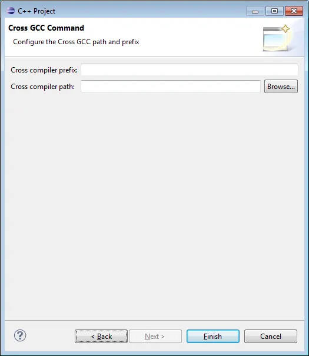

# C++ sur myRIO
{: .no_toc }


## Table of Contents
{: .no_toc .text-delta}
- TOC
{:toc}


## Introduction

Je mets ici mes notes d'installation du myRIO, mes tests etc. En fait, j'ai fait des essais avec les exemples ANSI C qui viennent par défaut avec le myRIO et j'ai été confronté à plusieurs soucis :

1. Je ne connaissais pas Eclipse et franchement j'étais un peu perdu dans toutes les options, les menus etc.
2. Je ne comprenais pas vraiment comment les projets ANSI C de NI étaient organisés dans Eclipse. Il me semblait important d'être capable de monter un projet à partir de rien, tout seul, comme un grand.
3. Il n'y a pas de code et/ou d'exemple C++ et donc pas de projet sur lequel on puisse s'appuyer pour avoir les bonnes options de compilation etc.
4. J'ai été assez (voir très) déçu par les exemples ANSI C qui sont disponibles pour le myRIO. On ne va pas se plaindre, pour une fois qu'il y a des codes qui existent pour autre chose que LabVIEW. Cela dit, autant dans LabVIEW il faut juste poser trois icônes pour récupérer les valeurs de l'accéléromètre, autant ici... C'est un peu la misère. Franchement, je ne vois pas pourquoi dans un cas, tu poses tu cliques et hop, ça roule (allez voir par exemple p 23 de ce [manuel en ligne](http://www.udppc.asso.fr/lyon2014/conf_textes/A32_NI%20myRIO%20Seminar%20Manual_1.3.14_FR.pdf)) alors que dans l'autre si on regarde un peu dans les sources, on se retrouve à gérer le contenu des registres 8 bits. Je m'en fous complètement des registres 8 bit ! Je ne crois que c'est avec des exemples pareils qu'on va inciter nos chères petites têtes blondes à faire du code embarqué et/ou à devenir ingénieurs. Attention, je ne dis pas qu'il ne faut pas rentrer dans les détails (cette page en est la preuve) je dis simplement que des exemples C++ pour le myRIO devraient exister et être à la hauteur de ce qui est fait pour LabVIEW.

L'article est relativement long car j'essaie vraiment de mettre un maximum de détails.

## VirtualBox

Afin de pas trop "pourrir" ma machine, je créer une nouvelle machine virtuelle (VM) de type Win7 64 bit. Avec un invité de type Win7, pour la VM je décide de prendre un disque dynamique dont la taille maximum sera de 50 GB. Bien sûr il faut s'assurer que la VM bénéficie des dernières **Guest Addition**


{: .important }
Avec VirtualBox il faut absolument s'assurer que le **VM VirtualBox Extension Pack** est bien installé. Ensuite il faut faire en sorte que la VM utilise un contrôleur **USB 2.0** pour se connecter au myRIO. J'ai perdu un temps pas possible avant de comprendre ce truc.

Après, dans une VM chacun vit sa vie mais bon, en ce qui me concerne après le 1er démarrage de la station Windows dans la VM je procède à :

* Installation de **chocolatey** (<https://chocolatey.org/> )
* Installation de Java Runtime Environment 32 bit :
  Dans un powershell (ou dans une console) en mode administrateur on tape : `cinst jre8 -params "x64=false"`
* Installation de Virtual Clone Drive :
  Dans un powershell(ou dans une console) en mode administrateur on tape : `cinst VirtualCloneDrive`
* Installation de Adobe Reader :
  Dans un powershell(ou dans une console) en mode administrateur on tape : `cinst adobereader`
* [optionnel] Installation de Avast : `cinst avastfreeantivirus`
* [optionnel] Installation de Google Chrome : `cinst GoogleChrome`
* [optionnel] Installation **Addblock Plus** pour Chrome : `cinst adblockpluschrome`
* [optionnel] Installation de notepad++ : `cinst notepadplusplus`

## VMWare Player

J'ai fait aussi quelques tests avec VMWare. En fait, sous un hôte Windows 8 cela se passe beaucoup mieux avec VMWare qu'avec VirtualBox. En effet, sous VirtualBox y a pas mal de problèmes pour détecter l'insertion du câble USB et capturer le myRIO alors que l'hôte Windows 8 lui ne doit rien faire (en effet aucun driver n'est installé pour le myRIO). J'imagine que ce n'est franchement pas simple mais bon avec VirtualBox c'est la galère et cela ne marche pas à tous les coups (c'est un peu moins pire quand l'hôte est un Window 7).

Je n'ai rencontré aucun problème avec VMWare. Le support de l'USB est un vrai bonheur. Etant dorénavant sous Windows 8.1, je crois bien que je vais me séparer de VirtualBox qui m'a rendu de bons et loyaux services pendant des années.

Là aussi chacun fait ce qu'il veut mais j'ai installé les mêmes soft que dans la VM VirtualBox

* Installation de **chocolatey** (<https://chocolatey.org/> )
* `cinst jre8 -params "x64=false"`
* `cinst VirtualCloneDrive`
* `cinst adobereader`
* [optionnel] `cinst avastfreeantivirus`
* [optionnel] `cinst GoogleChrome`
* [optionnel] `cinst adblockpluschrome`
* [optionnel] `cinst notepadplusplus`

## Installation du driver myRIO

1. Sur [ni.com/downloads](http://www.ni.com/downloads/) il faut faire une recherche sur le mot "myrio"
2. Récupérer **LabVIEW 2014 myRIO Toolkit**.
3. A la fin on a **2014MyRIO.iso** sur le disque dur.
4. Monter l'image ISO avec Virtual Clone Drive et lancer le **setup.exe**.
5. Si besoin (sur une VM qui n'a qu'un Windows 7 tout neuf par exemple) il faudra installer Microsoft .NET Framework 4.0 (c'est automatique)
6. Redémarrer la machine.

A ce niveau, si on branche le myRIO sur un port USB il doit être détecté. Le Wizard doit apparaître etc. mais bon, on ne peut pas faire grand-chose encore car on a aucun outil de développement.

<div align="center">

</div>

{: .note }
S'il y a des problèmes de détection du myRIO dans la VM VirtualBox il faut peut-être vérifier que la VM utilise bien USB 2.0 et ajouter un filtre. Pour cela il faut brancher le myRIO puis, dans la boite de dialogue ci-dessous, cliquer sur la prise usb avec le plus vert à droite.

<div align="center">

</div>

## Installation d'Eclipse (C/C++ Development Tools for NI Linux Real-Time, Eclipse Edition)

1. Sur [ni.com/downloads](http://www.ni.com/downloads/) faire une recherche sur le mot "myrio".
2. Il faut récupérer "**C/C++ Development Tools for NI Linux Real-Time, Eclipse Edition 2014**".
3. Quand c'est téléchargé, il faut juste lancer l'installeur.

## Pause...

Bon là, normalement, on a presque tout. Je potasse ça de mon côté et je reviens quand j'ai un peu mieux compris. Entre temps, on peut toujours **imprimer**, lire et relire le document suivant : `file:///C:/Program%20Files%20(x86)/National%20Instruments/Eclipse/14.0/help/Getting_Started.html.` C'est de loin le document que je préfère.

Une dernière remarque avant de partir en pause pour quelques jours/nuits. On marche sur la tête ! Je viens de vérifier. Chez moi, la machine virtuelle Win7 64 "vierge" a besoin de 20 GB et utilise 37 process qui tournent. En fait il y a Windows 7 original, toutes les mises à jour Windows plus deux ou trois soft vraiment indispensables (notpad++, avast etc.). Finalement, la machine où on vient d'installer les softs (Eclipse, Driver myRIO etc.) a besoin de 31 GB d'espace disque et il y a dorénavant 59 processus qui tournent... 10GB de soft et on n'a encore rien fait... De mon point de vue, c'est du délire pur et simple.

## Reprise et installation des exemples ANSI C

1. Sur [ni.com/downloads](http://www.ni.com/downloads/) faire une recherche sur le mot "myrio".
2. Il faut télécharger un fichier qui s'appelle "**C Support for NI myRIO**" (c'est un zip de moins de 2 MB).
3. Ensuite on l'installe dans le répertoire **Mes documents** par exemple.

## Premier projet C++

Dans "**Mes Documents**" créer un répertoire "**Eclipse Workspace**" puis lancer Eclipse. Tout à droite de l'écran d'accueil, cliquez sur l'espèce de flèche en 3D pour faire apparaître l'environnement de développement.

<div align="center">

</div>


Quand la première boite de dialogue apparaît choisir le répertoire qu'on vient de créer (**Eclipse Workspace)**et cliquer sur la check box "Use this as the default..."

<div align="center">

</div>


Pas de panique. Il est très facile par la suite de changer de workspace. Là, le truc c'est de faire simple. Bref, à la fin, l'environnement de développement apparaît :

<div align="center">

</div>


Bienvenue dans le "clickodrome". Ça ne va pas être triste... Bon... Faut dire que ce que l'on souhaite faire n'est pas très simple non plus. En gros :

* Je veux prendre un code C++ puis,
* Sur un hôte Windows à base de processeur Intel,
* Compiler et linker le code en question pour une cible Linux Temps réel à base de processeur Arm.
* Ensuite, quand ce sera fait, je veux être capable de déployer l'exécutable en question sur la cible via un câble réseau
* Enfin quand ce sera déployé, je veux, au choix, déboguer la version Debug ou exécuter la version Release du code.

Forcément, avec un tel "cahier des charges", va y avoir 12 000 paramètres à saisir, des noms de répertoires à rallonge "à la linux" etc. Bref, au lieu de râler et de ne rien faire, autant s'y mettre, apprendre, faire des erreurs et progresser...

## Génération du code

En haut, tout à droite de l'environnement de développement, cliquez sur **C/C++** (pour être dans une vue, une "perspective", développement C++). Là on retombe sur nos pattes, c'est juste un IDE après tout. Il faut faire **File/New/ C++ Project**. La boîte de dialogue suivante arrive. Il faut bien penser à choisir le **Cross Compiler GCC** dans la colonne de droite. En effet, on l'a déjà dit plus haut, on va faire une compilation croisée :

<div align="center">

</div>


On continue avec les paramètres de base

<div align="center">

</div>


Ensuite on sélectionne les configurations que l'on souhaite supporter pour ce projet.

<div align="center">

</div>


Bon, là, attention... Faut être précis. En fait dans l'étape suivante on indique à l'environnement de développement où aller chercher ses petits :

<div align="center">

</div>


Moi avec mon myRIO tout neuf

1. Dans le champ **Compiler Prefix** je tape : `arm-nilrt-linux-gnueabi-`
2. Dans le champ **Cross Compiler Path**, je retrouve sur le disque : `C:\Program Files (x86)\National Instruments\Eclipse\14.0\arm\sysroots\i686-nilrtsdk-mingw32\usr\bin\armv7a-vfp-neon-nilrt-linux-gnueabi`

En fait, si on va faire un tour par ses propres moyens dans le répertoire `C:\Program Files (x86)\National Instruments\Eclipse\14.0\arm\sysroots\i686-nilrtsdk-mingw32\usr\bin\armv7a-vfp-neon-nilrt-linux-gnueabi` on retrouve tout un tas d'outils classiques (compilateur, assembleur, linkeur...) qui ont été spécialement compilés pour fonctionner sur processeur Intel mais pour générer du code pour le processeur ARM. Pas de surprise, tous ces outils ont le même préfix (`arm-nilrt-linux-gnueabi-`)

<div align="center">

</div>


Quand on clique sur le bouton **Finish**, on retrouve un superbe source C++ dans l'éditeur et on croit qu'on a juste à cliquer sur Run... Pas si vite petit Padawan....

## Build Settings

Lors de cette étape on va indiquer à l'IDE la façon de construire l'application qui va être déployée. Dans l'environnement, à gauche, il faut cliquer sur le projet Demo1 puis sur **ALT+ENTER** afin de faire apparaître la fenêtre des propriétés. Cliquez sur **C/C++ Build** dans la liste à gauche. Dans l'onglet **Builder Settings** faut choisir **Internal builder** dans la liste déroulante.

<div align="center">

</div>


Ensuite déroulez l'option **C/C++ Build**, cliquez sur **Settings**, cliquez sur l'onglet **Tool Settings**, cliquez sur  **Cross G++ Compiler,** cliquez sur **Miscellaneous.** Dans le champ **Other flags** ajoutez : -mfpu=vfpv3 -mfloat-abi=softfp

<div align="center">

</div>


Quand c'est fait il faut cliquer sur **Project/Build Project**. En ce qui me concerne, voilà ce que je récupère dans la console de l'IDE. On retrouve bien le préfix "arm-nilrt-linux-gnueabi-" suivi de "g++" car on compile en c++. On retrouve aussi les flags supplémentaires qu'on avait passé.

<div align="center">

</div>


On a donc un code qui a été "cross compilé" qui n'est pas utilisable sur une plateforme Intel. Il faut donc configurer l'IDE pour lui indiquer comment se connecter à la cible myRIO afin de pouvoir y envoyer le code qu'il vient de générer.

## Configuration de la connexion à la cible distante

Il faut aller dans le menu **Window/Open Perspective/Other/Remote System Explorer**

<div align="center">

</div>


Une fois la "perspective" à l'écran il faut cliquer sur le petit "+" afin de définir une nouvelle connexion à un système distant

<div align="center">

</div>


Sur la fenêtre New Connection cliquez sur **SSH Only**

<div align="center">

</div>


Sur la boîte de dialogue suivante, je rentre, "au pif", **MyRIO** comme nom de connexion.

<div align="center">

</div>


On se retrouve normalement avec une configuration similaire à ce qui suit dans la perspective

<div align="center">

</div>


Si on essaie de cliquer sur **MyHome** ou sur **Root** ça ne **marche pas**. Pas de panique et arrêtez de râler... Un clic droit sur **myRIO** puis **Properties**. Quand la boite de dialogue arrive on voit qu'on a laissé **LOCALHOST** alors qu'il faudrait mettre l'adr IP de la cible (172.22.11.2 par défaut). Quand c'est corrigé, voilà ce que cela donne chez moi.

<div align="center">

</div>


Là, ensuite on peut se connecter à la cible et voir ce qu'il y a dessus. Attention on va vous demander un nom et un mot de passe. Si la cible n'a pas été plus configurée que cela, utilisez l'utilisateur **admin**dont le **mot de passe** est vide (y a pas de mot de passe)

S'il y a des problèmes pour circuler sur la cible, lancez **MAX** (Measurement & Automation Explorer), vérifiez l'adresse IP et surtout le fait que SSH soit autorisé sur la cible.

<div align="center">

</div>

## Les Run Settings en mode Debug

A ce niveau on a un fichier exécutable susceptible de tourner sur une cible et on sait se connecter à la cible en question. Il faut désormais configurer l’environnement pour pouvoir déboguer le code à distance.

Dans le code source, poser le curseur sur la ligne 13 : `cout << "Blbablabla...."` puis cliquez sur **CTRL+SHIFT+B** pour y poser un point d'arrêt.

Allez dans le menu **Run/Debug Configuration...** Quand la boîte de dialogue est à l'écran, cliquez sur **C/C++ Remote Application** (liste de gauche). Attention, ne cliquez pas sur **C/C++ Application** mais cliquez sur **C/C++ Remote Application**.  Quand c'est fait, en haut de la liste de gauche, cliquez sur l'icône en forme de listing avec un plus jaune (elle est tout à gauche). Quand la boîte de dialogue apparaît il faut cliquer sur la liste déroulante **Connection** et retrouver la connexion que l'on a paramètré précédemment (ici il faut retrouver MyRIO).

<div align="center">

</div>


Ensuite, dans **l'onglet Main**, dans le champs "**Remote Absolute...**" (en bas de l'onglet) à l'aide du bouton **Browse** il faut préciser le chemin d'accès au code Demo1. Pour cela le mieux c'est sans doute d'organiser les choses dès le départ. A l'aide du bouton **Browse**, il faut aller sur la cible et y créer un répertoire **Debug** sous le répertorie Demo1. De retour dans la boite de dialogue il faut bien penser à compléter le chemin avec le nom de l'application (Demo1 dans notre cas).

Cliquez ensuite sur l'onglet **Debugger**. Là aussi il faut préciser le chemin complet au débogger. Attention ce coup-ci il faut non seulement le chemin mais aussi le nom de l'application à utiliser. Bref, il ne faut pas oublier de préciser `arm-nilrt-linux-gnueabi-gdb.exe` tout à la fin du chemin. En ce qui me concerne voilà ce que j'ai rentré : `C:\Program Files (x86)\National Instruments\Eclipse\14.0\arm\sysroots\i686-nilrtsdk-mingw32\usr\bin\armv7a-vfp-neon-nilrt-linux-gnueabi\arm-nilrt-linux-gnueabi-gdb.exe`

<div align="center">

</div>


Quand c'est paramétré il faut cliquer sur **Apply** puis sur **Debug**. Normalement l'environnement devrait vous proposer de changer de perspective et de passer en vue **Debug**. Faites-lui confiance. Le code démarre et s'arrête sur le point d'arrêt. Voilà ce que cela donne chez moi quand je passe la ligne "cout..." en ayant appuyé sur F6.

<div align="center">

</div>

## Amélioration du code

### Pourquoi passer en C++11?

Tout simplement parce que le code est alors plus simple, plus propre, plus rapide etc. Par exemple en C++11 il n'y a plus de gestion de mémoire avec new et delete, les boucles dans les tableaux sont encore plus simples à écrire. Pour ceux qui tombent de l'arbre voilà deux liens à lire :

1. <http://herbsutter.com/elements-of-modern-c-style/>
2. <http://www.artima.com/samples/cpp11NotesSample.pdf>

On va passer en en C++11. Pour cela dans la perspective C/C++, clic droit sur le projet puis Properties (ou ALT+ENTER). Enfin, dans l'option **C/C++ Build** puis dans **Settings** puis dans **Cross G++ Compiler** puis dans **Dialect** il faut choisir **ISO C++11** comme ci-dessous. Bien penser à choisir **All Configurations** dans la liste déroulante **Configuration** en haut de la boîte de dialogue.

<div align="center">

</div>


Afin de vérifier qu'on travaille bien en C++11, je vous propose de modifier le code comme suit :

```cpp
#include <iostream>

using namespace std;

int main() {

    auto bob = 42;
    auto my_lambda = [](int x) { return x + 3; };

    cout << "my_lambda: " << my_lambda(5) << '\n';
    cout << "Hello C++11 Debug World"<<endl;
}
```

Bon, ben là c'est que du bonheur... On peut utiliser les lambdas, les auto... Oui, oui je sais, la variable **bob** n'est pas utilisée par la suite mais bon, c'est la fête. Pour Déboguer il faut juste se mettre en perspective Debug et cliquer sur "l'icône du cafard".

<div align="center">

</div>


Si on avait su, quand on a paramétré tout ça en mode Debug, il aurait été malin de positionner **Configuration** sur **All Configurations**. Enfin bref... On sera plus malin lors de notre prochain projet...Ca s'appelle l'expérience...

Toujours avec la même fenêtre sous les yeux il faut aller vérifier que :

1. C/C++ Build/Settings/Cross G++ Compiler/Miscellaneous/ Other flags vaut bien : `-c -fmessage-length=0 -mfpu=vfpv3 -mfloat-abi=softfp`
2. C/C++ Build/Settings/Cross G++ Compiler/Dialect est bien positionné sur ISO C++ 11

Quand c'est fait, il faut construire l'application avec le menu **Project/Build Project.** Normalement un dossier **Release** doit apparaître dans le Project Explorer.

<div align="center">

</div>

{: .note }
En fait le truc important que je n'avais pas compris, c'est qu'il faut d'abord compiler/créer l’exécutable (avec un Build) **AVANT** de s'occuper du déploiement sur la cible.

Quand le code est compilé, on va s'occuper des options de déploiement. En effet le paramétrage de la liaison à la cible est identique que le code soit en version Debug ou Release. Bref, dans le menu **Run/Run Configurations...** Dans la liste de gauche il faut bien choisir **C/C++ Remote Application** puis cliquez sur l'icône **New Launch Configuration** en haut à gauche

<div align="center">

</div>


Normalement l'environnement va alors créer une Launch Configuration nommée Demo1 Release. La **Connection** doit être positionnée sur **myRIO.**Ensuite en utilisant le bouton **Browse** du "**Remote Absolute File...**" je vous propose de créer sur la cible, un répertoire **MyHome/Demo1/Release**

<div align="center">

</div>


De retour dans la boite de dialogue, il ne faut surtout pas oublier de rajouter le nom de l'application à la fin du chemin. Ici moi j'ai donc : `/home/admin/Demo1/Release/Demo1`

<div align="center">

</div>


Quand tout est paramétré et que l'on appuie sur Run voilà ce que je vois

<div align="center">

</div>

{: .note }
C'est un peu débile. J'aurai dû changer le texte affiché et mettre un truc du style "Hello C++11 Release World".

Ensuite on peut toujours utiliser la perspective Remote System Explorer afin d'aller inspecter les contenus des répertoires `My Home/Demo1/Debug` et `My Home/Demo1/Release`. Dans ces répertoires l'application Demo1 doit faire respectivement 92 kB et 12 kB selon qu'elle est Debug ou Release.

## Récapitulatif de la méthode

C'est un peu en mode télégraphique. C'est normal c'est une espèce de "Cheat sheet". Au pire vous pouvez relire les paragraphes précédents.

### Debug

1. Créer un projet en utilisant Cross GCC comme Toolchain. Pas se planter dans le Cross Compiler Prefix ni dans le Path
   * `arm-nilrt-linux-gnueabi-`
   * `C:\Program Files (x86)\National Instruments\Eclipse\14.0\arm\sysroots\i686-nilrtsdk-mingw32\usr\bin\armv7a-vfp-neon-nilrt-linux-gnueabi`
2. Build Settings : ALT+ENTER sur le projet. **C/C++ Build**. **All Configurations** pour gagner du temps plus tard
   * Internal comme Builder Type
   * Settings/Miscelenaous (pour Cross GCC et Cross G++) : `-c -fmessage-length=0 -mfpu=vfpv3 -mfloat-abi=softfp`
   * Settings/Dialect (pour Cross G++): ISO C++11
3. Créer l'exécutable via Project/Build Project
4. Si besoin, configurer l'accès à la cible. Perspective Remote System Explorer (SSH Only, adr IP de la cible)
5. Debug Configuration (via le menu Run/Debug Configuration). C/C++ Remote App. Onglet Main: Connection "MyRIO", chemin complet vers l'application. Onglet Debugger : chemin complet au débogueur
   * `C:\Program Files (x86)\National Instruments\Eclipse\14.0\arm\sysroots\i686-nilrtsdk-mingw32\usr\bin\armv7a-vfp-neon-nilrt-linux-gnueabi\arm-nilrt-linux-gnueabi-gdb.exe`
6. Après on peut déboguer le code sur la cible

### Release

1. Rendre active la configuration release (clic droit sur projet puis Build Configuration/Set Active/Release)
2. Vérifier (mais cela a été fait à l'étape 2 précédente) les paramètres du Build
3. Créer l'exécutable via Project/Build Project
4. Run/Configuration (voir étape 5 précédente sans chemin au débogueur)
5. Après on peut exécuter le code en mode Release sur la cible

Bon ben voilà on a presque terminé. Faut juste maintenant être capable de faire un code qui utilise le FPGA de la cible myRIO.

## Un code C++ minimal pour le myRIO

Lors de l'installation nous avions copié certains code ANSI C de démonstrations fournis par NI. On va faire une copie du sous-répertoire **C Support for NI myRIO** sous le répertoire de notre Workspace (à côté du répertoire Demo1)

Ensuite, pour faire court et brutal, une méthode pour avoir un premier code qui tourne consiste à faire la chose suivante :

<div align="center">

</div>


Ce n'est pas très beau mais bon... Ça prouve que ça marche. En gros, on a **importé** (le terme est important du point de vue de Eclipse) tous les sources (fichiers headers compris) du répertoire `C Support for NI myRIO/source.` Ils ont alors été copiés dans le répertoire `Demo1/src`. Ensuite on s'inspire des codes d'exemples, on râle un peu sur les options de compile mais bon à la fin on a un truc qui tourne.

Encore une fois, ça prouve que c'est possible et que ça marche mais ce n'est pas top car si jamais on doit changer une ligne dans le source `NiFpga.c` par exemple alors il faudra mettre à jour le source en question dans les 10 000 répertoires des projets qu'on ne va pas manquer de réaliser d'ici quelques jours... Pour éviter de tomber dans ce piège, on va donc s'inspirer de ce qui est fait dans les exemples ANSI C de NI.

En deux mots, dans ce qui suit, on va garder notre projet tel quel et on va le "compléter" avec une référence (un lien) sur un répertoire dans lequel on retrouvera `NiFpga.c` etc.

Bon maintenant qu'on a justifié ce que l'on allait faire, zou, c'est parti. Clic droit sur le projet puis New/Folder. Donnez un nom quelconque dans le champs **Folder Name**. C'est le nom tel qu'il apparaîtra dans le projet (rien à voir avec le nom réel du dossier. Ici je vais utiliser **Zoubida**). Cliquez sur le bouton **Advanced>>** puis cliquez sur "**Link to alternate...**" et utilisez le bouton **Browse** afin de retrouver le répertoire `C Support for NI myRIO/source`. Un nouveau dossier apparaît dans le projet. On voit qu'il est lié car son icône est doté d'une petite flèche.

<div align="center">

</div>


Ensuite (et là franchement, je ne suis pas trop sûr de mon coup) clic droit sur Demo1 puis New/Source Folder. Dans la boite de dialogue choisir Zoubida. Le projet devrait ressembler à ceci :

<div align="center">

</div>


On voit que Zoubida est bien un répertoire de source à la façon dont sont dessinées les icônes des fichiers .c et .h. On note aussi qu'il y a un "c" sur l'icône du répertoire Zoubida.

Dans un premier temps on va modifier notre code C++ de la façon suivante.

```cpp
#include <iostream>
#include "MyRio.h"

using namespace std;

int main() {

    MyRio_Open();
    cout << "myRIO is open"<<endl;
    MyRio_Close();

}
```

Oui, oui je sais il n'y a pas de gestion d'erreur etc... Cela dit, là n'est pas la question, ce que l'on veut pour l'instant, c'est être capable de compiler le code. Actuellement, si on fait **Project/Project Build** le compilateur pleure car il ne trouve pas **MyRio.h**.

Clic droit sur Demo1 puis **Properties**. Dans **C/C++ General/Path and Symbols/Gnu C++** il faut s'assurer que **Configuration** est sur **All Configurations** puis cliquer sur le bouton **Add**. Ensuite il faut saisir "**/**" puis cliquer sur le bouton **Variables**, choisir la variable **ProjectName** puis enfin taper "**/Zoubida**" car c'est là que se trouvent, entre autres, le fichier **MyRio.h**. D'autre part, on voit l'intérêt didactique d'avoir pris Zoubida comme nom... Cela permet de bien mettre en évidence le fait que l'on navigue dans le projet.

Finalement j'avais : `/${ProjName}/Zoubida`

Attention, ne pas oublier de cocher la case **Is a workspace Path**

<div align="center">

</div>


De retour dans la **perspective C/C++** si on Build le projet, ça ne passe toujours pas. Par exemple, la fonction `MyRio_Open()` est soulignée en rouge. Si on clique droit dessus et que l'on choisit **Open Declaration** on se retrouve bien de MyRio.h mais toutes les fonctions sont soulignées. Si on remonte tout en haut on comprend qu'il faut que la variable `MyRio_1900` (ou `MyRio_1950`) soit définie. Qu'à cela ne tienne...

Clic droit sur le projet puis **Properties** (ou ALT+ENTER directement). Dans **C/C++ General/ Path and Symbols** onglet **Symbols** sélectionner **GNU C++** en s'assurant que **Configuration** est bien sur **All Configurations**. Cliquer sur le bouton **Add** et taper `MyRio_1900` (ou `MyRIO_1950` selon votre modèle). Il n'y a pas besoin de saisir une valeur particulière dans le champ **Value**.

<div align="center">

</div>


Refaire la même chose en sélectionnant GNU C. Autrement dit le symbole `MyRio_1900` doit être défini pour GNU C++ et pour GNU C (en effet, une partie du code est compilée par g++ alors que les codes NI qui sont du pur ANSI C sont compilé par gcc)

Si on build... Ça ne passe toujours pas et on a des messages indiquant qu'il y a des références non définies pour les fonctions `dlopen()`, `dlerror()` etc.

Allez, on ne change pas une méthode qui gagne... ALT+ENTER quand Demo1 est sélectionné. Dans **C/C++ General/ Path and Symbols** onglet **Libraries**en s'assurant que **Configuration** est sur **All Configurations**. Cliquer sur le bouton **Add** et saisir **dl**.

{: .note }
Si par la suite vous en avez besoin, c'est là qu'il faudra rajouter les références aux bibliothèques pthread, visa, mysql...

Maintenant ça doit compiler et linker. J'espère franchement que je n'ai rien oublié. Au pire faites un **Project/Clean...** puis un **Project/Build Project** en mode **Debug** puis en mode **Release**.

Ce fut long et fastidieux mais au moins on comprend vraiment comment le projet est construit. On comprend comment et pourquoi il est organisé de cette façon, les symboles à définir, le chemin au déboguer, les préfixes etc. Normalement si plus tard on a un message d'erreur à la compilation, à l'édition de lien, lors de l'établissement de la communication avec la cible etc. On devrait être capable de réagir et d'essayer des choses. C'est quand même mieux que de prendre les exemples C, de fermer les yeux en priant pour que ça compile... :-)

## Amélioration du code C++

Typiquement, voilà le genre de code LabVIEW que l'on met dans les mains de ceux qui débute avec le myRIO (il est dispo p 23 de ce [manuel en ligne](http://www.udppc.asso.fr/lyon2014/conf_textes/A32_NI%20myRIO%20Seminar%20Manual_1.3.14_FR.pdf))

<div align="center">

</div>


Le code ci-dessous c'est le ode csource de Accelerometer.c, un des exemples que nous avions téléchargé au tout début.

```cpp
/*
 * Copyright (c) 2013,
 * National Instruments Corporation.
 * All rights reserved.
 */

#include <stdio.h>
#include <time.h>
#include "Accelerometer.h"
#include "MyRio.h"

#if !defined(LoopDuration)
#define LoopDuration    60  /* How long to output the signal, in seconds */
#endif

#if !defined(LoopSteps)
#define LoopSteps       1   /* How long to step between printing, in seconds */
#endif

/**
 * Overview:
 * Demonstrates using the onboard accelerometer. Reads the acceleration in the
 * three directions. Prints the values to the console.
 *
 * Instructions:
 * 1. Run this program.
 * 2. Shake the NI myRIO.
 *
 * Output:
 * The program reads the acceleration for 60 s. Acceleration values are written
 * to the console every 1 s.
 *
 * Note:
 * The Eclipse project defines the preprocessor symbol for the NI myRIO-1900.
 * Change the preprocessor symbol to use this example with the NI myRIO-1950.
 */
int main(int argc, char **argv)
{
    NiFpga_Status status;

    MyRio_Accl Accl;

    time_t currentTime;
    time_t printTime;
    time_t finalTime;

    double x;
    double y;
    double z;

    printf("Accelerometer\n");

    /*
     * Specify the registers that correspond to the accelerometer channel
     * that needs to be accessed.
     *
     * Assign constant to the accelerate weight.
     */
    Accl.xval = ACCXVAL;
    Accl.yval = ACCYVAL;
    Accl.zval = ACCZVAL;
    Accl.scale_wght = ACCSCALEWGHT_CST;

    /*
     * Open the myRIO NiFpga Session.
     * This function MUST be called before all other functions. After this call
     * is complete the myRIO target will be ready to be used.
     */
    status = MyRio_Open();
    if (MyRio_IsNotSuccess(status))
    {
        return status;
    }

    /*
     * Read the scaling factors, initializing the struct.
     */
    Accel_Scaling(&Accl);

    /*
     * Normally, the main function runs a long running or infinite loop.
     * Read the accelerometer output for 60 seconds.
     */
    time(&currentTime);
    finalTime = currentTime + LoopDuration;
    printTime = currentTime;
    while (currentTime < finalTime)
    {
        time(&currentTime);

        /* Don't print every loop iteration. */
        if (currentTime > printTime)
        {
            x = Accel_ReadX(&Accl);
            y = Accel_ReadY(&Accl);
            z = Accel_ReadZ(&Accl);
            printf("X: %g, Y: %g, Z: %g\n", x, y, z);

            printTime += LoopSteps;
        }
    }

    /*
     * Close the myRIO NiFpga Session.
     * This function MUST be called after all other functions.
     */
    status = MyRio_Close();

    /*
     * Returns 0 if successful.
     */
    return status;
}
```

Franchement il est bien mais il ne fait pas rêver... Non ? C'est long, trop long. On perd trop de temps avec la gestion du timing de la boucle par exemple. Ensuite, en C,  il y a des appels à des fonctions qui n'apparaissent pas en LabVIEW. (`Accel_Scaling()` par exemple, pourquoi, comment...). Bon bref, ça ne me plait pas vraiment...

Après quelques tests et essais, voilà le code que je souhaiterai écrire en C++. C'est de mon point de vue, l'équivalent "honnête" du code LabvIEW précédent :

```cpp
#include <iostream>
#include <chrono>
#include <thread>
#include "MyRIO2.h"

using namespace std;

//-----------------------------------------------------------------------------
int main() {

  MyRIO2    MyRIO;
  int       count=0;

  while (0 == MyRIO.GetStatus() && count++<10) {
    cout << "X : " << MyRIO.MyAccel.ReadX() << endl;
    this_thread::sleep_for(chrono::milliseconds(500));   // define _GLIBCXX_USE_NANOSLEEP as a symbol
  }
}
```

Deux mots d'explications :

* C'est du C++11 standard
* Comme dans le code LabVIEW il n'y a pas besoin d'initialiser le myRIO (voir l'appel `MyRio_Open()` du source C de l'exemple)
* A chaque tour de boucle on fait une lecture de l'accéléromètre. Ici on ne lit que la composante X mais ce n'est pas le plus important.
* A chaque tour de boucle on utilise une fonction standard du C++11 pour endormir le thread 500 ms (au lieu de 10 dans le code LabVIEW)
* Ici aussi la boucle s'arrête s'il y a une erreur mais aussi au bout de 10 itérations (dans le code LabVIEW on attend jusqu'à l'appui sur le bouton Stop)
* A la fin il n'y a pas besoin de faire un reset du myRIO (j'imagine que tout le monde ne le fait pas en LabVIEW). Ici le reset est géré automatiquement pour l'utilisateur.

Je trouve que la syntaxe est plutôt sympathique : `MyRIO.MyAccel.ReadX()`. On peut imaginer de la même manière des fonctions du type `MyRIO.MyLED2.SetTo(1)` ou `MyRIO.MyButton.GetValue()`. Tout ça en de 20 lignes c'est pas mal, non ? De mon point de vue, ça, ça peut donner envie à certains d'aller plus loin.

Oui je sais, "toute la misère du monde" est cachée dans la classe MyRIO2. Oui et alors ? C'est justement tout l'intérêt des bibliothèques et des classes. Typiquement c'est ce que propose de faire le VI Express Accelerometer. Dans tous les cas, ce qui compte c'est vraiment ce que doit saisir l'utilisateur final. 20 lignes ça me paraît plus "absorbable" qu'une centaine.

Bon... Pour être tout à fait franc, à ce stade, le code compile, link et tourne sur ma machine mais bon... Je ne suis pas très fier de la gestion d'erreur. D'un autre côté, je n'ai pas vraiment envie de mettre en route des exceptions pour tout et pour rien. Bref, je vais bosser la question de mon côté et quand j'aurai un code de l’accéléromètre "montrable" je reviendrai sur cette page.

***La suite au prochain épisode...***

