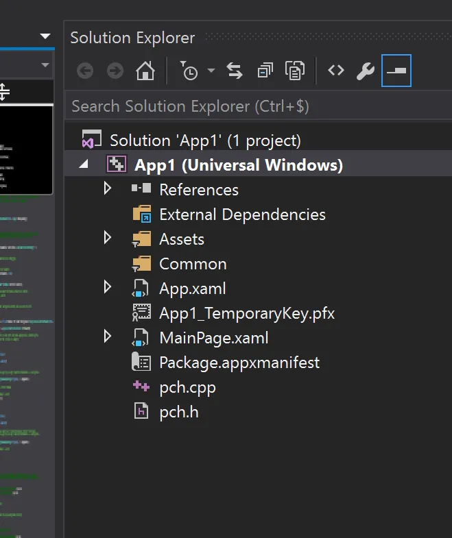

<!-- Applications Windows Universelles en C++ avec C++/WinRT -->
# C++/WinRT

# Introduction
Le projet libre C++WinRT permet d'écrire "en vrai C++" (et pas avec C++/CX) des applications Windows universelles que l'on peut compiler et déployer sur PC, Android etc...

Voir le projet : <https://github.com/Microsoft/cppwinrt>

Lire l'article : <https://msdn.microsoft.com/en-us/magazine/mt745094>

De mon point de vue, il n'y a que du bon dans le projet. En effet, c'est uniquement basé sur des fichiers headers (un peu comme Boost), ça marche, c'est documenté, on fait du C++ "classique" et à priori les développeurs de Microsoft commencent à l'utiliser en interne. Le truc le plus important c'est que c'est que du C++ standard. Il ne s'agit donc pas d'une extension du compilateur ou d'une librairie particulière. Au contraire, à partir des fichiers IDL brut, le projet génère "automatiquement" des fichiers header utilisables en C++. Autrement dit, on reste conforme au standard, on a peu de chance de se retrouver avec un outil obsolète, dès que le compilateur s'améliore tout le monde en profitera automatiquement... Que du plus je vous dis madame...

Cela dit, après avoir exécuté les exemples, lu la doc et fouiné un peu sur le Web je souhaitais mieux comprendre comment "monter" un projet C++WinRT d'application Windows universelle à partir de zéro et là... Ben je n'ai pas trouvé mon bonheur. Donc, dans ce qui suit j'explique ce que je crois avoir compris (je ne suis pas un expert de WinRT, loin de là) et je montre pas à pas comment "monter" un projet Visual Studio minimal qui permet d'utiliser les headers de C++WinRT.

Attention, les préliminaires et pré-requis ci-dessous ne sont pas innocents. Je suis sous Windows Anniversary avec toutes les mises à jour qui vont bien. Voilà ce que cela donne pour Windows. Attention, le N° 14393.576 est important (plus d'infos un peu plus bas).

<div align="center">

</div>


J'utilise Visual Studio Community 2015 **Update 3** (attention l'update 3 est important). Voilà ce que cela donne pour Visual Studio Community. Notez que l'outil Visual Studio Tools for Universal Windows Apps doit être installé. Il faudra aussi le SDK Windows 10.

<div align="center">

</div>


Si jamais vous avez un Visual Studio Community 2017RC ca marchera aussi (j'ai fait des tests). Cependant si votre N° de Windows n'est pas 14393 le projet ci-dessous ne peut pas fonctionner (j'ai fait des tests et c'est après que j'ai compris... Désolé on n'a pas tous fait Centrale)

Cependant les autres exemples qui viennent avec C++WinRT et qui tournent dans des consoles ou qui ne sont pas des applications Universelles fonctionneront parfaitement.

Les préliminaires étant vérifiés, on passe aux choses sérieuses, on lance Visual Studio et zou, New Project (CTRL+SHIFT+N)
Choisir Visual C++, puis Windows et enfin Blank App (Universal Windows). Ensuite il faut choisir un nom et un répertoire où déposer la solution. Enfin on clique sur OK.

<div align="center">

</div>


Pour la version de plateforme choisir Build 14393 car c'est celle qui a été utilisée pour générer les headers de C++WinRT. C'est de là que vient cette histoire de N° de version de Windows dont je parlais dans les préliminaires.

<div align="center">

</div>


Voilà la solution au tout départ telle qu'elle a été générée par l'assistant :

<div align="center">

</div>


Faisons un Run en mode Debug (F5) afin de vérifier que tout est OK

<div align="center">

</div>


Normalement tout doit bien se passer et on obtient ça à l'écran.

<div align="center">

</div>


Après avoir fermé l'application et une fois de retour dans l'environnement de développement, on commence par faire le ménage dans le projet et on supprime App.xaml et MainPage.xaml (CTRL+ clic pour les sélectionner l'un puis l'autre)

<div align="center">

</div>


Après avoir appuyé sur "Suppr", quand on nous le demande, il faut confirmer qu'on souhaite bien supprimer les fichiers sur le disque dur. Ensuite, clic droit sur le nom du projet App1 et on demande à ajouter une nouvelle ressource (Add/New Items... ou CTRL+SHIFT+A pour les intimes)

<div align="center">

</div>


On choisit d'ajouter un fichier .cpp et on le nomme App.cpp

<div align="center">

</div>


Ouvrez alors le fichier App.cpp dans l'éditeur puis faites un copier-coller du code source ci-dessous :

```cpp
#include "pch.h"

using namespace winrt;

using namespace Windows::ApplicationModel::Core;	// IFrameworkViewSource, IFrameworkView...
using namespace Windows::UI::Core;					// CoreWindow

struct App : implements<App, IFrameworkViewSource, IFrameworkView>
{
	IFrameworkView CreateView()
	{
		return *this;
	}

	void Initialize(CoreApplicationView const &)
	{
	}

	void Load(hstring_ref)
	{
	}

	void Uninitialize()
	{
	}

	void Run()
	{
		CoreWindow window = CoreWindow::GetForCurrentThread();
		window.Activate();

		CoreDispatcher dispatcher = window.Dispatcher();
		dispatcher.ProcessEvents(CoreProcessEventsOption::ProcessUntilQuit);
	}

	void SetWindow(CoreWindow const &)
	{
	}
};

int __stdcall wWinMain(HINSTANCE, HINSTANCE, PWSTR, int)
{
	CoreApplication::Run(App());
}
```

Heu... Non, non je ne vais pas expliquer le code ici. Ce n'est pas l'objet de l'article. Moi ici ce que je veux c'est créer un projet C++ qui compile et qui link dans la joie et la bonne humeur. Pour les explications allez voir un des liens en bas de cette page. Quoi qu'il en soit, quand c'est copié il faut supprimer tout le contenu du fichier pch.h puis faire un copier-coller des lignes suivantes :

```cpp
#pragma once

#pragma comment(lib, "windowsapp")

#include "winrt/Windows.ApplicationModel.Core.h"
#include "winrt/Windows.UI.Core.h"
```

Il faut maintenant modifier les propriétés du projet (ALT P puis appui sur la touche P encore une fois. Au pire dans le menu Project, tout en bas vous choisissez l'option "App1 Properties...")

Dans la catégorie "C/C++" puis dans "General" il faut ajouter le répertoire qui contient les fichiers header de C++WinRT. C'est la toute première ligne dans la boite de dialogue ci-dessous.

Attention. Sur mon disque l'organisation des répertoires ressemble à ça :

```
Documents
	|
	C++
		|
		cppwinrt
			|
			Docs
			media
			10.0.14393.0
				|
				Samples
				winrt
		|
		App1
		App2
		etc.
```

Dans MesDocuments j'ai un répertoire C++ dans lequel j'ai dézippé cppwinrt. À côté de ce répertoire cppwinrt j'ai des répertoires qui contiennent des solutions Visual Studio (App1, App2 etc.). Dans le répertoire cppwinrt on a quelques fichiers mais aussi des répertoires Docs, media et 10.0.14393.0. Dans ce dernier on trouve finalement un répertoire qui contient des exemples et un dernier répertoire winrt qui contient les fichiers header dont il faut tenir compte dans le projet.

Alors, le truc c'est qu'il faut pointer le répertoire parent du répertoire winrt et pas le répertoire winrt lui-même. Jetez un œil à l'illustration suivante. Normalement on voit bien que le chemin ajouté va jusqu'à 10.0.14393.0 et pas jusqu'à winrt.

Ensuite toujours dans la même section "General" de la boite de dialogue, il faut mettre "Consume Windows Runtime Extension" à "No" (il est à Yes /ZW par défaut). Ce flag est celui qui permet d'utiliser les extensions de C++/CX. Là justement on ne veut surtout pas les utiliser donc on le met à "No".

Enfin, pour faire bonne figure, on se met en Warning Level 4

<div align="center">

</div>


Toujours dans C/C++, faut aller maintenant dans "All Options" (avant dernière rubrique), éditer la ligne "Additional Options" et y ajouter "/await" et "/std:c++latest".

Remarque 1 : c'est le fait d'utiliser /std:c++latest qui fait que l'on doit avoir Visual Studio 2015 Update 3 ou bien Visual Studio 2017RC (on est en Janvier 2017 et il n'est pas encore release à cette date).

Remarque 2 : l'exemple peut tourner même si on ne met pas l'option /await. Cela dit dans d'autres applications plus évoluées où l'on aura des coroutines, il faudra utiliser cette seconde directive expérimentale (pour plus d'infos [voir cette page](https://msdn.microsoft.com/en-us/magazine/mt573711.aspx))

<div align="center">

</div>


De retour dans l'éditeur, en ayant le code de App.cpp sous les yeux commencez par faire une compilation du code avec CTRL+F7 (ou menu "Build" puis l'option "Compile" tout en bas). Normalement ça doit compiler sans Warning ni Error.

<div align="center">

</div>


Si c'est le cas on est presque bon. Y a plus qu'à lancer l'application en mode Debug avec F5. Voilà ce que j'obtiens :

<div align="center">

</div>


De retour dans l’environnement on voit que l'application se termine en retournant 1 (et pas 0) mais bon ça tournicote, ça ne plante pas... On est sur la bonne voie. Cela dit, je réalise que ça ne vend pas du rêve mon histoire MAIS... vous êtes parés à monter vos propres projets en C++ "pur" (peuvent utiliser la STL, Boost etc.) et être, au titre des applications Windows Universelles susceptibles d'être déployées sur PC, ARM, Hololens etc.

## Il n'y a pas moyen d'avoir un source encore plus simple ?

Bon... Allez, on va voir ce que l'on peut faire... En fait en étudiant les sources des exemples qui viennent avec C++WinRT on se rend compte qu'il y a plusieurs moyens de concevoir le fonction main() et le démarrage de l'application. Entre autres, dans l'exemple [XamlCode](https://github.com/Microsoft/cppwinrt/blob/master/10.0.14393.0/Samples/XamlCode/App.cpp) la phase d'amorçage semble assez simple.  Il y a une fonction wWinMain() puis une fonction OnLaunched(). Si on cherche ensuite de la documentation sur la fonction OnLaunched(), normalement on doit tomber sur cette [page](https://msdn.microsoft.com/en-us/windows/uwp/launch-resume/activate-an-app). Là, on y apprend, sans trop de surprise, que la fonction en question est une callback qui est invoquée quand l'application est activée (ou réactivée). On y apprend aussi que cette fonction provient de la classe [Windows.UI.Xaml.Application](https://msdn.microsoft.com/library/windows/apps/br242324) qui fournit aussi une méthode [Start()](https://msdn.microsoft.com/en-us/library/windows/apps/windows.ui.xaml.application.start).

Afin de fixer les idées, je vous propose de remplacer le contenu de votre fichier header par les lignes suivantes. Sinon, au pire, vous créez un nouveau projet en suivant la méthode précédente dans lequel les lignes ci-dessous seront le contenu du fichier pch.h.

```
#pragma once

#pragma comment(lib, "windowsapp")

#include "winrt/Windows.UI.Xaml.h"
```

Ensuite, je vous propose de copier le code suivant en lieu et place de votre fichier App.cpp.

```cpp
#include "pch.h"

using namespace winrt;
using namespace Windows::UI::Xaml;						// Application

struct App : ApplicationT<App> {
};

int __stdcall wWinMain(HINSTANCE, HINSTANCE, PWSTR, int){

	Application::Start([](auto &&) { make<App>(); });
}
```

Dans le code source ci-dessus, on a les bons namespace et les bons fichiers header qui nous permettent d'invoquer la fonction Start() de la classe Windows.UI.Xaml.Application. Comme l'objectif était d'avoir le code le plus simple possible, on a juste une structure App dans laquelle on ne surcharge même pas la fonction OnLaunched(). En ce qui concerne la fonction lambda passée en paramètre de la fonction Start() j'ai juste fait un copier-coller de ce que j'avais vu ailleurs. Après... Ben après faut laisser trainer son curseur un peu partout (make, ApplicationT, tous les trucs qui fâche un peu) puis cliquer sur ALT+F12 (j'adore cette possibilité).

Quoiqu'il en soit, à ce stade si on lance l'application en appuyant sur F5 ça doit bien se passer et on retrouve le même type de fenêtre bleue qu'avant à l'écran.

<div align="center">

</div>

### Note

Je ne suis pas fichu de me rappeler comment c'est arrivé mais à un moment le link ne passait plus et l'environnement de développement me renvoyait un message du type : Could not copy the file "...\x64\Release\App1Bis\App1Bis.winmd" because it was not found". Afin de supprimer le message j'ai édité les propriétés du projet (ALT+ENTER sur le nom du projet). Ensuite il faut aller dans "Linker" puis "Windows Metadata" puis mettre à "No" le paramètre "Generate Windows Metadata". Voir ci-dessous :

<div align="center">

</div>


Attention, un peu plus haut, j'ai dit le même type de fenêtre bleue, je n'ai pas dit la même... En effet ce coup-ci y a une espèce de grosse case à cocher grise. En fait, comme on ne fait même pas le minimum syndical, il semble que la classe Windows.UI.Xaml.Application n'affiche que l'une des images que l'on retrouve dans le répertoire "asset" du projet. Pour avoir autre chose à l'écran il aurait fallu surcharger la fonction OnLaunched(). On y va ? On se lance ?

Voilà le code que je propose :

```cpp
#include "pch.h"

using namespace winrt;
using namespace Windows::UI::Xaml;						// Application
using namespace Windows::ApplicationModel::Activation;	// LaunchActivatedEventArgs
using namespace Windows::UI::Xaml::Controls;			// Canvas
using namespace Windows::UI::Xaml::Media;				// SolidColorBrush
using namespace Windows::UI;							// Colors

struct App : ApplicationT<App> {
	void OnLaunched(LaunchActivatedEventArgs const &)
	{
		Canvas MyCanvas;
		MyCanvas.Background(SolidColorBrush(Colors::CadetBlue()));
		MyCanvas.Width(161);
		MyCanvas.Height(100);

		Window MyAppWindow = Window::Current();
		MyAppWindow.Content(MyCanvas);
		MyAppWindow.Activate();
	}
};

int __stdcall wWinMain(HINSTANCE, HINSTANCE, PWSTR, int){

	Application::Start([](auto &&) { make<App>(); });
}
```

Cette fois-ci on surcharge bien la fonction OnLaunched(). Dans cette dernière, on crée un Canvas que l'on colorie en Bleu et que l'on positionne en largeur et en hauteur. Ensuite on affiche le tout. Attention, ce n'est sans doute pas la meilleure façon d'écrire la fonction OnLaunched. En effet dans d'autres exemple, on tient compte dans cette dernière du fait que l'application a déjà été lancée ou pas etc. Ici le but c'est juste de montrer qu'il faut vraiment faire quelque chose dans la fonction OnLaunched() si on ne veut pas se retrouver avec la grosse checkbox grise à l'écran.

En ce qui concerne le fichier header voilà la version à utiliser :

```cpp
#pragma once

#pragma comment(lib, "windowsapp")

#include "winrt/Windows.UI.Xaml.h"
#include "winrt/Windows.ApplicationModel.Activation.h"
#include "winrt/Windows.UI.Xaml.Controls.h"
#include "winrt/Windows.UI.Xaml.Media.h"
#include "winrt/Windows.UI.h"
```

Voilà pour finir ce que l'on obtient à l'écran :

<div align="center">

</div>

## Conclusion

Bon, afin d'aller un peu plus loin, je vais travailler sur une espèce d'application "Hello World" et sans doute écrire un autre billet. J'en profiterai peut-être pour expliquer plus en détail ce que j'aurai compris de l'architecture des applications WinRT en C++. A plus.

## Compléments

1. Faut lire absolument la doc de C++WinRT (personne ne peut le faire à votre place) : <https://github.com/Microsoft/cppwinrt/tree/master/Docs>
2. Le site "historique" de Kenny Kerr : <https://moderncpp.com/>
3. Des articles qui parlent de DirectX en C++/CX mais qui expliquent pas mal de choses à propos de la structure des applications Windows Universelles. Enfin bref, j'ai trouvé ça instructif : <http://www.directxtutorial.com/Lesson.aspx?lessonid=111-1-1>
4. Un dernier pour la route? <https://blogs.windows.com/buildingapps/2016/11/28/standard-c-windows-runtime-cwinrt/#6sZ6HAFJI9E2YGu2.97>
5. Entretiens sur CppCast
   1. <http://cppcast.com/2016/10/kenny-kerr/>
   2. <http://cppcast.com/2015/05/kenny-kerr/>
6. A voir sur YouTube deux sessions de la CPP Con 2016 où on parle de WinRT:

