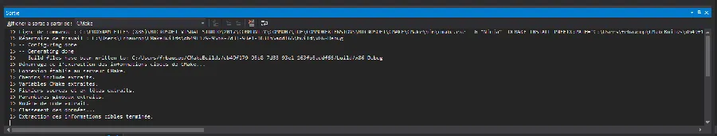
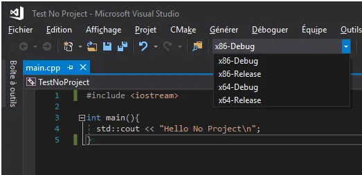
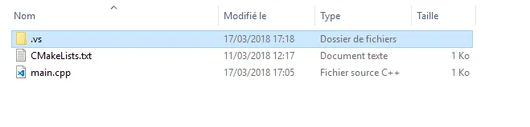

# MSVC sans projet ni solution


Avec MSVC, on peut créer un ``.exe`` sans projet ni solution et je vous montre comment ici.

* Je suis sous Windows 10.
* Je crée un répertoire ``TestNoProject``.
* J'y ajoute un fichier ``main.cpp``

```cpp
#include <iostream>

int main(){
  std::cout << "Hello No Project\n";
}
```

* J'y ajoute un fichier ``CMakeLists.txt``

```
cmake_minimum_required (VERSION 3.0.0)
project (TestNoProject)
add_executable (TestNoProject main.cpp)
```

* Je lance Visual Studio 2017 (je suis en version 15.5.5)
* Ensuite j'appuie sur 'ALT F', puis sur 'o', puis sur 'd'
    * Autrement dit je vais dans le menu Fichiers, option ``Ouvrir``, option ``Dossier`` (on peut aussi taper CTRL+ALT+MAJ+o)
* Là, je choisi le répertorie que je viens de créer
* À partir de là, Visual Studio utilise les infos du fichier ``CMakeLists.txt`` pour générer les cibles nécessaires. Comme il est gentil il nous dit ce qu'il fait dans la console de sortie.

<div align="center">

</div>


Ensuite on retrouve bien les cibles

<div align="center">

</div>


* Choisir la cible (x64-Debug par exemple). Visual Studio enverra de nouvelles infos dans la console de sortie
* Je peux double-cliquer sur ``main.cpp`` pour l'éditer et poser un point d'arrêt
* Je lance le code comme d'habitude avec F5
* Ce qu'il y a de bien c'est qu'on part avec presque rien (2 fichiers) et finalement on a juste un sous répertoire ``.vs`` créé et dont on peut s'en débarrasser très facilement.

<div align="center">

</div>


Oui, oui je sais on peut ouvrir une console et compiler en ligne de commande avec une ligne du style

```powershell
cl /W4 main.cpp
```

Mais bon, se serait aller un peu vite en besogne car 
* Comment on fait pour déboguer ?
* Qu'est-ce qu'on fait si y a 12 000 fichiers, des lib statiques et des DLLs à prendre en compte ?
* Là c'est cool on a quatre cibles alors qu'en ligne de commande faut se rappeler de tous les paramètres à chaque fois
* On peut éditer les différents fichiers, profiter de Intellisense, compiler, déboguer etc. Bref, c'est que du bonheur


{: .note}
Mais où est mon fichier .exe? Il faut aller le rechercher dans : ``C:\Users\Robert\CMakeBuilds\``

