# C++ with VS Code
{: .no_toc }


{: .note }
I updated the article in April 2021. I was then using VS Code 1.55.2 and cl 19.28.29913.

## Table of Contents
{: .no_toc .text-delta}
- TOC
{:toc}


## Introduction
Bonjour. This is a step-by-step procedure (a checklist) which explains how to compile C++ code with VS Code (aka Visual Studio Code). As you will see the compiler and the linker, I use are the ones coming with Visual Studio 2017. However the steps explained here below should be similar if you use another compiler. 


## Software setup

* I'm using Windows (10 or 11 the process is similar).
* [Visual Studio 2017](https://www.visualstudio.com/fr/downloads/?rr=https%3A%2F%2Fwww.google.fr%2F) (15.6.2) is installed and you can compile some C++ project using Visual Studio 2017. I just want to make sure the C++ toolchain is in place, up and running.
* If you don't want to install Visual Studio but only the bare minimum set of tools you can install the **Build Tools** for Visual Studio 19 for example. See at the very bottom of [this page](https://visualstudio.microsoft.com/downloads/).
* [VS Code](https://code.visualstudio.com/) (1.21.1) is installed
* You don't have to but if you plan to edit some C++ code in VS Code I would recommend installing the **C/C++ for Visual Studio Code extension**.

<div align="center">
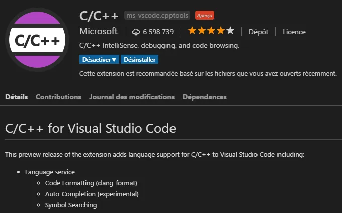
</div>


Now, even if Visual Studio 2017 (not VS Code) is able to edit, run and debug a [C++ code without any project]() you may want to do something similar using VS Code. 


## Compiling a debug version with VS Code

From the Visual Studio 2017 group, open a Developer Command Prompt. If you either select the Developer Command Prompt or the Native x86 Developer Command Prompt, then the generated code will be 32 bits. If you open the ``x64 Developer Command Prompt``, then the generated code will be 64 bits.

<div align="center">

</div>


Here I picked the ``x64 Developer Command Prompt``. Once the console is open, move to a directory where you want to make your tests. Check the "cd" command below:

<div align="center">
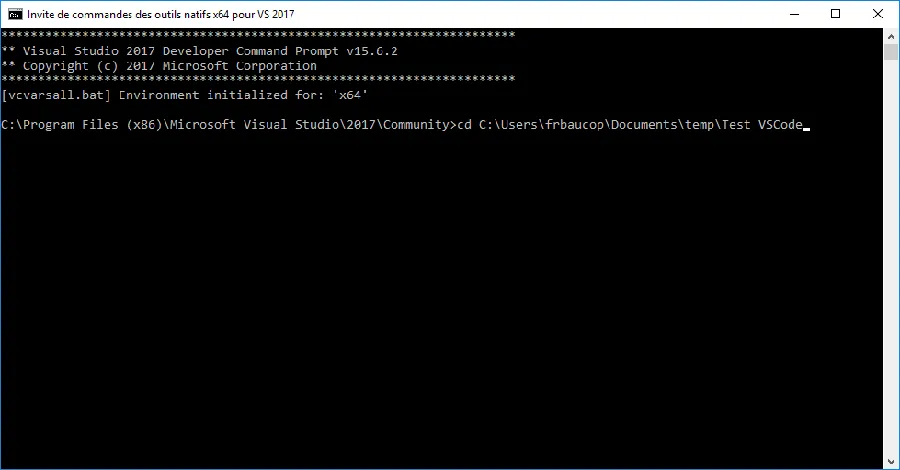
</div>


Make sure the directory is empty (check the "dir" command below) and launch VS Code from there. To do so, simply type "code ." in the console. Do not forget the "."

<div align="center">
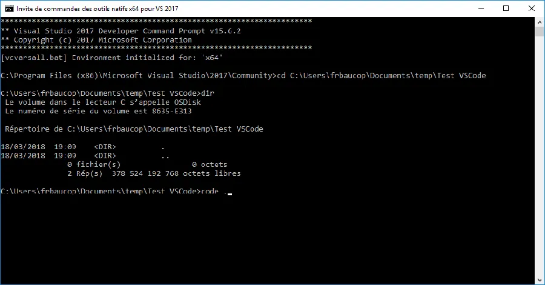
</div>


### Why do I need to open a Developer Command Prompt and launch VS Code manually?

Using a Developer Command Prompt (and not a basic console) helps to make sure that all the paths and environment variables are set up correctly. For example, from a Developer Command Prompt you can invoke "cl" (the Microsoft compiler) while this command might not be successful from a regular console. 

Yes, this is specific to Microsoft compiler. However, if clang in installed, before to jump in VS Code you need to make sure you can invoke it. In other word, you need to make sure the path is set such a way that calling clang does not return an error.

Once VS Code is launched, the directory (workspace) from which we invoked it should be visible on the left-hand side of the environment. Remember that, in the Developer Command Prompt, before to call VS Code, we moved to a directory named ``Test VS Code``. This is what we can see in VS Code hereafter.

<div align="center">
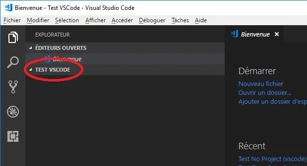
</div>


So far so good. Let's write some complex C++ code to stress our compiler...

CTRL + N to create a new file. Then enter few lines of code.

<div align="center">
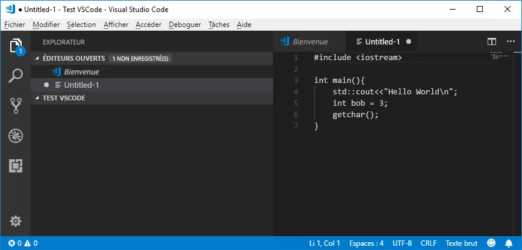
</div>


At this point the code looks "bad" because it is not yet recognized as a C++ code. Let's save it. CTRL + S and let's call it main.cpp.

<div align="center">
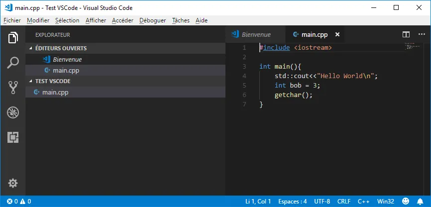
</div>


If the C/C++ extension is installed, then the source code looks much better now. If you find some red squiggles take the time to help Intellisense. This is a particularly worthwhile investment. Indeed, even at this point we can do some interesting stuff like reviewing the code and edit it with the help of Intellisense. See below:

<div align="center">
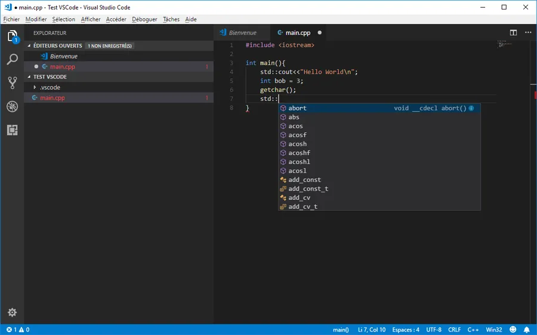
</div>


Ok, now the big question... How do we compile this source code? The point is that VS Code has no idea about the compiler you want to use, where it is in the file system, which parameters to use etc. 

So, we will create what VS Code call a ``Task``. Don't panic... From now, all the modifications will remain localized to the current directory. Nothing will be hidden in the Windows registry nor in some hidden files. In any case, if at one point you get lost... Just delete the ``.vscode`` directory which will be created soon in the current directory and start over the process.

<div align="center">
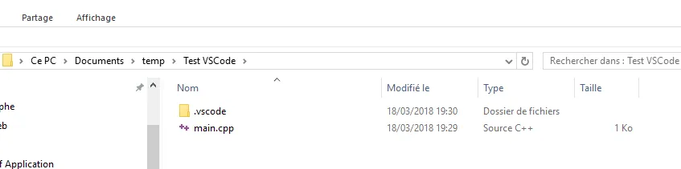
</div>


Ok, now, inside VS Code let's press F1 (or CTRL + SHIFT + P). In the control bar, after the ">" sign, type the word "task" then select the ``Configure Default Build Task`` option.

<div align="center">
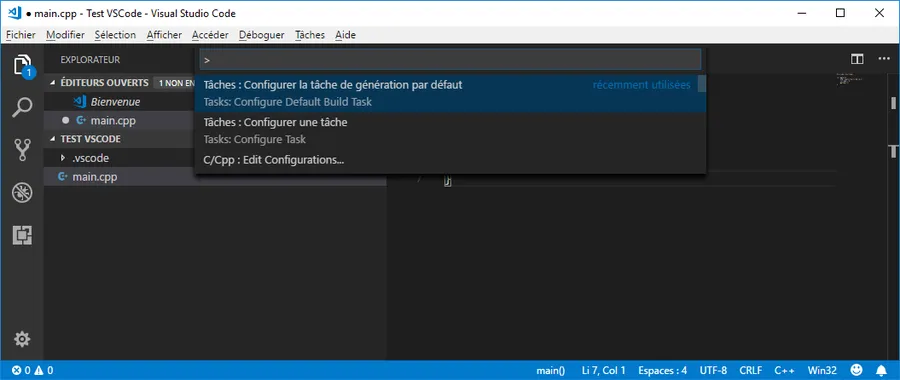
</div>


Now, select the ``Create tasks.json file from a template`` option.

<div align="center">
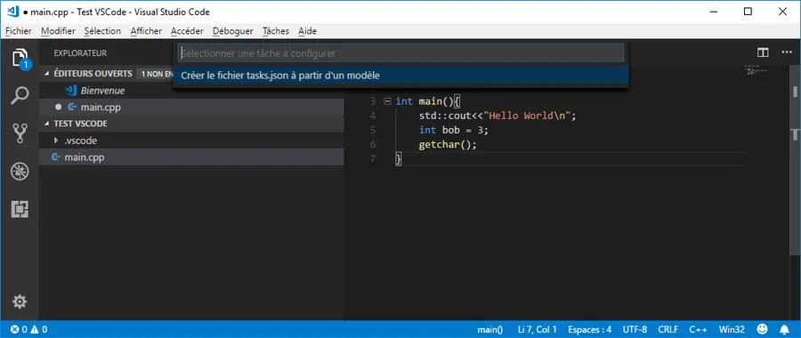
</div>


Finally select ``Other`` since we don't want to use MSBuild, maven etc. to build our application

<div align="center">
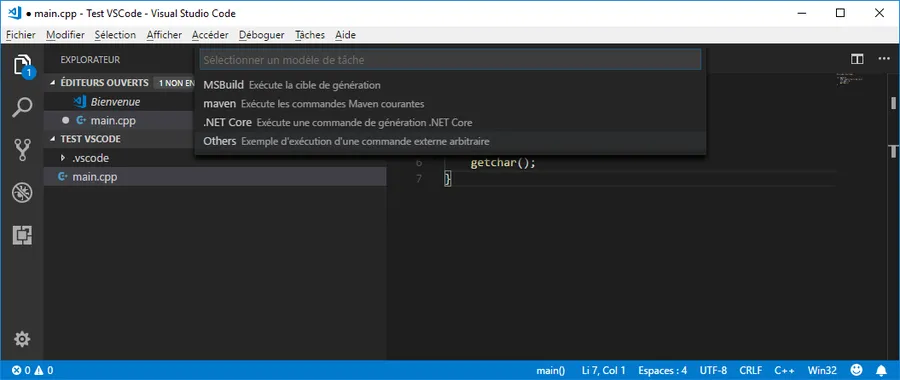
</div>


Once the file is available on screen, I propose to modify it as follow:

<div align="center">
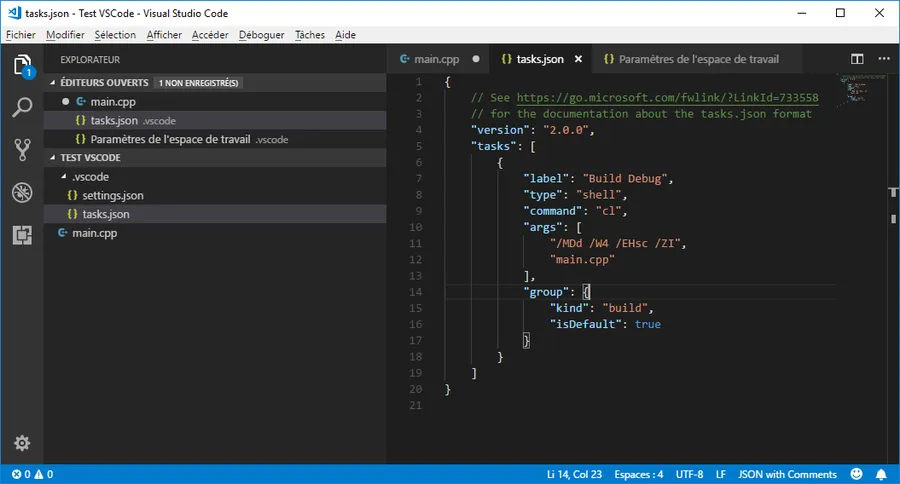
</div>


Here is a version you can copy and paste

```json
{
    "version": "2.0.0",
    "tasks": [
        {
            "label": "Build Debug",
            "type": "shell",
            "command": "cl",
            "args": [
                "/MDd /W4 /EHsc /ZI",
                "main.cpp"
            ],
            "group": {
                "kind": "build",
                "isDefault": true
            }
        }
    ]
}
```

### With VS Code version 1.22.1 and higher 
{: .no_toc }

It seems it is better to put one argument per line and to write the ``tasks.json`` file. See below.

```json
{
    "version": "2.0.0",
    "tasks": [
        {
            "label": "Build Debug",
            "type": "shell",
            "command": "cl",
            "args": [
                "/MDd",
                "/W4",
                "/EHsc",
                "/ZI",
                "main.cpp"
            ],
            "group": {
                "kind": "build",
                "isDefault": true
            }
        }
    ]
}
```

### With 2021, with cl 19.28.29913 and VSCode 1.55.1 
{: .no_toc }

One could try ``tasks.json`` as below:

```json
{
	"version": "2.0.0",
	"tasks": [
		{
			"type": "cppbuild",
			"label": "C/C++: cl.exe build active file",
			"command": "cl.exe",
			"args": [
				"/Zi",
				"/EHsc",
				"/nologo",
				"/Fe:",
				"${fileDirname}\\${fileBasenameNoExtension}.exe",
				"${file}"
			],
			"options": {
				"cwd": "${workspaceFolder}"
			},
			"problemMatcher": [
				"$msCompile"
			],
			"group": "build",
			"detail": "compiler: cl.exe"
		}
	]
}
```

### Can you explain the content of ``task.json``?

* The content of the ``.json`` file is a list of tasks (line 5) that VS Code can execute.
* Here, for the moment, we only have one task. The task is named "Build Debug" (line 7).
* This task instructs VS Code how to build a debug version of our application. To do so VS Code will have to run the command in a shell (line 8)
* and the command will be ``cl`` (line 9). ``cl.exe`` is the name of the Microsoft compiler.
* This command will have a set of arguments (line 11 and 12). If you already have compiled some C++ code in a console you should not be surprised by the parameters. As a remainder:
  + ``/MDd`` tells the compiler to use DLLs (rather than static lib, doing so, the final code is much smaller)
  + ``/W4`` is the highest warning level available
  + ``/EHsc`` is for the exceptions
  + ``/ZI`` is for the format of the debug information.
  + If you want more information, Google is your friend 😁
* At the very end of the file, the "group" (line 14) instructs VS Code that the command will be the default build command. This mean one will be able to invoke it by pressing ``CTRL + SHIFT + B``.

Let's save the ``tasks.json`` file and let's press ``CTRL + SHIFT + B``. If everything works fine the VS Code terminal should show up and display various messages during the build process.

<div align="center">
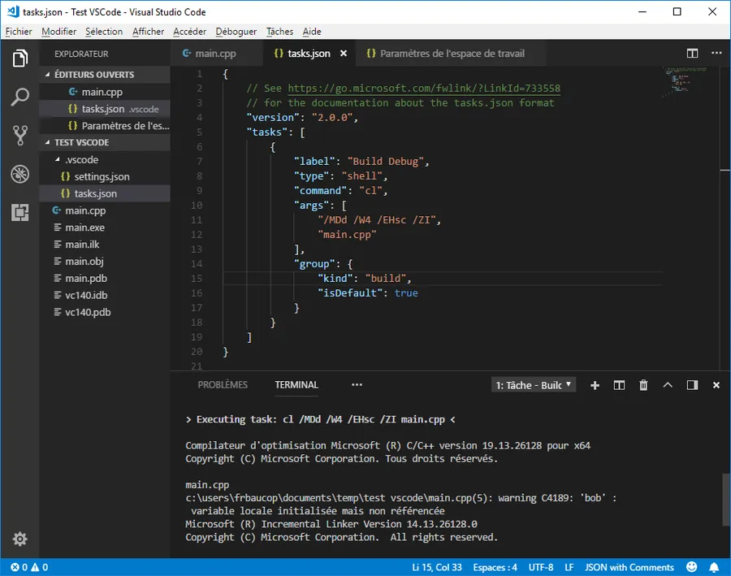
</div>


Finally, we should see the following files in our current folder. Yes, I know, this is a mess...

<div align="center">
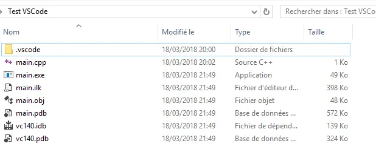
</div>


Anyway, congratulations! We created our first Debug version on the application. 

Few comments however:
1. It would be nice if we could keep our folder as clean as possible. Ideally, we may want to generate the executable and all the other files in a Debug directory
1. So far, the application's name is ``main.exe``. This might be ok, and we may don't care if we do some quick'n dirty testing but if we have more than a file this will not work.

Let's modify the tasks.json file as follow.

<div align="center">
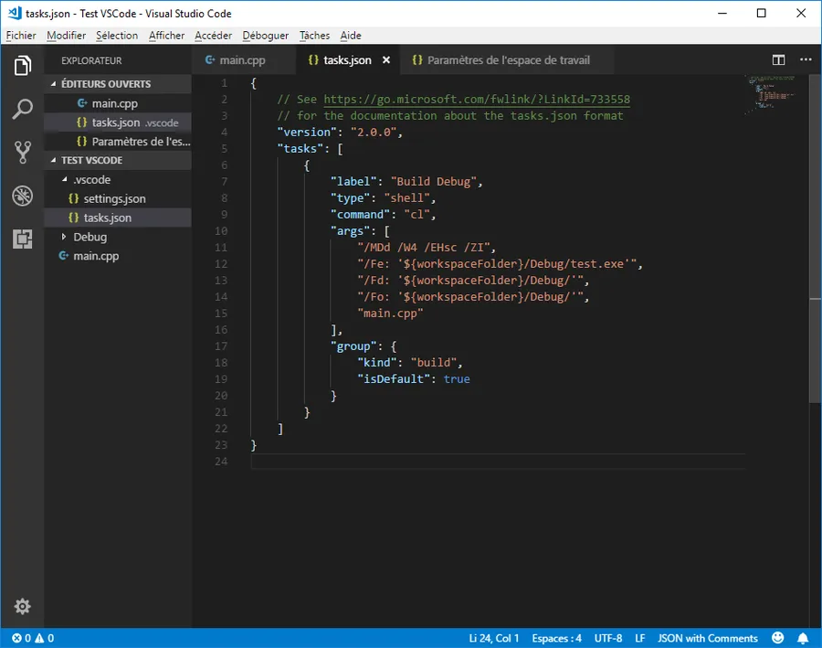
</div>


Again, here is a version you can copy'n paste

```json
{
    "version": "2.0.0",
    "tasks": [
        {
            "label": "Build Debug",
            "type": "shell",
            "command": "cl",
            "args": [
                "/MDd /W4 /EHsc /ZI",
                "/Fe: '${workspaceFolder}/Debug/test.exe'",
                "/Fd: '${workspaceFolder}/Debug/'",
                "/Fo: '${workspaceFolder}/Debug/'",
                "main.cpp"
            ],
            "group": {
                "kind": "build",
                "isDefault": true
            }
        }
    ]
}
```

* Please, note how the ' and the ' are used on lines 12,13 and 14. 
* This is mandatory if the path include spaces between words like in "c:/Program Files (x86)/Hakuna matata/...". 
* In addition, note the use of the variable ``${workspaceFolder}``. 
* VS Code support many other variables. Read [this page](https://code.visualstudio.com/docs/editor/variables-reference) for more information about variables and variables substitution in VS Code.


### With VS Code version 1.22.1 and higher 
{: .no_toc }

One should write:

```json
{
    "version": "2.0.0",
    "tasks": [
        {
            "label": "Build Debug",
            "type": "shell",
            "command": "cl",
            "args": [
                "/MDd",
                "/W4",
                "/EHsc",
                "/ZI",
                "/Fe:${workspaceFolder}/Debug/test.exe",
                "/Fd:${workspaceFolder}/Debug/",
                "/Fo:${workspaceFolder}/Debug/",
                "main.cpp"
            ],
            "group": {
                "kind": "build",
                "isDefault": true
            }
        }
    ]
}
```

## With VS Code 1.55.1 
{: .no_toc }

One could write the ``tasks.json`` as below

```json
{
	"version": "2.0.0",
	"tasks": [
		{
			"type": "cppbuild",
			"label": "Build Debug",
			"command": "cl.exe",
			"args": [
				"/MDd",
				"/Zi",
				"/W4",
				"/EHsc",
				"/nologo",
				"/std:c++latest",
				"/Od",
				"/Fe:",
				"${workspaceFolder}/Debug/${fileBasenameNoExtension}.exe",
				"/Fd:",
				"${workspaceFolder}/Debug/",
				"/Fo:",
				"${workspaceFolder}/Debug/",
				"${file}"
			],
			"options": {
				"cwd": "${workspaceFolder}"
			},
			"problemMatcher": [
				"$msCompile"
			],
			"group": {
				"kind": "build",
				"isDefault": true
			},
			"detail": "compiler: cl.exe"
		}
	]
}
```

Before anything else, let's save the ``tasks.json``.

The additional arguments help to specify:
* The output name with ``/Fe``
* The directory where to store the program database file with ``/Fd``
* The directory where to put the object files with ``/Fo``

To go further, one can read [this page](https://msdn.microsoft.com/en-us/library/fwkeyyhe.aspx) for more information and additional flags.


{: .note }
2018 - I spend 2 days to find and fix a weird issue, so I want to share what I learnt so far. Read below.

The problem was:
* My workspace is on Dropbox. I mean I'm using the exact same source files and scripts in both cases.
* Using one PC I'm able to compile the C++ code from VS Code following the above procedure.
* Using a second PC (same version of Windows, VS Code, Visual Studio, sames plugins...) cl, the Microsoft compiler, is not able to find the file ``main.cpp`` and to compile it

I tried many many things... At the end here is what I keep in mind

1. This is not part of the solution, but it is good to know. You must remember that the escape chars are console dependent. What I mean is:
   1. In a PowerShell terminal one must surround our path with " ' " and " ' ". See the ``'${workspaceFolder}/Debug/test.exe'``  parameter on line 10 of the previous tasks.json.
   2. If you want to use ``cmd`` instead of ``Powershell`` then use \" and \" (read this [page](https://github.com/Microsoft/vscode/issues/31722) for example)
2. The **solution** was to make sure I do not have any script interfering with PowerShell. Since I'm under Windows 10, the default terminal in VS Code is based on Powershell. In my case I have a ``...\MyName\Documents\WindowsPowerShell`` directory which contains a file named ``Microsoft.PowerShell_profile.ps1``. To avoid the problem I had to comment this line :

```
Import-Module 'C:\Users\frbaucop\Downloads\posh-git\src\posh-git.psd1'
```

{: .note }
If you have any issue with VS Code, you can launch it from a console and pass some parameters on the command line interface. You can try ``--verbose`` or ``--disable-extensions`` for example. Read this [page](https://code.visualstudio.com/docs/editor/command-line) for more information.


OK, let's get back on track. One last step to build the code and place it in a dedicated Debug directory... Go back in the directory and do the following:

1. Except for ``main.cpp`` and the ``.vscode`` sub directory, delete all the other files
2. Now, create a ``Debug`` and ``Release`` sub-directories. This can be done from the left-hand side of VS Code or from the included terminal. No need exit the IDE. 

The directory should now look like this:

<div align="center">
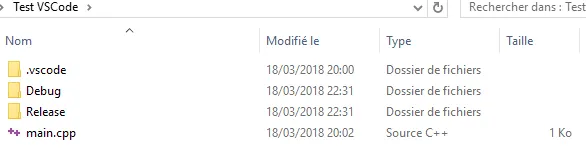
</div>


Ready?  Press CTRL + SHIFT + B. If everything works fine, at the end of the compilation, no new file should be added in the workspace folder, but the Debug should look like this:

<div align="center">

</div>


## Debuging with VS Code

This is all fine but now we would like to go one step further. In fact, it is time to debug our code... To do so, in the Debug menu, select the Open Configurations option

<div align="center">
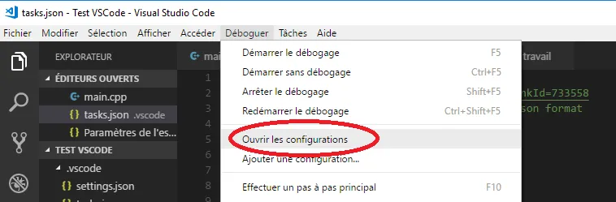
</div>


Then select C++ Windows

<div align="center">
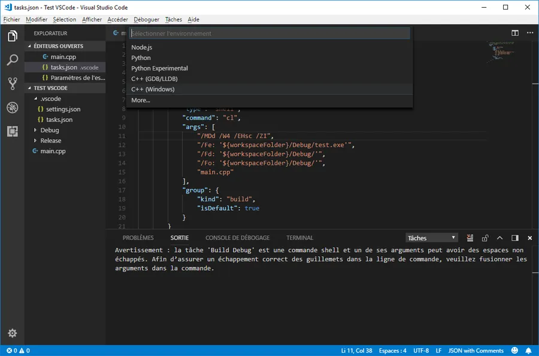
</div>


A ``launch.json`` file like the one below should appear

<div align="center">
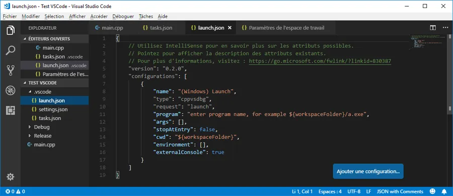
</div>


As requested on line 11, let's modify the program entry. I propose the following modification:

<div align="center">
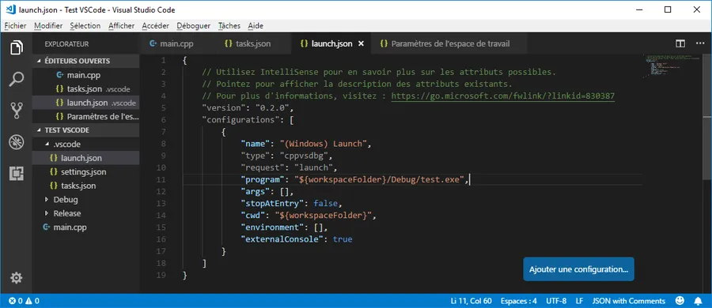
</div>


Now ``program`` points to the debug version of our code, in the ./Debug sub-directory.

{: .note}
I had no need to enclose the path of ``test.exe`` with ' and '.

Finally, it is time to go back to the source code and to set a break point on line 5 for example (``int bob = 3;``)

<div align="center">
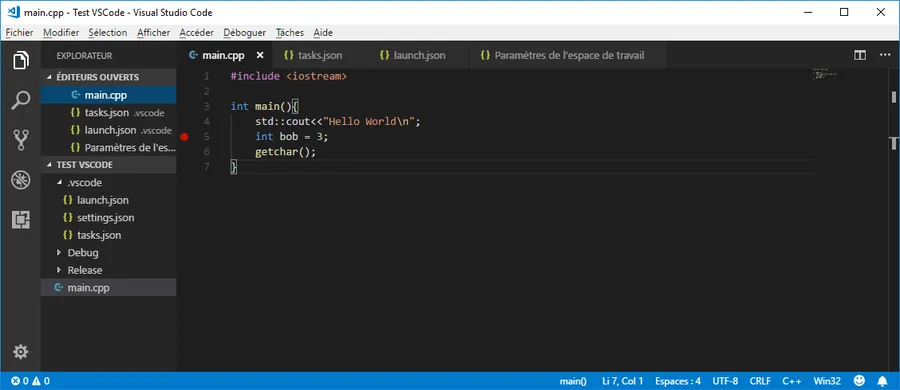
</div>


Ready? Let's strike F5... If everything goes well a console with the canonical greeting message should appear. Much more important, the code should stop on line 5 and VS Code should look like this:

<div align="center">
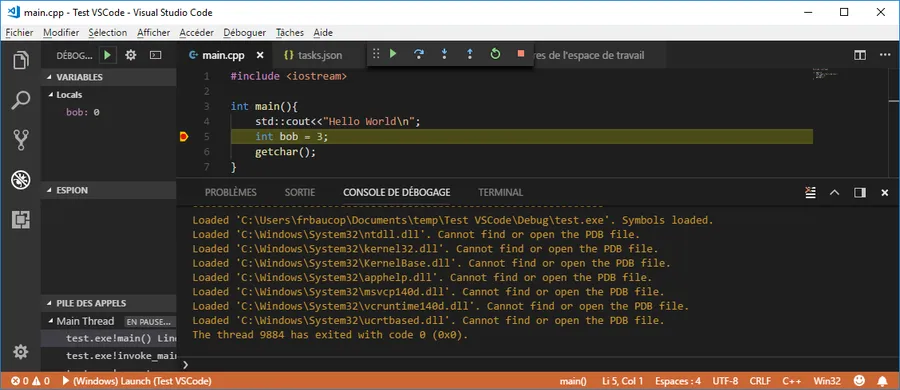
</div>


This is a little miracle... I really like that. The code is stopped. Look on the left hand side, ``bob`` is set to 0. Now, if we press F10, we move one step forward and ``bob`` is set to 3.

<div align="center">
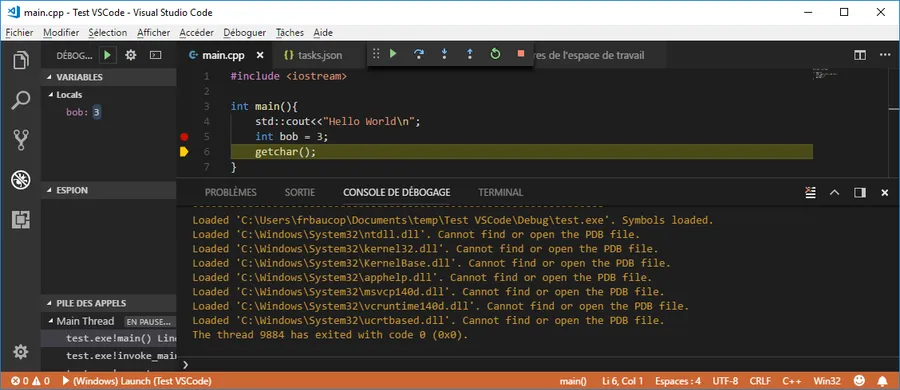
</div>


Ok, let's imagine we have fixed some issues in the code and that everything works as expected. Show times ! Let's compile a released version of the code


## Compiling a release version with VS Code

This is like what we did in the first place with the debug task. Let's edit the ``tasks.json`` and let's modify it as follow.

<div align="center">
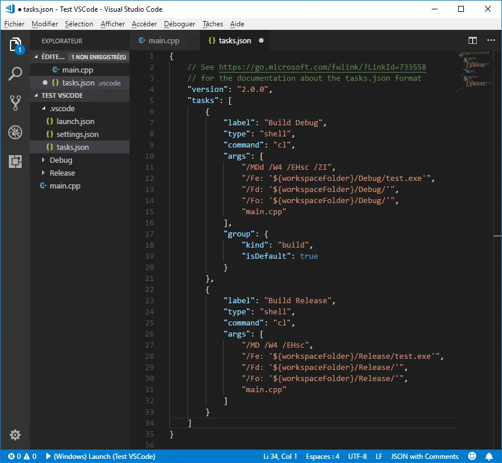
</div>


Here is a text version of the file

```json
{
    "version": "2.0.0",
    "tasks": [
        {
            "label": "Build Debug",
            "type": "shell",
            "command": "cl",
            "args": [
                "/MDd /W4 /EHsc /ZI",
                "/Fe: '${workspaceFolder}/Debug/test.exe'",
                "/Fd: '${workspaceFolder}/Debug/'",
                "/Fo: '${workspaceFolder}/Debug/'",
                "main.cpp"
            ],
            "group": {
                "kind": "build",
                "isDefault": true
            }
        },
        {
            "label": "Build Release",
            "type": "shell",
            "command": "cl",
            "args": [
                "/MD /W4 /EHsc",
                "/Fe: '${workspaceFolder}/Release/test.exe'",
                "/Fd: '${workspaceFolder}/Release/'",
                "/Fo: '${workspaceFolder}/Release/'",
                "main.cpp"
            ]
        }
    ]
}
```

Pay attention to the "," on line 21 which separates the two tasks in the list. For the rest, the second task is named ``Build Release``, the arguments no longer include debug option and the output subdirectory now points to the ``Release`` subdirectory. No major surprise...

### With VS Code version 1.22.1 and higher 
{: .no_toc }

You should write

```json
{
    "version": "2.0.0",
    "tasks": [
        {
            "label": "Build Test",
            "type": "shell",
            "command": "cl",
            "command": "cl",
            "args": [
                "/MDd",
                "/W4",
                "/EHsc",
                "/ZI",
                "/std:c++17",
                "/Od",
                "/Fe:${workspaceFolder}/Debug/test.exe",
                "/Fd:${workspaceFolder}/Debug/",
                "/Fo:${workspaceFolder}/Debug/",
                "main.cpp"
            ],
            "group": {
                "kind": "build",
                "isDefault": true
            }
        },
        {
            "label": "Build Release",
            "type": "shell",
            "command": "cl",
            "args": [
                "/MD",
                "/W4",
                "/EHsc",
                "/std:c++17",
                "/O2",
                "/Fe:${workspaceFolder}/Release/test.exe",
                "/Fd:${workspaceFolder}/Release/",
                "/Fo:${workspaceFolder}/Release/",
                "main.cpp"
            ]
        }
    ]
}
```

### With VSCode 1.55.1 
{: .no_toc }

One could try ``tasks.json`` as below:

```json
{
	"version": "2.0.0",
	"tasks": [
		{
			"type": "cppbuild",
			"label": "Build Debug",
			"command": "cl.exe",
			"args": [
				"/MDd",
				"/Zi",
				"/W4",
				"/EHsc",
				"/nologo",
				"/std:c++latest",
				"/Od",
				"/Fe:",
				"${workspaceFolder}/Debug/${fileBasenameNoExtension}.exe",
				"/Fd:",
				"${workspaceFolder}/Debug/",
				"/Fo:",
				"${workspaceFolder}/Debug/",
				"${file}"
			],
			"options": {
				"cwd": "${workspaceFolder}"
			},
			"problemMatcher": [
				"$msCompile"
			],
			"group": {
				"kind": "build",
				"isDefault": true
			},
			"detail": "compiler: cl.exe"
		},
		{
			"type": "cppbuild",
			"label": "Build Release",
			"command": "cl.exe",
			"args": [
				"/MD",
				"/W4",
				"/EHsc",
				"/nologo",
				"/std:c++latest",
				"/O2",
				"/Fe:",
				"${workspaceFolder}/Release/${fileBasenameNoExtension}.exe",
				"/Fd:",
				"${workspaceFolder}/Release/",
				"/Fo:",
				"${workspaceFolder}/Release/",
				"${file}"
			],
			"options": {
				"cwd": "${workspaceFolder}"
			},
			"problemMatcher": [
				"$msCompile"
			],
			"group": {
				"kind": "build",
				"isDefault": true
			},
			"detail": "compiler: cl.exe"
		}
	]
}
```

OK, let's save the latest version of ``tasks.json``

Now click on the ``Tasks`` menu (ALT+T) and select the ``Execute Task`` option. In the list select the ``Build Release`` option. Alternatively, you can strike **CTRL+ALT+B** and select the ``Build Release`` option.

<div align="center">
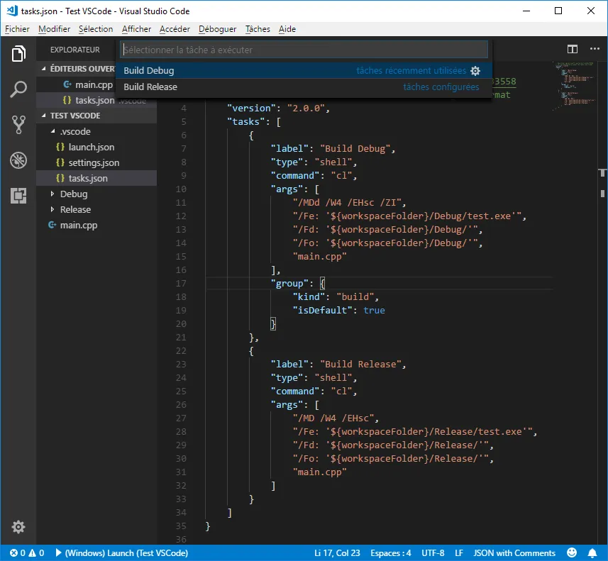
</div>


You may have to select one additional option saying something like "Continue without analyzing the output of the task" (I'm not sure about the purpose of the different options available here...).

<div align="center">
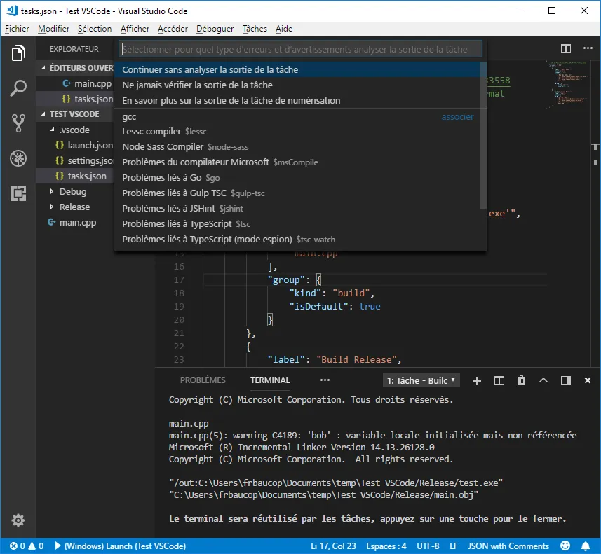
</div>


At the end, the ``Release`` subdirectory should look like this:

<div align="center">
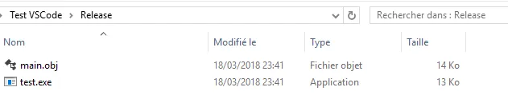
</div>


We can now double click on ``test.exe``. When the console is on screen while ``getchar()`` is waiting, we can press ``CTRL + ALT + SUPP``, select the ``Task Manager`` and find ``test.exe`` in the list

<div align="center">
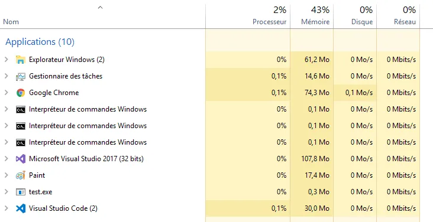
</div>


Since there is no "(32 bits)" after the name of the application this confirms our application is 64 bits. This is a confirmation of the fact that I ran an x64 Developper Command Prompt at the very beginning and in this context we generated a 64 bits applications.


## Compiling multiple files project

If the project includes multiple cpp files like the one below where ``myfunction()`` is hosted in ``mylib.cpp``

<div align="center">
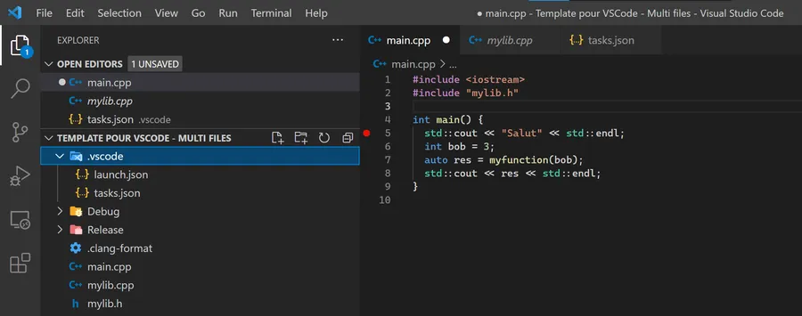
</div>


We can use a ``tasks.json`` similar to the one here below:

```json
{
	"version": "2.0.0",
	"tasks": [
		{
			"type": "cppbuild",
			"label": "Build Debug",
			"command": "cl.exe",
			"args": [
				"/MDd",
				"/Zi",
				"/W4",
				"/EHsc",
				"/nologo",
				"/std:c++latest",
				"/Od",
				"/Fe:",
				"${workspaceFolder}/Debug/${fileBasenameNoExtension}.exe",
				"/Fd:",
				"${workspaceFolder}/Debug/",
				"/Fo:",
				"${workspaceFolder}/Debug/",
				"${workspaceFolder}/*.cpp"
			],
			"options": {
				"cwd": "${workspaceFolder}"
			},
			"problemMatcher": [
				"$msCompile"
			],
			"group": {
				"kind": "build",
				"isDefault": true
			},
			"detail": "compiler: cl.exe"
		},
		{
			"type": "cppbuild",
			"label": "Build Release",
			"command": "cl.exe",
			"args": [
				"/MD",
				"/W4",
				"/EHsc",
				"/nologo",
				"/std:c++latest",
				"/O2",
				"/Fe:",
				"${workspaceFolder}/Release/${fileBasenameNoExtension}.exe",
				"/Fd:",
				"${workspaceFolder}/Release/",
				"/Fo:",
				"${workspaceFolder}/Release/",
				"${workspaceFolder}/*.cpp"
			],
			"options": {
				"cwd": "${workspaceFolder}"
			},
			"problemMatcher": [
				"$msCompile"
			],
			"group": {
				"kind": "build",
				"isDefault": true
			},
			"detail": "compiler: cl.exe"
		}
	]
}
```

Please note that the ``${file}`` had been replaced by ``${workspaceFolder}/*.cpp`` (line 22 for example).


### What if the includes files are in a specific directory?

In the example below, ``mylib.h`` is in a directory named ``include``. Please note that now line 2 is ``#include <mylib.h>`` and no longer #include ``mylib.h``

<div align="center">
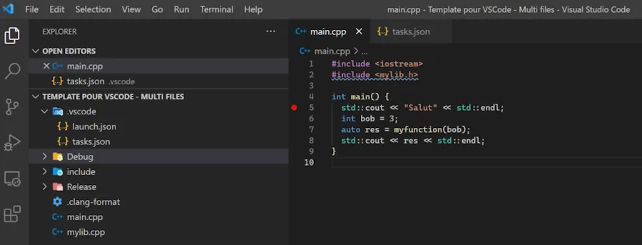
</div>


One could use a tasks.json like this one and keep an eye on line 16 and note the "/I" followed with the ``${workspaceFolder}/include/`` argument.

```json
{
	"version": "2.0.0",
	"tasks": [
		{
			"type": "cppbuild",
			"label": "Build Debug",
			"command": "cl.exe",
			"args": [
				"/MDd",
				"/Zi",
				"/W4",
				"/EHsc",
				"/nologo",
				"/std:c++latest",
				"/Od",
				"/I",
				"${workspaceFolder}/include/",
				"/Fe:",
				"${workspaceFolder}/Debug/${fileBasenameNoExtension}.exe",
				"/Fd:",
				"${workspaceFolder}/Debug/",
				"/Fo:",
				"${workspaceFolder}/Debug/",
				"${workspaceFolder}/*.cpp"
			],
			"options": {
				"cwd": "${workspaceFolder}"
			},
			"problemMatcher": [
				"$msCompile"
			],
			"group": {
				"kind": "build",
				"isDefault": true
			},
			"detail": "compiler: cl.exe"
		},
		{
			"type": "cppbuild",
			"label": "Build Release",
			"command": "cl.exe",
			"args": [
				"/MD",
				"/W4",
				"/EHsc",
				"/nologo",
				"/std:c++latest",
				"/O2",
				"/I",
				"${workspaceFolder}/include/",
				"/Fe:",
				"${workspaceFolder}/Release/${fileBasenameNoExtension}.exe",
				"/Fd:",
				"${workspaceFolder}/Release/",
				"/Fo:",
				"${workspaceFolder}/Release/",
				"${workspaceFolder}/*.cpp"
			],
			"options": {
				"cwd": "${workspaceFolder}"
			},
			"problemMatcher": [
				"$msCompile"
			],
			"group": {
				"kind": "build",
				"isDefault": true
			},
			"detail": "compiler: cl.exe"
		}
	]
}
```

## Conclusion

We learnt a lot and ``tasks.json`` is now more than 70 lines. However, we should not forget that VSCode helps us to write and experiment with C++ very quickly. 

Let's review the basic process:
* Open x64 Native Tools Command Prompt for VS 2019
* ``mkdir`` a directory to host your project
* ``cd`` into the directory
* Invoke ``code .`` from the prompt (don't forget the dot)
* Write and save a ``test.cpp`` file
* ``CTRL + SHIFT + B`` to build the application
* Done! A ``test.exe`` is in the current directory
* ``CTRL + SHILF + ù`` (french keyboard) to open a terminal
* Invoke ``./test.exe`` from the terminal

Do you want to debug your code? Strike F5 and VSCode will do everything for you.

This said, if :
* your code grows
* you have multiple files
* you want to keep your directories well organized 
* you want to generate debug and release versions 
* you want to use specific compiler argument (``/std:c++latest`` for example)

then I hope this article has been helpful.