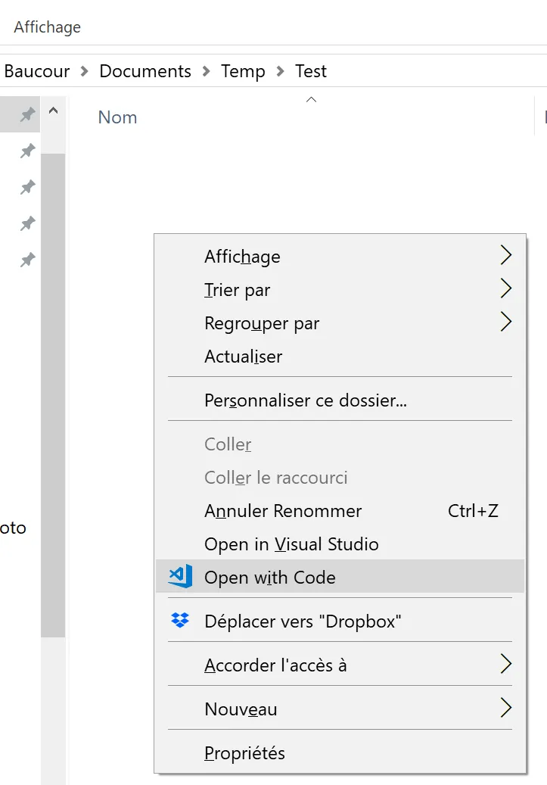

# C++ with VS Code & Clang
{: .no_toc }


## Table of Contents
{: .no_toc .text-delta}
- TOC
{:toc}


## Introduction
Bonjour. Today, under Windows, we will use VS Code to compile and link C++ code with Clang.

* Windows is running
* [Install VS Code](https://code.visualstudio.com/). In April 2018, I use 1.21.1.
* Launch VS Code and then install the C/C++ for Visual Studio Code extension. Use the extension icon on the left or press **CTRL+SHIFT+X**

<div align="center">

</div>

* [Install LLVM](http://releases.llvm.org/). In April 2018 you should install LLVM 6.0 or higher. During installation make sure to check the box saying "**Make LLVM Tools available in current user path**" or similar. By default LLVM tools are **NOT** in your path.
* Install [Visual Studio Build Tools](https://www.visualstudio.com/fr/downloads/). Scroll down the page, the link to the Build Tools is very close to the bottom of the page. Again, this is not a Visual Studio Express 2017 installer. Instead this is a package which provides all the tools and libs you need to compile and link code under Windows. Among other things it provides the libs that are not coming with the LLVM installer. Again this pack does **NOT** provide Visual Studio IDE nor VS Code.

From the tooling stand point we are ready. Let's set up the "project".

* With file Explorer create a directory where the files of the project will take place. 
* Don't worry, nothing will be created outside this directory. If at one point you get lost, delete everything except the source code (``main.cpp``, see below) and start again the checklist.
* Once the directory is created in file Explorer, open it, right click then select "Open with Code" option.

<div align="center">

</div>

* Once in VS Code, create a new file, copy and paste the code below

```cpp
#include <iostream>
#include <string_view>

int main(){
    std::string_view s = "Greetings professor FALKEN, how about a nice game of chess?\n";
    std::cout << s;
    getchar();
    return 0;
}
```
VS Code should look like this :

<div align="center">

</div>

* Save the file as ``main.cpp`` in the current workspace (the directory from where you launched VSCode)


## Configuration of the C++ context

* Press **F1** and then type "cpp" in the bar
* Select the ``C/Cpp : edit configuration`` option

<div align="center">

</div>

* An auto-generated ``c_cpp_properties.json`` file should appear. Save it pressing **CTRL+S**
* At this point a ``./.vscode`` subdirectory should be created. 
    * We can see it in the file tree on the left hand side of VS Code as well as in file Explorer. Here is how it looks in VS Code

<div align="center">

</div>

* Here is what happen in file Explorer.

<div align="center">

</div>


## Compilation with VS Code

* Press **ALT+T** then select the ``Configure Default Build Task`` option
* Select the ``Create tasks.json file from a template``  option
* Select ``Others`` since we don’t want to use MSBuild, maven etc. to build our application

<div align="center">

</div>

* Modify the generated file as follow

```json
{
  "version": "2.0.0",
  "tasks": [
    {
      "label": "clang-cl Debug",
      "type": "shell",
      "command": "clang-cl",
      "args": [
        "main.cpp",
        "/Z7 /MDd /W4 /EHsc /std:c++17 /Od",
        "/o Debug/Test.exe",
      ],
      "group": {
        "kind": "build",
        "isDefault": true
      }
    },
    {
      "label": "clang-cl Release",
      "type": "shell",
      "command": "clang-cl",
      "args": [
        "main.cpp",
        "/MD /W4 /EHsc /std:c++17 /O2",
        "/o Release/Test.exe",
      ],
    }
  ]
}
```
### With VS Code 1.22.1 and higher you should set one arg per line

Pay attention on how the **spaces are escaped** on the ``/o`` and ``/link`` line. At the end, ``tasks.json`` should look like as follow :

```json
{
  "version": "2.0.0",
  "tasks": [
    {
      "label": "clang-cl Debug",
      "type": "shell",
      "command": "clang-cl",
      "args": [
        "main.cpp",
        "/Z7",
        "/MDd",
        "/W4",
        "/EHsc",
        "/std:c++17",
        "/Od",
        "/o' 'Debug/Test.exe",
        "/link' 'User32.lib"
      ],
      "group": {
        "kind": "build",
        "isDefault": true
      }
    },
    {
      "label": "clang-cl Release",
      "type": "shell",
      "command": "clang-cl",
      "args": [
        "main.cpp",
        "/MD",
        "/W4",
        "/EHsc",
        "/std:c++17",
        "/O2",
        "/o' 'Release/Test.exe",
        "/link' 'User32.lib"
      ],
    }
  ]
}
```

* Save the ``tasks.json`` file with **CTRL+S**. The file will be saved in the ``./.vscode`` subdirectory

<div align="center">

</div>

* Create a ``./Debug`` and a ``./Release`` subdirectories in the initial directory. This can be done with VS Code, with file Explorer or a terminal within VS Code.


<div align="center">

</div>


* Press **CTRL+SHIFT+B** to compile and link the debug version of the code
* 3 new files should appear in the ``./Debug`` subdirectory (``Test.exe``, ``.ilk`` and ``.pdb``)


<div align="center">

</div>


## Debugging with VS Code

* In order to debug the code, press **F5**
* Select "C++ (Windows)" among the different options


<div align="center">

</div>


* VS Code will generate a default launch.json file. Modify the file as follow

```json
{
  "version": "0.2.0",
  "configurations": [
    {
      "name": "(Windows) Launch",
      "type": "cppvsdbg",
      "request": "launch",
      "program": "${workspaceFolder}/Debug/Test.exe",
      "args": [],
      "stopAtEntry": false,
      "cwd": "${workspaceFolder}",
      "environment": [],
      "externalConsole": true
    }
  ]
}
```

* Save the file with **CTRL+S**. A ``launch.json`` file is created in the ``./.vscode`` subdirectory
* In the ``main.cpp`` source code set a breakpoint on line 5 for example (click in the left margin)


<div align="center">

</div>


* Press **F5**
* The code should start and stop on the breakpoint
* Strike **F10** to go one step further. The string_view variable ``s`` should be initialized.

<div align="center">

</div>


* At this point you can either press **F5** to continue or to press **SHIFT+F5** to stop the debug session.


## Compile a release version with VS Code

* Press **ALT+T**
* Select Execute the task
* Select ``clang-cl Release`` in the list
* Press ``Enter`` on the next option
* ``Test.exe`` should be generated in the ``./Release`` subdirectory


<div align="center">

</div>


## Linking with Windows libraries

* Modify main.cpp as follow

```cpp
#include <iostream>
#include <string_view>
#include <windows.h>

int main(){
    std::string_view s = "Greetings professor FALKEN, how about a nice game of chess?\n";
    std::cout << s;
    MessageBoxW(NULL, L"My message", L"My title", MB_OK);
    getchar();
    return 0;
}
```

* If you press **CTRL+SHIFT+B** you can't link the code because some library are missing


<div align="center">

</div>


* Edit the ``tasks.json`` file and modify it as follow

```json
{
  "version": "2.0.0",
  "tasks": [
    {
      "label": "clang-cl Debug",
      "type": "shell",
      "command": "clang-cl",
      "args": [
        "main.cpp",
        "/Z7 /MDd /W4 /EHsc /std:c++17 /Od",
        "/o Debug/Test.exe",
        "/link User32.lib"
      ],
      "group": {
        "kind": "build",
        "isDefault": true
      }
    },
    {
      "label": "clang-cl Release",
      "type": "shell",
      "command": "clang-cl",
      "args": [
        "main.cpp",
        "/MD /W4 /EHsc /std:c++17 /O2",
        "/o Release/Test.exe",
        "/link User32.lib"
      ],
    }
  ]
}
```

* Save the file **CTRL+S**
* Press **F5** to run a debug session
* A message box should appear on the screen when you execute line 8.


<div align="center">

</div>


In order to create a Release version of the code with the message box you follow exactly the same steps as before : 
* **ALT+T**
* Select ``Execute the task...``
* Select ``clang-cl Release``, press **ENTER**

You are all set. Enjoy 😁