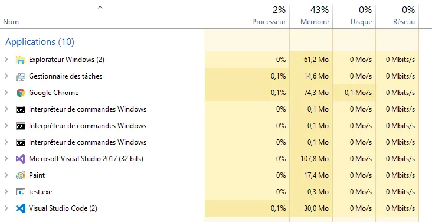

# C++ with VS Code, CMake & NMake
{: .no_toc }


## Table of Contents
{: .no_toc .text-delta}
- TOC
{:toc}


## Introduction
Bonjour. Today, under Windows, we will use VS Code to compile and link C++ code with CMake and NMake. As you will see the compiler and the linker I use are the ones coming with Visual Studio 2017. However the steps explained here below would be similar if you use another toolchain (clang, Intel...).

Oh, by the way... Before to read further, I realize you need to know (more or less) what is CMake, Make (or NMake) and a Makefile. Yes, I will give some short explanations but this page is **NOT** a CMake tutorial. As for everything else, YouTube is your friend : [here](https://youtu.be/HPMvU64RUTY) and [there](https://youtu.be/elycr5wi9_g) for example.


## Software setup
First thing first, few words about is the settings :

* I'm using Windows.
* [Visual Studio 2017](https://www.visualstudio.com/fr/downloads/?rr=https%3A%2F%2Fwww.google.fr%2F) (15.6.2) is installed and the C++ "load" is up and running. I mean you are able to compile a C++ project with Visual Studio 2017. If you really don't want to install Visual Studio Code 2017 (this is a mistake because the debugger is, by far, one of the best available) you could install the [Visual Studio Build Tools](https://www.visualstudio.com/fr/downloads/) (make sure to scroll down the page). Basically it includes everything needed (compiler, linker etc.) except the Visual Studio IDE itself.
* [VS Code](https://code.visualstudio.com/) (1.21.1) is also installed (otherwise this page makes no sense 😁 )
* You don't have to but if you plan to edit some C++ code in VS Code I would recommend to install the "C/C++" extension for Visual Studio Code.


<div align="center">

</div>


* Since we are going to use [CMake](https://cmake.org/download/), it should be installed as well. If you run Windows 10, on the web page select the last stable version (as today, March 2018 select [cmake-3.10.3-win64-x64.msi](https://cmake.org/files/v3.10/cmake-3.10.3-win64-x64.msi)). Once downloaded, run the installer, says yes to everything. Done !

<div align="center">

</div>


## Compile a debug version with CMake, NMake and VS Code

From the Visual Studio 2017 group, open a Developer Command Prompt. If you either select the ``Developer Command Prompt`` or the Native x86 Developer Command Prompt then the generated code will be 32 bits. If you open the ``x64 Developper Command Prompt`` then the generated code will be 64 bits.

<div align="center">

</div>


Here, I choose the ``x64 Developper Command Prompt``. Once the console is open, move to the directory where you want to make your tests (see the ``cd`` command below)

<div align="center">

</div>


Make sure the directory is empty (see the ``dir`` command) then launch VS Code from there. To do so, type ``code .`` in the console. Do not forget the "." at the end of the command.

<div align="center">

</div>

### Why do I need to open a Developer Command Prompt and launch VS Code manually?

Using a Developer Command Prompt (and not a basic/classic/regular console) helps to make sure that all the paths and environment variables are set up correctly. For example from a Developer Command Prompt you can invoke "cl" (the C/C++ compiler-linker from Microsoft) while this command might not be successful from a "basic" console. 

Yes, this is specific to Microsoft compiler. For example, if you want to make your tests with clang front-end, before to run VS Code you need to make sure you can call "clang" from a console. In other words, you need to make sure that the path is set such that calling clang does not return any error. Once this is done, yes, you do not need to open a console and you can open VS Code as you use to (press the Win key, type "co", Visual Studio Code should appear first in the best results list, strike ENTER)

<div align="center">

</div>


Again, before to run VS Code, we make sure all the environment variables and paths are set up correctly. Just to make sure you realize what we are talking about, switch back to the console (ALT + TAB) and type "set" in the command line... Enjoy the reading. It is very instructive. Seriously, read it!

<div align="center">

</div>


OK, switch back to VS Code with ALT + TAB. The directory (I should say workspace) from which we invoked VS Code should be visible on the left hand side of the environment. Remember that, in the Developer Command Prompt, before to call VS Code, we moved to a directory named ``Test CMake VSCode``. This is what we can see in VS Code below :

<div align="center">

</div>


So far so good. Let's write some code... However, in order to have a well organized project we will put our source code in a subdirectory. In VS Code, bring the cursor on the name of the workspace (Test CMake VSCode) and click on the "+folder" icon when it becomes visible

<div align="center">

</div>


Type ``src``.   
Now highlight the subdirectory named ``src`` then click on the "+file" icon

<div align="center">

</div>


Finally type ``main.cpp``. You can now type the code of the application in ``main.cpp``. Your VS Code environment should be similar to the following :

<div align="center">

</div>


Here is a version of the code you can copy'n paste

```cpp
#include <iostream>

int main() {
  std::cout << "Hello World\n";
  int bob = 3;
  getchar();
}
```

Ok... Now the big question... How do we compile the code ? In another [page]() I already explained how to invoke the C++ compiler that comes with Visual Studio (cl). 

Here, we are going to play another game and we will use **CMake** (and a ``CMakeLists.txt`` file) then call **NMake** from VS Code.

Just to make sure we all know where we go, here is how our journey will look like :

1. We will create a ``CMakeLists.txt`` file (I will later explain what it is)
2. We will write a first VS Code task which will call ``CMake`` in order to process the ``CMakeLists.txt`` file and generate a Makefile specific to a Debug version of our application.
3. We will write a VS Code task which will invoke ``NMake`` in order to process the generated Makefile. This is this task which will generate the executable in Debug (respectively Release) version.
4. We will tell VS Code how to debug our application when it is in Debug mode
5. We will write a last VS Code task which will call ``CMake`` in order to process the ``CMakeLists.txt`` file and generate a Makefile specific to a Release version of our application.

When everything will be in place, for the developer, the workflow will be as follow :

1. Run once the task which generates the Makefile of the Debug version
2. While editing the code, call, many many times the task that invoke NMake. This will generate a new Debug versions each time.
3. Debug, debug and debug again the application
4. When the application is bug free, run the task which generates the Makefile of the Release version
5. Call the task that invoke NMake. This will generate a Release version of the application.


### Is it worth it?

Why one would follow such process rather than calling the compiler available locally (as explained in this [page]() for example) ?

Well, among all the good reasons to use CMake and Make, here are 2 scenarios which may happen:
1. You get from GitHub a project that comes with a ``CMakeLists.txt``. In this case, if you want to edit and debug the code from VS Code you have to use CMake from VS Code.
2. You may be working on  project which is **multi-platforms**. In this case, rather than to get locked within the CodeBlocks or the XCode way of describing the projects, it is safer to use CMake in order to describe how to build the project on the various platforms you are targeting. On Windows you could ask CMake to generate a Visual Studio 2017 project (and solution) while under Linux you could ask to get a Makefile. For example, here, and even if Visual Studio is available, I will ask CMake to generate a Makefile which will be processed by NMake (the Make application from Microsoft).

Are you still with me? OK ! 

At this point, this is not mandatory, but it doesn't hurt. You should install the CMake plug'in for VS Code. See below :

<div align="center">
&nbsp;

&nbsp;
</div>


Next, press **CTRL + N** to create a new file. Then press **CTRL + S** to save it. Name it ``CMakeLists.txt`` and make sure to save it in the directory **above** ``./src``. When this is done, the VS Code workspace should look like this :

<div align="center">
&nbsp;

&nbsp;
</div>

Again, this page is not the the best place to explain CMake. However, what I can say is that we will use this **C**ross **Make** to explain what is needed to build the project. This description in totally independent from the OS (Windows, Linux...). Let's see how a description looks like. To do so, type the following instructions in the file CMakeLists.txt.

```
cmake_minimum_required (VERSION 3.0.0)

project (Test)
set(EXECUTABLE_OUTPUT_PATH ./${CMAKE_BUILD_TYPE})

set (SOURCE src/main.cpp)

add_executable (${PROJECT_NAME} ${SOURCE})
```

VS Code should look like this :

<div align="center">

</div>


This is the CMake plugin which provides colored syntax and code completion.

In plain English the code above says :

1. Make sure CMake 3.0.0 or higher is available on the machine (line 1)
2. No matter the IDE I'm working for (Visual Studio, Make files NMake files, CodeBlocks...) the project will be named Test (line 3)
3. When it will be built, the executable will be either in a Debug or a Release sub directory (line 4). The ``${CMAKE_BUILD_TYPE}`` variable takes the value "Debug" or "Release" on whether the configuration is Debug or Release.
4. Let's create a variable named ``SOURCE`` which includes only one file so far. The name of the file is ``main.cpp`` (line 6) and it is in the ``./src`` subdirectory. And yes, there is no comma between parameters of the set "function call".
5. The target is an executable whose name is deduced from the name of the project (see the parameter ``${PROJECT_NAME}``) and which is built with all the source files.

Just to make sure, the file could be even shorter. For example, a bare minimal version could look like :

```
cmake_minimum_required (VERSION 3.0.0)
add_executable (Test src/main.cpp)
```

Just to make sure also... If you have more than one file in the ``./src`` directory you could modify the ``CMakeLists.txt`` as follow :

```
cmake_minimum_required (VERSION 3.0.0)

project (Test)
set(EXECUTABLE_OUTPUT_PATH ./${CMAKE_BUILD_TYPE})

file(
    GLOB_RECURSE
    MY_SOURCE_FILES
    src/*
)

add_executable (${PROJECT_NAME} ${MY_SOURCE_FILES})
```

{: .note }
In most other articles about CMake it is usual to save the ``CMakeLists.txt`` file in the directory where the source files are. If the project is large and include many sub-projects with many subdirectories it really make sense to include a ``CMakeLists.txt`` file in each directory. Each file is then responsible to build a component of the project with the source code of the directory. At the end, a final ``CMakeLists.txt`` seated in the top directory and is in charge of calling each ``CMakeLists.txt`` file recursively. Here, the project is very simple and it includes only one source code. This is why I decided to put everything in the ``CMakeLists.txt`` file which is in the top directory.

Again this is not a training course about CMake (do not hesitated to invest some time on YouTube) but one can note that nothing is related to any OS. In fact, one can think about ``CMakeLists.txt`` as a recipe on how to build the executable but a recipe that is platform independent. Lest's save this file with **CTRL + S**.

Now we need to be able to call CMake from VS Code in order to generate a Makefile corresponding to the Debug version of our application. From inside VS Code let's press **F1** or **CTRL + SHIFT + P**. On the prompt (see the '>' in the bar) type ``task`` then use the down arrow key to select ``Configure task`` and hit **ENTER**.

<div align="center">

</div>


Then select ``Create tasks.json file from a template``

<div align="center">

</div>


Finally select ``Other`` since we don't want to use MSBuild, maven etc.

<div align="center">

</div>


Once the ``tasks.json`` file is visible I propose to modify it as follow :

<div align="center">

</div>


Here is a version you can copy and paste

```
{
    "version": "2.0.0",
    "tasks": [
        {
            "label": "CMake Debug",
            "type": "shell",
            "options": {
                "cwd": "${workspaceRoot}/build"
            },
            "command": "CMake",
            // Define CMAKE_BUILD_TYPE variable because makefiles generated by CMake are single-configuration.
            "args": ["-G 'NMake Makefiles' -DCMAKE_BUILD_TYPE=Debug .."]
        }
     ]
}
```

### Can you explain the content of ``tasks.json``?

In fact VS Code knows nothing about CMake (or any other process) so we need to tell it how to call the external tools we want to work with. To do so we use a tasks.json file.

* The content of the ``tasks.json`` file is a list of tasks (line 3) that VS Code can execute. Here, for the moment, we only have one task.
* The task is named "CMake Debug" (line 5) and it tells VS Code how to generate a Makefile that correspond to a debug version of our code.
* To do so VS Code will have to run the command in a shell (line 6).
* However, before to run any command, in order to keep our directory/workspace as clean as possible we instruct VS Code to execute the commands from a subdirectory whose name is "build" (line 7, 8 and 9).
* Once this is done, we tell VS Code that the command is "CMake" (line 10).
* This command will have a set of arguments (line 12). If you have already used CMake on a command line you should not be surprised : 
    * ``NMake Makefiles`` is the expected generator
    * ``-DCMAKE_BUILD_TYPE=Debug`` defines a variable whose name is ``Debug``. This is mandatory since a Makefile generated by CMake only have one configuration (read line 11).
* Finally, since CMake is invoked from the ``./build`` subdirectory we indicate where to find the ``CMakeLists.txt`` file to process. This is done with the last two dots (`..`) which indicates that the ``CMakeLists.txt`` file is in the parent directory of the ``./build`` directory.

Let's save the ``tasks.json`` file with **CTRL + S** and let's create a ``./build`` directory. Our workspace should look as follow :

<div align="center">

</div>


Back in VS Code press **ALT+T**, select ``Execute the task``

<div align="center">

</div>


Select the task named ``CMake Debug``

<div align="center">

</div>


Press **ENTER** again. If everything goes well, the console should appear in VS Code. At least, the very first time read the messages. At the end we are told that the build files are in the ./build directory.

<div align="center">

</div>


In effect here is the content of the ``./build`` directory

<div align="center">

</div>


Among others we find a ``Makefile`` that we need to process with ``NMake`` (or Make). How do we do that? Let's create another task!

To do so I propose to edit the tasks.json and to modify it as follow

<div align="center">

</div>


Here is a version you can copy and paste

```
{
    "version": "2.0.0",
    "tasks": [
        {
            "label": "CMake Debug",
            "type": "shell",
            "options": {
                "cwd": "${workspaceRoot}/build"
            },
            "command": "CMake",
            // Define CMAKE_BUILD_TYPE variable because makefiles generated by CMake are single-configuration.
            "args": ["-G 'NMake Makefiles' -DCMAKE_BUILD_TYPE=Debug .."]
        },
        {
            "label": "Make",
            "type": "shell",
            "options": {
                "cwd": "${workspaceRoot}/build"
            },
            "command": "nmake",
            "group": {
                "kind": "build",
                "isDefault": true
            }
        }
     ]
}
```

* Do not forget the ',' at the end of line 13 since we now have 2 tasks in the list of tasks
* The new task is named "Make" (line 15)
* It is a shell task (line 16)
* Since the Makefile is in the build subdirectory we must make sure that the **c**urrent **w**orking **d**irectory (cwd) is set to ``./build`` (line 18)
* Finally the command is very simple since it consist to a call to ``nmake`` without any argument.
* Last but not least, since this Make task will be call each time we need to build the application we make sure it becomes the build task. This means we can invoke it by pressing **CTRL + SHIFT + B**. See line 21-24.

Let's save the tasks.json file (**CTRL + S**)

Let's build the application by pressing **CTRL + SHIFT + B**. If everything goes well a new set of messages should appears in the VS Code console.

<div align="center">
&nbsp;

&nbsp;
</div>

In addition a ``./Debug`` directory should be created and the debug version of the code should be available :

<div align="center">
&nbsp;

&nbsp;
</div>


## Debugging with VS Code

This is all fine but now we would like to go one step further. In fact, it is time to debug our code... To do so, in the Debug menu (**ALT+D**), select the ``Open Configurations`` option with the down arrow key :

<div align="center">

</div>


Then select ``C++ Windows``

<div align="center">

</div>


A ``launch.json`` file similar to the one below should appear

<div align="center">

</div>


As requested on line 11, let's modify the program entry. I propose the following modification :

<div align="center">

</div>


On line 11, now "program" points to the debug version of our code, in the ``./build/Debug`` sub-directory.

Save the ``launch.json`` file with **CTRL + S**

Before to launch a debug session, it is time to go back to the source code and to set a breakpoint on line 4 for example (``std::cout...``)

<div align="center">

</div>


Ready? Let's strike **F5**. It's a kind of magic 🎶 I love it! Indeed, if everything goes well an empty console should appear on screen. Much more important, the code should stop on line 4 and VS Code should looks like this :

<div align="center">

</div>


This is a kind of little miracle... Again, I really like that. The code is stopped. Look on the left side, bob is set to a weird value. Now, if we press **F10**, we move one step forward and the canonical "Hello World" appears in the console. Strike **F10** again and bob variable is set to 3.

<div align="center">

</div>


Starting from now you can edit the code, make all the modifications you want. When you want to debug, set a breakpoint and press **CTRL + SHIFT + B**

Ok, let's imagine we fixed all the issues in the code and that everything works as expected. Show times! Let's compile a release version of the code


## Compile a release version with CMake, NMake and VS Code

This is very similar to what we did in the first place with the debug task. Let's edit the tasks.json and let's modify it as follow.

<div align="center">

</div>


Here is a text version of the file

```
{
    "version": "2.0.0",
    "tasks": [
        {
            "label": "CMake Debug",
            "type": "shell",
            "options": {
                "cwd": "${workspaceRoot}/build"
            },
            "command": "CMake",
            // Define CMAKE_BUILD_TYPE variable because makefiles generated by CMake are single-configuration.
            "args": ["-G 'NMake Makefiles' -DCMAKE_BUILD_TYPE=Debug .."]
        },
        {
            "label": "CMake Release",
            "type": "shell",
            "options": {
                "cwd": "${workspaceRoot}/build"
            },
            "command": "CMake",
            // Define CMAKE_BUILD_TYPE variable because makefiles generated by CMake are single-configuration.
            "args": ["-G 'NMake Makefiles' -DCMAKE_BUILD_TYPE=Release .."]
        },
        {
            "label": "Make",
            "type": "shell",
            "options": {
                "cwd": "${workspaceRoot}/build"
            },
            "command": "nmake",
            "group": {
                "kind": "build",
                "isDefault": true
            }
        }
    ]
}
```

In fact we have inserted a new task named ``CMake Release``. Pay attention to the "," on line 13 and 23 which separates the tasks in the list. For the rest, the new task is very similar to the first one except that it define a CMAKE_BUILD_TYPE variable and set its value to "Release".

Let's save the new version of tasks.json

Now press **ALT+T** to select the task

<div align="center">

</div>


Use the down arrow and select ``CMake Release`` option and press ENTER. You may have to select one additional option saying something like ``Continue without analyzing the output of the task`` (I'm still not sure about the purpose of the different options available here...). Press **ENTER** again.

<div align="center">

</div>


We are not done yet since we generated the Makefile. In fact the very last step, is to invoke NMake pressing **CTRL + SHIFT + B**
 
At the end, a ``./Release`` subdirectory has been created and it should looks like this :

<div align="center">

</div>


The size of the executable is much smaller than the debug version (12 kB vs 50 kB) and there is no pdb file generated.

As a final touch, we can double click on ``Test.exe`` in the ``./Release`` directory. When the console is on screen while getchar() is waiting, we can press **CTRL + ALT + SUPP**, select the Task Manager and find ``Test.exe`` in the list

<div align="center">

</div>


Since there is no "(32 bits)" after the name of the application this confirms our application is 64 bits.


## What is next?
LLVM 6.0 is installed on my PC and I'm able to compile and link code using the LLVM toolchain. It could be interesting to compile & link project from VS Code. No?

