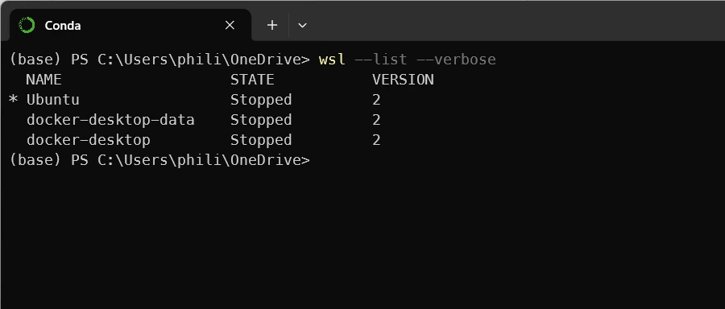
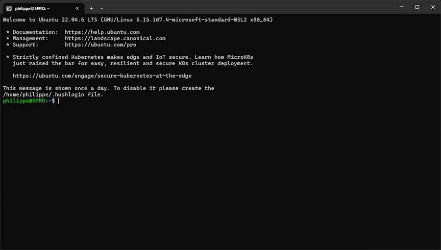
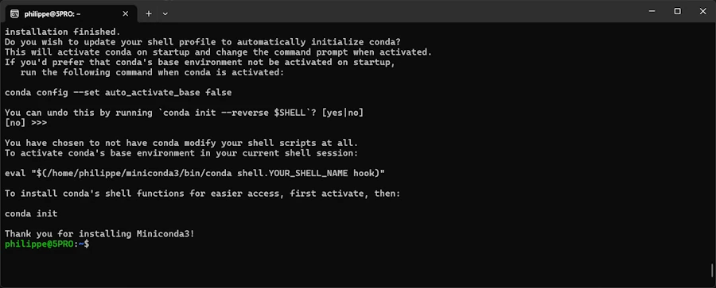
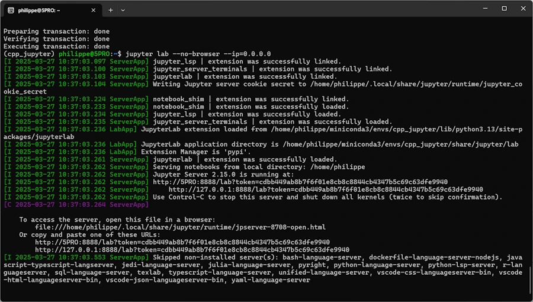
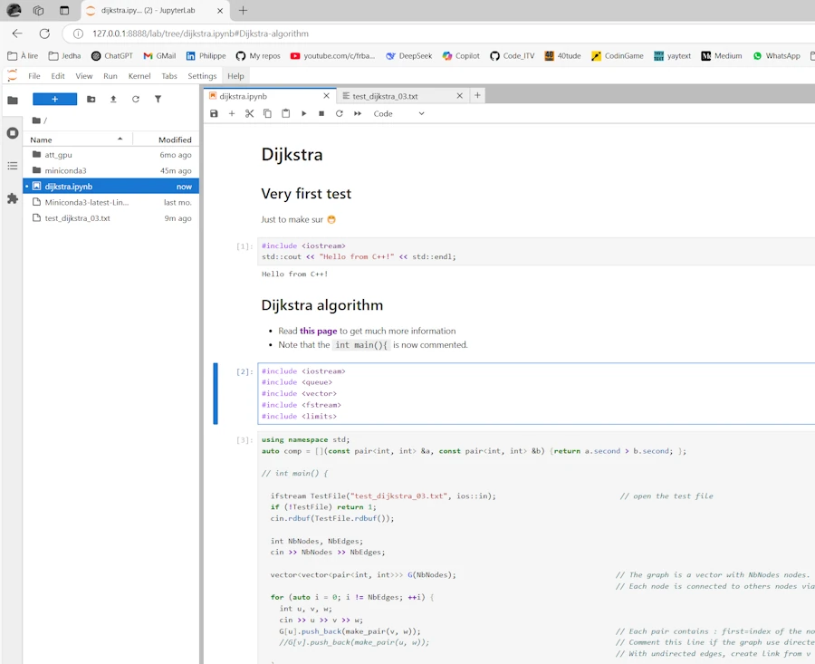
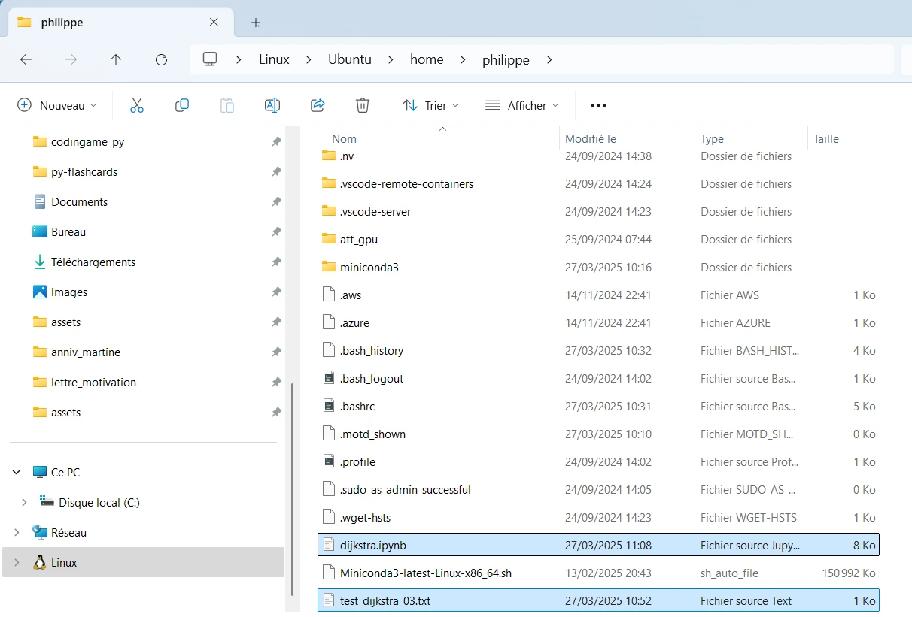
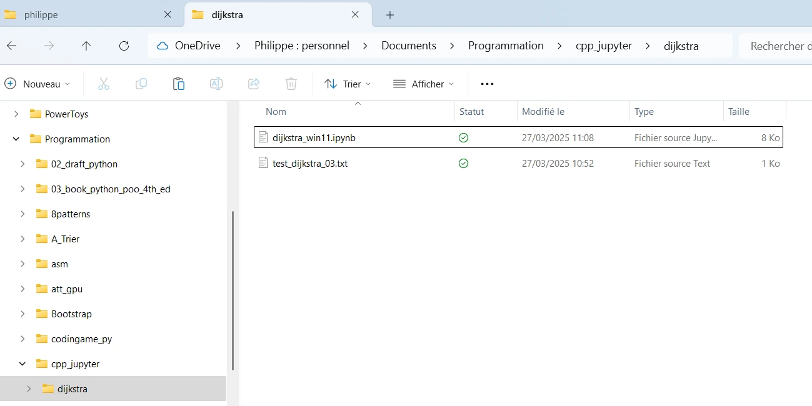
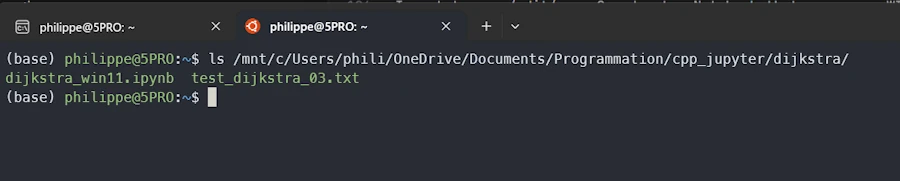
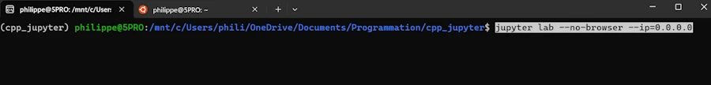
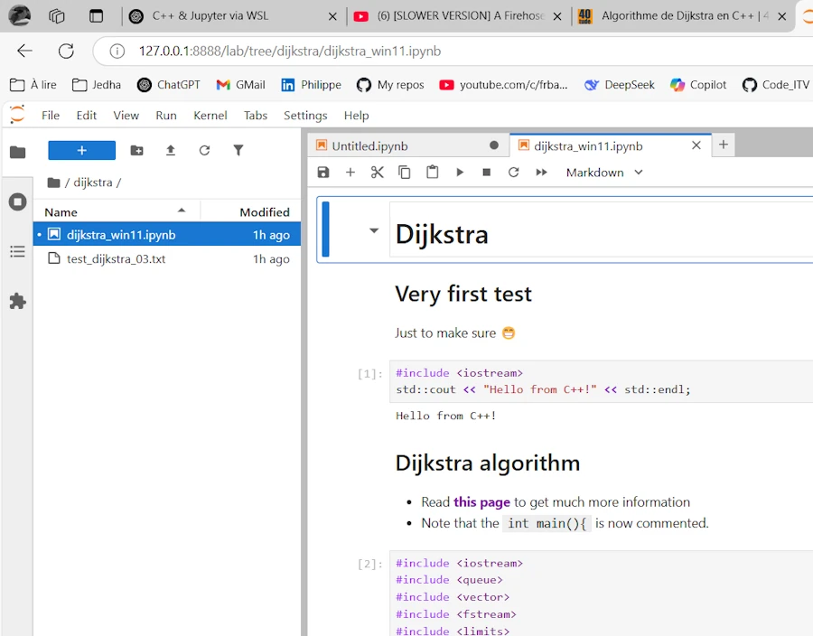

# Using C++ in Jupyter Notebooks on Windows

<div align="center">

</div>

I run WIN11 and I want to do some tests in C++ in Jupyter Notebooks. I cannot easily install the ``xeus-cling`` kernel with conda under the WIN11 host because it is based on cling + LLVM blablabla...

I could use a Docker image but here I will use WSL

## 1. Check

Open a win terminal with Powerhell

```powershell
wsl --list --verbose
```
You should see something similar to

<div align="center">

</div>

If you don't see Ubuntu, activate WSL2 on your WIN11 host (shame on you if it was not yet activated 😁) and install Ubuntu.


## 2. Run Ubuntu

<div align="center">

</div>


## 3. Install Miniconda in Ubuntu

```bash
wget https://repo.anaconda.com/miniconda/Miniconda3-latest-Linux-x86_64.sh
bash Miniconda3-latest-Linux-x86_64.sh
```

<div align="center">

</div>

### Keep in mind

At one point you will see a message saying something like :

If you'd prefer that conda's base environment not be activated on startup, run the following command when conda is activated:
* ``conda config --set auto_activate_base false``
You can undo this by running `conda init --reverse $SHELL`


## 4. Check conda

```bash
conda --version
```

If needed

```bash
export PATH="$HOME/miniconda3/bin:$PATH"
source ~/.bashrc
conda --version
```


## 5. Create conda virtual env & install

```bash
conda create -n cpp_jupyter -c conda-forge xeus-cling
conda activate cpp_jupyter
conda install -c conda-forge jupyterlab
```
For what I can remember
* I used ``conda init`` at one point
* I may have had to restart the terminal


## 6. Run Jupyterlab in Ubuntu

```bash
jupyter lab --no-browser --ip=0.0.0.0
```


<div align="center">

</div>

Click on the line that says : `  http://127.0.0.1:8888/lab?token=cdbb449ab8b7f6f01e8cb8c8844cb4347b5c69c63dfe9940`

The browser should be opened on the WIN11 host

<div align="center">

</div>

Select C++17 and live your live...

<div align="center">

</div>

In the notebook above I first make a simple test (Hello...) then run the Dijkstra algorithm (read this [page]()). Two points :
1. There is no ``main()`` function
1. So far, the notebook and the ``test_dijkstra_03.txt`` file which is opened by the C++ code are both on the Ubuntu host


## What if...

I want to keep the Notebook on the WIN11 host ?

From the WIN11 host I can access my Ubuntu home directory via : `\\wsl.localhost\Ubuntu\home\philippe`

<div align="center">

</div>

First (for testing purpose) I copy and paste both files (.ipynb and .txt files) in a new directory on the WIN11 host. Just to proove I'm not cheating I rename the Jupyter Notebook.

<div align="center">

</div>

Then I ``File/Shut Down`` Jupyter because this instance is no longer useful. There is no need to `CTRL+C` in the terminal.

From the Ubuntu terminal I can access the files on the WIN11 host with :
``ls /mnt/c/Users/phili/OneDrive/Documents/Programmation/cpp_jupyter/dijkstra/``


<div align="center">

</div>

So, I move to the directory ``cd /mnt/c/Users/phili/OneDrive/Documents/Programmation/cpp_jupyter`` and run Jupyter from there :

<div align="center">

</div>

This is exactly exactly what I want :

* On the left hand side I see the directories and below I clicked on ``dijkstra`` to show the files
* I can edit/copy/debug/create...
* Thsi is similar to the Docker experience

<div align="center">

</div>


### Idea
* From the home directory on Ubuntu launch VSCode (``code .``)
* Open the ``.bashrc`` file
* Add the line below
    * ``alias jupytercpp='cd "/mnt/c/Users/phili/OneDrive/Documents/Programmation/cpp_jupyter" && jupyter lab --no-browser --ip=0.0.0.0'``
* Save and exit from VSCode
* `source ~/.bashrc`
* Now I can run Jupyter from the right directory by invoking `jupytercpp`


## What is next ?
* I'm starting to learn Rust (👍)
* Obviously the next step is to follow a similar process the kernel `evcxr_jupyter`
* Find here [checklist for Rust]()


## How to update ?

### Update of JupyterLab

* Make sure JupyterLab server is closed
* Under the Ubuntu session

```bash
conda activate multi_jupyter # the env named cpp_jupyter above
conda update -n base -c defaults conda
conda update -c conda-forge jupyterlab
jupyter lab --version
```

### Update of the C++ Kernel

Check latest version on this [page](https://anaconda.org/conda-forge/xeus-cling)

#### Check current version
* In the terminal

```bash
conda list xeus-cling
```


#### Update C++ Kernel

```bash
conda update -c conda-forge xeus-cling
```