# C++ with VSCode, vcpkg & CMake
{: .no_toc }


<div align="center">
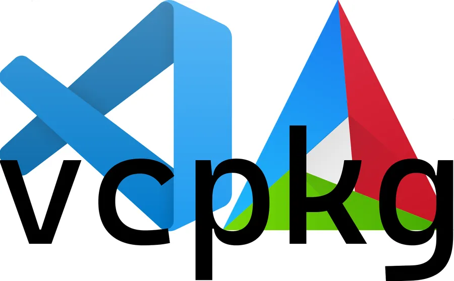
</div>


## Table of Contents
{: .no_toc .text-delta}
- TOC
{:toc}


## Introduction

April 2021. The following software are installed on my PC

* Windows 10 20H2 19042.870 (WIN key, type winver)
* VSCode 1.55.2 (WIN + R, type powershell, type `code --version`)
* Microsoft compiler cl version 19.28.29913. You can either install Visual Studio or [Build Tools for Visual Studio](https://visualstudio.microsoft.com/downloads/).
* Git version 2.31.1.windows.1 (in the previous console type `git --version`)
* CMake version 3.20.1 (in the previous console type `cmake --version`). If you want to learn more about CMake you can start [here](https://cliutils.gitlab.io/modern-cmake/).


## Install vcpkg

Open a PowerShell console (**WIN+X+I**)     
Move to a directory which will host the vcpkg directory.

```powershell
cd C:\Users\phili\Documents
git clone https://github.com/Microsoft/vcpkg.git
cd vcpkg
.\bootstrap-vcpkg.bat
```

Launch Windows PowerShell as Administrator (**WIN+X+A**)  
Reach the previous directory

```powershell
.\vcpkg integrate install
```

Close the PowerShell Admin console and switch back to the non-admin console. Type the following lines to find and install sqlite package.

```powershell
.\vcpkg search sqlite
.\vcpkg install sqlite3:x64-windows
```

On a **non-English configuration** you may have to install the English package for Visual Studio. To do so: 
* Run Visual Studio Installer. 
* Check the language tab and add English. 
* Once the English Pack is installed, restart the ``.\vcpkg install sqlite3:x64-windows`` command

<div align="center">
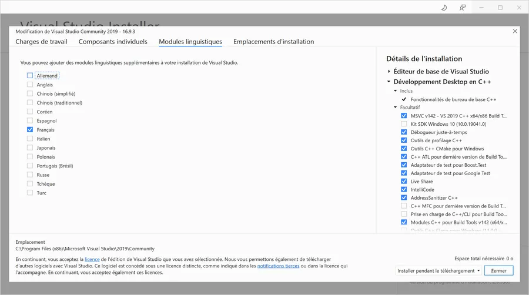
</div>


### Note
{: .no_toc }

If you want to :

* List which libs are installed: `./vcpkg list`
* Update vcpkg. Reach vcpkg directory and type `git pull` and run again the bootstrapper (`.\bootstrap-vcpkg.bat`)
* Remove vcpkg. From vcpkg directory, execute `./vcpkg integrate remove` and then delete vcpkg directory.
* Learn more. Read the [vcpkg documentation](https://docs.microsoft.com/fr-fr/cpp/build/install-vcpkg?view=msvc-160&tabs=windows)


## Build a Debug version

Create a directory to host the application and launch VSCode from there.

```powershell
cd C:\Users\phili\Documents\Temp
mkdir TestSQL-vcpkg
cd TestSQL-vcpkg
code .
```

In VSCode, make sure C/C++, CMake and CMake Tools extensions are installed. Open the Extensions pane (CTRL + SHIFT +x) and check what is missing. See below:

<div align="center">
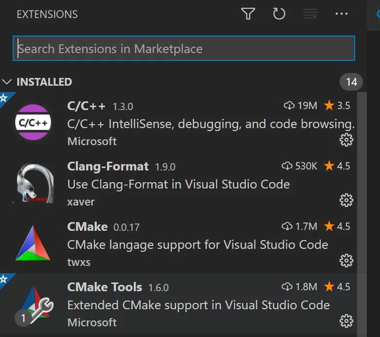
</div>


Copy and paste the code below in a main.cpp file and save it.

```cpp
#include <sqlite3.h>
#include <iostream>

int main(void) {
  std::cout << sqlite3_libversion() << '\n';
  return 0;
}
```

Once this is done, modify the VSCode ``settings.json``. You will have to do it once. Indeed this is how we let VS Code know about CMake.

Anyway, to edit, ``settings.json``
* Hit **CTRL+comma**
* To switch in text mode, click the first of the 3 icons on the top right-hand side (the one looking like a file)

<div align="center">
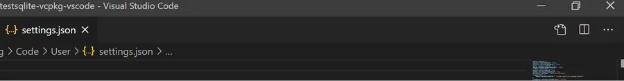
</div>


At the end of the last line add a "," then add a line like this one. Obviously, the path to the ``vcpkg.cmake`` file needs to be customized according to your configuration.

```
"cmake.configureSettings": {
        "CMAKE_TOOLCHAIN_FILE": "C:/Users/phili/Documents/vcpkg/scripts/buildsystems/vcpkg.cmake"
    }
```

Just to make sure, here is the content of my ``settings.json`` as it is today.

```json
{
    "editor.tabSize": 2,
    "explorer.confirmDelete": false,
    "explorer.confirmDragAndDrop": false,
    "editor.minimap.enabled": true,
    "editor.minimap.renderCharacters": true,
    "zenMode.centerLayout": false,
    "python.linting.enabled": true,
    "python.linting.pylintEnabled": true,
    "workbench.iconTheme": "material-icon-theme",
    "[typescript]": {
        "editor.defaultFormatter": "vscode.typescript-language-features"
    },
    "liveServer.settings.CustomBrowser": "chrome",
    "[cpp]": {
        "editor.defaultFormatter": "ms-vscode.cpptools"
    },
    "editor.fontFamily": "'Cascadia Code PL', Consolas, 'Courier New', monospace",
    "editor.fontLigatures": true,
    "window.zoomLevel": 0,
    "editor.mouseWheelZoom": true,
    "debug.console.fontSize": 12,
    "editor.fontSize": 12,
    "cmake.configureSettings": {
        "CMAKE_TOOLCHAIN_FILE": "C:/Users/phili/Documents/vcpkg/scripts/buildsystems/vcpkg.cmake"
    },
    "cmake.configureOnOpen": true
}
```

**CTRL+SHIFT+P** and type ``CMake`` then select ``CMake Quick Start``

<div align="center">
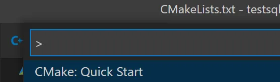
</div>


When asked to select a target, pick ``Visual Studio Community 2019 Release - amd64`` for example. Remember initially we installed sqlite3:x64-windows

<div align="center">
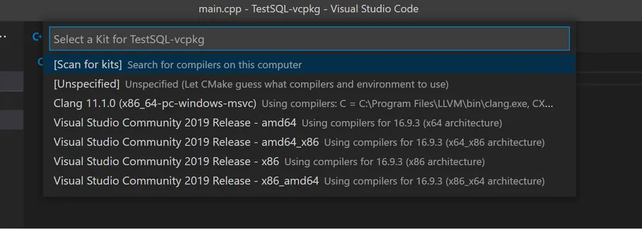
</div>


Later, you will be asked for the name of the project (``TestSQL`` in my case) and the kind of project (executable or lib). Here, select ``executable``.

Here is the content of the generated ``CMakeLists.txt`` you will get

```
cmake_minimum_required(VERSION 3.0.0)
project(TestSQL VERSION 0.1.0)
include(CTest)
enable_testing()
add_executable(TestSQL main.cpp)
set(CPACK_PROJECT_NAME ${PROJECT_NAME})
set(CPACK_PROJECT_VERSION ${PROJECT_VERSION})
include(CPack)
```

This should be simplified and modified as follow. Pay attention to the **TAB** before the paths : ``c:/Users/phili/Documents/...``

```
cmake_minimum_required(VERSION 3.0.0)
project(TestSQL VERSION 0.1.0)
INCLUDE_DIRECTORIES(
  c:/Users/phili/Documents/vcpkg/installed/x64-windows/include/
)

LINK_DIRECTORIES(
  c:/Users/phili/Documents/vcpkg/installed/x64-windows/lib/
)
add_executable(TestSQL main.cpp)
TARGET_LINK_LIBRARIES(TestSQL
  sqlite3
)
```

Later, if the project needs additional libraries, just add their names after sqlite3 and insert a space between them.

```
TARGET_LINK_LIBRARIES(TestSQL
  sqlite3 mylib blabla_lib
)
```

Everything seems to be configured. **CTRL+SHIFT+P** then type ``CMake`` and select ``CMake: Build``. You can also strike **F7** which is much faster.

<div align="center">
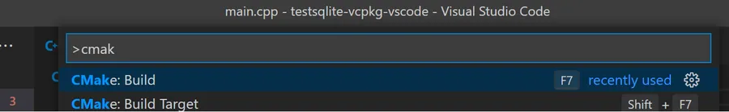
</div>


If everything went well, you should have a ``Debug`` directory hosting a ``TestSQL.exe`` debug version.

<div align="center">
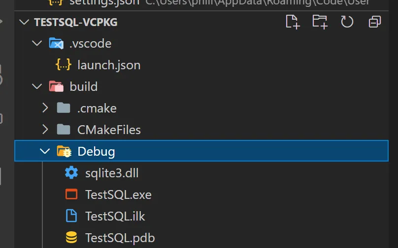
</div>


## Debug

It is time to Debug our code. Set a breakpoint on line 5 and then strike **F5**. When asked, select C++(Windows).

<div align="center">
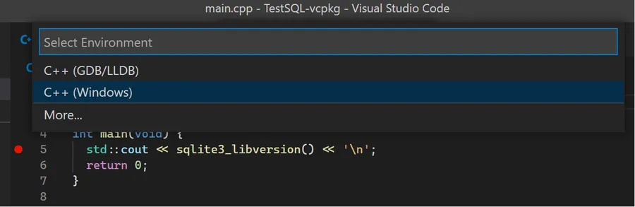
</div>


Later select ``cl.exe``

<div align="center">
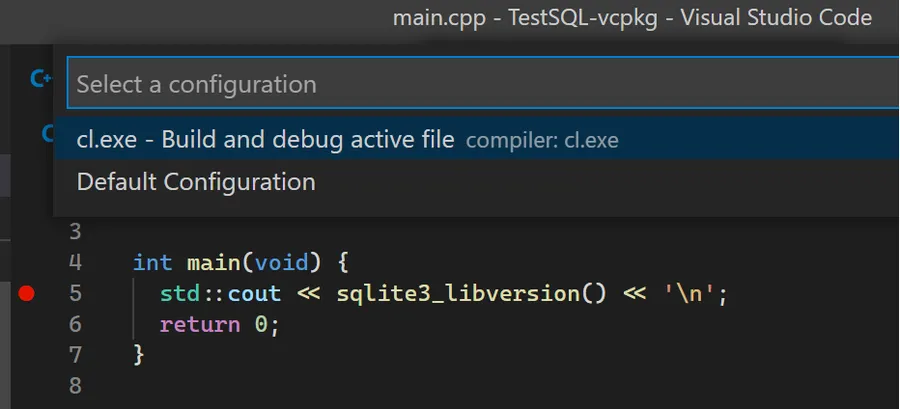
</div>


Here is the content of the initial ``launch.json`` file you may get.

```json
{
  // Use IntelliSense to learn about possible attributes.
  // Hover to view descriptions of existing attributes.
  // For more information, visit: https://go.microsoft.com/fwlink/?linkid=830387
  "version": "0.2.0",
  "configurations": [
    {
      "name": "cl.exe - Build and debug active file",
      "type": "cppvsdbg",
      "request": "launch",
      "program": "${fileDirname}\\${fileBasenameNoExtension}.exe",
      "args": [],
      "stopAtEntry": false,
      "cwd": "${workspaceFolder}",
      "environment": [],
      "console": "externalTerminal",
      "preLaunchTask": "C/C++: cl.exe build active file"
    }
  ]
}
```

Now, here is the modified version where ``preLaunchTask`` is commented and where ``${fileBasenameNoExtension}`` is replaced by ``/build/Debug/TestSQL.exe``. Indeed, this where the executable has been generated.

```json
{
  // Use IntelliSense to learn about possible attributes.
  // Hover to view descriptions of existing attributes.
  // For more information, visit: https://go.microsoft.com/fwlink/?linkid=830387
  "version": "0.2.0",
  "configurations": [
    {
      "name": "cl.exe - Build and debug active file",
      "type": "cppvsdbg",
      "request": "launch",
      "program": "${workspaceFolder}/build/Debug/TestSQL.exe",
      "args": [],
      "stopAtEntry": false,
      "cwd": "${workspaceFolder}",
      "environment": [],
      "console": "externalTerminal",
      //"preLaunchTask": "C/C++: cl.exe build active file"
    }
  ]
}
```

Press **F5**. If everything works as expected the program should stop on line 5. You should know what to do from this point 😁

<div align="center">
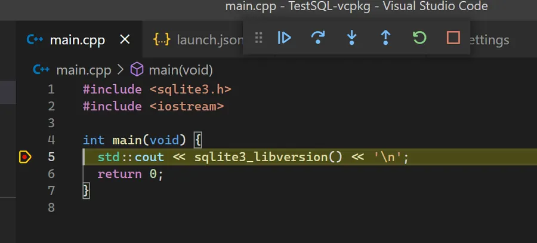
</div>


## Build a Release version

At the bottom of VSCode, click on ``CMake: [Debug]: Ready``

<div align="center">
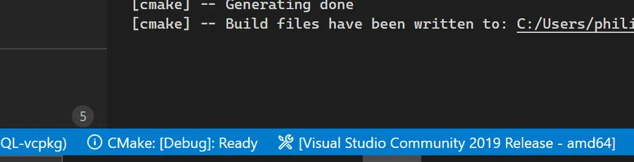
</div>


And select ``Release`` in the popup list.

<div align="center">
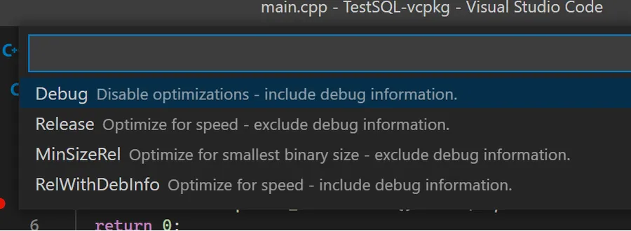
</div>


### Note
{: .no_toc }

If you want to change the kit (Visual Studio 2019 Release - amd64 was our initial choice), at the bottom of the VS Code window, click on the status bar, and select another compiler kit. However, if you select Visual Studio 2019 Release - x86 for example, make sure that you have installed the corresponding lib using vcpkg. In our case, so far, we only have the x64 version of the lib and not the x86 version. You may also have to update the content of the ``CMakeLists.txt``. Remember, so far, we wrote something like:

```
INCLUDE_DIRECTORIES(
  c:/Users/phili/Documents/vcpkg/installed/x64-windows/include/
)

LINK_DIRECTORIES(
  c:/Users/phili/Documents/vcpkg/installed/x64-windows/lib/
)
```

Anyway, press **F7** to build the release version. At the end of the build, a ``Release`` directory with a brand new ``TestSQL.exe`` should be available.

<div align="center">
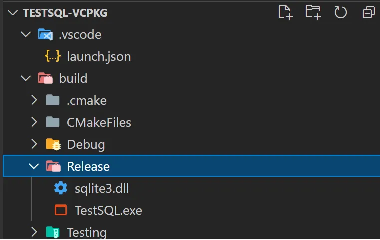
</div>


On a french keyboard, strike **CTRL+ù** to open a new terminal and type the line below to run your application.

```powershell
cd .\build\Release\
./TestSQL.exe
```

## Conclusion

vcpkg is great. The integration in Visual Studio is even smoother than the one with VSCode. Whatever, vcpkg elegantly solve one of the most annoying developer's tasks: getting libs and making sure they are quickly integrated with our compiling toolchain.

I hope this page will speed up your start with vcpkg and VSCode on Windows. 

