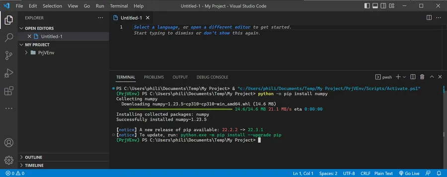

# Python virtual env

# Intro
I'm getting started with Pyton and little bit confused with venv so I want to write black on white what I understood so far. I use Windows 10 22H2 but the process should be similar on other Windows versions or OSes. I suppose Python 3 is installed, up and working.

## In a terminal

* ``mkdir my_project``
* ``cd ./my_project``
    * Type "cd my" then strike TAB
* ``py -m venv .\PrjVEnv``
    * This may take few seconds
    * This creates, among other things, a subdirectory named ``./PrjVEnv``
    * Most of the time you will see : ``py -m venv .venv``

* ``ls``  
Just to check that the ``./PrjVEnv`` subdirectory has been created

* ``code .``  
Don't forget the dot  
This launches VSCode "in" the current directory

<div align="center">
&nbsp;

&nbsp;
</div>


## In VSCode

* **CTRL + SHIFT + P**
* Python: Select Interpreter
    * If needed start to type "Python" then the different options should be listed.

<div align="center">
&nbsp;

&nbsp;

</div>


* ``Python 3.10.7 ('PrjVEnv':venv)./PrjVEnv/Scripts/python.exe``
    * Or, if you run another Python version pick the one listed with the "('PrjVEnv':venv)"
    * This is the interpreter running within the context of the Python Virtual Environment

<div align="center">
&nbsp;

&nbsp;
</div>


* **CTRL + SHIFT + ù**
    * To open a new Terminal within VSCode

<div align="center">
&nbsp;

&nbsp;
</div>


* ``python -m pip install numpy``  
This installs the lib needed by the project

<div align="center">
&nbsp;

&nbsp;
</div>

Done!


## Just to make sure...

* Enter some code

```python
import numpy as np

def MyFunction():
  A = np.array([0, 1, 2, 3])
  print(A.shape, A.size)

if __name__ == '__main__':
  MyFunction()
```

* **CTRL + S**
  Save the code

* Set a breakpoint

<div align="center">
&nbsp;

&nbsp;
</div>


* F5
  Select "Debug the currently active Python file"

<div align="center">
&nbsp;

&nbsp;
</div>


* F10
  To step over the breakpoint when you reach it
* Inspect the variables etc.

<div align="center">
&nbsp;

&nbsp;
</div>


* F5
  To let the code ends

<div align="center">
&nbsp;

&nbsp;
</div>


* If additional libs are needed, as before, add them from the VSCODE console
* ``python -m pip install scipy``
  For example

Voilà, I hope this helps.

