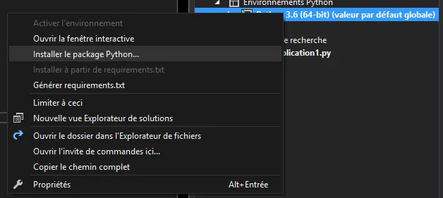
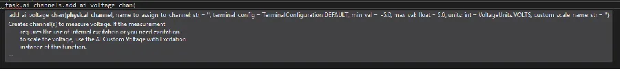

# NI-DAQmx, MSVC, Python

## Introduction

NIDaqmx, Python et Visual Studio 2017. Ah la belle brochette ! NI vient (enfin) de mettre à jour son propre driver [NI-Daqmx pour Python](https://github.com/ni/nidaqmx-python) sur GitHub. Voici une méthode pour utiliser ce dernier dans l’excellent Visual Studio 2017. On en profitera aussi pour faire un exemple un peu moins moche que ceux qui viennent par défaut avec la package.

À garder aussi sous le coude : <https://knowledge.ni.com/KnowledgeArticleDetails?id=kA00Z0000019Pf1SAE&l=en-US>


## Installation

* Je suis sous Windows 10 dans une machine virtuelle Windows 10 sous VMWare Worksation Player 12
* Installer [NIDaqmx](http://www.ni.com/downloads)
* Installer [Visual Studio Preview 2017](https://visualstudio.com/vs/preview?wt.mc_id=blogs_msdn_python) (on est en Avril 2017)
  + Choisir le Workload Python
  + Laisser les paramètres par défaut (3.6, pas d'installation de Anaconda etc.)

<div align="center">

</div>


* Créer un nouveau projet Python
* Dans l'explorateur de projet, cliquer alors sur "Environnements Python"
* Clic droit sur "Python 3.6 (64-bit)"
* Choisir "Installer le package Python..."

<div align="center">

</div>


* Taper "daqmx"

<div align="center">

</div>


* Choisir "Installer nidaqmx" dans la liste (ne **PAS** choisir pidaqmx)
* En profiter pour installer de la même manière le package "numplot"
* Sortir de Visual Studio (sans l'éteindre) et lancer NI Max
* Créer un device simulé
  + Dans "Périphériques et interfaces"
  + Clic droit puis "Créer un nouvel objet"
  + Choisir "Périphérique NI-DAQmx simulé" puis choisir une carte d'acquisition quelconque 62xx par exemple.

<div align="center">

</div>


## Premier test

* Revenir dans Visual Studio, saisir le [code suivant](https://github.com/ni/nidaqmx-python/blob/master/nidaqmx_examples/ai_voltage_sw_timed.py) dans l'éditeur

```python
import pprint
import nidaqmx

pp = pprint.PrettyPrinter(indent = 2)

with nidaqmx.Task() as task:

    print('1 Channel & 1 Sample Read : ')
    task.ai_channels.add_ai_voltage_chan("Dev1/ai0")
    data = task.read()
    pp.pprint(data)

    print('\n1 Channel & 1 Sample Read : ')
    data = task.read(number_of_samples_per_channel=1)
    pp.pprint(data)

    print('\n1 Channel & 10 Samples Read : ')
    data = task.read(number_of_samples_per_channel=10)
    pp.pprint(data)

    print('\n4 Channels [0..3] & 1 Sample Read : ')
    task.ai_channels.add_ai_voltage_chan("Dev1/ai1:3")
    data = task.read()
    pp.pprint(data)

    print('\n4 Channels & 5 Samples Read per channel : ')
    data = task.read(number_of_samples_per_channel=5)
    pp.pprint(data)
```

* Lancer le code. 
* Voilà par exemple ce que j'obtiens :

<div align="center">

</div>

{: .note }
Je ne comprends pas pourquoi mais ça prend 2H avant d'afficher quoique ce soit et ce, que l'on soit en mode "Debug" ou en mode "Release". Ceci dit, si on lance le code Python à partir d'une console tout se passe normalement.

{: .note }
Un des nombreux avantages à travailler avec Visual Studio c'est **IntelliSense**. Par exemple, si à la suite du code précédent on commence à taper "task." alors, dès qu'on a tapé le point ".", la liste des fonctions membres et les propriétés de l'objet courant apparaît. Cerise sur le gâteau on a aussi l'aide en ligne...

<div align="center">

</div>


* Ensuite, c'est relativement intuitif, si on commence à saisir les lettres qui composent le nom de la fonction, la liste box est mise à jour etc.
* À la fin, on a l'aide qui ne concerne que le ou les paramètres apparaît aussi dans l'environnement

<div align="center">

</div>


## Second test

* Saisir le code suivant dans l'éditeur

```python
import nidaqmx
from matplotlib.pyplot as plt
from numpy as np

with nidaqmx.Task() as task:
    task.ai_channels.add_ai_voltage_chan("Dev1/ai0")
    data = task.read(number_of_samples_per_channel=1000)

t1 = np.arange(0.0, 1000.0, 1)
plt.plot(t1, data, 'r.')
plt.grid(True)
plt.show()
```

* Voilà ce que j'obtiens

<div align="center">

</div>

## Troisième test

* Saisir le code source suivant dans l'éditeur

```python
import nidaqmx as daqmx
import matplotlib.pyplot as plt
import numpy as np

with daqmx.Task() as task:
    task.ai_channels.add_ai_voltage_chan("Dev1/ai0:1")
    task.timing.cfg_samp_clk_timing(1000)
    data = task.read(number_of_samples_per_channel=1000)

t = np.arange(0.0, 1000.0, 1)
plt.plot(t, data[0], 'r')
plt.plot(t, data[1], 'b')
plt.grid(True)
plt.show()
```

* Bien voir la ligne 7 où on spécifie la vitesse d'acquisition (1000 pts/s)
* La raison pour laquelle j'affiche les 2 courbes en utilisant 2 lignes de code c'est que si je pose un point d'arrêt dans la marge de la ligne 10, quand le débogueur s'arrête dessus, voilà ce que je peux voir dans mon environnement

<div align="center">

</div>


* Dans le bas de la fenêtre on voit bien que data est un tableau de deux lignes et de 1000 colonnes (je fais donc un plot(data[0]..) puis un plot(data[1]...). Il y a sans doute plus efficace.)
* Pour finir, voilà ce que j'obtiens à l'écran :

<div align="center">

</div>


*La suite au prochain épisode...*

