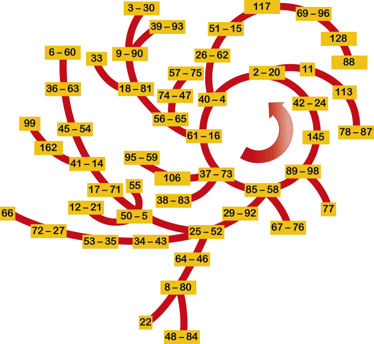
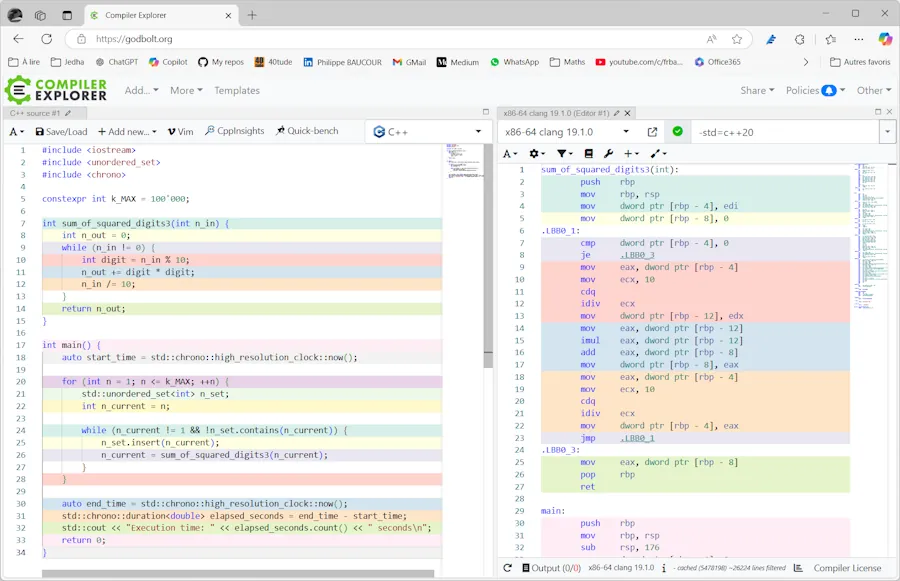
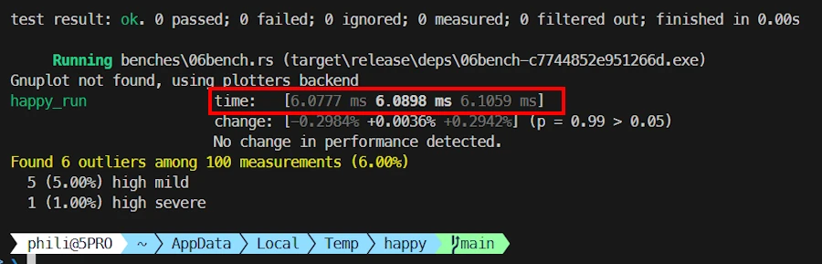

# Happy Numbers

A practical and performance-oriented exploration of **Happy Numbers**, from clean Python implementations to optimized C++ and Rust benchmarks
{: .lead }


<div align="center">

</div>

Image from [Wikipedia](https://en.wikipedia.org/wiki/Happy_number)


## Intro

A positive integer is called **happy** if repeatedly replacing the number by the **sum of the squares of its digits** eventually leads to `1`.

If the process enters a loop that never reaches `1`, the number is considered **unhappy**.

This simple definition makes Happy Numbers a great playground to:

* Practice basic algorithms
* Compare multiple implementations of the same logic
* Measure real performance instead of guessing

<div align="center">
<iframe width="560" height="315" src="https://www.youtube.com/embed/ZbZSe6N_BXs?start=31" frameborder="0" allowfullscreen></iframe>
</div>

<!-- title="Happy Numbers explanation" -->

By the end of this article, you will also be ready to solve your first algorithmic puzzle on [CodinGame](https://www.codingame.com/training/easy/happy-numbers).


## A First Python Implementation

Let’s start with a straightforward approach and check whether `24` is a happy number.

```python
def sum_of_squared_digits(n: int) -> int:
    # Compute the sum of the squares of the digits of n
    total = 0
    while n:
        digit = n % 10
        total += digit * digit
        n //= 10
    return total

seen = set()
n = 24

while n != 1 and n not in seen:
    seen.add(n)
    n = sum_of_squared_digits(n)
    print(n)

print("Happy" if n == 1 else "Unhappy")
```

This output looks like :

```powershell
20
4
16
37
58
89
145
42
20
Unhappy
```

This version avoids `pow()` and `**` and directly multiplies `digit * digit`, which turns out to be faster in tight loops.


## A More Compact Python Version

Here I try to simplify ``sum_of_squared_digits()``
* The one liner goes like this :
    * Convert ``n`` in a string
    * Then read each "char" (digit) of the string
    * Convert each char as an ``int``
    * Elevate the ``int`` to power of 2


```python
def sum_of_squared_digits(n:int)->int:
    # Convert the number to a string and sum squared digits
    return sum([int(i)**2 for i in str(n)])

n_set = set()
n = 24
while (n!=1 and n not in n_set):
    n_set.add(n)
    n = sum_of_squared_digits(n)
    print(n)

print("Happy") if n==1 else print("Unhappy")

```

This version is easier to read but introduces **string conversion**, which has a measurable cost.

At this point, intuition is not enough — it’s time to measure.

**Rule #1 of performance work:** never assume. Always benchmark.


## Benchmark 1 — Python (String-Based)

```python
import time

k_MAX=100_000

def sum_of_squared_digits(n:int)->int:
    return sum([int(i)**2 for i in str(n)])

start_time = time.time()  # Start timer

for n in range(1, k_MAX+1):
    n_set = set()
    n_init = n
    while (n!=1 and n not in n_set):
        n_set.add(n)
        n = sum_of_squared_digits(n)

end_time = time.time()
print(f"Execution time: {end_time - start_time:.6f} seconds")

```

```
Execution time: 0.797350 seconds
```


## Benchmark 2 — Python (Arithmetic-Based)

```python
import time

k_MAX = 100_000

def sum_of_squared_digits2(n_in:int)->int:
    n_out = 0
    while n_in:
        digit=n_in%10
        n_out += digit*digit
        n_in=n_in//10
    n_in=n_out
    return n_out

start_time = time.time()  # Start timer

for n in range(1, k_MAX + 1):
    n_set = set()
    n_init = n
    while n != 1 and n not in n_set:
        n_set.add(n)
        n = sum_of_squared_digits2(n)

end_time = time.time()
print(f"Execution time: {end_time - start_time:.6f} seconds")

```

```
Execution time: 0.482066 seconds
```

Despite being longer, the arithmetic-based version is about **1.6× faster** due to:

* No string allocation
* Fewer temporary objects
* Better cache locality


## C++ Benchmark

* If you don't have a C++ compiler on your host (shame on you! 😁) you can copy, past and run the code below with an [online C++ compiler](https://cpp.sh/).
* I selected C++23 and ``-02`` optimizations and did some test with C++20 and no optimization.


```cpp
#include <iostream>
#include <unordered_set>
#include <chrono>

constexpr int k_MAX = 100'000;

int sum_of_squared_digits3(int n_in) {
    int n_out = 0;
    while (n_in != 0) {
        int digit = n_in % 10;
        n_out += digit * digit;
        n_in /= 10;
    }
    return n_out;
}

int main() {
    auto start_time = std::chrono::high_resolution_clock::now();

    for (int n = 1; n <= k_MAX; ++n) {
        std::unordered_set<int> n_set;
        int n_current = n;

        while (n_current != 1 && !n_set.contains(n_current)) {
            n_set.insert(n_current);
            n_current = sum_of_squared_digits3(n_current);
        }
    }

    auto end_time = std::chrono::high_resolution_clock::now();
    std::chrono::duration<double> elapsed_seconds = end_time - start_time;
    std::cout << "Execution time: " << elapsed_seconds.count() << " seconds\n";
    return 0;
}

```

```
Execution time: ~0.08 seconds
```

**80 ms** that’s roughly **6x** faster than Python, with very similar algorithmic structure.

* For such a simple algorithm, the syntax is very similar across languages. So, even if Python is the only programming language you know, you should understand what is happening here. Additionally, I kept the variable names the same.
* 34 lines in C++ vs 24 in Python
* 80 ms sec in C++ vs 480 ms in Python
* 6 times faster


## Benchmarking C++ V2

```cpp

#include <iostream>
#include <unordered_set>
#include <array>
#include <chrono>

constexpr int k_MAX = 100'000;

constexpr std::array<int, 10> k_squares = [] {
    std::array<int, 10> squares{};
    for (int i = 0; i < 10; ++i) {
        squares[i] = i * i;
    }
    return squares;
}();

int sum_of_squared_digits2(int n_in) {
    int n_out = 0;
    while (n_in != 0) {
        int digit = n_in % 10;
        n_out += k_squares[digit];
        n_in /= 10;
    }
    return n_out;
}


int main() {
    auto start_time = std::chrono::high_resolution_clock::now();

    for (int n = 1; n <= k_MAX; ++n) {
        std::unordered_set<int> n_set;
        int n_current = n;

        while (n_current != 1 && !n_set.contains(n_current)) {
            n_set.insert(n_current);
            n_current = sum_of_squared_digits2(n_current);
        }
    }

    auto end_time = std::chrono::high_resolution_clock::now();
    std::chrono::duration<double> elapsed_seconds = end_time - start_time;
    std::cout << "Execution time: " << elapsed_seconds.count() << " seconds\n";
    return 0;
}
```
The timing is similar.

I suspect the optimizer is doing a great job. I did'nt look at assembly language but you can use [Compiler Explorer](https://godbolt.org/) to do so. It is **always** very interesting. Read this [article]() to see a real case where looking to assembly language was **THE** solution.

Again, even on [Compiler Explorer](https://godbolt.org/), make sure to select C++ 20 or later otherwise the ``n_set.contains(n_current)`` function call is not be available.

<div align="center">

</div>


## Rust Version (Fast & Slow Pointers)

* This one use fast and slow pointers
* With many others, it is available on this [dedicated page](#ANCHOR)
* You can copy and paste it in the [Rust Playground](https://play.rust-lang.org/)

```rust
use std::time::Instant;
use std::hint::black_box;

fn get_next_number(mut x:u32)->u32{
    let mut next_num : u32 = 0;
    while x > 0{
        let digit = x % 10;
        x /= 10;
        next_num += digit.pow(2); // add the square of the digit to the next number
    }
    next_num
}

fn happy_number(n:u32)->bool{
    let mut slow = n;
    let mut fast = n;
    loop {
        slow = get_next_number(slow);
        fast = get_next_number(get_next_number(fast));

        if fast == 1 {
            return true;
        }

        if slow == fast {
            return false;
        }
    }
}

fn main(){

    const K_MAX: u32 = 1_000_000;
    let start = Instant::now();
    for i in 1..=K_MAX{ // Avoid 0
        black_box(happy_number(i)); // Prevents the optimized compiler from simply not calling the function if its result is not used
    }
    let duration = start.elapsed();
    println!("Execution time: {} ms", duration.as_millis());
}
```
```
Execution time: 62 ms
```
* 62 ms, this is 25% faster than C++.
* Then using the [crate rayon](https://crates.io/crates/rayon) the code runs in **6 ms**
    * **13 times** faster than C++
    * **80 times** faster than Python
    * 40 LOC

<div align="center">
<br/>
<!-- <span>Optional comment</span> -->
</div>

```rust
use rayon::prelude::*;
use std::hint::black_box;
use std::time::Instant;

fn get_next_number(mut x: u32) -> u32 {
    let mut next_num: u32 = 0;
    while x > 0 {
        let digit = x % 10;
        x /= 10;
        next_num += digit.pow(2);
    }
    next_num
}

fn happy_number(n: u32) -> bool {
    let mut slow = n;
    let mut fast = n;
    loop {
        slow = get_next_number(slow);
        fast = get_next_number(get_next_number(fast));

        if fast == 1 {
            return true;
        }

        if slow == fast {
            return false;
        }
    }
}

fn main() {
    const K_MAX: u32 = 1_000_000;
    let start = Instant::now();
    (1..=K_MAX).into_par_iter().for_each(|i| {
        black_box(happy_number(i));
    });
    let duration = start.elapsed();
    println!("Execution time: {} ms", duration.as_millis());
}
```

## Conclusion
* Yes, we could have used numpy and see what happen when vectorizing the algorithm.
* Yes, we could do a better job with some multithreading etc.
* But... It is always a tradeoff between the time spent vs speed improvement
* Regarding speed improvement vs time spent, feel free to read this post about [Sieve of Eratosthenes]()

* Happy Numbers are deceptively simple and perfect for benchmarking
* Readability and performance often pull in opposite directions
* Python is expressive, C++ is brutally fast, Rust offers a great middle ground

* Most importantly: **Measure first. Optimize second.**


* Now you should be able to solve this puzzle on [CodinGame](https://www.codingame.com/training/easy/happy-numbers)


Bien sûr Philippe.
Voici une **conclusion réécrite**, plus structurée, filtrée et fluide, prête à remplacer l’existante. Le ton reste conversationnel et orienté pratique, avec une incitation claire à passer à l’action sur CodinGame.

---

## Conclusion

Happy Numbers are deceptively simple, which makes them an excellent playground for experimentation and benchmarking.

Along the way, we’ve seen that:

* **Readability and performance often pull in opposite directions**
* **Python is expressive and quick to iterate**
* **C++ delivers raw performance**
* **Rust offers an elegant middle ground with strong guarantees**

Of course, this algorithm could be pushed further. We could experiment with vectorization using NumPy, introduce multithreading, or explore other optimizations. But in practice, performance work is always a **tradeoff between the time invested and the gains achieved**. Optimizing for the sake of optimizing rarely pays off.

If this topic interests you, the same question (how far should we optimize?) is explored in more depth in this article about the [Sieve of Eratosthenes](), where looking at the problem from a lower-level perspective made all the difference.

The key takeaway remains simple and universal: **Measure first. Optimize second.**

At this point, you should be more than ready to solve the Happy Numbers puzzle on
[https://www.codingame.com/training/easy/happy-numbers](https://www.codingame.com/training/easy/happy-numbers)

Pick your language of choice, play with different approaches, compare performance, and most importantly, have fun while learning.


## Appendix

**Cached Python Version**

```python
import time
from functools import lru_cache

k_MAX = 100_000

@lru_cache(maxsize=None)
def sum_of_squared_digits2(n_in: int) -> int:
    n_out = 0
    while n_in:
        digit = n_in % 10
        n_out += digit * digit
        n_in = n_in // 10
    return n_out


start_time = time.time()

for n in range(1, k_MAX + 1):
    n_set = set()
    n_init = n
    while n != 1 and n not in n_set:
        n_set.add(n)
        n = sum_of_squared_digits2(n)

end_time = time.time()
print(f"Execution time: {end_time - start_time:.6f} seconds")
```

```
Execution time: ~0.29 seconds
```

**Slow and Fast Pointers in Python**
* Read this [Python code](https://github.com/40tude/py_coding_interview/blob/main/04_fast_slow_pointers/80_happy_numbers.ipynb)
* It is part of this highly recommended [book](https://amzn.eu/d/iIW2Uui)

