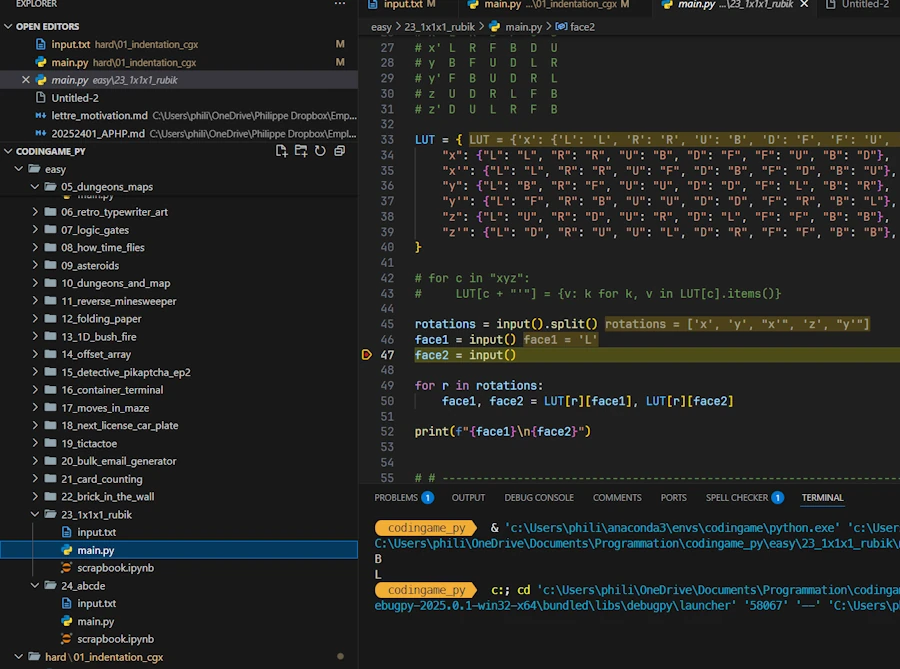
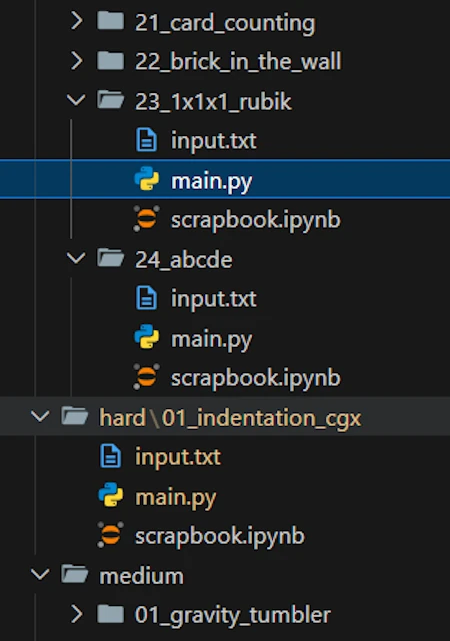
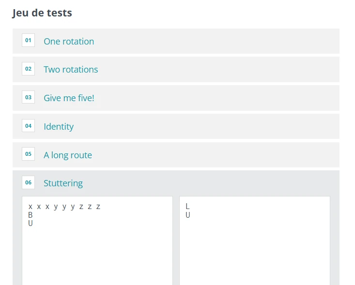
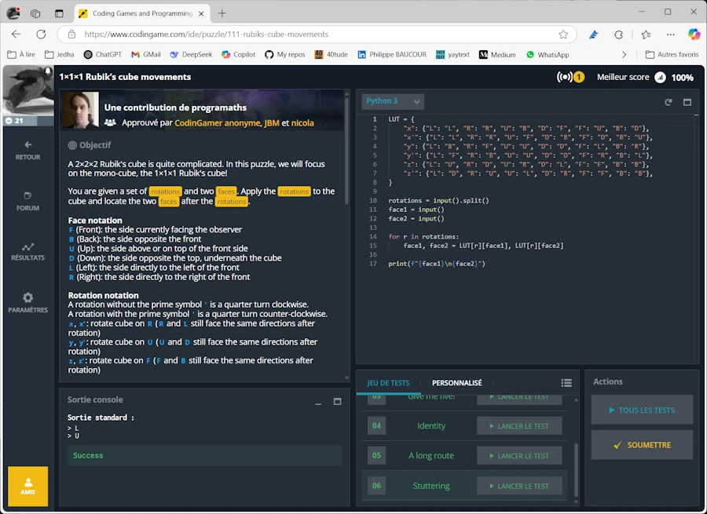

# CodinGame, puzzles en Python


{:.warning}
Les dernières versions de mes solutions, qu'elles soient documentées ou non sur cette page sont soit dans un [repo Git C++](https://github.com/40tude/codingame_cpp) ou un [repo Git Python](https://github.com/40tude/codingame_py). 


<div align="center">

</div>


## Template

Ci-dessous le template de code que j'utilise

```python
# URL & Comment

# -----------------------------------------------------------------------------
RedirectIOtoFile = True
if RedirectIOtoFile:
    import sys
    import os
    from pathlib import Path

    k_input = "input.txt"
    os.chdir(Path(__file__).parent)
    sys.stdin = open(k_input, "r")


# # -----------------------------------------------------------------------------
# # To debug: print("Debug messages...", file=sys.stderr, flush=True)
# import time
# import sys
# start_time = time.perf_counter()
# end_time = time.perf_counter()
# print(f"Execution time: {(end_time - start_time) * 1_000_000 :.2f} µs", file=sys.stderr, flush=True)


# -----------------------------------------------------------------------------
# Your code here...

# -----------------------------------------------------------------------------
if RedirectIOtoFile:
    sys.stdin.close()

```

## Répertoires

Voilà l'organisation des répertoires et des fichiers que j'utilise :

<div align="center">

</div>


## Fichiers annexes

### ``input.txt``
Dans le ou les fichiers ``input.txt`` qui sont lus par le template pour alimenter le code (il suffit de modifier la ligne ``k_input = "input.txt"``), je recopie typiquement les textes des exemples 

<div align="center">

</div>

Ci-dessous un exemple typique de fichier ``input.txt``. Dans ce cas très précis, comme je sais que le code ne va lire que les 3 premères lignes, je peux écrire la solution attendue un peu plus bas.

```
x y x' z y'
L
B

Solution : BL

```

### `scrapbook.ipynb`
Comme son nom l'indique, c'est juste un cahier de brouillon.


## Mise en oeuvre


Exemple de ce que cela donne avec le puzzle, easy, [1x1x1 Rubik’s cube movements](https://www.codingame.com/training/easy/111-rubiks-cube-movements)

```python
# https://www.codingame.com/training/easy/111-rubiks-cube-movements


# -----------------------------------------------------------------------------
RedirectIOtoFile = True
if RedirectIOtoFile:
    import sys
    import os
    from pathlib import Path

    k_input = "input.txt"
    os.chdir(Path(__file__).parent)
    sys.stdin = open(k_input, "r")

# # -----------------------------------------------------------------------------
# # To debug: print("Debug messages...", file=sys.stderr, flush=True)
# import time
# start_time = time.perf_counter()
# end_time = time.perf_counter()
# print(f"Execution time: {(end_time - start_time) * 1_000_000 :.2f} µs")


# -----------------------------------------------------------------------------
# LUT
#    L  R  U  D  F  B
# x  L  R  B  F  U  D
# x' L  R  F  B  D  U
# y  B  F  U  D  L  R
# y' F  B  U  D  R  L
# z  U  D  R  L  F  B
# z' D  U  L  R  F  B

LUT = {
    "x": {"L": "L", "R": "R", "U": "B", "D": "F", "F": "U", "B": "D"},
    "x'": {"L": "L", "R": "R", "U": "F", "D": "B", "F": "D", "B": "U"},
    "y": {"L": "B", "R": "F", "U": "U", "D": "D", "F": "L", "B": "R"},
    "y'": {"L": "F", "R": "B", "U": "U", "D": "D", "F": "R", "B": "L"},
    "z": {"L": "U", "R": "D", "U": "R", "D": "L", "F": "F", "B": "B"},
    "z'": {"L": "D", "R": "U", "U": "L", "D": "R", "F": "F", "B": "B"},
}

# for c in "xyz":
#     LUT[c + "'"] = {v: k for k, v in LUT[c].items()}

rotations = input().split()
face1 = input()
face2 = input()

for r in rotations:
    face1, face2 = LUT[r][face1], LUT[r][face2]

print(f"{face1}\n{face2}")

# -----------------------------------------------------------------------------
if RedirectIOtoFile:
    sys.stdin.close()


```


Et voilà pour finir, la partie que je copie-colle dans la page de Codingame

```python

LUT = {
    "x": {"L": "L", "R": "R", "U": "B", "D": "F", "F": "U", "B": "D"},
    "x'": {"L": "L", "R": "R", "U": "F", "D": "B", "F": "D", "B": "U"},
    "y": {"L": "B", "R": "F", "U": "U", "D": "D", "F": "L", "B": "R"},
    "y'": {"L": "F", "R": "B", "U": "U", "D": "D", "F": "R", "B": "L"},
    "z": {"L": "U", "R": "D", "U": "R", "D": "L", "F": "F", "B": "B"},
    "z'": {"L": "D", "R": "U", "U": "L", "D": "R", "F": "F", "B": "B"},
}

rotations = input().split()
face1 = input()
face2 = input()

for r in rotations:
    face1, face2 = LUT[r][face1], LUT[r][face2]

print(f"{face1}\n{face2}")
```


C'est bien ce que l'on voit ci-dessous.


<div align="center">

</div>


Sinon, bien sûr, tout est sur [GitHub](https://github.com/40tude/codingame_py)
