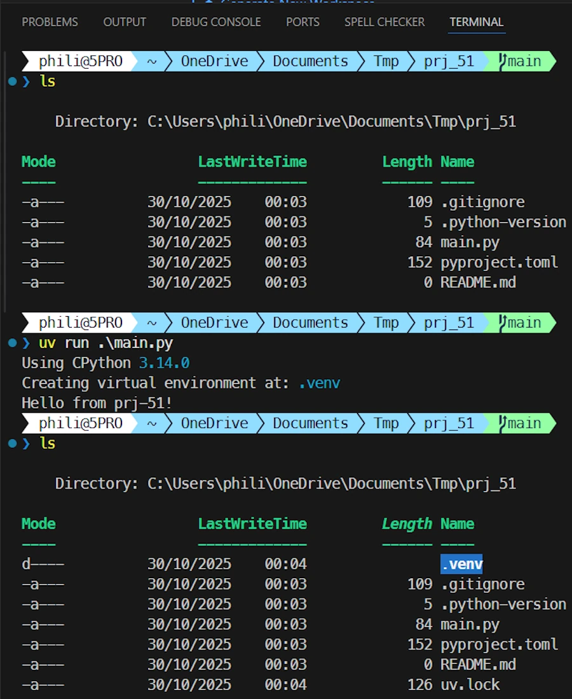
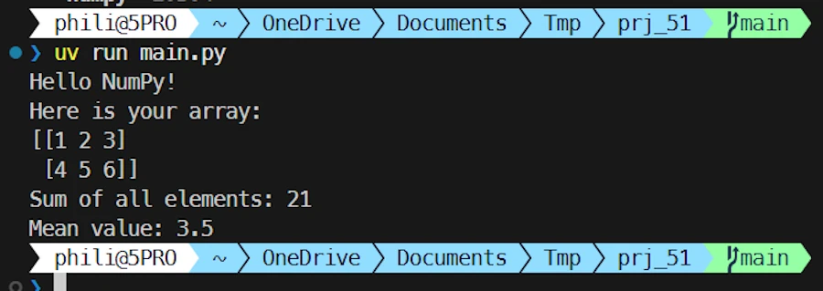
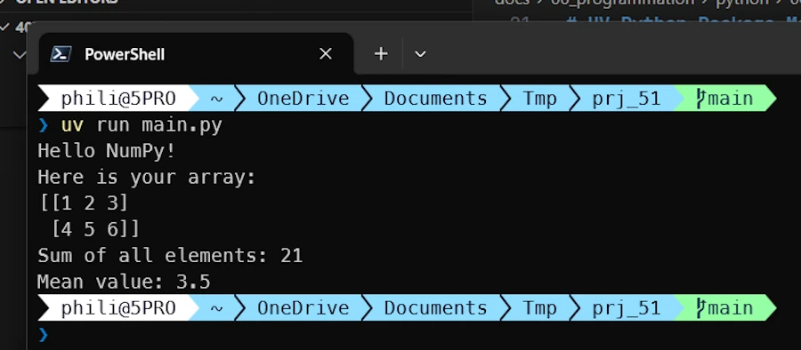
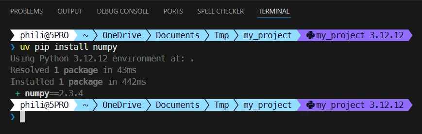

<div align="center">
<br/>
<span>UV Python Package Manager: The Essentials</span>
</div>


# UV Python Package Manager: The Essentials


## TL;DR

```powershell
uv init prj_51
cd prj_51
code .
uv add numpy
# write code...
uv run main.py

# Out of VScode - Option I
uv run main.py

# Out of VScode - Option II
Set-Env . # or .venv\Scripts\activate
python main.py
```


<!-- ```powershell
uv venv my_project # Create  
./my_project/Scripts/Activate.ps1 # Activate
uv pip install pandas numpy scikit-learn matplotlib # Install 
deactivate # Deactivate
``` -->

* I use Windows 11 and VSCode
* [Read the doc](https://docs.astral.sh/uv/)


## Install

```powershell
winget install astral-sh.uv
uv --version
```


<!-- 

## Create a new virtual environment

```powershell
uv venv test_env
```

## Activate the environment (PowerShell)

```powershell
.test_env\Scripts\Activate.ps1
```

The prompt should change to show `(test_env)`

## Install a few packages

```powershell
uv pip install pandas numpy requests
```

## Verify

```powershell
python -c "import pandas; print(pandas.__version__)"
```

## Deactivate

```powershell
deactivate
```


## Essential `uv` commands

```powershell
# Create a directory and an environment with a specific Python version
uv venv my_project --python 3.12

# Install packages
uv pip install package_01 package_02

# Install from requirements.txt
uv pip install -r requirements.txt

# List installed packages
uv pip list

# Uninstall
uv pip uninstall package_name

# Sync (install exactly what’s in requirements.txt)
uv pip sync requirements.txt

# Update
uv self update
``` -->


## PowerShell function for quick activation

Add this to the `Documents/PowerShell/Microsoft.PowerShell_profile.ps1` profile:

```powershell
# Function to activate a venv
function Set-Env {
    param([string]$EnvName = $null)
    
    # If argument is "." or no argument provided
    if (($EnvName -eq ".") -or (-not $EnvName)) {
        # Case 1: uv project with .venv
        if (Test-Path ".\.venv\Scripts\Activate.ps1") {
            & ".\.venv\Scripts\Activate.ps1"
            return
        }
        # Case 2: Inside a folder that IS the environment (uv venv myproj then cd myproj)
        if (Test-Path ".\Scripts\Activate.ps1") {
            & ".\Scripts\Activate.ps1"
            return
        }
        # Case 3: Environment in parent folder (uv venv myproj from parent)
        $parentName = Split-Path -Leaf (Get-Location)
        if (Test-Path "..\$parentName\Scripts\Activate.ps1") {
            & "..\$parentName\Scripts\Activate.ps1"
            return
        }
        # Otherwise search for "venv" by default
        $EnvName = "venv"
    }
    
    # Search for named environment in current directory
    if (Test-Path ".\$EnvName\Scripts\Activate.ps1") {
        & ".\$EnvName\Scripts\Activate.ps1"
    }
    # Search for named environment in parent directory
    elseif (Test-Path "..\$EnvName\Scripts\Activate.ps1") {
        & "..\$EnvName\Scripts\Activate.ps1"
    }
    else {
        Write-Host "Environment '$EnvName' not found" -ForegroundColor Red
    }
}
```


## Episode IV: A New Hope


```powershell
uv init prj_51
cd prj_51
code .
```

CTRL + ù


```powershell
uv run main.py
```

A `.venv` is created

<div align="center">
<br/>
<!-- <span>Optional comment</span> -->
</div>


```powershell
uv add numpy
```

<div align="center">
<br/>
<!-- <span>Optional comment</span> -->
</div>

Now `pyproject.toml` looks like this:

```toml
[project]
name = "prj-51"
version = "0.1.0"
description = "Add your description here"
readme = "README.md"
requires-python = ">=3.14"
dependencies = [
    "numpy>=2.3.4",
]
```


And the code like that:


```python
# main.py

import numpy as np

def main():
    # Create a simple 2D NumPy array
    # (Think of it as a small matrix)
    arr = np.array([[1, 2, 3],
                    [4, 5, 6]])

    # Print the array
    print("Hello NumPy!")
    print("Here is your array:")
    print(arr)

    # Compute and print the sum of all elements
    print("Sum of all elements:", np.sum(arr))

    # Compute the mean (average) value
    print("Mean value:", np.mean(arr))


if __name__ == "__main__":
    main()
```

In VSCode console

```powershell
uv run main.py
```


<div align="center">
<br/>
<!-- <span>Optional comment</span> -->
</div>


Now, let's leave VSCode and let's go back in Powershell

```powershell
uv run main.py
```

<div align="center">
<br/>
<!-- <span>Optional comment</span> -->
</div>

Now, if you don't want to use `uv run main.py` but call `python main.py` the `.env` must be activated manually.

```powershell
.venv\Scripts\activate
python main.py
```


<div align="center">
<br/>
<!-- <span>Optional comment</span> -->
</div>

Let's deactivate the environment (just for the next test)

```powershell
deactivate
```

Let's reactivate `.env` with our `Set-Env` function

```powershell
Set-Env .
python main.py
```


<div align="center">
<br/>
<!-- <span>Optional comment</span> -->
</div>


### There is a smell of rust in the air...

`uv` was created by the same team that made Ruff, and they clearly drew inspiration from the Rust ecosystem:

| Rust (Cargo) | Python (uv) |
|--------------|-------------|
| `cargo new` | `uv init` |
| `cargo add` | `uv add` |
| `Cargo.toml` | `pyproject.toml` |
| `Cargo.lock` | `uv.lock` |
| `cargo build` | `uv build` |
| `cargo run` | `uv run` |

#### Why this inspiration?

The Rust ecosystem is renowned for having **one of the best package manager** among modern languages. Python has needed this for a long time!

Before `uv`, we had:
- `pip` (installer)
- `venv` (virtual environments)
- `setuptools` / `poetry` / `pipenv` (project management)
- `pyenv` (Python versions)

`uv` unifies all of this into a single fast tool with the same philosophy as Cargo.


#### The difference

Unlike Rust, where Cargo is the official tool, `uv` is a third-party tool that aims to modernize the Python ecosystem. 


## VSCode setup
Optional because it should ask the question when the project is loaded

1. Open a Python project in VSCode
1. Press `Ctrl+Shift+P` → “Python: Select Interpreter”
1. Choose the interpreter inside the `.\Scripts\python.exe` folder


<!-- 

## Check list to take off

1. **Create a new project named `my_project`, in a new directory and a new environment**

   ```powershell
   uv venv my_project --python 3.12
   ```

   <div align="center">
   <br/>
   <span>Optional comment</span>
   </div>

2. **Move into the project directory**

   ```powershell
   cd my_project
   ```

3. **Activate the virtual environment (using our PowerShell helper)**

   ```powershell
   Set-Env .
   ```

   The prompt should now show `(my_project_312)` at the beginning.

<div align="center">
<br/>
<span>Optional comment</span>
</div>


4. **Open the project in VSCode**

   ```powershell
   code .
   ```

5. **In VSCode:**

   * Press **Ctrl + Shift + P** → type **“Python: Select Interpreter”**
   * Choose the one located in
     `Python 3.12.12 (my_project) .\Scripts\python.exe`

<div align="center">
<br/>
<span>Optional comment</span>
</div>


6. **Install required packages (example: NumPy)**

Open a terminal in VSCode (CTRL + ù with FR keyboard)

   ```powershell
   uv pip install numpy
   ```

<div align="center">
<br/>
<span>Optional comment</span>
</div>


7. **Verify installation**

   ```powershell
   python -c "import numpy; print(numpy.__version__)"
   ```

<div align="center">
<br/>
<span>Optional comment</span>
</div>


8. **Start coding**

```python
# main.py

import numpy as np

# Create a simple 2D NumPy array
# (Think of it as a small matrix)
arr = np.array([[1, 2, 3],
                [4, 5, 6]])

# Print the array
print("Hello NumPy!")
print("Here is your array:")
print(arr)

# Compute and print the sum of all elements
print("Sum of all elements:", np.sum(arr))

# Compute the mean (average) value
print("Mean value:", np.mean(arr))
```

9. **Run**

<div align="center">
<br/>
<span>Optional comment</span>
</div>


9. **(Optional) Deactivate the environment when done**

   ```powershell
   deactivate
   ```


 -->


<!-- ## What if
I have a directory, few `.py` files

```powershell

cd my_project
uv venv
.venv\Scripts\activate
code .
uv pip install -r requirements.txt # or uv pip install numpy
```
 -->


