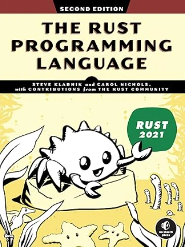

# Using Rust in Jupyter Notebooks on Windows

I highly recommend you read this [page]() where I explain how to install Jupyter and a C++ kernel.

Indeed I assume you can :
* You open an Ubuntu session in a Win Terminal
* Move to the directory, on the WIN11 host, where you plan to keep your Notebooks

```bash
cd /mnt/c/Users/phili/OneDrive/Documents/Programmation/rust_jupyter
```

<div align="center">

</div>

* Activate the conda virtual environment in which Jupyter has been installed
    * ``conda activate multi_jupyter`` in my case

## Note
In the previous [checklist]() the virtual environment was named ``cpp_jupyter``. Since it will cover C++ and Rust I had to rename it with the following 2 commands :

```bash
conda create --name multi_jupyter --clone cpp_jupyter 
conda remove --name cpp_jupyter --all
```

* Launch Jupyter from the Unbuntu terminal

```bash
jupyter lab --no-browser --ip=0.0.0.0
```

<div align="center">

</div>

* Obviously Rust kernel is not yet installed but we should be on the same page. If not, **do not read further** until you can get the Jupyter Lab server up and running. 
    * Feel free to read this [checklist]() 

* Exit the server

<div align="center">

</div>


## 1. Install & Check Rust

```bash
curl https://sh.rustup.rs -sSf | sh -s -- -y
```


<div align="center">

</div>


Restart the shell `source $HOME/.cargo/env`

```bash
rustc --version
cargo --version
```

<div align="center">

</div>


## 2. Install the evcxr_jupyter kernel & Check

```bash
cargo install evcxr_jupyter
evcxr_jupyter --install
```

<div align="center">

</div>

Let's check everything is OK

```bash
jupyter kernelspec list
```

<div align="center">

</div>


## 3. Run Jupyter Lab 

```bash
jupyter lab --no-browser --ip=0.0.0.0
```

<div align="center">

</div>

Click the line that says : ` http://127.0.0.1:8888/lab?token=741904a7a2dfdbca843ca947031cd6a4810f02625c41d2fc`


Tadaa!

<div align="center">

</div>

Let's code

<div align="center">

</div>

## It works but...
* Obviously the "Hello world" cell works
* Regarding the second algorithm
    * Like in C++, I have to remove the ``main()`` function
    * It seems that in a Notebook, every cell and every block ('{' ... '}') are compiled separately so even if I know the code was working (on [Compiler Explorer](https://compiler-explorer.com/) for example) I had to add 2 curly brace : one at the top and another at the bottom
    * I did some testing adding some explicit lifetime in the signature of the `linked_list_midpoint()` function but it did'nt really helped.

Here is the original code : 

```rust
// Define a struct to represent a singly linked list node
#[derive(Debug)]
struct ListNode {
    val: i32,
    next: Option<Box<ListNode>>,
}

// Implement ListNode
impl ListNode {
    fn new(val: i32, next: Option<Box<ListNode>>) -> Self {
        ListNode { val, next }
    }
}

// Function to find the midpoint of the linked list
fn linked_list_midpoint(head: &Option<Box<ListNode>>) -> &ListNode {
// fn linked_list_midpoint<'a>(head: &'a Option<Box<ListNode>>) -> &'a ListNode {     
    let mut slow = head;
    let mut fast = head;

    // Traverse the list using two pointers
    while let Some(f_node) = fast {
        if let Some(f_next) = &f_node.next {
            fast = &f_next.next;
            if let Some(s_node) = slow {
                slow = &s_node.next;
            }
        } else {
            break;
        }
    }

    // At this point, slow points to the midpoint node
    slow.as_ref().unwrap()
}

fn main() {
    // Create linked list: 1 -> 2 -> 4 -> 7 -> 3
    let values = vec![1, 2, 4, 7, 3];
    let mut head: Option<Box<ListNode>> = None;

    // Build the list in reverse order
    for &val in values.iter().rev() {
        head = Some(Box::new(ListNode::new(val, head)));
    }

    // Find and print the midpoint
    let mid = linked_list_midpoint(&head);
    println!("Midpoint value: {}", mid.val);
}
```

Here is the code of the cell. Adding the curly braces is **NOT** optimal, I know, but at least I can check that the toolchain is in place, the compiler working etc.    

```rust
{
// Define a struct to represent a singly linked list node
#[derive(Debug)]
struct ListNode {
    val: i32,
    next: Option<Box<ListNode>>,
}

// Implement ListNode
impl ListNode {
    fn new(val: i32, next: Option<Box<ListNode>>) -> Self {
        ListNode { val, next }
    }
}

// Function to find the midpoint of the linked list
fn linked_list_midpoint(head: &Option<Box<ListNode>>) -> &ListNode {
    let mut slow = head;
    let mut fast = head;

    // Traverse the list using two pointers
    while let Some(f_node) = fast {
        if let Some(f_next) = &f_node.next {
            fast = &f_next.next;
            if let Some(s_node) = slow {
                slow = &s_node.next;
            }
        } else {
            break;
        }
    }

    // At this point, slow points to the midpoint node
    slow.as_ref().unwrap()
}

// fn main() {
    // Create linked list: 1 -> 2 -> 4 -> 7 -> 3
    let values = vec![1, 2, 4, 7, 3];
    let mut head: Option<Box<ListNode>> = None;

    // Build the list in reverse order
    for &val in values.iter().rev() {
        head = Some(Box::new(ListNode::new(val, head)));
    }

    // Find and print the midpoint
    let mid = linked_list_midpoint(&head);
    println!("Midpoint value: {}", mid.val);
// }
}
```


## What is next ?

* I'm now be able to write Rust code snippets 
    1. Run Ubuntu 
    1. `cd /mnt/c/Users/phili/OneDrive/Documents/Programmation/rust_jupyter`
    1. ``jupyter lab --no-browser --ip=0.0.0.0`` 
* Today I'm still waiting for the book ([The Rust Programming Language](https://www.amazon.fr/gp/product/1718503105)) is here.

<div align="center">

</div>


