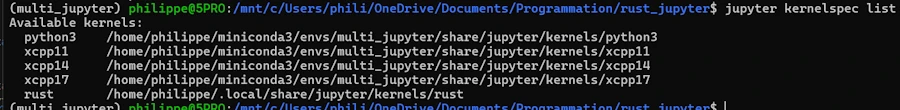

# Using Rust in Jupyter Notebooks on Windows

<div align="center">

</div>

I highly recommend you to read this [checklist]() where I explain, in 6 easy steps, how to install Jupyter Lab (Jupyter Server + Jupyter Lab UI) and xeus-cling (C++ kernel).

Indeed I assume you can :
* 1 - Open an Ubuntu in WSL on your favorite WIN11 host (if this gets tricky, you’re in real trouble. Try to call Houston, you never know... 🚀)
* 2 - Then change to the directory, on the WIN11 host, where you plan to keep your Notebooks

```bash
cd /mnt/c/Users/phili/OneDrive/Documents/Programmation/rust_jupyter
```

<div align="center">

</div>

* 3 - Activate the conda virtual environment in which Jupyter has been installed

```bash
conda activate multi_jupyter
```

* 4 - Launch the Jupyter Lab from Ubuntu terminal

```bash
jupyter lab --no-browser --ip=0.0.0.0
```

<div align="center">

</div>

* 5 - Exit the server using the ``File/Shut Down`` option in Jupyter Lab UI 

<div align="center">

</div>


## Note about the name of the virtual environment 
In the previous [checklist]() the virtual environment was named ``cpp_jupyter``. Since I will use it with C++ and Rust I renamed it with the following 2 commands :

```bash
conda create --name multi_jupyter --clone cpp_jupyter 
conda remove --name cpp_jupyter --all
```


## Note about Jupyter components
* Jupyter : open source project (Julia + Python + R)
* Jupyter Lab : the frontend. Launched with `jupyter lab --no-browser --ip=0.0.0.0` for example
* Jupyter Server : the backend, manage the kernels, the notebooks... Used by Jupyter Lab
    * jupyter lab = jupyter server + frontend (lab typically)
* Kernels : 
    * ipykernel for Python
    * xeus-cling for C++
    * evcxr_jupyter for Rust


Obviously, at this stage, Rust kernel is not yet installed but we should be on the same page. If not, **do not read further** until you can get the Jupyter Lab in your browser. Again, feel free to read this [checklist]() 


## 1. Install & Check Rust

In the Ubuntu terminal

```bash
curl https://sh.rustup.rs -sSf | sh -s -- -y
```

<div align="center">

</div>


Restart the shell `source $HOME/.cargo/env`

```bash
rustc --version
cargo --version
```

<div align="center">

</div>


## 2. Install the evcxr_jupyter kernel & Check

In the Ubuntu terminal

```bash
cargo install evcxr_jupyter
evcxr_jupyter --install
```

<div align="center">

</div>

Let's check everything is OK

```bash
jupyter kernelspec list
```

<div align="center">

</div>

Above I see the Python kernel, 3 C++ kernels and the Rust kernel.


## 3. Run Jupyter Lab 

In the Ubuntu terminal

```bash
jupyter lab --no-browser --ip=0.0.0.0
```

<div align="center">

</div>

Click on the line that says : `http://127.0.0.1:8888/lab?token=741904a7a2dfdbca843ca947031cd6a4810f02625c41d2fc`


**Tadaa !**

<div align="center">

</div>


Let's write some code

<div align="center">

</div>


## It works but...
* **TOO BAD**. There is no way to set a breakpoint 😡. This is a problem with the Rust kernel. Indeed with the Python or C++ kernels, "Yes we can!". To tell the truth I'm a little bit disappointed.
* Like in C++, I had to remove the ``main()`` function
* **IMPORTANT**. It seems that in a Notebook, every cell and every block ('{' ... '}') are compiled separately so even if I know the code was working (on [Compiler Explorer](https://compiler-explorer.com/) for example) I had to add 2 curly braces : one at the top and another at the bottom
* As one can see in the comments, I tried to add some lifetime in the signature of the `linked_list_midpoint()` function but it did'nt really help.

Just to make sure, here is the original code: 

```rust
// Define a struct to represent a singly linked list node
#[derive(Debug)]
struct ListNode {
    val: i32,
    next: Option<Box<ListNode>>,
}

// Implement ListNode
impl ListNode {
    fn new(val: i32, next: Option<Box<ListNode>>) -> Self {
        ListNode { val, next }
    }
}

// Function to find the midpoint of the linked list
fn linked_list_midpoint(head: &Option<Box<ListNode>>) -> &ListNode {
// fn linked_list_midpoint<'a>(head: &'a Option<Box<ListNode>>) -> &'a ListNode {     
    let mut slow = head;
    let mut fast = head;

    // Traverse the list using two pointers
    while let Some(f_node) = fast {
        if let Some(f_next) = &f_node.next {
            fast = &f_next.next;
            if let Some(s_node) = slow {
                slow = &s_node.next;
            }
        } else {
            break;
        }
    }

    // At this point, slow points to the midpoint node
    slow.as_ref().unwrap()
}

fn main() {
    // Create linked list: 1 -> 2 -> 4 -> 7 -> 3
    let values = vec![1, 2, 4, 7, 3];
    let mut head: Option<Box<ListNode>> = None;

    // Build the list in reverse order
    for &val in values.iter().rev() {
        head = Some(Box::new(ListNode::new(val, head)));
    }

    // Find and print the midpoint
    let mid = linked_list_midpoint(&head);
    println!("Midpoint value: {}", mid.val);
}
```

Now, here is the code of the cell. Adding the curly braces is **NOT** optimal, I know, but at least I can check that the toolchain is in place, the compiler working etc.    

```rust
{
// Define a struct to represent a singly linked list node
#[derive(Debug)]
struct ListNode {
    val: i32,
    next: Option<Box<ListNode>>,
}

// Implement ListNode
impl ListNode {
    fn new(val: i32, next: Option<Box<ListNode>>) -> Self {
        ListNode { val, next }
    }
}

// Function to find the midpoint of the linked list
fn linked_list_midpoint(head: &Option<Box<ListNode>>) -> &ListNode {
    let mut slow = head;
    let mut fast = head;

    // Traverse the list using two pointers
    while let Some(f_node) = fast {
        if let Some(f_next) = &f_node.next {
            fast = &f_next.next;
            if let Some(s_node) = slow {
                slow = &s_node.next;
            }
        } else {
            break;
        }
    }

    // At this point, slow points to the midpoint node
    slow.as_ref().unwrap()
}

// fn main() {
    // Create linked list: 1 -> 2 -> 4 -> 7 -> 3
    let values = vec![1, 2, 4, 7, 3];
    let mut head: Option<Box<ListNode>> = None;

    // Build the list in reverse order
    for &val in values.iter().rev() {
        head = Some(Box::new(ListNode::new(val, head)));
    }

    // Find and print the midpoint
    let mid = linked_list_midpoint(&head);
    println!("Midpoint value: {}", mid.val);
// }
}
```


## What is next ?

* I can easily write Rust code snippets and add some documentation using Jupyter Notebooks 
* The process is :
    1. Run Ubuntu 
    1. `conda activate multi_jupyter`
    1. `cd /mnt/c/Users/phili/OneDrive/Documents/Programmation/rust_jupyter`
    1. ``jupyter lab --no-browser --ip=0.0.0.0`` 

To speed up things, I created a script (`run_rust_jupyter.sh` saved in my home) and an alias so that I just have to type `rustnb`. Below, read the comments :

```bash
#!/bin/bash

# chmod +x ~/run_rust_jupyter.sh
# ./run_rust_jupyter.sh

# Create an alias
#   At the end of ~/.bashrc add :
#       alias rustnb='~/run_rust_jupyter.sh'
#   Then                : source ~/.bashrc
#   Then you can invoke : rustnb

# ! IMPORTANT Load Conda into the shell (critical for using 'conda activate' in scripts)
source ~/miniconda3/etc/profile.d/conda.sh

# Activate the multi_jupyter environment
echo "Activating conda environment: multi_jupyter"
conda activate multi_jupyter

# Move to the directory
cd /mnt/c/Users/phili/OneDrive/Documents/Programmation/rust_jupyter || {
    echo "Directory not found."
    exit 1
}

# Launch Jupyter Lab
echo "Starting Jupyter Lab..."
jupyter lab --no-browser --ip=0.0.0.0
```


Today, I'm still waiting for the book : [The Rust Programming Language](https://www.amazon.fr/gp/product/1718503105)

<div align="center">

</div>


## How to update ?

### Update of JupyterLab

* Make sure JupyterLab server is closed
* Under the Ubuntu session

```bash
conda activate multi_jupyter
conda update -n base -c defaults conda
conda update -c conda-forge jupyterlab
jupyter lab --version
```

## Update of the Rust Kernel
On this page, check [the latest version.](https://crates.io/crates/evcxr_jupyter)

### Get current version
* In the terminal
```bash
cargo install --list | grep evcxr_jupyter
```
* In a Notebook, you can alternatively create a new cell and type
```bash
:version
```
Then CTRL+ENTER

### Update Rust

In the terminal

```bash
rustup update
rustc --version
```

### Update Rust Kernel

```bash
cargo install evcxr_jupyter --force
evcxr_jupyter --install
cargo install --list | grep evcxr_jupyter
```