# Multithreaded Mandelbrot Sets in Rust

<div align="center">

</div>


## Introduction
En 2025 j'ai décidé d'apprendre Rust.

<div align="center">

</div>

Tu trouveras ci-dessous les différentes étapes de l'un de mes tout premiers test. Je n'avais pas encore lu **THE** livre, je veux parler de [The Rust Programming Language](https://www.amazon.fr/dp/1718503105?ref=ppx_yo2ov_dt_b_fed_asin_title).

<div align="center">

</div>

**TRPL** est [disponible en ligne](https://doc.rust-lang.org/book/title-page.html).

J'ai passé pas mal de temps sur YouTube et je suis tombé sur la vidéo ci-dessous dans laquelle le développeur montre comment il incorpore une lib PNG pour sauver l'image d'[un ensemble de Mandelbrot](https://fr.wikipedia.org/wiki/Ensemble_de_Mandelbrot) dans un fichier. 

Je te propose de regarder l'extrait en question puis de revenir ici.

<div align="center">
<iframe width="560" height="315" src="https://www.youtube.com/embed/k7nAtrwPhR8?si=Q4C6-UgT5lTvJLwP&amp;start=3130" title="YouTube video player" frameborder="0" allow="accelerometer; autoplay; clipboard-write; encrypted-media; gyroscope; picture-in-picture; web-share" referrerpolicy="strict-origin-when-cross-origin" allowfullscreen></iframe>
</div>

De mon point de vue, c'est une bonne idée de projet. En effet, ce n'est pas très compliqué mais surtout ça permet de "voir" un résultat. En tout cas c'est plus excitant que d'afficher du texte dans une console. Bon allez c'est parti...


## Prérequis
Oui, oui c'est parti... Mais, bon, tout le monde le sait, avant de partir, il faudra bien se couvrir 🎼... Bref :

* Rust est installé 
    * Quelque soit l'OS, la procédure est simple et [détaillée ici](https://doc.rust-lang.org/book/ch01-01-installation.html#installing-rustup-on-windows)
* En ce qui me concerne 
    * je suis sous l'excellent WIN11
    * j'utilise VSCode
    * j'y ai installé l'extension ``rust-analyzer`` de rust-lang.org
    * ainsi que l'extension ``C/C++`` de Microsoft (elle permet de déboguer le code Rust)

## Remarques 
* L'ensemble du projet est disponible sur [GitHub](https://github.com/40tude/rust_mandelbrot) 
* Il y a 12 versions du code 
* Dans le projet il faut renommer ``main.rs`` la version qu'on souhaite lancer
* Dans l'image ci-dessous (clique sur l'image pour l'agrandir si besoin), sur la gauche, on voit les différentes versions de ``main.rs`` (de ``main_00.rs`` à ``main_11.rs``) 
* En haut du code source ouvert, on lit que le fichier "actif" `main.rs` s'appelle normalement `main_00.rs` Ca peut aider en cas de "poliotage" et oui, ça sent le vécu.

<div align="center">
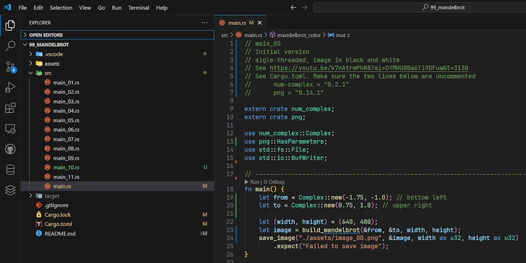
</div>

* Dans chaque code source il y a, en haut, un récapitulatif des principales modifications
* Dans le code, d'une version à l'autre, j'ai pris soin de ne garder que les nouveaux commentaires. Ils sont en Anglais mais bon ça devrait bien se passer. 
* Ne garder que les derniers commentaires permet de focaliser sur les changements
* Quand il y a des modifications dans le code :
    * je mets en commentaire le code de la version précédente
    * j'ajoute les nouvelles lignes de code
    * dans la version suivante je supprime les lignes en commentaire

Par exemple dans la version 00 on a, dans la fonction ``save_image()`` le code ci-dessous : 

```rust
let mut encoder = png::Encoder::new(w, width, height);
    encoder
        .set(png::ColorType::Grayscale)
        .set(png::BitDepth::Eight);
```

Ensuite dans la version 01 on a :

```rust
let mut encoder = png::Encoder::new(w, width, height);
    // encoder
    //     .set(png::ColorType::Grayscale)
    //     .set(png::BitDepth::Eight);
    encoder.set_color(png::ColorType::Grayscale);
    encoder.set_depth(png::BitDepth::Eight);
```
Enfin dan la version 02 on a :

```rust
let mut encoder = png::Encoder::new(w, width, height);
    // encoder.set_color(png::ColorType::Grayscale);
    encoder.set_color(png::ColorType::Rgb); // RGB rather than Grayscale
    encoder.set_depth(png::BitDepth::Eight);
```

C'est un peu lourd à gérer au niveau de l'édition mais bon, je trouve que cela permet de suivre plus facilement l'évolution du code.


## Toute première fois. Toute, toute première fois (JM, 1985 🎹)

J'ouvre un terminal. Je fais ``cargo new mandel``. Je me retrouve avec un répertoire `mandel` que j'ouvre avec VSCode. 

Dans un tout premier temps je souhaite faire fonctionner exactement le même code que celui de la vidéo. J'édite le fichier ``Cargo.toml`` pour y ajouter les bibliothèques ``num-complex`` et ``png`` dans les mêmes versions (c'est important) que celles utilisées dans la vidéo. 

```toml
[package]
name = "mandel"
version = "0.1.0"
edition = "2024"

[dependencies]
num-complex = "0.2.1"
png = "0.14.1"
```

Quand c'est fait je copie le code que l'on peut voir dans la vidéo (je n'ai pas retrouvé le code sur GitHub ou autre)


```rust
// main_00
// Initial version
// sigle-threaded, image in black and white
// See https://youtu.be/k7nAtrwPhR8?si=OYMHU8Ba6Ti9DFua&t=3130
// See Cargo.toml. Make sure the two lines below are uncommented
//      num-complex = "0.2.1"
//      png = "0.14.1"

extern crate num_complex;
extern crate png;

use num_complex::Complex;
use png::HasParameters;
use std::fs::File;
use std::io::BufWriter;

// ----------------------------------------------------------------------------
fn main() {
    let from = Complex::new(-1.75, -1.0); // bottom left
    let to = Complex::new(0.75, 1.0); // upper right

    let (width, height) = (640, 480);
    let image = build_mandelbrot(&from, &to, width, height);
    save_image("./assets/image_00.png", &image, width as u32, height as u32)
        .expect("Failed to save image");
}

// ----------------------------------------------------------------------------
fn build_mandelbrot(from: &Complex<f64>, to: &Complex<f64>, width: i32, height: i32) -> Vec<u8> {
    let mut image = Vec::new();
    image.reserve(width as usize * height as usize);

    let size = to - from;

    for y in 0..height {
        for x in 0..width {
            let c = from
                + Complex::new(
                    x as f64 * size.re / width as f64,
                    y as f64 * size.im / height as f64,
                );
            let color = mandelbrot_color(&c);
            image.push(color);
        }
    }
    image
}

// ----------------------------------------------------------------------------
fn mandelbrot_color(c: &Complex<f64>) -> u8 {
    const ITERATIONS: i32 = 1_000;
    let mut z = Complex::new(0.0, 0.0);

    for _ in 0..ITERATIONS {
        z = z * z + c;
        if z.norm_sqr() > 4.0 {
            break;
        }
    }
    if z.norm_sqr() > 4.0 { 0xff } else { 0 }
}

// ----------------------------------------------------------------------------
fn save_image(
    filename: &str,
    data: &Vec<u8>,
    width: u32,
    height: u32,
) -> Result<(), png::EncodingError> {
    let file = File::create(filename).unwrap();
    let ref mut w = BufWriter::new(file);

    let mut encoder = png::Encoder::new(w, width, height);
    encoder
        .set(png::ColorType::Grayscale)
        .set(png::BitDepth::Eight);

    let mut writer = encoder.write_header().unwrap();
    writer.write_image_data(data.as_slice())
}


```

### Explications à propos du code
Dans la fonction ``main()`` 
* On définit les points en bas à gauche et en haut à droite qui déterminent, dans l'espace complexe, le rectangle à traiter
* On fixe les dimensions de l'image à 640 par 480 pixels
* On invoque la fonction ``build_mandelbrot()`` en lui passant les rectangles dans les espaces des complexes et des pixels
* On sauve l'image `image_00.png` dans le répertoire ``./assets``

Dans la fonction ``build_mandelbrot()`` 
* On parcourt l'ensemble des pixels de l'image. 
* On fait correspondre à chaque pixel un point de l'espace complexe
* Une fois qu'on a le point complexe, on appelle ``mandelbrot_color()``
* On récupère une couleur qu'on sauve dans l'image (qui est un vecteur qui comprend ``width*height`` pixels) 
* On retourne l'image

Dans la fonction ``mandelbrot_color()``
* On applique simplement la règle de détermination de la couleur
* Par contre, contrairement à ce qui est montré dans la vidéo, ce code génère une image en noir et blanc (voir la valeur retournée à la dernière ligne). On nous aurait menti?

Dans la fonction `save_image()`
* On ouvre un fichier, on crée un buffer en écriture ainsi qu'un encoder PNG dont on fixe le jeu de couleurs et la profondeur (8 bits)
* Finalement l'encodeur écrit l'en-tête du fichier PNG et les données de l'image

### Lancer le code
* Suffit d'ouvrir un terminal (CTRL + ù)
* ``cargo run``

Voilà ce que je vois :

<div align="center">
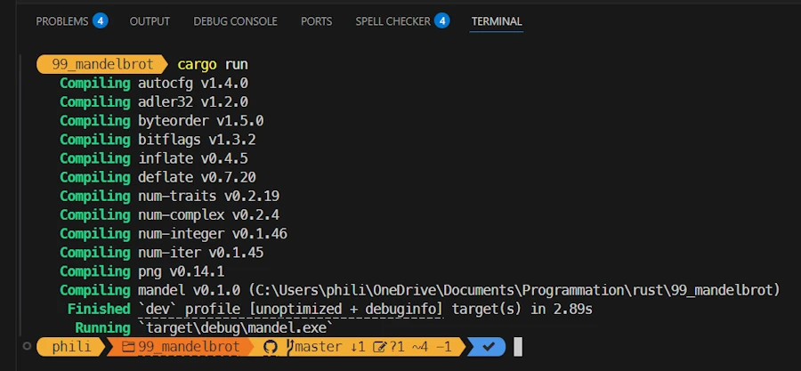
</div>

À la fin, dans le répertoire ``./assets`` je retrouve une image ``image_00.png`` bien moche, en noir et blanc.

<div align="center">
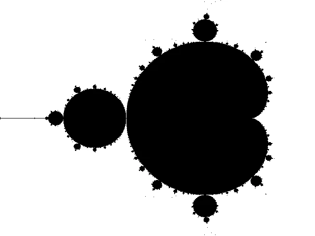
</div>

### Debug

Je te propose de créer un répertoire ``.vscode`` et d'y déposer le fichier `launch.json` ci-dessous :

```json
{
    "configurations": [
        {
            "type": "cppvsdbg",
            "request": "launch",
            "name": "run mandel",
            "cwd": "${workspaceFolder}",
            "program": "${workspaceFolder}\\target\\debug\\mandel.exe",
            "environment": [
                {
                    "name": "RUST_BACKTRACE",
                    "value": "short"
                },
                {
                    "name": "RUSTC_TOOLCHAIN",
                    "value": "C:\\Users\\phili\\.rustup\\toolchains\\stable-x86_64-pc-windows-msvc"
                }
            ],
            "args": [],
            "sourceFileMap": {},
            "osx": {
                "MIMode": "lldb"
            }
        }
    ]
}

```

Ensuite tu pose un point d'arrêt sur une des lignes et enfin tu appuies sur F5. Ci-dessous on voit que j'ai posé un point d'arrêt sur la ligne 19 et que l'exécution s'y arrête. Je peux alors inspecter mes variables etc. 

<div align="center">
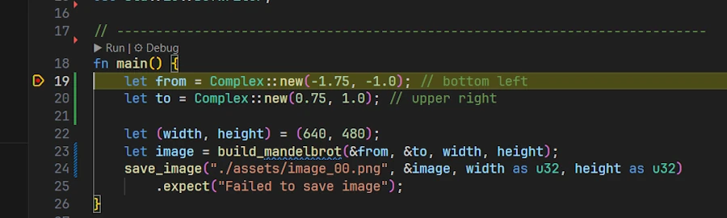
</div>


### Remarques
* Il est important d'arriver aux résultats précédents (code qui tourne + debug) et de mon point de vue, ce n'est pas la peine d'aller plus loin sinon.
* En effet, quand ça, ça tourne, on est sûr que notre setup est en place et qu'on a une bonne base de départ.
* La suite du programme 
    1. Utiliser les bibliothèques ``png`` et ``num-complex`` dans leur dernières versions respectives
    1. Générer des images en couleurs
    1. Générer des images en couleurs pas trop moches
    1. Mettre en place ce qu'il faut pour mesurer le temps
    1. Multithread


## Mise à jour des bibliothèques 

Dans mon cas, l'étape précédente ne c'est pas bien passée. J'ai installé les versions de ``num-complex`` et de ``png`` dans leur version courante et là ça ne passait pas à la compilation. En fait les API avaient été modifiées. Du coup j'ai saisi en dur dans ``Cargo.toml`` les numéros de versions utilisés à l'époque et là c'est passé.

OK c'est bien beau mais autant modifier le code pour utiliser les versions courantes. Je te propose de : 
1. Renommer le fichier ``main.rs`` en ``main_00.rs``
1. Renommer le fichier ``main_01.rs`` en ``main.rs``
1. D'utiliser cette nouvelle version du fichier ``Cargo.toml``

```
[package]
name = "mandel"
version = "0.1.0"
edition = "2024"

[dependencies]
# Only for main_00.rs
# num-complex = "0.2.1"
# png = "0.14.1"

# main_01.rs and above
num-complex = "0.4.6"
png = "0.17.16"
# crossbeam = "0.8.4"
```

Enfin tu peux relancer le code avec un `cargo run`. Voilà ce que je vois alors dans mon terminal sous VSCode.

<div align="center">
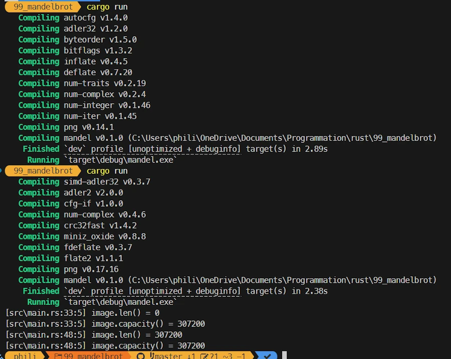
</div>

On voit bien que pour ce run, il est allé cherché les lib ``png`` et ``num-complex`` dans leurs dernières versions. J'ai laissé les affichages du run précédent pour pouvoir comparer.

Pour le reste, il a fallu modifier le code comme indiqué ci-dessous : 

```rust
// main_01
// uses, in April 2025, current versions of num-complex & png
// see Cargo.toml. For main_01 and above, make sure the two lines below are uncommented
//      num-complex = "0.4.6"
//      png = "0.17.16"
// the impact is mostly impact the encoder in save_image()
// update how image is allocated in build_mandelbrot() + add debug info
// the image is still black and white

extern crate num_complex;
extern crate png;

use num_complex::Complex;
// use png::HasParameters;
use std::fs::File;
use std::io::BufWriter;

// ----------------------------------------------------------------------------
fn main() {
    let from = Complex::new(-1.75, -1.0);
    let to = Complex::new(0.75, 1.0);

    let (width, height) = (640, 480);
    let image = build_mandelbrot(&from, &to, width, height);
    save_image("./assets/image_01.png", &image, width, height).expect("Failed to save image");
}

// ----------------------------------------------------------------------------
fn build_mandelbrot(from: &Complex<f64>, to: &Complex<f64>, width: u32, height: u32) -> Vec<u8> {
    // let mut image = Vec::new();
    // image.reserve(width as usize * height as usize);
    let mut image: Vec<u8> = Vec::with_capacity((width * height) as usize);
    dbg!(image.len(), image.capacity());

    let size = to - from;

    for y in 0..height {
        for x in 0..width {
            let c = from
                + Complex::new(
                    x as f64 * size.re / width as f64,
                    y as f64 * size.im / height as f64,
                );
            let color = mandelbrot_color(&c);
            image.push(color);
        }
    }
    dbg!(image.len(), image.capacity());
    image
}

// ----------------------------------------------------------------------------
fn mandelbrot_color(c: &Complex<f64>) -> u8 {
    const ITERATIONS: i32 = 1_000;
    let mut z = Complex::new(0.0, 0.0);

    for _ in 0..ITERATIONS {
        z = z * z + c;
        if z.norm_sqr() > 4.0 {
            break;
        }
    }
    if z.norm_sqr() > 4.0 { 0xff } else { 0 }
}

// ----------------------------------------------------------------------------
fn save_image(
    filename: &str,
    data: &Vec<u8>,
    width: u32,
    height: u32,
) -> Result<(), png::EncodingError> {
    let file = File::create(filename).unwrap();
    let ref mut w = BufWriter::new(file);

    let mut encoder = png::Encoder::new(w, width, height);
    // encoder
    //     .set(png::ColorType::Grayscale)
    //     .set(png::BitDepth::Eight);
    encoder.set_color(png::ColorType::Grayscale);
    encoder.set_depth(png::BitDepth::Eight);

    let mut writer = encoder.write_header().unwrap();
    writer.write_image_data(data.as_slice())
}


```


### Explications à propos du code

Le `use png::HasParameters;` n'est plus nécessaire

Dans la fonction `main()` 
* Je renomme l'image en ``image_01.png``

Dans la  fonction ``build_mandelbrot()`` 
* Je remplace 2 lignes de code par une ligne `Vec::with_capacity` 
* J'ajoute des sorties `dbg!(image.len(), image.capacity());` pour vérifier comment cela se passe au niveau de l'utilisation de l'espace réservé

Dans la fonction `save_image()` 
* j'utilise la nouvelle API pour paramétrer l'encodeur PNG
    

Voici la nouvelle image toujours aussi moche

<div align="center">

</div>


## Première image en couleur

On va maintenant modifier le code pour sauver l'image en couleur. T'excites pas trop ça va pas te plaire du tout. Voici le code modifié :

```rust
// main_02
// image weird but in color (./assets/image_rgb_02.png)
// RGB support impacts :
//      - the size of the image
//      - how colors are saved in the image build_mandelbrot()
//      - the signature of mandelbrot_color()

extern crate num_complex;
extern crate png;

use num_complex::Complex;
use std::fs::File;
use std::io::BufWriter;

// ----------------------------------------------------------------------------
fn main() {
    let from = Complex::new(-1.75, -1.0);
    let to = Complex::new(0.75, 1.0);

    let (width, height) = (640, 480);
    let image = build_mandelbrot(&from, &to, width, height);
    save_image("./assets/image_rgb_02.png", &image, width, height).expect("Failed to save image");
}

// ----------------------------------------------------------------------------
fn build_mandelbrot(from: &Complex<f64>, to: &Complex<f64>, width: u32, height: u32) -> Vec<u8> {
    // let mut image: Vec<u8> = Vec::with_capacity((width * height) as usize);
    let mut image: Vec<u8> = Vec::with_capacity((width * height * 3) as usize); // 3 bytes per pixel (RGB)
    dbg!(image.len(), image.capacity());

    let size = to - from;

    for y in 0..height {
        for x in 0..width {
            let c = from
                + Complex::new(
                    x as f64 * size.re / width as f64,
                    y as f64 * size.im / height as f64,
                );
            // let color = mandelbrot_color(&c);
            // image.push(color);
            let (r, g, b) = mandelbrot_color(&c);
            image.push(r);
            image.push(g);
            image.push(b);
        }
    }
    dbg!(image.len(), image.capacity());
    image
}

// ----------------------------------------------------------------------------
fn mandelbrot_color(c: &Complex<f64>) -> (u8, u8, u8) {
    const ITERATIONS: u32 = 1_000;
    let mut z = Complex::new(0.0, 0.0);
    let mut i = 0;

    for t in 0..ITERATIONS {
        z = z * z + c;
        if z.norm_sqr() > 4.0 {
            i = t;
            break;
        }
    }

    if z.norm_sqr() > 4.0 {
        // Convert iteration in color (shades of blue)
        let b = (255.0 * (i as f64 / ITERATIONS as f64)) as u8;
        (0, 0, b) // blue
    } else {
        (0, 0, 0) // black
    }
}

// ----------------------------------------------------------------------------
fn save_image(
    filename: &str,
    data: &Vec<u8>,
    width: u32,
    height: u32,
) -> Result<(), png::EncodingError> {
    let file = File::create(filename).unwrap();
    let ref mut w = BufWriter::new(file);

    let mut encoder = png::Encoder::new(w, width, height);
    // encoder.set_color(png::ColorType::Grayscale);
    encoder.set_color(png::ColorType::Rgb); // RGB rather than Grayscale
    encoder.set_depth(png::BitDepth::Eight);

    let mut writer = encoder.write_header().unwrap();
    writer.write_image_data(data.as_slice())
}
```
### Explications à propos du code

Dans ``build_mandelbrot()`` 
* il faut une image 3 fois plus grande car chaque pixel est dorénavant codé sur 3 octets (au lieu de 1 jusqu'à présent)
* au retour de la fonction ``mandelbrot_color()`` on a dorénavant 3 composantes ``r``, ``g`` et ``b`` et au lieu d'une unique couleur `color`
* bien sûr on passe de 1 push à 3 push 

Dans ``mandelbrot_color()`` 
* comme j'ai pas d'idée et que je veux faire simple
* je ne joue que sur la composante bleue 
* je fais une règle de 3 pour ramener l'indice ``i`` entre 0 et 255

Dans `save_image()` 
* on indique juste à l'encoder qu'on travaille dorénavant en ``Rgb`` et plus en ``Grayscale``

Comment te dire... C'est très moche. La première image est en couleur, on voit quelques pixels en plus mais c'est franchement pas ouf. Si besoin, clique dessus et zoome. Dans la seconde, j'ai juste fais un zoom avec Paint.NET sur une partie de la première.

<div align="center">

</div>

<div align="center">

</div>


## La bonne palette de couleurs

Je te passe les détails. Note juste que dans le code ci-dessous la version passe de main_02 à main_05. Entre temps j'ai fait des tests pas trop concluant.

```rust
// main_05
// Success!
// I really like the Austin Powers pallette

extern crate num_complex;
extern crate png;

use num_complex::Complex;
use std::fs::File;
use std::io::BufWriter;

// ----------------------------------------------------------------------------
fn main() {
    let from = Complex::new(-1.75, -1.0);
    let to = Complex::new(0.75, 1.0);

    let (width, height) = (640, 480);
    let image = build_mandelbrot(&from, &to, width, height);
    save_image("./assets/image_rgb_05.png", &image, width, height).expect("Failed to save image");
}

// ----------------------------------------------------------------------------
fn build_mandelbrot(from: &Complex<f64>, to: &Complex<f64>, width: u32, height: u32) -> Vec<u8> {
    let mut image: Vec<u8> = Vec::with_capacity((width * height * 3) as usize);
    dbg!(image.len(), image.capacity());

    let size = to - from;

    for y in 0..height {
        for x in 0..width {
            let c = from
                + Complex::new(
                    x as f64 * size.re / width as f64,
                    y as f64 * size.im / height as f64,
                );
            let (r, g, b) = mandelbrot_color(&c);
            image.push(r);
            image.push(g);
            image.push(b);
        }
    }
    dbg!(image.len(), image.capacity());
    image
}

// ----------------------------------------------------------------------------
fn mandelbrot_color(c: &Complex<f64>) -> (u8, u8, u8) {
    const ITERATIONS: u32 = 1_000;
    let mut z = Complex::new(0.0, 0.0);
    let mut i = 0;

    for t in 0..ITERATIONS {
        z = z * z + c;
        if z.norm_sqr() > 4.0 {
            i = t;
            break;
        }
    }

    if i == 0 {
        return (0, 0, 0); // in the set 
    }

    // Austin Powers is back in town
    // Soft log scale
    let zn = z.norm_sqr().sqrt().ln() / 2.0;
    let smooth_i = (i as f64) + 1.0 - zn.ln() / std::f64::consts::LN_2;

    // Modulate with HSV palette -> RGB simplified
    let hue = smooth_i * 0.1;
    let r = (0.5 + 0.5 * (6.2831 * (hue + 0.0)).cos()) * 255.0;
    let g = (0.5 + 0.5 * (6.2831 * (hue + 0.33)).cos()) * 255.0;
    let b = (0.5 + 0.5 * (6.2831 * (hue + 0.66)).cos()) * 255.0;

    (r as u8, g as u8, b as u8)
}

// ----------------------------------------------------------------------------
fn save_image(
    filename: &str,
    data: &Vec<u8>,
    width: u32,
    height: u32,
) -> Result<(), png::EncodingError> {
    let file = File::create(filename).unwrap();
    let ref mut w = BufWriter::new(file);

    let mut encoder = png::Encoder::new(w, width, height);
    encoder.set_color(png::ColorType::Rgb);
    encoder.set_depth(png::BitDepth::Eight);

    let mut writer = encoder.write_header().unwrap();
    writer.write_image_data(data.as_slice())
}


```

### Explications à propos du code
Dans la fonction ``mandelbrot_color()``
* Je joue juste sur la palette 

Voici les différentes versions des images générées

**Version 03** : C'est l'inverse de la précédente. Pas top.

<div align="center">
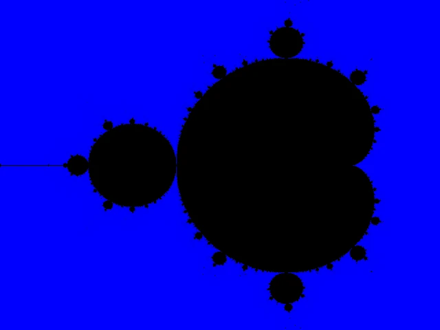
</div>

**Version 04** : Y a du mieux, il y a différentes couleurs mais bon c'est limité à la bordure.

<div align="center">
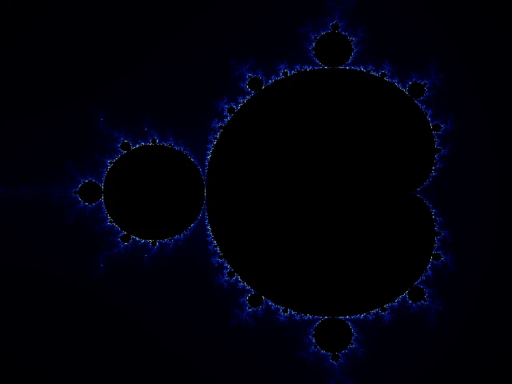
</div>

**Version 05** : C'est la bonne. On la garde. Si t'es pas content, fais moi un procès...

<div align="center">
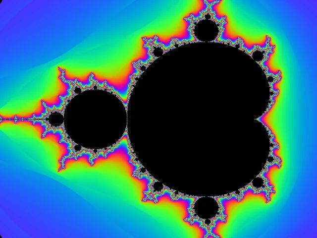
</div>


## Mise en place d'un benchmarking

Avec tout ça on a toujours pas commencé à parler de multithreading mais bon on y arrive... Et afin de pouvoir comparer les gains de performances, on va mettre en place une mesure du temps que prend la fonction ``build_mandelbrot()``. La fonction ``main()`` est la seul impactée. Ci-dessous je ne montre que son code.

```rust

// main_06
// set the Mandelbrot set at the right place with the right scale
// add benchmarking (937, 113) ms respectively in debug and release mode
// we're ready for the multithreaded version

// TODO : issues with scaling
// TODO : add a zoom and be able to move the centre of the view_rectangle in complex space

extern crate num_complex;
extern crate png;

use num_complex::Complex;
use std::fs::File;
use std::io::BufWriter;
use std::time::Instant;

// ----------------------------------------------------------------------------
fn main() {
    // Initially the area goes from -2.5 to 1.0 on the x-axis and from -1.0 to 1.0 on the y-axis
    // The image is 640x480 => the ratio is 4/3 (1.33).
    // So if x is 3.5 wide, y must be 3.5/1.33 = 2.63 wide (=> [-1.315, -1.315])
    let (width, height) = (640, 480);
    let from = Complex::new(-2.5, -1.315);
    let to = Complex::new(1.0, 1.315);

    let start = Instant::now();
    let image = build_mandelbrot(&from, &to, width, height);
    let duration = start.elapsed(); // Time measurement
    println!("Single-threaded : {} ms.", duration.as_millis());

    save_image("./assets/image_rgb_06.png", &image, width, height).expect("Failed to save image");
}

```

### Explications à propos du code

Dans la fonction ``main()``
* J'encadre juste l'appel à la fonction ``build_mandelbrot()`` avec 2 mesures du temps avant d'en afficher la différence en millisecondes.
* À ce stade, en mode Debug (``cargo run``) on est à 937 ms et en mode Release (``cargo run --release``) on est à 113 ms. Pas mal, pas mal.
* Sinon, j'en profite aussi pour régler un détail de correspondance de ratio entre les espaces des complexes et des pixels
* En gros, au tout début de la fonction ``main()`` j'explique que j'ajuste les coordonnées des points ``from`` et ``to`` pour que le rectangle dans l'espace complexe ait, lui aussi, un ratio de 1.33 comme dans l'image 640x480.

Ci-dessous l'image obtenue. On remarque que l'ensemble de Mandelbrot a "reculé" un peu. 

<div align="center">
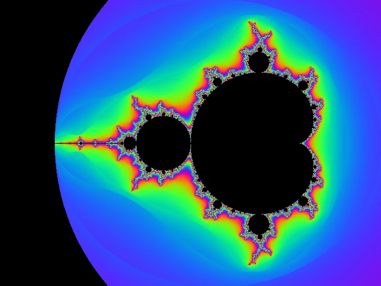
</div>

Surtout, dorénavant, au niveau de la console, on affiche combien de temps il faut pour calculer l'image. Ci-dessous on est en mode Debug.

<div align="center">
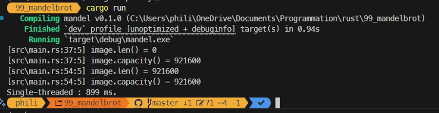
</div>


## Première version multithreaded

Les fonctions ``save_image()``, ``mandelbrot_color()`` et ``build_mandelbrot()`` ne changent pas. Je ne les fait apparaître dans le code source ci-dessous.

```rust
// main_07
// compare single-threaded and multithreaded code
// add mt_build_mandelbrot() function
// build_mandelbrot(), save_image() and mandelbrot_color() remains the same
// ./assets/image_rgb_07.png and ./assets/image_rgb_mt_07.png are generated

// TODO : issues with scaling
// TODO : add a zoom and be able to move the centre of the view_rectangle in complex space

extern crate num_complex;
extern crate png;

use num_complex::Complex;
use std::fs::File;
use std::io::BufWriter;
use std::thread;
use std::time::Instant;

// ----------------------------------------------------------------------------
fn main() {
    let (width, height) = (640, 480);
    let from = Complex::new(-2.5, -1.315);
    let to = Complex::new(1.0, 1.315);

    let start = Instant::now();
    let image = build_mandelbrot(&from, &to, width, height);
    let duration = start.elapsed();
    println!("Single-threaded : {} ms.", duration.as_millis());
    save_image("./assets/image_rgb_07.png", &image, width, height).expect("Failed to save image");

    let start = Instant::now();
    let image = mt_build_mandelbrot(&from, &to, width, height);
    let duration = start.elapsed();
    println!("Multithreaded   : {} ms.", duration.as_millis());
    save_image("./assets/image_rgb_mt_07.png", &image, width, height)
        .expect("Failed to save image");
}

// ----------------------------------------------------------------------------
// At this stage, the number of threads is arbitrarily fixed (nthreads)
// The image is partitioned in nthreads horizontal stripes
// Each thread manages one stripe
// When all stripes are processed, they are joined in one image
// The main advantage is that there is no concurrent access to the image
// The drawback is that the stripes need to be collected and joined to build the image
fn mt_build_mandelbrot(from: &Complex<f64>, to: &Complex<f64>, width: u32, height: u32) -> Vec<u8> {
    let nthreads = 4;
    println!("# of threads    : {nthreads}");

    let stripe_height = height / nthreads;
    let stripe_width = width;

    let size = to - from;
    let delta_y = (to.im - from.im) / nthreads as f64; // in complex space

    let mut handles = vec![];
    for i in 0..nthreads {
        let stripe_from = from + Complex::new(0.0, i as f64 * delta_y); // lower left point of the stripe
        let stripe_to = stripe_from + Complex::new(size.re, delta_y); // upper right point of the stripe
        let handle = thread::spawn(move || {
            // ! There is no ";" at the end of the line => the thread return a stripe
            render_stripe(&stripe_from, &stripe_to, stripe_width, stripe_height)
        });
        handles.push(handle);
    }

    // Join the threads and get the stripes
    let mut stripes = vec![];
    for handle in handles {
        let stripe = handle.join().unwrap();
        stripes.push(stripe);
    }

    // Join the nthreads stripes in one image and return it
    let mut final_img = vec![0u8; (width * height * 3) as usize];

    for (i, stripe) in stripes.into_iter().enumerate() {
        let start = i * stripe_height as usize * width as usize * 3;
        final_img[start..start + stripe.len()].copy_from_slice(&stripe);
    }

    final_img
}

// ----------------------------------------------------------------------------
// 'from' and 'to' are the lower left and upper right coordinates of the stripe in the complex space
// 'width' and 'height' define describe the stripe in the pixels space
// Each thread
//      - works on a stripe whose height is ∆y/nthreads
//      - receives start y and end y
//      - the start and end x (these are the same for all threads)
//      - allocates on the heap the memory for the stripe
//      - returns the processed stripe
fn render_stripe(from: &Complex<f64>, to: &Complex<f64>, width: u32, height: u32) -> Vec<u8> {
    let mut image = vec![0u8; (width * height * 3) as usize]; // RGB

    let size = to - from;

    for y in 0..height {
        for x in 0..width {
            let c = from
                + Complex::new(
                    x as f64 * size.re / width as f64,
                    y as f64 * size.im / height as f64,
                );
            let (r, g, b) = mandelbrot_color(&c);

            let idx = (y * width + x) as usize * 3;
            image[idx] = r;
            image[idx + 1] = g;
            image[idx + 2] = b;
        }
    }
    image
}

```

### Explications à propos du code

Il y a du lourd en termes de changements et on va, enfin, rentrer dans le vif du sujet....

Dans la fonction ``main()``
* Je fais un copier-coller des lignes autour de ``build_mandelbrot()`` (version single-threaded) mais j'appelle ``mt_build_mandelbrot()`` (version multithreaded)
* Je sauve 2 versions de l'image et j'affiche les temps de calcul respectifs

Dans la fonction `mt_build_mandelbrot()`
* C'est la version multithreaded de `build_mandelbrot()`
* L'idée, c'est de diviser l'espace des complexes à traiter en 4 bandes horizontales (stripes) puis une fois qu'elles ont été traitées, de les joindre en une seule image et de retourner cette dernière
* En faisant ainsi :
    * on se simplifie la vie car il n'y a pas d'accès concurrent à une ressource partagée (chaque thread vie sa vie, construit sa bande de pixels dans son coin)
    * L'inconvénient c'est qu'à la fin il va falloir collecter les bandes et les joindre pour construire l'image finale
* Au début de la fonction, je fixe arbitrairement le nombre de threads à 4 (on verra plus tard si on peut faire mieux)
* Je détermine donc la hauteur de chaque bande (480/4 par exemple) et la largeur (la même que celle de l'image finale, 640)
* On va créer 4 threads qui vont chacun s’occuper, en parallèle, d'une bande particulière     
    * Chaque thread est repéré par un N° (un handle) qu'on va stocker dans un vecteur ``handles``
    * On rentre ensuite dans une boucle ``for`` dans laquelle à chaque tour :
        * on calcule les coordonnées des points complexes en bas à gauche et en haut à droite qui déterminent la bande
        * on lance un thread (spawn) dans lequel on va executer la fonction ``render_stripe()``
        * **BIEN VOIR** qu'il n'y a pas de `;` à la fin de la ligne ``render_stripe()``. Cela veut dire que ce qui est retourné par le thread c'est le résultat de la fonction ``render_stripe()``. Autrement dit une stripe. 
        * on met de côté l'identifiant du thread. 
        * **BIEN VOIR** que les handles des threads sont rangés dans un certain ordre dans le vecteur `handles`. Le premier s'occupe de la bande du bas, les autres des bandes au dessus. Cela va avoir son importance au moment de la récupération des différentes bandes de pixels.
* Après la boucle, on prépare un vecteur dans lequel on va mettre les bandes de pixels qui auront été colorisées par les threads
* Via une nouvelle boucle ``for``
    * on attend que chaque thread se termine (join)
    * **BIEN VOIR** que la boucle ``for`` parcourt le vecteur `handles` dans l'ordre
    * on récupère et on stocke dans le vecteur ``stripes`` les bandes, dans l'ordre. De la plus basse à la plus haute.
* Quand on a récupéré les bandes, il ne reste plus qu'à les "coudre" pour former une seule image
    * On commence par réserver de la place pour l'image finale (``final_img``)
    * Ensuite avec une boucle ``for`` on itère le vecteur ``stripes`` et on récupère un indice et une bande
    * Là, on fait un petit calcul pour convertir, en fonction de l'indice de la bande (0..3) l'indice à partir duquel, dans l'image finale, il va falloir copier les composantes RGB dans la bande. 
* À la fin, on retourne l'image reconstituée. On a le droit de le faire car un vecteur est alloué sur le heap (et pas sur la stack)

Dans la fonction ``render_stripe()``
* À ce stade, c'est en fait une copie de la fonction ``build_mandelbrot()``
* Heu... C'est peut être un détail pour vous, mais pour moi ça veut dire beaucoup...(FG, 1980). Dans la fonction ``render_stripe()`` il y a un appel à la fonction ``mandelbrot_color()`` et on peut se demander si on ne va pas avoir de problème si plusieurs threads, appellent en même temps la même fonction. En fait ``mandelbrot_color()`` est une fonction pure (ou sans état. En tout cas, c'est pas une Sang-de-bourbe). Elle ne conserve aucun état interne, ne modifie aucune variable globale et n'a aucun effet secondaire. Elle ne lit ni n'écrit de fichiers. Elle n'effectue pas non plus d'entrées-sorties...Il n'y a donc aucun problème si plusieurs threads l'appellent en même temps. En effet, chaque thread fournit ses propres paramètres, dispose de son propre contexte d'exécution et de sa propre pile (c'est le point clé ici). 


Voilà les images que j'obtiens avec en premier la version single-threaded et ensuite la version multithreaded. C'est rassurant, elles semblent identiques...

<div align="center">

</div>

<div align="center">

</div>

Au niveau des performances, voilà ce que j'observe

<div align="center">
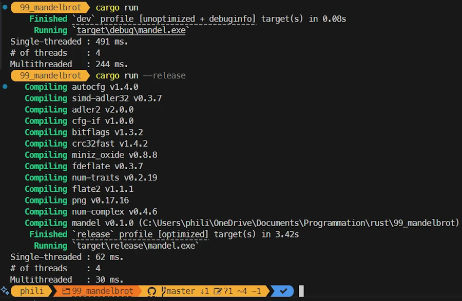
</div>

* Debug : 491 et 244 ms
* Release : 62 et 30 ms


## Utilisation d'un tableau pour stocker l'image

Dans cette version je ne modifie que la fonction `render_stripe()`. De mon point de vue, une bande (stripe) c'est pas un vecteur susceptible de voir sa taille changer mais bien un tableau de taille fixe. En plus, je voulais voir comment allouer un tableau sur le tas (heap) alors que par défaut ils sont sur la pile (stack). 

Si tu as du mal avec ces histoires de heap et de stack, investi du temps dans la vidéo ci-dessous : 

<div align="center">
<iframe width="560" height="315" src="https://www.youtube.com/embed/7_o-YRxf_cc?si=ilL3NkYoo1dURpO_" title="YouTube video player" frameborder="0" allow="accelerometer; autoplay; clipboard-write; encrypted-media; gyroscope; picture-in-picture; web-share" referrerpolicy="strict-origin-when-cross-origin" allowfullscreen></iframe>
</div>

Ci-dessous je ne montre que le code de `render_stripe()`.   

```rust
// main_08
// The image has invariant dimensions
// render_stripe() allocates a fixed size region on the heap

// TODO : issues with scaling
// TODO : add a zoom and be able to move the centre of the view_rectangle in complex space


// ----------------------------------------------------------------------------
// render_stripe() now returns an array of u8 (see -> Box<[u8]>)
// fixed size area (array) are allocated on the stack (not applicable here)
// Here a Vec<u8> is first created then converted into Box<[u8]>
// capacity and len are lost, only the ptr of the data is kept
// Box <[u8]> helps to express the fact that the allocated memory is invariant
fn render_stripe(from: &Complex<f64>, to: &Complex<f64>, width: u32, height: u32) -> Box<[u8]> {
    // let mut image = vec![0u8; (width * height * 3) as usize];
    let mut image = vec![0u8; (width * height * 3) as usize].into_boxed_slice();

    let size = to - from;

    for y in 0..height {
        for x in 0..width {
            let c = from
                + Complex::new(
                    x as f64 * size.re / width as f64,
                    y as f64 * size.im / height as f64,
                );
            let (r, g, b) = mandelbrot_color(&c);

            let idx = (y * width + x) as usize * 3;
            image[idx] = r;
            image[idx + 1] = g;
            image[idx + 2] = b;
        }
    }
    image
}

```

### Explications à propos du code
Dans la fonction ``render_stripe()``
* Sa signature a changé. Elle retourne dorénavant pointeur sur une zone d'octets (voir le `-> Box<[u8]>`)
* Sinon la seule modification concerne l'allocation de la zone mémoire pour ``image``. En gros on commence par allouer un vecteur puis on demande un pointeur sur la partie data du vecteur en question (on perd donc au passage les informations de capacité et d'occupation qui sont spécifiques aux vecteurs)

Il n'y a aucun changement que ce soit au niveau visuel ou du timing

<div align="center">

</div>

<div align="center">

</div>


## Détection du nombre de Cores disponibles

Dans cette nouvelle version, je cherche à adapter le nombre de threads au nombre de cores disponibles sur la machine et `mt_build_mandelbrot()` est la seule fonction impactée.

```rust
// main_09
// mt_build_mandelbrot() detects the number of cores available

// TODO : issues with scaling
// TODO : add a zoom and be able to move the centre of the view_rectangle in complex space


// ----------------------------------------------------------------------------
fn mt_build_mandelbrot(from: &Complex<f64>, to: &Complex<f64>, width: u32, height: u32) -> Vec<u8> {
    // let nthreads = 4;
    let nthreads = std::thread::available_parallelism()
        .map(|n| n.get())
        .unwrap_or(1) as u32; // fallback to 1 if info unavailable
    println!("# of threads    : {nthreads}");

    let mut handles = vec![];

    let stripe_width = width;
    // what if nthreads does not divide height evenly ?
    let stripe_height = height / nthreads;

    let size = to - from;
    // let delta_y = (to.im - from.im) / nthreads as f64;
    let delta_y = size.im / nthreads as f64;

    for i in 0..nthreads {
        let stripe_from = from + Complex::new(0.0, i as f64 * delta_y);
        let stripe_to = stripe_from + Complex::new(size.re, delta_y);

        let handle = thread::spawn(move || {
            // ! no ";" at EOL => the thread return a stripe
            render_stripe(&stripe_from, &stripe_to, stripe_width, stripe_height)
        });
        handles.push(handle);
    }

    let mut stripes = vec![];
    for handle in handles {
        let stripe = handle.join().unwrap();
        stripes.push(stripe);
    }

    let mut final_img = vec![0u8; (width * height * 3) as usize];

    for (i, stripe) in stripes.into_iter().enumerate() {
        let start = i * stripe_height as usize * width as usize * 3;
        final_img[start..start + stripe.len()].copy_from_slice(&stripe);
    }

    final_img
}

```
### Explications à propos du code
Dans la fonction ``mt_build_mandelbrot()`` 
* j'utilise `std::thread::available_parallelism()` pour ajuster la valeur de ``nthreads``
* Histoire de me rassurer j'affiche le nombre de coeurs trouvés.


On voit que le code détecte dorénavant les 20 coeurs de ma machine. Pour le reste on a de nouveaux timings en mode Debug et Release.

<div align="center">
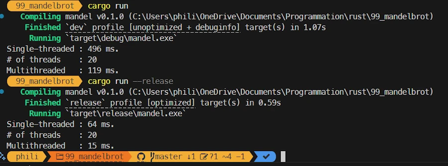
</div>

Les images elles, restent identiques

<div align="center">
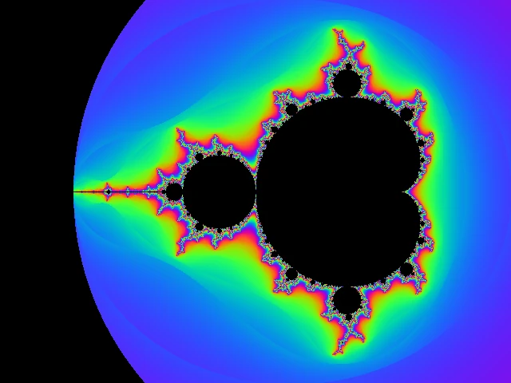
</div>

<div align="center">

</div>


## Refactorisation du code

Je l'ai dit un peu plus haut, le code des fonctions ``build_mandelbrot()`` (version single-threaded) et `render_stripe()` sont identiques donc, autant les factoriser. En fait l'une comme l'autre ne font que traiter une zone de l'espace complexe pour y appliquer exactement le même traitement. Dans un cas on traite la surface correspondant à toute l'image, alors que dans l'autre on traite une bande plus ou moins haute (en fonction du nombre de threads).

De plus, jusqu'à présent, chaque thread créait une bande de pixels qu'il fallait joindre aux autres pour reconstituer l'image finale. Ici on va supprimer la séance de couture en allouant une image dès le départ et en indiquant à chaque thread la zone de l'image qu'il doit traiter. Il n'y a pas de problème de recouvrement. Chaque thread va travailler sur une partie spécifique de l'image. Typiquement, on est dans le potager, je bêche le fond alors que tu retournes le début du terrain.

Finalement, il y a pas mal de changements dans le code. Histoire qu'on soit bien synchros, je te redonne l'ensemble du code.

### Modifications de Cargo.toml
Je vais expliquer pourquoi un peu plus loin mais dans le fichier ``Cargo.toml``, il faut enlever la ligne de commentaire sur la ligne `crossbeam = "0.8.4"`. Le fichier ``Cargo.toml`` doit donc ressembler à ça : 

```
[package]
name = "mandel"
version = "0.1.0"
edition = "2024"

[dependencies]
# Only for main_00.rs
# num-complex = "0.2.1"
# png = "0.14.1"

# main_01.rs and above
num-complex = "0.4.6"
png = "0.17.16"
crossbeam = "0.8.4"

```


Sinon voici la version 10 du code.

```rust
// main_10
// the code has been refactored
// the processing is done by one function render_zone() (code factorization)
// render_zone() is called in both single-threaded and multithreaded portion of the code
// the image is pre-allocated and the processing is done in place
// no need to join the stripes at the end of the multitrheaded version
// this require to use scope. I don't "use crossbeam::thread;" but call "crossbeam::thread::scope" instead

// TODO : issues with scaling
// TODO : add a zoom and be able to move the centre of the view_rectangle in complex space

extern crate num_complex;
extern crate png;

use num_complex::Complex;
use std::fs::File;
use std::io::BufWriter;
use std::time::Instant;

// std::thread is replaced by crossbeam::thread BUT I want to make sure where crossbeam::thread is used in the code
// use std::thread;
// use crossbeam::thread; // => uncomment crossbeam = "0.8.4" in cargo.toml

// ----------------------------------------------------------------------------
// image is Box<[u8]> and not Vec<u8> because the image size is invariant
fn main() {
    let (width, height) = (640, 480);

    let from = Complex::new(-2.5, -1.315);
    let to = Complex::new(1.0, 1.315);

    let mut image = vec![0u8; (width * height * 3) as usize].into_boxed_slice();

    let start = Instant::now();
    render_zone(&from, &to, width, height, &mut image);
    let duration = start.elapsed();
    println!("Single-threaded : {} ms.", duration.as_millis());
    save_image("./assets/image_rgb_10.png", &image, width, height).expect("Failed to save image");

    let start = Instant::now();
    mt_build_mandelbrot(&from, &to, width, height, &mut image);
    let duration = start.elapsed();
    println!("Multithreaded   : {} ms.", duration.as_millis());
    save_image("./assets/image_rgb_mt_10.png", &image, width, height)
        .expect("Failed to save image");
}

// ----------------------------------------------------------------------------
// does not return an image
// no longer joins the stripes to rebuild the image
// try to be smarter if the number of cores does not divide the height of the image evenly
// .split_at_mut() is used to help the compiler "understand" (trust in me, just in me...) that each thread work on non-overlapping parts of the image
fn mt_build_mandelbrot(
    from: &Complex<f64>,
    to: &Complex<f64>,
    width: u32,
    height: u32,
    image: &mut [u8],
) {
    let nthreads = std::thread::available_parallelism()
        .map(|n| n.get())
        .unwrap_or(1);
    println!("# of threads    : {nthreads}");

    let stripe_width = width;
    // let stripe_height = height / nthreads;
    // the value height / nthreads, nthreads times
    let mut stripe_heights = vec![height / nthreads as u32; nthreads];
    // handles cases where height is not divisible by nthreads (480 and 7 for example)
    // 480 % 7 = 4 - the first 4 stripes receive 1 additional line each
    for i in 0..(height % nthreads as u32) {
        stripe_heights[i as usize] += 1;
    }

    let size = to - from;
    let delta_y = size.im / height as f64;

    let mut y_start = 0;
    // the scope guarantees that all threads are joined before the end of the block.
    // so the compiler "knows" that threads won't escape and that local references will live long enough.
    crossbeam::thread::scope(|my_scope| {
        let mut remaining = image;

        for stripe_height in stripe_heights {
            let stripe_byte_count = (stripe_height * stripe_width * 3) as usize;

            // .split_at_mut() returns 2 disjoint mutables slices
            let (stripe, rest) = remaining.split_at_mut(stripe_byte_count);
            remaining = rest;

            let y_end = y_start + stripe_height;
            let stripe_from = from + Complex::new(0.0, y_start as f64 * delta_y);
            let stripe_to = from + Complex::new(size.re, y_end as f64 * delta_y);

            my_scope.spawn(move |_| {
                render_zone(
                    &stripe_from,
                    &stripe_to,
                    stripe_width,
                    stripe_height as u32,
                    stripe,
                );
            });

            y_start = y_end;
        }
    })
    .unwrap(); // .expect("A thread panicked during Mandelbrot computation");
}

// ----------------------------------------------------------------------------
// does not return an image
// image is pre-allocated and the processing is done in place
// fn render_stripe(from: &Complex<f64>, to: &Complex<f64>, width: u32, height: u32) -> Box<[u8]>
fn render_zone(from: &Complex<f64>, to: &Complex<f64>, width: u32, height: u32, image: &mut [u8]) {
    let size = to - from;
    for y in 0..height {
        for x in 0..width {
            let c = from
                + Complex::new(
                    x as f64 * size.re / width as f64,
                    y as f64 * size.im / height as f64,
                );
            let (r, g, b) = mandelbrot_color(&c);
            let idx = (y * width + x) as usize * 3;
            image[idx + 0] = r;
            image[idx + 1] = g;
            image[idx + 2] = b;
        }
    }
}

// ----------------------------------------------------------------------------
fn mandelbrot_color(c: &Complex<f64>) -> (u8, u8, u8) {
    const ITERATIONS: u32 = 250; //1_000;
    let mut z = Complex::new(0.0, 0.0);
    let mut i = 0;

    for t in 0..ITERATIONS {
        z = z * z + c;
        if z.norm_sqr() > 4.0 {
            i = t;
            break;
        }
    }

    if i == 0 {
        return (0, 0, 0);
    }

    let zn = z.norm_sqr().sqrt().ln() / 2.0;
    let smooth_i = (i as f64) + 1.0 - zn.ln() / std::f64::consts::LN_2;
    let hue = smooth_i * 0.1;
    let r = (0.5 + 0.5 * (6.2831 * (hue + 0.0)).cos()) * 255.0;
    let g = (0.5 + 0.5 * (6.2831 * (hue + 0.33)).cos()) * 255.0;
    let b = (0.5 + 0.5 * (6.2831 * (hue + 0.66)).cos()) * 255.0;

    (r as u8, g as u8, b as u8)
}

// ----------------------------------------------------------------------------
// data is now &[u8] (so far it used to be &Vec<u8>)
fn save_image(
    filename: &str,
    data: &[u8],
    width: u32,
    height: u32,
) -> Result<(), png::EncodingError> {
    let file = File::create(filename).unwrap();
    let ref mut w = BufWriter::new(file);

    let mut encoder = png::Encoder::new(w, width, height);
    encoder.set_color(png::ColorType::Rgb);
    encoder.set_depth(png::BitDepth::Eight);

    let mut writer = encoder.write_header().unwrap();
    writer.write_image_data(data)
}


```


### Explications à propos du code
Dans la fonction ``main()``
* J'utilise ce que j'avais appris précédement pour allouer, sur le heap, un tableau d'octets qui va contenir l'image traitée. 
* Encore une fois, je trouve qu'un tableau fixe exprime mieux qu'un vecteur dynamique ce que représente une image

Dans la fonction `mt_build_mandelbrot()`
* La signature change. En effet la fonction ne construit plus l'image finale, elle rempli une zone pré-allouée.
* Comme précédement je détermine le nombre de cores disponibles sur la machine
* Ensuite j'essaie d'être un peu malin et j'ajuste la hauteur des bandes pour tenir compte du fait qu'on pourrait avoir une hauteur d'image qui ne soit pas divisible par le nombre de cores. Dans les commentaires j'illustre ce qui se passe si on a H=480 et 7 cores. Pour le coup toutes les bandes (stripes) ont la même hauteur sauf les 4 premières qui ont une ligne de pixel en plus.
* La modification la plus importante a lieu ensuite. En effet, nous, nous savons qu'il n'y a pas de recouvrement entre les stripes traités par les threads. Autrement dit, même si nous, nous savons qu'il n'y a pas de risque que 2 threads tentent d'accèder en même temps au même pixel... Le compilateur, lui, ne le sait pas et comme il est très prudent, il rejette notre code. Conclusion : on ne peut plus utiliser une boucle ``for`` dans laquelle on initie des threads.
* Nous devons utiliser un objet ``scope`` (qu'on va chercher dans ``crossbeam``, d'où l'obligation de modifier ``Cargo.toml``). De ce que j'ai compris, un scope permet d'aider le compilateur à comprendre notre intention. Typiquement un scope garanti, la main sur le coeur, qu'à la fin du scope tous les threads auront été "joined" et que toutes les variables locales du scope seront bien tout le temps accessibles. 
* Du coup, au lieu de faire une boucle ``for`` dans laquelle on spawn des threads
* Je créé un scope nommé ``my_scope`` (voir `crossbeam::thread::scope`) dans lequel j'ai une boucle ``for`` dans laquelle j'utilise `my_scope` pour y lancer un thread qui va éxécuter la fonction `render_zone()`.
* Comme j'étais pas sûr de mon coup, en haut du code source, j'ai bien sûr commenté la ligne `use std::thread;` car je ne l'utilise plus ici. Cela fait, j'ai pas écris `use crossbeam::thread;`. Du coup dans le code cela m'oblige à utiliser le nom complet `crossbeam::thread::scope`.
* Sinon, je suis pas trop fan des fonctions qu'on étale sur 250 lignes mais bon ici il faut bien voir le `.unwrap();` qui traine tout seul comme une âme en peine. Ca, en français, ça veut dire "Panic on Error" et donc si `crossbeam::thread::scope()` part en vrille, tout le programme va s'arrêter. C'est violent mais suffisant ici. Le truc que je veux surtout faire remarquer c'est que la ligne de code doit ce lire `crossbeam::thread::scope(blablabla).unwrap();`   

Dans la fonction `render_zone()`
* Cette fonction remplace l'ancienne `build_mandelbrot` et l'ancienne ``render_stripe()``
* La signature a changé car ici aussi la fonction ne retroune plus d'image ou de bande. Elle rempli la zone qu'on lui passe en dernier paramètre
* Le reste du code ne change pas

Dans la fonction `mandelbrot_color()`
* Aucun changement

Dans la fonction ``save_image()``
* La signature évolue car au lieu de recevoir un vecteur d'octets, elle reçoit un tableau d'octets
* L'impact est sur la toute dernière ligne


Voilà le résultat des courses graphique : aucun changement

<div align="center">

</div>

<div align="center">

</div>

Du point de vue de la console voilà ce que j'observe :

<div align="center">
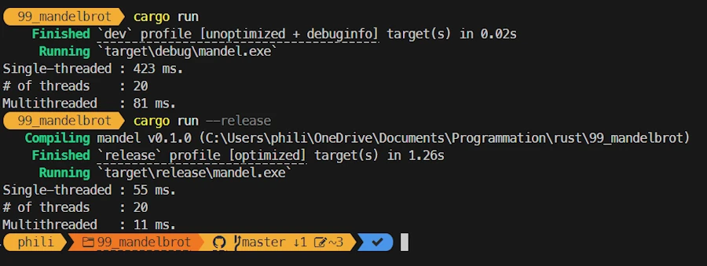
</div>


## Une mauvaise idée

Bon, ben voilà, c'est une affaire qui roule notre histoire... Ceci dit, pour être honnête, avant la version précédente et l'utilisation d'un ``scope`` je pensais benoîtement que je pouvais permettre au code exécuté par les threads de modifier la zone mémoire où se trouve l'image. Encore une fois, je sais que les codes des threads n'accèdent pas aux mêmes pixels, je suis certains qu'il n'y aura pas de problème, qu'on ne va pas croiser les effluves...

<div align="center">
<iframe width="560" height="315" src="https://www.youtube.com/embed/TAQnOzY7QXE?si=w3FyGMM7o5qacGS7" title="YouTube video player" frameborder="0" allow="accelerometer; autoplay; clipboard-write; encrypted-media; gyroscope; picture-in-picture; web-share" referrerpolicy="strict-origin-when-cross-origin" allowfullscreen></iframe>
</div>

Du coup, de fil en aiguille (d'autres parlent de compiler-driven development. En gros, tu compiles, ça plante, tu lis avec beaucoup d'attention les messages d'erreur et tu essaies de satisfaire la bête) j'ai été amené à vérouiller l'accès à la zone de l'image avec un mutex et une Arc. C'est une très mauvaise idée. En effet, c'est hyper "secure" mais bon, du coup, un seul thread à la fois peut accèder à la zone mémoire correspondant à l'image. Tout se passe comme si on avait 20 personnes pleine de bonne volonté désireuses de faire la vaisselle mais une seule à la fois qui peut utiliser l'évier. C'est contre productif et finalement les performances sont pires qu'en single-threaded. 

<div align="center">

</div>


`save_image()`, `mandelbrot_color()` et ``render_zone()`` sont identiques. Dans le code ci-dessous je ne montre que ``main()`` et ``mt_build_mandelbrot()``

```rust
// main_11
// Not a good idea...
// Use an Arc and a mutex to globally protect the access to the image
// Performances are worst than in single-threaded
// Not a surprise. 20 people : There are 20 people around the sink washing dishes, but only one has access to the sponge at a time.

// TODO : issues with scaling
// TODO : add a zoom and be able to move the centre of the view_rectangle in complex space

extern crate num_complex;
extern crate png;

use num_complex::Complex;
use std::fs::File;
use std::io::BufWriter;
use std::sync::{Arc, Mutex};
use std::thread;
use std::time::Instant;

// ----------------------------------------------------------------------------
fn main() {
    let (width, height) = (640, 480);
    let from = Complex::new(-2.5, -1.315);
    let to = Complex::new(1.0, 1.315);

    let mut image = vec![0u8; (width * height * 3) as usize].into_boxed_slice();
    let start = Instant::now();
    render_zone(&from, &to, width, height, &mut image);
    let duration = start.elapsed();
    println!("Single-threaded : {} ms.", duration.as_millis());
    save_image("./assets/image_rgb_11.png", &image, width, height).expect("Failed to save image");

    let image_mt = vec![0u8; (width * height * 3) as usize].into_boxed_slice();
    let start = Instant::now();
    let image_mt = mt_build_mandelbrot(&from, &to, width, height, image_mt);
    let duration = start.elapsed();
    println!("Multithreaded   : {} ms.", duration.as_millis());
    save_image("./assets/image_rgb_mt_11.png", &image_mt, width, height)
        .expect("Failed to save image");
}


// ----------------------------------------------------------------------------
// Arc lets us share immutable data between threads, but for mutable data (such as the image to be modified), we need to associate it with a Mutex or RwLock.
// We use Arc<Mutex<&mut [u8]>> to share the buffer between threads.
// Each thread will work on a stripe of the image.
// It's not ultra-performant, as the Mutex is global, but it's a good pedagogical test.
// The buffer is locked for the duration of the stripes processed in each thread.
// TO KEEP IN MIND : Arc is cloned, but not the entire buffer. The buffer is shared in memory, not duplicated.
fn mt_build_mandelbrot(
    from: &Complex<f64>,
    to: &Complex<f64>,
    width: u32,
    height: u32,
    image: Box<[u8]>,
) -> Box<[u8]> {
    let nthreads = std::thread::available_parallelism()
        .map(|n| n.get())
        .unwrap_or(1) as u32;
    println!("# of threads    : {nthreads}");

    let rows_per_thread = height / nthreads;
    let buffer = Arc::new(Mutex::new(image));

    let mut handles = vec![];

    for i in 0..nthreads {
        let y_start = i * rows_per_thread;
        let y_end = if i == nthreads - 1 {
            height
        } else {
            (i + 1) * rows_per_thread
        };

        let buffer_clone = Arc::clone(&buffer);
        let from = *from;
        let to = *to;

        let handle = thread::spawn(move || {
            let mut guard = buffer_clone.lock().unwrap();
            let slice = &mut guard[..];
            let size = to - from;

            for y in y_start..y_end {
                for x in 0..width {
                    let c = from
                        + Complex::new(
                            x as f64 * size.re / width as f64,
                            y as f64 * size.im / height as f64,
                        );
                    let (r, g, b) = mandelbrot_color(&c);
                    let idx = (y * width + x) as usize * 3;
                    slice[idx] = r;
                    slice[idx + 1] = g;
                    slice[idx + 2] = b;
                }
            }
        });

        handles.push(handle);
    }

    for h in handles {
        h.join().unwrap();
    }

    // Return the content of Arc<Mutex<Box<[u8]>>>
    Arc::try_unwrap(buffer)
        .expect("Multiple references exist, cannot unwrap Arc")
        .into_inner()
        .expect("Mutex poisoned")
}
```

### Explications à propos du code

Au tout début du code il faut remarquer qu'il n'y a pas de ``use crossbeam::thread;``. En effet, je n'utilise pas de `scope`, je veux juste utiliser des threads "normaux" pour aller modifier une zone mémoire. 

Dans la fonction ``main()``
* On voit que je me cherche encore un peu. En effet, je créé une ``image`` en mémoire puis j'appelle `render_zone(..., &mut image);`
* Ensuite, je crée `image_mt` mais j'ai une ligne du style `let image_mt = mt_build_mandelbrot(..., image_mt);`
* C'est pas très homogène tout ça... Allez, on passe à la suite, je fixerai ça plus tard.

Dans la fonction ``mt_build_mandelbrot()``
* Je détermine le nombre de threads et je ne cherche pas à gérer les cas où le nombre de lignes n'est pas divisible par le nombre de cores
* Je protège l'accès à l'image avec un mutex. C'est bien mais ce n'est pas suffisant. 
* En effet, on ne pas utiliser directement un mutex depuis un thread (en fait on peut pas le passer). C'est pour cela que j'utilise une Arc (atomic reference counted). 
* Et c'est cette dernière qu'on va pouvoir utiliser pour accèder, depuis les threads, au mutex puis à la zone mémoire
    * **IMPORTANT** : le mutex c'est le garant de l'accès exclusif à la ressource, l'Arc<Mutex<T>> partage la propriété du mutex entre les threads 
* On prépare un vecteur `handles` pour stocker les identifiants des threads qu'on va lancer
* Ensuite on a une boucle ``for`` dans laquelle en gros
    * En fonction de l'indice on détermine les ``y_start`` et ``y_end``
    * On clone le pointeur Arc ``&buffer``
    * Enfin on spawn le thread
        * Il faut bien voir que dans ce dernier on peut alors utiliser `buffer_clone` pour accéder à la ressource
    * Ensuite, c'est pas une bonne idée mais je fais l'équivalent de ``render_zone()``. 
* On stocke le handle du thread dans le vecteur ``handles``    

Ca pourrait être simplifié mais, aux vues des performances, j'ai pas continué dans cette voie et j'ai utilisé les scopes qu'on a vu dans le version 10 du code. 


Les images générées :

<div align="center">

</div>

<div align="center">

</div>


Du point de vue de la console voilà ce que j'observe :

<div align="center">
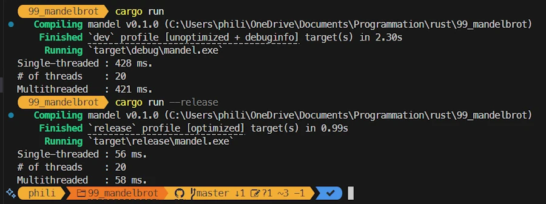
</div>
