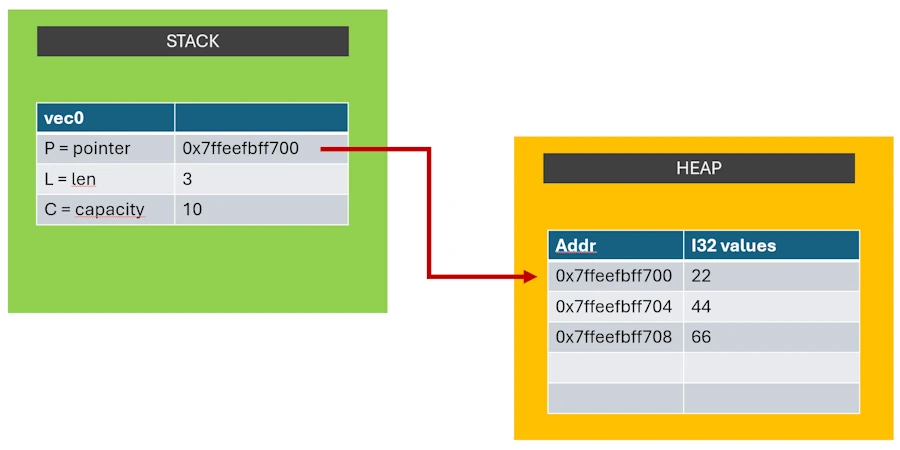
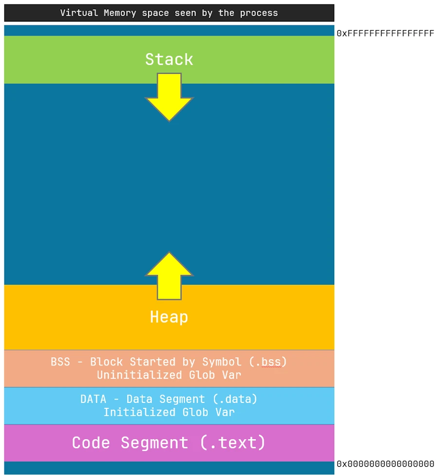
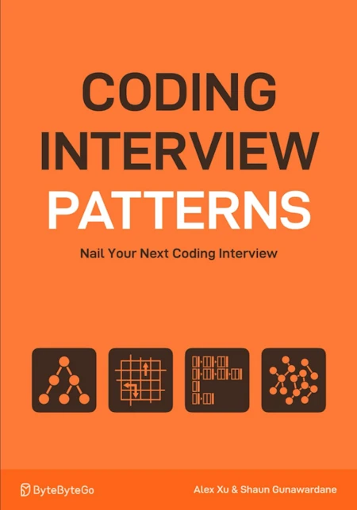

# Bindings en Rust : Bien Plus Que de Simples Variables
{: .no_toc }

## Table of Contents
{: .no_toc .text-delta}
- TOC
{:toc}


## Mutabilité du Binding

### Exercice move_semantics3.rs de Rustlings 

Comme beaucoup de ceux qui débutent avec Rust, j'ai installé [Rustlings](https://github.com/rust-lang/rustlings) et voici le code de l'exercice ``move_semantics3.rs``. 

```rust
// TODO: Fix the compiler error in the function without adding any new line.
fn fill_vec(vec: Vec<i32>) -> Vec<i32> {
    vec.push(88);
    vec
}

fn main() {
    // You can optionally experiment here.
}

#[cfg(test)]
mod tests {
    use super::*;

    #[test]
    fn move_semantics3() {
        let vec0 = vec![22, 44, 66];
        let vec1 = fill_vec(vec0);
        assert_eq!(vec1, [22, 44, 66, 88]);
    }
}
```

On nous demande de satisfaire le compilateur. OK... Regardons le code ci-dessus. Dans la section ``test`` on crée un vecteur `vec0` qu'on passe comme argument à une fonction ``fill_vec()``. Cette dernière retourne un vecteur ``vec1`` qui n'est autre que le précédent auquel on a ajouté la valeur 88 (voir le assert). 

De son côté la fonction ``fill_vec()`` possède un paramètre ``vec`` qui est un vecteur de i32 et elle retourne un vecteur de i32. Dans le corps de la fonction il y a un ``.push(88)`` qui modifie le contenu du vecteur.   


Voici la solution que je propose :

```rust
// TODO: Fix the compiler error in the function without adding any new line.
fn fill_vec(mut vec: Vec<i32>) -> Vec<i32> {
    //      ^^^----- Do you see the `mut` here
    vec.push(88);
    vec
}

fn main() {
    // You can optionally experiment here.
}

#[cfg(test)]
mod tests {
    use super::*;

    #[test]
    fn move_semantics3() {
        let vec0 = vec![22, 44, 66];
        let vec1 = fill_vec(vec0);
        assert_eq!(vec1, [22, 44, 66, 88]);
    }
}
```
Dans la signature de la fonction ``fill_vec()`` j'ai juste rajouté un `mut` devant le paramètre ``vec``. 

***Ok, super... Et?*** Hé bien maintenant il va falloir expliquer ce qui se passe et cela va nous permettre de revenir sur pas mal de sujets. 


### Première ligne de code 


```rust
let vec0 = vec![22, 44, 66];
```

`vec0` est ce que l'on appelle en Rust, un **binding** non mutable sur un ``Vec<i32>``. 

***Hep, hep, hep. Tu peux reprendre, ça yest, tu m'as perdu... Je vois ce qu'est un vecteur de i32. C'est un tableau dont la taille peut varier et qui contient des entiers codés sur 32. Par contre binding... Pourquoi tu ne dis pas simplement qu'on déclare une variable ``vec0`` ?***

En fait, si on était dans un autre langage de programmation, C++ par exemple, oui on dirait que la ligne correspond à la déclaration de la variable ``vec0``. Après ça, j'expliquerai que, en gros, on associe un nom (`vec0`) à une valeur (ou un ensemble de valeurs ici). 

En Rust la notion de binding va peu plus loin :
1. Il y a toujours l'association d'un nom à une valeur (ou à un ensemble de valeurs) 
2. à qui on ajoute les notions de propriétés et de prêt. 

Un binding c'est donc un engagement fort (un contrat) qu'on signe avec notre sang auprès du compilateur et ce dernier refusera de compiler notre code si on ne respecte pas notre parole. Comme tu le vois, en Rust l'ambiance est sympa, mais bon, c'est pour notre bien.

De plus, en Rust, par défaut tout est non mutable. Là où en C++ par défaut tout est mutable et où il faut que je précise si je veux qu'une variable soit constante :

```cpp
// code C++
int       x = 42; // mutable par défaut
const int x = 42; // non mutable

```

En Rust, c'est le contraire :

```rust
let     x = 42;   // non mutable par défaut
let mut x = 42;   // mutable 

``` 

Du coup, si je reviens sur la ligne

```rust
let vec0 = vec![22, 44, 66];
```

`vec0` est bien un **binding** non mutable sur un ``Vec<i32>``. 

***Heu.. Attends... C'est le binding qui est non mutable? T'es sûr de ton coup?*** 

Oui. La mutabilité est une propriété du binding, ce n'est pas une propriété des données (`[22, 44, 66]`) et encore moins du nom (`vec0`). 

Bouge pas, je t'explique et ça tombe bien car le type de données ``Vec<T>``  (vecteur contenant des données de type T) est intéressant. En effet, même si on le manipule comme une entité, dans les faits, ce type de données est constitué de 2 morceaux : 
1. il y a d'un côté une structure de contrôle. Je la nomme PLC, à mon avis c'est pas le terme officiel. J'ai lu "représentation interne" ou "méta-données".
1. et de l'autre le jeu de données (`[22, 44, 66]` dans notre exemple). 

**La structure de contrôle contient 3 champs :**
1. P = l'adresse où sont stockées en mémoire les données (`[22, 44, 66]`). C'est un pointeur.
1. L = la longueur actuelle du vecteur (3 ici par exemple)
1. C = la capacité du vecteur (10 par exemple). Si tel était le cas, le vecteur contiendrait 3 éléments de type i32 et il aurait la possibilité d'en recevoir 7 de plus avant de devoir être redimensionné.

**Le jeu de données :** 
* C'est une zone mémoire qui contient les 3 entiers 32 bits : `[22, 44, 66]`

De plus, les 2 constituants du type de données ``Vec<T>`` sont stockés dans 2 zones mémoire différentes :
1. La structure de contrôle (PLC) est sur la stack
1. Le jeu de données est sur le heap

Si tu veux, tu peux imaginer qu'en mémoire la situation ressemble à ça :

<div align="center">

</div>

***Mais pourquoi c'est si compliqué?***

Imagine... Imagine qu'on est dans une fonction ``main()``, qu'on veut appeler une fonction et lui passer un paramètre. Faisons simple, imaginons qu'on veut passer une valeur entière. Un peu comme dans [Le problème à 3 corps](https://www.youtube.com/watch?v=yEnW_1YdoS4) je te propose d'utiliser une machine très rustique...

<div align="center">

</div>

Comment on fait ? Je te propose de mettre la valeur dans un classeur, de donner ce classeur à un cavalier et d'envoyer le cavalier à l'autre bout de la plaine. Là, on ouvre le classeur, on récupère la valeur et on execute le code de la fonction. Quand c'est terminé le cavalier revient, le classeur est vide car la fonction n'avait rien à renvoyer et on reprend l'exécution de la fonction main().

Cool, ça marche. Maintenant si on veut passer 2 entiers. Même principe. Par contre attention à l'ordre. Faut que je me mette d'accord avec la fonction pour dire que la premiere feuille du classeur correspond au premier paramètre et la seconde au second paramètre.

Cool, ça marche encore... Et si maintenant je veux passer un nombre réel (3.14159) et un entier (42). Pareil, je fais attention à l'ordre et j'écris 3.14159 sur une page et 42 sur l'autre. 

Cool, ça marche toujours. Imaginons maintenant que je veux passer un tableau de pixels (une image) dont la taille est connue à la compilation (640x480 pixels tous codés sur un octet chacun). Là, c'est plus long mais je vais utiliser 640x480 pages et mettre sur chacune une valeur entre 0 et 255. À l'arrivée la fonction va lire toutes les pages du classeur et être capable de reconstituer l'image localement.

Bon ben voilà on a terminé! Mouai... Qu'est ce qui se passe maintenant si je veux passer un tableau de nombres dont je ne connais pas, au moment de la compilation, la longueur. Pense aussi aux cas où je souhaite passer un tableau dont la longueur est susceptible de varier au cours du temps. Ce que l'on appelle un [vecteur](https://youtu.be/KcPLUn91md0?si=6jIkvDKofiS-_Nvx).

<div align="center">

</div>

On est mort... C'est pas pôssible... En effet à l'arrivée, la fonction ne va pas savoir combien de pages elle doit dépiler (lire) du classeur. Cela dit, on peut s'en sortir si on applique le **principe d'indirection**. 

En gros, au lieu de passer le vecteur lui même on va passer la description de ce dernier. Elle, elle a une taille fixe. Par exemple on peut décider de décrire un vecteur avec 2 pages. Une page avec un entier qui indique le nombre de coordonnées et une autre page qui indique avec un autre entier, l'endroit où dans le champs, aller chercher les valeurs quand on en a besoin. Le truc c'est que tout se passe comme si on passait à la fonction un vecteur de taille variable mais cela se fait au prix d'une mise à disposition plus lente. En effet, au lieu de lire les valeurs du vecteur directement dans les pages du classeur, il va falloir faire faire à un cavalier des aller-retours à l'autre bout du champs pour rapatrier les valeurs dont on aura besoin.

Du coup il faut retenir que :
1. la stack 
    * permet de stocker des variables locales
    * quand une fonction appelle une autre fonction en lui passant des paramètres
        * elle dépose ses dernier sur la stack (push)
        * la fonction les récupère dans le bon ordre (pop)
    * on ne met dans la stack que des paramètres dont la taille est connue et des type simples (int, bool, float, tableau fixe, tuple, adresses mémoire) 
1. le heap, c'est une zone libre du champs où on peut déposer des trucs
    * c'est trucs (structures de données) peuvent avoir des tailles dynamiques
    * tous ceux, toutes les fonctions, qui savent où se trouve le truc (qui ont son adresse) peuvent y accéder

Du coup on comprend pourquoi le vecteur est composé en 2 morceaux

**La structure de contrôle :** elle a une taille fixe, connue au moment de la compilation. Si le vecteur `vec0` est mutable, le paramètre ``len`` va peut être passer de 3 à 18 mais en gros cette valeur sera toujours codée par un ``usize`` (pense à un entier 64 bits). De même, si pour une raison ou pour une autre on doit déplacer la zone qui contient les données (on passe de 3 à 300 données par exemple et on manque de place), l’adresse (la valeur du pointeur dont je parlais précédemment) va changer mais ce sera toujours une address sur 64 bits. Donc même si les valeurs des champs de la structure de contrôle changent, la taille, le nombre d'octets occupés par cette dernière sera toujours la même. 

C'est cette structure de taille fixe qu'on va faire passer, d'une fonction à une autre via la stack.

**Le jeu de données :**  
Il est susceptible de voir sa taille évoluer. On le stocke donc sur le heap.


***Ok, ok je comprends pourquoi un type de données dynamique comme un vecteur est découpé en 2 parties (stack et heap) mais y sont où la stack et le heap?***

Dans le cadre d'un process (exécutable) qui tourne sous Windows voilà (à peu près) à quoi ressemble le plan mémoire (c'est similaire sous Linux, sous Mac, je sais pas).

```
+-------------------------+  ← Adresses hautes (ex: 0xFFFFFFFFFFFFFFFF)
|      Kernel Space       |  ← Réservé au système (non accessible)
+-------------------------+
|     Stack (croît ↓)     |  ← Variables locales, retour de fonctions
|                         |     Allouée dynamiquement à l'exécution
+-------------------------+
|   Guard page / padding  |  ← Protection contre débordement de pile
+-------------------------+
|        Heap             |  ← new / malloc : allouée dynamiquement
|  (croît vers le haut ↑) |
+-------------------------+
|   BSS Segment (.bss)    |  ← Variables globales NON initialisées
+-------------------------+
|   Data Segment (.data)  |  ← Variables globales initialisées
+-------------------------+
|   Code Segment (.text)  |  ← Code exécutable, fonctions
+-------------------------+
|     PE Headers (.exe)   |  ← Headers du fichier PE (Portable Executable)
+-------------------------+
|     NULL Page (invalide)|  ← Provoque un segfault en cas de déréférencement
+-------------------------+  ← Adresse 0x0000000000000000

```
Et si je simplifie encore, voilà ce qu'il faut retenir :

<div align="center">

</div>

* le programme exécutable (le process) croît qu'il est seul au monde 
* ce benêt pense qu'il a accès à un espace mémoire 64 bits dont les adresses vont de 0x00.. à 0xFF.. En fait c'est l'OS qui lui fait croire ça, mais non, bien sûr, il est dans un espace mémoire virtualisé. 
* le code qui est exécuté se trouve dans la partie "Code Segment". 
* il y a ensuite 2 zones qui contiennent respectivement les variables globales initialisées et non initialisées.
* la taille du bloc mémoire ``[.text + .data + .bss]`` est fixe et connue à la fin de la compilation/édition de liens. Donc du coup, ça c'est bon, ça bouge pas.

Quand le programme démarre, le processeur exécute les instructions qui sont dans le segment ``.text``. Si il a besoin de la valeur de telle ou telle variable globale il va la chercher dans la zone ``.data``. 

Ensuite, si le programme a besoin de créer une variable locale il ira le faire dans la stack (la pile) et si il a besoin d'allouer une zone mémoire il le fera dans le heap (le tas). 

Pour fixer les idées, sous Windows, la taille de la stack du process principal c'est 1MB (4KB sont pre-alloués pour gagner du temps). C'est configurable si besoin. Ensuite chaque thread créé dispose de sa propre stack dont la taille par défaut est de 2MB (c'est configurable aussi).

Concernant le heap on va dire qu'au départ sa taille est de 0.

***Et qu'est ce qui se passe si la Stack qui croît vers le bas rencontre le heap qui croît vers le haut?*** C'est un croisement d'effluves et tout le monde sait qu'il ne faut jamais croiser les effluves.

<div align="center">
<iframe width="560" height="315" src="https://www.youtube.com/embed/TAQnOzY7QXE?si=JlvEEWL3BTvWJvbz" title="YouTube video player" frameborder="0" allow="accelerometer; autoplay; clipboard-write; encrypted-media; gyroscope; picture-in-picture; web-share" referrerpolicy="strict-origin-when-cross-origin" allowfullscreen></iframe>
</div>


***Ok... Et à propos de la mutabilité du binding. Tu serais pas en train de ma le faire à l'envers? T'as toujours pas répondu.***

Le compilateur Rust s'appuie sur de d'analyse statique du code. Il ne regarde pas l'emplacement mémoire en soi (stack vs heap), mais il suit les bindings et leurs droits d'accès.
Il n'y a donc pas de différence de traitement entre la stack et le heap. Ce qui compte, c’est le type du binding et les règles d’emprunt.

**La structure de contrôle :** 
* Elle est sur la stack
* Si on a un binding non mutable, le compilateur refuse toute tentative de mutation du binding ou de mutation via ce binding, même s’il pointe vers de la mémoire mutable.

**Le jeu de données :**  
* Elles sont sur le heap
* Si on a un binding non mutable, le compilateur 


Donc du coup, à propos du binding il faut garder en tête :
1. Il a un nom
1. Une valeur
1. Des propriétés
    * de ownership 
    * de prêt
    * de mutabilité


### Point d'étape
On est toujours sur la 1ere ligne de code (à ce rythme on est pas sorti de l'auberge...)

```rust
let vec0 = vec![22, 44, 66];
```
Par contre, gros progrès... Dorénavant on comprend la phrase : `vec0` est un **binding** non mutable sur un ``Vec<i32>``. 

* ``vec0`` c'est le nom du binding (introduit par `let`)
* Le binding ``vec0`` est le propriétaire de Vec<i32>
    * Le vecteur est constitué d'une structure PLC qui est sur la stack
    * Son pointeur (P) pointe sur les données `[22, 44, 66]` qui sont sur le heap
* Le binding ``vec0`` n'est pas mutable

Allez, on passe à la seconde ligne


### Seconde ligne de code 

```rust
let vec1 = fill_vec(vec0);
```

Que je met en regard de la fonction `fill_vec()`

```rust
fn fill_vec(vec: Vec<i32>) -> Vec<i32> {...}
```

Afin de pouvoir avancer, je te redonne **LA** ownership rule de Rust : **Each value has a single owner at any given time and is automatically dropped when that owner goes out of scope.** Alors celle-là, tu l'imprimes et tu l'affiches dans tes toilettes...

<div align="center">

</div>

On va pas y passer 3H mais bon, certains mots sont importants. 

**Each value has a single owner at any given time** : Ça, ça veut dire que lors de la compilation, l'analyse de code statique va suivre la trace de quel binding est propriétaire de quelle valeur et siffler la fin de la récréation si on essaie d'avoir 2 bindings sur la même valeur. Attention on parle du propriétaire. J'ai une Ferrari. Même si je te la prête j'en reste le propriétaire. Par contre si je te la donne... Donner c'est donner, reprendre c'est voler. Tu deviens le nouveau propriétaire et je n'ai plus aucun droit dessus.

Attention... Il y a donc une subtilité dans le code précédent et tu vas voir ça va beaucoup mieux en le lisant. En effet, lors de l'appel `fill_vec(vec0)` qu'est-ce qui se passe ? On fait un passage par valeur? Un passage par référence ? On donne ou on prête le binding ``vec0`` à la fonction ? Ben oui, ça ressemble bigrement à un passage par valeur. Autrement dit, on donne le binding `vec0` à la fonction ``fill_vec()``. 

**and is automatically dropped when that owner goes out of scope** : un scope c'est une zone de code entre 2 accolades ``{`` et ``}``. 

Illustrons ça à l'aide de l'ensemble du code de la fonction ``move_semantics3()``.

```rust
fn move_semantics3() {
    let vec0 = vec![22, 44, 66];
    let vec1 = fill_vec(vec0);
    assert_eq!(vec1, [22, 44, 66, 88]);
}
```

Pas d'embrouille. On garde en tête qu'on vient de dire que le binding `vec0` a été donné lors de l'appel à à ``fill_vec()``. Du coup je peux pas dire grand chose dessus. 

Par contre au retour de la fonction, ce qui est sûr, c'est que le binding ``vec1`` est le propriétaire d'une valeur. Du coup, ce que je peux dire c'est qu'à la dernière ligne, là où il y a l'accolade fermante, le binding `vec1` sort du scope. Et là, automatiquement, c'est même pas à moi de le faire, la valeur à laquelle il est lié sera supprimée de la mémoire. Si le ``assert`` ne nous saute pas à la gorge, la valeur en question, c'est le ``Vec<i32>`` qui contient les valeurs ``[22, 44, 66, 88]``.


***Du coup, qu'est-ce qui va se passer sur la seconde ligne ?***

* le binding ``vec0`` est cédé par valeur à la fonction `fill_vec()` 
* le binding ``vec0`` cesse d’être propriétaire
* le binding ``vec`` de fill_vec() devient propriétaire
* le binding ``vec0`` est invalidé. Il reste accessible mais on a une erreur de compilation si on tente de l'utiliser
* Au retour de la fonction `fill_vec()`, le binding ``vec1`` devient le propriétaire de la valeur retournée par `fill_vec()`


### Etude de la fonction fill_vec()

```rust
fn fill_vec(vec: Vec<i32>) -> Vec<i32> {
    vec.push(88);
    vec
}
```
On va se permettre d'accélérer. Un peu, un tout petit peu. 

* La signature de la fonction indique qu'elle a en paramètre un binding ``vec`` qui est lié à une valeur ``Vec<i32>``
* La fonction retourne un binding qui est lié à une valeur de type `Vec<i32>`

La question qu'on peut se poser c'est comment, au moment de l'appel de la fonction, le ownership du binding ``vec0`` est-il passé à ``vec1``. Là, ça va, mais si on avait un vecteur de 1 GB on aurait un problème. Non? 

Je te laisse réfléchir... Ayé? 

Rappelle-toi Barbara, ce qui circule par la stack c'est pas le jeu de données lui même. Ici on a que `[22, 44, 66]` mais en fait, grâce au principe d'indirection et au pointeur de la structure de contrôle; peu importe la quantité de valeurs dans le vecteur. Seule la structure de contrôle qui contient 3 valeurs de type simple va transiter par la stack. Pour te donner un ordre d'idée qu'on peut assimiler ces 3 données à 3 entiers 64 bits. C'est hyper rapide et complètement indépendant de la taille du vecteur. 

Par contre faut garder en tête que c'est pas une **copie** mais un **move**. Quand on arrive dans le scope de la fonction fill_vec, le binding ``vec0`` n'est plus propriétaire. Le propriétaire c'est ``vec``.

***Ah OK, ça y est je comprends. Après on fait un push, on retourne et c'est terminé***

Oui presque mais entre temps on a une erreur de compilation du style :

```powershell
error[E0596]: cannot borrow `vec` as mutable, as it is not declared as mutable
 --> exercises\06_move_semantics\move_semantics3.rs:3:5
  |
3 |     vec.push(88);
  |     ^^^ cannot borrow as mutable
  |
help: consider changing this to be mutable
  |
2 | fn fill_vec(mut vec: Vec<i32>) -> Vec<i32> {
  |             +++

For more information about this error, try `rustc --explain E0596`.
error: could not compile `exercises` (bin "move_semantics3") due to 1 previous error

```

Bon là, bien sûr, personne ne lit et tout le monde râle... Faisons quand même l'effort de lire. C'est vrai que depuis quelques années, dans le monde C++, que ce soit gcc, clang et même MSVC tout le monde fait des efforts. Y a pas de raison pour qu'il en soit différemment avec Rust. Bon alors ça dit quoi ?

Clairement le compilateur indique ce qui lui pose problème : `^^^ cannot borrow as mutable` et il nous indique que c'est ``vec`` le responsable. Cerise sur le gâteau il nous donne même la solution. Il dit `consider changing this to be mutable`. Et comme si c'était pas suffisant il donne enfin la solution `fn fill_vec(mut vec: Vec<i32>) -> Vec<i32> {` avec des petits `+++` comme dans un ``diff`` pour nous indiquer ce qu'il a ajouter. C'est y pas mignon...

Sérieux, on atteint presque le Nirvana. À part le mot ``borrow``, il a tout bon. En gros ce qu'il est en train de dire c'est que ``vec`` étant un binding non mutable, il n'autorise pas l’invocation de la méthode ``.push()`` dessus. En effet cette dernière tente de modifier les données du binding en ajoutant la valeur 88.

***Ben qu'est ce qu'on fait?***

Le compilateur nous a donné la solution. Il faut re-qualifier le binding ``vec``. Rappelle toi par défaut tout est non mutable. Donc dans la signature : 

```rust
fn fill_vec(vec: Vec<i32>) -> Vec<i32> 
    
```
On indique que le paramètre ``vec`` est non mutable. On doit donc modifier la signature comme il nous le propose :  

```rust
fn fill_vec(mut vec: Vec<i32>) -> Vec<i32> 
    
```

***Y a un truc que je comprends pas... On avait un vecteur non modifiable au début. On le passe à une fonction. Et zou il peut devenir modifiable... C'est pas très secure tout ça. Non?***

Revenons en arrière, au moment de l'appel. Qu'est ce qui se passe précisément... Rappelle-toi la règle du ownership :**Each value has a single owner at any given time and is automatically dropped when that owner goes out of scope.** 
Afin de respecter cette règle on a expliqué que ``vec0`` était "moved" et plus utilisable après l'appel de la fonction. Du coup pas d'angoisse ``vec0`` n'étant plus utilisable personne ne va vider ton compte en banque ou usurper ton identité numérique.

Ensuite, et ça c'est important de le réaliser. C'est pas les données ou les zones mémoires qui sont mutable ou non-mutable. Ce sont les bindings. Typiquement les données alloués sur le heap au moment de la création de ``vec0`` étaient "physiquement" mutables. Par contre le compilateur Rust a tracé la mutabilité du binding ``vec0``, il a vu qu'on avait rien fait d'illicite et c'est passé. Ensuite, on move le binding de vec0 à vec. OK très bien. Mais si je te donne ma Ferrari. Rien ne t'empêche d'y rajouter un crochet de caravane ou de la repeindre en jaune. Tu es le propriétaire. Autrement dit, il n'est pas interdit lors du transfer du binding de vec0 à vec de le requalifier en mutable. Et du coup nous aurons le droits de modifier les données du binding.

Encore une fois, c'est histoires de mutabilité, c'est une propriété du binding pas des données du binding. Par contre, c'est un contrat qu'on signe avec le compilateur et qu'on s'engage à respecter. Si je dis que ``vec`` est non-mutable dans la signature j'ai pas le droit de modifier les données et réciproquement si je qualifie le binding avec ``mut``. C'est le compilateur et en particulier le borrow checker de Rust qui est chargé de faire respecter la loi et on s'autorise à dire qu'il est aussi sympa que le Juge Dredd.


<div align="center">

</div>


### La solution avec les commentaires associés

```rust
// ptr, len and capacity are moved (not cloned) from vec0 to vec_in
// On the heap, the data pointed to by ptr are not copied (and are mutable)
// The `mut` keyword allows the function to modify the local binding vec_in
// This is possible because fill_vec owns vec_in exclusively
// vec_in is a mutable binding to Vec<i32>, not a mutable Vec itself
// In the function signature, `mut` works just like it would in: let mut vec_in = ...
fn fill_vec(mut vec_in: Vec<i32>) -> Vec<i32> {
    vec_in.push(88); // the data are modified
    vec_in           // vec_in is moved to the caller
} 

// fn main() {
    // vec0 is an immutable binding to a Vec<i32>
    // A binding associates a name to a value + rules of ownership & borrowing
    // mutability is a property of the binding NOT a property of the value (nor the name)
    // The term binding in Rust represents a strong contract with the compiler, not just a “classic” variable.
    // Here, this means you cannot call vec0.push(...) or reassign vec0
    // However, the Vec internally holds a pointer to heap-allocated memory, which is mutable by nature
    // Rust allows the ownership of vec0 to be transferred (moved), even if the binding is not mutable

    let vec0 = vec![22, 44, 66]; // immutable binding: cannot change vec0 or call vec0.push(...)
                                 // but the heap memory behind it is mutable
                                 // On the heap, data pointed by ptr are mutable
    let vec1 = fill_vec(vec0);   // vec0 is moved into fill_vec
                                 // vec0 is no longer usable after this point

    assert_eq!(vec1, [22, 44, 66, 88]);
// }


```


## Mutabilité des références

### Exercice "Shift 0 to the end" de Coding Interview Patterns (Bonus p 5) 

Si tu ne l'as pas déjà fait, je te conseille vivement la lecture de ce bouquin

<div align="center">

</div>

Je te passe les détails mais dans un des bonus du Chapitre 1 qui traite des "Two Pointers" il y a un challenge où on nous demande de regrouper à la fin d'un vecteur tous les zéros qu'on a pu trouver. Tu peux jeter un oeil sur ce puzzle [ici en Rust](https://github.com/40tude/rust_coding_interview) ou [là en Python](https://github.com/40tude/py_coding_interview).

Ci-dessous une solution en Rust

* Dans la fonction ``main()`` on créé un binding `vec0` qui est associe le nom ``vec0`` à un vecteur d'entiers 32 bits (``Vec<i32>``).  
* Tu remarques qu'au moment de sa création on donne au binding (``let mut vec0``) la propriété `mut`. On peut donc le modifier.
* De manière très originale il y a ensuite une fonction `shift_zeros_to_the_end()` à qui on passe en argument un truc à base de `vec0` (on y revient dans 2 minutes)
* Contrairement à tout à l'heure, la fonction ne retourne rien
* Par contre, "abracadabra !", sur la dernière ligne le assert nous permet de vérifier que les 0 ont bien été repoussés au fond du binding ``vec0`` 

```rust
fn main(){
    let mut vec0 = vec![1, 0, 5, 0, 3, 12]; 
    shift_zeros_to_the_end(&mut vec0);      
    assert_eq!(vec0, [1, 5, 3, 12, 0, 0]);  
}

fn shift_zeros_to_the_end(nums_in: &mut Vec<i32>){ 
    let mut left = 0;
    for right in 0..nums_in.len(){
        if nums_in[right] != 0 {
            nums_in.swap(left, right);
            left += 1;
        }
    }
}
```

* La signature de la fonction `shift_zeros_to_the_end()` indique qu'elle attend en paramètre un binding nommé ``nums_in`` qui est lié à, je sais pas trop quoi, à base de ``Vec<i32>``
* Le code n'a aucune importance ici 
* Faut juste remarquer qu'une fois dans le corps de la fonction, on utilise ``nums_in`` comme un vecteur mutable (on peut échanger le contenu de 2 cellules par exemple)
* À la fin, tout se passe comme si la fonction ne retournait rien

Compte tenu de tout ce que l'on a déjà expliqué on va se permettre d'accélérer encore un peu et de focaliser notre attention uniquement sur 2 lignes
* `shift_zeros_to_the_end(&mut vec0);`
* `fn shift_zeros_to_the_end(nums_in: &mut Vec<i32>)`


### À propos de `shift_zeros_to_the_end(&mut vec0);`
Pour rappel dans le premier code, dans ``main()`` on avait une ligne du style

```rust
    let vec1 = fill_vec(vec0);

```
Ici on a une ligne du genre

```rust
    shift_zeros_to_the_end(&mut vec0);      
```
C'est pas mieux ou moins bien. Le truc c'est qu'au retour de la fonction, on a pas de nouveau binding. On continue d'utiliser le binding original (`vec0`). Par contre il a fallu a donner l'autorisation à la fonction `shift_zeros_to_the_end()` de modifier sa valeur. Autrement dit, je t'ai prêté ma Ferrari et tu as fais le ménage (sympa, merci). 

Le truc, c'est que cette façon d'exprimer les choses traduit peut être bien notre intention ("tiens machin, vlà les clés, pense à passer l'aspirateur avent de me la rendre") mais bon, c'est un peu chaud au niveau des écritures (y a un petit côté Klingon).

En fait ici, on ne veut pas céder la propriété du binding, on veut juste le prêter momentanément (le temps que le fonction `shift_zeros_to_the_end()` opère dessus). Ça, en Rust cela se fait en passant comme argument, non pas le binding (si on le passe on le perd) mais une référence au binding. Si je reprends l'ALU (arithmetic logic unit) du Problème à trois corps de tout à l'heure, j'utilise une seule feuille dans le classeur où j'écris un entier (les coordonnées) qui va permettre au récipiendaire de retrouver mon binding dans la plaine. En faisant comme ça, il sait où le trouver et il peut travailler dessus. Quand il a terminé le cavalier revient à vide (pas de valeur retournée). C'est le signal pour moi que je peux continuer mon travail mais en utilisant la version modifiée de mon binding original.

Du point de vu de la syntaxe, pour passer une référence sur un binding plutôt qu'un binding lui même on utilise la notation ``& my_binding``.

***Ben alors pourquoi dans le code je vois écrit ``&mut vec0`` ?*** T'es un grand garçon... Je te laisse réfléchir... Ayé? Non? Ok, qu'est ce qui se passe si on écrit juste ça

```rust
    shift_zeros_to_the_end(& vec0);      
```
C'est quoi la philosophie, l'état d'esprit de Rust (par rapport au C++ par exemple). Soit un peu à ce qu'on fait, on en a parlé au début. Oui, très bien... 

**Par défaut tout est non mutable**. Et donc si on écrit la ligne de code précédente on dit au compilateur qu'on souhaite prêter la Ferrari mais on interdit toute modification. Et bien sûr ça ne va pas passer à la compilation car le compilateur va détecter que la signature de la fonction ``shift_zeros_to_the_end()`` n'est pas respecter. 

De plus, même sans parler de la signature du récipiendaire, Rust demande à ce j'exprime explicitement l'autorisation que je donne à la fonction de modifier le binding que je passe par référence. Du coup je dois écrire `shift_zeros_to_the_end(&mut vec0)`.


**Notes :** 
Je te confirme 
* c'est ``&mut`` et pas ``mut&``
* pour une référence mutable tu verras `ma_fonction(&mut bob)` avec un espace 
    * ``&mut`` est un opérateur composé en Rust
    * ``&mut`` est un seul "mot-clé logique", qui se lit "référence mutable à"
* pour une référence non mutable tu verras surtout `ma_fonction(&bob)` sans un espace alors que ``shift_zeros_to_the_end(& vec0)`` est tout aussi licite 


### La solution avec les commentaires associés
```rust

// the function receives a mutable reference to a Vec<i32> such that it can modify the data pointed to by ptr
// The binding nums_in is immutable, but it holds a mutable reference
// This means we can mutate the Vec it points to, but we cannot reassign nums_in itself
// nums_in cannot be reassigned to point to another Vec
// but the Vec it refers to can be mutated (e.g. via push, swap, etc.)
fn shift_zeros_to_the_end(nums_in: &mut Vec<i32>){ 
    let mut left = 0;
    for right in 0..nums_in.len(){
        if nums_in[right] != 0 {
            nums_in.swap(left, right);
            left += 1;
        }
    }
}

fn main(){
    let mut vec0 = vec![1, 0, 5, 0, 3, 12]; // vec0 is a mutable binding so it can be passed as &mut
    shift_zeros_to_the_end(&mut vec0);      // we pass a mutable reference to allow the function to mutate the Vec
    assert_eq!(vec0, [1, 5, 3, 12, 0, 0]);  // values have been rearranged in-place
}

```


### Petite question à 1 million de dollars... 

Qu'est qui se passe si la fonction main() ressemble à ça :

```rust
fn main(){
    let vec0 = vec![1, 0, 5, 0, 3, 12]; 
    shift_zeros_to_the_end(&mut vec0);      
    assert_eq!(vec0, [1, 5, 3, 12, 0, 0]);  
}
```
Oui bravo... Ça passe pas à la compile... 

Oui mais pourquoi ? Oui encore bravo! On crée un binding non mutable ``vec0`` qu'on passe ensuite comme une référence mutable à la fonction `shift_zeros_to_the_end()`. Le compilateur nous fait remarque à juste raison qu'il faut pas le prendre pour un débile, qu'il a vu nos manigances et qu'en conséquence il arrête la compile. Grand prince, il nous indique une solution qui consiste à ajouter un mut devant ``vec0``.    


### À propos de `fn shift_zeros_to_the_end(nums_in: &mut Vec<i32>)`

Ca va aller vite. Très vite. Car on dorénavant, on est forts, très forts...

Je veux écrire une fonction qui modifie, sur place, un binding qui est associé à un ``Vec<i32>``. J'ai pas 36 solutions. Il faut que je reçoive une référence sur un binding que je vais pouvoir modifier. Ma signature doit être du style `fn my_function(params_in: &mut Vec<i32>)`.


### Pour le plaisir...🎹

Le code ci-dessous montre que finalement 2 implémentations possibles. 

Soit on passe le binding par référence soit on le move. Elles font toutes les 2 le job. 

On peut toutefois remarque que dans la version ``_byref`` on ne pousse sur la stack qu'un pointeur sur le binding (8 bytes sur un OS 64 bits).

Dans la version `_bymove` on pousse sur la stack la structure de contrôle qui comprend un pointeur, une longueur et une capacité. Tous les 3 sont codés avec 8 octets sur un OS 64 bits. Au final on poussera 24 octets sur la stack.

Du coup si la fonction doit être appelée de très nombreuses fois par seconde il est sans doute préférable d'utiliser la version ``_byref``. Mais bon, avant d'aller plus loin faut mesurer (faire un bench).

Sinon, personnellement je préfère la version ``_byref`` car je trouve que c'est celle qui exprime le mieux mon intention.

```rust
fn shift_zeros_to_the_end_byref(nums_in: &mut Vec<i32>){ 
    let mut left = 0;
    for right in 0..nums_in.len(){
        if nums_in[right] != 0 {
            nums_in.swap(left, right);
            left += 1;
        }
    }
}

fn shift_zeros_to_the_end_bymove(mut nums_in: Vec<i32>) -> Vec<i32>{ 
    let mut left = 0;
    for right in 0..nums_in.len(){
        if nums_in[right] != 0 {
            nums_in.swap(left, right);
            left += 1;
        }
    }
    nums_in
}

fn main(){
    let mut vec0 = vec![1, 0, 5, 0, 3, 12]; 
    shift_zeros_to_the_end_byref(&mut vec0);
    assert_eq!(vec0, [1, 5, 3, 12, 0, 0]); 

    let vec1 = vec![1, 0, 5, 0, 3, 12]; 
    let vec2 = shift_zeros_to_the_end_bymove(vec1); 
    assert_eq!(vec2, [1, 5, 3, 12, 0, 0]);  
}
```


## Variations autour de la mutabilité

***On a vu des signatures du style ``(mut nums_in: Vec<i32>) -> Vec<i32>`` et ``(nums_in: &mut Vec<i32>)``. Ça aurait un sens d'écrire un truc du style ``(mut nums_in: &Vec<i32>)`` et à quoi ça pourrait servir?***

Tiens, fais toi plaisir. Tu as tous les éléments pour analyser la situation.

```rust

// The binding str_in associates the name str_in with a value of type reference to a String.
// str_in is an immutable binding; it cannot be reassigned to another &String.
// The reference to the String is also immutable; the content of the String cannot be modified through this reference.
/fn dont_change(str_in: &String){
    println!("{}", str_in); // Reads and prints the string. Cannot modify
}

// This function takes a mutable reference to a String
// The reference to the String is mutable. The content of the string can be modified using this refrence 
fn change(str_in: &mut String){
    str_in.push_str(", world"); // Appends text to the original String
}

// This function takes an immutable reference to a string slice (&str)
// The binding is mutable, so we can reassign str_in to another slice,
// but we cannot modify the data pointed to by the slice
fn change_view(mut str_in: &str) {
    str_in = &str_in[1..3];   // Rebinds str_in to a substring of the original
                              // There is no let. This is an assignment
    println!("{:?}", str_in); // Prints the new slice
}

fn main() {
    // Create a mutable String binding
    let mut my_str = String::from("hello");
    
    // Pass an immutable reference to a function that reads the string
    dont_change(&my_str);
    
    // Pass a mutable reference to allow the function to modify the String
    change(&mut my_str);
    // Print the modified String
    println!("{}", my_str); // Should print: hello, world

    // Pass an immutable reference (as a slice) to a function that creates a view into the string
    change_view(&my_str);

}
```
On va aller assez rapidement :
* `dont_change(str_in: &String)` : reçoit une référence sur un binding non mutable qui est associé à une String. On peut lire, afficher mais pas modifier.
* `change(str_in: &mut String)` : reçoit une référence sur un binding mutable qui est associé à une String. On peut modifier le binding et ajouter d'autres caractères.
* `change_view(mut str_in: &str)` : reçoit une référence non mutable sur ce que l'on appelle une string view (`&str`). Le binding est mutable (`mut str_in`). On ne peut donc le modifier ``str_in`` pour qu'il "visualise" une autre section de la slice reçue. Bine voir qu'on assigne à `str_in` une nouvelle valeur.  


## Lifetime


```rust
fn longest0(s1: String, s2: String) -> String {
    if s1.len() > s2.len() { s1 } else { s2 }
}

fn main() {
    let s1 = String::from("hello");
    let result0;

    {
        let s2 = String::from("worlds");
        result0 = longest0(s1, s2);  
        println!("Longest: {}", result0);
    }                               
    println!("{}", result0);       
}
```


Does NOT compile

```rust

fn longest(s1: &str, s2: &str) -> &str {
    if s1.len() > s2.len() { s1 } else { s2 }
}

fn main() {
    let s1 = String::from("hello");
    let result;
    
    {
        let s2 = String::from("worlds");
        result = longest(&s1, &s2);  
        println!("Longest: {}", result);
    }                               
    println!("{}", result);       
}

```


Compile

```rust
fn longest<'a>(s1: &'a str, s2: &'a str) -> &'a str {
    if s1.len() > s2.len() { s1 } else { s2 }
}

fn main() {
    let s1 = String::from("hello");
    let result;
    
    {
        let s2 = String::from("worlds");
        result = longest(&s1, &s2);  // OK s1 and s2 are still living
        println!("Longest: {}", result);
    }                               // <- s2 goes out of scope
    
    // println!("{}", result);       // NOK result is s2 dependant
}


```


## Conclusion

Donc du coup, à propos du binding il faut garder en tête :
1. Il a un nom
1. Une valeur
1. Des propriétés
    * de ownership 
    * de mutabilité (mutability)
    * de prêt (borrow)
    * de durée de vie (lifetime)

Je propose qu'à partir de maintenant, dans le cadre de Rust, je ne parle plus de variables mais uniquement de bindings. 

En effet, de mon point de vue le mot “variable” est hérité de langages impératifs classiques (C, C++, Python...), où une variable c'est :

* un nom
* qui référence une case mémoire
* dans laquelle la valeur peut changer

Si on parle de binding (et qu'on garde constamment en tête binding = nom + valeur + ownership + mutability  + borrowing + lifetime) on est plus à même de se poser les bonnes questions ou de raisonner sur un message du compilateur. Un binding en Rust est un contrat de possession et d’usage.


