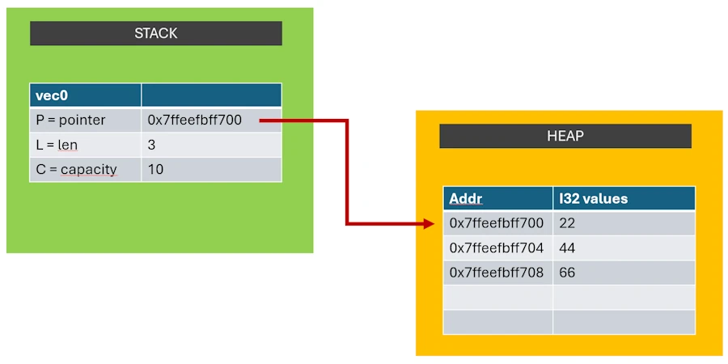
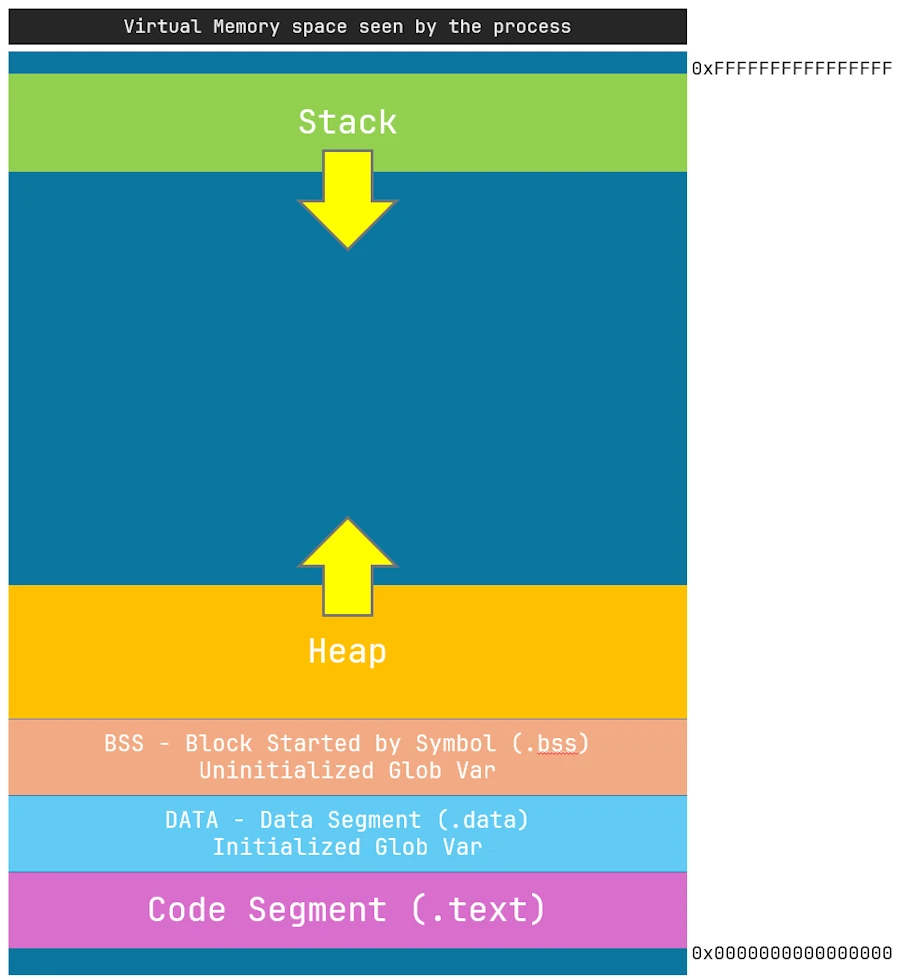
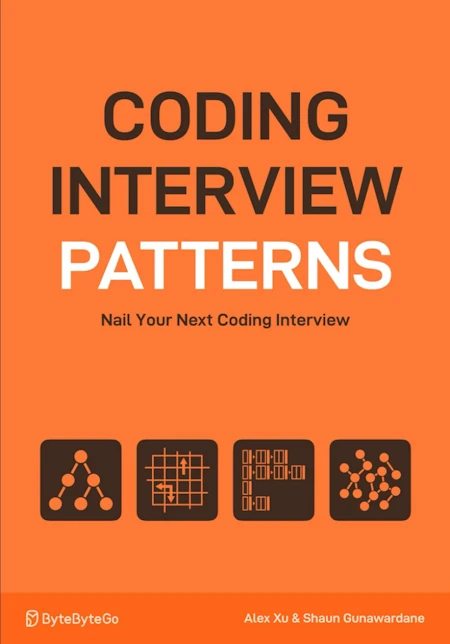

# Bindings en Rust : Bien Plus Que de Simples Variables
{: .no_toc }

The English version of this page is available [here]()

## Table of Contents
{: .no_toc .text-delta}
- TOC
{:toc}

## TL;DR
Dans un contexte Rust, je pense qu'il est préférable de ne plus parler de variables mais uniquement de bindings. En effet un binding est plus riche qu'une variable classique.
1. Il associe un nom à l'état d'une instance d'un type ``<T>``
1. Il ajoute des propriétés
    * de mutability
    * de ownership
    * de borrowing
    * de lifetime
1. L'analyse statique du code s’assure que les propriétés des bindings sont respectées.

À garder sous le coude :
* ``blablabla`` est un **binding** mutable/immutable qui lie le nom ``blablabla`` à l'**état** d'une instance concrète d'un type `<T>`.
* **Ownership rule** : Each concrete instance has a single owner at any given time and is automatically dropped when that owner goes out of scope.
* **Reference rule** : At any given time you can have **either** one mutable reference (writer) or multiple immutable references (readers).
* Compilers makes sure the good things happen — the logical errors are on you.


## Introduction

<!-- ### Exercice move_semantics3.rs de Rustlings  -->

Comme beaucoup de ceux qui débutent avec Rust, j'ai installé [Rustlings](https://github.com/rust-lang/rustlings). Voici le code de l'exercice ``move_semantics3.rs``.

```rust
// TODO: Fix the compiler error in the function without adding any new line.
fn fill_vec(vec: Vec<i32>) -> Vec<i32> {
    vec.push(88);
    vec
}

fn main() {
    // You can optionally experiment here.
}

#[cfg(test)]
mod tests {
    use super::*;

    #[test]
    fn move_semantics3() {
        let vec0 = vec![22, 44, 66];
        let vec1 = fill_vec(vec0);
        assert_eq!(vec1, [22, 44, 66, 88]);
    }
}
```

Perds pas de temps. Copie-colle le code ci-dessus dans la page de l'excellent [Rust Playground](https://play.rust-lang.org/?version=stable&mode=debug&edition=2024) et appuie sur ``Test``. Tu devrais voir un message qui ressemble à ça :


```rust
Compiling playground v0.0.1 (/playground)
error: expected type, found keyword `mut`
 --> src/main.rs:1:18
  |
1 | fn fill_vec(vec: mut Vec<i32>) -> Vec<i32> {
  |                  ^^^ expected type

error[E0423]: expected value, found macro `vec`
 --> src/main.rs:2:5
  |
2 |     vec.push(88);
  |     ^^^ not a value

error[E0423]: expected value, found macro `vec`
 --> src/main.rs:3:5
  |
3 |     vec
  |     ^^^ not a value

For more information about this error, try `rustc --explain E0423`.
error: could not compile `playground` (bin "playground") due to 3 previous errors

```

Bref, ça passe pas à la compilation et le but de l'exercice, c'est justement de corriger le code afin de satisfaire le compilateur.

### Note
Quand je dis que "ça passe pô à la compilation" c'est un abus de langage. En fait, quand on "compile" voici les grandes étapes et les différents outils mis à contribution. Dans ce qui suit, je vais continuer à dire "ça passe pas à la compilation" mais maintenant on est d'accord sur ce que cela sous-entend. J'ai mis en gras 2 des étapes dont on va avoir l'occasion de reparler.

| Étape                         | Description rapide |
|:-------------------------------|:-------------------|
| Parsing / Lexing               | Le code source est découpé (tokens) puis organisé |
| AST Construction               | Construction d'un arbre syntaxique abstrait (AST) |
| Name Resolution                | Résolution des chemins (``foo::bar``), variables, modules |
| Type Checking                  | Chaque expression, fonction, variable est strictement typée |
| Trait Resolution               | Les contraintes de trait sont vérifiées |
| **Lifetime Analysis**          | Analyse des durées de vie (``'t``, etc.) pour les références |
| **Borrow Checking**            | S'assure qu'il n'y a pas de conflits de mutabilité ou d'aliasing |
| Const Evaluation               | Les ``const`` sont calculées pour validation |
| MIR Construction               | Rust transforme le code en une représentation intermédiaire optimisée pour les analyses (le MIR) |
| MIR Optimizations              | Rust optimise le MIR avant de le descendre en LLVM (low level virtual machine, voir clang par ex.) |
| Code Generation (LLVM IR)      | Rust génère le code intermédiaire LLVM |
| LLVM Optimizations             | LLVM optimise encore plus |
| Machine Code                   | Le code binaire est produit |

OK... Revenons sur le code. Dans la section ``test`` on crée un vecteur `vec0` qu'on passe comme argument à une fonction ``fill_vec()``. Cette dernière retourne un vecteur ``vec1`` qui n'est autre que le précédent auquel on a ajouté la valeur 88 (voir la ligne ``assert``).

De son côté la fonction ``fill_vec()`` possède un paramètre ``vec`` qui est un vecteur de ``i32`` et elle retourne un vecteur de ``i32``. Dans le corps de la fonction il y a un ``.push(88)`` qui modifie le contenu du vecteur.


Voici la solution que j'ai proposé :

```rust
// TODO: Fix the compiler error in the function without adding any new line.
fn fill_vec(mut vec: Vec<i32>) -> Vec<i32> {
    //      ^^^----- Do you see the `mut` here?
    vec.push(88);
    vec
}

fn main() {
    // You can optionally experiment here.
}

#[cfg(test)]
mod tests {
    use super::*;

    #[test]
    fn move_semantics3() {
        let vec0 = vec![22, 44, 66];
        let vec1 = fill_vec(vec0);
        assert_eq!(vec1, [22, 44, 66, 88]);
    }
}
```
Dans la signature de la fonction ``fill_vec()`` j'ai rajouté un `mut` devant le paramètre ``vec``.

***Ok, super... Et?*** Hé bien maintenant il va falloir expliquer ce qui se passe et cela va nous permettre de revenir sur pas mal de sujets.


## Mutabilité du binding

On s'intéresse à la première ligne de code

```rust
let vec0 = vec![22, 44, 66];
```

Ici `vec0` est un **binding** immmutable qui lie le nom ``vec0`` à l'état complet d'une instance concrète de type ``Vec<i32>``

***Hep, hep, hep. Tu peux reprendre? Ça y est, tu m'as perdu... Je vois ce qu'est un vecteur de ``i32``. C'est un tableau dont la taille peut varier et qui contient des entiers codés sur 32 bits. Par contre binding... Pourquoi tu dis pas simplement qu'on déclare une variable ``vec0`` ?***

En fait, si on était dans un autre langage de programmation, C++ par exemple, oui, on dirait que la ligne correspond à la déclaration de la variable ``vec0``. Après ça, j'expliquerai que, en gros, on associe au nom `vec0` (qu'on va manipuler dans le programme) une zone mémoire qui contient des valeurs.

En Rust la notion de binding va plus loin :
1. Il y a toujours l'association d'un nom à une valeur. On verra plus loin que c'est plutôt l'association d'un nom à l'état d'une instance mais bon c'est pas important pour l'instant.
2. Qu'on enrichi de propriétés supplémentaires. Exemples : Qui est propriétaire? Peut-on modifier? Peut-on prêter? Pendant combien de temps?...
3. Ces propriétés sont utilisées au moment de la compilation (pas lors de l'exécution) pour prouver que le code gère correctement la mémoire (lecture, écriture, libération, accès concurrents...)

Un binding c'est donc un engagement fort (un contrat). On le signe avec notre sang auprès du compilateur et ce dernier refusera de compiler notre code si on ne respecte pas notre parole. Comme tu le vois, en Rust l'ambiance est assez sympa, mais bon, c'est pour notre bien.

Ceci étant posé, je propose qu'à partir de maintenant on commence à utiliser le mot binding au lieu du mot variable.

Maintenant, il faut le savoir, mais en Rust, par défaut, **tout est immutable**. Là, où par exemple en C++, tout est mutable par défaut.

```cpp
// code C++
int       x = 42; // pas const par défaut
const int y = 42; // une constante

```

En Rust, c'est le contraire :

```rust
let mut x = 42;   // binding mutable
let     y = 42;   // binding immutable par défaut
const   MAX_SCORE: u32  = 42; // une constante
                              // pour montrer que les constantes existent dans Rust


```


{: .note-title }
>Pourquoi Rust parle de "Immutable" et pas de "Constant"?
>
> En Rust, les variables sont **immutable par défaut** (j'utilise exprès le mot utilisé dans la documentation US), et le contraire de *mutable* c'est *immutable*—**pas** *constant*. C'est intentionnel.
>
>`let` crée un **binding**, qui lie un nom à une valeur. Par défaut ce lien est **immutable**.
>
>Utiliser `mut` permet de changer la valeur à laquelle réfère le binding.
>
>C'est différent de décalrer une **constante**, avec le mot clé `const`.
>
>Une `const` dans Rust est:
>* Evaluée à la compilation
>* Remplacée par sa valeur quand elle est utilisée
>* Jamais modifiable, pas même si on ajoute `mut`
>* Pas attachée à un emplacement mémoire comme un binding
>
>Donc même si les bindings immutables et les constantes ne peuvent pas être modifiées, ce sont des **concepts differents**:
>
>* `immutable` précise si un binding peut être réassigné ou non
>* `const` définit à la compilation une valeur qui est embarquée dans le binaire
>
>C'est pourquoi Rust parle de **immutabe** au lieu de constance qui il est question de variables. Ils peuvent sembler proches mais ils servent des objectifs différents.


Ok,  revenons sur le sujet. Concernant le code précédent, c'est pas mieux ou moins bien en C++ c'est juste une philosophie différente. En C++ il faut que je précise si je veux qu'une variable soit constante. En Rust il faut que je précise si je veux qu'un binding soit mutable. Du point de vue de la sécurité/sûreté il y a sans doute un avantage à ce que tout soit constant par défaut. C'est vrai que si on peut éviter de casser une fusée au décollage en écrivant un 1 là où il ne faut pas, c'est pas plus mal. Pour le reste, je suis certains que si demain on pouvait ré-écrire les specifications ISO du C++ c'est le choix que l'on ferait (C date de 72 et C++ de 85 alors que Rust ne date que de 2006).

Maintenant qu'on a parlé de binding et de non mutabilité par défaut, si je reviens sur la 1ere ligne de code :

```rust
let vec0 = vec![22, 44, 66];
```

`vec0` est bien un binding immutable sur un ``Vec<i32>``.

***Heu.. Attends... C'est le binding qui est immutable? C'est pas le contenu du vecteur? T'es sûr de ton coup?***


### Test de mutabilité du binding

{: .note }
Utilise le [Rust Playground](https://play.rust-lang.org/?version=stable&mode=debug&edition=2024). Fais des tests, plante tout, lis les messages du compilateur, "perd du temps" à essayer de comprendre ce qui se passe. Personne ne peut le faire à ta place et c'est plus rentable que de regarder des shorts de chattons sur YouTube.

OK... "You talkin to me?". Tu le prends sur ce ton? Allez, sors si t'es un homme. On va aller faire un test dehors. Copie-colle le code ci-dessous dans [Rust Playground](https://play.rust-lang.org/?version=stable&mode=debug&edition=2024) et appuie sur ``Run`` (CTRL+ENTER). C'est le même code qu'avant sauf que j'ai tout mis dans la fonction ``main()`` et, pour te faire plaisir, j'ai aussi ajouté un ``mut`` devant `Vec<i32>` dans la signature de la fonction `fill_vec()`.

```rust
fn fill_vec(vec: mut Vec<i32>) -> Vec<i32> {
    vec.push(88);
    vec
}

fn main() {
    let vec0 = vec![22, 44, 66];
    let vec1 = fill_vec(vec0);
    assert_eq!(vec1, [22, 44, 66, 88]);
}
```


Si tu tente d'exécuter le code, voilà le message du compilateur :

```rust
Compiling playground v0.0.1 (/playground)
error: expected type, found keyword `mut`
 --> src/main.rs:1:18
  |
1 | fn fill_vec(vec: mut Vec<i32>) -> Vec<i32> {
  |                  ^^^ expected type

error[E0423]: expected value, found macro `vec`
 --> src/main.rs:2:5
  |
2 |     vec.push(88);
  |     ^^^ not a value

error[E0423]: expected value, found macro `vec`
 --> src/main.rs:3:5
  |
3 |     vec
  |     ^^^ not a value

For more information about this error, try `rustc --explain E0423`.
error: could not compile `playground` (bin "playground") due to 3 previous errors

```

En gros... Il dit que sur la première ligne du code il y a une erreur de syntaxe. En effet, après les 2 points qui suivent le nom du paramètre `vec`, il attend un type et qu'il a lu `mut`. Maintenant, si tu modifies le code comme ci-dessous (dans la signature de `fill_vec()`, `mut` est passé devant le nom du binding `vec`) tout devrait bien se passer.


```rust
fn fill_vec(mut vec: Vec<i32>) -> Vec<i32> {
    vec.push(88);
    vec
}

fn main() {
    let vec0 = vec![22, 44, 66];
    let vec1 = fill_vec(vec0);
    assert_eq!(vec1, [22, 44, 66, 88]);
}

```

Je suis toujours scotché sur la première ligne de code. Je ne souhaite donc pas pour l'instant parler d'appel de fonction etc. Mais bon, le petit test qu'on vient de faire confirme ce que je disais. La mutabilité est une propriété du binding, ce n'est pas une propriété des données (`[22, 44, 66]`) et encore moins du nom (`vec0`).

***Ok... La mutabilité est associée au binding... Mais alors les données sont modifiables? Je comprends rien!***


### Un premier détour pour comprendre ce qui se passe en mémoire

Bouge pas. On va devoir faire un détour afin de comprendre ce qui se passe en mémoire. Cela devrait nous permettre de réaliser que dans cette dernière, physiquement, toutes les zones sont potentiellement mutables. Ce qui nous sauve c'est que dans le code on annonce ce que l'on veut (mutable, immutable) et qu'ensuite, le compilateur, aka Vinz Clortho le Maître des Clés de Gozer, veille au grain et autorise (ou non) que telle ou telle zone soit modifiée.

<!-- <div align="center">
<iframe width="560" height="315" src="https://www.youtube.com/embed/o1T-D_37qz0?si=SJxX45O-FpypvG-1&amp;start=14" title="YouTube video player" frameborder="0" allow="accelerometer; autoplay; clipboard-write; encrypted-media; gyroscope; picture-in-picture; web-share" referrerpolicy="strict-origin-when-cross-origin" allowfullscreen></iframe>
</div> -->

<figure style="max-width: 560px; margin: auto;">
<div style="position: relative; padding-bottom: 56.25%; height: 0;">
    <iframe
    src="https://www.youtube.com/embed/o1T-D_37qz0"
    title=""
    style="position: absolute; inset: 0; width: 100%; height: 100%;"
    allowfullscreen>
    </iframe>
</div>
<figcaption style="text-align: center;"></figcaption>
</figure>

Allez, c'est parti, je t'explique et ça tombe bien car le type de données ``Vec<T>`` (vecteur contenant des données de type ``T`` : `i32`, `f64`...) est intéressant. En effet, même si dans le code on le manipule comme une entité unique, il est constitué de 2 parties :
1. il y a d'un côté une structure de contrôle. Je la nomme PLC. C'est pas le terme officiel. Je crois avoir lu "structure ``Vec<T>``", "représentation interne" ou "méta-données".
1. et de l'autre le jeu de données (`[22, 44, 66]` dans notre exemple). Là, je crois que le terme officiel c'est tout simplement "buffer".

**La structure de contrôle PLC contient 3 champs :**
1. **P** : l'adresse où sont stockées en mémoire les données (`[22, 44, 66]`). C'est un pointeur.
1. **L** : la longueur actuelle du vecteur (3 dans notre exemple)
1. **C** : la capacité du vecteur (10 par exemple). Si tel était le cas, le vecteur contiendrait 3 éléments de type ``i32`` et il aurait la possibilité d'en recevoir 7 de plus avant de devoir être redimensionné.

**Le jeu de données :**
* C'est une zone mémoire qui contient les 3 entiers 32 bits : `[22, 44, 66]`

De plus, les 2 composants du type de données ``Vec<T>`` sont stockés dans 2 zones de mémoire différentes :
1. La structure de contrôle (PLC) est sur la stack
1. Le jeu de données est sur le heap

Si tu veux, tu peux imaginer qu'en mémoire la situation ressemble à ça :

<div align="center">

</div>


### Un second détour pour comprendre le passage de paramètres, le heap et la stack

***Mais pourquoi c'est si compliqué?*** Désolé mais il va falloir faire un détour supplémentaire afin de comprendre pourquoi un vecteur est séparé en 2 parties. En effet, il faut qu'on comprenne le principe de base du passage de paramètres d'une fonction à une autre puis qu'on introduise les 2 zones mémoire heap et stack. Quand se sera fait on pourra vraiment comprendre pourquoi la mutabilité c'est la mutabilité du binding et pas des données.

Allez, c'est reparti. Imagine... Imagine qu'on se trouve dans une fonction ``main()``. On souhaite appeler une autre fonction et lui passer un paramètre. Faisons simple pour démarrer. Imaginons qu'on veut passer une valeur entière[^1]. Afin de bien décomposer les évènements on va utiliser le PC qu'on a vu dans [Le problème à 3 corps](https://www.youtube.com/watch?v=yEnW_1YdoS4).

<div align="center">

</div>

Alors? Comment on fait? Je te propose de mettre la valeur dans un classeur, de donner ce classeur à un cavalier et d'envoyer le cavalier à l'autre bout de la plaine. Là, on ouvre le classeur, on récupère la valeur et on exécute le code de la fonction en tenant compte de la valeur reçue. Quand c'est terminé le cavalier revient. Le classeur est vide car la fonction n'a rien renvoyé. On reprend alors l'exécution de la fonction ``main()``.

***Cool, ça marche.*** Maintenant si on veut passer 2 entiers. Même principe. Par contre attention à l'ordre. Faut que je me mette d'accord avec la fonction pour dire que la premiere feuille du classeur correspond au premier paramètre et la seconde au second paramètre. Par exemple, dans les spécifications C++ rien n'oblige le compilateur à respecter un ordre particulier (MSVC passe de droite à gauche, clang de gauche à droite), en Forth et en assembleur les paramètres sont passés de droite à gauche...

***Cool, ça marche encore.*** Et si maintenant je veux passer un nombre réel (3.14159) et un entier (42). Pareil, je fais attention à l'ordre et j'écris 3.14159 sur une page et 42 sur l'autre.

***Cool, ça marche toujours.*** Imaginons maintenant que je veux passer un tableau de pixels (une image) dont la taille est connue à la compilation (640x480 pixels tous codés sur un octet chacun). Là, c'est plus long mais je vais utiliser 640x480 pages et mettre sur chacune une valeur entre 0 et 255. À l'arrivée la fonction va lire toutes les pages du classeur et être capable de reconstituer l'image localement.

***Bon ben voilà on a terminé!*** Mouai... Presque... Qu'est ce qui se passe maintenant si je veux passer un tableau de nombres dont je ne connais pas, au moment de la compilation, la longueur. Pense aussi aux cas où je souhaite passer un tableau dont la longueur est susceptible de varier pendant l'exécution du programme. C'est que l'on appelle un [vecteur](https://youtu.be/KcPLUn91md0?si=6jIkvDKofiS-_Nvx).

<div align="center">

</div>

***On est mort... C'est pas pôssible...*** En effet, tu as raison, à l'arrivée du cavalier, la fonction ne va pas savoir combien de pages elle doit dépiler (lire) du classeur. Cela dit, on peut s'en sortir si on applique le **principe d'indirection** (“All problems in computer science can be solved by another level of indirection.” [David Wheeler]).

En gros, au lieu de passer le vecteur lui même on va passer la description de ce dernier. Elle, elle a une taille fixe. Par exemple on peut décider de décrire un vecteur avec 2 pages dans le classeur. Une page contient un entier qui indique le nombre de valeurs dans le vecteur et une autre page indique avec un autre entier, l'endroit où dans le champs, aller chercher les valeurs quand on en a besoin. Tout se passe comme si on passait à la fonction un vecteur de taille variable mais cela se fait au prix d'une mise à disposition plus lente. En effet, au lieu de lire les valeurs du vecteur directement dans les pages du classeur, il va falloir faire faire à un cavalier des aller-retours à l'autre bout du champs pour rapatrier les valeurs dont on aura besoin.

On peut retenir que :
1. la stack
    * permet de stocker des variables locales
    * quand une fonction appelle une autre fonction en lui passant des paramètres
        * elle dépose ses derniers sur la stack (push)
        * la fonction les récupère dans le bon ordre (pop)
    * on ne met dans la stack que des paramètres dont la taille est connue et des types simples (trivially copyable) : int, bool, float, tableau fixe, tuple & struct avec des types simples, des adresses mémoire
1. le heap, c'est une zone libre du champs où on peut déposer des trucs
    * ces trucs (structures de données) peuvent avoir des tailles dynamiques
    * tous ceux (toutes les fonctions) qui savent où se trouve le truc (qui ont son adresse) peuvent y accéder en lecture ou en écriture

Du coup on comprend pourquoi le vecteur est composé en 2 morceaux :

**La structure de contrôle :** elle a une taille fixe, connue au moment de la compilation. On peut la faire passer sur la stack pour "passer" le vecteur à une fonction.
* Si le vecteur `vec0` est mutable, le paramètre ``len`` va peut être passer de 3 à 18 mais cette valeur sera toujours codée par un ``usize`` (pense à un entier 64 bits).
* De même, si pour une raison ou pour une autre on doit déplacer la zone qui contient les données (on passe de 3 à 300 données par exemple et on manque de place), l’adresse (la valeur du pointeur dont je parlais précédemment) va changer mais ce sera toujours une address sur 64 bits.
* Donc, même si les valeurs des champs de la structure de contrôle changent, sa taille, le nombre d'octets occupés par cette dernière, sera toujours la même.
* C'est cette structure de taille fixe qu'on va faire passer, d'une fonction à une autre, via la stack.

**Le jeu de données :**
* Il est susceptible de voir sa taille évoluer.
* On le stocke donc sur le heap.


***Ok, ok... Je comprends pourquoi un type de données dynamique comme un vecteur est découpé en 2 parties (descriptif sur la stack et données sur le heap) mais y sont où la stack et le heap?***

Dans le cadre d'un process (un exécutable) qui tourne sous Windows voilà (à peu près) à quoi ressemble le plan mémoire (c'est similaire sous Linux. Sous Mac, je sais pas).

```
+-------------------------+  ← Adresses hautes (ex: 0xFFFFFFFFFFFFFFFF)
|      Kernel Space       |  ← Réservé au système (non accessible)
+-------------------------+
|     Stack (croît ↓)     |  ← Variables locales, retour de fonctions
|                         |     Allouée dynamiquement à l'exécution
+-------------------------+
|   Guard page / padding  |  ← Protection contre débordement de pile
+-------------------------+
|        Heap             |  ← new / malloc : allouée dynamiquement
|  (croît vers le haut ↑) |
+-------------------------+
|   BSS Segment (.bss)    |  ← Variables globales NON initialisées
+-------------------------+
|   Data Segment (.data)  |  ← Variables globales initialisées
+-------------------------+
|   Code Segment (.text)  |  ← Code exécutable, fonctions
+-------------------------+
|     PE Headers (.exe)   |  ← Headers du fichier PE (Portable Executable)
+-------------------------+
|     NULL Page (invalide)|  ← Provoque un segfault en cas de déréférencement
+-------------------------+  ← Adresse 0x0000000000000000

```
Et si je simplifie encore, voilà ce qu'il faut retenir :

<div align="center">

</div>

* le programme exécutable (le process) croît qu'il est "Seul au monde" (dis bonjour à Wilson 🏐)
* ce benêt pense qu'il a accès à un espace mémoire de 64 bits dont les adresses vont de 0x00.. à 0xFF.. En fait c'est l'OS qui lui fait croire ça, mais non, bien sûr, il est dans un espace mémoire virtualisé.
* le code qui est exécuté se trouve dans la partie "Code Segment".
* il y a ensuite 2 zones qui contiennent respectivement les variables globales initialisées et non initialisées.
* la taille du bloc mémoire ``[.text + .data + .bss]`` est fixe et connue à la fin de la compilation et de l'édition de liens. Donc ça c'est bon, ça bouge pas.

Quand le programme démarre, le processeur exécute les instructions qui sont dans le segment ``.text``. Si il a besoin de la valeur de telle ou telle variable globale il va la chercher dans la zone ``.data``.

Ensuite, si le programme a besoin de créer une variable locale il ira le faire dans la stack (la pile) et si il a besoin d'allouer une zone mémoire il le fera dans le heap (le tas).

Pour fixer les idées, sous Windows, la taille de la stack du process principal c'est 1MB (4KB sont pre-alloués pour gagner du temps). C'est configurable si besoin. Ensuite chaque thread créé dispose de sa propre stack dont la taille par défaut est de 2MB (c'est configurable aussi).

Concernant le heap on va dire qu'au départ sa taille est de 0.

***Et qu'est ce qui se passe si la Stack qui croît vers le bas rencontre le heap qui croît vers le haut?*** C'est un croisement d'effluves et tout le monde sait qu'il ne faut jamais croiser les effluves. Ce serait mal.

<!-- <div align="center">
<iframe width="560" height="315" src="https://www.youtube.com/embed/TAQnOzY7QXE?si=JlvEEWL3BTvWJvbz" title="YouTube video player" frameborder="0" allow="accelerometer; autoplay; clipboard-write; encrypted-media; gyroscope; picture-in-picture; web-share" referrerpolicy="strict-origin-when-cross-origin" allowfullscreen></iframe>
</div> -->

<figure style="max-width: 560px; margin: auto;">
<div style="position: relative; padding-bottom: 56.25%; height: 0;">
    <iframe
    src="https://www.youtube.com/embed/TAQnOzY7QXE"
    title=""
    style="position: absolute; inset: 0; width: 100%; height: 100%;"
    allowfullscreen>
    </iframe>
</div>
<figcaption style="text-align: center;"></figcaption>
</figure>


**Ce qu'il faut retenir à la fin de ce second détour :**
* Le passage de paramètres se fait via la stack
* On y dépose des données dont la taille est fixe et connue à la fin de la compilation
* Le heap et la stack sont 2 zones mémoire semblables
* Elles sont toutes les 2 read-write et croissent l'une vers l'autre
* Comme ``Vec<T>`` est de longueur variable, il ne peut pas passer par la stack
* On décide donc de le décomposer en 2 parties
    * Une structure PLC, de taille fixe et qu'on peut faire passer par la stack
    * les valeurs qui sont sur le heap

Et voilà. Tu comprends pourquoi ``Vec<T>`` est si "compliqué". C'est juste parce qu'on voulait pouvoir le passer comme un argument à une fonction.


### Fin du second détour. Retour à la question concernant la mutabilité des données en mémoire

On l'a vu le heap et la stack sont dans l'espace mémoire virtuel que perçoit le programme. "Physiquement" ces 2 zones sont mutables. Par exemple, on a pas les moyens de déposer les données déclarées immutables dans une mémoire read-only.

Donc pour répondre à la question : oui, potentiellement les données (quelles soient sur le heap ou dans la stack) sont toutes mutables.

Ce qui garanti que les bonnes opérations de lecture et d'écriture sont effectuées sur les données (quelles soient dans la stack où le heap) au moment du runtime c'est l'analyse statique du code qui est faite lors de la compilation. Le compilateur ne traite pas différemment tel ou tel emplacement mémoire (stack ou heap). Il surveille les bindings et leurs propriétés. De son point de vue, il n'y a pas de différence de traitement entre la stack et le heap. Ce qui compte, c'est que les propriétés des bindings soient respectées.

C'est comme en C++. Si je déclare une variable ``const``, qu'elle soit sur le heap ou dans la stack, si je la modifie je prends un coup de règle sur les doigts (et la règle est en métal, pas en plastique tout pourri)

À notre niveau, on peut imaginer que lors de la compilation, il y a une table qui fait l'inventaire de tous les bindings, de toutes les zones mémoire et que si à un moment, un bout de code tente de modifier un binding immutable, le compilateur pousse un cri.

Le truc, c'est que cette analyse, lourde, longue et fastidieuse n'a lieu que pendant la compilation. Le but du jeu c'est qu'à la fin de cette dernière, on a la certitude qu'au moment de l'exécution tout va bien se passer et qu'on va pas tenter de modifier un binding immutable par exemple.

Finalement, quand tout est prouvé, que le code est compilé, on fonce. À l'exécution il n'y a plus de table ou autre. Tout se passe comme si la veille des essais du moto GP tu prends ton vélo et tu vas faire un tour de piste. Tu vas doucement, tu notes tout. La petite bosse ici, le creux, là pil poil au point de corde, le poteau à utiliser comme point de freinage... Tu vas doucement et si besoin tu reviens sur tes pas. Quand c'est clair, que tout est vérifié, le lendemain tu te poses plus de question... Gaaaaz!

<div align="center">

</div>


Une dernière remarque avant de passer à la suite. Pour l'instant nous n'avons vu que la propriété "mutability" du binding mais rien n'empêche d'en ajouter d'autres. Par exemple des propriétés de durée de vie. On en reparle plus bas. Et ça, sauf erreur de ma part, c'est n'est pas tracé par un compilateur C++.

<!-- **La structure de contrôle :**
* Elle est sur la stack
* Si on a un binding immutable, le compilateur refuse toute tentative de mutation du binding ou de mutation via ce dernier.

**Le jeu de données :**
* Il est sur le heap -->


**Ce qu'il faut retenir à la fin du premier détour :**
* Du point de vue du compilateur la stack et le heap sont des zones mémoire où on peut lire ou écrire
* Les données y sont donc potentiellement toujours modifiables


### Fin du premier détour. Retour à la question concernant la mutabilité du binding

***Ok... Et à propos de la mutabilité du binding. Tu serais pas en train de me la faire à l'envers? T'as toujours pas répondu.***

En fait, compte tenu du test de code que l'on a fait et des 2 (longs) détours par lesquels on est passé il est clair que :
* les données, qu'elles soient sur le heap ou dans la stack, peu importe, sont toujours modifiables.
* Le compilateur connaît les propriétés de mutabilité des différents bindings
* Lors de l'analyse statique le compilateur détecte si le code tente de faire quelque chose d'interdit (modifier un binding immutable par exemple)
* Ce qui est autorisé ou interdit c'est ce qui est inscrit sous forme de propriété dans le binding

Donc oui, je confirme la mutabilité est une propriété du binding


### Fin de l'analyse de la 1ere ligne de code
On est toujours sur la 1ere ligne de code (à ce rythme on est pas sorti de l'auberge...)

```rust
let vec0 = vec![22, 44, 66];
```
Par contre, gros progrès... Dorénavant on comprend la phrase : `vec0` est un binding immutable qui lie le nom ``vec0`` à l'état complet d'une instance concrète de ``Vec<i32>``.


***Heu... Désolé... Je comprends 80% de la phrase mais je comprends pas pourquoi tu parles de "l'état complet d'une instance concrète".*** En fait il m'a fallu beaucoup de temps pour arriver à cette phrase. Je t'explique et pour cela on repart de la ligne de code :

```rust
let vec0 = vec![22, 44, 66];
```
Ce que tu vas lire à droite ou à gauche c'est généralement des trucs du style "un binding relie un nom à une valeur".

Dans le cas précis de la ligne de code tu vas lire peut être des trucs du style : "``vec0`` est un binding immutable qui lie le nom ``vec0`` à la valeur ``Vec<i32>``"

OK... Super mais là, la valeur c'est quoi? La partie PLC du vecteur? Les valeurs dans le tableau? En fait c'est tout ça à la fois. Comme j'avais beaucoup de mal avec le mot "valeur" dans le cas d'un vecteur ma première idée a été de me dire que la "valeur" d'un vecteur (ou de toute autre structure de données non triviale) c'est le hash code de l'instance.

Typiquement je peux construire et afficher le hash code de l'instance d'un ``Vec<T>`` avec le code ci-dessous :

```rust
use std::collections::hash_map::DefaultHasher;
use std::hash::{Hash, Hasher};

fn main() {
    let vec0 = vec![22, 44, 66];

    // Create a new hasher
    let mut hasher = DefaultHasher::new();

    // Feed the vector into the hasher
    vec0.hash(&mut hasher);

    // Finalize the hash and get the result as a u64
    let hash_code = hasher.finish();

    // Print the hash code
    println!("{}", hash_code); //2786706741450235691
}

```

Cela devenait plus clair pour moi et intérieurement je pouvais me dire : `vec0` est un binding immutable qui lie le nom ``vec0`` au hash code de l'instance du vecteur. Et là "[Bingo, voilà ADN dyno...](https://www.youtube.com/watch?v=uGKRYYgCPjY)". Non, pas tout à fait mais "Bingo, maintenant je comprends que si je modifie une des valeurs du PLC ou une des valeurs du tableau je vais en prendre une car cela modifierai la valeur hash code."

Mais si on réfléchit. Le hash code capture, synthétise, dans une unique valeur, l'état à un instant ``t`` de l'instance que j'ai dans les mains. Autrement dit, si dorénavant je parle d'**état** plutôt que de hash code, ça revient au même.

La description de la 1ere ligne de code évolue et devient :

1. `vec0` est un binding immutable qui lie le nom ``vec0`` à l'état d'un  ``Vec<i32>``.
1. `vec0` est un binding immutable qui lie le nom ``vec0`` à l'état complet d'un ``Vec<i32>``. C'est pour dire que dans un vecteur ça concerne les données et la structure de contrôle.
1. `vec0` est un binding immutable qui lie le nom ``vec0`` à l'état complet d'une instance de ``Vec<i32>``. Oui car dans le code je manipule des instances plutôt que des types.
1. `vec0` est un binding immutable qui lie le nom ``vec0`` à l'état complet d'une instance concrète d'un type ``Vec<i32>``. Sans doute en trop. C'est juste pour insister sur le fait que l'instance concernée est un truc du style Vec ou String et pas vraiment un type abstrait (Trait).

Finalement, ce que je garde en tête c'est : ``blablabla`` est un **binding** (im)mutable qui lie le nom ``blablabla`` à l'**état** d'une instance concrète d'un type `<T>`.

Ceci étant expliqué, on y retourne et à propos de la première ligne de code

```rust
let vec0 = vec![22, 44, 66];
```

On peut dire que `vec0` est un binding immutable qui lie le nom ``vec0`` à l'état complet d'une instance concrète d'un type ``Vec<i32>``.

* ``vec0`` c'est le nom du binding (introduit par `let`)
* Le vecteur est constitué d'une structure PLC qui est sur la stack
* Son pointeur (P) pointe sur les données `[22, 44, 66]` qui sont sur le heap
* Le binding ``vec0`` n'est pas mutable.
* Si je touche à quoi que ce soit qui modifie l'état (pense au hash code si besoin) du vecteur (PLC ou valeurs) j'en prends une.


{: .important-title }
> À cet instant, concernant le binding il faut garder en tête
> 1. Il associe un nom à l'état d'une instance d'un type ``<T>``
> 2. Il ajoute des propriétés
> * de mutabilité
> * ...
> 3. L'analyse statique du code s’assure que les propriétés des bindings sont respectées.

<!-- {: .important }
**À cet instant, concernant le binding il faut garder en tête :**
1. Il associe un nom à l'état d'une instance d'un type ``<T>``
1. Il ajoute des propriétés
    * de mutability
    * ...
1. Lors de la compilation, via une analyse statique du code, le compilateur s'assure que les propriétés des bindings sont respectées. -->


Allez, il est temps de passer à la seconde ligne de code


### Seconde ligne de code

Tiens, voilà la ligne qui nous intéresse :

```rust
let vec1 = fill_vec(vec0);
```

Et je la met en regard de la fonction `fill_vec()`

```rust
fn fill_vec(vec: Vec<i32>) -> Vec<i32> {...}
```

Maintenant, afin de pouvoir avancer, je te redonne **LA** ownership rule de Rust :

<!-- {: .warning }
**Each value has a single owner at any given time and is automatically dropped when that owner goes out of scope.**  -->

{: .note-title }
> Ownership Rule
>
> Each value has a single owner at any given time and is automatically dropped when that owner goes out of scope.

Alors celle-là, tu l'imprimes et tu l'affiches dans tes toilettes...

<div align="center">

</div>

Compte tenu de ce que l'on a dit à propos des états et des instances concrètes, moi je garde en tête :

**Each concrete instance has a single owner at any given time and is automatically dropped when that owner goes out of scope.**

Concernant l'affichage dans tes toilettes, je te laisse gérer.

On va pas y passer 3H mais bon, certains mots sont importants.

**1. Each value has a single owner at any given time** : Ça, ça veut dire que lors de la compilation, l'analyse de code statique va suivre la trace de quel binding est propriétaire de quelle instance concrète et siffler la fin de la récréation si on essaie d'avoir 2 bindings sur la même instance. Attention on parle bien du propriétaire. J'ai une Ferrari. Même si je te la prête j'en reste le propriétaire. Par contre si je te la donne... "Donner c'est donner, reprendre c'est voler." Tu deviens le nouveau propriétaire et je n'ai plus aucun droit dessus.

Attention... Il y a donc une subtilité dans le code précédent et tu vas voir que ça va beaucoup mieux en le lisant. En effet, lors de l'appel `fill_vec(vec0)` qu'est-ce qui se passe ? On fait un passage par valeur? Un passage par référence ? On donne ou on prête le binding ``vec0`` à la fonction ? Oui, tu as raison, ça "ressemble" bigrement à un passage par valeur. Tout se passe comme si on écrivait :

```rust
vec = vec0
```

Autrement dit, on va donner le binding `vec0` à la fonction ``fill_vec()``.

**2. and is automatically dropped when that owner goes out of scope** : Un scope c'est juste une zone de code entre 2 accolades ``{`` et ``}``.

Illustrons ça à l'aide de l'ensemble du code de la fonction ``move_semantics3()`` qui se trouve dans la section `#[test]`.

```rust
fn move_semantics3() {
    let vec0 = vec![22, 44, 66];
    let vec1 = fill_vec(vec0);
    assert_eq!(vec1, [22, 44, 66, 88]);
}
```

Pas d'embrouille. On garde en tête qu'on vient de dire que le binding `vec0` a été donné lors de l'appel à à ``fill_vec()``. Pour l'instant, on a pas encore les connaissances nécessaires et donc je peux pas dire grand chose dessus.

Par contre, au retour de la fonction `fill_vec()`, ce qui est sûr, c'est que le binding ``vec1`` est le propriétaire d'un état. Là, ce que je peux dire c'est qu'à la dernière ligne, là où il y a l'accolade fermante, le binding `vec1` sort du scope. Et là, automatiquement, c'est même pas à moi de le faire, l'instance concrète à laquelle était lié ``vec1`` sera supprimée de la mémoire.

Afin que ce soit bien clair, l'instance concrète qui va être droppée (supprimée de la mémoire) c'est le ``Vec<i32>`` qui contient les valeurs ``[22, 44, 66, 88]``.


***Du coup, qu'est-ce qui va se passer sur la seconde ligne ?***

* le binding ``vec0`` est cédé par valeur à la fonction `fill_vec()` (c'est faux mais on y revient dans 2 min.)
* le binding ``vec0`` cesse d’être propriétaire
* le binding ``vec`` de ``fill_vec()`` devient propriétaire
* le binding ``vec0`` est invalidé. Il reste accessible mais on a une erreur de compilation si on tente de l'utiliser
* Au retour de la fonction `fill_vec()`, le binding immutable ``vec1`` relie le nom `vec1` à l'état de l'instance d'un type ``Vec<i32>``.
* `vec1` est propriétaire de l'instance en question


<!-- {: .important }
**À cet instant, concernant le binding il faut garder en tête :**
1. Il associe un nom à l'état d'une instance d'un type ``<T>``
1. Il ajoute des propriétés
    * de mutability
    * de ownership
    * ...
1. Lors de la compilation, via une analyse statique du code, le compilateur s'assure que les propriétés des bindings sont respectées. -->

{: .important-title }
> À cet instant, concernant le binding il faut garder en tête
> 1. Il associe un nom à l'état d'une instance d'un type ``<T>``
> 2. Il ajoute des propriétés
> * de mutabilité
> * de ownership
> * ...
> 3. L'analyse statique du code s’assure que les propriétés des bindings sont respectées.


### Etude de la fonction fill_vec()

```rust
fn fill_vec(vec: Vec<i32>) -> Vec<i32> {
    vec.push(88);
    vec
}
```

* La signature de la fonction indique qu'elle a en paramètre un binding ``vec`` qui est lié à l'état d'une instance d'un type ``Vec<i32>``
* La fonction retourne un binding qui est lié à l'état d'une instance d'un type `Vec<i32>`

La question qu'on peut se poser c'est comment, au moment de l'appel de la fonction, le ownership du binding ``vec0`` est-il passé à ``vec``. Là, ça va parce qu'on a 3 valeurs qui se battent en duel, mais si on avait un vecteur de 1 GB de données, on aurait un problème. Non?

Je te laisse réfléchir... Ayé?

Rappelle-toi Barbara, ce qui circule par la stack c'est pas le jeu de données lui même. Ici on a que `[22, 44, 66]` mais en fait, grâce au principe d'indirection et au pointeur de la structure de contrôle, peu importe la quantité de valeurs dans le vecteur. Seule la structure de contrôle (PLC) qui contient 3 valeurs de type simple va transiter par la stack. Pour te donner un ordre d'idée on peut assimiler ces 3 données à 3 entiers 64 bits. C'est hyper rapide et surtout, c'est indépendant du nombre de valeur dans le vecteur.

Par contre il faut garder en tête que c'est pas une **copie** de ``vec0`` dans ``vec`` sur mais un **move** (d'où le nom de l'exercice. Malins les mecs...).

***Attends, attends... Tu peux revenir sur ton histoire de move. T'es allez un peu vite.*** Pas de problème. Si je fais une copie de variables de type simple (trivially copyable, int, float... mais pas un ``Vec<T>``) le code ci-dessous fonctionne comme attendu :

```rust
fn main() {
    let mut my_int1 = 42;
    let my_int2 = my_int1;
    my_int1+=1;
    let my_int3 = my_int1;

    assert_eq!(my_int1, 43);
    assert_eq!(my_int2, 42);
    assert_eq!(my_int3, 43);
}
```
C'est peut être un détail pour vous mais pour moi ça veut dire beaucoup...🎹 Je copie ``my_int1`` dans ``my_int2`` et regardes, après la copie, je peux encore incrémenter ``my_int1`` et copier sa nouvelle valeur dans ``my_int3``. Un comportement normal quoi!

OK... Essayons de faire la même chose avec un type de données "pas simple" (``Vec<T>``, ``String``...) :

```rust
fn main() {
    let my_string1 = String::from("Zoubida");
    let mut my_string2 = my_string1; // my_string1 is no longer available
    my_string2.push_str(" for ever");
    let my_string3 = my_string2; // my_string2 is no longer available

    //assert_eq!(my_string1, "Zoubida"); // would panic
    //assert_eq!(my_string2, "Zoubida for ever"); // would panic
    assert_eq!(my_string3, "Zoubida for ever");
}
```

Tel quel, le code fonctionne mais si par malheur tu supprimes les commentaires des ``assert``, là le compilateur te saute à la gorge et tu meurs dans d'affreuses douleurs, oublié de tous. Par exemple, si je supprime le 1er commentaire voilà ce que je lis :

```rust
Compiling playground v0.0.1 (/playground)
error[E0382]: borrow of moved value: `my_string1`
 --> src/main.rs:7:5
  |
2 |     let my_string1 = String::from("Zoubida");
  |         ---------- move occurs because `my_string1` has type `String`, which does not implement the `Copy` trait
3 |     let mut my_string2 = my_string1; // my_string1 is no longer available
  |                          ---------- value moved here
...
7 |     assert_eq!(my_string1, "Zoubida"); // would panic
  |     ^^^^^^^^^^^^^^^^^^^^^^^^^^^^^^^^^ value borrowed here after move
  |
  = note: this error originates in the macro `assert_eq` (in Nightly builds, run with -Z macro-backtrace for more info)
help: consider cloning the value if the performance cost is acceptable
  |
3 |     let mut my_string2 = my_string1.clone(); // my_string1 is no longer available
  |                                    ++++++++

For more information about this error, try `rustc --explain E0382`.
error: could not compile `playground` (bin "playground") due to 1 previous error

```

Lis les messages du compilateur. Personne ne le fera à ta place et les gars se sont fait suer pour trouver un moyen de nous aider alors utilisons ce qu'ils mettent à notre disposition...

En plus c'est hyper clair. Le compilateur nous dit qu'à la ligne 3 il y a eu un move du binding ``my_string1`` vers le binding ``my_string2`` car le binding ``my_string1`` est lié à l'état d'une instance de type String et que ce type de donnée n'implémente pas de fonction qui permettrait de le copier (il n'implémente pas le trait Copy). Du coup, comme on peut pas faire de copie (mais uniquement un move) on a pas le droit, ni d'avoir faim ni d'avoir froid, certes, mais surtout, on a pas le droit d'utiliser le binding ``my_string1`` dans le ``assert`` pour le comparer à "Zoubida".

Histoire de te prouver que j'essaie d'être honnête... Bien sûr qu'il est possible de faire une copie explicite d'une String. Il faut utiliser ``.clone()``. Le truc ici c'est que comme le trait Copy n'est pas implémenté, par défaut on fait des ``.move()``.

En fait, à la fin de la ligne 3, tout se passe comme si ``my_string1`` n'était plus utilisable (c'est le cas) et que `my_string2` avait remplacé `my_string1`.

Il faut peut être retenir que :

| Opération | Syntaxe | Effet                          |
|-----------|---------|--------------------------------|
| Copie     | `x = y` | x et y sont utilisables         |
| Move      | `x = y` | x est utilisable, y n'est plus utilisable |


Ces histoires de move étant couvertes, je reviens au code de la fonction

```rust
fn fill_vec(vec: Vec<i32>) -> Vec<i32> {
    vec.push(88);
    vec
}
```

Il faut remarquer que lorsqu'on arrive dans le scope de la fonction ``fill_vec`` le binding ``vec0`` n'est plus propriétaire. Le nouveau propriétaire c'est ``vec``.

***Ah OK, ça y est je comprends. Après on fait un push, on retourne et c'est terminé.*** Oui, presque, mais entre temps on a une erreur de compilation à gérer. Un truc du style :

```rust
error[E0596]: cannot borrow `vec` as mutable, as it is not declared as mutable
 --> exercises\06_move_semantics\move_semantics3.rs:3:5
  |
3 |     vec.push(88);
  |     ^^^ cannot borrow as mutable
  |
help: consider changing this to be mutable
  |
2 | fn fill_vec(mut vec: Vec<i32>) -> Vec<i32> {
  |             +++

For more information about this error, try `rustc --explain E0596`.
error: could not compile `exercises` (bin "move_semantics3") due to 1 previous error

```

Bon là, bien sûr, personne ne lit et tout le monde râle... Faisons quand même l'effort de lire. Bon, alors, ça dit quoi ?
<!-- C'est vrai que depuis quelques années, dans le monde C++, que ce soit gcc, clang et même MSVC tout le monde fait des efforts. Y a pas de raison pour qu'il en soit différemment avec Rust. -->

Le compilateur indique clairement ce qui lui pose problème : `^^^ cannot borrow as mutable` et il nous indique que c'est ``vec`` le responsable. Cerise sur le gâteau il nous donne même la solution. Il dit `consider changing this to be mutable`. Et comme si c'était pas suffisant il donne enfin la solution `fn fill_vec(mut vec: Vec<i32>) -> Vec<i32> {` avec des petits `+++` comme dans un ``diff`` pour nous indiquer ce qu'il faut ajouter. C'est y pas mignon?

Sérieux, on atteint presque le Nirvana. À part le mot ``borrow``, il a tout bon. En gros ce qu'il est en train de dire c'est que ``vec`` étant un binding immutable, il n'autorise pas l’invocation de la méthode ``.push()`` dessus. En effet cette dernière tente de modifier l'état de l'instance concrète en y ajoutant la valeur 88.

***Ben qu'est ce qu'on fait alors?*** Lis je te dis... Le compilateur nous a donné la solution. Il faut re-qualifier le binding ``vec``. Rappelle toi par défaut tout est immutable. Donc dans la signature :

```rust
fn fill_vec(vec: Vec<i32>) -> Vec<i32>

```
Le paramètre ``vec`` est immutable. On doit donc modifier la signature comme le compilateur nous le propose :

```rust
fn fill_vec(mut vec: Vec<i32>) -> Vec<i32>

```

***Attends... Y a un truc que je comprends pas... On avait un vecteur non modifiable au début. On le passe à une fonction. Et zou il peut devenir modifiable... C'est pas très secure tout ça. Non?***

Revenons en arrière, au moment de l'appel. Qu'est ce qui se passe précisément... Rappelle-toi la règle du ownership : **Each value has a single owner at any given time and is automatically dropped when that owner goes out of scope.** (Each concrete instance has a single owner at any given time and is automatically dropped when that owner goes out of scope.)

Afin de respecter cette règle on a expliqué que ``vec0`` était "moved" et plus utilisable après l'appel de la fonction. Donc, pas d'angoisse, ``vec0`` n'étant plus utilisable personne ne peut vider ton compte en banque ou usurper ton identité numérique. Le côté "secure", c'est bon, c'est réglé.

Ensuite, et ça c'est important de le réaliser. C'est pas les données ou les zones mémoires qui sont mutables ou immutables. Ce sont les bindings (la mutabilité est une propriété du binding). Typiquement les données alloués sur le heap au moment de la création de ``vec0`` étaient "physiquement" mutables. Par contre le compilateur a surveillé la mutabilité du binding ``vec0``, il a vu qu'on avait rien fait d'illicite et c'est passé. Ensuite, on move le binding de ``vec0`` à ``vec``. OK très bien. Mais si je te donne ma Ferrari. Rien ne t'empêche d'y rajouter un crochet de caravane ou de la repeindre en jaune. Tu es le nouveau propriétaire, tu fais ce que tu veux. Autrement dit, il n'est pas interdit lors du transfer du binding de ``vec0`` à ``vec`` de le requalifier en mutable. Nous aurons alors le droit de modifier l'état de l'instance concrète à l'autre bout du binding.

Encore une fois, ces histoires de mutabilité, c'est une propriété du binding pas des données du binding. Par contre, c'est un contrat qu'on signe avec le compilateur et qu'on s'engage à respecter. Si je dis que ``vec`` est immutable dans la signature j'ai pas le droit de modifier l'état de l'instance de type ``Vec<i32>`` (et réciproquement si je qualifie le binding avec ``mut``). C'est le compilateur et en particulier le borrow checker de Rust qui est chargé de faire respecter la loi et on s'autorise à dire qu'il est aussi conciliant que le Juge Dredd.


<div align="center">

</div>


### La solution avec les commentaires associés

```rust
//`vec0` is a mutable binding that links the name ``vec0`` to the complete state of a concrete instance of type ``Vec<i32>``.
// On the heap, the data pointed to by ptr are not copied (and are mutable)
// The `mut` keyword allows the function to modify state of the local concrete instance of type Vec<i32>
// This is possible because fill_vec owns vec_in exclusively
// vec_in is a mutable binding to Vec<i32>, not a mutable Vec<i32> itself
// In the function signature, `mut` works just like it would in: let mut vec_in = ...
fn fill_vec(mut vec_in: Vec<i32>) -> Vec<i32> {
    vec_in.push(88); // the state is modified because the data are modified
    vec_in           // vec_in is moved to the caller
}

// fn main() {
    // vec0 is a immutable binding
    // A binding associates a name to a value + rules of ownership & borrowing
    // mutability is a property of the binding NOT a property of the value (nor the name)
    // The term binding in Rust represents a strong contract with the compiler, not just a “classic” variable.
    // Here, this means you cannot call vec0.push(...) or reassign vec0
    // However, the Vec internally holds a pointer to heap-allocated memory, which is mutable by nature
    // Rust allows the ownership of vec0 to be transferred (moved), even if the binding is not mutable

    let vec0 = vec![22, 44, 66]; // immutable binding: cannot change vec0 or call vec0.push(...)
                                 // but the heap memory behind it is mutable
                                 // On the heap, data pointed by ptr are mutable
    let vec1 = fill_vec(vec0);   // vec0 is moved into fill_vec
                                 // vec0 is no longer usable after this point

    assert_eq!(vec1, [22, 44, 66, 88]);
// }


```


## Mutabilité des références

<!-- ### Exercice "Shift 0 to the end" de Coding Interview Patterns (Bonus p 5)  -->

Si tu ne l'as pas déjà fait, je te conseille vivement la lecture de ce bouquin

<div align="center">

</div>

Je te passe les détails mais dans un des bonus du Chapitre 1 qui traite des "Two Pointers" il y a un exercice où on nous demande de regrouper à la fin d'un vecteur tous les zéros qu'on a pu trouver. Tu peux jeter un oeil sur ce puzzle [ici en Rust](https://github.com/40tude/rust_coding_interview) ou [là en Python](https://github.com/40tude/py_coding_interview).

Ci-dessous une solution en Rust

* Dans la fonction ``main()`` on créé un binding `vec0` qui lie le nom ``vec0`` à l'état complet d'une instance concrète de type ``Vec<i32>``.
* Tu remarques qu'au moment de sa création on donne au binding (``let mut vec0``) la propriété `mut`. On peut donc modifier l'état du vecteur.
* De manière très originale il y a ensuite une fonction nommée `shift_zeros_to_the_end()` à qui on passe en argument un truc à base de `vec0` (on y revient dans 2 minutes)
* Contrairement à tout à l'heure, la fonction ne retourne rien.
* Par contre, "Abracadabra !", sur la dernière ligne le ``assert`` nous permet de vérifier que les 0 ont bien été repoussés au fond du binding ``vec0``

```rust
fn main(){
    let mut vec0 = vec![1, 0, 5, 0, 3, 12];
    shift_zeros_to_the_end(&mut vec0);
    assert_eq!(vec0, [1, 5, 3, 12, 0, 0]);
}

fn shift_zeros_to_the_end(nums_in: &mut Vec<i32>){
    let mut left = 0;
    for right in 0..nums_in.len(){
        if nums_in[right] != 0 {
            nums_in.swap(left, right);
            left += 1;
        }
    }
}
```

* La signature de la fonction `shift_zeros_to_the_end()` indique qu'elle attend en paramètre un binding nommé ``nums_in`` qui est lié à, je sais pas trop quoi, à base de ``Vec<i32>``
* Le code n'a aucune importance ici
* Faut juste remarquer qu'une fois dans le corps de la fonction, on utilise ``nums_in`` comme un vecteur mutable (on peut échanger le contenu de 2 cellules par exemple)
* À la fin, tout se passe comme si la fonction ne retournait rien

Compte tenu de tout ce que l'on a déjà expliqué on va se permettre d'accélérer un peu et de focaliser notre attention uniquement sur 2 lignes
* `shift_zeros_to_the_end(&mut vec0);`
* `fn shift_zeros_to_the_end(nums_in: &mut Vec<i32>)`


### À propos de `shift_zeros_to_the_end(&mut vec0);`
Pour rappel dans le premier code, dans ``main()`` on avait une ligne du style

```rust
    let vec1 = fill_vec(vec0);

```
Ici on a une ligne du genre

```rust
    shift_zeros_to_the_end(&mut vec0);
```
C'est pas mieux ou moins bien. Le truc c'est qu'au retour de la fonction, on a pas de nouveau binding. On continue d'utiliser le binding original (`vec0`). Par contre il faut donner les moyens à la fonction `shift_zeros_to_the_end()` de pouvoir modifier l'état de l'instance concrète du type. Autrement dit, je t'ai prêté ma Ferrari et je te permets d'y faire le ménage.

L'idée, c'est que cette façon d'exprimer les choses traduit peut être bien notre intention ("tiens machin, vlà les clés, pense à passer l'aspirateur avant de me la rendre") mais bon, c'est un peu chaud au niveau des écritures (il y a même un petit côté Klingon...).

<div align="center">

</div>

En fait ici, on ne veut pas céder la propriété du binding, on veut juste le prêter momentanément (le temps que le fonction `shift_zeros_to_the_end()` modifie l'état de l'instance concrète). Ça, en Rust cela se fait en passant comme argument, non pas le binding (si on le passe, il est moved et on le perd) mais une référence sur le binding.

Si je reprends l'ALU (arithmetic logic unit) du Problème à trois corps de tout à l'heure, j'utilise une seule feuille dans le classeur où j'écris un entier (les coordonnées) qui va permettre au récipiendaire de retrouver mon binding dans la plaine. En faisant comme ça, il sait où le trouver et il peut travailler dessus. Quand il a terminé le cavalier revient à vide (pas de valeur retournée). C'est le signal pour moi que je peux continuer mon travail mais en utilisant la version modifiée de mon binding original. Tout se passe donc bien comme si j'avais prêté le binding.

Du point de vu de la syntaxe, pour passer une référence sur un binding plutôt qu'un binding lui même on utilise la notation ``&my_binding``.

***Ben alors pourquoi dans le code je vois écrit ``&mut vec0`` ?*** T'es un grand garçon... Je te laisse réfléchir... Ayé? Non? Toujours pas ? Ok, qu'est ce qui se passe si dans la fonction ``main()`` on écrit une ligne du type :

```rust
    shift_zeros_to_the_end(&vec0);
```
C'est quoi la philosophie, l'état d'esprit de Rust (par rapport au C++ par exemple). Soit un peu à ce qu'on fait... On en a parlé au début. Oui, très bien...

**Par défaut tout est immutable**. Et donc si on écrit la ligne de code précédente on dit au compilateur qu'on souhaite prêter la Ferrari mais on interdit toute modification. Et bien sûr ça ne va pas passer à la compilation car le compilateur va détecter que la signature de la fonction ``shift_zeros_to_the_end(nums_in: &mut Vec<i32>)`` n'est pas respectée (il y a un `&mut` qui traîne).

De plus, même sans parler de la signature du récipiendaire, Rust demande à ce j'exprime explicitement les autorisations de modifier que je donne. Comme je veux prêter le binding ``vec0``  je vais passer une référence et comme je veux permettre la modification de ce à quoi il fait référence, je dois écrire `shift_zeros_to_the_end(&mut vec0)`.

***C'est pas un peu dangereux?...Qu'est-ce qui se passe si on donne à plusieurs références susceptibles de modifier le même binding...*** Bravo, je suis fier de toi. Tu commences à raisonner comme le borrow checker de Rust. Je pense même que tu peux répondre à ta question. Qu'est-ce qui serait acceptable de ton point de vue? Oui, encore bravo, il y a une règle qui dit :

{: .note-title }
> Reference Rule
>
> At any given time you can have **either** one mutable reference (writer) or multiple immutable references (readers).


En français dans le texte cela veut dire que lors de l'analyse statique de code on va suivre les prêts et que lors de l'exécution du programme il ne nous sera permis d'avoir qu'une seule référence susceptible de modifier l'instance concrète sur laquelle elle pointe, ou alors, d'avoir plusieurs références susceptible de lire le contenu d'une même instance concrète. Entre pratique, cela signifie qu'on ne peut pas avoir un writer et 2 readers. C'est soit un writer soit 2 readers (fromage ou dessert mais pas les 2).

***Heu... Si je donne un ``&mut``, pourquoi je peux encore utiliser ``vec0`` après ? Il aurait dû être "consommé" et ne plus être disponible. Non ?***
Alors là... Tu vas pouvoir te la pêter au prochain repas de famille... En fait, quand on prête un binding ``vec0`` en tant que ``&mut vec0``, Rust réalise ce qu'on appelle un **reborrow implicite**:
* pendant l'appel à ``shift_zeros_to_the_end(&mut vec0)``, l'accès exclusif au contenu est transféré temporairement à la fonction
* à la sortie de la fonction, le reborrow se termine, et le binding ``vec0`` redevient accessible et utilisable normalement dans ``main()``
* contrairement à un move, ``vec0`` n'est pas perdu après l'appel. Il retrouve simplement ses droits d'usage initiaux.


**Notes :**
Je te confirme
* c'est ``&mut`` et pas ``mut&``
* pour une référence mutable tu verras `ma_fonction(&mut bob)` avec un espace
    * ``&mut`` est un opérateur composé en Rust
    * ``&mut`` est un seul "mot-clé logique", qui se lit "référence mutable à"
* pour une référence immutable tu verras surtout `ma_fonction(&bob)` sans un espace alors que ``shift_zeros_to_the_end(& vec0)`` est tout aussi licite mais pas ou très peu utilisé (je sais pas pourquoi, ça doit être historique)


### À propos de `fn shift_zeros_to_the_end(nums_in: &mut Vec<i32>)`

Ca va aller vite. Très vite. Car dorénavant, on est fort, très fort...

La fonction possède un seul paramètre qui est un binding immutable qui lie le nom ``nums_in`` à l'état d'une instance concrète de type ``&mut Vec<i32>``. Il est très important de voir ici que le binding est immutable mais que l'instance concrète à laquelle le nom ``num_in`` est liée est, elle modifiable.

***Quoi, quoi, quoi... J'ai rien compris.*** Dans la première partie on avait

```rust
fn fill_vec(mut vec_in: Vec<i32>) -> Vec<i32>{...}
```
Et on disait dans les commentaires : `vec0` is a mutable binding that links the name ``vec0`` to the complete state of a concrete instance of type ``Vec<i32>``.

Ici il n'y a pas de `mut` devant ``nums_in`` donc `nums_in` est un binding immutable. Ensuite le binding associe le nom `nums_in` à quoi? À l'état d'une instance concrète du type ``&mut Vec<i32>``. Dans le cas d'un type référence (mutable ou pas) sur un machin, une instance concrète c'est la référence elle même. Donc, je répète : ``nums_in`` est un binding immutable qui relie le nom ``nums_in`` à une instance concrète de type ``&mut Vec<i32>``.

Le binding n'est pas modifiable mais l'état de ``Vec<i32>`` est modifiable à travers la référence.


### La solution avec les commentaires associés
```rust

// the function use a immutable binding that links the name nums_in to the state of an instance of type ``&mut Vect<i32>``
// The binding nums_in is immutable, but it holds a mutable reference
// This means we can mutate the Vec it points to, but we cannot reassign nums_in itself
// nums_in cannot be reassigned to point to another Vec
// but the Vec it refers to can be mutated (e.g. via push, swap, etc.)
fn shift_zeros_to_the_end(nums_in: &mut Vec<i32>){
    let mut left = 0;
    for right in 0..nums_in.len(){
        if nums_in[right] != 0 {
            nums_in.swap(left, right);
            left += 1;
        }
    }
}

fn main(){
    let mut vec0 = vec![1, 0, 5, 0, 3, 12]; // vec0 is a mutable binding so it can be passed as &mut
    shift_zeros_to_the_end(&mut vec0);      // we pass a mutable reference to allow the function to mutate the Vec
    assert_eq!(vec0, [1, 5, 3, 12, 0, 0]);  // values have been rearranged in-place
}

```


### Petite question à 1 million de dollars...

<div align="center">

</div>

Qu'est qui se passe si la fonction ``main()`` ressemble à ça :

```rust
fn main(){
    let vec0 = vec![1, 0, 5, 0, 3, 12];
    shift_zeros_to_the_end(&mut vec0);
    assert_eq!(vec0, [1, 5, 3, 12, 0, 0]);
}
```
Oui bravo... Ça passe pas à la compile...

Oui mais pourquoi ? Oui, encore bravo! On crée un binding immutable ``vec0`` qu'on passe ensuite comme une référence mutable à la fonction `shift_zeros_to_the_end()`. Le compilateur nous fait remarquer à juste titre qu'il faut pas le prendre pour un débile, qu'il a vu nos manigances et qu'en conséquence il arrête la compile. Grand prince, il nous indique une solution qui consiste à ajouter un mut devant ``vec0``.


<!-- {: .important }
**À cet instant, concernant le binding il faut garder en tête :**
1. Il associe un nom à l'état d'une instance d'un type ``<T>``
1. Il ajoute des propriétés
    * de mutability
    * de ownership
    * de borrowing
    * ...
1. Lors de la compilation, via une analyse statique du code, le compilateur s'assure que les propriétés des bindings sont respectées. -->

{: .important-title }
> À cet instant, concernant le binding il faut garder en tête
> 1. Il associe un nom à l'état d'une instance d'un type ``<T>``
> 2. Il ajoute des propriétés
> * de mutabilité
> * de ownership
> * de borrowing
> * ...
> 3. L'analyse statique du code s’assure que les propriétés des bindings sont respectées.


### Pour le plaisir...🎹

Le code ci-dessous montre 2 implémentations possibles.

Soit on passe le binding par référence soit on le move. Elles font toutes les deux le job.

On peut toutefois remarquer que dans la version ``_byref`` on ne pousse sur la stack qu'un pointeur sur le binding (8 bytes sur un OS 64 bits).

Dans la version `_bymove` on pousse sur la stack la structure de contrôle qui comprend un pointeur, une longueur et une capacité. Tous les 3 sont codés avec 8 octets sur un OS 64 bits. Au final on pousse 24 octets sur la stack.

Si la fonction doit être appelée de très nombreuses fois par seconde il est sans doute préférable d'utiliser la version ``_byref``. Mais bon, avant d'aller plus loin il faut mesurer (faire un bench).

Sinon, personnellement je préfère la version ``_byref`` car je trouve que c'est celle qui exprime le mieux mon intention.

```rust
fn shift_zeros_to_the_end_byref(nums_in: &mut Vec<i32>){
    let mut left = 0;
    for right in 0..nums_in.len(){
        if nums_in[right] != 0 {
            nums_in.swap(left, right);
            left += 1;
        }
    }
}

fn shift_zeros_to_the_end_bymove(mut nums_in: Vec<i32>) -> Vec<i32>{
    let mut left = 0;
    for right in 0..nums_in.len(){
        if nums_in[right] != 0 {
            nums_in.swap(left, right);
            left += 1;
        }
    }
    nums_in
}

fn main(){
    let mut vec0 = vec![1, 0, 5, 0, 3, 12];
    shift_zeros_to_the_end_byref(&mut vec0);
    assert_eq!(vec0, [1, 5, 3, 12, 0, 0]);

    let vec1 = vec![1, 0, 5, 0, 3, 12];
    let vec2 = shift_zeros_to_the_end_bymove(vec1);
    assert_eq!(vec2, [1, 5, 3, 12, 0, 0]);
}
```


## Variations autour de la mutabilité

***On a vu des signatures du style ``(mut nums_in: Vec<i32>) -> Vec<i32>`` et ``(nums_in: &mut Vec<i32>)``. Ça aurait un sens d'écrire un truc du style ``(mut nums_in: &Vec<i32>)`` ou ``(mut str_in: &mut Vec<i32>)``, et à quoi ça pourrait servir?***

Tiens, fais toi plaisir. Tu as tous les éléments pour analyser la situation. Attache toi à chaque fois à bien faire la difference entre la mutabilité du binding et la mutabilité de la référence passée. Prends ton temps, on est pas pressé.

```rust

// The binding str_in associates the name str_in with the state of a concrete instance of type reference to a String.
// str_in is a not mutable binding; it cannot be reassigned to an other &String.
// The reference to the String is also not mutable; the content of the String cannot be modified through this reference.
fn dont_change(str_in: &String){
    println!("{}", str_in); // Reads and prints the string. Cannot modify
}

// The binding str_in associates the name str_in with the state of a concrete instance of type mutable reference to a String.
// str_in is a not table binding; it cannot be reassigned to another &mut String.
// The reference to the String is mutable. The content of the string can be modified using this reference
fn change(str_in: &mut String){
    str_in.push_str(" power!"); // Appends text to the original String
}

// The binding str_in associates the name str_in with the state of a concrete instance of type reference to a string slice (&str)
// str_in is a mutable binding; it can be reassigned to another string slice (&str)
// we cannot modify the data pointed to by the slice
fn change_view(mut str_in: &str) {
    str_in = &str_in[1..3];   // Rebinds str_in to a substring of the original
                              // This is NOT a let. This is an reassignment
    println!("{:?}", str_in); // Prints the new slice
}


// The binding str_in associates the name str_in with the state of a concrete instance of type &mut String.
// str_in is a mutable binding; it can be reassigned to another mutable reference to a String.
// The reference itself is mutable: the content of the String can be modified through this reference.

// The binding other associates the name other with the state of a concrete instance of type &mut String.
// other is a not mutable binding; it cannot be reassigned to an other mutable reference to a String.
// The reference itself is mutable: the content of the String can be modified through this reference.

// We need to annotate the lifetime because we manipulate two mutable references.
fn change_and_reassign<'a>(mut str_in: &'a mut String, other: &'a mut String) {
    // Modify the original String
    str_in.push_str(" modified");
    println!("After modification                         : {}", str_in);

    // Reassign str_in to point to another mutable String
    str_in = other;
    str_in.push_str(" changed");
    println!("After reassignment and second modification : {}", str_in);
}


fn main() {
    // Create a mutable String binding
    let mut my_str = String::from("Banana");

    // Pass an immutable reference to a function that reads the string
    dont_change(&my_str);

    // Pass a mutable reference to allow the function to modify the String
    change(&mut my_str);
    println!("{}", my_str); // Print my_str once modified String

    // Pass an immutable reference (as a slice) to a function that creates a view into the string
    change_view(&my_str);


    let mut my_str = String::from("hello");
    let mut another_str = String::from("world");

    // Pass two mutable references
    change_and_reassign(&mut my_str, &mut another_str);

    // After the function, let's print the original variables
    println!("my_str      : {}", my_str);
    println!("another_str : {}", another_str);

}
```
Je te laisse lire les commentaires des 3 premières fonctions. Normalement il ne devrait pas y avoir de problème.

Par contre, afin d'être exhaustif, je tenais absolument à avoir un exemple avec 2 `mut` dans la signature de la fonction. Un pour la mutabilité du binding et un autre pour la mutabilité de la référence. Il a fallu batailler pas mal avec le compilateur et je n'ai pas eu d'autre choix que de préciser les durées de vie des références.

Commence pas à râler. Je te propose de lire la suite où on ne va parler que de la propriété "lifetime" du binding puis de revenir ici pour te faire les dents sur la fonction `change_and_reassign()`.


## La propriété durée de vie des bindings (lifetime)

On va partir d'un problème simple de comparaison de longueur de chaînes de caractères. Ci-dessous un exemple de code qui fonctionne.

```rust
fn longest(s1: String, s2: String) -> String {
    if s1.len() > s2.len() { s1 } else { s2 }
}

fn main() {
    let s1 = String::from("to infinity");
    let result;

    {
        let s2 = String::from(", and beyond!");
        result = longest(s1, s2);
        println!("Longest: {}", result);
    }
    println!("Longest: {}", result);
}

```
Il n'y a pas de piège ou de choses compliquées que nous n'aurions pas vu.
* ``s1`` est un binding immutable qui lie le nom ``s1`` à l'état d'une instance concrète de type String.
* On commence à créer un binding immutable qui lie le nom `result` à l'état d'une instance concrète de type "je sais pas encore, on verra plus tard"
* On crée un scope artificiel avec 2 accolades. Ce sera surtout utile dans le dernier exemple. Là, c'est juste pour que les codes des exemples soient très similaires
* ``s2`` est un binding immutable qui lie le nom ``s2`` à l'état d'une instance concrète de type String.
* On appelle une fonction `longest` à qui ont passe les 2 bindings
* Le binding de retour de la fonction `longest` est moved dans `result` (c'est à ce moment là que le compilateur en déduit que `result` sera un lien avec l'état d'une instance d'un type String)
* On affiche
* On sort du scope artificiel
* On affiche

Concernant la fonction `longest` elle reçoit 2 bindings immutables sur des types String (bon je fais court, t'as compris) et elle retourne un binding de type String.
* Le truc à noter c'est que dans Rust les `if` sont des expressions, pas des statements
* Dit autrement, un `if` retourne une valeur et c'est justement ce qui est fait dans la seule ligne de code
* Note aussi qu'il n'y a pas de `;` en bout de ligne car la valeur du ``if`` c'est le binding de retour

Tout va bien et à l'affichage on voit

```
Longest: , and beyond!
Longest: , and beyond!

```


Maintenant, imagine que pour une raison ou pour une autre on nous demande de réécrire la fonction `longest()` de telle sorte qu'elle prenne en paramètre des bindings dont l'extrémité du lien est une string slice (``&str`` pour les intimes)

Voilà par exemple code qui semble pas trop mal...Je ne commente pas c'est presque un copié-collé du code précédent.

```rust
fn longest(s1: &str, s2: &str) -> &str {
    if s1.len() > s2.len() { s1 } else { s2 }
}

fn main() {
    let s1 = String::from("to infinity");
    let result;

    {
        let s2 = String::from(", and beyond!");
        result = longest(&s1, &s2);
        println!("Longest: {}", result);
    }
    println!("Longest: {}", result);
}

```
Y a juste un petit détail, trois fois rien... Ça passe pas à la compilation et voilà le message affiché :

```rust
Compiling playground v0.0.1 (/playground)
error[E0106]: missing lifetime specifier
 --> src/main.rs:1:35
  |
1 | fn longest(s1: &str, s2: &str) -> &str {
  |                ----      ----     ^ expected named lifetime parameter
  |
  = help: this function's return type contains a borrowed value, but the signature does not say whether it is borrowed from `s1` or `s2`
help: consider introducing a named lifetime parameter
  |
1 | fn longest<'a>(s1: &'a str, s2: &'a str) -> &'a str {
  |           ++++      ++           ++          ++

For more information about this error, try `rustc --explain E0106`.
error: could not compile `playground` (bin "playground") due to 1 previous error
```

Je te laisse lire... Ayé?

Le compilateur nous dit que la fonction retourne une référence, que c'est bien gentil mais que bon, lui, il aimerait être sûr à 100% que la référence qui va être retournée sera une référence sur une donnée qui, au moment du retour sera toujours une donnée valide. Comme il n'arrive pas à s'en sortir tout seul il nous demande d'annoter la signature de la fonction avec les durées de vie des bindings concernés.

Il nous donne même un exemple qui est juste. En effet, la fonction retourne selon les cas, soit ``s1`` soit ``s2``. Donc le binding retourné et les paramètres doivent avoir les mêmes durées de vie.

Aie confiance, crois en moi 🎹 Copie-colle le code ci-dessous. Ça devrait passer

```rust
fn longest<'t>(s1: &'t str, s2: &'t str) -> &'t str {
    if s1.len() > s2.len() { s1 } else { s2 }
}

fn main() {
    let s1 = String::from("to infinity");
    let result;

    {
        let s2 = String::from(", and beyond!");
        result = longest(&s1, &s2);  // OK s1 and s2 are still living
        println!("Longest: {}", result);
    }                               // <- s2 goes out of scope

    // println!("Longest: {}", result);       // NOK result is s2 dependant
}
```
Voici ce qui se passe dans la signature :
* ``<'t>`` : ça introduit un paramètre de durée de vie ``t`` qui sera utilisé pour lier entre elles les durées de vie des paramètres et des valeurs de retour
* ``s1 : &'t str`` : Le premier paramètre ``s1`` est une string slice qui doit vivre au moins aussi longtemps que ``t``
* ``s2 : &'t str`` : Le second paramètre ``s2`` est une string slice qui doit vivre au moins aussi longtemps que ``t``
* ``-> &'t str`` : La fonction retourne une string slice qui doit vivre au moins aussi longtemps que ``t``

À l'exécution, dans la console, on voit ``Longest: , and beyond!``

Maintenant pour vraiment comprendre ces histoires de durées de vie des bindings, supprime le dernier commentaire. Pour le coup ça ne compile plus et on a le message suivant :

```rust
Compiling playground v0.0.1 (/playground)
error[E0597]: `s2` does not live long enough
  --> src/main.rs:11:31
   |
10 |         let s2 = String::from(", and beyond!");
   |             -- binding `s2` declared here
11 |         result = longest(&s1, &s2);  // OK s1 and s2 are still living
   |                               ^^^ borrowed value does not live long enough
12 |         println!("Longest: {}", result);
13 |     }                               // <- s2 goes out of scope
   |     - `s2` dropped here while still borrowed
14 |
15 |     println!("Longest: {}", result);       // NOK result is s2 dependant
   |                             ------ borrow later used here

For more information about this error, try `rustc --explain E0597`.
error: could not compile `playground` (bin "playground") due to 1 previous error

```

Tu commences à avoir l'habitude maintenant. Je te laisse lire...

Le compilateur est vraiment fort (moi perso je suis bluffé).
* À la ligne 10 il pointe la déclaration de ``s2`` (vérifie mais la ligne 10 est dans le scope artificiel qui commence à la ligne 9 et s'arrête à la ligne 13)
* Il repère bien qu'à la ligne 11 on emprunte le binding ``s2``
* Enfin il indique juste en dessous de la seconde accolade du scope artificiel que ``s2`` n'existe plus
* Du coup il pointe du doigt la ligne 15, il sort la règle en aluminium et il nous en file un coup sur les doigts car il est maintenant capable de nous prouver que nous ne respectons pas le contrat que nous avions signé avec lui.
    * On avait annoté la signature de la fonction avec les durées de vies
    * On avait promis, juré craché que ``s1``, ``s2`` et ``result`` avaient la même lifetime ``t``
    * Et pourtant... Et pourtant dans le code, le compilateur est capable de prouver que le binding ``s2`` n'a pas la même lifetime que le binding ``result``


<!-- {: .important }
**À cet instant, concernant le binding il faut garder en tête :**
1. Il associe un nom à l'état d'une instance d'un type ``<T>``
1. Il ajoute des propriétés
    * de mutability
    * de ownership
    * de borrowing
    * de lifetime
1. Lors de la compilation, via une analyse statique du code, le compilateur s'assure que les propriétés des bindings sont respectées. -->


{: .important-title }
> À cet instant, concernant le binding il faut garder en tête
> 1. Il associe un nom à l'état d'une instance d'un type ``<T>``
> 2. Il ajoute des propriétés
> * de mutabilité
> * de ownership
> * de borrowing
> * de lifetime
> 3. L'analyse statique du code s’assure que les propriétés des bindings sont respectées.


## Conclusion
Franchement je pense que tu as ta dose. Je me demande si je ne vais pas couper ce billet en deux parties. À voir...

Pour le reste, concernant le **binding** j'espère t'avoir convaincu que :
1. Il associe un nom à l'état d'une instance d'un type ``<T>``
    * Je dis état plutôt que valeur car ça marche mieux avec les ``Vec<T>``, les String...
    * Pense au hash code si besoin
1. Il ajoute des propriétés
    * de mutability
    * de ownership
    * de borrowing
    * de lifetime
1. Lors de l'analyse statique différents outils (lifetime checker, borrow checker...) s'assurent que les propriétés des bindings sont respectées.

Je propose qu'à partir de maintenant, dans le cadre de Rust, je ne parle plus de variables mais uniquement de bindings.

En effet, de mon point de vue le mot “variable” est hérité et plus approprié aux langages impératifs classiques (C, C++, Python...), où une variable c'est :
* un nom
* qui référence une case mémoire
* dans laquelle la valeur peut changer

Si on parle de binding (et qu'on garde constamment en tête binding = nom + valeur + ownership + mutability  + borrowing + lifetime) on est plus à même de se poser les bonnes questions ou de raisonner sur un message du compilateur. Un binding en Rust est un contrat de possession et d’usage.


----

[^1]: Je sais les entiers ne passent pas généralement par la stack mais c'est pour l'exemple
