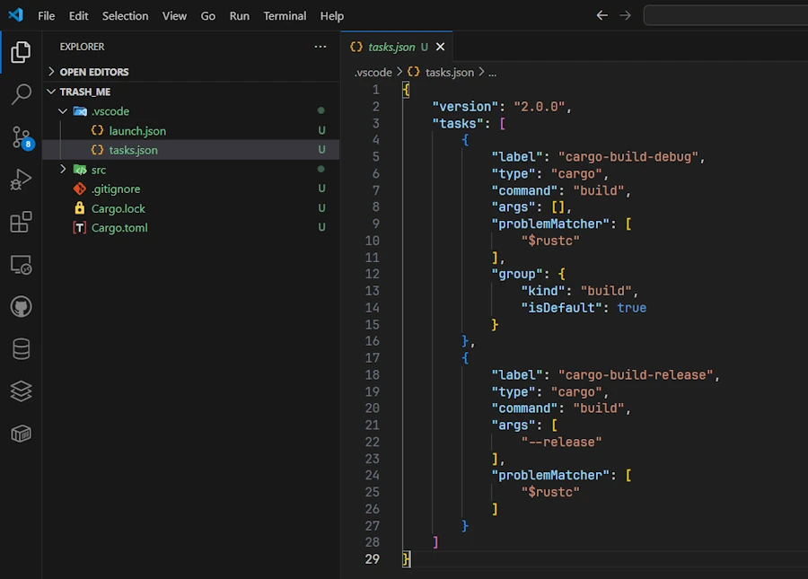

# Rust on Windows 11, My Complete Setup Guide

<div align="center">

</div>

## Install Rust
* From this [page](https://www.rust-lang.org/tools/install)
* Download then run ``rustup-init.exe`` (64b)
<!-- * From this [page](https://rustup.rs/) -->
* Open a terminal and run this command `rustc --version` just to make sure everything is OK.

<div align="center">

</div>


## Install VSCode
* From this [page](https://code.visualstudio.com/download), download and install VSCode


## Install rust-analyzer extension for VSCode
* Open VSCode then from
    * The extensions pane, on the left
    * Or from this [page](https://marketplace.visualstudio.com/items?itemName=rust-lang.rust-analyzer)
* Install ``rust-analyzer``
<div align="center">

</div>


## Setup Linting
* From VSCode
* `CTRL + ,` to open the ``Settings``
* Type in `rust-analyzer check`
* Replace ``check`` by `clippy` in the ``Rust-analyzer > Check : Command`` (see below)

<div align="center">

</div>


## Setup Inlay Hints

By default, I find the type information a little too invasive, unnecessarily lengthening the lines of code and blurring readability. They're very useful, but I'd like to display them on demand.

* In VSCode
* `CTRL + ,` to open the ``Settings``
* Enter `inlay`
* Select `offUnlessPressed`
* Then press `CTRL + ALT` in the editor when you want to check the types of the variables

<div align="center">

</div>

### Not pressing CTRL+ALT
<div align="center">

</div>

### Pressing CTRL+ALT

Do you see the `i32` and `u8` in gray ?

<div align="center">

</div>


## Setup line width
* When saving file the formatter may reformat long lines
* I create a ``rustfmt.toml`` file at the root of the project
* So far my ``rustfmt.toml`` has only only one line

```toml
max_width = 200
```

* [Read this page](https://rust-lang.github.io/rustfmt/?version=v1.8.0&search=)


## OneDrive

* <span style="color:red"><b>IMPORTANT</b></span>
* In **EVERY** project
* Add a `.cargo/` directory
* In the directory add a file named `config.toml` with a content similar to:

```toml
[build]
target-dir = "<%USERPROFILE%>/rust_builds/Documents/Tmp/042_deleteme"
```

Here is an example:

<div align="center">
<br/>
<span><code>.cargo/config.toml</code> file</span>
</div>

* Nothing change for you: `cargo run`, `cargo test`...
* No, you don't have to create the `<%USERPROFILE%>/rust_builds/` directory. It will be created for you.
* Yes, this can be done afterwards.
    * I would leave the current projet and close VSCode
    * Delete the local `target/` folder
    * Create `.cargo/config.toml` as explained above
    * Reload the project in VSCode

### Why?
* You want your project files on OneDrive
* You don't want the thousands of small files created during the builds to be monitored by OneDrive. To give you an idea my `std_usage_analyzer` project has release and debug builds. The build directory is 3.8 GB and 5340 files.
* So we just tell the Rust build system where to build the application (lib respectively)


### How do I do?
* If I work on `C:\Users\phili\OneDrive\Documents\Programmation\rust\01_xp\036_std_usage_analyzer`
* The `config.toml` contains: `C:/Users/phili/rust_builds/Documents/Programmation/rust/01_xp/036_std_usage_analyzer`
    * If you don't know where is your "home", open a PowerShell terminal then enter `ls env:USERPROFILE`
* Doing so I have the same organization in both trees (projects, builds)
* If your project contains multiple workspaces, only one `.cargo/config.toml` file is needed at the root of the project
* I created a `New-RustProject.ps1` script to automate all this. See the [Optional](#optional) section at the end of this post.


## Debugging code 1/2
* Install [Build Tools for Visual Studio](https://visualstudio.microsoft.com/downloads/)
    * This is my preferred option because [I code in C++.](). It comes with everything : compiler, linker, debugger...
    * Others may install [CodeLLDB VSCode extension](https://marketplace.visualstudio.com/items?itemName=vadimcn.vscode-lldb). It only provides a debugger. May be enough if you plan to only use Rust.

<div align="center">

</div>

<!-- https://visualstudio.microsoft.com/visual-cpp-build-tools/ -->

<!-- * Optional. You can install [this extension](https://marketplace.visualstudio.com/items?itemName=ms-vscode.cpptools) if you plan to use C++  -->

* Open a terminal
* Create a project (`cargo new rust_test4web`)

<div align="center">

</div>

* `cd .\rust_test4web\`
* `code .`
* Copy the lines below for example in the file `src\main.rs`

```rust
fn main() {
    let x = 5;
    println!("{}", x);

    let y = 6u8;
    println!("{}", y);

    let mut zoubida = 18;
    println!("{}", zoubida);

    zoubida = 19;
    println!("{}", zoubida);
}

```
* Set a breakpoint on line 8
    * See below the red dot on the left
    * You can either click or strike ``F9`` when the cursor is on the line of interest
* In the editor click on the "Debug" (see below in the red rectangle)

<div align="center">

</div>

* A `target/debug` directory is created
* While looking for the outputs, keep in mind they occurs in the ``DEBUG CONSOLE`` **not** in the `TERMINAL`. See below

<div align="center">

</div>

* Once the code stops on the line, you can then inspect variables, go step by step...

<div align="center">

</div>


## Debugging code 2/2
If you want to debug code when you press F5 and have more options (like passing arguments for example)
* Create a `.vscode` folder at the root of the project
* Create a `tasks.json` file in that directory
* Copy and paste the lines below

```json
{
    "version": "2.0.0",
    "tasks": [
        {
            "label": "cargo-build-debug",
            "type": "cargo",
            "command": "build",
            "args": [],
            "problemMatcher": [
                "$rustc"
            ],
            "group": {
                "kind": "build",
                "isDefault": true
            }
        },
        {
            "label": "cargo-build-release",
            "type": "cargo",
            "command": "build",
            "args": [
                "--release"
            ],
            "problemMatcher": [
                "$rustc"
            ]
        }
    ]
}

```
* Save the ``.json`` file (`CTRL+S`)
* Create a `launch.json` file in the `.vscode` folder
* Copy and paste the lines below

```json
{
    "version": "0.2.0",
    "configurations": [
        {
            "type": "cppvsdbg",
            "request": "launch",
            "name": "Debug",
            "program": "${workspaceFolder}/target/debug/${workspaceFolderBasename}.exe",
            "args": [],
            "cwd": "${workspaceFolder}",
            "environment": [
                {
                    "name": "RUST_BACKTRACE",
                    "value": "short"
                }
            ],
            "preLaunchTask": "cargo-build-debug"
        },
        {
            "type": "cppvsdbg",
            "request": "launch",
            "name": "Release",
            "program": "${workspaceFolder}/target/release/${workspaceFolderBasename}.exe",
            "args": [],
            "cwd": "${workspaceFolder}",
            "environment": [
                {
                    "name": "RUST_BACKTRACE",
                    "value": "short"
                }
            ],
            "preLaunchTask": "cargo-build-release"
        }
    ]
}
```

### If LLDB extension is installed

### `launch.json`
```json
{
    "version": "0.2.0",
    "configurations": [
        {
            "type": "lldb",
            "request": "launch",
            "name": "Debug",
            "program": "${workspaceFolder}/target/debug/${workspaceFolderBasename}.exe",
            "args": [],
            "cwd": "${workspaceFolder}",
            "env": {
                "RUST_BACKTRACE": "1"
            },
            "sourceLanguages": ["rust"],
            "preLaunchTask": "cargo-build-debug",

        },
        {
            "type": "lldb",
            "request": "launch",
            "name": "Release",
            "program": "${workspaceFolder}/target/release/${workspaceFolderBasename}.exe",
            "args": [],
            "cwd": "${workspaceFolder}",
            "env": {
                "RUST_BACKTRACE": "1"
            },
            "sourceLanguages": ["rust"],
            "preLaunchTask": "cargo-build-release"
        }
    ]
}
```

### `tasks.json`
```json
{
    "version": "2.0.0",
    "tasks": [
        {
            "label": "cargo-build-debug",
            "type": "cargo",
            "command": "build",
            "args": [],
            "problemMatcher": [
                "$rustc"
            ],
            "group": {
                "kind": "build",
                "isDefault": true
            }
        },
        {
            "label": "cargo-build-release",
            "type": "cargo",
            "command": "build",
            "args": [
                "--release"
            ],
            "problemMatcher": [
                "$rustc"
            ]
        }
    ]
}
```


Here is how it should look like

<div align="center">

</div>


* On the left hand side, click on the `Run & Debug` icon (the bug and the triangle icon, `CTRL+SHIFT+D` otherwise)
    * Make sure the current config in the list box is set on ``Debug``
    * See below

<div align="center">

</div>


* Switch back to the code
* Set a breakpoint somewhere
* Press `F5`
    * A `target/debug` directory is created
    * The debugger stops on the breakpoint

<div align="center">

</div>


## 3 ways to run the Debug version of your code without the debugger

Make sure the current configuration is still `Debug`

### Option 1 :
* If you press ``CTRL+F5`` this run the Debug version of the code but without debugging it
* So, the debugger does not stop on the breakpoint.

### Option 2 :
* In the editor
* Click `Run` (instead of `Debug`)

<div align="center">

</div>

### Option 3 :
* In VSCode
* Open a terminal ``CTRL+ù`` (azerty keyboard)
* Enter `cargo run`

<div align="center">

</div>


## Create and Run a Release Version 1/2

* On the left hand side, click on the `Run & Debug` icon (`CTRL+SHIFT+D`)
    * Make sure the current config is set on ``Release``

<div align="center">

</div>

* You can either press F5 or CTRL+F5
* A `target/release` directory is created


## Create and Run a Release Version 2/2
* In VSCode
* Open a terminal ``CTRL+ù`` (azerty keyboard)
* Enter `cargo run --release`


## How to build only (either, Debug or Release version)

### Option 1 :
* Click on ``Terminal/Run Task...`` option
* Select ``cargo-build-debug`` or ``cargo-build-release``

<div align="center">

</div>

### Option 2 :
* Open a terminal in VSCode
* Either type `cargo build` or `cargo build --release`


## Optional

### Color Syntax for `.toml` files
* In VSCode install "Even Better TOML" extension

<div align="center">

</div>


### Get hints help & support while editing cargo.toml files
* Mostly helps when editing versions of the crates to be included in the project
* In VSCode install "dependi" extension (crates extension is now deprecated)

<div align="center">

</div>


### My PowerShell script to create the projects

0. Get the [script](assets/New-RustProject.ps1)
1. Copy the script in a folder then add the latter to the PATH.
2. Follow the instructions below to check


```powershell
cd $env:USERPROFILE/OneDrive/Documents/Tmp
help New-RustProject # check the script is in the PATH
New-RustProject.ps1 my_prj 042_deleteme # create a folder 042_deleteme with a project my_prj
cd ./042_deleteme/
cargo check # no target/ folder is created
ls $env:USERPROFILE/rust_builds/Documents/Tmp/042_deleteme # a debug/ folder should be there
cd
Remove-Item -Path $env:USERPROFILE/rust_builds/Documents/Tmp/042_deleteme -Recurse -Force
Remove-Item -Path $env:USERPROFILE/OneDrive/Documents/Tmp/042_deleteme -Recurse -Force
```

**DO NOT COPY** the script below as is. Indeed I had lot of difficulties to render it since it contains backticks etc. It is safer to download it. However if you really want to copy and paste the code below, then, modify the `DOCUMENTATION FILES` section and surround the 3 `cargo` instructions with 6 backticks as shown below:

<div align="center">
<br/>
</div>


```powershell
# How to:
# Copy the script in a folder then add the latter to the PATH
#   $rustDir = "C:\Users\phili\OneDrive\Documents\Programmation\rust"
#   $currentPath = [Environment]::GetEnvironmentVariable("Path", "User")
#   [Environment]::SetEnvironmentVariable("Path", "$currentPath;$rustDir", "User")

# Notes
# .\New-RustProject.ps1 my_prj 011_my_prj
# .\New-RustProject.ps1 -PRJ_NAME my_project -Author "John Doe" -LicenseType Apache -GitInit
# Remove-Item -Path "011_my_prj" -Recurse -Force

param (
    [Parameter(Mandatory = $true, HelpMessage = "Project name (snake_case)")]
    [string]$PRJ_NAME,

    [Parameter(Mandatory = $false, HelpMessage = "Directory name (if different from project name)")]
    [string]$DIR_NAME,

    [Parameter(Mandatory = $false, HelpMessage = "Author name for LICENSE")]
    [string]$Author = "40tude",

    [Parameter(Mandatory = $false, HelpMessage = "License type: MIT, Apache, or None")]
    [ValidateSet("MIT", "Apache", "None")]
    [string]$LicenseType = "MIT",

    [Parameter(Mandatory = $false, HelpMessage = "Initialize git repository")]
    [switch]$GitInit
)

# Stop execution on any error
$ErrorActionPreference = "Stop"

# ============================================================================
# VALIDATION
# ============================================================================

Write-Host "Validating inputs..." -ForegroundColor Cyan

# Validate PRJ_NAME follows Rust naming conventions (snake_case)
if ($PRJ_NAME -notmatch '^[a-z][a-z0-9_]*$') {
    throw "Invalid project name '$PRJ_NAME'. Rust project names must be snake_case (lowercase letters, numbers, underscores only, must start with letter)."
}

# Check if cargo is installed
Write-Host "Checking cargo installation..." -ForegroundColor Cyan
try {
    $null = Get-Command cargo -ErrorAction Stop
}
catch {
    throw "Cargo not found. Please install Rust from https://rustup.rs/"
}

# ============================================================================
# HELPER FUNCTIONS
# ============================================================================

function New-FileIfNotExists {
    param (
        [string]$Path,
        [string]$Content = ""
    )

    if (-not (Test-Path $Path)) {
        if ($Content) {
            Set-Content -Path $Path -Value $Content -Encoding UTF8
        }
        else {
            New-Item -ItemType File -Path $Path | Out-Null
        }
        Write-Host "  Created: $Path" -ForegroundColor Green
    }
    else {
        Write-Host "  Exists: $Path" -ForegroundColor Yellow
    }
}

function New-DirectoryIfNotExists {
    param ([string]$Path)

    if (-not (Test-Path $Path)) {
        New-Item -ItemType Directory -Path $Path | Out-Null
        Write-Host "  Created: $Path" -ForegroundColor Green
    }
    else {
        Write-Host "  Exists: $Path" -ForegroundColor Yellow
    }
}

# ============================================================================
# PROJECT CREATION
# ============================================================================

$ProjectDir = if ($DIR_NAME) { $DIR_NAME } else { $PRJ_NAME }

Write-Host "`nCreating Rust project '$PRJ_NAME'..." -ForegroundColor Cyan

# Create Rust project
if ($DIR_NAME) {
    cargo new $ProjectDir --name $PRJ_NAME
}
else {
    cargo new $PRJ_NAME
}

# Verify project directory exists
if (-not (Test-Path $ProjectDir)) {
    throw "Project directory '$ProjectDir' was not created."
}

Push-Location $ProjectDir
Write-Host "Project created successfully`n" -ForegroundColor Green

# ============================================================================
# CARGO CONFIG (redirect target/ outside OneDrive)
# ============================================================================

Write-Host "Creating Cargo config..." -ForegroundColor Cyan

# Get the full path of the project directory
$FullProjectPath = (Get-Location).Path

# Build the OneDrive base path dynamically
$OneDriveBase = Join-Path $env:USERPROFILE "OneDrive"

# Check if the project is inside OneDrive
if ($FullProjectPath.StartsWith($OneDriveBase, [System.StringComparison]::OrdinalIgnoreCase)) {
    # Extract the relative path after OneDrive\
    $RelativePath = $FullProjectPath.Substring($OneDriveBase.Length).TrimStart('\')

    # Build the target-dir path with forward slashes for TOML compatibility
    $RustBuildsBase = "$env:USERPROFILE/rust_builds" -replace '\\', '/'
    $RelativePathForward = $RelativePath -replace '\\', '/'
    $TargetDir = "$RustBuildsBase/$RelativePathForward"

    # Create .cargo directory and config.toml
    New-DirectoryIfNotExists -Path ".cargo"

    $CargoConfigContent = @"
[build]
target-dir = "$TargetDir"
"@

    New-FileIfNotExists -Path ".cargo\config.toml" -Content $CargoConfigContent
    Write-Host "  Target directory redirected to: $TargetDir" -ForegroundColor Green
}
else {
    Write-Host "  Project is not in OneDrive, skipping target redirection" -ForegroundColor Yellow
}

# ============================================================================
# DIRECTORY STRUCTURE
# ============================================================================

Write-Host "`nCreating directory structure..." -ForegroundColor Cyan
New-DirectoryIfNotExists -Path "docs"

# ============================================================================
# DOCUMENTATION FILES
# ============================================================================

Write-Host "`nCreating documentation files..." -ForegroundColor Cyan

# README.md template
$ReadmeContent = @"
# $PRJ_NAME

## Description

[Add project description here]

## Installation

cargo build --release

## Usage

cargo run

## Testing

cargo test

## License

$LicenseType License - see [LICENSE](LICENSE) for details


## Contributing
This project is developed for personal and educational purposes. Feel free to explore and use it to enhance your own learning.

Given the nature of the project, external contributions are not actively sought nor encouraged. However, constructive feedback aimed at improving the project (in terms of speed, accuracy, comprehensiveness, etc.) is welcome. Please note that this project is being created as a hobby and is unlikely to be maintained once my initial goal has been achieved.
"@

New-FileIfNotExists -Path "README.md" -Content $ReadmeContent

# docs/notes.md
$NotesContent = @"
# Development Notes

## TODO

- [ ] Initial setup
- [ ] First implementation

## Ideas

[Add your ideas here]
"@

New-FileIfNotExists -Path "docs\notes.md" -Content $NotesContent

# ============================================================================
# LICENSE
# ============================================================================

Write-Host "`nCreating LICENSE..." -ForegroundColor Cyan

if ($LicenseType -eq "MIT") {
    $LicenseContent = @"
MIT License

Copyright (c) 2025 $Author

Permission is hereby granted, free of charge, to any person obtaining a copy
of this software and associated documentation files (the "Software"), to deal
in the Software without restriction, including without limitation the rights
to use, copy, modify, merge, publish, distribute, sublicense, and/or sell
copies of the Software, and to permit persons to whom the Software is
furnished to do so, subject to the following conditions:

The above copyright notice and this permission notice shall be included in all
copies or substantial portions of the Software.

THE SOFTWARE IS PROVIDED "AS IS", WITHOUT WARRANTY OF ANY KIND, EXPRESS OR
IMPLIED, INCLUDING BUT NOT LIMITED TO THE WARRANTIES OF MERCHANTABILITY,
FITNESS FOR A PARTICULAR PURPOSE AND NONINFRINGEMENT. IN NO EVENT SHALL THE
AUTHORS OR COPYRIGHT HOLDERS BE LIABLE FOR ANY CLAIM, DAMAGES OR OTHER
LIABILITY, WHETHER IN AN ACTION OF CONTRACT, TORT OR OTHERWISE, ARISING FROM,
OUT OF OR IN CONNECTION WITH THE SOFTWARE OR THE USE OR OTHER DEALINGS IN THE
SOFTWARE.
"@
    New-FileIfNotExists -Path "LICENSE.md" -Content $LicenseContent

}
elseif ($LicenseType -eq "Apache") {
    $LicenseContent = @"
Apache License
Version 2.0, January 2004
http://www.apache.org/licenses/

Copyright 2025 $Author

Licensed under the Apache License, Version 2.0 (the "License");
you may not use this file except in compliance with the License.
You may obtain a copy of the License at

    http://www.apache.org/licenses/LICENSE-2.0

Unless required by applicable law or agreed to in writing, software
distributed under the License is distributed on an "AS IS" BASIS,
WITHOUT WARRANTIES OR CONDITIONS OF ANY KIND, either express or implied.
See the License for the specific language governing permissions and
limitations under the License.
"@
    New-FileIfNotExists -Path "LICENSE.md" -Content $LicenseContent

}
else {
    Write-Host "  No license file created (LicenseType = None)" -ForegroundColor Yellow
}

# ============================================================================
# .ENV FILE
# ============================================================================

Write-Host "`nCreating environment file..." -ForegroundColor Cyan
$EnvContent = @"
# Environment variables for $PRJ_NAME
# Add your sensitive configuration here
"@

New-FileIfNotExists -Path ".env" -Content $EnvContent

# ============================================================================
# .GITIGNORE
# ============================================================================

Write-Host "`nUpdating .gitignore..." -ForegroundColor Cyan

$GitIgnoreFile = ".gitignore"
$GitIgnoreLines = @()

if (Test-Path $GitIgnoreFile) {
    # Force array result even for single line
    $GitIgnoreLines = @(Get-Content $GitIgnoreFile)
}

# Normalize '/target' to 'target/'
$GitIgnoreLines = @($GitIgnoreLines | ForEach-Object {
        if ($_ -eq "/target") { "target/" } else { $_ }
    })

# Required entries
$RequiredEntries = @(
    "target/",
    "temp/",
    ".env"
)

# Add missing entries
foreach ($Entry in $RequiredEntries) {
    if ($GitIgnoreLines -notcontains $Entry) {
        $GitIgnoreLines += $Entry
    }
}

# Write each line separately with newline
$GitIgnoreLines -join "`n" | Set-Content -Path $GitIgnoreFile -Encoding UTF8 -NoNewline
Add-Content -Path $GitIgnoreFile -Value "" -Encoding UTF8

Write-Host "  Updated .gitignore" -ForegroundColor Green

# ============================================================================
# GIT INITIALIZATION
# ============================================================================

if ($GitInit) {
    Write-Host "`nInitializing git repository..." -ForegroundColor Cyan

    # Check if already a git repo
    if (Test-Path ".git") {
        Write-Host "  Git repository already initialized" -ForegroundColor Yellow
    }
    else {
        git init
        Write-Host "  Git repository initialized" -ForegroundColor Green

        # Optional: Create initial commit
        git add .
        git commit -m "Initial commit: $PRJ_NAME project setup"
        Write-Host "  Initial commit created" -ForegroundColor Green
    }
}

# Return to initial directory
Pop-Location

# ============================================================================
# SUMMARY
# ============================================================================

Write-Host "`n============================================" -ForegroundColor Cyan
Write-Host "Project '$PRJ_NAME' created successfully!" -ForegroundColor Green
Write-Host "============================================" -ForegroundColor Cyan
Write-Host "Location: $(Resolve-Path $ProjectDir)" -ForegroundColor White
Write-Host "Author: $Author" -ForegroundColor White
Write-Host "License: $LicenseType" -ForegroundColor White
if ($GitInit) {
    Write-Host "Git: Initialized with initial commit" -ForegroundColor White
}
Write-Host "`nNext steps:" -ForegroundColor Cyan
Write-Host "  1. Edit README.md with project description" -ForegroundColor White
Write-Host "  2. Start coding in src/main.rs" -ForegroundColor White
Write-Host "  3. Run 'cargo run' to test" -ForegroundColor White
Write-Host "`nHappy coding! 🦀" -ForegroundColor Cyan

```


## This may help
* Read this [page](https://code.visualstudio.com/docs/languages/rust)
* Enter `rustup doc` in a terminal
