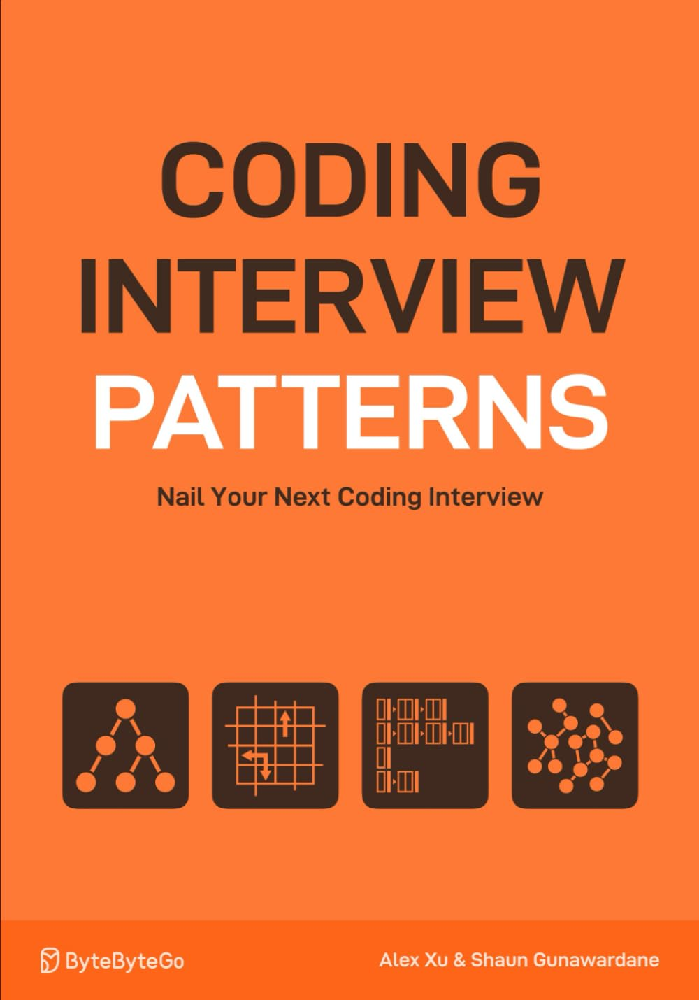

# Rust and Functional Programming: A Beginner’s Top 10 Functions

## TL;DR

These functions come from the [`Iterator`](https://doc.rust-lang.org/std/iter/trait.Iterator.html) trait in Rust and embody the principles of functional programming.

* Transformations without mutation
* Operation compositions (chaining is done using dot `.`)
* Immutability
* Expressions (returns values) rather than statements
    * In Rust if is an expression

<div align="center">

</div>


## 1. `map`

Transforms each element of an iterator.

```rust
fn main() {
    let numbers = vec![1, 2, 3];
    let doubled: Vec<_> = numbers.iter().map(|x| x * 2).collect();
    println!("{:?}", doubled); // [2, 4, 6]
}
```


## 2. `filter`

Keep elements matching a condition.

<!-- ```rust
fn main() {
    let numbers = vec![1, 2, 3, 4];
    let even: Vec<_> = numbers.iter().filter(|x| *x % 2 == 0).collect();
    println!("{:?}", even); // [2, 4]
}
``` -->

```rust
fn main() {
    let even: Vec<_> = (3..10).filter(|x| *x % 2 == 0).collect();
    println!("{:?}", even); // [4, 6, 8]
}
```


## 3. `fold`

Accumulates a value from an iterator (uses an initial value). A true Swiss army knife.

```rust
fn main() {
    let numbers = vec![1, 2];
    let sum = numbers.iter().fold(42, |acc, x| {
        acc + x
    });
    println!("{}", sum); // 45
}
```


## 4. `reduce`

Like `.fold()`, but without init value (it uses the first element as initial value).

```rust
fn main() {
    let numbers = vec![1, 2, 3, 4];
    let product = numbers.iter().copied().reduce(|a, b| a * b);
    println!("{:?}", product); // Some(24)
}
```


## 5. `for_each`

Applies a function immediately (not lazy like `.map()`) to each element, mainly for side effects like printing, logging, etc.

```rust
fn main() {
    let numbers = vec![1, 2, 3];
    numbers.iter().for_each(|x| print!("{} - ", x * 10)); // 10 - 20 - 30 -
}
```


## 6. `chain`

Concatenates two iterators.

```rust
fn main() {
    let a = vec![1, 2];
    let b = vec![3, 4];
    let chained: Vec<_> = a.iter().chain(b.iter()).collect();
    println!("{:?}", chained); // [1, 2, 3, 4]
}
```


## 7. `zip`

Associates the elements of two iterators together.

```rust
fn main() {
    let names = vec!["Alice", "Bob"];
    let ages = vec![30, 40];
    let pairs: Vec<_> = names.iter().zip(ages.iter()).collect();
    println!("{:?}", pairs); // [("Alice", 30), ("Bob", 40)]
}
```


## 8. `flatten`

Flattens an iterator of iterators.

```rust
fn main() {
    let nested = vec![vec![1, 2], vec![3, 4]];
    let flat: Vec<_> = nested.into_iter().flatten().collect();
    println!("{:?}", flat); // [1, 2, 3, 4]
}
```


## 9. `filter_map`

Filters and transforms in a single pass.

```rust
fn main() {
    let strings = vec!["42", "abc", "93"];
    let numbers: Vec<_> = strings.iter().filter_map(|s| s.parse::<i32>().ok()).collect();
    println!("{:?}", numbers); // [42, 93]
}
```


## 10. `any` / `all`

Checks whether **at least one** (`any`) or **all** (`all`) elements satisfy a condition.

```rust
fn main() {
    let numbers = vec![1, 2, 3, 4];
    let any_even = numbers.iter().any(|x| x % 2 == 0);
    let all_even = numbers.iter().all(|x| x % 2 == 0);
    println!("Any even? {}", any_even); // true
    println!("All even? {}", all_even); // false
}
```


## Why ?
Why should I spend my time learning some functional programming? Let's go back to the first sample code I used to illustrate `map`

```rust
fn main() {
    let numbers = vec![1, 2, 3];
    let doubled: Vec<_> = numbers.iter().map(|x| x * 2).collect();
    println!("{:?}", doubled); // [2, 4, 6]
}
```
What would be the iterative equivalent code ?

```rust
fn main() {
    let numbers = vec![1, 2, 3];
    let mut doubled = Vec::new(); // Create a new empty vector

    for num in &numbers { // Iterate over references to the elements
        doubled.push(num * 2); // Double the value and push it to the new vector
    }
    println!("{:?}", doubled); // [2, 4, 6]
}
```

In the second version it is important to note that **we must create a mutable** variable `doubled`.

This is **NOT** the case with the functional version where :
* `.iter()` creates an iterator on numbers
* `.map(|x| x * 2)` applies the function to each element: this creates a new, transformed iterator
* `.collect()` consumes the iterator and creates a new `Vec` directly filled with the results

This means there is no need for mutability. So? Here are some of the arguments from functional programming groupies for avoiding mutability.

**1. Fewer errors :**
* When a variable is never mutated, you can be sure that its value will never change after it's created (a kind of "create'n forget" if you wish)
* The developer and the compiler don't have to keep track of every possible change. This means fewer potential bugs, less risk of corrupted state.

**2. Facilitates concurrency & multithreading :**
* If an object is immutable, several threads can access it at the same time without risk of conflict.
* No need for Mutex, RwLock, etc.
* This makes parallelization natural and safe.

**3. Compiler optimization :**
* Immutable data is easier to optimize (e.g., cached, inline, etc.).
* The compiler can make aggressive decisions when they know that nothing changes.

**4. More declarative code :**
* Describe what you want (transform each element) rather than how to do it (initialize a Vec, iterate, push).
* Expressing the intention often lead to shorter, more readable, more maintainable code (because it is supposed to be easier to reason about)


## How ?
How do I do tomorow in the real life? If you did'nt yet, read that book ISBN-10: [1736049135](https://amzn.eu/d/e3MFYEf)

<div align="center">

</div>

You can "read" [my solutions in Rust](https://github.com/40tude/rust_coding_interview) on this GitHub repo.

In chapter 16 (about Greedy algorithms) you are given an array. Each cell contains a positive value which represents the maximum jump distance from the current index. You are asked to determine if, starting at index 0, it is possible to reach the end of the array.

If it is not crystal clear yet, don't worry too much. Just keep in mind that in few minutes we will get a ``for`` loop and we will see how to get rid of it using some functional programming.

Below is an iterative solution. Read the comments and feel free to copy and paste the code in the [Rust Playground](https://play.rust-lang.org/?version=stable&mode=debug&edition=2024). I can't do it for you and I'm not your mother...🤖

```rust
fn jump_to_the_end(nums: &[usize]) -> bool {
    if nums.is_empty() {
        return false;
    }
    // Set initial destination to the last index
    let mut destination = nums.len() - 1;

    // Traverse the array in reverse to see if the destination can be reach by earlier indexes
    for i in (0..nums.len()-1).rev() {
        // if we can reach the destination from current index, the current index becomes the new destination
        if i + nums[i] >= destination {
            destination = i;
        }
    }
    //  If the destination is index 0 we can jump to the end from index 0
    destination == 0
}

fn main() {
    let nums = vec![3, 2, 0, 2, 5];
    println!("{:?}", jump_to_the_end(&nums)); // true

    let nums = vec![2, 1, 0, 3];
    println!("{:?}", jump_to_the_end(&nums)); // false
}
```


Now here is a first version using functional programming
* In the code above, focus on the ``for`` loop in the function `jump_to_the_end()`
* Again, read the comments
* We first set the `destination` index as the last index of the array (`destination = nums.len() - 1`)
* Then, in the `for` loop, starting from the one before last index (`i = nums.len()-1`)
* We check if, from the index where we are, we can reach the destination (`i + nums[i] >= destination` ?)
* If yes, our current index (`i`) becomes the new destination (`destination = i`)


Now the one million dollars question is : How can we translate this `for` loop using some functional programming?

See below one way of doing :


```rust
fn jump_to_the_end(nums: &[usize]) -> bool {
    if nums.is_empty() {
        return false;
    }

    (0..nums.len()) // a range
        .rev() // transforms the range into an iterator reading values in reverse order
        .fold(nums.len() - 1, |destination, i| { // destination is the accumulator, i is the current item
            if i + nums[i] >= destination {
                i           // destination becomes i
            } else {
                destination // otherwise destination stays the same
            }
        }) == 0
}

fn main() {
    let nums = vec![3, 2, 0, 2, 5];
    println!("{:?}", jump_to_the_end(&nums)); // true

    let nums = vec![2, 1, 0, 3];
    println!("{:?}", jump_to_the_end(&nums)); // false
}
```

Again, let's focus on the ``for`` loop.
* We want to traverse each element in reverse order
* Easy... Let's create a range from 0 to the last index : ``(0..nums.len())``
* And reverse it : `(0..nums.len()).rev()`
    * To ease the reading let's spread the pipeline over 2 lines
* Now comes the tricky part...
    * We want to read the value of the cell at the current index (``nums[i]``), add it to the current index `i` and compare the sum with ``destination``
    * In addition, we need an if expression to take a decision
* This is where `.fold()` comes in action. Again, this is a Swiss army knife and you will love it.
    * Like in the first version of the code we set the initial value of the `destination` to `num.len()-1`. See the beginning of the line `.fold(nums.len() - 1,....`
    * Then, the second parameter of `.fold()` is a closure
        * Think about a kind of function if you have no idea of what a closure is
        * If you get lost, take 2 minutes and review the point 3 of the top 10 list above
    * Like any function, a closure accepts parameters. Here, the closure uses 2 parameters : an accumulator and an index. In our case, they are respectively named `destination` and `i`. See the `|destination, i|`
    * Then, like any function, the body of the closure starts right after the opening `{`
    * In the body of the closure we transform the ``if`` expression of the first version of the code in this expression

```rust
if i + nums[i] >= destination {
    i           // destination becomes i
} else {
    destination // otherwise destination stays the same
}
```
* Weird? In fact the key is that in Rust, ``if`` are expressions. They return values. In the code above, the return value of the ``if`` expression is the output of the closure and it is used to update the accumulator (``destination``) of the ``.fold()`` .
    * So in plain English, the code above says : `destination` equals `i` if `i+nums[i]` is greater than `destination`. Otherwise `destination` equals `destination`.
    * At the very end of the pipeline there is a comparaison sign (`==`). Indeed like in the first version of the code, at the end of the traversal of the array `nums` we want to compare if the ``destination`` (the accumulator) is 0 or not and return ``true`` or ``false`` respectively. If needed, check the line `destination == 0` in the first vesion of the code. We do the same thing here.


Can we go one step further? Yes we can ! See below.

The tricky part (`.fold()`) remains the same. However at the beginning, rather than create a range from scratch, we "transform" the array `nums` as an iterator. In fact ``.iter()`` returns an iterator over a slice and nothing is "transformed". Then we `.enumerate()` so that we receive a pair (index, value). Once there, we can use our new friend `.fold()` as before.

```rust
fn jump_to_the_end(nums: &[usize]) -> bool {
    assert!(!nums.is_empty(), "Input cannot be empty");

    nums.iter()
        .enumerate()
        .rev()
        .fold(nums.len() - 1, |destination, (i, &num)| {
            if i + num >= destination {
                i
            } else {
                destination
            }
        }) == 0
}

fn main() {
    let nums = vec![3, 2, 0, 2, 5];
    println!("{:?}", jump_to_the_end(&nums)); // true

    let nums = vec![2, 1, 0, 3];
    println!("{:?}", jump_to_the_end(&nums)); // false
}
```


### What about Performances ?

With the current processors and optimized compilers it is a waste of time to talk about performances. The only thing you can do is **measure**. This means, create a benchmark. Here are the results I got with the 3 cases above.

The 2 first versions are similar while the third is 2 times slower.

To get the code of the bench [visit this page.](https://github.com/40tude/rust_coding_interview/blob/main/16_greedy/assets/bench_jump/README.md)

```
for loop                time:   [2.0784 µs 2.0833 µs 2.0892 µs]
Found 11 outliers among 100 measurements (11.00%)
  5 (5.00%) high mild
  6 (6.00%) high severe

fold with range         time:   [2.0918 µs 2.1007 µs 2.1113 µs]
Found 11 outliers among 100 measurements (11.00%)
  5 (5.00%) high mild
  6 (6.00%) high severe

fold with iter enumerate
                        time:   [4.5125 µs 4.5231 µs 4.5351 µs]
Found 11 outliers among 100 measurements (11.00%)
  6 (6.00%) high mild
  5 (5.00%) high severe

```

## What ?

What should be my next steps?

1. Start simple and **re-write** (no copy-paste, please) the 10 sample codes above in [Rust Playground](https://play.rust-lang.org/?version=stable&mode=debug&edition=2024).
2. Read Chapter 13 of [*The Rust Programming Language*](https://doc.rust-lang.org/book/ch13-00-functional-features.html) — it’s a great introduction to Rust’s functional programming features.
3. Look at your own code and identify opportunities to improve it.
4. Again, keep things simple: **find short loops** (`while`, `for`, or `loop` — it doesn’t matter).
5. Try to replace them using some of the functions listed in the Top 10:
   * Experiment with different combinations.
   * Don’t hesitate to get help from ChatGPT or other resources if needed.
6. Bonus: **Practice writing code that avoids mutation** — think "transform" instead of "modify". In this context "modify" means change existing data (mutation) while "transform" means create new data based on existing data (no mutation).

Once you gain some confidence with these Top 10 functions, you should be well-equipped to continue exploring Rust’s functional side on your own.
