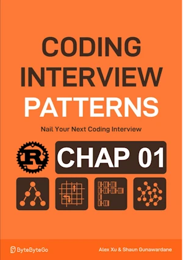

# Next lexicographical sequence

<div align="center">

</div>

* Given a string of lowercase English letters
* **Rearrange** the characters to form a new string representing the next immediate sequence in lexicographical (alphabetical) order.
* If the given string is already the last lexicographical arrangement possible, return the first lexicographical arrangement.

The keyword here is **rearrange**
* Input  : s = "abcd" => Output :     "abdc"
* Input  : s = "dcba" => Output :     "abcd"

 It can help to assign numbers to letters (a=1, b=2, c=3, etc.)
  
 
| ltr  | nbr |
|------|-----|
| abc  | 123 |
| cba  | 321 |

<span style="color:orange"><b>The point:</b></span>    
- We look for the smallest suffix (right hand side) that we can rearrange to get a greater permutation
- We focus on changing the smallest possible suffix that can produce a greater permutation
- We search for the first character that is smaller than the next one (pivot)
- If no pivot is found, the string is already at its maximum "value".
- Then, we return the reversed string (this will become the first lexicographical permutation).
- If a pivot is found, swap it with the next larger character to its right.

**Example:**
- Input: s = "a b c e d d a"
- Pivot is 'c', as it's the first character smaller than its successor 'e':
- Swap pivot 'c' with the right most next larger character ('d'):
- Result: "a b d e d c a"

Notice the suffix after the pivot is "non-increasing".
- To minimize the suffix, reverse it:
- Result: "a b d a c d e"

**Complexity :**

| Time | Space |
|------|-------|
| O(n) | O(n)  |

* Time is O(n) as we traverse the string a few times:
    * Searching for pivot
    * Finding rightmost successor
    * Reversing the suffix
* Space complexity is O(n) due to the letters[] array allocation


**About Rust :**
* `let mut letters: Vec<char> = s.chars().collect(); `
* `return letters.into_iter().rev().collect();`
    * `into_iter()` gives ownership of the elements to the iterator
    * no copying, no additional allocations, no unnecessary clones (`.cloned()`) 
    * **but** `letters` is lost
* `let mut letters = s.as_bytes().to_vec();`
    * `s.as_bytes()` alone would not suffice because it returns an immutable slice `&[u8]` 
* `if pivot.is_none()`
* `return String::from_utf8(letters).expect("Only ASCII chars expected")`
* **YES** : tested on the [Rust Playground](https://play.rust-lang.org/)


<!-- <span style="color:red"><b>TODO : </b></span> 
* Add comments in the source code        
 -->


<!-- * <span style="color:lime"><b>Preferred solution?</b></span>      -->


```rust
fn next_lexicographical_seq(s:&str) -> String {
    // transform the view into a vector of chars (not a String) we can iterate on. 
    // s.chars() is an iterator, .collect() transforms the iterator in a collection. 
    let mut letters: Vec<char> = s.chars().collect(); 
    
    // Look for the pivot
    let mut pivot: Option<usize> = None;
    // length of the array - 1, but with underflow protection. If the array is empty (len() = 0), this will return 0 instead of panicking.
    for i in (0..letters.len().saturating_sub(1)).rev() { 
        if letters[i] < letters[i + 1] {
            pivot = Some(i);
            break;
        }
    }

    // if pivot NOT found the string "value" is already max
    // return the reversed string
    // .collect::<String>() : gather the elements from the iterator into a String
    // Here, Rust use the return type in the function to infer the type of .collect()
    if pivot.is_none() {
        // return letters.iter().rev().collect(); 
        // OK return letters.iter().rev().collect::<String>(); 
        // OK {
        //     reverse() act in-place
        //     letters.reverse();
        //     letters.iter().collect::<String>()
        // }
        // Better, give ownership of the elements to the iterator. 
        // Therefore : no copying, no additional allocations, no unnecessary clones
        return letters.into_iter().rev().collect(); 
    }

    // Get the value from the Option
    let pivot = pivot.unwrap(); //let pivot = pivot.expect("Pivot should exist at this point");
    
    // starting from the right hand side, find the first char "larger" than pivot
    // length of the array - 1, but with underflow protection. If the array is empty (len() = 0), this will return 0 instead of panicking.
    let mut rightmost_successor = letters.len().saturating_sub(1);
    while letters[rightmost_successor] <= letters[pivot]{
        rightmost_successor -= 1;
    }
    
    // swap pivot and rightmost successor
    letters.swap(pivot, rightmost_successor);

     // Reverse the suffix
    letters[pivot + 1..].reverse();

    // Create an Iterator<Item = &char>.
    // Rust must copy each char (via *c or clone()) to build the String
    // Returns the string. Rust use the return type in the function signature to infer the type of .collect()
    // letters[..].iter().collect::<String>()
    // letters.iter().collect()
    
    // Better, give ownership of the elements to the iterator
    // Therefore : no copying, no additional allocations, no unnecessary clones
    letters.into_iter().collect()
}

// fn main(){     // no main() if this code runs in a Jupyter cell 
    println!("{}", next_lexicographical_seq("abcedda"));  // abdacde
    println!("{}", next_lexicographical_seq("ynitsed"));  // ynsdeit
    println!("{}", next_lexicographical_seq("zyx"));      // xyz

// }
```

    abdacde
    ynsdeit
    xyz


## Same as above but with less comments 


```rust
fn next_lexicographical_seq(s:&str) -> String {
    
    let mut letters: Vec<char> = s.chars().collect(); 

    // Look for the pivot
    let mut pivot: Option<usize> = None;
    for i in (0..letters.len().saturating_sub(1)).rev() {
        if letters[i] < letters[i + 1] {
            pivot = Some(i);
            break;
        }
    }

    // if pivot NOT found the string "value" is already max
    // return the reversed string
    if pivot.is_none() {
        return letters.into_iter().rev().collect(); 
    }

    // Get the value from the Option
    let pivot = pivot.unwrap(); 
    
    // starting from the right hand side, find the first char "larger" than pivot
    let mut rightmost_successor = letters.len().saturating_sub(1);
    while letters[rightmost_successor] <= letters[pivot]{
        rightmost_successor -= 1;
    }
    
    // swap pivot and rightmost successor
    letters.swap(pivot, rightmost_successor);

     // Reverse the suffix
    letters[pivot + 1..].reverse();

    // Returns the string. 
    letters.into_iter().collect()
}

// main(){
    println!("{}", next_lexicographical_seq("abcedda"));  // abdacde
    println!("{}", next_lexicographical_seq("ynitsed"));  // ynsdeit
    println!("{}", next_lexicographical_seq("zyx"));  // xyz

// }
```

    abdacde
    ynsdeit
    xyz


## Other way to get `letters` 
* Other way to convert the parameter into a vector of bytes
* Line 4, `s.as_bytes()` would not suffice because it returns an immutable slice `&[u8]` 


```rust
fn next_lexicographical_seq(s:&str) -> String {
    
    // let mut letters: Vec<char> = s.chars().collect(); 
    let mut letters = s.as_bytes().to_vec();
    
    // Look for the pivot
    let mut pivot: Option<usize> = None;
    // length of the array - 1, but with underflow protection. If the array is empty (len() = 0), this will return 0 instead of panicking.
    for i in (0..letters.len().saturating_sub(1)).rev() {
        if letters[i] < letters[i + 1] {
            pivot = Some(i);
            break;
        }
    }

    // if pivot NOT found the string "value" is already max
    // return the reversed string
    if pivot.is_none() {
        letters.reverse(); // In-place reverse
        return String::from_utf8(letters).expect("Only ASCII chars expected")
    }

    // Get the value from the Option
    let pivot = pivot.unwrap(); 
    
    // starting from the right hand side, find the first char "larger" than pivot
    // length of the array - 1, but with underflow protection. If the array is empty (len() = 0), this will return 0 instead of panicking.
    let mut rightmost_successor = letters.len().saturating_sub(1);
    while letters[rightmost_successor] <= letters[pivot]{
        rightmost_successor -= 1;
    }
    
    // swap pivot and rightmost successor
    letters.swap(pivot, rightmost_successor);

     // Reverse the suffix
    letters[pivot + 1..].reverse();

    // Returns the string. 
    // letters.into_iter().collect()
    String::from_utf8(letters).expect("Only ASCII chars expected")
}

// main(){
    println!("{}", next_lexicographical_seq("abcedda"));  // abdacde
    println!("{}", next_lexicographical_seq("ynitsed"));  // ynsdeit
    println!("{}", next_lexicographical_seq("zyx"));  // xyz

// }
```

    abdacde
    ynsdeit
    xyz


## V4

* A more functional way?


```rust
fn next_lexicographical_seq(s: &str) -> String {
    // transform the view into a vector of chars we can iterate on. 
    // s.chars() is an iterator, .collect() transforms the iterator in a collection. 
    let mut letters: Vec<char> = s.chars().collect(); 

    // Find the pivot => last i such that letters[i] < letters[i + 1]
    // pivot is of type Option<usize> because .find() may NOT succeed (None) 
    // (0..letters.len() - 1) is a Range (std::ops::Range<usize>) which implement the Iterator Trait
    // At the end of the .find() pivot = None or Some(i)
    let maybe_index = (0..letters.len() - 1)
        .rev()
        .find(|&i| letters[i] < letters[i + 1]);

    // If "maybe_index" matches the pattern Some(zoubida), then create a local variable named "zoubida" containing the value inside the Option "maybe_index"
    if let Some(zoubida) = maybe_index {
        // pivot found
        // find the smallest char on the right of pivot but larger than letters[pivot]
        let successor = (zoubida + 1..letters.len())
            .rev()
            .find(|&i| letters[i] > letters[zoubida])
            .unwrap();

        // Swap
        letters.swap(zoubida, successor);

        // Reverse the suffix
        letters[zoubida + 1..].reverse();
    } else {
        // pivot NOT found the string "value" is already max
        // Reverse the string
        letters.reverse();
    }

    letters.into_iter().collect()
}

fn main(){
    println!("{}", next_lexicographical_seq("abcedda"));  // abdacde
    println!("{}", next_lexicographical_seq("ynitsed"));  // ynsdeit
    println!("{}", next_lexicographical_seq("zyx"));  // xyz

}    
```

    abdacde
    ynsdeit
    xyz


* <span style="color:lime"><b>Preferred solution?</b></span> 


```rust
// same as before with less comments
fn next_lexicographical_seq(s: &str) -> String {
    let mut letters: Vec<char> = s.chars().collect();

    // Find pivot 
    let maybe_pivot = (0..letters.len() - 1)
        .rev()
        .find(|&i| letters[i] < letters[i + 1]);

    // If pivot exists
    if let Some(pivot) = maybe_pivot {
        // find the smallest char on the right of pivot but larger than letters[pivot]
        let successor = (pivot + 1..letters.len())
            .rev()
            .find(|&i| letters[i] > letters[pivot])
            .unwrap();
        letters.swap(pivot, successor);
        letters[pivot + 1..].reverse(); // Reverse the suffix
    } else {
        letters.reverse(); // Reverse the string
    }
    letters.into_iter().collect()
}

// fn main(){
    println!("{}", next_lexicographical_seq("abcedda"));  // abdacde
    println!("{}", next_lexicographical_seq("ynitsed"));  // ynsdeit
    println!("{}", next_lexicographical_seq("zyx"));  // xyz

// }    
```

    abdacde
    ynsdeit
    xyz

