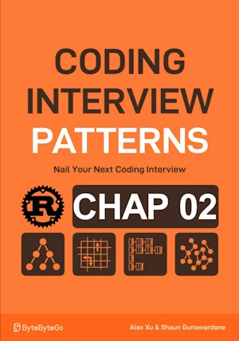

# Zero stripping

<div align="center">

</div>

* For each 0 in an m x n matrix, set its entire row and col to 0 in place


<span style="color:orange"><b>The point:</b></span>    
* Brute force => O(mn x (m + n))
    * Because mn represents the number of zeros if we imagine the matrix consists only of zeros.
    * m + n represents the number of cells in a row and a column combined.

- Note that a cell in a row or column that contains a 0 will becomes a 0
- We create two hash sets with the indexes of rows and columns that contain zeros
- We check in O(1) if a cell (j, i) belongs to a row or column that contains a 0


**Complexity Analysis :**

| Time | Space |
|------|-------|
| O(mn) | O(m+n)  |

- O(mn) because we traverse the matrix twice and perform O(1) operations during each pass.
- O(m + n) because the hash sets grow with the number of rows and columns that contain zeros.


**About Rust :**
* `fn zero_striping_hash_sets(matrix: &mut [Vec<i32>])` rather than `fn zero_striping_hash_sets(matrix: &mut Vec<Vec<i32>>)`
* **YES** : tested on the [Rust Playground](https://play.rust-lang.org/)


<!-- <span style="color:red"><b>TODO : </b></span> 
* Add comments in the source code        
 -->

<!-- * <span style="color:lime"><b>Preferred solution?</b></span>      -->


```rust
use std::collections::HashSet;
fn zero_striping_hash_sets(matrix: &mut [Vec<i32>]){
    
    if matrix.is_empty() || matrix[0].is_empty() {
        return;
    }
    let(m, n) = (matrix.len(), matrix[0].len()); // lines, columns
    let mut zero_rows = HashSet::new();
    let mut zero_cols = HashSet::new();
    
    // Pass 1 : identify rows and cols containing 0 storing he respective index
    for r in 0..m{
        for c in 0..n{
            if matrix[r][c] == 0 {
                zero_rows.insert(r);
                zero_cols.insert(c);
            }
        }
    }
    
    // Pass 2 : set any cell to 0 if its row (resp. col) is in zero_rows (resp. zero_cols)
    for r in 0..m{
        for c in 0..n{
            if zero_rows.contains(&r) || zero_cols.contains(&c){  
                matrix[r][c] = 0;
            }
        }
    }
}
    
// fn main(){     // no main() if this code runs in a Jupyter cell 
    let mut board = vec![
        vec![1, 2, 3, 4, 5],
        vec![6, 0, 8, 9, 9],
        vec![9, 8, 7, 6, 5],
        vec![2, 4, 6, 8, 0],
    ];

    for row in &board {
        println!("{:?}", row);
    }
    
    zero_striping_hash_sets(&mut board);
    
    println!();
    for row in &board {
        println!("{:?}", row);
    }
// }
```

    [1, 2, 3, 4, 5]
    [6, 0, 8, 9, 9]
    [9, 8, 7, 6, 5]
    [2, 4, 6, 8, 0]
    
    [1, 0, 3, 4, 0]
    [0, 0, 0, 0, 0]
    [9, 0, 7, 6, 0]
    [0, 0, 0, 0, 0]


    ()


## V2

**About Rust :**
* To please Clippy
    * Use iterator and no explicit indexing in for loops
* **YES** : tested on the [Rust Playground](https://play.rust-lang.org/)


```rust
use std::collections::HashSet;
fn zero_striping_hash_sets(matrix: &mut [Vec<i32>]){
    
    if matrix.is_empty() || matrix[0].is_empty() {
        return;
    }
    let mut zero_rows = HashSet::new();
    let mut zero_cols = HashSet::new();
    
    // Pass 1 : identify rows and cols containing 0 storing he respective index
    for (r, row) in matrix.iter().enumerate(){            
        for (c, &num) in row.iter().enumerate(){
            if num == 0 {
                zero_rows.insert(r);
                zero_cols.insert(c);
            }
        }
    }
    
    // Pass 2 : set any cell to 0 if its row (resp. col) is in zero_rows (resp. zero_cols)
    for (r, row) in matrix.iter_mut().enumerate(){   
        for (c, cell) in row.iter_mut().enumerate(){
            if zero_rows.contains(&r) || zero_cols.contains(&c){  
                *cell=0
            }
        }
    }
}
    
fn main(){     // no main() if this code runs in a Jupyter cell 
    let mut board = vec![
        vec![1, 2, 3, 4, 5],
        vec![6, 0, 8, 9, 9],
        vec![9, 8, 7, 6, 5],
        vec![2, 4, 6, 8, 0],
    ];

    for row in &board {
        println!("{:?}", row);
    }
    
    zero_striping_hash_sets(&mut board);
    
    println!();
    for row in &board {
        println!("{:?}", row);
    }
}
```

## In-place Zero Tracking

<span style="color:orange"><b>The point:</b></span>    
- If we absolutely want to perform operations in place, we can observe that a row or column containing a 0 will end up containing only zeros.
- Its content doesn't matter, so we can sacrifice it.
- We decide to set to 0 the cells in the first row whose column contains a 0.
- We decide to set to 0 the cells in the first column whose row contains a 0.
- We add two flags to track whether the first row and the first column initially contain any zeros.
    - If so, we will need to set the entire first row and first column to 0 at the end.


**Complexity Analysis :**

| Time | Space |
|------|-------|
| O(mn) | O(1)  |

- O(mn) because checking the first row takes O(m) and the first column takes O(n).
- Then, we perform two passes over the m x n matrix.
- Finally, we iterate over the first row (O(m)) and the first column (O(n)).
- Complexity = O(m) + O(n) + O(mn) + O(m) + O(n) = O(mn).
- O(1) in space because we use the first row and the first column to store flags and zeros.


**About Rust :**
* **YES** : tested on the [Rust Playground](https://play.rust-lang.org/)


```rust
fn zero_stripping(matrix: &mut [Vec<i32>]){
    
    if matrix.is_empty() || matrix[0].is_empty() {
        return;
    }
    let(m, n) = (matrix.len(), matrix[0].len()); // lines, columns

    // Check if the 1st row and 1st col contains 0
    // I keep the line in Python for reference
    // first_row_has_zero = any(matrix[0][j] == 0 for j in range(n))
    let first_row_has_zero = (0..n).any(|j| matrix[0][j] == 0);
    // first_col_has_zero = any(matrix[i][0] == 0 for i in range(m))
    let first_col_has_zero = (0..m).any(|i| matrix[i][0] == 0);                         

    // Use first row and first col as markers
    for r in 1..m {
        for c in 1..n {
            if matrix[r][c] == 0 {
                matrix[0][c] = 0;
                matrix[r][0] = 0;
            }
        }
    }

    // Update the submatrix using the flags in the first row and first col
    for r in 1..m {
        for c in 1..n {
            if matrix[0][c] == 0 || matrix[r][0] == 0{
                matrix[r][c] = 0;
            }
        }
    }

    // if the first row had 0 initially set all elements in it to 0
    if first_row_has_zero {
        for c in 0..n{
            matrix[0][c] = 0;
        }
    }
    
    // if the first col had 0 initially set all elements in it to 0
    if first_col_has_zero {
        for r in 0..m {
            matrix[r][0] = 0;
        }
    }
}

        
// fn main(){

    let mut board = vec![
        vec![1, 2, 0, 4, 5],
        vec![6, 0, 8, 9, 9],
        vec![9, 8, 7, 6, 5],
        vec![2, 4, 6, 8, 0],
    ];

    for row in &board {
        println!("{:?}", row);
    }
    
    zero_stripping(&mut board);
    
    println!();
    for row in &board {
        println!("{:?}", row);
    }
// }
```

    [1, 2, 0, 4, 5]
    [6, 0, 8, 9, 9]
    [9, 8, 7, 6, 5]
    [2, 4, 6, 8, 0]
    
    [0, 0, 0, 0, 0]
    [0, 0, 0, 0, 0]
    [9, 0, 0, 6, 0]
    [0, 0, 0, 0, 0]


    ()


## V2

**About Rust :**
* To please Clippy
    * When possible, use iterator and no explicit indexing in for loops
* **YES** : tested on the [Rust Playground](https://play.rust-lang.org/)


```rust
fn zero_stripping(matrix: &mut [Vec<i32>]){
    
    if matrix.is_empty() || matrix[0].is_empty() {
        return;
    }
    let(m, n) = (matrix.len(), matrix[0].len()); // lines, columns

    // Check if the 1st row and 1st col contains 0
    // I keep the line in Python for reference
    // first_row_has_zero = any(matrix[0][j] == 0 for j in range(n))
    let first_row_has_zero = (0..n).any(|j| matrix[0][j] == 0);
    // first_col_has_zero = any(matrix[i][0] == 0 for i in range(m))
    let first_col_has_zero = (0..m).any(|i| matrix[i][0] == 0);                         

    // Use first row and first col as markers
    for r in 1..m {
        for c in 1..n {
            if matrix[r][c] == 0 {
                matrix[0][c] = 0;
                matrix[r][0] = 0;
            }
        }
    }

    // Update the submatrix using the flags in the first row and first col
    for r in 1..m {
        for c in 1..n {
            if matrix[0][c] == 0 || matrix[r][0] == 0{
                matrix[r][c] = 0;
            }
        }
    }

    // if the first row had 0 initially set all elements in it to 0
    if first_row_has_zero {
        for c in 0..n{
            matrix[0][c] = 0;
        }
    }
    
    // if the first col had 0 initially set all elements in it to 0
    if first_col_has_zero {
        for row in matrix.iter_mut(){
            row[0] = 0;
        }
    }
}

        
fn main(){

    let mut board = vec![
        vec![1, 2, 0, 4, 5],
        vec![6, 0, 8, 9, 9],
        vec![9, 8, 7, 6, 5],
        vec![2, 4, 6, 8, 0],
    ];

    for row in &board {
        println!("{:?}", row);
    }
    
    zero_stripping(&mut board);
    
    println!();
    for row in &board {
        println!("{:?}", row);
    }
}
```
