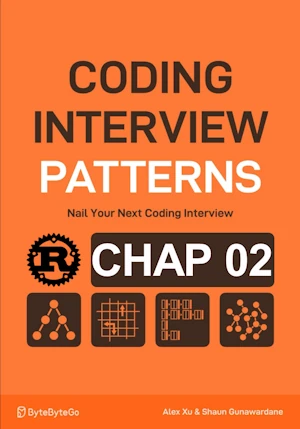

# Geometric Sequence Triplets

<div align="center">

</div>

* A geometric sequence triplet is a sequence of three numbers where each successive number is obtained by multiplying the preceding number by a constant called the common ratio.
    - 1 2 4
    - 5 15 45
* Given an array of integers and a common ratio r
* Find all triplets of indexes (i, j, k) that follow a geometric sequence for i < j < k.
* It’s possible to encounter duplicate triplets in the array.

If **Input:** nums = [2, 1, 2, 4, 8, 8], r = 2 then **Output:** 5

* We are looking for x, x·r, x·r².
* If we know one value of a triplet, we can calculate what the other two values should be.
* We need to find them in order: x, x·r, x·r² in the array.


<span style="color:orange"><b>The point:</b></span>    

- Instead, we search for x/r, x, and x·r because this way, we always look for x/r on the left and x·r on the right.
- To perform O(1) lookups, we use hash maps (left and right).
- x must be divisible by r.
- Since the same value can appear multiple times in the array, we may find the same number of x/r and x·r.

**Summary:**
- Check if x % r == 0.
- Count the occurrences of x/r on the left and x·r on the right.
- Multiply these two counts to get the number of triplets.

**Check the implementation on p23**
* Initially, we store all values in the right hash map.
* We take the first x from the left side of the array.
* Dynamic management of the left and right hash maps.


**Complexity Analysis :**

| Time | Space |
|------|-------|
| O(n) | O(n)  |

- We traverse the array once and perform O(1) operations on the hash maps at each iteration.
- Space complexity is O(n) because the hash map can grow up to n elements.


**About Rust :**
* `for &x in nums{` does not consume ``nums`` 
* `*right_map.entry(x).or_insert(0) += 1;` prefered to `right_map.entry(x).and_modify(|counter| *counter += 1).or_insert(1);`
* ``my_hashmap.get_mut(key)`` returns `Option<&mut V>`
* `let left_count = *left_map.get(&left_key).unwrap_or(&0);`
    * ``.get`` returns ``Option<&V>`` NOT ``Option<V>``
    * ``.unwrap_or(&0)`` provides a reference to a static 0
        * If ``.unwrap_or(0)`` was used, a temporary ``i32`` zero valued variable would be created (lifetime issue) 
* **YES** : tested on the [Rust Playground](https://play.rust-lang.org/)


<!-- <span style="color:red"><b>TODO : </b></span> 
* Add comments in the source code        
 -->


<!-- * <span style="color:lime"><b>Preferred solution?</b></span>      -->


```rust
use std::collections::HashMap;

fn geometric_sequence_triplets(nums: &[i32], r: i32) -> i32 {
    let mut left_map = HashMap::new();
    let mut right_map = HashMap::new();
    let mut count = 0;

    // populate right_map
    for &x in nums {
        // .or_insert(0) ensures default value is 0 when accessing a key that doesn't exist
        // it returns a mutable ref
        *right_map.entry(x).or_insert(0) += 1;
        
        // alternative
        // right_map.entry(x).and_modify(|counter| *counter += 1).or_insert(1);
    }

    // does not consume nums
    for &x in nums {
        // decrement x from right_map
        // .get_mut() returns Option<&mut V>
        if let Some(value) = right_map.get_mut(&x) {
            *value -= 1;
        }

        if x % r == 0 {
            let left_key = x / r;
            let right_key = x * r;

            // .get returns Option<&V> NOT Option<V>
            // .unwrap_or(&0) provides a reference to a static 0
            // If .unwrap_or(0) was used, a temporary i32 zero valued variable would be created (lifetime issue) 
            let left_count = *left_map.get(&left_key).unwrap_or(&0);
            let right_count = *right_map.get(&right_key).unwrap_or(&0);

            count += left_count * right_count;
        }

        // increment freq of x in left_map. Now it will be part of the "left" side of the array as we move to the right
        *left_map.entry(x).or_insert(0) += 1;
    }
    count
}

// fn main(){     // no main() if this code runs in a Jupyter cell 
    let nums = vec![2, 1, 2, 4, 8, 8];
    let r = 2;
    println!("{}", geometric_sequence_triplets(&nums, r)); // 5
// }

```

    5

