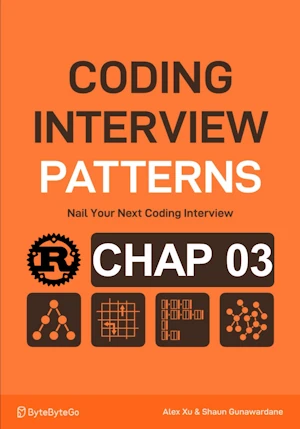

# Linked List Reversal Recursive

<div align="center">

</div>

* Revese a singly linked list
   
**Complexity Analysis :**

One pass


| Time | Space |
|------|-------|
| O(n) | O(1)  |

- Time, because we perform constant time pointer manipulation at each node
- Space, because in place


**About Rust :**
* **YES** : tested on the [Rust Playground](https://play.rust-lang.org/)


<!-- <span style="color:red"><b>TODO : </b></span> 
* Add comments in the source code        
-->

<!-- * <span style="color:lime"><b>Preferred solution?</b></span>      -->


```rust
type Link = Option<Box<Node>>; // type alias. Use Option and Box to allow an optional pointer to the next node 

struct Node {
    val: i32,
    next: Link, // use the alias here for clarity
}

impl Node {
    fn new(val: i32, next: Link) -> Self {
        Self { val, next }
    }
}

fn reverse_list_recursive(current: Link, prev: Link) -> Link {
    match current {
        None => prev, // Reached the end: return the new head
        Some(mut node) => {
            let next = node.next.take(); // Detach next
            node.next = prev; // Reverse the pointer
            reverse_list_recursive(next, Some(node)) // Recurse with next node
        }
    }
}

fn reverse_list(head: Link) -> Link {
    reverse_list_recursive(head, None)
}


// fn main(){     // no main() if this code runs in a Jupyter cell 
{                 // local scope to avoid issue with the lifetime of head during borrow

    let mut head = None; // Start with an empty list (head is None)
    
    let vals = vec![1, 2, 3, 4];
    for v in vals.into_iter().rev() {
        head = Some(Box::new(Node::new(v, head)));
    }

    head = reverse_list(head);

    let mut current = head.as_ref(); 
    while let Some(node) = current {
        print!("{}->", node.val); // Access the value
        current = node.next.as_ref(); // Move to the next node
    }
    println!("EOL") // End of List
    

} // end of local scope OR end of main()       
```

    4
    3
    2
    1


    ()


