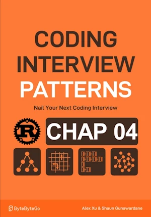

# Linked List Midpoint

<div align="center">

</div>

* Given a singly linked list, find ans return its middle node. If there are 2 middle nodes, returns the second one

<span style="color:orange"><b>The point:</b></span>
* Use 2 ptrs : One fast and one slow
* Fast move 2 steps at a time (``fast = fast.next.next``)
* When fast ptr reaches the end of list, slow pointer is in the middle
    * If len of list is odd => slow in the middle when fast.ext is None
    * If len of list is even => slow on the second middle when fast is None (p 78)


**Complexity :**

| Time | Space |
|------|-------|
| O(n) | O(1)  |

* O(n) because we traverse the list
* O(1) in space because no growing datastructure are created


**About Rust :**
* We only need to read => ``Box<T>``
* **YES** : tested on the [Rust Playground](https://play.rust-lang.org/)


<!-- <span style="color:red"><b>TODO : </b></span> 
* Add comments in the source code        
 -->

<!-- * <span style="color:lime"><b>Preferred solution?</b></span>      -->


```rust
type Link = Option<Box<Node>>; // type alias. Use Option and Box to allow an optional pointer to the next node 

struct Node {
    val: i32,
    next: Link, // use the alias here for clarity
}

impl Node {
    fn new(val: i32, next: Link) -> Self {
        Self { val, next }
    }
}

// Function to find the midpoint of the linked list
fn linked_list_midpoint(head: &Link) -> &Node {
    let mut slow = head;
    let mut fast = head;

    // Traverse the list using two pointers
    while let Some(f_node) = fast {
        if let Some(f_next) = &f_node.next {
            fast = &f_next.next;
            if let Some(s_node) = slow {
                slow = &s_node.next;
            }
        } else {
            break;
        }
    }
    // At this point, slow points to the midpoint node
    slow.as_ref().unwrap()
}

// fn main(){     // no main() if this code runs in a Jupyter cell 
{                 // local scope to avoid issue with the lifetime of head during borrow
    
    let mut head = None; // Start with an empty list (head is None)
    let vals = vec![1, 2, 42, 7, 3];
    for v in vals.into_iter().rev() {
        head = Some(Box::new(Node::new(v, head)));
    }

    let mut current = &head; 
    while let Some(node) = current {
        print!("{}->", node.val); // Access the value
        current = &node.next; // Move to the next node
    }
    println!("None");

    // Find and print the midpoint
    let mid = linked_list_midpoint(&head);
    println!("Value at midpoint: {}", mid.val);
} // end of local scope OR end of main()       

```

    1->2->42->7->3->None
    Value at midpoint: 42


    ()


### If asked to return the first midpoint when there are 2 middle nodes

**About Rust :**
* **YES** : tested on the [Rust Playground](https://play.rust-lang.org/)


```rust
type Link = Option<Box<Node>>; // type alias. Use Option and Box to allow an optional pointer to the next node 

struct Node {
    val: i32,
    next: Link, // use the alias here for clarity
}

impl Node {
    fn new(val: i32, next: Link) -> Self {
        Self { val, next }
    }
}


// Function to find the midpoint of the linked list
fn linked_list_midpoint(head: &Link) -> &Node {
    let mut slow = head;
    let mut fast = head;

    while let Some(f_node) = fast {
        if let Some(f_next) = &f_node.next {
            if let Some(f_next_next) = &f_next.next {
                // Move fast forward two steps
                fast = &f_next_next.next;

                // Move slow forward one step
                if let Some(s_node) = slow {
                    slow = &s_node.next;
                }
                continue; // Explicit, but not necessary
            }
        }
        break;
    }
    // At this point, slow points to the midpoint node
    slow.as_ref().unwrap()
}


// fn main(){     // no main() if this code runs in a Jupyter cell 
{                 // local scope to avoid issue with the lifetime of head during borrow
    
    let mut head = None; // Start with an empty list (head is None)
    let vals = vec![1, 2, 4, 7];
    for v in vals.into_iter().rev() {
        head = Some(Box::new(Node::new(v, head)));
    }

    let mut current = &head; 
    while let Some(node) = current {
        print!("{}->", node.val); // Access the value
        current = &node.next; // Move to the next node
    }
    println!("None");

    // Find and print the midpoint
    let mid = linked_list_midpoint(&head);
    println!("Value at first midpoint: {}", mid.val);
} // end of local scope OR end of main()       
```

    1->2->4->7->None
    Value at first midpoint: 2


    ()


